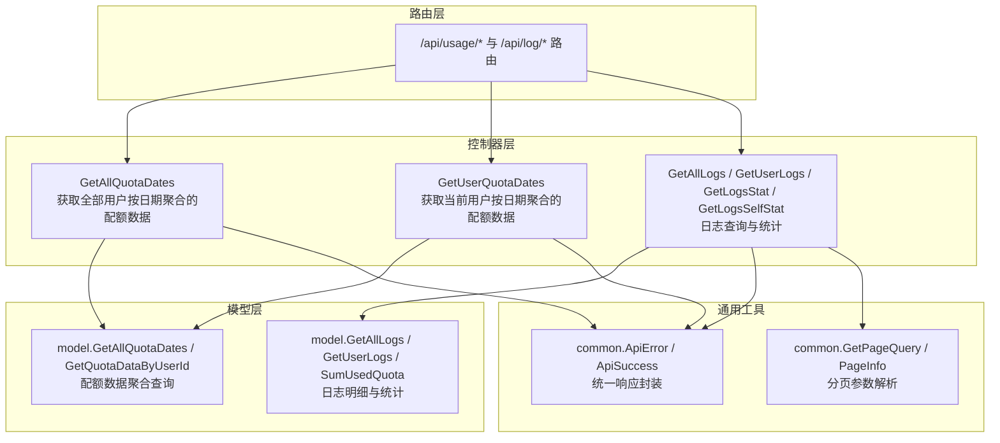
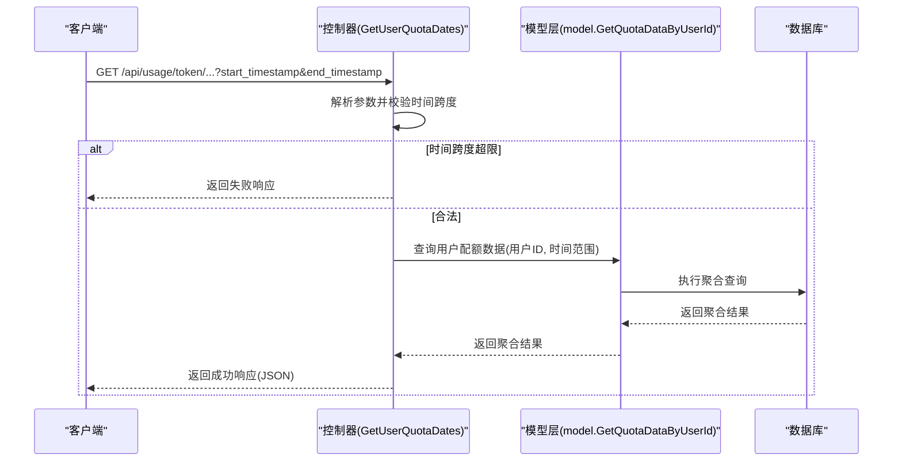
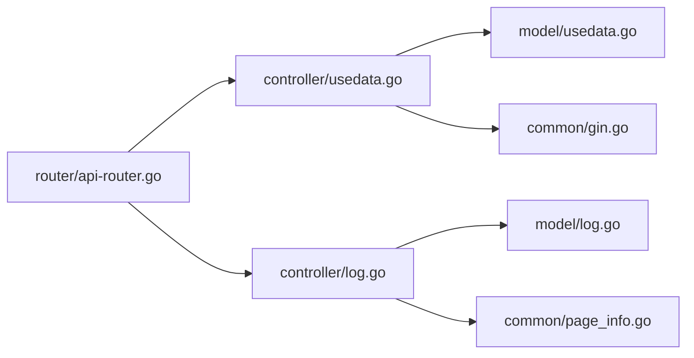

# 使用量查询API

<cite>
**本文引用的文件列表**
- [controller/usedata.go](file://controller/usedata.go)
- [controller/log.go](file://controller/log.go)
- [model/usedata.go](file://model/usedata.go)
- [model/log.go](file://model/log.go)
- [common/gin.go](file://common/gin.go)
- [common/page_info.go](file://common/page_info.go)
- [router/api-router.go](file://router/api-router.go)
</cite>

## 目录
1. [简介](#简介)
2. [项目结构](#项目结构)
3. [核心组件](#核心组件)
4. [架构总览](#架构总览)
5. [详细组件分析](#详细组件分析)
6. [依赖分析](#依赖分析)
7. [性能考量](#性能考量)
8. [故障排查指南](#故障排查指南)
9. [结论](#结论)
10. [附录](#附录)

## 简介
本文件面向“使用量查询API”的完整技术文档，聚焦于以下两个控制器接口：
- 获取全部用户按日期聚合的配额使用数据：GetAllQuotaDates
- 获取当前登录用户按日期聚合的配额使用数据：GetUserQuotaDates

内容涵盖：
- HTTP参数定义与校验
- 响应格式规范
- 业务逻辑与安全限制（如时间跨度限制）
- 与模型层交互方式及错误处理策略
- 与日志查询接口的互补关系（汇总统计 vs 明细追溯）
- 前端调用示例与分页处理建议

## 项目结构
使用量查询API位于控制器层与模型层之间，通过Gin框架接收HTTP请求，调用模型层方法进行数据查询，并统一返回JSON响应。日志查询API位于同一路由组下，二者共同构成“统计分析”与“明细追溯”的互补体系。

图表来源
- [router/api-router.go](file://router/api-router.go#L172-L200)
- [controller/usedata.go](file://controller/usedata.go#L1-L54)
- [controller/log.go](file://controller/log.go#L1-L170)
- [model/usedata.go](file://model/usedata.go#L104-L129)
- [model/log.go](file://model/log.go#L205-L304)
- [common/gin.go](file://common/gin.go#L104-L124)
- [common/page_info.go](file://common/page_info.go#L41-L83)

章节来源
- [router/api-router.go](file://router/api-router.go#L172-L200)

## 核心组件
- 控制器接口
  - GetAllQuotaDates：管理员或具备相应权限的用户可查询全站按日期聚合的配额使用数据。
  - GetUserQuotaDates：当前登录用户查询自己的按日期聚合的配额使用数据。
- 模型层方法
  - GetAllQuotaDates：按时间范围与可选用户名聚合查询配额数据。
  - GetQuotaDataByUserId：按用户ID与时间范围查询配额数据。
- 统一响应封装
  - ApiError：失败时返回统一格式的错误响应。
  - ApiSuccess：成功时返回统一格式的成功响应（日志接口使用）。

章节来源
- [controller/usedata.go](file://controller/usedata.go#L1-L54)
- [model/usedata.go](file://model/usedata.go#L104-L129)
- [common/gin.go](file://common/gin.go#L104-L124)

## 架构总览
使用量查询API的调用链路如下：
- 客户端发送HTTP请求至控制器接口
- 控制器解析HTTP参数并进行必要校验（如时间跨度限制）
- 控制器调用模型层方法执行数据库查询
- 模型层返回聚合后的数据
- 控制器封装统一响应并返回给客户端

图表来源
- [controller/usedata.go](file://controller/usedata.go#L30-L52)
- [model/usedata.go](file://model/usedata.go#L111-L116)

## 详细组件分析

### 接口：GetAllQuotaDates
- 请求路径与方法
  - 方法：GET
  - 路径：/api/usage/token/...（结合路由组“/api/usage”）
- HTTP参数
  - start_timestamp：开始时间戳（秒），整数
  - end_timestamp：结束时间戳（秒），整数
  - username：可选，字符串；当提供时仅查询该用户的配额数据
- 响应格式
  - 成功：{"success": true, "message": "", "data": 聚合数据数组}
  - 失败：{"success": false, "message": 错误信息}
- 业务逻辑
  - 调用模型层 GetAllQuotaDates(startTimestamp, endTimestamp, username)
  - 若 username 为空，则按时间范围对全站数据进行聚合（按模型名与创建时间分组）
  - 若 username 非空，则仅查询该用户的配额数据
- 错误处理
  - 模型层返回错误时，控制器调用统一错误封装 ApiError 返回给客户端

章节来源
- [controller/usedata.go](file://controller/usedata.go#L13-L28)
- [model/usedata.go](file://model/usedata.go#L118-L129)
- [common/gin.go](file://common/gin.go#L104-L109)

### 接口：GetUserQuotaDates
- 请求路径与方法
  - 方法：GET
  - 路径：/api/usage/token/...（结合路由组“/api/usage”）
- HTTP参数
  - start_timestamp：开始时间戳（秒），整数
  - end_timestamp：结束时间戳（秒），整数
  - 用户上下文：控制器从请求上下文中获取当前登录用户的ID
- 响应格式
  - 成功：{"success": true, "message": "", "data": 聚合数据数组}
  - 失败：{"success": false, "message": 错误信息}
- 业务逻辑
  - 从请求上下文获取用户ID
  - 校验时间跨度不超过1个月（2592000秒）
  - 调用模型层 GetQuotaDataByUserId(userId, startTimestamp, endTimestamp)
- 安全考虑：时间跨度限制
  - 限制单次查询的时间跨度为1个月，防止一次性拉取过大范围导致数据库压力与响应延迟
- 错误处理
  - 模型层返回错误时，控制器调用统一错误封装 ApiError 返回给客户端

章节来源
- [controller/usedata.go](file://controller/usedata.go#L30-L52)
- [model/usedata.go](file://model/usedata.go#L111-L116)
- [common/gin.go](file://common/gin.go#L104-L109)

### 与日志查询接口的互补关系
- 使用量查询API（GetAllQuotaDates / GetUserQuotaDates）
  - 聚合维度：按日期（精确到小时级缓存聚合）与模型名分组
  - 输出字段：包含计数、配额、token使用量等聚合指标
  - 用途：用于统计分析、趋势展示、仪表盘
- 日志查询API（GetAllLogs / GetUserLogs / GetLogsStat / GetLogsSelfStat）
  - 明细维度：按日志记录逐条返回
  - 输出字段：包含用户ID、用户名、模型名、token用量、通道、分组、IP等
  - 用途：用于明细追溯、审计、问题定位
- 互补性
  - 汇总接口用于宏观统计，日志接口用于微观明细
  - 汇总接口基于缓存聚合表，日志接口基于原始日志表

章节来源
- [controller/log.go](file://controller/log.go#L1-L170)
- [model/log.go](file://model/log.go#L205-L304)
- [model/log.go](file://model/log.go#L317-L367)

## 依赖分析
- 控制器到模型层
  - GetAllQuotaDates -> model.GetAllQuotaDates
  - GetUserQuotaDates -> model.GetQuotaDataByUserId
- 控制器到通用工具
  - 统一错误封装：common.ApiError
  - 日志接口使用：common.ApiSuccess 与 common.GetPageQuery
- 路由绑定
  - /api/usage 下的令牌使用量相关接口
  - /api/log 下的日志查询与统计接口

图表来源
- [controller/usedata.go](file://controller/usedata.go#L1-L54)
- [model/usedata.go](file://model/usedata.go#L104-L129)
- [common/gin.go](file://common/gin.go#L104-L124)
- [controller/log.go](file://controller/log.go#L1-L170)
- [model/log.go](file://model/log.go#L205-L304)
- [common/page_info.go](file://common/page_info.go#L41-L83)
- [router/api-router.go](file://router/api-router.go#L172-L200)

## 性能考量
- 聚合粒度与时序
  - 配额数据在写入时按小时粒度聚合缓存，查询时直接从聚合表读取，避免大范围扫描
- 时间范围限制
  - GetUserQuotaDates 对单次查询时间跨度进行限制，降低数据库压力与响应时间
- 分页策略
  - 日志查询接口采用分页参数解析与限制，避免一次性返回过多数据
- 缓存与批量写入
  - 聚合数据写入采用批量更新策略，减少数据库写操作次数

章节来源
- [model/usedata.go](file://model/usedata.go#L58-L102)
- [controller/usedata.go](file://controller/usedata.go#L30-L52)
- [common/page_info.go](file://common/page_info.go#L41-L83)

## 故障排查指南
- 常见错误类型
  - 参数解析错误：start_timestamp/end_timestamp 非法或超出允许范围
  - 时间跨度超限：GetUserQuotaDates 中超过1个月
  - 数据库查询错误：模型层查询失败
- 统一错误响应
  - 控制器在发生错误时调用 ApiError，返回 {"success": false, "message": 错误信息}
- 排查步骤
  - 检查HTTP参数是否正确传入
  - 确认时间范围是否符合限制
  - 查看服务端日志以定位数据库异常
  - 对比日志查询接口的返回，确认数据一致性

章节来源
- [controller/usedata.go](file://controller/usedata.go#L30-L52)
- [common/gin.go](file://common/gin.go#L104-L109)

## 结论
使用量查询API通过控制器与模型层的清晰分工，实现了对配额使用数据的高效聚合查询，并在接口层面内置了时间跨度限制以保障系统稳定性。配合日志查询API，形成“统计分析（汇总）”与“明细追溯（日志）”的完整闭环，满足运营监控与问题定位的双重需求。

## 附录

### HTTP参数与响应规范
- GetAllQuotaDates
  - 参数：start_timestamp（秒）、end_timestamp（秒）、username（可选）
  - 响应：{"success": true/false, "message": "", "data": 聚合数据数组}
- GetUserQuotaDates
  - 参数：start_timestamp（秒）、end_timestamp（秒）
  - 响应：{"success": true/false, "message": "", "data": 聚合数据数组}
  - 安全限制：时间跨度不得超过1个月

章节来源
- [controller/usedata.go](file://controller/usedata.go#L13-L52)
- [model/usedata.go](file://model/usedata.go#L104-L129)

### 与日志查询接口的关系
- 汇总接口（使用量）
  - 聚合维度：按小时与模型名分组
  - 输出：计数、配额、token使用量
- 明细接口（日志）
  - 维度：逐条日志记录
  - 输出：用户、模型、通道、分组、IP等

章节来源
- [controller/log.go](file://controller/log.go#L1-L170)
- [model/log.go](file://model/log.go#L205-L304)

### 前端调用示例与分页建议
- 前端调用示例（示意）
  - GET /api/usage/token/?start_timestamp=1700000000&end_timestamp=1700086400
  - GET /api/usage/token/?start_timestamp=1700000000&end_timestamp=1700086400&username=alice
- 分页处理建议（参考日志接口）
  - 使用分页参数：p（页码）、page_size（每页数量）
  - 服务端默认页大小与最大限制可在分页工具中查看
  - 将 total 字段用于前端分页控件渲染

章节来源
- [controller/log.go](file://controller/log.go#L13-L31)
- [common/page_info.go](file://common/page_info.go#L41-L83)