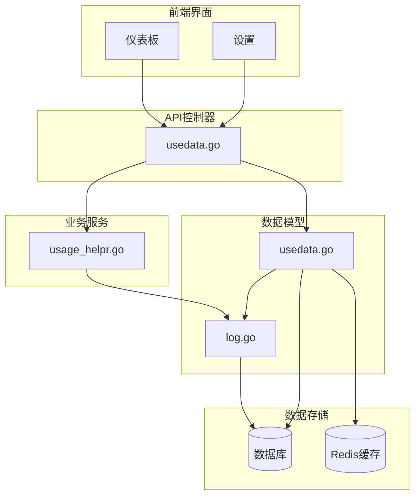
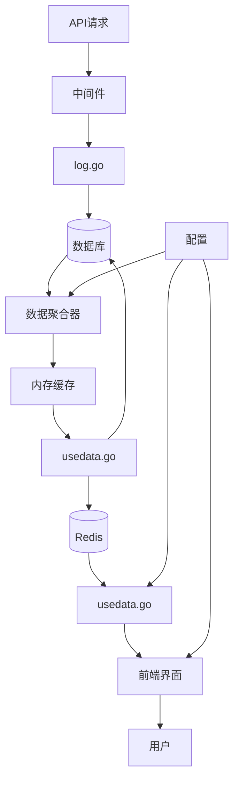
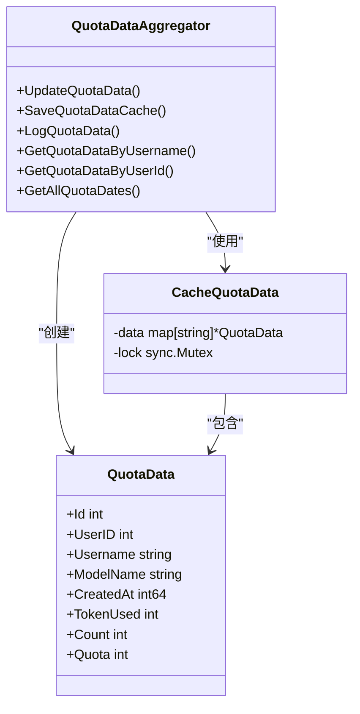
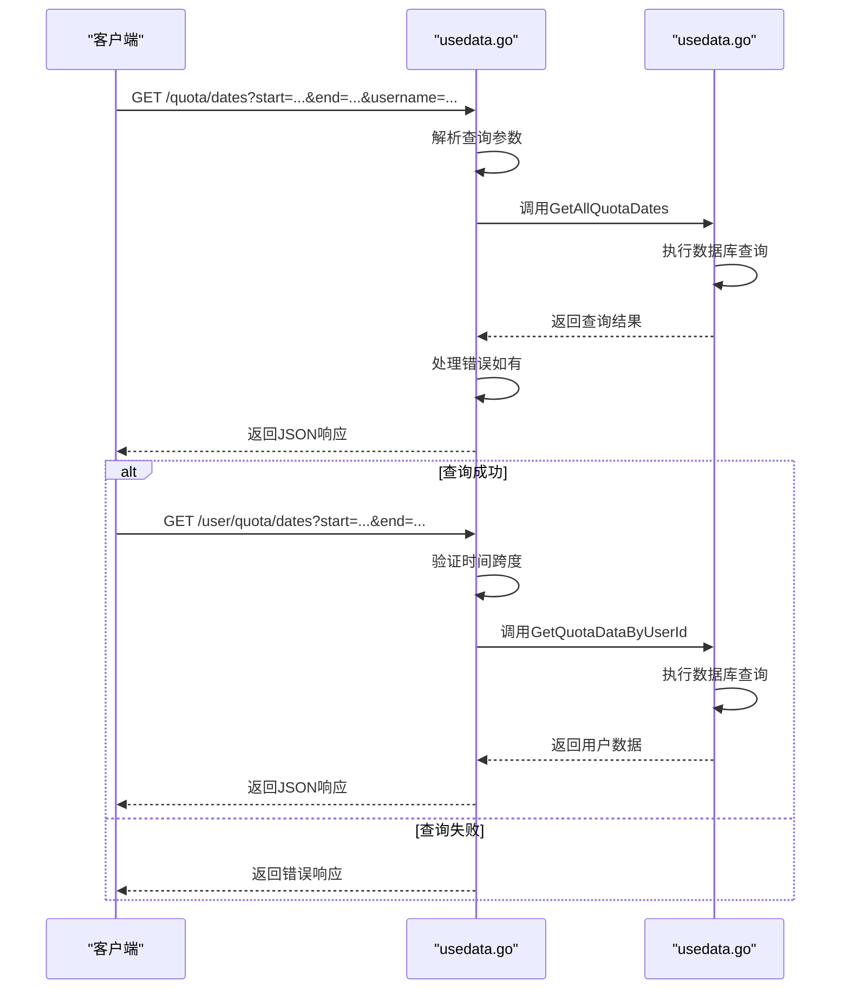
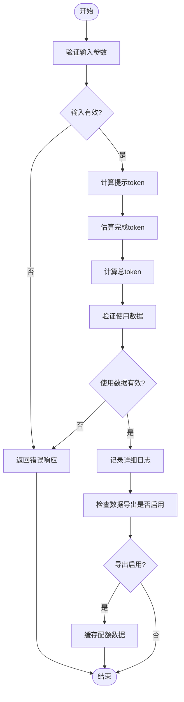
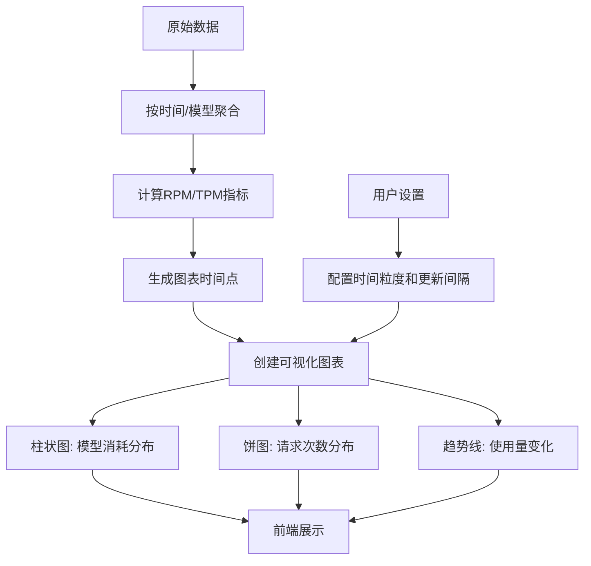
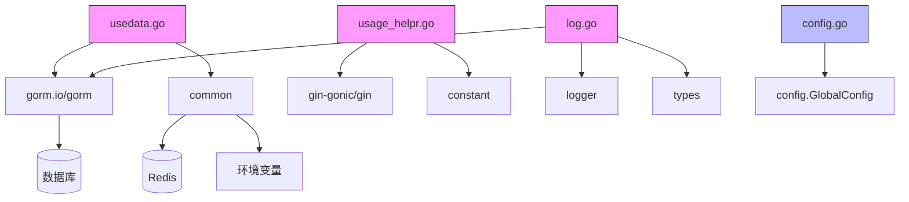

# 使用量跟踪

<cite>
**本文档中引用的文件**   
- [usedata.go](file://model/usedata.go)
- [usedata.go](file://controller/usedata.go)
- [usage_helpr.go](file://service/usage_helpr.go)
- [log.go](file://model/log.go)
- [config.go](file://setting/console_setting/config.go)
- [redis.go](file://common/redis.go)
- [dashboard.jsx](file://web/src/helpers/dashboard.jsx)
- [SettingsDataDashboard.jsx](file://web/src/pages/Setting/Dashboard/SettingsDataDashboard.jsx)
</cite>

## 目录
1. [项目结构](#项目结构)
2. [核心组件](#核心组件)
3. [架构概述](#架构概述)
4. [详细组件分析](#详细组件分析)
5. [依赖分析](#依赖分析)
6. [性能考虑](#性能考虑)
7. [故障排除指南](#故障排除指南)
8. [结论](#结论)

## 项目结构

该AI API项目具有清晰的分层架构，主要分为以下几个核心模块：

- **model**：包含数据模型定义，如 `usedata.go` 中的使用量数据结构和 `log.go` 中的日志记录结构
- **controller**：处理HTTP请求，如 `usedata.go` 提供的使用量查询接口
- **service**：实现业务逻辑，如 `usage_helpr.go` 中的token计算服务
- **common**：提供通用工具和配置
- **setting**：系统设置和配置管理
- **web**：前端界面和可视化组件

使用量跟踪功能主要集中在 `model/usedata.go`、`controller/usedata.go` 和 `service/usage_helpr.go` 这三个文件中，通过日志系统 `model/log.go` 收集原始数据，并最终生成可视化报告。

**图表来源**
- [usedata.go](file://model/usedata.go)
- [usage_helpr.go](file://service/usage_helpr.go)
- [log.go](file://model/log.go)

**章节来源**
- [model/usedata.go](file://model/usedata.go)
- [controller/usedata.go](file://controller/usedata.go)
- [service/usage_helpr.go](file://service/usage_helpr.go)
- [model/log.go](file://model/log.go)

## 核心组件

使用量跟踪系统的核心组件包括用户使用数据存储结构、查询接口、数据聚合算法和报告生成机制。系统通过 `QuotaData` 结构体存储聚合后的使用量数据，包含用户ID、用户名、模型名称、创建时间、token消耗和请求计数等字段。

数据收集流程始于API请求处理，通过 `service/usage_helpr.go` 中的 `ResponseText2Usage` 函数计算token使用量，然后在 `model/log.go` 中记录详细的日志信息。这些日志信息随后被聚合到 `model/usedata.go` 的 `QuotaData` 结构中，实现高效的查询和分析。

系统支持分页、过滤和聚合分析功能，通过配置化的更新间隔和时间粒度设置，满足不同场景下的使用量监控需求。前端界面提供了丰富的可视化选项，包括柱状图、饼图和趋势线，帮助用户直观理解使用模式。

**章节来源**
- [model/usedata.go](file://model/usedata.go#L1-L129)
- [service/usage_helpr.go](file://service/usage_helpr.go#L1-L34)
- [model/log.go](file://model/log.go#L1-L412)

## 架构概述

使用量跟踪系统的架构设计遵循分层原则，从数据收集到可视化展示形成完整的闭环。系统首先通过中间件收集每个API请求的详细信息，包括请求量、token消耗和响应时间等，存储在 `Log` 结构体中。

随后，系统通过后台任务定期将原始日志数据聚合到 `QuotaData` 结构体中，这个过程通过内存缓存和数据库批量操作优化性能。聚合后的数据支持高效的查询操作，前端通过API接口获取数据并生成各种可视化图表。

系统架构还包括Redis缓存层，用于存储预计算结果和频繁访问的数据，减少数据库查询压力。配置管理系统允许用户调整数据更新间隔、默认时间粒度等参数，实现灵活的监控策略。

**图表来源**
- [model/usedata.go](file://model/usedata.go)
- [model/log.go](file://model/log.go)
- [controller/usedata.go](file://controller/usedata.go)
- [common/redis.go](file://common/redis.go)

**章节来源**
- [model/usedata.go](file://model/usedata.go)
- [model/log.go](file://model/log.go)
- [controller/usedata.go](file://controller/usedata.go)

## 详细组件分析

### 用户使用数据存储结构分析

`model/usedata.go` 文件定义了 `QuotaData` 结构体，这是使用量跟踪的核心数据模型。该结构体包含多个关键字段：`UserID` 和 `Username` 用于标识用户，`ModelName` 记录使用的模型名称，`CreatedAt` 存储时间戳（精确到小时），`TokenUsed` 记录消耗的token数量，`Count` 统计请求次数，`Quota` 存储配额消耗。

数据存储采用两级缓存机制：首先在内存中通过 `CacheQuotaData` map 缓存聚合数据，然后定期通过 `SaveQuotaDataCache` 函数批量写入数据库。这种设计有效减少了数据库的写入压力，提高了系统性能。`LogQuotaData` 函数负责将新的使用记录添加到内存缓存中，确保数据的实时性。

**图表来源**
- [model/usedata.go](file://model/usedata.go#L12-L22)

**章节来源**
- [model/usedata.go](file://model/usedata.go#L1-L129)

### 查询接口分析

`controller/usedata.go` 文件提供了两个主要的查询接口：`GetAllQuotaDates` 和 `GetUserQuotaDates`。这些接口基于Gin框架实现，接受时间范围、用户名等参数，返回相应的使用量数据。

`GetAllQuotaDates` 接口支持全局查询，可以获取指定时间范围内所有用户的使用量数据，支持按用户名过滤。`GetUserQuotaDates` 接口则针对特定用户，增加了时间跨度限制（不超过一个月），防止过度查询影响系统性能。

接口实现中包含了错误处理机制，当查询出错时通过 `common.ApiError` 返回标准化的错误响应。查询结果以JSON格式返回，包含成功状态、消息和数据数组，便于前端解析和展示。

**图表来源**
- [controller/usedata.go](file://controller/usedata.go#L13-L54)

**章节来源**
- [controller/usedata.go](file://controller/usedata.go#L1-L54)

### 数据聚合算法分析

`service/usage_helpr.go` 文件中的数据聚合算法主要负责计算token使用量和验证使用数据的有效性。`ResponseText2Usage` 函数根据响应文本和模型名称估算token数量，结合已知的提示token数量，生成完整的使用统计。

算法实现中考虑了不同模型的token计算差异，通过 `EstimateTokenByModel` 函数进行模型特定的估算。`ValidUsage` 函数确保使用数据的有效性，只有包含实际token消耗的记录才会被处理。

这些算法与 `model/log.go` 中的详细日志记录紧密关联，日志系统在记录消费日志时调用这些服务，确保每个API请求的使用量都被准确记录。`RecordConsumeLog` 函数在记录日志的同时，如果启用了数据导出功能，会异步调用 `LogQuotaData` 将数据添加到聚合缓存中。

**图表来源**
- [service/usage_helpr.go](file://service/usage_helpr.go#L22-L34)
- [model/log.go](file://model/log.go#L156-L203)

**章节来源**
- [service/usage_helpr.go](file://service/usage_helpr.go#L1-L34)
- [model/log.go](file://model/log.go#L156-L203)

### 报告生成与可视化分析

系统通过前端组件实现使用量报告的生成和可视化展示。`web/src/helpers/dashboard.jsx` 文件中的工具函数负责数据处理和图表生成，支持每日、每周和每月的使用报告。

报告生成过程包括数据聚合、时间序列分析和趋势计算。`aggregateDataByTimeAndModel` 函数按时间和模型对数据进行聚合，`calculateTrendData` 函数计算RPM（每分钟请求数）和TPM（每分钟token数）等指标。前端界面提供多种可视化选项，包括柱状图显示模型消耗分布，饼图显示请求次数分布，以及趋势线显示使用量变化。

用户可以通过设置界面调整报告的默认时间粒度（小时、天、周）和更新间隔，满足不同的监控需求。系统还支持数据导出功能，便于进一步分析和存档。

**图表来源**
- [web/src/helpers/dashboard.jsx](file://web/src/helpers/dashboard.jsx)
- [web/src/pages/Setting/Dashboard/SettingsDataDashboard.jsx](file://web/src/pages/Setting/Dashboard/SettingsDataDashboard.jsx)

**章节来源**
- [web/src/helpers/dashboard.jsx](file://web/src/helpers/dashboard.jsx)
- [web/src/pages/Setting/Dashboard/SettingsDataDashboard.jsx](file://web/src/pages/Setting/Dashboard/SettingsDataDashboard.jsx)

## 依赖分析

使用量跟踪系统依赖于多个核心组件和外部服务。主要依赖关系包括：

- **数据库依赖**：系统依赖于GORM ORM框架与数据库交互，支持MySQL、SQLite和PostgreSQL等多种数据库类型。`common/database.go` 文件定义了数据库类型常量和连接配置。

- **Redis缓存依赖**：`common/redis.go` 提供了Redis客户端封装，用于缓存用户数据、配额信息和预计算的使用量统计。Redis的使用显著提高了查询性能，特别是在处理大量数据时。

- **配置系统依赖**：系统通过 `setting/console_setting/config.go` 实现配置管理，允许动态调整数据导出间隔、默认时间粒度等参数，而无需重启服务。

- **日志系统依赖**：使用量数据基于 `model/log.go` 中的详细日志记录，两者紧密耦合。日志系统不仅记录API请求的详细信息，还作为使用量统计的原始数据源。

**图表来源**
- [model/usedata.go](file://model/usedata.go)
- [service/usage_helpr.go](file://service/usage_helpr.go)
- [model/log.go](file://model/log.go)
- [setting/console_setting/config.go](file://setting/console_setting/config.go)
- [common/redis.go](file://common/redis.go)
- [common/database.go](file://common/database.go)

**章节来源**
- [model/usedata.go](file://model/usedata.go)
- [service/usage_helpr.go](file://service/usage_helpr.go)
- [model/log.go](file://model/log.go)
- [setting/console_setting/config.go](file://setting/console_setting/config.go)

## 性能考虑

为应对大数据量下的查询延迟和存储成本问题，系统实现了多项性能优化策略：

1. **两级缓存机制**：采用内存缓存+Redis缓存的组合，`CacheQuotaData` map 在内存中暂存聚合数据，定期批量写入数据库，减少频繁的数据库I/O操作。

2. **预计算和聚合**：通过 `UpdateQuotaData` 后台任务定期执行 `SaveQuotaDataCache`，将原始日志数据预计算为聚合格式，使查询操作可以直接读取预计算结果，大幅提高查询效率。

3. **数据库索引优化**：在 `QuotaData` 结构的关键字段上创建复合索引，如 `idx_qdt_model_user_name` 和 `idx_qdt_created_at`，加速基于用户、模型和时间范围的查询。

4. **分页和限制**：查询接口实现分页机制，限制单次查询返回的数据量，防止大规模数据查询导致内存溢出或响应超时。

5. **异步处理**：使用 `gopool.Go` 启动goroutine异步处理数据记录和缓存更新，避免阻塞主请求处理流程，提高系统吞吐量。

6. **配置化更新间隔**：允许通过 `DataExportInterval` 配置项调整数据聚合的频率，平衡数据实时性和系统性能。

这些优化措施共同作用，确保系统在处理大规模使用量数据时仍能保持良好的响应性能和可扩展性。

**章节来源**
- [model/usedata.go](file://model/usedata.go)
- [common/redis.go](file://common/redis.go)
- [model/log.go](file://model/log.go)

## 故障排除指南

在使用量跟踪系统时可能遇到的常见问题及解决方案：

1. **数据更新延迟**：如果发现使用量数据没有实时更新，检查 `DataExportInterval` 配置值，确保数据导出功能已启用(`DataExportEnabled`)，并确认后台任务正在运行。

2. **查询性能低下**：对于大规模数据查询缓慢的问题，验证数据库索引是否正确创建，检查Redis缓存是否正常工作，考虑调整查询时间范围以减少数据量。

3. **内存使用过高**：如果内存占用持续增长，可能是 `CacheQuotaData` 缓存未及时清理，检查 `SaveQuotaDataCache` 函数的执行频率和错误日志。

4. **数据不一致**：当聚合数据与原始日志不匹配时，检查 `increaseQuotaData` 函数的原子性操作是否正常，验证数据库事务处理是否完整。

5. **Redis连接失败**：如果出现Redis相关错误，检查 `REDIS_CONN_STRING` 环境变量配置，确认Redis服务是否正常运行。

通过监控系统日志和性能指标，可以及时发现并解决这些问题，确保使用量跟踪系统的稳定运行。

**章节来源**
- [model/usedata.go](file://model/usedata.go)
- [common/redis.go](file://common/redis.go)
- [model/log.go](file://model/log.go)

## 结论

本使用量跟踪系统通过精心设计的数据模型、高效的查询接口和智能的聚合算法，实现了对AI API使用情况的全面监控。系统采用分层架构，将数据收集、处理、存储和展示分离，提高了代码的可维护性和可扩展性。

核心优势包括：
- **高性能**：通过内存缓存、Redis预计算和数据库索引优化，确保大规模数据下的快速查询响应
- **灵活性**：支持多种时间粒度（小时、天、周）和自定义更新间隔，满足不同场景的监控需求
- **可扩展性**：模块化设计便于功能扩展，如添加新的统计维度或报告类型
- **可靠性**：完善的错误处理和异步处理机制，确保系统稳定运行

未来优化方向包括实现更细粒度的缓存策略、支持更多类型的可视化图表，以及增强数据导出功能，为用户提供更强大的使用量分析能力。