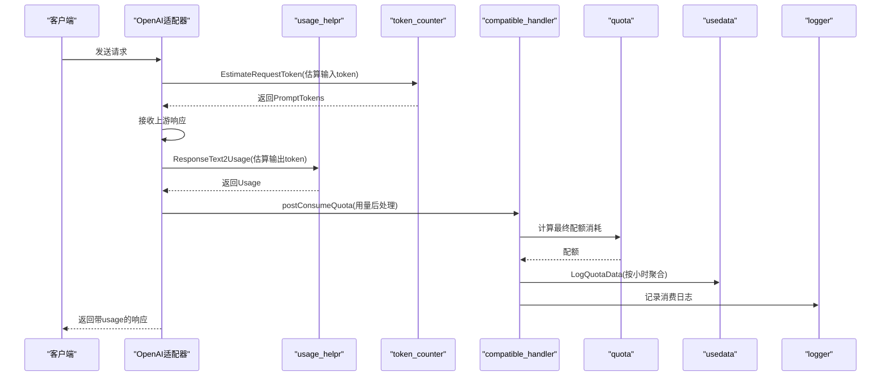
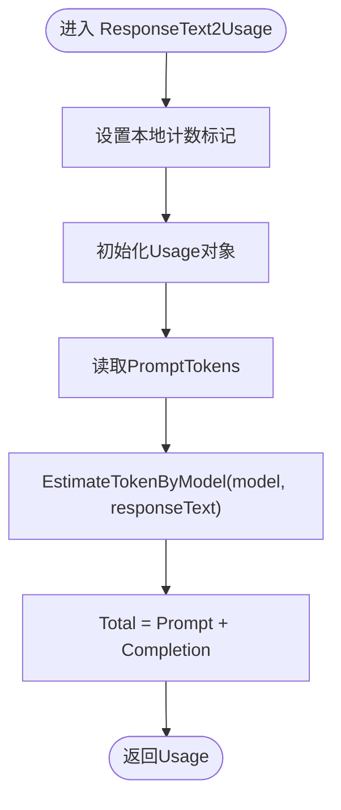
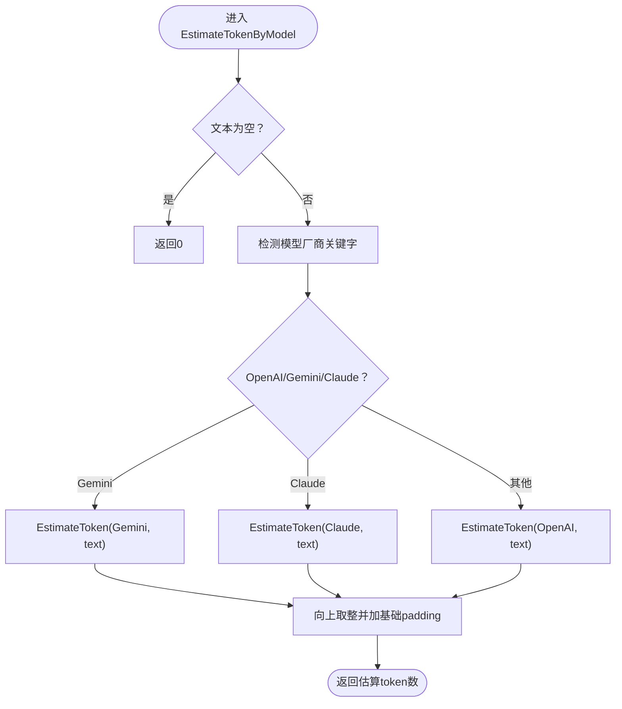
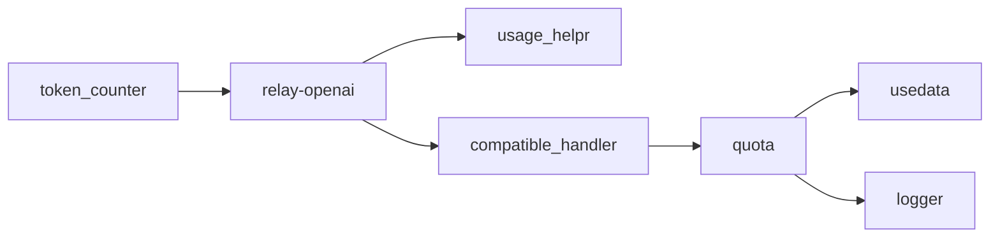

# 用量计算与统计

<cite>
**本文引用的文件列表**
- [service/usage_helpr.go](file://service/usage_helpr.go)
- [service/token_estimator.go](file://service/token_estimator.go)
- [service/token_counter.go](file://service/token_counter.go)
- [dto/openai_response.go](file://dto/openai_response.go)
- [relay/channel/openai/relay-openai.go](file://relay/channel/openai/relay-openai.go)
- [relay/compatible_handler.go](file://relay/compatible_handler.go)
- [service/quota.go](file://service/quota.go)
- [model/usedata.go](file://model/usedata.go)
- [logger/logger.go](file://logger/logger.go)
</cite>

## 目录
1. [简介](#简介)
2. [项目结构](#项目结构)
3. [核心组件](#核心组件)
4. [架构总览](#架构总览)
5. [详细组件分析](#详细组件分析)
6. [依赖关系分析](#依赖关系分析)
7. [性能考量](#性能考量)
8. [故障排查指南](#故障排查指南)
9. [结论](#结论)
10. [附录](#附录)

## 简介
本文件聚焦于系统的“用量计算与统计”机制，围绕以下目标展开：
- 解析 service/usage_helpr.go 中 ResponseText2Usage 如何基于响应文本与模型名称估算输出 token，并说明 EstimateTokenByModel 的实现逻辑。
- 解释 ValidUsage 在空用量数据下的校验规则。
- 串联从原始请求到用量统计的完整链路：如何通过 token_counter.go 的计数器计算输入 token，结合模型响应计算输出 token，最终生成总用量。
- 说明这些计算结果如何被记录到 model/usedata.go 的汇总数据与 logger/logger.go 的详细日志中，形成完整的使用量跟踪体系。

## 项目结构
与用量计算直接相关的模块分布如下：
- 服务层：service/usage_helpr.go、service/token_estimator.go、service/token_counter.go、service/quota.go
- DTO 层：dto/openai_response.go（定义 Usage 结构及明细字段）
- 适配层：relay/channel/openai/relay-openai.go（流式与非流式处理、用量后处理）
- 兼容处理：relay/compatible_handler.go（用量后处理、计费与日志）
- 数据存储：model/usedata.go（按小时聚合的用量缓存与落库）
- 日志系统：logger/logger.go（统一日志输出与额度格式化）

```mermaid
graph TB
subgraph "服务层"
UH["usage_helpr.go<br/>ResponseText2Usage/ValidUsage"]
TE["token_estimator.go<br/>EstimateTokenByModel"]
TC["token_counter.go<br/>EstimateRequestToken/Count*"]
Q["quota.go<br/>计费与配额计算"]
end
subgraph "DTO"
DTO["openai_response.go<br/>Usage/Details"]
end
subgraph "适配层"
OA["relay-openai.go<br/>流式/非流式用量处理"]
end
subgraph "兼容处理"
CH["compatible_handler.go<br/>postConsumeQuota"]
end
subgraph "数据存储"
UD["usedata.go<br/>按小时聚合缓存/落库"]
end
subgraph "日志"
LG["logger.go<br/>日志输出/额度格式化"]
end
OA --> UH
OA --> DTO
OA --> TC
OA --> CH
CH --> Q
Q --> UD
Q --> LG
```

图表来源
- [service/usage_helpr.go](file://service/usage_helpr.go#L1-L34)
- [service/token_estimator.go](file://service/token_estimator.go#L1-L231)
- [service/token_counter.go](file://service/token_counter.go#L1-L453)
- [dto/openai_response.go](file://dto/openai_response.go#L222-L265)
- [relay/channel/openai/relay-openai.go](file://relay/channel/openai/relay-openai.go#L106-L194)
- [relay/compatible_handler.go](file://relay/compatible_handler.go#L190-L389)
- [service/quota.go](file://service/quota.go#L1-L200)
- [model/usedata.go](file://model/usedata.go#L1-L129)
- [logger/logger.go](file://logger/logger.go#L1-L161)

章节来源
- [service/usage_helpr.go](file://service/usage_helpr.go#L1-L34)
- [service/token_estimator.go](file://service/token_estimator.go#L1-L231)
- [service/token_counter.go](file://service/token_counter.go#L1-L453)
- [dto/openai_response.go](file://dto/openai_response.go#L222-L265)
- [relay/channel/openai/relay-openai.go](file://relay/channel/openai/relay-openai.go#L106-L194)
- [relay/compatible_handler.go](file://relay/compatible_handler.go#L190-L389)
- [service/quota.go](file://service/quota.go#L1-L200)
- [model/usedata.go](file://model/usedata.go#L1-L129)
- [logger/logger.go](file://logger/logger.go#L1-L161)

## 核心组件
- 用量估算与校验
  - ResponseText2Usage：根据响应文本与模型名估算输出 token，并结合已知的输入 token 构造 Usage。
  - ValidUsage：对用量对象进行基本有效性校验，避免空用量导致误计费。
  - EstimateTokenByModel：按模型厂商类别估算文本 token 数量。
- 输入 token 计算
  - EstimateRequestToken：综合请求体内容、工具数量、消息格式化开销、媒体文件 token 等，估算输入 token。
  - CountTextToken/CountTokenInput：文本 token 计算入口；非 OpenAI 文本模型走估算路径。
- 输出 token 计算
  - 流式场景：OaiStreamHandler 收集流片段，必要时调用 ResponseText2Usage 估算输出 token。
  - 非流式场景：OpenaiHandler 在上游未提供 usage 时，基于 choices 内容估算 completion token。
- 计费与汇总
  - compatible_handler.postConsumeQuota：用量后处理，计算最终配额消耗，记录日志，处理预扣费差异。
  - quota.go：按模型倍率、分组倍率、缓存命中/创建、图像/音频等维度计算最终配额。
  - usedata.go：按小时粒度聚合用户/模型用量，定期落库。
  - logger.go：统一日志输出与额度格式化。

章节来源
- [service/usage_helpr.go](file://service/usage_helpr.go#L22-L34)
- [service/token_estimator.go](file://service/token_estimator.go#L216-L231)
- [service/token_counter.go](file://service/token_counter.go#L202-L342)
- [relay/channel/openai/relay-openai.go](file://relay/channel/openai/relay-openai.go#L106-L194)
- [relay/compatible_handler.go](file://relay/compatible_handler.go#L190-L389)
- [service/quota.go](file://service/quota.go#L1-L200)
- [model/usedata.go](file://model/usedata.go#L1-L129)
- [logger/logger.go](file://logger/logger.go#L1-L161)

## 架构总览
用量计算与统计的关键流程如下：
- 输入 token：由 EstimateRequestToken 在请求阶段估算并写入上下文，后续作为 PromptTokens 使用。
- 输出 token：在响应阶段，优先使用上游返回的 usage；若缺失，则通过 ResponseText2Usage 基于响应文本估算。
- 计费：compatible_handler.postConsumeQuota 将 prompt/completion/cached/image/audio 等因素综合计算为最终配额消耗。
- 汇总与日志：quota.go 更新用户/通道用量与请求次数，usedata.go 缓存按小时聚合，logger.go 输出详细日志。



图表来源
- [relay/channel/openai/relay-openai.go](file://relay/channel/openai/relay-openai.go#L106-L194)
- [service/usage_helpr.go](file://service/usage_helpr.go#L22-L34)
- [service/token_counter.go](file://service/token_counter.go#L202-L342)
- [relay/compatible_handler.go](file://relay/compatible_handler.go#L190-L389)
- [service/quota.go](file://service/quota.go#L1-L200)
- [model/usedata.go](file://model/usedata.go#L1-L129)
- [logger/logger.go](file://logger/logger.go#L1-L161)

## 详细组件分析

### 1) ResponseText2Usage 与 EstimateTokenByModel
- ResponseText2Usage
  - 设置本地计数标记，构造 Usage。
  - PromptTokens 来自上游估算或请求阶段计算。
  - CompletionTokens 通过 EstimateTokenByModel(model, responseText) 估算。
  - TotalTokens = PromptTokens + CompletionTokens。
- EstimateTokenByModel
  - 根据模型名包含的关键字判定厂商类别（OpenAI/Gemini/Claude）。
  - 调用 EstimateToken(provider, text) 进行估算，内部按词、数字、CJK、符号、数学符号、URL分隔符、@、Emoji、换行/空格等加权累加并向上取整。
  - 非 OpenAI 文本模型统一走估算路径，以减少外部依赖与开销。



图表来源
- [service/usage_helpr.go](file://service/usage_helpr.go#L22-L34)



图表来源
- [service/token_estimator.go](file://service/token_estimator.go#L216-L231)
- [service/token_estimator.go](file://service/token_estimator.go#L69-L148)

章节来源
- [service/usage_helpr.go](file://service/usage_helpr.go#L22-L34)
- [service/token_estimator.go](file://service/token_estimator.go#L216-L231)
- [service/token_estimator.go](file://service/token_estimator.go#L69-L148)

### 2) ValidUsage 校验规则
- ValidUsage 对传入的 Usage 进行基本校验，要求：
  - Usage 非空；
  - PromptTokens 或 CompletionTokens 至少有一个非零。
- 该规则用于防止空用量导致的误计费或日志异常。

章节来源
- [service/usage_helpr.go](file://service/usage_helpr.go#L31-L33)

### 3) 输入 token 计算链路（EstimateRequestToken）
- 开关控制：当全局开关关闭或实时语音模式时跳过计数。
- 文本计数：
  - 若为文本数字混合类型，直接按字符数累加；
  - 否则调用 CountTextToken(model) 计算。
- OpenAI 格式额外开销：工具数、消息条数、名称字段等格式化 token。
- 媒体计数：
  - 根据配置与流模式决定是否本地计算媒体 token；
  - 图像：按模型族与细节策略估算 tile/patch 数量；
  - 音频/视频/文件：固定开销估算。
- 最终将估算结果写入上下文，供后续用量使用。

章节来源
- [service/token_counter.go](file://service/token_counter.go#L202-L342)
- [service/token_counter.go](file://service/token_counter.go#L1-L200)

### 4) 输出 token 计算链路（流式与非流式）
- 流式场景（OaiStreamHandler）
  - 收集所有流片段，必要时转换思考内容为常规内容。
  - 若上游未提供 usage，调用 ResponseText2Usage 估算输出 token，并附加工具调用惩罚项。
  - 对音频模型，尝试从倒数第二个流片段提取 usage。
- 非流式场景（OpenaiHandler）
  - 若上游返回的 usage 中 completion 为 0，遍历 choices，基于 CountTextToken 估算 completion token。
  - 重写响应体 usage 字段并回写给客户端。

章节来源
- [relay/channel/openai/relay-openai.go](file://relay/channel/openai/relay-openai.go#L106-L194)
- [relay/channel/openai/relay-openai.go](file://relay/channel/openai/relay-openai.go#L196-L294)

### 5) 计费与用量汇总（compatible_handler.postConsumeQuota 与 quota.go）
- postConsumeQuota
  - 从 RelayInfo 读取倍率与价格信息，计算 prompt/completion/cached/image/audio 等的配额。
  - 处理预扣费差异：若实际消耗大于预扣，补扣；小于则返还。
  - 记录日志，包含工具调用、图像生成调用、音频输入等额外计费项。
- quota.go
  - 计算音频/文本/缓存等综合配额，支持按价格或比率两种模式。
  - 更新用户与通道的已用配额与请求次数。
- usedata.go
  - 按小时聚合用户/模型用量，周期性批量写入数据库。
- logger.go
  - 提供 INFO/WARN/ERROR/DEBUG 等日志接口，统一格式化输出；提供额度显示格式化工具。

章节来源
- [relay/compatible_handler.go](file://relay/compatible_handler.go#L190-L389)
- [service/quota.go](file://service/quota.go#L1-L200)
- [model/usedata.go](file://model/usedata.go#L1-L129)
- [logger/logger.go](file://logger/logger.go#L1-L161)

## 依赖关系分析
- 组件耦合
  - usage_helpr 与 token_estimator：前者负责将估算结果组装为 Usage，后者提供估算算法。
  - token_counter 与 relay-openai：前者在请求阶段提供输入 token，后者在响应阶段提供输出 token。
  - compatible_handler 与 quota：前者负责用量后处理与计费，后者负责最终配额计算与更新。
  - quota 与 usedata：quota 更新后触发 usedata 的缓存聚合与落库。
- 关键依赖链
  - EstimateRequestToken → 上下文 PromptTokens → OpenaiHandler/OaiStreamHandler → ResponseText2Usage → postConsumeQuota → quota → usedata。
  - logger 在上述链路中贯穿日志输出。



图表来源
- [service/token_counter.go](file://service/token_counter.go#L202-L342)
- [relay/channel/openai/relay-openai.go](file://relay/channel/openai/relay-openai.go#L106-L194)
- [service/usage_helpr.go](file://service/usage_helpr.go#L22-L34)
- [relay/compatible_handler.go](file://relay/compatible_handler.go#L190-L389)
- [service/quota.go](file://service/quota.go#L1-L200)
- [model/usedata.go](file://model/usedata.go#L1-L129)
- [logger/logger.go](file://logger/logger.go#L1-L161)

## 性能考量
- 估算优于精确：非 OpenAI 文本模型统一走估算路径，避免昂贵的外部 tokenizer 调用。
- 流式处理：流式场景通过流扫描器收集片段，避免一次性加载整个响应体，降低内存占用。
- 媒体计数开关：通过配置与流模式控制是否本地计算媒体 token，平衡精度与性能。
- 批量落库：usedata 按小时聚合后批量写入，减少数据库压力。

## 故障排查指南
- 用量为 0
  - 现象：total tokens 为 0，可能上游超时或错误。
  - 处理：compatible_handler 会记录错误日志并尝试返还预扣费；检查上游响应与网络状态。
- 估算偏差较大
  - 检查模型名关键字匹配是否正确，确认 EstimateTokenByModel 的厂商分类。
  - 对于图像/音频/视频，确认媒体计数开关与流模式配置。
- 额度不足
  - 检查用户与令牌剩余额度；查看日志中“预扣费后补扣费/返还扣费”的提示。
- 日志定位
  - 使用 logger 的 INFO/WARN/ERROR/DEBUG 级别输出，结合请求 ID 快速定位问题。

章节来源
- [relay/compatible_handler.go](file://relay/compatible_handler.go#L360-L397)
- [logger/logger.go](file://logger/logger.go#L57-L97)

## 结论
本系统通过“请求阶段估算输入 token + 响应阶段估算输出 token + 用量后处理计费”的三层机制，实现了对多厂商、多模态场景的统一用量计算与统计。usage_helpr 与 token_estimator 提供了高效的估算能力；token_counter 在请求阶段确保输入 token 的准确性；compatible_handler 与 quota 在响应阶段完成最终计费与配额更新；usedata 与 logger 则分别承担汇总与可观测性职责。整体设计兼顾性能与可维护性，适合大规模并发场景。

## 附录
- DTO 中的 Usage 结构包含输入/输出 token 明细，便于后续扩展更精细的计费维度。
- 实时语音（Realtime）场景通过专用计数器与计费路径单独处理，避免与文本/图像场景混淆。