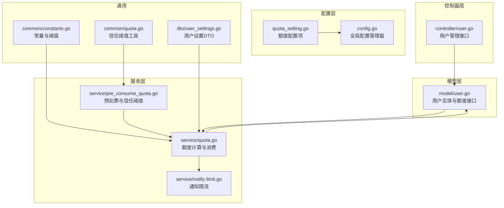
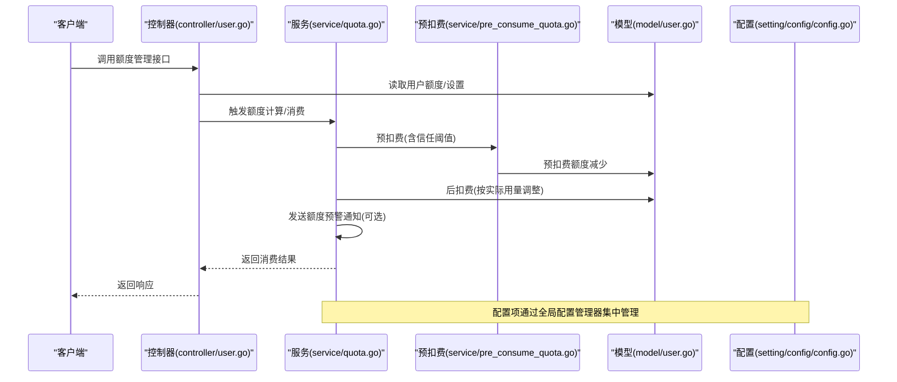
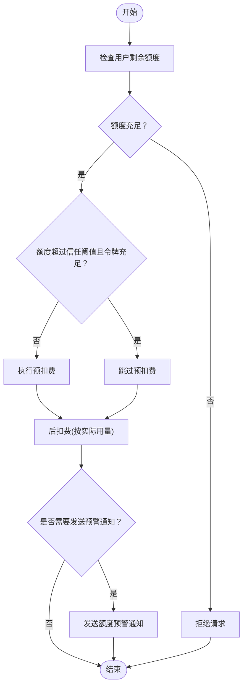
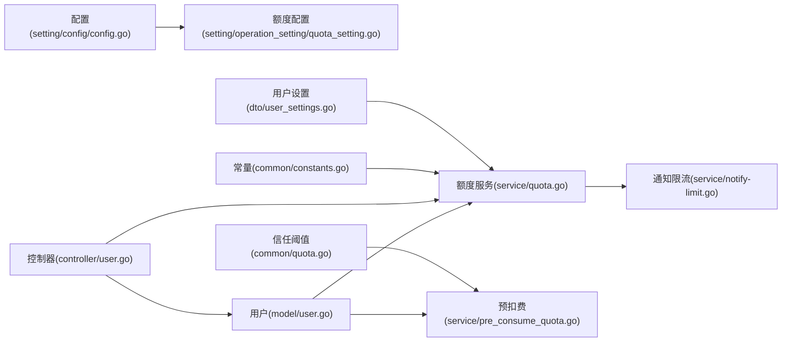

# 信用额度管理

<cite>
**本文引用的文件**
- [setting/operation_setting/quota_setting.go](file://setting/operation_setting/quota_setting.go)
- [model/user.go](file://model/user.go)
- [controller/user.go](file://controller/user.go)
- [service/quota.go](file://service/quota.go)
- [service/pre_consume_quota.go](file://service/pre_consume_quota.go)
- [common/constants.go](file://common/constants.go)
- [common/quota.go](file://common/quota.go)
- [dto/user_settings.go](file://dto/user_settings.go)
- [setting/config/config.go](file://setting/config/config.go)
- [service/notify-limit.go](file://service/notify-limit.go)
</cite>

## 目录
1. [引言](#引言)
2. [项目结构](#项目结构)
3. [核心组件](#核心组件)
4. [架构总览](#架构总览)
5. [详细组件分析](#详细组件分析)
6. [依赖关系分析](#依赖关系分析)
7. [性能考量](#性能考量)
8. [故障排查指南](#故障排查指南)
9. [结论](#结论)
10. [附录](#附录)

## 引言
本文件围绕“信用额度管理”主题，系统梳理系统中与额度相关的配置、用户信用字段扩展、控制器接口、服务层配额检查与临时超额信任机制，并给出信用评估模型与逾期处理流程的设计建议。目标是帮助开发者与运维人员快速理解额度体系的实现与扩展点，支撑业务在额度风控、临时超额使用、催收与信用降级等场景下的演进。

## 项目结构
围绕信用额度管理的关键代码分布在以下模块：
- 配置层：操作配置中的额度开关项，统一注册到全局配置管理器
- 模型层：用户实体扩展额度字段与设置字段，提供额度读取与变更接口
- 控制器层：提供用户额度相关管理接口（如划转邀请额度、获取自身信息等）
- 服务层：额度计算、预扣费、后扣费、通知与批量更新
- 通用常量与阈值：额度单位、信任阈值、提醒阈值等

图表来源
- [setting/operation_setting/quota_setting.go](file://setting/operation_setting/quota_setting.go#L1-L22)
- [setting/config/config.go](file://setting/config/config.go#L1-L90)
- [model/user.go](file://model/user.go#L1-L120)
- [controller/user.go](file://controller/user.go#L370-L420)
- [service/quota.go](file://service/quota.go#L480-L581)
- [service/pre_consume_quota.go](file://service/pre_consume_quota.go#L31-L79)
- [service/notify-limit.go](file://service/notify-limit.go#L1-L118)
- [common/constants.go](file://common/constants.go#L99-L107)
- [common/quota.go](file://common/quota.go#L1-L5)
- [dto/user_settings.go](file://dto/user_settings.go#L1-L24)

章节来源
- [setting/operation_setting/quota_setting.go](file://setting/operation_setting/quota_setting.go#L1-L22)
- [setting/config/config.go](file://setting/config/config.go#L1-L90)
- [model/user.go](file://model/user.go#L1-L120)
- [controller/user.go](file://controller/user.go#L370-L420)
- [service/quota.go](file://service/quota.go#L480-L581)
- [service/pre_consume_quota.go](file://service/pre_consume_quota.go#L31-L79)
- [service/notify-limit.go](file://service/notify-limit.go#L1-L118)
- [common/constants.go](file://common/constants.go#L99-L107)
- [common/quota.go](file://common/quota.go#L1-L5)
- [dto/user_settings.go](file://dto/user_settings.go#L1-L24)

## 核心组件
- 额度配置项：在操作配置中定义额度相关开关，注册到全局配置管理器，便于集中管理与持久化
- 用户信用字段扩展：在用户实体中增加额度字段与设置字段，支持用户侧个性化额度预警与通知
- 控制器接口：提供额度划转、获取自身信息等管理接口，返回用户权限与额度状态
- 服务层额度检查：实现额度计算、预扣费、后扣费、通知与批量更新，支持临时超额信任阈值
- 通用阈值：定义额度单位、信任阈值、提醒阈值等，支撑额度策略

章节来源
- [setting/operation_setting/quota_setting.go](file://setting/operation_setting/quota_setting.go#L1-L22)
- [model/user.go](file://model/user.go#L1-L120)
- [controller/user.go](file://controller/user.go#L370-L420)
- [service/quota.go](file://service/quota.go#L480-L581)
- [service/pre_consume_quota.go](file://service/pre_consume_quota.go#L31-L79)
- [common/constants.go](file://common/constants.go#L99-L107)
- [common/quota.go](file://common/quota.go#L1-L5)
- [dto/user_settings.go](file://dto/user_settings.go#L1-L24)

## 架构总览
信用额度管理贯穿配置、模型、控制器与服务层，形成“配置—模型—接口—服务”的闭环。服务层在额度消费前后执行计算、预扣费与通知，结合信任阈值实现临时超额使用；控制器负责对外暴露额度管理能力；模型层提供额度读写与缓存策略。

图表来源
- [controller/user.go](file://controller/user.go#L370-L420)
- [service/quota.go](file://service/quota.go#L480-L581)
- [service/pre_consume_quota.go](file://service/pre_consume_quota.go#L31-L79)
- [model/user.go](file://model/user.go#L669-L764)
- [setting/config/config.go](file://setting/config/config.go#L1-L90)

## 详细组件分析

### 额度配置项：授信额度、还款周期与风险等级划分
- 配置项实现
  - 在操作配置中定义额度相关开关，并注册到全局配置管理器，支持从数据库加载与保存
  - 当前配置项聚焦于“免费模型预扣费开关”，体现额度策略的可插拔性
- 风险等级划分
  - 当前代码库未直接实现“风险等级划分”字段或算法，建议在用户实体或独立信用表中扩展风险等级字段，并结合行为分析、支付历史、逾期次数等指标建立评分模型
- 还款周期
  - 代码库未提供“还款周期”字段或逻辑，可在用户实体或信用表中新增周期字段，并配合到期检测与自动降级策略

章节来源
- [setting/operation_setting/quota_setting.go](file://setting/operation_setting/quota_setting.go#L1-L22)
- [setting/config/config.go](file://setting/config/config.go#L1-L90)

### 用户信用字段扩展机制
- 用户实体扩展
  - 用户结构体包含额度字段与设置字段，支持用户侧个性化配置（如通知类型、预警阈值等）
  - 提供设置的序列化/反序列化接口，便于存储与读取用户偏好
- 额度读取与缓存
  - 提供从缓存/数据库读取用户额度的方法，支持批量更新与异步缓存更新
- 邀请额度与划转
  - 提供邀请额度字段与划转接口，支持邀请人与被邀请人的额度转移

章节来源
- [model/user.go](file://model/user.go#L1-L120)
- [model/user.go](file://model/user.go#L669-L764)
- [dto/user_settings.go](file://dto/user_settings.go#L1-L24)

### 控制器接口：用户额度管理
- 划转邀请额度
  - 提供接口将邀请额度转入用户主额度，包含事务控制与额度校验
- 获取自身信息
  - 返回用户基本信息、额度、请求计数、邀请相关统计等，并注入权限与侧边栏配置
- 生成访问令牌
  - 为用户生成访问令牌并持久化，用于系统管理

章节来源
- [controller/user.go](file://controller/user.go#L370-L420)
- [controller/user.go](file://controller/user.go#L430-L481)
- [controller/user.go](file://controller/user.go#L334-L373)

### 服务层：配额检查与临时超额使用
- 额度计算
  - 根据模型倍率、分组倍率、文本/音频令牌数等计算应扣额度，支持价格模式与比率模式
- 预扣费与信任阈值
  - 当用户剩余额度超过信任阈值且令牌额度也充足时，信任用户并跳过预扣费，实现临时超额使用
  - 若预扣费失败，提供返还预扣费的兜底逻辑
- 后扣费与通知
  - 根据实际用量进行后扣费，支持按令牌与用户维度扣减
  - 当剩余额度低于用户自定义阈值或全局阈值时，触发额度预警通知（邮件/Bark/Gotify/Webhook）

图表来源
- [service/pre_consume_quota.go](file://service/pre_consume_quota.go#L31-L79)
- [service/quota.go](file://service/quota.go#L480-L581)

章节来源
- [service/quota.go](file://service/quota.go#L480-L581)
- [service/pre_consume_quota.go](file://service/pre_consume_quota.go#L31-L79)
- [common/constants.go](file://common/constants.go#L99-L107)
- [common/quota.go](file://common/quota.go#L1-L5)

### 信用评估模型设计思路
- 输入特征
  - 行为分析：请求频率、高峰时段使用、并发通道数、失败率
  - 支付历史：充值金额、充值频次、最近一次充值时间、月均消费
  - 逾期与催收：逾期次数、逾期时长、催收通知次数、信用降级次数
- 评分规则
  - 基于规则引擎或机器学习模型，将特征映射为风险评分
  - 设定阈值：高风险、中风险、低风险，对应不同额度与功能限制
- 与现有额度体系的衔接
  - 风险等级影响用户额度上限、预扣费策略、临时超额阈值与功能限制
  - 逾期触发功能限制与信用降级，结合通知与催收流程

[本节为概念性设计，不直接分析具体文件，故不附“章节来源”]

### 逾期处理流程
- 功能限制
  - 当用户进入高风险等级或发生逾期，系统可限制部分模型或通道的使用
- 催收通知
  - 通过邮件/Bark/Gotify/Webhook等方式发送催收通知，提示充值与恢复额度
- 信用降级
  - 对连续逾期或严重违规用户降低信用等级，下调额度上限与功能权限
- 通知限流
  - 为避免通知风暴，引入通知限流策略，按用户与通知类型进行限流

章节来源
- [service/quota.go](file://service/quota.go#L535-L581)
- [service/notify-limit.go](file://service/notify-limit.go#L1-L118)

## 依赖关系分析
- 配置依赖
  - 额度配置项通过全局配置管理器集中注册与持久化，控制器与服务层通过配置读取策略
- 模型依赖
  - 服务层依赖模型层的额度读取、令牌额度扣减、用户使用量与请求计数更新
- 控制器依赖
  - 控制器依赖模型层与服务层，提供用户额度管理接口
- 通知依赖
  - 服务层在额度预警时调用通知模块，受通知限流策略约束

图表来源
- [setting/config/config.go](file://setting/config/config.go#L1-L90)
- [setting/operation_setting/quota_setting.go](file://setting/operation_setting/quota_setting.go#L1-L22)
- [model/user.go](file://model/user.go#L669-L764)
- [service/quota.go](file://service/quota.go#L480-L581)
- [service/pre_consume_quota.go](file://service/pre_consume_quota.go#L31-L79)
- [controller/user.go](file://controller/user.go#L370-L420)
- [service/notify-limit.go](file://service/notify-limit.go#L1-L118)
- [common/constants.go](file://common/constants.go#L99-L107)
- [common/quota.go](file://common/quota.go#L1-L5)
- [dto/user_settings.go](file://dto/user_settings.go#L1-L24)

## 性能考量
- 批量更新与缓存
  - 通过批量更新与缓存策略降低数据库压力，提高额度读写的吞吐
- 预扣费与信任阈值
  - 在额度充足时跳过预扣费，减少数据库写入次数，提升用户体验
- 通知限流
  - 通过内存或Redis限流，避免通知风暴导致的系统抖动

[本节为通用指导，不直接分析具体文件，故不附“章节来源”]

## 故障排查指南
- 额度不足
  - 检查用户剩余额度与令牌剩余额度，确认是否触发预扣费失败
- 预扣费返还
  - 当请求失败时，服务层会异步返还预扣费，需关注异步任务日志
- 通知未送达
  - 检查用户设置的通知类型与阈值，确认是否触发通知限流
- 配置未生效
  - 确认配置是否正确注册到全局配置管理器，并完成数据库加载

章节来源
- [service/pre_consume_quota.go](file://service/pre_consume_quota.go#L17-L29)
- [service/quota.go](file://service/quota.go#L535-L581)
- [service/notify-limit.go](file://service/notify-limit.go#L1-L118)
- [setting/config/config.go](file://setting/config/config.go#L1-L90)

## 结论
本信用额度管理体系以“配置—模型—接口—服务”为主线，实现了额度计算、预扣费与后扣费、通知与批量更新等关键能力，并通过信任阈值支持临时超额使用。当前代码库未直接实现“风险等级划分”与“还款周期”，建议在用户实体或独立信用表中扩展相应字段，并结合行为分析、支付历史与逾期记录构建信用评估模型，完善逾期处理流程与通知限流策略，以支撑更精细化的信用管理。

## 附录
- 关键路径参考
  - 额度配置注册与读取：[setting/operation_setting/quota_setting.go](file://setting/operation_setting/quota_setting.go#L1-L22)，[setting/config/config.go](file://setting/config/config.go#L1-L90)
  - 用户额度读取与缓存：[model/user.go](file://model/user.go#L669-L764)
  - 预扣费与信任阈值：[service/pre_consume_quota.go](file://service/pre_consume_quota.go#L31-L79)，[common/quota.go](file://common/quota.go#L1-L5)，[common/constants.go](file://common/constants.go#L99-L107)
  - 额度计算与后扣费：[service/quota.go](file://service/quota.go#L480-L581)
  - 用户管理接口：[controller/user.go](file://controller/user.go#L370-L420)，[controller/user.go](file://controller/user.go#L430-L481)