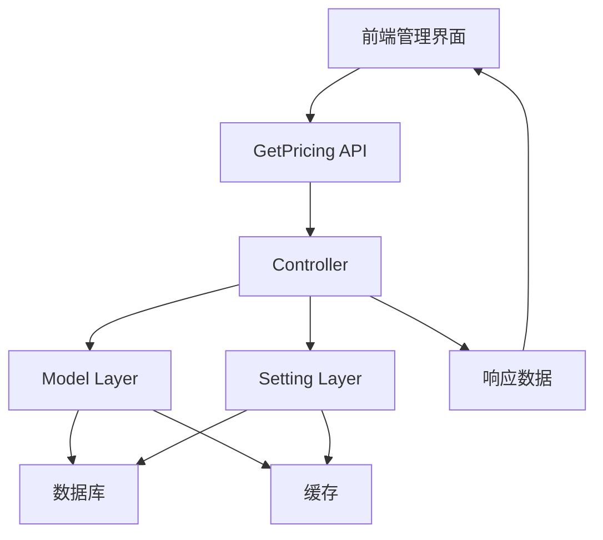
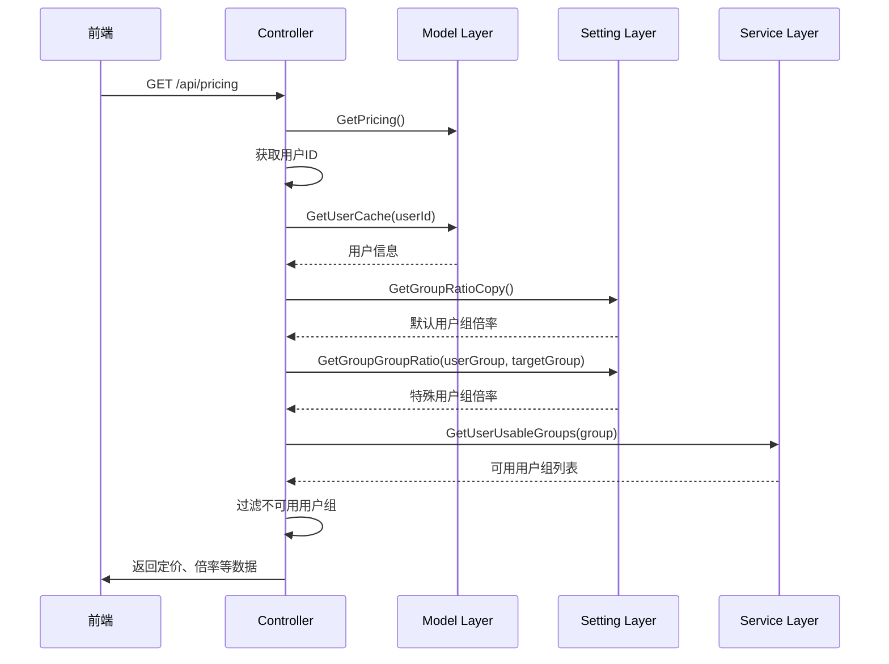
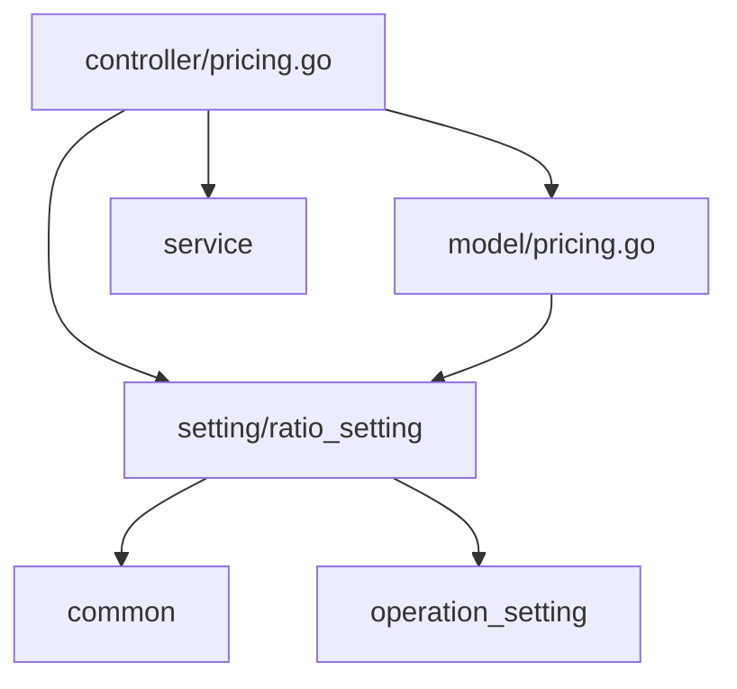

# 动态定价调整

<cite>
**本文档引用的文件**   
- [pricing.go](file://controller/pricing.go)
- [model_ratio.go](file://setting/ratio_setting/model_ratio.go)
- [pricing.go](file://model/pricing.go)
- [useModelPricingData.jsx](file://web/src/hooks/model-pricing/useModelPricingData.jsx)
- [PricingPage.jsx](file://web/src/components/table/model-pricing/layout/PricingPage.jsx)
- [group_ratio.go](file://setting/ratio_setting/group_ratio.go)
- [option.go](file://model/option.go)
</cite>

## 目录
1. [简介](#简介)
2. [核心组件分析](#核心组件分析)
3. [架构概览](#架构概览)
4. [详细组件分析](#详细组件分析)
5. [依赖关系分析](#依赖关系分析)
6. [性能考虑](#性能考虑)
7. [故障排除指南](#故障排除指南)
8. [结论](#结论)

## 简介
本文档详细阐述了系统中动态定价调整的实现机制。重点分析了 `GetPricing` 接口如何整合用户组权限、模型倍率等信息，以及 `ResetModelRatio` 接口的重置逻辑。深入探讨了 `model_ratio.go` 文件中模型倍率配置的存储结构和更新机制，包括 `GetModelRatio`、`UpdateModelRatioByJSONString` 等核心函数。结合 `model/pricing.go` 的缓存机制，描述了价格调整后的生效流程，并提供实际案例和问题解决方案。

## 核心组件分析
本系统的核心定价功能由控制器、模型和设置模块协同完成。`controller/pricing.go` 中的 `GetPricing` 函数是前端获取定价信息的入口，它整合了来自 `model/pricing.go` 的基础价格数据和来自 `setting/ratio_setting` 的用户组与模型倍率信息。`ResetModelRatio` 函数则提供了将模型倍率重置为默认值的功能。模型倍率的配置存储在 `setting/ratio_setting/model_ratio.go` 中，通过线程安全的映射（map）和互斥锁（mutex）进行管理，确保了高并发下的数据一致性。

**Section sources**
- [pricing.go](file://controller/pricing.go#L11-L74)
- [model_ratio.go](file://setting/ratio_setting/model_ratio.go#L28-L271)
- [pricing.go](file://model/pricing.go#L57-L313)

## 架构概览
系统采用分层架构，前端通过API调用触发定价信息的获取。控制器层负责协调数据，从模型层获取基础定价和用户信息，并从设置层获取倍率配置。设置层管理着所有与定价相关的配置，包括模型倍率、用户组倍率等，并通过JSON字符串的形式与数据库进行持久化。整个流程中，缓存机制被广泛应用以提升性能。



**Diagram sources**
- [pricing.go](file://controller/pricing.go#L11-L49)
- [pricing.go](file://model/pricing.go#L57-L307)
- [model_ratio.go](file://setting/ratio_setting/model_ratio.go#L317-L324)

## 详细组件分析

### GetPricing接口分析
`GetPricing` 接口是前端获取定价信息的核心。其工作流程如下：首先，它调用 `model.GetPricing()` 获取所有模型的基础定价信息。然后，它检查当前用户的身份，通过 `model.GetUserCache()` 获取用户的用户组。接着，它从 `ratio_setting.GetGroupRatioCopy()` 获取所有用户组的默认倍率，并根据当前用户所属的用户组，通过 `ratio_setting.GetGroupGroupRatio()` 查询该用户组对其他用户组的特殊倍率，从而覆盖默认倍率。最后，它调用 `service.GetUserUsableGroups()` 获取当前用户可用的用户组列表，并过滤掉 `groupRatio` 映射中用户不可用的用户组，确保返回的数据是准确且安全的。最终，这些数据被打包成JSON响应返回给前端。



**Diagram sources**
- [pricing.go](file://controller/pricing.go#L11-L49)
- [pricing.go](file://model/pricing.go#L57-L68)
- [group_ratio.go](file://setting/ratio_setting/group_ratio.go#L66-L74)

### ResetModelRatio接口分析
`ResetModelRatio` 接口用于将模型倍率重置为系统默认值。其逻辑非常清晰：首先，调用 `ratio_setting.DefaultModelRatio2JSONString()` 生成包含所有默认模型倍率的JSON字符串。然后，调用 `model.UpdateOption("ModelRatio", defaultStr)` 将此JSON字符串持久化到数据库中，确保配置的持久性。最后，调用 `ratio_setting.UpdateModelRatioByJSONString(defaultStr)` 将新的倍率配置加载到内存中，使其立即生效。如果任何一步出错，都会返回相应的错误信息。

**Section sources**
- [pricing.go](file://controller/pricing.go#L52-L73)

### 模型倍率配置存储与更新机制分析
模型倍率的配置存储在 `setting/ratio_setting/model_ratio.go` 文件中。其核心是一个名为 `modelRatioMap` 的全局映射（map），用于存储模型名称到倍率的键值对。为了保证线程安全，使用了 `sync.RWMutex` 读写锁 `modelRatioMapMutex`。初始化时，`InitRatioSettings` 函数会将 `defaultModelRatio` 常量加载到 `modelRatioMap` 中。

更新机制通过 `UpdateModelRatioByJSONString(jsonStr string) error` 函数实现。该函数首先获取写锁，然后创建一个新的映射，使用 `json.Unmarshal` 将传入的JSON字符串解析并填充到新映射中，最后将 `modelRatioMap` 指向这个新映射。这种“创建新对象再替换”的模式避免了在更新过程中锁定整个映射，提高了并发性能。更新成功后，会调用 `InvalidateExposedDataCache()` 使相关缓存失效，确保后续请求能获取到最新的数据。

```mermaid
classDiagram
class ModelRatioManager {
+defaultModelRatio map[string]float64
-modelRatioMap map[string]float64
-modelRatioMapMutex sync.RWMutex
+InitRatioSettings()
+GetModelRatio(name string) (float64, bool, string)
+UpdateModelRatioByJSONString(jsonStr string) error
+ModelRatio2JSONString() string
+GetModelRatioCopy() map[string]float64
}
note right of ModelRatioManager
负责管理模型倍率的存储、
读取和更新，使用读写锁
保证并发安全。
end note
```

**Diagram sources**
- [model_ratio.go](file://setting/ratio_setting/model_ratio.go#L317-L324)
- [model_ratio.go](file://setting/ratio_setting/model_ratio.go#L421-L429)
- [model_ratio.go](file://setting/ratio_setting/model_ratio.go#L791-L798)

### 缓存机制与生效流程分析
系统通过多层缓存来优化性能。在 `model/pricing.go` 中，`GetPricing()` 函数使用 `pricingMap` 作为缓存，并通过 `lastGetPricingTime` 和 `updatePricingLock` 来控制缓存的刷新。当缓存过期（超过1分钟）或为空时，会调用 `updatePricing()` 函数重新从数据库加载数据并刷新缓存。

当管理员通过管理界面调整模型倍率后，其生效流程如下：首先，前端调用更新接口，将新的倍率配置以JSON字符串形式发送到后端。后端接收到请求后，调用 `model.UpdateOption("ModelRatio", newStr)` 将新配置持久化到数据库。紧接着，调用 `ratio_setting.UpdateModelRatioByJSONString(newStr)` 将新配置加载到内存中的 `modelRatioMap`。这一步会立即影响 `GetModelRatio` 等函数的返回值。当下一次 `GetPricing` 接口被调用时，由于 `updatePricing()` 函数内部会调用 `ratio_setting.GetModelRatio()`，因此新的倍率会被计算到最终的定价数据中。同时，`updatePricing()` 会刷新 `pricingMap` 缓存，确保后续请求能快速获取到已更新的数据。

**Section sources**
- [pricing.go](file://model/pricing.go#L57-L68)
- [option.go](file://model/option.go#L413-L414)
- [model_ratio.go](file://setting/ratio_setting/model_ratio.go#L421-L429)

### 实际案例：调整GPT-4倍率
假设需要将GPT-4模型的倍率从15调整为12，操作流程如下：
1.  **管理界面操作**：管理员登录系统，进入“模型定价”管理界面。
2.  **查找并编辑**：在模型列表中找到 `gpt-4` 模型，点击编辑按钮。
3.  **修改倍率**：将“倍率”字段的值从15修改为12。
4.  **保存更改**：点击保存按钮，前端会将包含新倍率的JSON数据发送到后端更新接口。
5.  **后端处理**：后端接收到请求，执行 `UpdateModelRatioByJSONString`，将新配置写入数据库并加载到内存。
6.  **生效**：此后，任何用户调用 `GetPricing` 接口时，返回的 `gpt-4` 模型的 `model_ratio` 字段值将变为12。

## 依赖关系分析
系统各组件间存在清晰的依赖关系。`controller/pricing.go` 依赖于 `model/pricing.go` 提供基础定价数据，依赖于 `setting/ratio_setting` 提供倍率配置，依赖于 `service` 提供用户可用组服务。`model/pricing.go` 在构建定价数据时，依赖于 `setting/ratio_setting` 的 `GetModelRatio` 和 `GetCompletionRatio` 等函数来获取最终的计费倍率。`setting/ratio_setting/model_ratio.go` 是核心配置模块，其状态变更会通过 `InvalidateExposedDataCache()` 等机制通知其他模块。



**Diagram sources**
- [pricing.go](file://controller/pricing.go#L4-L6)
- [pricing.go](file://model/pricing.go#L13)
- [model_ratio.go](file://setting/ratio_setting/model_ratio.go#L8-L9)

## 性能考虑
系统的性能主要通过缓存机制来保障。`GetPricing` 接口的缓存有效期为1分钟，有效减少了对数据库的直接查询压力。`modelRatioMap` 使用读写锁，允许多个读操作并发执行，仅在更新配置时才需要独占写锁，这在读多写少的场景下表现良好。然而，`updatePricing()` 函数在刷新缓存时会锁定整个过程，如果模型数量庞大，可能会成为性能瓶颈。建议在模型数量较多时，优化 `updatePricing()` 的执行效率，例如通过异步刷新或分批加载的方式。

## 故障排除指南
- **问题：价格更新后前端显示有延迟**
  - **原因**：`model/pricing.go` 中的 `GetPricing()` 函数有1分钟的缓存。
  - **解决方案**：等待1分钟让缓存自动刷新，或手动触发一次 `GetPricing` 请求以强制刷新缓存。

- **问题：配置持久化失败**
  - **原因**：数据库连接问题，或 `model.UpdateOption` 函数执行出错。
  - **解决方案**：检查数据库连接状态和日志。确保 `UpdateOption` 函数能正确地将数据写入 `options` 表。检查 `option.go` 文件中的 `UpdateOption` 和 `updateOptionMap` 函数逻辑。

- **问题：用户组倍率未生效**
  - **原因**：用户组配置错误，或 `GetGroupGroupRatio` 查询的用户组不存在。
  - **解决方案**：检查 `setting/ratio_setting/group_ratio.go` 中的 `GroupGroupRatio` 配置，确保用户组名称拼写正确且关系配置无误。

**Section sources**
- [pricing.go](file://model/pricing.go#L58-L67)
- [option.go](file://model/option.go#L176-L188)
- [group_ratio.go](file://setting/ratio_setting/group_ratio.go#L116-L129)

## 结论
本文档详细解析了动态定价调整系统的实现。系统通过 `GetPricing` 接口整合用户组权限和模型倍率，通过 `ResetModelRatio` 接口提供重置功能。模型倍率配置以线程安全的方式存储在内存映射中，并通过JSON与数据库同步。结合 `model/pricing.go` 的缓存机制，实现了高效且灵活的定价策略。通过理解其工作流程和潜在问题，可以更好地维护和优化此系统。