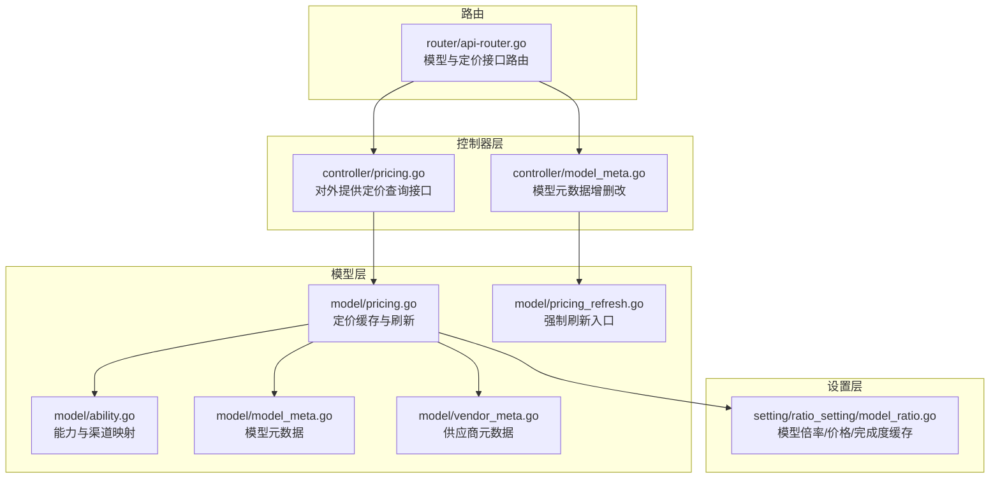
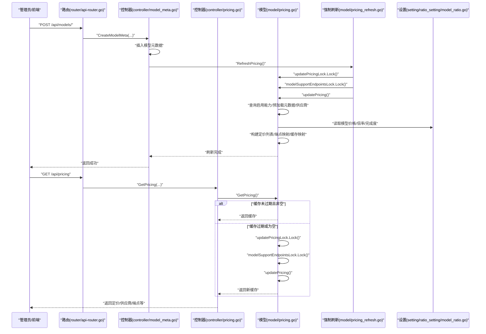
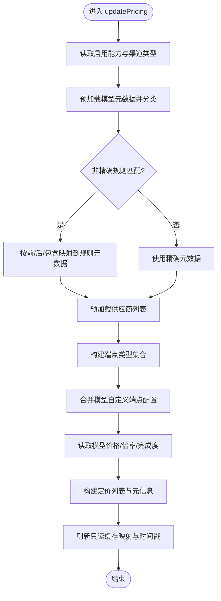
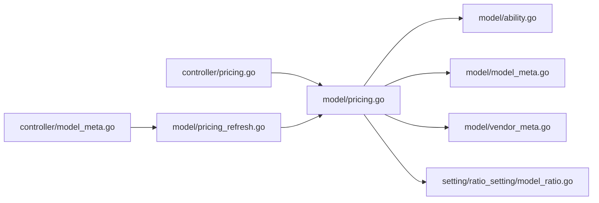

# 定价同步机制

<cite>
**本文引用的文件**
- [model/pricing_refresh.go](file://model/pricing_refresh.go)
- [model/pricing.go](file://model/pricing.go)
- [controller/pricing.go](file://controller/pricing.go)
- [controller/model_meta.go](file://controller/model_meta.go)
- [model/ability.go](file://model/ability.go)
- [model/model_meta.go](file://model/model_meta.go)
- [model/vendor_meta.go](file://model/vendor_meta.go)
- [setting/ratio_setting/model_ratio.go](file://setting/ratio_setting/model_ratio.go)
- [router/api-router.go](file://router/api-router.go)
</cite>

## 目录
1. [简介](#简介)
2. [项目结构](#项目结构)
3. [核心组件](#核心组件)
4. [架构总览](#架构总览)
5. [详细组件分析](#详细组件分析)
6. [依赖关系分析](#依赖关系分析)
7. [性能考量](#性能考量)
8. [故障排查指南](#故障排查指南)
9. [结论](#结论)

## 简介
本文聚焦于系统中“定价同步机制”的实现与使用方式，围绕以下目标展开：
- 解释 model/pricing_refresh.go 中 RefreshPricing 函数的强制刷新逻辑，说明其如何绕过缓存直接更新定价数据。
- 分析 model/pricing.go 中 updatePricing 函数的完整执行流程，包括能力查询、元数据匹配、供应商映射、端点配置等步骤。
- 结合 controller/pricing.go 的调用场景，描述定时同步与手动刷新的触发条件。
- 提供实际案例：在修改模型元数据后如何立即生效新价格。
- 解决同步死锁、数据不一致等并发问题。

## 项目结构
与定价同步相关的关键模块分布如下：
- 模型层（model）：定价缓存、能力与供应商数据、模型元数据、端点映射等。
- 控制器层（controller）：对外提供定价查询接口、模型元数据变更接口。
- 设置层（setting/ratio_setting）：模型倍率、价格、完成度倍率等定价参数的缓存与读写。
- 路由（router）：暴露管理端模型元数据与定价接口。

图表来源
- [controller/pricing.go](file://controller/pricing.go#L1-L75)
- [controller/model_meta.go](file://controller/model_meta.go#L80-L160)
- [model/pricing.go](file://model/pricing.go#L57-L314)
- [model/pricing_refresh.go](file://model/pricing_refresh.go#L1-L15)
- [model/ability.go](file://model/ability.go#L31-L39)
- [model/model_meta.go](file://model/model_meta.go#L23-L44)
- [model/vendor_meta.go](file://model/vendor_meta.go#L15-L24)
- [setting/ratio_setting/model_ratio.go](file://setting/ratio_setting/model_ratio.go#L404-L419)
- [router/api-router.go](file://router/api-router.go#L246-L258)

章节来源
- [controller/pricing.go](file://controller/pricing.go#L1-L75)
- [controller/model_meta.go](file://controller/model_meta.go#L80-L160)
- [model/pricing.go](file://model/pricing.go#L57-L314)
- [model/pricing_refresh.go](file://model/pricing_refresh.go#L1-L15)
- [model/ability.go](file://model/ability.go#L31-L39)
- [model/model_meta.go](file://model/model_meta.go#L23-L44)
- [model/vendor_meta.go](file://model/vendor_meta.go#L15-L24)
- [setting/ratio_setting/model_ratio.go](file://setting/ratio_setting/model_ratio.go#L404-L419)
- [router/api-router.go](file://router/api-router.go#L246-L258)

## 核心组件
- 定价缓存与刷新
  - GetPricing：带 1 分钟缓存的读取入口；若缓存过期或为空，则通过互斥锁保护调用 updatePricing 进行刷新。
  - updatePricing：完整的定价构建流程，包含能力聚合、元数据匹配、供应商映射、端点配置、倍率/价格/完成度选择、缓存映射刷新与时间戳更新。
  - RefreshPricing：强制刷新入口，直接持有两个互斥锁并调用 updatePricing，绕过 1 分钟缓存。
- 定价查询控制器
  - GetPricing：组合定价数据、供应商列表、可用端点映射、用户组倍率等返回给前端。
- 模型元数据控制器
  - CreateModelMeta/UpdateModelMeta/DeleteModelMeta：在模型元数据变更后调用 RefreshPricing，确保定价缓存即时更新。
- 能力与供应商
  - GetAllEnableAbilityWithChannels：拉取启用的能力与渠道类型，作为定价能力来源。
  - Vendor/Model：模型元数据与供应商关联，用于定价描述与图标等展示。
- 定价参数设置
  - GetModelPrice/GetModelRatio/GetCompletionRatio：从 ratio_setting 的缓存中读取模型价格或倍率，决定定价类型（按配额或按比例）。

章节来源
- [model/pricing.go](file://model/pricing.go#L57-L314)
- [model/pricing_refresh.go](file://model/pricing_refresh.go#L1-L15)
- [controller/pricing.go](file://controller/pricing.go#L11-L49)
- [controller/model_meta.go](file://controller/model_meta.go#L80-L160)
- [model/ability.go](file://model/ability.go#L31-L39)
- [model/vendor_meta.go](file://model/vendor_meta.go#L15-L24)
- [setting/ratio_setting/model_ratio.go](file://setting/ratio_setting/model_ratio.go#L404-L419)

## 架构总览
下图展示了从控制器到模型层的定价刷新链路，以及与模型元数据变更的联动关系。

图表来源
- [controller/model_meta.go](file://controller/model_meta.go#L80-L160)
- [model/pricing_refresh.go](file://model/pricing_refresh.go#L1-L15)
- [model/pricing.go](file://model/pricing.go#L57-L314)
- [controller/pricing.go](file://controller/pricing.go#L11-L49)
- [setting/ratio_setting/model_ratio.go](file://setting/ratio_setting/model_ratio.go#L404-L419)
- [router/api-router.go](file://router/api-router.go#L246-L258)

## 详细组件分析

### RefreshPricing 强制刷新逻辑
- 触发时机
  - 在模型元数据新增、更新、删除后，控制器调用 RefreshPricing，确保定价缓存立即反映最新模型能力与元数据。
- 强制刷新策略
  - 直接持有 updatePricingLock 和 modelSupportEndpointsLock 两把锁，再调用 updatePricing，从而绕过 GetPricing 的 1 分钟缓存判断。
  - 该设计避免了“写后读不到最新值”的问题，适用于管理端内部需要强一致性的场景。
- 并发与死锁规避
  - 两条锁的持有顺序固定，避免交叉锁导致的死锁。
  - 仅在必要时才持有锁，缩短临界区时间。

章节来源
- [model/pricing_refresh.go](file://model/pricing_refresh.go#L1-L15)
- [controller/model_meta.go](file://controller/model_meta.go#L80-L160)

### updatePricing 完整执行流程
- 数据准备
  - 读取启用的能力与渠道类型，作为定价能力来源。
  - 预加载所有模型元数据，按精确/前缀/后缀/包含规则分类，构建 metaMap。
- 元数据匹配
  - 对非精确规则的模型，基于前缀/后缀/包含关系，将匹配到的模型映射到对应的规则元数据，以统一描述与供应商。
- 供应商映射
  - 预加载供应商列表，构建供应商简表，用于前端展示。
- 端点配置
  - 基于能力中的渠道类型推导原生端点类型集合。
  - 合并模型元数据中的自定义端点配置，生成全局端点映射（默认 + 自定义覆盖）。
- 定价构建
  - 遍历能力分组，得到每个模型的启用分组集合。
  - 依据 ratio_setting 的模型价格/倍率/完成度，确定定价类型（按配额或按比例），并填充模型描述、图标、标签、供应商等元信息。
- 缓存映射与时间戳
  - 刷新 modelEnableGroups 与 modelQuotaTypeMap 两个只读缓存映射，供高并发快速查询。
  - 更新 lastGetPricingTime，作为缓存过期判断依据。

图表来源
- [model/pricing.go](file://model/pricing.go#L92-L308)

章节来源
- [model/pricing.go](file://model/pricing.go#L92-L308)

### 定价查询控制器与触发条件
- 定时同步
  - GetPricing 在缓存过期（超过 1 分钟）或为空时触发刷新，适合常规定时任务或后台任务周期性拉取最新定价。
- 手动刷新
  - 管理端在模型元数据变更后主动调用 RefreshPricing，确保前端立即看到最新定价。
- 用户侧触发
  - 前端调用 GET /api/pricing 时，若缓存未过期则直接返回，否则触发一次刷新。

章节来源
- [controller/pricing.go](file://controller/pricing.go#L11-L49)
- [model/pricing.go](file://model/pricing.go#L57-L69)

### 实际案例：修改模型元数据后立即生效新价格
- 场景
  - 管理员在控制台编辑模型元数据（如描述、图标、标签、供应商、端点配置），保存后立即生效。
- 流程
  - UpdateModelMeta 接口持久化模型元数据后，调用 RefreshPricing，强制刷新定价缓存。
  - 下次前端请求 GET /api/pricing 时，直接返回最新定价数据。
- 关键点
  - 元数据变更不会影响能力与渠道映射，但会影响定价列表中的描述、图标、标签、供应商等展示字段。
  - 若同时修改了 ratio_setting 的模型价格/倍率，updatePricing 会读取最新值，从而改变定价类型与数值。

章节来源
- [controller/model_meta.go](file://controller/model_meta.go#L108-L145)
- [model/pricing.go](file://model/pricing.go#L265-L295)
- [setting/ratio_setting/model_ratio.go](file://setting/ratio_setting/model_ratio.go#L404-L419)

### 并发问题与解决方案
- 死锁规避
  - 两条锁的持有顺序固定：先 updatePricingLock，再 modelSupportEndpointsLock；在 RefreshPricing 中亦然。
- 读写分离
  - GetPricing 使用双检锁（double-checked locking）：先无锁判断，再加锁二次确认，减少锁竞争。
  - GetModelSupportEndpointTypes 使用 RWMutex 读锁，提高并发读取性能。
- 数据一致性
  - updatePricing 内部一次性构建 pricingMap、supportedEndpointMap、modelEnableGroups、modelQuotaTypeMap，最后统一更新时间戳，避免中间态被读取。
  - RefreshPricing 直接覆盖缓存，确保强一致。

章节来源
- [model/pricing.go](file://model/pricing.go#L57-L69)
- [model/pricing.go](file://model/pricing.go#L80-L90)
- [model/pricing.go](file://model/pricing.go#L92-L308)
- [model/pricing_refresh.go](file://model/pricing_refresh.go#L1-L15)

## 依赖关系分析
- 定价构建依赖
  - 能力与渠道：来自 abilities 表与 channels 类型映射。
  - 模型元数据：来自 models 表（含名称规则、端点配置、供应商 ID、状态等）。
  - 供应商元数据：来自 vendors 表（名称、图标、描述等）。
  - 定价参数：来自 ratio_setting 的模型价格/倍率/完成度缓存。
- 控制器依赖
  - GetPricing 控制器依赖 model 层的定价缓存与端点映射。
  - 模型元数据控制器在增删改后依赖 RefreshPricing。

图表来源
- [controller/pricing.go](file://controller/pricing.go#L11-L49)
- [controller/model_meta.go](file://controller/model_meta.go#L80-L160)
- [model/pricing.go](file://model/pricing.go#L92-L314)
- [model/pricing_refresh.go](file://model/pricing_refresh.go#L1-L15)
- [model/ability.go](file://model/ability.go#L31-L39)
- [model/model_meta.go](file://model/model_meta.go#L23-L44)
- [model/vendor_meta.go](file://model/vendor_meta.go#L15-L24)
- [setting/ratio_setting/model_ratio.go](file://setting/ratio_setting/model_ratio.go#L404-L419)

章节来源
- [controller/pricing.go](file://controller/pricing.go#L11-L49)
- [controller/model_meta.go](file://controller/model_meta.go#L80-L160)
- [model/pricing.go](file://model/pricing.go#L92-L314)
- [model/pricing_refresh.go](file://model/pricing_refresh.go#L1-L15)
- [model/ability.go](file://model/ability.go#L31-L39)
- [model/model_meta.go](file://model/model_meta.go#L23-L44)
- [model/vendor_meta.go](file://model/vendor_meta.go#L15-L24)
- [setting/ratio_setting/model_ratio.go](file://setting/ratio_setting/model_ratio.go#L404-L419)

## 性能考量
- 缓存命中率
  - GetPricing 默认 1 分钟缓存，降低数据库与复杂计算压力。
- 预加载与去重
  - 预加载模型元数据与供应商，避免循环查询；端点与分组使用集合去重，减少冗余。
- 锁粒度
  - 读多写少场景使用 RWMutex；写路径尽量短，缩短锁持有时间。
- 批量处理
  - 模型元数据列表接口使用批量填充附加字段，减少 N+1 查询。

[本节为通用性能建议，无需特定文件引用]

## 故障排查指南
- 现象：修改模型元数据后，前端仍显示旧价格
  - 检查是否调用了 RefreshPricing（模型元数据控制器在新增/更新/删除后会调用）。
  - 检查 ratio_setting 的模型价格/倍率是否正确更新。
- 现象：并发环境下出现读到半成品缓存
  - 确认 updatePricing 是否在单线程内完成构建与替换。
  - 确认锁持有顺序一致，避免交叉锁。
- 现象：端点配置未生效
  - 检查模型元数据的端点配置格式是否正确（字符串或对象）。
  - 确认 supportedEndpointMap 是否被自定义配置覆盖。

章节来源
- [controller/model_meta.go](file://controller/model_meta.go#L80-L160)
- [model/pricing.go](file://model/pricing.go#L226-L263)
- [setting/ratio_setting/model_ratio.go](file://setting/ratio_setting/model_ratio.go#L404-L419)

## 结论
- RefreshPricing 通过直接持有锁并调用 updatePricing，实现了对定价缓存的强制刷新，绕过了 1 分钟缓存限制，满足管理端强一致需求。
- updatePricing 将能力、元数据、供应商、端点配置与定价参数整合，形成完整的定价视图，并通过只读缓存映射提升并发读取性能。
- 控制器层在模型元数据变更后调用 RefreshPricing，确保前端即时看到最新定价；常规访问通过 GetPricing 的缓存策略维持稳定性能。
- 通过严格的锁顺序、双检锁与一次性替换策略，系统有效避免了死锁与数据不一致问题。