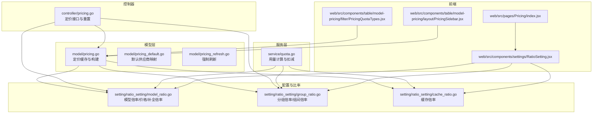
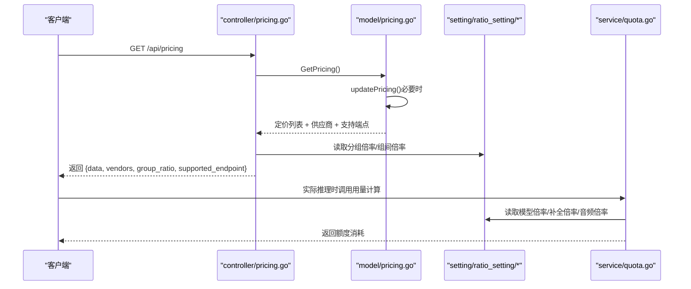
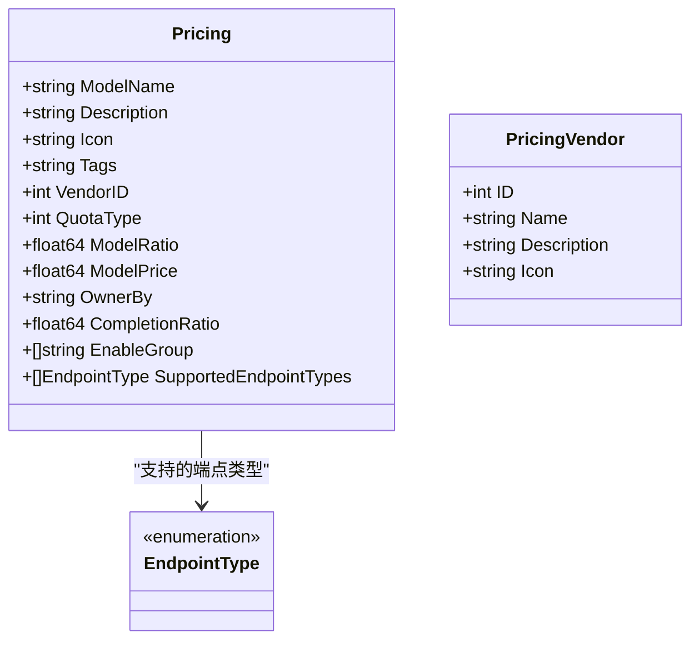
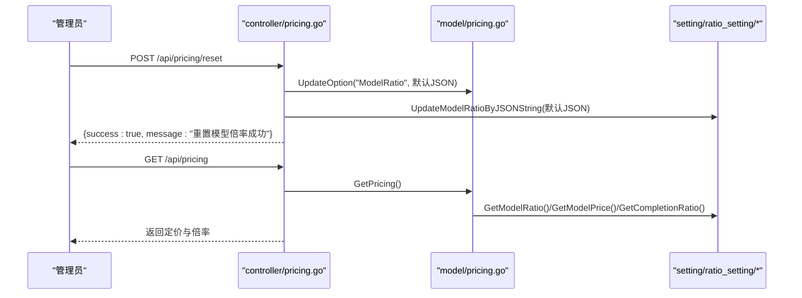
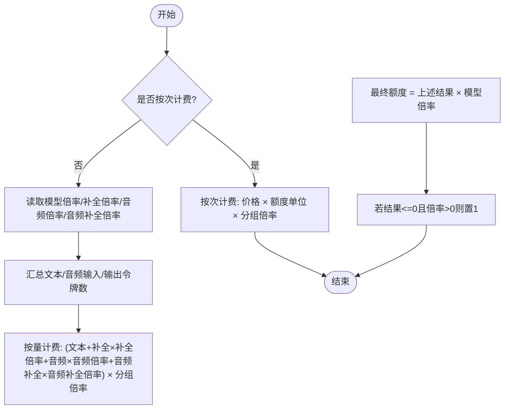
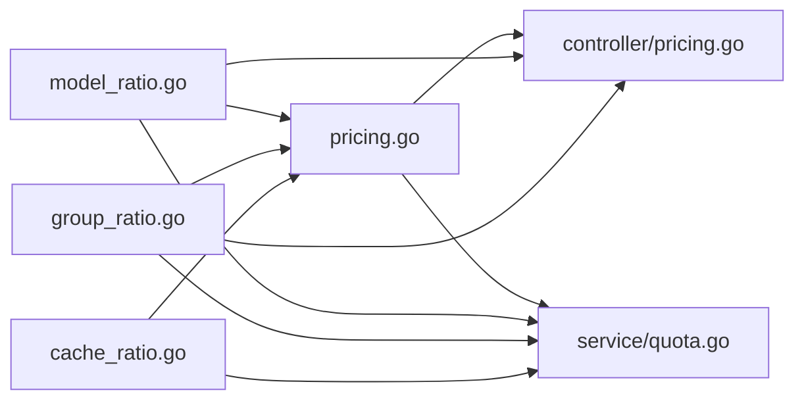

# 定价策略

<cite>
**本文引用的文件**
- [model/pricing.go](file://model/pricing.go)
- [model/pricing_default.go](file://model/pricing_default.go)
- [model/pricing_refresh.go](file://model/pricing_refresh.go)
- [controller/pricing.go](file://controller/pricing.go)
- [dto/pricing.go](file://dto/pricing.go)
- [setting/ratio_setting/model_ratio.go](file://setting/ratio_setting/model_ratio.go)
- [setting/ratio_setting/group_ratio.go](file://setting/ratio_setting/group_ratio.go)
- [setting/ratio_setting/cache_ratio.go](file://setting/ratio_setting/cache_ratio.go)
- [service/quota.go](file://service/quota.go)
- [constant/endpoint_type.go](file://constant/endpoint_type.go)
- [web/src/pages/Pricing/index.jsx](file://web/src/pages/Pricing/index.jsx)
- [web/src/components/settings/RatioSetting.jsx](file://web/src/components/settings/RatioSetting.jsx)
- [web/src/components/table/model-pricing/filter/PricingQuotaTypes.jsx](file://web/src/components/table/model-pricing/filter/PricingQuotaTypes.jsx)
- [web/src/components/table/model-pricing/layout/PricingSidebar.jsx](file://web/src/components/table/model-pricing/layout/PricingSidebar.jsx)
</cite>

## 目录
1. [简介](#简介)
2. [项目结构](#项目结构)
3. [核心组件](#核心组件)
4. [架构总览](#架构总览)
5. [详细组件分析](#详细组件分析)
6. [依赖关系分析](#依赖关系分析)
7. [性能考量](#性能考量)
8. [故障排查指南](#故障排查指南)
9. [结论](#结论)
10. [附录](#附录)

## 简介
本文件系统化阐述本项目的定价策略实现，围绕以下目标展开：
- 解释 model/pricing.go 中定价模型的数据结构，涵盖按模型、按渠道、按用户组的多维定价规则。
- 说明 pricing_default.go 中默认价格的初始化逻辑，以及 pricing_refresh.go 中价格同步的定时任务机制。
- 描述 controller/pricing.go 提供的管理接口，支持管理员动态调整价格系数。
- 结合 setting/ratio_setting 中的配置模块，说明如何通过后台界面设置模型权重、分组倍率和上游同步策略。
- 给出实际案例：如何配置 GPT-4 比 GPT-3.5 消耗更多额度的业务场景。
- 解决价格精度、缓存一致性及灰度发布等问题。

## 项目结构
定价策略涉及的核心模块分布如下：
- 数据模型与缓存：model/pricing.go、model/pricing_default.go、model/pricing_refresh.go
- 控制器接口：controller/pricing.go
- 配置与比率设置：setting/ratio_setting/model_ratio.go、setting/ratio_setting/group_ratio.go、setting/ratio_setting/cache_ratio.go
- 用量计算与消费：service/quota.go
- 常量与前端交互：constant/endpoint_type.go、web 页面与组件

图表来源
- [model/pricing.go](file://model/pricing.go#L1-L314)
- [model/pricing_default.go](file://model/pricing_default.go#L1-L129)
- [model/pricing_refresh.go](file://model/pricing_refresh.go#L1-L15)
- [controller/pricing.go](file://controller/pricing.go#L1-L75)
- [setting/ratio_setting/model_ratio.go](file://setting/ratio_setting/model_ratio.go#L1-L857)
- [setting/ratio_setting/group_ratio.go](file://setting/ratio_setting/group_ratio.go#L1-L163)
- [setting/ratio_setting/cache_ratio.go](file://setting/ratio_setting/cache_ratio.go#L1-L148)
- [service/quota.go](file://service/quota.go#L1-L200)
- [web/src/pages/Pricing/index.jsx](file://web/src/pages/Pricing/index.jsx#L1-L30)
- [web/src/components/settings/RatioSetting.jsx](file://web/src/components/settings/RatioSetting.jsx#L1-L124)
- [web/src/components/table/model-pricing/filter/PricingQuotaTypes.jsx](file://web/src/components/table/model-pricing/filter/PricingQuotaTypes.jsx#L42-L60)
- [web/src/components/table/model-pricing/layout/PricingSidebar.jsx](file://web/src/components/table/model-pricing/layout/PricingSidebar.jsx#L31-L91)

章节来源
- [model/pricing.go](file://model/pricing.go#L1-L314)
- [controller/pricing.go](file://controller/pricing.go#L1-L75)
- [setting/ratio_setting/model_ratio.go](file://setting/ratio_setting/model_ratio.go#L1-L857)
- [setting/ratio_setting/group_ratio.go](file://setting/ratio_setting/group_ratio.go#L1-L163)
- [setting/ratio_setting/cache_ratio.go](file://setting/ratio_setting/cache_ratio.go#L1-L148)
- [service/quota.go](file://service/quota.go#L1-L200)
- [constant/endpoint_type.go](file://constant/endpoint_type.go#L1-L19)
- [web/src/pages/Pricing/index.jsx](file://web/src/pages/Pricing/index.jsx#L1-L30)
- [web/src/components/settings/RatioSetting.jsx](file://web/src/components/settings/RatioSetting.jsx#L1-L124)
- [web/src/components/table/model-pricing/filter/PricingQuotaTypes.jsx](file://web/src/components/table/model-pricing/filter/PricingQuotaTypes.jsx#L42-L60)
- [web/src/components/table/model-pricing/layout/PricingSidebar.jsx](file://web/src/components/table/model-pricing/layout/PricingSidebar.jsx#L31-L91)

## 核心组件
- 定价模型与缓存
  - Pricing 结构体包含模型名、描述、图标、标签、供应商ID、计费类型、模型倍率、模型价格、拥有者、补全倍率、启用分组、支持的端点类型等字段。
  - GetPricing 在缓存过期时触发更新；updatePricing 负责从能力表、模型元数据、供应商表构建定价快照，并写入全局缓存。
  - GetVendors 返回前端可用的供应商列表。
  - GetModelSupportEndpointTypes 返回模型支持的端点类型集合。
  - GetSupportedEndpointMap 返回全局端点到路径/方法的映射。
- 默认供应商映射
  - initDefaultVendorMapping 为未在模型元数据中显式配置的模型推断供应商与图标，并创建缺失的供应商记录。
- 强制刷新
  - RefreshPricing 在需要最新数据时绕过默认 1 分钟延迟，直接重建定价缓存。
- 控制器接口
  - GetPricing 返回定价列表、供应商、分组倍率、可用分组、支持的端点映射、自动分组等。
  - ResetModelRatio 将模型倍率重置为默认值并同步到内存。
- 配置与比率
  - 模型倍率/价格/补全倍率：提供读取、序列化、更新、默认值、硬编码补全倍率等能力。
  - 分组倍率：提供分组倍率、组间倍率、可用分组等配置与校验。
  - 缓存倍率：提供缓存场景下的倍率配置与默认值。
- 用量计算
  - QuotaInfo 与 calculateAudioQuota 等函数负责基于模型倍率、分组倍率、补全倍率、音频倍率、音频补全倍率等计算额度消耗。

章节来源
- [model/pricing.go](file://model/pricing.go#L1-L314)
- [model/pricing_default.go](file://model/pricing_default.go#L1-L129)
- [model/pricing_refresh.go](file://model/pricing_refresh.go#L1-L15)
- [controller/pricing.go](file://controller/pricing.go#L1-L75)
- [setting/ratio_setting/model_ratio.go](file://setting/ratio_setting/model_ratio.go#L1-L857)
- [setting/ratio_setting/group_ratio.go](file://setting/ratio_setting/group_ratio.go#L1-L163)
- [setting/ratio_setting/cache_ratio.go](file://setting/ratio_setting/cache_ratio.go#L1-L148)
- [service/quota.go](file://service/quota.go#L1-L200)

## 架构总览
下图展示了从“请求定价”到“用量计算”的端到端流程，以及与配置模块的交互。

图表来源
- [controller/pricing.go](file://controller/pricing.go#L1-L75)
- [model/pricing.go](file://model/pricing.go#L1-L314)
- [setting/ratio_setting/model_ratio.go](file://setting/ratio_setting/model_ratio.go#L1-L857)
- [setting/ratio_setting/group_ratio.go](file://setting/ratio_setting/group_ratio.go#L1-L163)
- [service/quota.go](file://service/quota.go#L1-L200)

## 详细组件分析

### 定价模型与缓存（model/pricing.go）
- 数据结构
  - Pricing 字段覆盖模型标识、描述、图标、标签、供应商ID、计费类型、模型倍率、模型价格、拥有者、补全倍率、启用分组、支持的端点类型。
  - PricingVendor 仅用于前端展示供应商基本信息。
- 缓存与构建
  - GetPricing 带有 1 分钟缓存失效控制，必要时加锁重建。
  - updatePricing 的关键步骤：
    - 加载启用能力与通道，预加载模型元数据与供应商，构建非精确匹配的模型到元数据映射。
    - 初始化默认供应商映射（若元数据缺失）。
    - 构建模型支持的端点类型集合，并合并默认端点与自定义端点覆盖。
    - 依据 ratio_setting 决定按量计费（模型倍率+补全倍率）或按次计费（模型价格），并填充启用分组与计费类型。
    - 刷新 modelEnableGroups 与 modelQuotaTypeMap 快速查询缓存。
- 并发与一致性
  - 使用互斥锁保护定价与端点映射的更新，确保高并发读取时的一致性。
- 端点类型
  - 支持的端点类型由 constant.EndpointType 定义，如 openai、anthropic、gemini、image-generation、embeddings、openai-video 等。

图表来源
- [model/pricing.go](file://model/pricing.go#L1-L314)
- [constant/endpoint_type.go](file://constant/endpoint_type.go#L1-L19)

章节来源
- [model/pricing.go](file://model/pricing.go#L1-L314)
- [constant/endpoint_type.go](file://constant/endpoint_type.go#L1-L19)

### 默认供应商映射（model/pricing_default.go）
- 规则
  - 通过前缀/子串匹配模型名，推断供应商名称与图标，若供应商不存在则创建。
- 作用
  - 当模型元数据缺失供应商信息时，为前端定价列表提供默认供应商，保证展示完整性。

章节来源
- [model/pricing_default.go](file://model/pricing_default.go#L1-L129)

### 强制刷新（model/pricing_refresh.go）
- 用途
  - 在需要立即生效的内部管理操作中，绕过 1 分钟延迟，直接重建定价缓存。
- 关系
  - 与控制器的 ResetModelRatio 协同，确保后台重置后前端能即时看到最新定价。

章节来源
- [model/pricing_refresh.go](file://model/pricing_refresh.go#L1-L15)

### 控制器接口（controller/pricing.go）
- GetPricing
  - 返回定价列表、供应商、支持端点映射、可用分组、分组倍率（含用户组与使用分组的组间倍率）。
  - 用户分组倍率会根据用户实际分组与“使用分组”进行组间倍率覆盖。
- ResetModelRatio
  - 将模型倍率重置为默认 JSON 字符串，并同步到内存，随后返回结果。

图表来源
- [controller/pricing.go](file://controller/pricing.go#L1-L75)
- [model/pricing.go](file://model/pricing.go#L1-L314)
- [setting/ratio_setting/model_ratio.go](file://setting/ratio_setting/model_ratio.go#L1-L857)

章节来源
- [controller/pricing.go](file://controller/pricing.go#L1-L75)

### 配置与比率（setting/ratio_setting）
- 模型倍率/价格/补全倍率
  - 提供默认倍率/价格映射，支持 JSON 序列化与反序列化，支持更新并使暴露缓存失效。
  - GetModelRatio/GetModelPrice/GetCompletionRatio 提供读取与格式化匹配后的查找。
  - 硬编码补全倍率覆盖部分模型族（如 gpt-4o、gpt-3.5、claude、gemini 等）。
- 分组倍率
  - 提供分组倍率、组间倍率、可用分组等配置，支持 JSON 更新与校验。
- 缓存倍率
  - 提供缓存场景下的倍率配置，默认值与可更新映射。

章节来源
- [setting/ratio_setting/model_ratio.go](file://setting/ratio_setting/model_ratio.go#L1-L857)
- [setting/ratio_setting/group_ratio.go](file://setting/ratio_setting/group_ratio.go#L1-L163)
- [setting/ratio_setting/cache_ratio.go](file://setting/ratio_setting/cache_ratio.go#L1-L148)

### 用量计算（service/quota.go）
- 计费类型
  - 按量计费：基于文本输入/输出、音频输入/输出与模型倍率、补全倍率、音频倍率、音频补全倍率、分组倍率计算。
  - 按次计费：基于模型价格与分组倍率计算。
- 关键流程
  - PreWssConsumeQuota/PostWssConsumeQuota 在实时流式场景中预扣/后扣额度。
  - 计算时考虑用户组与“使用分组”的组间倍率覆盖。

图表来源
- [service/quota.go](file://service/quota.go#L1-L200)
- [setting/ratio_setting/model_ratio.go](file://setting/ratio_setting/model_ratio.go#L1-L857)
- [setting/ratio_setting/group_ratio.go](file://setting/ratio_setting/group_ratio.go#L1-L163)

章节来源
- [service/quota.go](file://service/quota.go#L1-L200)

### 前端交互与后台界面
- 定价页面入口
  - web/src/pages/Pricing/index.jsx 渲染模型定价页面。
- 比例设置页
  - web/src/components/settings/RatioSetting.jsx 提供“模型倍率设置”、“分组倍率设置”、“可视化倍率设置”、“未设置倍率模型”、“上游倍率同步”等标签页。
- 定价过滤器
  - web/src/components/table/model-pricing/filter/PricingQuotaTypes.jsx 展示“全部类型/按量计费/按次计费”的计费类型筛选。
  - web/src/components/table/model-pricing/layout/PricingSidebar.jsx 提供分组、端点类型、供应商、标签等筛选与计数。

章节来源
- [web/src/pages/Pricing/index.jsx](file://web/src/pages/Pricing/index.jsx#L1-L30)
- [web/src/components/settings/RatioSetting.jsx](file://web/src/components/settings/RatioSetting.jsx#L1-L124)
- [web/src/components/table/model-pricing/filter/PricingQuotaTypes.jsx](file://web/src/components/table/model-pricing/filter/PricingQuotaTypes.jsx#L42-L60)
- [web/src/components/table/model-pricing/layout/PricingSidebar.jsx](file://web/src/components/table/model-pricing/layout/PricingSidebar.jsx#L31-L91)

## 依赖关系分析
- 模块耦合
  - model/pricing.go 依赖 setting/ratio_setting 获取模型倍率/价格/补全倍率，并依赖 constant.EndpointType 定义端点类型。
  - controller/pricing.go 依赖 model/pricing.go 与 setting/ratio_setting 获取定价与倍率。
  - service/quota.go 依赖 setting/ratio_setting 读取倍率与价格，用于额度计算。
- 外部依赖
  - 前端通过 API 获取定价与倍率，后台通过选项存储与 JSON 序列化/反序列化实现配置持久化与热更新。

图表来源
- [model/pricing.go](file://model/pricing.go#L1-L314)
- [controller/pricing.go](file://controller/pricing.go#L1-L75)
- [setting/ratio_setting/model_ratio.go](file://setting/ratio_setting/model_ratio.go#L1-L857)
- [setting/ratio_setting/group_ratio.go](file://setting/ratio_setting/group_ratio.go#L1-L163)
- [setting/ratio_setting/cache_ratio.go](file://setting/ratio_setting/cache_ratio.go#L1-L148)
- [service/quota.go](file://service/quota.go#L1-L200)

章节来源
- [model/pricing.go](file://model/pricing.go#L1-L314)
- [controller/pricing.go](file://controller/pricing.go#L1-L75)
- [setting/ratio_setting/model_ratio.go](file://setting/ratio_setting/model_ratio.go#L1-L857)
- [setting/ratio_setting/group_ratio.go](file://setting/ratio_setting/group_ratio.go#L1-L163)
- [setting/ratio_setting/cache_ratio.go](file://setting/ratio_setting/cache_ratio.go#L1-L148)
- [service/quota.go](file://service/quota.go#L1-L200)

## 性能考量
- 缓存策略
  - 定价列表与端点映射采用 1 分钟缓存，避免频繁数据库与配置读取。
  - modelEnableGroups 与 modelQuotaTypeMap 作为快速查询缓存，减少高频读取的开销。
- 并发安全
  - 使用互斥锁保护 updatePricing 与端点映射更新，确保读写一致性。
- 计算复杂度
  - updatePricing 对模型元数据、供应商、能力表进行一次扫描与映射，整体为线性复杂度 O(N)。
- 精度与舍入
  - 用量计算使用高精度十进制运算，避免浮点误差累积；当倍率大于 0 且计算结果小于等于 0 时，强制置 1，保证最小消耗。

[本节为通用性能讨论，无需列出具体文件来源]

## 故障排查指南
- 定价列表为空或过期
  - 检查 GetPricing 是否触发 updatePricing；确认 lastGetPricingTime 是否被正确更新。
  - 若需立即生效，调用 RefreshPricing 或 ResetModelRatio。
- 分组倍率异常
  - 确认用户组与“使用分组”的组间倍率配置是否存在；检查 GetGroupGroupRatio 返回值。
- 按次计费与按量计费混用
  - 检查模型是否在模型价格映射中存在；若存在则按次计费，否则按量计费。
- 前端显示不一致
  - 确认后台选项已更新并序列化成功；前端通过 API 获取最新定价与倍率。

章节来源
- [model/pricing.go](file://model/pricing.go#L1-L314)
- [controller/pricing.go](file://controller/pricing.go#L1-L75)
- [setting/ratio_setting/group_ratio.go](file://setting/ratio_setting/group_ratio.go#L1-L163)
- [setting/ratio_setting/model_ratio.go](file://setting/ratio_setting/model_ratio.go#L1-L857)

## 结论
本定价策略通过“模型-渠道-用户组”三层维度实现灵活的计费控制：
- 模型维度：按量计费（模型倍率+补全倍率）或按次计费（模型价格）。
- 渠道维度：通过端点类型与端点映射控制不同上游的适配。
- 用户组维度：分组倍率与组间倍率实现差异化定价。
配合后台界面的可视化配置与强制刷新机制，可在不重启服务的情况下完成灰度发布与快速调整。

[本节为总结性内容，无需列出具体文件来源]

## 附录

### 实战案例：配置 GPT-4 比 GPT-3.5 消耗更多额度
- 目标
  - 使 GPT-4 在相同输入/输出条件下消耗更多额度，从而提升收益或控制成本。
- 方案
  - 在“模型倍率设置”中提高 GPT-4 系列模型的倍率，同时保持 GPT-3.5 系列模型倍率不变。
  - 若希望更精细控制，可针对特定 GPT-4 子型号单独设置倍率。
- 步骤
  1) 打开后台“比率设置”页面。
  2) 在“模型倍率设置”中定位 GPT-4 系列模型条目，提高其倍率。
  3) 点击保存并刷新。
  4) 通过“定价页面”或调用 /api/pricing 校验倍率已生效。
  5) 在推理过程中，用量计算将按新的模型倍率进行额度扣减。

章节来源
- [web/src/components/settings/RatioSetting.jsx](file://web/src/components/settings/RatioSetting.jsx#L1-L124)
- [web/src/pages/Pricing/index.jsx](file://web/src/pages/Pricing/index.jsx#L1-L30)
- [setting/ratio_setting/model_ratio.go](file://setting/ratio_setting/model_ratio.go#L1-L857)
- [service/quota.go](file://service/quota.go#L1-L200)

### 价格精度、缓存一致性与灰度发布
- 价格精度
  - 使用高精度十进制运算，避免浮点误差；对极小值进行强制置 1 的保护。
- 缓存一致性
  - 定价与端点映射更新时加锁；分组倍率、模型倍率、价格等更新后触发暴露缓存失效，确保前后端一致。
- 灰度发布
  - 通过“上游倍率同步”与“可视化倍率设置”，在小范围用户或分组内先行生效，逐步扩大范围。

章节来源
- [service/quota.go](file://service/quota.go#L1-L200)
- [setting/ratio_setting/model_ratio.go](file://setting/ratio_setting/model_ratio.go#L1-L857)
- [setting/ratio_setting/group_ratio.go](file://setting/ratio_setting/group_ratio.go#L1-L163)
- [web/src/components/settings/RatioSetting.jsx](file://web/src/components/settings/RatioSetting.jsx#L1-L124)