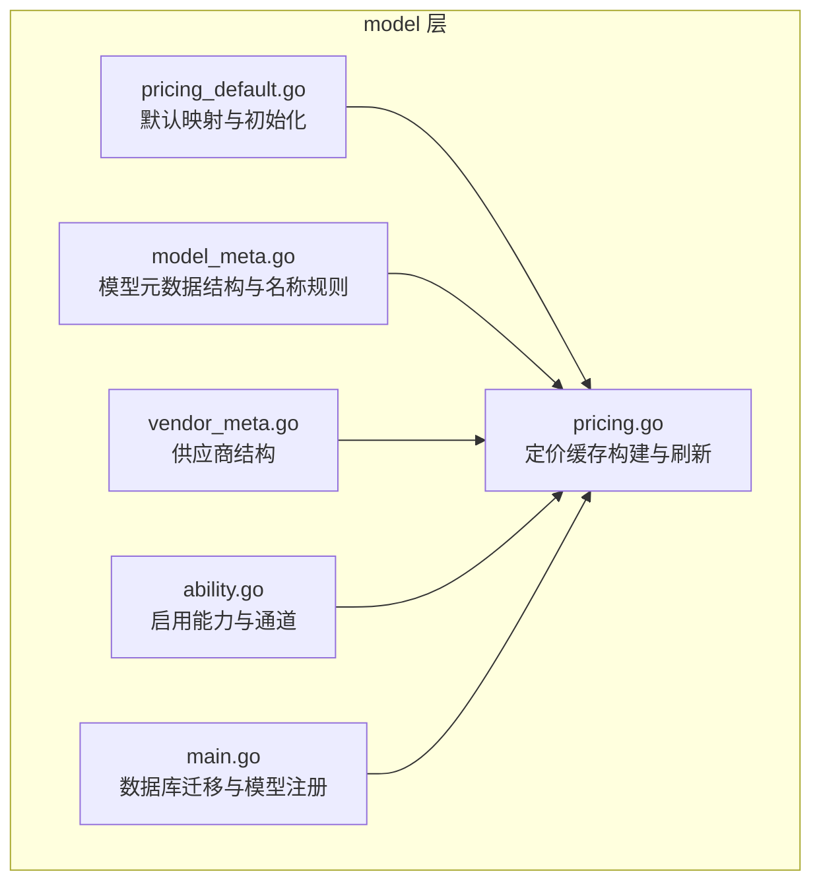
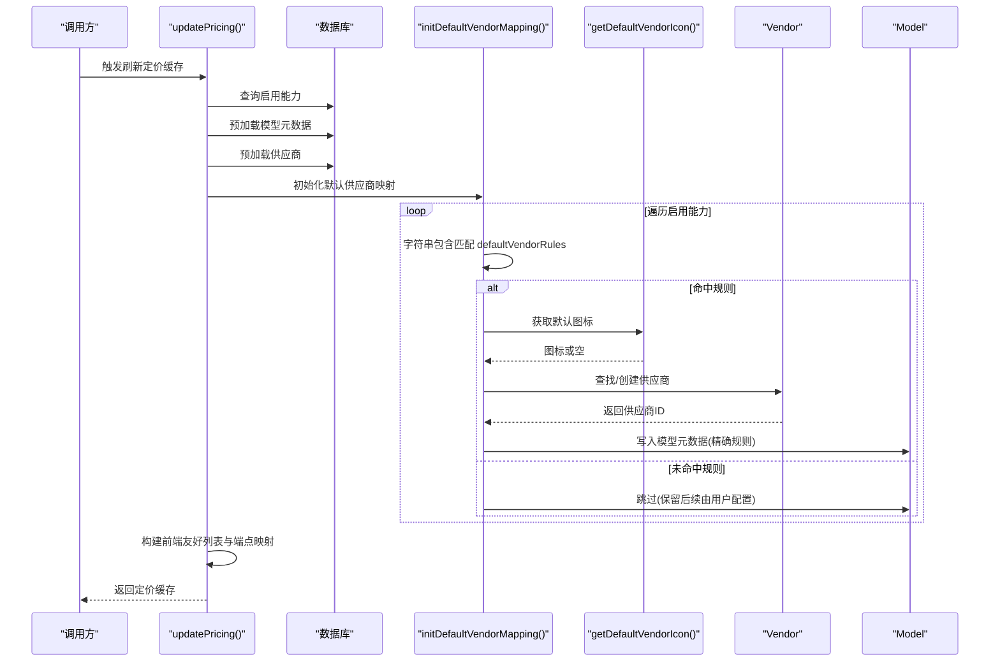
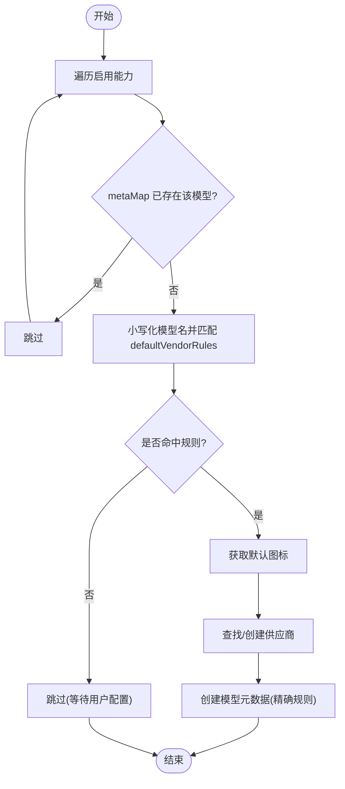
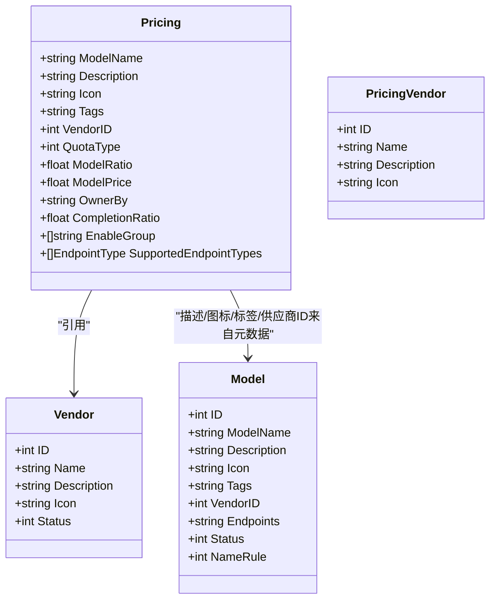
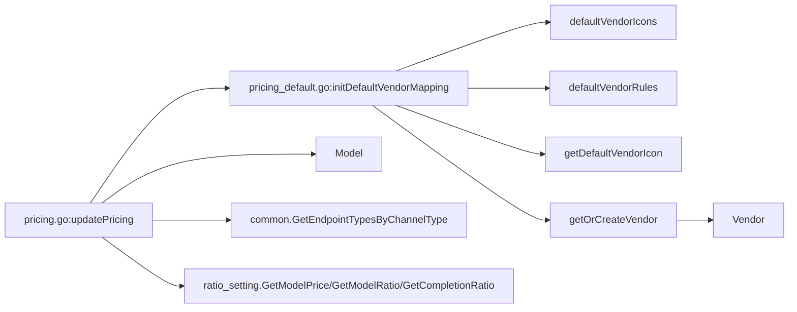

# 默认定价配置

<cite>
**本文引用的文件**
- [pricing_default.go](file://model/pricing_default.go)
- [pricing.go](file://model/pricing.go)
- [model_meta.go](file://model/model_meta.go)
- [vendor_meta.go](file://model/vendor_meta.go)
- [ability.go](file://model/ability.go)
- [main.go](file://model/main.go)
</cite>

## 目录
1. [简介](#简介)
2. [项目结构](#项目结构)
3. [核心组件](#核心组件)
4. [架构总览](#架构总览)
5. [详细组件分析](#详细组件分析)
6. [依赖关系分析](#依赖关系分析)
7. [性能考量](#性能考量)
8. [故障排查指南](#故障排查指南)
9. [结论](#结论)

## 简介
本文件围绕“默认定价配置”主题，系统性阐述以下内容：
- 默认供应商映射规则 defaultVendorRules 的匹配机制与覆盖策略
- 默认图标映射 defaultVendorIcons 的来源与回退逻辑
- initDefaultVendorMapping 如何基于模型名称自动推断供应商并填充模型元数据
- 结合 updatePricing 流程，说明系统如何为未配置元数据的模型自动填充供应商、图标等信息
- 实际案例：新增“gpt-5”模型时系统如何自动识别为 OpenAI 供应商
- 常见问题：供应商映射冲突、图标缺失的处理建议与最佳实践

## 项目结构
默认定价配置相关的核心代码位于 model 子模块，涉及默认映射、供应商与模型元数据、以及定价缓存构建流程。

图表来源
- [pricing_default.go](file://model/pricing_default.go#L1-L129)
- [pricing.go](file://model/pricing.go#L1-L314)
- [model_meta.go](file://model/model_meta.go#L1-L149)
- [vendor_meta.go](file://model/vendor_meta.go#L14-L23)
- [ability.go](file://model/ability.go#L25-L28)
- [main.go](file://model/main.go#L250-L275)

章节来源
- [pricing_default.go](file://model/pricing_default.go#L1-L129)
- [pricing.go](file://model/pricing.go#L1-L314)
- [model_meta.go](file://model/model_meta.go#L1-L149)
- [vendor_meta.go](file://model/vendor_meta.go#L14-L23)
- [ability.go](file://model/ability.go#L25-L28)
- [main.go](file://model/main.go#L250-L275)

## 核心组件
- 默认供应商映射规则 defaultVendorRules：以字符串片段作为键，匹配到对应的供应商名称
- 默认图标映射 defaultVendorIcons：供应商名称到图标标识的映射，缺失时回退为空字符串
- initDefaultVendorMapping：遍历启用能力，基于 defaultVendorRules 推断供应商，若不存在则创建供应商并写入模型元数据
- updatePricing：预加载模型元数据与供应商，执行默认映射初始化，再构建前端友好的定价列表与端点映射

章节来源
- [pricing_default.go](file://model/pricing_default.go#L8-L68)
- [pricing_default.go](file://model/pricing_default.go#L70-L129)
- [pricing.go](file://model/pricing.go#L92-L308)

## 架构总览
默认定价配置在 updatePricing 中完成“预加载—默认映射—构建”的闭环，确保未配置元数据的模型也能获得供应商、图标、端点等信息。

图表来源
- [pricing.go](file://model/pricing.go#L92-L171)
- [pricing_default.go](file://model/pricing_default.go#L70-L129)

## 详细组件分析

### 默认供应商映射规则 defaultVendorRules
- 设计要点
  - 使用字符串片段进行包含匹配，键越具体优先级越高，可有效避免误匹配
  - 覆盖主流厂商的关键字，如“gpt”“claude”“gemini”“qwen”等
  - 对于多语言厂商名称，同时支持中文与英文关键词
- 匹配顺序
  - 采用线性扫描，遇到首个匹配即停止；因此建议将更具体的键放在前面
- 与名称规则的关系
  - 即使未在 models 表中显式配置，只要启用能力中的模型名包含某键，即可触发默认映射

章节来源
- [pricing_default.go](file://model/pricing_default.go#L8-L38)

### 默认图标映射 defaultVendorIcons
- 设计要点
  - 供应商名称到图标标识的映射，便于前端统一渲染
  - 若未在映射中找到，则回退为空字符串，前端可降级显示
- 前端消费
  - 前端组件会优先使用 vendor.icon，否则回退到首字母头像

章节来源
- [pricing_default.go](file://model/pricing_default.go#L40-L68)

### initDefaultVendorMapping：自动推断供应商与填充模型元数据
- 输入
  - metaMap：已存在的模型元数据映射
  - vendorMap：已存在的供应商映射
  - enableAbilities：启用能力列表（含模型名）
- 处理流程
  - 遍历 enableAbilities，若 metaMap 中已存在该模型名则跳过
  - 小写化模型名后，逐条检查 defaultVendorRules，命中即创建/获取供应商并记录 VendorID
  - 为新模型创建 Model 元数据，NameRule 设置为精确匹配，Status 默认启用
- 供应商创建
  - 若 vendorMap 中不存在对应名称的供应商，则构造 Vendor 并插入数据库，再加入 vendorMap
  - 插入失败时返回 0，避免脏数据进入缓存

图表来源
- [pricing_default.go](file://model/pricing_default.go#L70-L129)

章节来源
- [pricing_default.go](file://model/pricing_default.go#L70-L129)

### updatePricing：为未配置元数据的模型自动填充供应商与图标
- 预加载阶段
  - 加载所有模型元数据，区分精确/前缀/后缀/包含规则，构建 metaMap
  - 预加载供应商，构建 vendorMap
- 默认映射阶段
  - 调用 initDefaultVendorMapping，为未配置元数据的模型自动填充 VendorID、图标等
- 构建阶段
  - 构建前端友好的供应商列表 vendorsList
  - 基于启用能力与模型元数据，填充描述、标签、图标、供应商ID等字段
  - 依据 ratio_setting 决定使用价格还是比率进行计费

图表来源
- [pricing.go](file://model/pricing.go#L17-L38)
- [pricing.go](file://model/pricing.go#L265-L308)
- [model_meta.go](file://model/model_meta.go#L22-L43)
- [vendor_meta.go](file://model/vendor_meta.go#L14-L23)

章节来源
- [pricing.go](file://model/pricing.go#L92-L308)
- [model_meta.go](file://model/model_meta.go#L1-L149)
- [vendor_meta.go](file://model/vendor_meta.go#L14-L23)

### 实际案例：新增“gpt-5”模型自动识别为 OpenAI
- 触发条件
  - 启用能力中出现模型名为“gpt-5”
- 匹配过程
  - 小写化后检查 defaultVendorRules，发现包含“gpt”，命中 OpenAI
- 自动填充
  - 通过 getDefaultVendorIcon 获取 OpenAI 对应图标
  - 通过 getOrCreateVendor 查找/创建供应商 OpenAI，返回 VendorID
  - 在 metaMap 中为“gpt-5”创建 Model 元数据，NameRule=精确，Status=启用
- 最终效果
  - 前端展示“gpt-5”时，自动带有 OpenAI 的图标与供应商信息

章节来源
- [pricing_default.go](file://model/pricing_default.go#L8-L38)
- [pricing_default.go](file://model/pricing_default.go#L70-L129)
- [pricing.go](file://model/pricing.go#L122-L171)

## 依赖关系分析
- 组件耦合
  - pricing_default.go 依赖 defaultVendorRules/defaultVendorIcons 进行映射
  - initDefaultVendorMapping 依赖 getOrCreateVendor 与 getDefaultVendorIcon
  - pricing.go 在 updatePricing 中串联预加载、默认映射与构建阶段
- 外部依赖
  - 数据库：GORM 操作 Vendor/Model
  - ratio_setting：决定使用价格还是比率
  - common：端点类型转换与通用工具

图表来源
- [pricing.go](file://model/pricing.go#L92-L308)
- [pricing_default.go](file://model/pricing_default.go#L70-L129)

章节来源
- [pricing.go](file://model/pricing.go#L92-L308)
- [pricing_default.go](file://model/pricing_default.go#L70-L129)

## 性能考量
- 缓存与锁
  - updatePricing 使用互斥锁保护，避免并发重复刷新
  - 定价缓存每分钟刷新一次，减少数据库压力
- 预加载策略
  - 一次性加载所有模型元数据与供应商，降低后续查询次数
  - 非精确规则模型通过前缀/后缀/包含进行批量匹配，避免逐条查询
- 映射效率
  - defaultVendorRules 为固定映射，匹配成本低
  - defaultVendorIcons 为哈希映射，查找 O(1)

章节来源
- [pricing.go](file://model/pricing.go#L57-L70)
- [pricing.go](file://model/pricing.go#L92-L171)

## 故障排查指南
- 供应商映射冲突
  - 症状：同一模型名被多个键命中，导致供应商不确定
  - 建议：将更具体、更稳定的键放在前面；必要时在 models 表中显式配置 NameRule 与 VendorID，以精确覆盖
- 图标缺失
  - 症状：前端显示为默认头像而非品牌图标
  - 原因：defaultVendorIcons 中未配置该供应商
  - 处理：在 defaultVendorIcons 中补充图标映射；或在 models 表中手动填写图标
- 新增模型未生效
  - 症状：新增模型未出现在定价列表
  - 原因：启用能力中未包含该模型名
  - 处理：在渠道/能力配置中添加该模型；或在 models 表中配置 NameRule 与 VendorID
- 供应商创建失败
  - 症状：VendorID 为 0
  - 原因：getOrCreateVendor 插入失败
  - 处理：检查数据库连接与唯一索引约束；必要时在 models 表中手动配置 VendorID

章节来源
- [pricing_default.go](file://model/pricing_default.go#L70-L129)
- [pricing.go](file://model/pricing.go#L122-L171)

## 结论
默认定价配置通过“规则映射 + 自动填充 + 缓存构建”的方式，实现了对未配置元数据模型的自动化支持。defaultVendorRules 与 defaultVendorIcons 提供了稳定可靠的默认行为，initDefaultVendorMapping 与 updatePricing 则确保了在运行时的高效一致性。对于新增模型（如“gpt-5”），系统能够自动识别为 OpenAI 供应商并填充图标等信息。针对冲突与缺失问题，建议通过精确规则配置与图标映射补全来提升稳定性与用户体验。