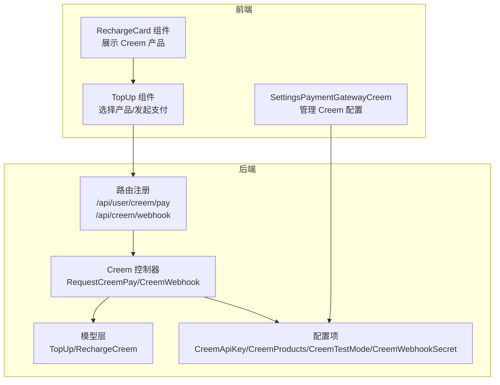
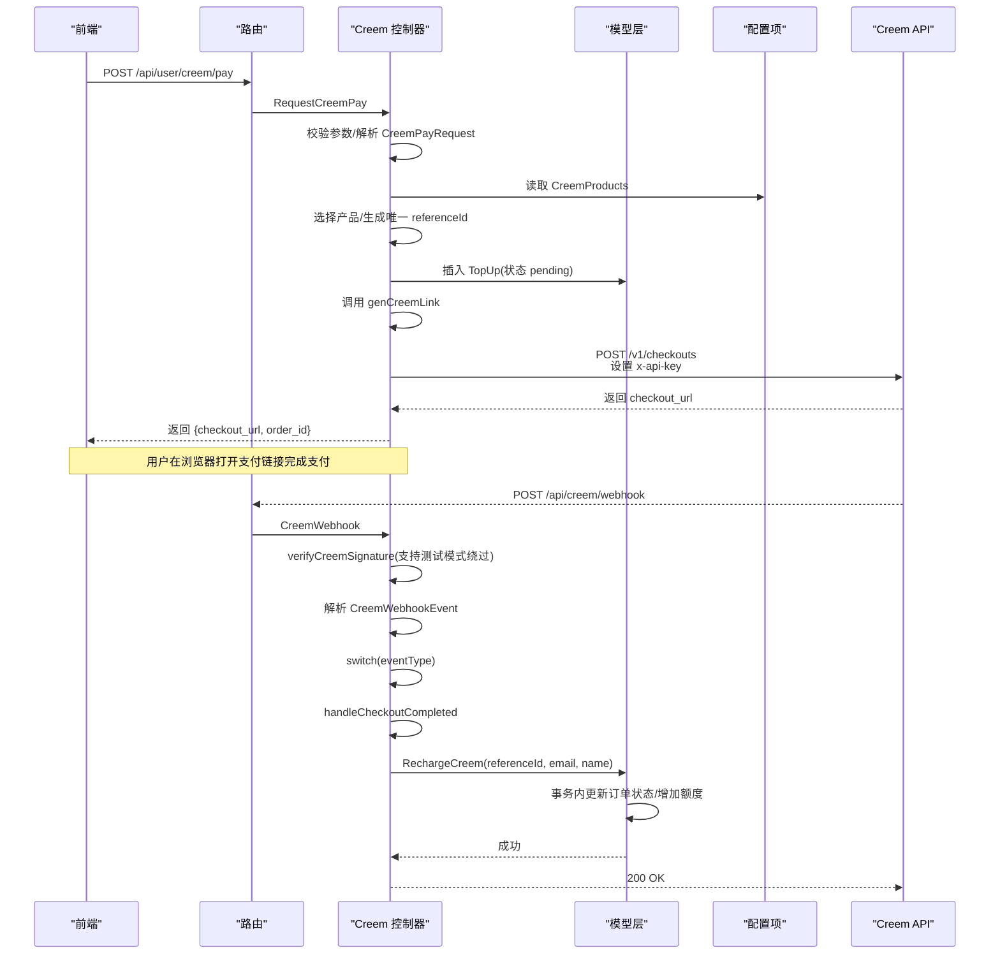
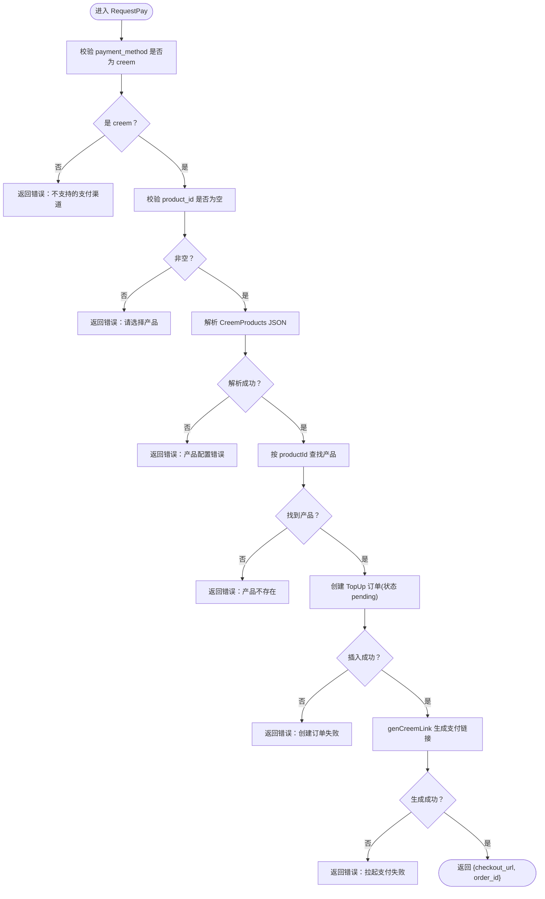
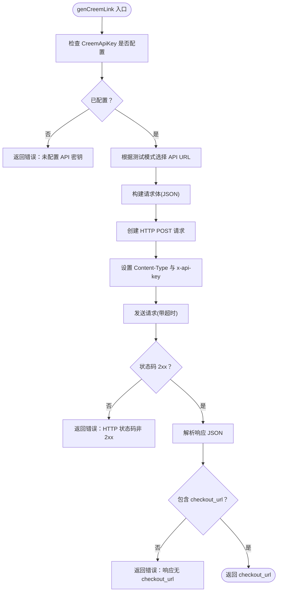
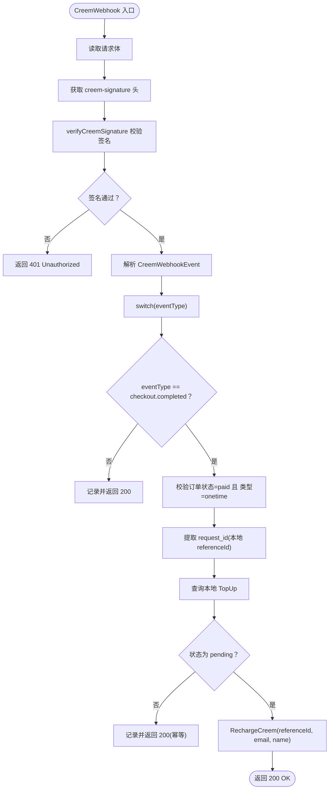
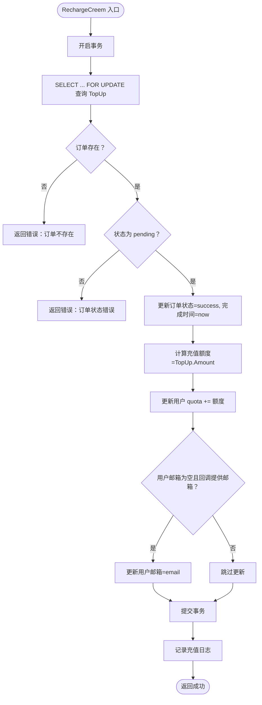
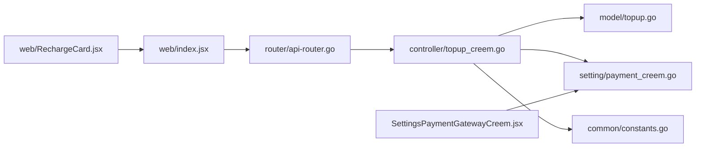

# Creem集成

<cite>
**本文引用的文件**
- [controller/topup_creem.go](file://controller/topup_creem.go)
- [model/topup.go](file://model/topup.go)
- [setting/payment_creem.go](file://setting/payment_creem.go)
- [router/api-router.go](file://router/api-router.go)
- [common/constants.go](file://common/constants.go)
- [web/src/components/topup/index.jsx](file://web/src/components/topup/index.jsx)
- [web/src/components/topup/RechargeCard.jsx](file://web/src/components/topup/RechargeCard.jsx)
- [web/src/pages/Setting/Payment/SettingsPaymentGatewayCreem.jsx](file://web/src/pages/Setting/Payment/SettingsPaymentGatewayCreem.jsx)
</cite>

## 目录
1. [简介](#简介)
2. [项目结构](#项目结构)
3. [核心组件](#核心组件)
4. [架构总览](#架构总览)
5. [详细组件分析](#详细组件分析)
6. [依赖关系分析](#依赖关系分析)
7. [性能考量](#性能考量)
8. [故障排查指南](#故障排查指南)
9. [结论](#结论)
10. [附录](#附录)

## 简介
本文件系统性梳理了系统对 Creem 支付通道的集成实现，覆盖从前端产品选择、后端控制器创建支付会话、HTTP 请求构造与签名验证、Webhook 接收与幂等处理，到数据库事务内完成额度充值与可选邮箱更新的全流程。重点说明以下要点：
- CreemAdaptor.RequestPay 如何解析前端请求、选择产品、创建本地订单并调用 Creem API 生成支付链接，正确设置 x-api-key 和签名验证头。
- CreemWebhook 如何通过 verifyCreemSignature 验证 HMAC-SHA256 签名，并在测试模式下允许绕过签名校验；handleCheckoutCompleted 如何解析新格式 webhook 事件并安全完成充值。
- model/topup.go 中 RechargeCreem 方法在事务中更新用户额度，并在用户邮箱为空时可选地更新邮箱。
- CreemProduct 配置结构与产品选择逻辑，以及测试模式下的签名验证绕过机制。
- 提供从产品选择到支付完成的完整流程图，包含错误处理与日志记录策略。

## 项目结构
Creem 集成涉及前后端与配置文件的关键位置如下：
- 控制器层：controller/topup_creem.go
- 模型层：model/topup.go
- 配置项：setting/payment_creem.go
- 路由注册：router/api-router.go
- 常量定义：common/constants.go
- 前端充值入口与产品展示：web/src/components/topup/index.jsx、web/src/components/topup/RechargeCard.jsx
- 管理端 Creem 配置界面：web/src/pages/Setting/Payment/SettingsPaymentGatewayCreem.jsx

图表来源
- [router/api-router.go](file://router/api-router.go#L44-L46)
- [controller/topup_creem.go](file://controller/topup_creem.go#L144-L167)
- [model/topup.go](file://model/topup.go#L308-L376)
- [setting/payment_creem.go](file://setting/payment_creem.go#L1-L7)
- [web/src/components/topup/index.jsx](file://web/src/components/topup/index.jsx#L257-L304)
- [web/src/components/topup/RechargeCard.jsx](file://web/src/components/topup/RechargeCard.jsx#L488-L516)
- [web/src/pages/Setting/Payment/SettingsPaymentGatewayCreem.jsx](file://web/src/pages/Setting/Payment/SettingsPaymentGatewayCreem.jsx#L1-L45)

章节来源
- [router/api-router.go](file://router/api-router.go#L44-L46)
- [controller/topup_creem.go](file://controller/topup_creem.go#L144-L167)
- [model/topup.go](file://model/topup.go#L308-L376)
- [setting/payment_creem.go](file://setting/payment_creem.go#L1-L7)
- [web/src/components/topup/index.jsx](file://web/src/components/topup/index.jsx#L257-L304)
- [web/src/components/topup/RechargeCard.jsx](file://web/src/components/topup/RechargeCard.jsx#L488-L516)
- [web/src/pages/Setting/Payment/SettingsPaymentGatewayCreem.jsx](file://web/src/pages/Setting/Payment/SettingsPaymentGatewayCreem.jsx#L1-L45)

## 核心组件
- CreemAdaptor.RequestPay：接收前端请求，解析 CreemPayRequest，校验产品与支付方式，创建本地 TopUp 订单，随后调用 genCreemLink 生成支付链接并返回。
- genCreemLink：构造 HTTP 请求调用 Creem API 创建支付会话，设置 Content-Type 与 x-api-key 请求头，按测试模式选择不同 API 端点。
- verifyCreemSignature：基于 HMAC-SHA256 验证 Creem Webhook 签名；在测试模式下若未配置密钥则允许绕过验证。
- CreemWebhook/handleCheckoutCompleted：接收 Creem Webhook，解析新格式事件，校验订单状态与类型，查询本地订单并幂等处理 RechargeCreem。
- RechargeCreem：在事务中将订单标记为成功，计算充值额度并增加用户额度；若用户邮箱为空且回调提供了邮箱，则更新用户邮箱。
- CreemProduct：产品配置结构，包含 productId、name、price、currency、quota 等字段，用于前端展示与后端选择。

章节来源
- [controller/topup_creem.go](file://controller/topup_creem.go#L67-L142)
- [controller/topup_creem.go](file://controller/topup_creem.go#L378-L461)
- [controller/topup_creem.go](file://controller/topup_creem.go#L36-L49)
- [controller/topup_creem.go](file://controller/topup_creem.go#L240-L292)
- [controller/topup_creem.go](file://controller/topup_creem.go#L294-L362)
- [model/topup.go](file://model/topup.go#L308-L376)
- [controller/topup_creem.go](file://controller/topup_creem.go#L51-L63)

## 架构总览
下面的时序图展示了从用户选择产品到支付完成的整体流程，包括签名验证与事务充值。

图表来源
- [router/api-router.go](file://router/api-router.go#L44-L46)
- [controller/topup_creem.go](file://controller/topup_creem.go#L144-L167)
- [controller/topup_creem.go](file://controller/topup_creem.go#L67-L142)
- [controller/topup_creem.go](file://controller/topup_creem.go#L378-L461)
- [controller/topup_creem.go](file://controller/topup_creem.go#L240-L292)
- [controller/topup_creem.go](file://controller/topup_creem.go#L294-L362)
- [model/topup.go](file://model/topup.go#L308-L376)

## 详细组件分析

### CreemAdaptor.RequestPay 实现
- 参数校验：要求 payment_method 为 "creem"，且 product_id 不为空。
- 产品解析与选择：从 setting.CreemProducts 读取 JSON 字符串，反序列化为 CreemProduct 列表，按 productId 匹配目标产品。
- 订单创建：使用用户信息生成唯一 referenceId，创建 TopUp 记录，状态初始化为 pending。
- 支付链接生成：调用 genCreemLink，传入 referenceId、产品、用户邮箱与用户名，返回 checkout_url。
- 响应：返回 {message: "success", data: {checkout_url, order_id}}。

图表来源
- [controller/topup_creem.go](file://controller/topup_creem.go#L67-L142)

章节来源
- [controller/topup_creem.go](file://controller/topup_creem.go#L67-L142)

### genCreemLink：构造 HTTP 请求与签名头
- 端点选择：根据 setting.CreemTestMode 决定使用生产或测试 API 地址。
- 请求体：包含 product_id、request_id（即本地 referenceId）、customer.email 与 metadata（包含 username、reference_id、product_name、quota）。
- 请求头：设置 Content-Type 为 application/json，并设置 x-api-key 为 setting.CreemApiKey。
- 响应处理：检查 HTTP 状态码是否为 2xx，解析响应中的 checkout_url 并返回。

图表来源
- [controller/topup_creem.go](file://controller/topup_creem.go#L378-L461)

章节来源
- [controller/topup_creem.go](file://controller/topup_creem.go#L378-L461)

### Webhook 签名验证与事件处理
- 签名验证：verifyCreemSignature 使用 HMAC-SHA256 对原始 body 计算签名，与请求头 creem-signature 比较；若未配置密钥且处于测试模式，则允许绕过验证。
- Webhook 入口：CreemWebhook 读取 body、获取 creem-signature 头，打印关键信息，调用 verifyCreemSignature 校验。
- 事件分发：解析 CreemWebhookEvent，switch(eventType)，当前支持 "checkout.completed"。
- handleCheckoutCompleted：校验订单状态为 paid、订单类型为 onetime、提取 request_id（即本地 referenceId），查询本地订单并幂等处理 RechargeCreem。

图表来源
- [controller/topup_creem.go](file://controller/topup_creem.go#L36-L49)
- [controller/topup_creem.go](file://controller/topup_creem.go#L240-L292)
- [controller/topup_creem.go](file://controller/topup_creem.go#L294-L362)

章节来源
- [controller/topup_creem.go](file://controller/topup_creem.go#L36-L49)
- [controller/topup_creem.go](file://controller/topup_creem.go#L240-L292)
- [controller/topup_creem.go](file://controller/topup_creem.go#L294-L362)

### model/topup.go：RechargeCreem 事务充值与邮箱更新
- 事务边界：使用 DB.Transaction 包裹，先以行级锁查询并校验订单状态为 pending。
- 订单状态更新：将 CompleteTime 设为当前时间戳，Status 设为 success。
- 额度计算与更新：Creem 直接使用 Amount 作为充值额度（整数），累加到用户 quota。
- 可选邮箱更新：若用户当前邮箱为空且回调提供了 email，则更新用户邮箱。
- 日志记录：充值成功后记录日志。

图表来源
- [model/topup.go](file://model/topup.go#L308-L376)

章节来源
- [model/topup.go](file://model/topup.go#L308-L376)

### CreemProduct 配置结构与产品选择逻辑
- 结构字段：productId、name、price、currency、quota。
- 前端展示：RechargeCard.jsx 展示 Creem 产品列表，点击卡片触发预选与支付流程。
- 后端选择：RequestPay 从 setting.CreemProducts 解析 JSON，按 productId 匹配目标产品，否则返回错误。

章节来源
- [controller/topup_creem.go](file://controller/topup_creem.go#L51-L63)
- [controller/topup_creem.go](file://controller/topup_creem.go#L78-L99)
- [web/src/components/topup/RechargeCard.jsx](file://web/src/components/topup/RechargeCard.jsx#L488-L516)

### 测试模式下的签名验证绕过机制
- verifyCreemSignature：当 CreemWebhookSecret 为空且设置为测试模式时，直接返回 true，允许绕过签名验证。
- CreemWebhook：在测试模式下会打印签名与 body，便于调试。

章节来源
- [controller/topup_creem.go](file://controller/topup_creem.go#L36-L49)
- [controller/topup_creem.go](file://controller/topup_creem.go#L240-L268)

## 依赖关系分析
- 控制器依赖：
  - setting/payment_creem.go：读取 CreemApiKey、CreemProducts、CreemTestMode、CreemWebhookSecret。
  - model/topup.go：创建订单、查询订单、事务充值。
  - common/constants.go：使用 TopUpStatusPending/TopUpStatusSuccess 常量。
- 路由依赖：
  - router/api-router.go：注册 /api/user/creem/pay 与 /api/creem/webhook。
- 前端依赖：
  - web/src/components/topup/index.jsx：发起 /api/user/creem/pay 请求并打开 checkout_url。
  - web/src/components/topup/RechargeCard.jsx：展示 Creem 产品列表。
  - web/src/pages/Setting/Payment/SettingsPaymentGatewayCreem.jsx：管理 Creem 配置项（CreemApiKey、CreemWebhookSecret、CreemProducts、CreemTestMode）。

图表来源
- [router/api-router.go](file://router/api-router.go#L44-L46)
- [controller/topup_creem.go](file://controller/topup_creem.go#L144-L167)
- [model/topup.go](file://model/topup.go#L308-L376)
- [setting/payment_creem.go](file://setting/payment_creem.go#L1-L7)
- [common/constants.go](file://common/constants.go#L204-L207)
- [web/src/components/topup/index.jsx](file://web/src/components/topup/index.jsx#L257-L304)
- [web/src/components/topup/RechargeCard.jsx](file://web/src/components/topup/RechargeCard.jsx#L488-L516)
- [web/src/pages/Setting/Payment/SettingsPaymentGatewayCreem.jsx](file://web/src/pages/Setting/Payment/SettingsPaymentGatewayCreem.jsx#L1-L45)

章节来源
- [router/api-router.go](file://router/api-router.go#L44-L46)
- [controller/topup_creem.go](file://controller/topup_creem.go#L144-L167)
- [model/topup.go](file://model/topup.go#L308-L376)
- [setting/payment_creem.go](file://setting/payment_creem.go#L1-L7)
- [common/constants.go](file://common/constants.go#L204-L207)
- [web/src/components/topup/index.jsx](file://web/src/components/topup/index.jsx#L257-L304)
- [web/src/components/topup/RechargeCard.jsx](file://web/src/components/topup/RechargeCard.jsx#L488-L516)
- [web/src/pages/Setting/Payment/SettingsPaymentGatewayCreem.jsx](file://web/src/pages/Setting/Payment/SettingsPaymentGatewayCreem.jsx#L1-L45)

## 性能考量
- HTTP 调用超时：genCreemLink 使用 30 秒超时，避免阻塞请求线程。
- 幂等处理：handleCheckoutCompleted 对重复 Webhook 采用幂等策略，避免重复充值。
- 事务原子性：RechargeCreem 使用事务保证订单状态更新与额度增加的一致性。
- 日志与告警：关键路径均记录日志，便于定位问题与审计。

## 故障排查指南
- 支付失败（创建订单失败）：检查 RequestPay 中的订单插入是否报错，确认用户上下文与产品配置。
- 拉起支付失败：检查 genCreemLink 的 API 密钥、端点选择与响应解析。
- Webhook 401：确认 creem-signature 头是否存在；若为测试模式且未配置密钥，verifyCreemSignature 将允许绕过。
- Webhook 事件被忽略：当前仅处理 "checkout.completed"，其他事件会被记录并返回 200。
- 重复充值：handleCheckoutCompleted 已做幂等处理；若仍出现异常，检查订单状态与 request_id 是否一致。
- 邮箱未更新：RechargeCreem 仅在用户邮箱为空时才更新；若回调未提供邮箱或用户已有邮箱，不会更新。

章节来源
- [controller/topup_creem.go](file://controller/topup_creem.go#L117-L122)
- [controller/topup_creem.go](file://controller/topup_creem.go#L378-L461)
- [controller/topup_creem.go](file://controller/topup_creem.go#L36-L49)
- [controller/topup_creem.go](file://controller/topup_creem.go#L284-L292)
- [controller/topup_creem.go](file://controller/topup_creem.go#L294-L362)
- [model/topup.go](file://model/topup.go#L308-L376)

## 结论
Creem 集成通过清晰的控制器职责划分、严格的签名验证与测试模式绕过机制、严谨的事务充值与幂等处理，实现了从产品选择到支付完成的完整闭环。前端通过简单交互即可发起支付，后端通过 Webhook 安全可靠地完成充值与用户信息更新。建议在生产环境中务必配置 CreemWebhookSecret 并关闭测试模式，以确保安全性。

## 附录
- 前端充值入口与产品展示路径参考：
  - [web/src/components/topup/index.jsx](file://web/src/components/topup/index.jsx#L257-L304)
  - [web/src/components/topup/RechargeCard.jsx](file://web/src/components/topup/RechargeCard.jsx#L488-L516)
- 管理端 Creem 配置界面：
  - [web/src/pages/Setting/Payment/SettingsPaymentGatewayCreem.jsx](file://web/src/pages/Setting/Payment/SettingsPaymentGatewayCreem.jsx#L1-L45)