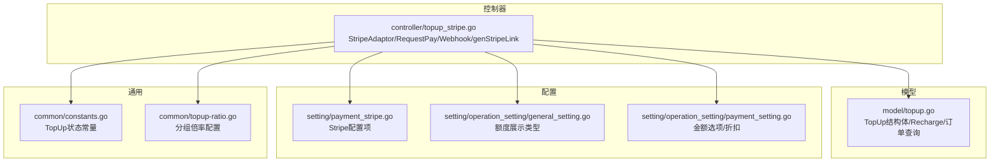
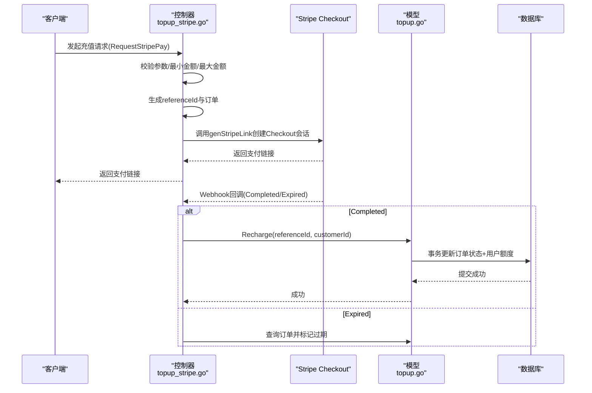
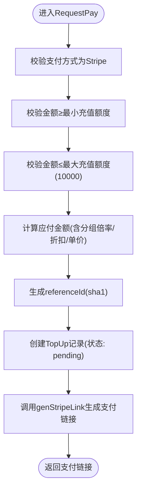
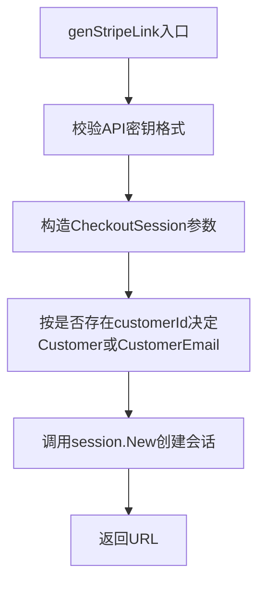
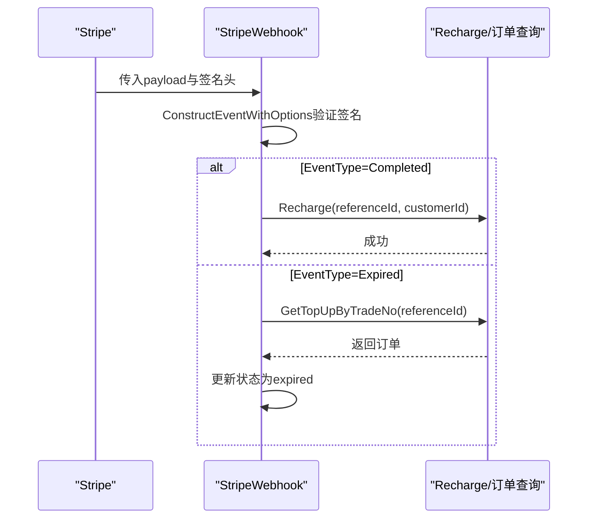
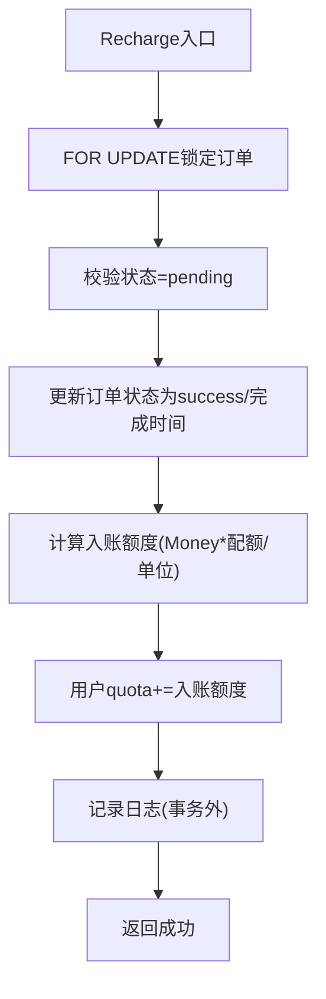
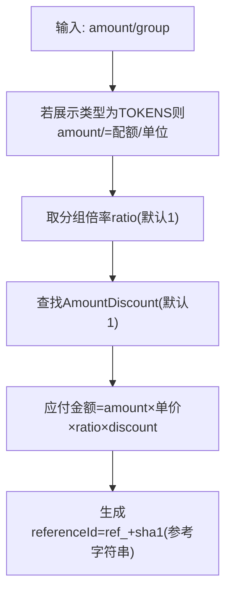
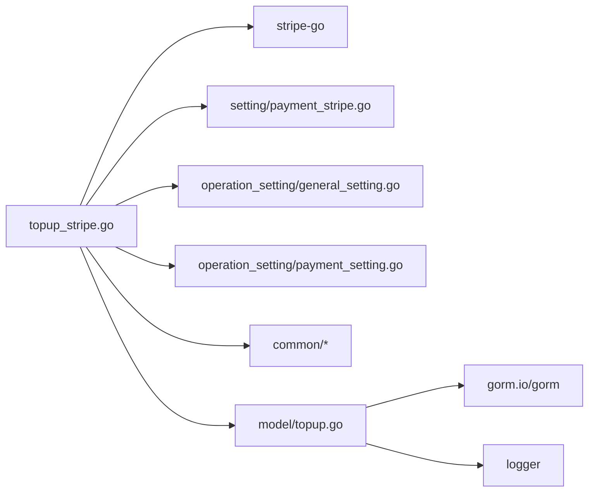

# Stripe集成

<cite>
**本文引用的文件列表**
- [controller/topup_stripe.go](file://controller/topup_stripe.go)
- [model/topup.go](file://model/topup.go)
- [setting/payment_stripe.go](file://setting/payment_stripe.go)
- [common/constants.go](file://common/constants.go)
- [common/topup-ratio.go](file://common/topup-ratio.go)
- [setting/operation_setting/payment_setting.go](file://setting/operation_setting/payment_setting.go)
- [setting/operation_setting/general_setting.go](file://setting/operation_setting/general_setting.go)
</cite>

## 目录
1. [简介](#简介)
2. [项目结构](#项目结构)
3. [核心组件](#核心组件)
4. [架构总览](#架构总览)
5. [组件详解](#组件详解)
6. [依赖关系分析](#依赖关系分析)
7. [性能与并发特性](#性能与并发特性)
8. [故障排查指南](#故障排查指南)
9. [结论](#结论)

## 简介
本文件围绕Stripe在线充值能力进行系统化文档化，重点解析以下内容：
- controller/topup_stripe.go中StripeAdaptor的RequestPay与StripeWebhook实现
- genStripeLink如何使用stripe-go库生成Checkout会话链接，并通过client_reference_id传递订单标识
- StripeWebhook中如何通过webhook.ConstructEventWithOptions验证签名，以及sessionCompleted与sessionExpired事件处理器如何根据事件类型更新订单状态
- model/topup.go中Recharge方法如何在事务中安全地完成充值并更新用户额度
- 支付金额计算getStripePayMoney中的分组倍率与货币单位处理，以及referenceId的生成策略
- 支付流程的错误处理机制，包括API密钥校验、金额范围检查与并发订单防护

## 项目结构
Stripe集成涉及后端控制器、模型层、配置与通用常量/比率配置等模块。下图给出与Stripe充值相关的关键文件与职责映射。

图表来源
- [controller/topup_stripe.go](file://controller/topup_stripe.go#L1-L289)
- [model/topup.go](file://model/topup.go#L1-L120)
- [setting/payment_stripe.go](file://setting/payment_stripe.go#L1-L9)
- [setting/operation_setting/general_setting.go](file://setting/operation_setting/general_setting.go#L1-L92)
- [setting/operation_setting/payment_setting.go](file://setting/operation_setting/payment_setting.go#L1-L24)
- [common/constants.go](file://common/constants.go#L196-L208)
- [common/topup-ratio.go](file://common/topup-ratio.go#L1-L34)

章节来源
- [controller/topup_stripe.go](file://controller/topup_stripe.go#L1-L289)
- [model/topup.go](file://model/topup.go#L1-L120)
- [setting/payment_stripe.go](file://setting/payment_stripe.go#L1-L9)
- [common/constants.go](file://common/constants.go#L196-L208)
- [common/topup-ratio.go](file://common/topup-ratio.go#L1-L34)
- [setting/operation_setting/general_setting.go](file://setting/operation_setting/general_setting.go#L1-L92)
- [setting/operation_setting/payment_setting.go](file://setting/operation_setting/payment_setting.go#L1-L24)

## 核心组件
- StripeAdaptor：封装Stripe充值相关接口，包含RequestAmount与RequestPay两个方法，分别用于预估应付金额与发起支付。
- StripeWebhook：接收Stripe回调，验证签名后根据事件类型执行订单状态更新。
- genStripeLink：基于stripe-go创建Checkout会话，设置client_reference_id作为订单标识，并返回支付链接。
- Recharge：在数据库事务内完成订单状态变更与用户额度更新，确保一致性。
- 金额计算与配置：getStripePayMoney结合额度展示类型、分组倍率、促销折扣与单价计算应付金额；getStripeMinTopup根据展示类型转换最小充值额度。

章节来源
- [controller/topup_stripe.go](file://controller/topup_stripe.go#L31-L106)
- [controller/topup_stripe.go](file://controller/topup_stripe.go#L128-L211)
- [controller/topup_stripe.go](file://controller/topup_stripe.go#L213-L250)
- [model/topup.go](file://model/topup.go#L58-L104)
- [controller/topup_stripe.go](file://controller/topup_stripe.go#L261-L288)

## 架构总览
下图展示从客户端发起充值请求到Stripe支付完成并回写系统的整体流程。

图表来源
- [controller/topup_stripe.go](file://controller/topup_stripe.go#L58-L106)
- [controller/topup_stripe.go](file://controller/topup_stripe.go#L213-L250)
- [controller/topup_stripe.go](file://controller/topup_stripe.go#L128-L211)
- [model/topup.go](file://model/topup.go#L58-L104)

## 组件详解

### 1) StripeAdaptor.RequestPay
- 参数校验：检查支付方式是否为Stripe，金额不得低于最小充值额度且不超过上限。
- 金额计算：根据用户分组倍率与配置的单价计算应付金额，同时考虑额度展示类型（USD/TOKENS）与可选折扣。
- 订单生成：生成唯一referenceId（基于时间戳与随机串的哈希），创建TopUp记录并置为“待支付”。
- 支付链接：调用genStripeLink生成Checkout会话链接，设置client_reference_id以便后续回调识别订单。

图表来源
- [controller/topup_stripe.go](file://controller/topup_stripe.go#L58-L106)
- [controller/topup_stripe.go](file://controller/topup_stripe.go#L261-L288)

章节来源
- [controller/topup_stripe.go](file://controller/topup_stripe.go#L58-L106)
- [controller/topup_stripe.go](file://controller/topup_stripe.go#L261-L288)

### 2) genStripeLink：生成Checkout会话链接
- API密钥校验：对配置的Stripe API密钥进行前缀校验，确保为有效密钥。
- 客户关联：若用户已有StripeCustomer则直接复用；否则根据邮箱自动创建客户。
- 价格行项：使用配置的PriceId与数量(quantity=充值数量)生成行项。
- 回调参数：设置client_reference_id为订单referenceId，成功/取消页面地址来自系统配置。
- 返回链接：调用stripe-go创建会话并返回URL。

图表来源
- [controller/topup_stripe.go](file://controller/topup_stripe.go#L213-L250)

章节来源
- [controller/topup_stripe.go](file://controller/topup_stripe.go#L213-L250)

### 3) StripeWebhook：回调验证与事件处理
- 签名校验：读取请求体与头部签名，使用配置的Webhook Secret通过ConstructEventWithOptions验证。
- 事件分发：根据事件类型switch分派至sessionCompleted或sessionExpired。
- sessionCompleted：校验状态为complete，调用Recharge完成订单与额度入账。
- sessionExpired：校验状态为expired，查询订单并将其置为“已过期”。

图表来源
- [controller/topup_stripe.go](file://controller/topup_stripe.go#L128-L211)
- [model/topup.go](file://model/topup.go#L48-L56)

章节来源
- [controller/topup_stripe.go](file://controller/topup_stripe.go#L128-L211)
- [model/topup.go](file://model/topup.go#L48-L56)

### 4) model.TopUp.Recharge：事务内安全充值
- 锁定与幂等：使用FOR UPDATE锁定订单，避免并发重复入账；仅处理“待支付”状态。
- 状态变更：设置完成时间与状态为“成功”，保存订单。
- 额度入账：根据订单Money与每单位配额比例计算应入账额度并累加到用户quota。
- 日志记录：在事务外记录充值日志，保证一致性与性能平衡。

图表来源
- [model/topup.go](file://model/topup.go#L58-L104)

章节来源
- [model/topup.go](file://model/topup.go#L58-L104)

### 5) 金额计算与referenceId生成策略
- 金额计算getStripePayMoney：
  - 若额度展示类型为TOKENS，则将输入金额除以每单位配额，再乘以单价、分组倍率与可选折扣。
  - 分组倍率来自common.GetTopupGroupRatio，若未配置则默认为1。
  - 折扣来自operation_setting.GetPaymentSetting().AmountDiscount，按原始请求金额查找。
- 最小充值额度getStripeMinTopup：
  - 若展示类型为TOKENS，则将配置的最小充值额度乘以每单位配额。
- referenceId生成：
  - 使用“new-api-ref-{userId}-{timestamp}-{随机串}”拼接后经sha1生成，前缀“ref_”便于识别与存储。

图表来源
- [controller/topup_stripe.go](file://controller/topup_stripe.go#L261-L288)
- [common/topup-ratio.go](file://common/topup-ratio.go#L21-L34)
- [setting/operation_setting/payment_setting.go](file://setting/operation_setting/payment_setting.go#L1-L24)
- [setting/operation_setting/general_setting.go](file://setting/operation_setting/general_setting.go#L1-L92)

章节来源
- [controller/topup_stripe.go](file://controller/topup_stripe.go#L261-L288)
- [common/topup-ratio.go](file://common/topup-ratio.go#L21-L34)
- [setting/operation_setting/payment_setting.go](file://setting/operation_setting/payment_setting.go#L1-L24)
- [setting/operation_setting/general_setting.go](file://setting/operation_setting/general_setting.go#L1-L92)

## 依赖关系分析
- 控制器依赖：
  - stripe-go：创建Checkout会话与验证Webhook签名
  - setting/payment_stripe.go：读取API密钥、Webhook密钥、PriceId、单价、最小充值额度、促销开关
  - operation_setting：读取额度展示类型与金额折扣配置
  - common：读取TopUp状态常量、分组倍率、每单位配额
- 模型依赖：
  - GORM：事务、行级锁、更新用户quota
  - 日志：记录充值成功日志

图表来源
- [controller/topup_stripe.go](file://controller/topup_stripe.go#L1-L289)
- [model/topup.go](file://model/topup.go#L1-L120)
- [setting/payment_stripe.go](file://setting/payment_stripe.go#L1-L9)
- [setting/operation_setting/general_setting.go](file://setting/operation_setting/general_setting.go#L1-L92)
- [setting/operation_setting/payment_setting.go](file://setting/operation_setting/payment_setting.go#L1-L24)
- [common/constants.go](file://common/constants.go#L196-L208)
- [common/topup-ratio.go](file://common/topup-ratio.go#L1-L34)

章节来源
- [controller/topup_stripe.go](file://controller/topup_stripe.go#L1-L289)
- [model/topup.go](file://model/topup.go#L1-L120)

## 性能与并发特性
- 并发订单防护：
  - Webhook回调中对订单使用FOR UPDATE锁定，避免并发重复入账。
  - 手动补单接口同样采用行级锁与幂等判断，确保只成功一次。
- 事务一致性：
  - Recharge在单事务内完成订单状态更新与用户额度增加，保证原子性。
- 日志与外部调用：
  - 充值日志在事务外记录，避免阻塞数据库事务。
- 金额计算：
  - 使用浮点计算，适用于小额金额场景；若未来涉及大额或高精度需求，建议迁移到decimal库。

章节来源
- [model/topup.go](file://model/topup.go#L58-L104)
- [model/topup.go](file://model/topup.go#L238-L307)

## 故障排查指南
- Webhook验签失败：
  - 确认Stripe-Signature头存在且与配置的Webhook Secret一致。
  - ConstructEventWithOptions忽略版本不匹配，但需确保密钥正确。
- 支付链接生成失败：
  - 检查API密钥格式（必须以sk_或rk_开头）。
  - 确认PriceId与促销开关配置正确。
- 订单状态异常：
  - Completed事件需确保状态为complete，否则忽略。
  - Expired事件需确保状态为expired且referenceId非空。
- 金额与最小充值：
  - 若展示类型为TOKENS，注意最小充值额度与金额计算的换算关系。
  - 折扣配置需与AmountOptions匹配，避免出现无效折扣。

章节来源
- [controller/topup_stripe.go](file://controller/topup_stripe.go#L128-L211)
- [controller/topup_stripe.go](file://controller/topup_stripe.go#L213-L250)
- [controller/topup_stripe.go](file://controller/topup_stripe.go#L261-L288)

## 结论
本Stripe集成方案通过清晰的控制器与模型职责划分，实现了从订单创建、支付链接生成、Webhook回调验证到事务内安全充值的完整闭环。关键点包括：
- 通过client_reference_id将Stripe会话与应用订单绑定，确保回调可准确识别订单。
- 使用事务与行级锁保障并发安全与数据一致性。
- 金额计算综合考虑展示类型、分组倍率、促销折扣与单价，满足灵活定价需求。
- Webhook签名验证与事件分发确保回调链路的安全与可维护性。