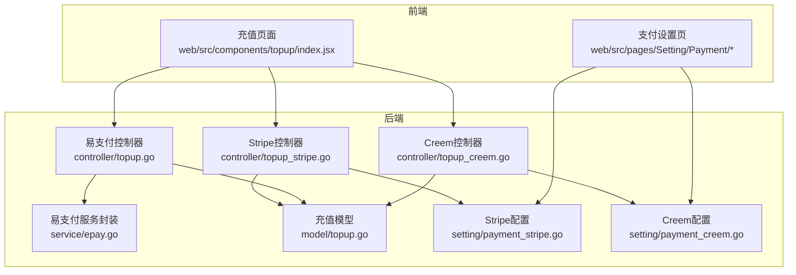
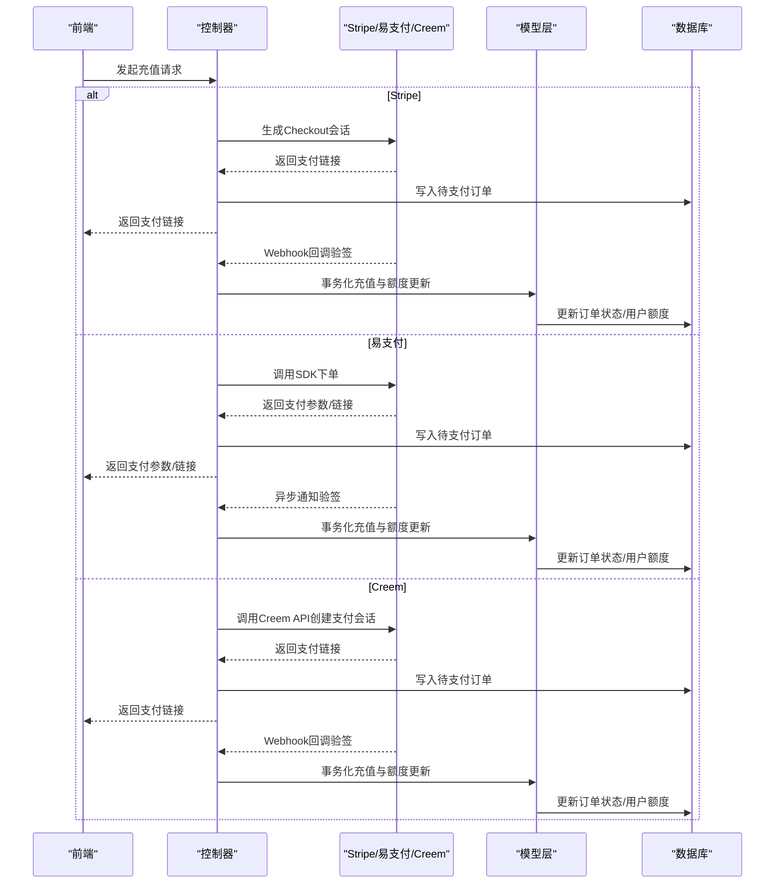
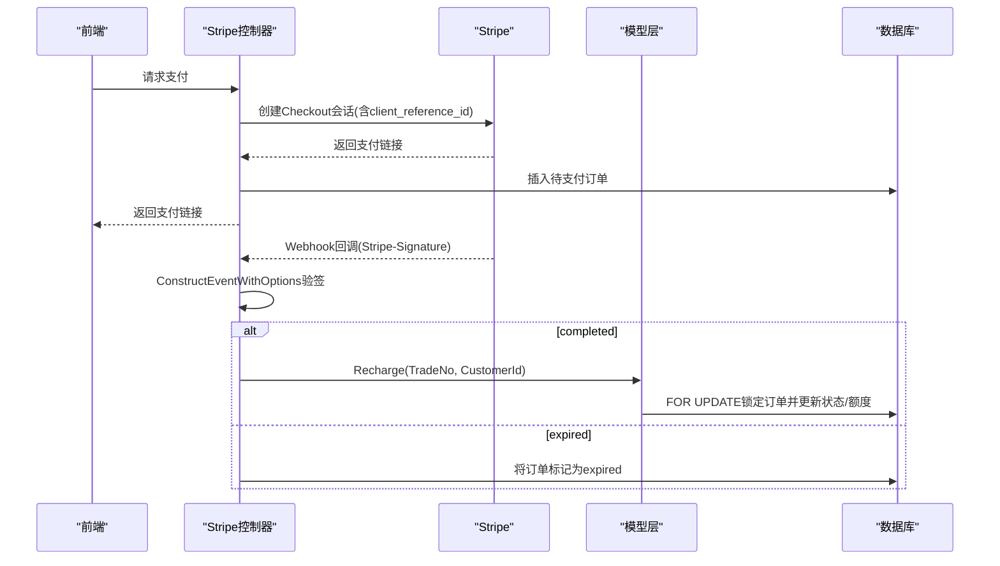
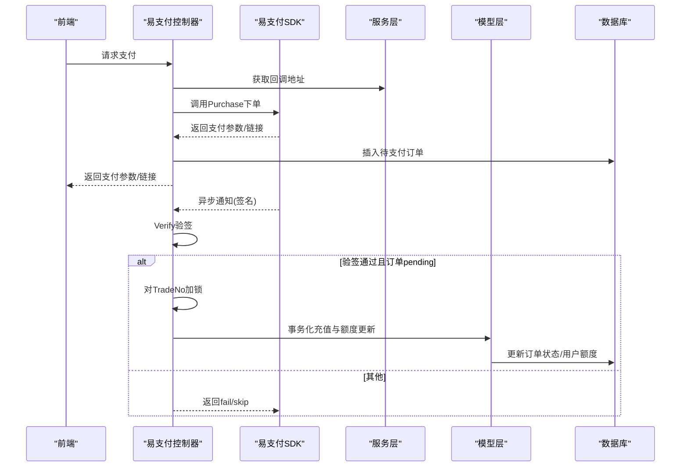
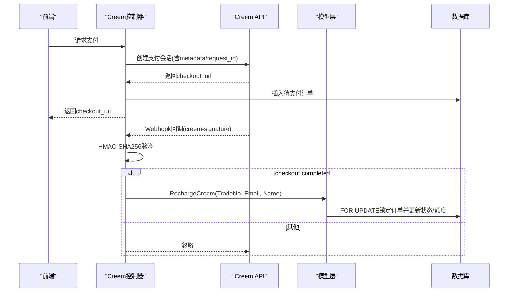
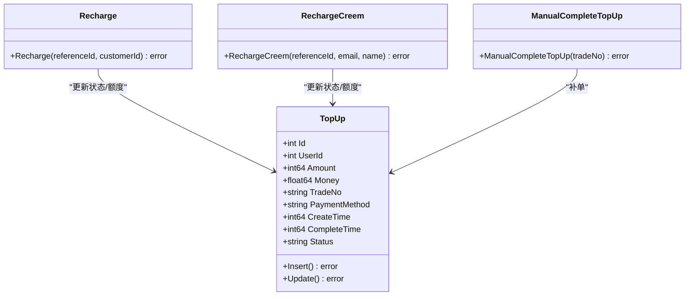
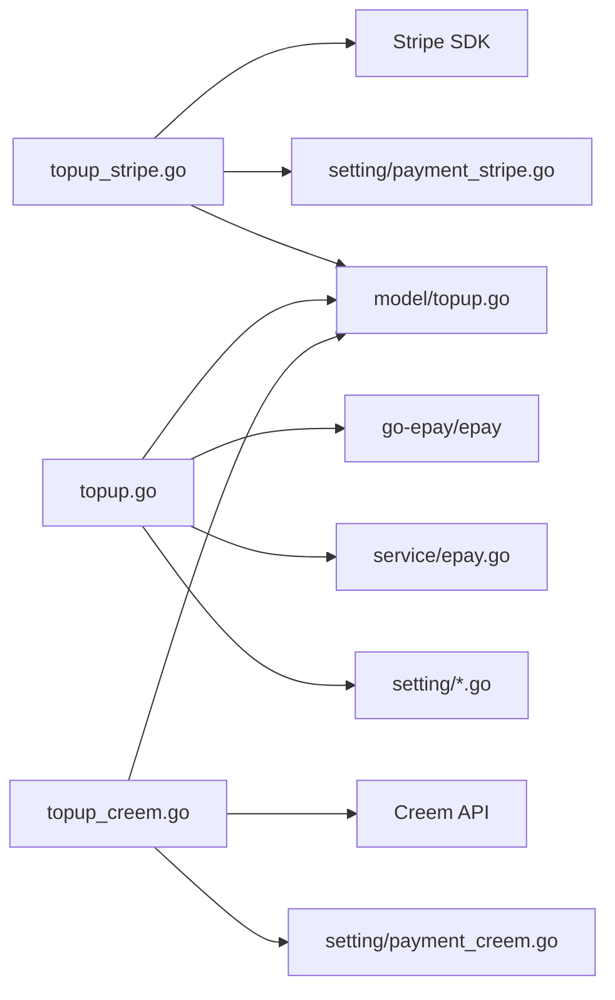

# 支付集成

<cite>
**本文引用的文件**
- [controller/topup_stripe.go](file://controller/topup_stripe.go)
- [controller/topup.go](file://controller/topup.go)
- [controller/topup_creem.go](file://controller/topup_creem.go)
- [service/epay.go](file://service/epay.go)
- [model/topup.go](file://model/topup.go)
- [setting/payment_stripe.go](file://setting/payment_stripe.go)
- [setting/payment_creem.go](file://setting/payment_creem.go)
- [web/src/components/topup/index.jsx](file://web/src/components/topup/index.jsx)
- [web/src/pages/Setting/Payment/SettingsPaymentGateway.jsx](file://web/src/pages/Setting/Payment/SettingsPaymentGateway.jsx)
- [web/src/pages/Setting/Payment/SettingsPaymentGatewayStripe.jsx](file://web/src/pages/Setting/Payment/SettingsPaymentGatewayStripe.jsx)
- [web/src/pages/Setting/Payment/SettingsPaymentGatewayCreem.jsx](file://web/src/pages/Setting/Payment/SettingsPaymentGatewayCreem.jsx)
</cite>

## 目录
1. [简介](#简介)
2. [项目结构](#项目结构)
3. [核心组件](#核心组件)
4. [架构总览](#架构总览)
5. [详细组件分析](#详细组件分析)
6. [依赖关系分析](#依赖关系分析)
7. [性能考量](#性能考量)
8. [故障排查指南](#故障排查指南)
9. [结论](#结论)
10. [附录](#附录)

## 简介
本文件系统性梳理了系统内三种支付网关的集成实现：Stripe、易支付（epay）与 Creem 支付网关。重点覆盖以下方面：
- controller/topup_stripe.go 中的支付回调签名验证、订单状态同步与防重放攻击机制
- service/epay.go 对易支付 API 协议的封装、异步通知与交易对账
- model/topup.go 中充值记录的数据结构设计与幂等处理
- 支付流程的序列图，涵盖前端发起、后端生成订单、跳转支付与结果回调
- 支付失败、超时与部分到账等异常场景的处理策略，以及通过管理员补单与定时任务进行账单核对的建议

## 项目结构
支付相关代码主要分布在以下模块：
- 控制器层：处理前端请求、生成支付链接、接收第三方回调并落库
- 服务层：封装易支付回调地址等通用逻辑
- 模型层：定义充值记录结构、提供查询与事务化充值处理
- 设置层：存储各网关的密钥与配置
- 前端：支付方式配置与充值入口

图表来源
- [controller/topup_stripe.go](file://controller/topup_stripe.go#L1-L289)
- [controller/topup.go](file://controller/topup.go#L1-L393)
- [controller/topup_creem.go](file://controller/topup_creem.go#L1-L462)
- [service/epay.go](file://service/epay.go#L1-L14)
- [model/topup.go](file://model/topup.go#L1-L377)
- [setting/payment_stripe.go](file://setting/payment_stripe.go#L1-L9)
- [setting/payment_creem.go](file://setting/payment_creem.go#L1-L7)
- [web/src/components/topup/index.jsx](file://web/src/components/topup/index.jsx#L257-L304)
- [web/src/pages/Setting/Payment/SettingsPaymentGateway.jsx](file://web/src/pages/Setting/Payment/SettingsPaymentGateway.jsx#L32-L182)
- [web/src/pages/Setting/Payment/SettingsPaymentGatewayStripe.jsx](file://web/src/pages/Setting/Payment/SettingsPaymentGatewayStripe.jsx#L1-L200)
- [web/src/pages/Setting/Payment/SettingsPaymentGatewayCreem.jsx](file://web/src/pages/Setting/Payment/SettingsPaymentGatewayCreem.jsx#L1-L120)

章节来源
- [controller/topup_stripe.go](file://controller/topup_stripe.go#L1-L289)
- [controller/topup.go](file://controller/topup.go#L1-L393)
- [controller/topup_creem.go](file://controller/topup_creem.go#L1-L462)
- [service/epay.go](file://service/epay.go#L1-L14)
- [model/topup.go](file://model/topup.go#L1-L377)
- [setting/payment_stripe.go](file://setting/payment_stripe.go#L1-L9)
- [setting/payment_creem.go](file://setting/payment_creem.go#L1-L7)
- [web/src/components/topup/index.jsx](file://web/src/components/topup/index.jsx#L257-L304)
- [web/src/pages/Setting/Payment/SettingsPaymentGateway.jsx](file://web/src/pages/Setting/Payment/SettingsPaymentGateway.jsx#L32-L182)
- [web/src/pages/Setting/Payment/SettingsPaymentGatewayStripe.jsx](file://web/src/pages/Setting/Payment/SettingsPaymentGatewayStripe.jsx#L1-L200)
- [web/src/pages/Setting/Payment/SettingsPaymentGatewayCreem.jsx](file://web/src/pages/Setting/Payment/SettingsPaymentGatewayCreem.jsx#L1-L120)

## 核心组件
- Stripe 支付控制器：负责生成 Stripe Checkout 支付链接、接收 Webhook 回调并完成订单状态同步
- 易支付控制器：封装易支付客户端、生成支付链接、处理异步通知并进行对账
- Creem 支付控制器：生成 Creem 支付链接、接收 Webhook 并完成订单状态同步
- 充值模型：统一的充值记录结构与事务化充值处理，支持管理员补单
- 易支付服务封装：根据配置返回回调地址，便于统一管理回调域名
- 前端充值入口与设置页：提供支付方式选择、最小充值额提示与网关配置

章节来源
- [controller/topup_stripe.go](file://controller/topup_stripe.go#L1-L289)
- [controller/topup.go](file://controller/topup.go#L1-L393)
- [controller/topup_creem.go](file://controller/topup_creem.go#L1-L462)
- [service/epay.go](file://service/epay.go#L1-L14)
- [model/topup.go](file://model/topup.go#L1-L377)
- [web/src/components/topup/index.jsx](file://web/src/components/topup/index.jsx#L257-L304)

## 架构总览
支付流程在后端分为两条主线：
- 在线支付（易支付）：后端生成订单并调用易支付 SDK 拉起支付，接收异步通知后落库并增加用户额度
- 第三方托管支付（Stripe/Creem）：后端生成支付链接或支付会话，用户在第三方页面完成支付后，第三方回调至后端，后端校验签名并落库

图表来源
- [controller/topup_stripe.go](file://controller/topup_stripe.go#L128-L211)
- [controller/topup.go](file://controller/topup.go#L130-L203)
- [controller/topup.go](file://controller/topup.go#L232-L293)
- [controller/topup_creem.go](file://controller/topup_creem.go#L240-L362)
- [model/topup.go](file://model/topup.go#L58-L104)

## 详细组件分析

### Stripe 支付集成（controller/topup_stripe.go）
- 支付链接生成
  - 使用 Stripe Checkout Session，设置 client_reference_id（即 TradeNo）、价格、促销码开关、成功/取消回调地址等
  - 若用户无 Stripe CustomerId，则自动创建客户并绑定邮箱
- 回调签名验证
  - 读取请求体与 Stripe-Signature 头，使用 webhook.ConstructEventWithOptions 验签
  - 忽略 API 版本不匹配以兼容不同版本
- 订单状态同步
  - completed 事件：调用 model.Recharge，基于 TradeNo 加行级锁，事务内更新订单状态为成功并增加用户额度
  - expired 事件：若订单仍为 pending，将其标记为 expired
- 防重放与幂等
  - 通过 TradeNo 加行级锁（FOR UPDATE）保证同一订单并发处理的串行化
  - 事件类型与状态校验，避免重复处理与错误状态处理
- 金额计算
  - 展示类型为 tokens 时转换为美元金额，结合分组倍率与折扣计算应付金额

图表来源
- [controller/topup_stripe.go](file://controller/topup_stripe.go#L128-L211)
- [controller/topup_stripe.go](file://controller/topup_stripe.go#L213-L249)
- [model/topup.go](file://model/topup.go#L58-L104)

章节来源
- [controller/topup_stripe.go](file://controller/topup_stripe.go#L128-L211)
- [controller/topup_stripe.go](file://controller/topup_stripe.go#L213-L249)
- [model/topup.go](file://model/topup.go#L58-L104)

### 易支付（epay）集成（controller/topup.go 与 service/epay.go）
- SDK 封装与回调地址
  - GetEpayClient 基于配置构造客户端
  - GetCallbackAddress 依据系统设置返回回调地址，支持自定义回调地址
- 生成订单与支付链接
  - 生成 TradeNo，插入待支付订单，调用 SDK 下单并返回支付参数/链接
- 异步通知与对账
  - EpayNotify 接收异步通知，先用 Verify 校验签名，再按 TradeNo 加锁，查询订单并执行事务化充值与额度更新
- 防重放与幂等
  - 使用 sync.Map + sync.Mutex 对 TradeNo 进行进程内互斥，避免并发重复处理
  - 仅当订单状态为 pending 时才处理，避免重复入账
- 金额计算
  - 根据展示类型与分组倍率计算应付金额，并在 tokens 展示类型下做单位换算

图表来源
- [controller/topup.go](file://controller/topup.go#L130-L203)
- [controller/topup.go](file://controller/topup.go#L232-L293)
- [service/epay.go](file://service/epay.go#L1-L14)

章节来源
- [controller/topup.go](file://controller/topup.go#L130-L203)
- [controller/topup.go](file://controller/topup.go#L232-L293)
- [service/epay.go](file://service/epay.go#L1-L14)

### Creem 支付集成（controller/topup_creem.go）
- 支付链接生成
  - 读取 Creem 配置的产品列表，选择对应产品，生成唯一 TradeNo 并创建订单
  - 调用 Creem API 创建支付会话，返回 checkout_url
- Webhook 回调与验签
  - 读取 creem-signature 头，使用 HMAC-SHA256 验签；测试模式可跳过验签
  - 解析新格式 webhook 数据，按 eventType 分发处理
- 订单状态同步
  - checkout.completed 事件：校验订单状态为 paid、类型为 onetime，按 TradeNo 查询本地订单并事务化充值
  - 仅处理 pending 状态订单，避免重复处理
- 防重放与幂等
  - 通过 TradeNo 查询并加行级锁（FOR UPDATE），确保并发安全
  - 已处理过的订单直接返回成功，避免重复处理

图表来源
- [controller/topup_creem.go](file://controller/topup_creem.go#L240-L362)
- [controller/topup_creem.go](file://controller/topup_creem.go#L378-L461)
- [model/topup.go](file://model/topup.go#L308-L377)

章节来源
- [controller/topup_creem.go](file://controller/topup_creem.go#L240-L362)
- [controller/topup_creem.go](file://controller/topup_creem.go#L378-L461)
- [model/topup.go](file://model/topup.go#L308-L377)

### 充值记录数据结构（model/topup.go）
- 字段设计
  - Id、UserId、Amount、Money、TradeNo、PaymentMethod、CreateTime、CompleteTime、Status
  - TradeNo 唯一索引，便于回调幂等与补单
- 事务化充值
  - Recharge/RechargeCreem：按 TradeNo 查询并加行级锁，校验状态为 pending，更新状态与完成时间，再原子性增加用户额度
  - ManualCompleteTopUp：管理员补单入口，支持幂等与不同支付方式的额度换算
- 查询与分页
  - 提供按用户与全平台的充值记录查询、关键词搜索与分页

图表来源
- [model/topup.go](file://model/topup.go#L14-L36)
- [model/topup.go](file://model/topup.go#L58-L104)
- [model/topup.go](file://model/topup.go#L308-L377)
- [model/topup.go](file://model/topup.go#L238-L307)

章节来源
- [model/topup.go](file://model/topup.go#L14-L36)
- [model/topup.go](file://model/topup.go#L58-L104)
- [model/topup.go](file://model/topup.go#L238-L307)
- [model/topup.go](file://model/topup.go#L308-L377)

### 前端交互与配置
- 前端充值入口
  - 在线充值（易支付）与第三方支付（Stripe/Creem）入口，根据后端返回的启用状态与最小充值额动态展示
- 支付设置页
  - 易支付：配置 PayAddress、EpayId、EpayKey、Price、MinTopUp、CustomCallbackAddress、PayMethods、AmountOptions、AmountDiscount
  - Stripe：配置 StripeApiSecret、StripeWebhookSecret、StripePriceId、StripeUnitPrice、StripeMinTopUp、StripePromotionCodesEnabled
  - Creem：配置 CreemApiKey、CreemWebhookSecret、CreemProducts、CreemTestMode

章节来源
- [web/src/components/topup/index.jsx](file://web/src/components/topup/index.jsx#L257-L304)
- [web/src/pages/Setting/Payment/SettingsPaymentGateway.jsx](file://web/src/pages/Setting/Payment/SettingsPaymentGateway.jsx#L32-L182)
- [web/src/pages/Setting/Payment/SettingsPaymentGatewayStripe.jsx](file://web/src/pages/Setting/Payment/SettingsPaymentGatewayStripe.jsx#L1-L200)
- [web/src/pages/Setting/Payment/SettingsPaymentGatewayCreem.jsx](file://web/src/pages/Setting/Payment/SettingsPaymentGatewayCreem.jsx#L1-L120)

## 依赖关系分析
- 控制器依赖
  - Stripe 控制器依赖 Stripe SDK、系统设置与充值模型
  - 易支付控制器依赖易支付 SDK、系统设置、服务层回调地址与充值模型
  - Creem 控制器依赖 Creem API、系统设置与充值模型
- 模型层依赖
  - 充值模型依赖数据库连接、用户模型与日志记录
- 配置依赖
  - Stripe/Creem 配置分别在 setting 包中维护，前端设置页与控制器读取这些配置

图表来源
- [controller/topup_stripe.go](file://controller/topup_stripe.go#L1-L289)
- [controller/topup.go](file://controller/topup.go#L1-L393)
- [controller/topup_creem.go](file://controller/topup_creem.go#L1-L462)
- [service/epay.go](file://service/epay.go#L1-L14)
- [model/topup.go](file://model/topup.go#L1-L377)
- [setting/payment_stripe.go](file://setting/payment_stripe.go#L1-L9)
- [setting/payment_creem.go](file://setting/payment_creem.go#L1-L7)

章节来源
- [controller/topup_stripe.go](file://controller/topup_stripe.go#L1-L289)
- [controller/topup.go](file://controller/topup.go#L1-L393)
- [controller/topup_creem.go](file://controller/topup_creem.go#L1-L462)
- [service/epay.go](file://service/epay.go#L1-L14)
- [model/topup.go](file://model/topup.go#L1-L377)
- [setting/payment_stripe.go](file://setting/payment_stripe.go#L1-L9)
- [setting/payment_creem.go](file://setting/payment_creem.go#L1-L7)

## 性能考量
- 并发控制
  - 易支付：使用 sync.Map + sync.Mutex 对 TradeNo 进行互斥，避免并发重复处理
  - Stripe/Creem：通过 TradeNo 查询并加行级锁（FOR UPDATE），保证同一订单的串行化处理
- 事务化操作
  - 订单状态更新与用户额度增加在同一事务内完成，确保一致性
- 日志与可观测性
  - 关键路径均记录日志，便于问题定位与审计
- 前端体验
  - 最小充值额与展示类型（金额/令牌）在前端与后端共同校验，减少无效请求

[本节为通用指导，无需列出具体文件来源]

## 故障排查指南
- Stripe Webhook 验签失败
  - 检查 StripeWebhookSecret 是否正确配置
  - 确认请求头中包含 Stripe-Signature
  - 核对事件类型与状态值，避免误处理
- 易支付回调签名失败
  - 检查 EpayKey 与 PayAddress 配置
  - 确认回调地址与 NotifyUrl 正确
  - 查看 Verify 结果与返回值
- Creem Webhook 验签失败
  - 检查 CreemWebhookSecret 配置
  - 测试模式下可跳过验签，但生产环境必须开启
  - 核对 creem-signature 头是否存在
- 订单状态异常
  - pending 状态下不应重复处理
  - expired 状态不应再次标记为 success
- 并发重复入账
  - 使用 TradeNo 锁或行级锁（FOR UPDATE）避免重复处理
- 管理员补单
  - 使用 ManualCompleteTopUp 接口，支持幂等与不同支付方式的额度换算

章节来源
- [controller/topup_stripe.go](file://controller/topup_stripe.go#L128-L211)
- [controller/topup.go](file://controller/topup.go#L232-L293)
- [controller/topup_creem.go](file://controller/topup_creem.go#L240-L362)
- [model/topup.go](file://model/topup.go#L238-L307)

## 结论
该支付集成方案在三类网关上实现了统一的订单生命周期管理：订单创建、支付跳转、回调验签与事务化入账。通过 TradeNo 锁与行级锁保障并发安全，结合管理员补单能力与日志记录，能够有效应对异常与对账需求。前端设置页与充值入口提供了灵活的配置与用户体验。

[本节为总结性内容，无需列出具体文件来源]

## 附录

### 支付流程异常处理策略
- 支付失败
  - 易支付：回调非成功状态直接忽略；前端引导用户重试
  - Stripe/Creem：回调未触发或验签失败时，等待管理员补单或人工核对
- 支付超时
  - Stripe：expired 事件将订单标记为 expired，前端引导重新发起
  - Creem：若长时间无回调，检查 webhook 配置与签名
- 部分到账
  - 当前实现按订单状态为 pending 时才处理，若第三方出现部分支付，需在业务侧补充校验与对账逻辑

[本节为通用指导，无需列出具体文件来源]

### 定时任务与账单核对建议
- 建议引入定时任务扫描待支付订单（如超过一定时间未回调），触发管理员补单接口或主动查询第三方状态
- 对比第三方流水与本地订单，发现差异后通过管理员补单修复
- 记录对账日志，便于审计与追踪

[本节为通用指导，无需列出具体文件来源]