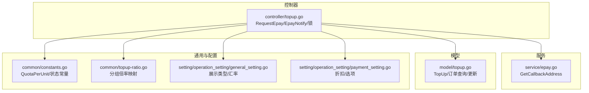
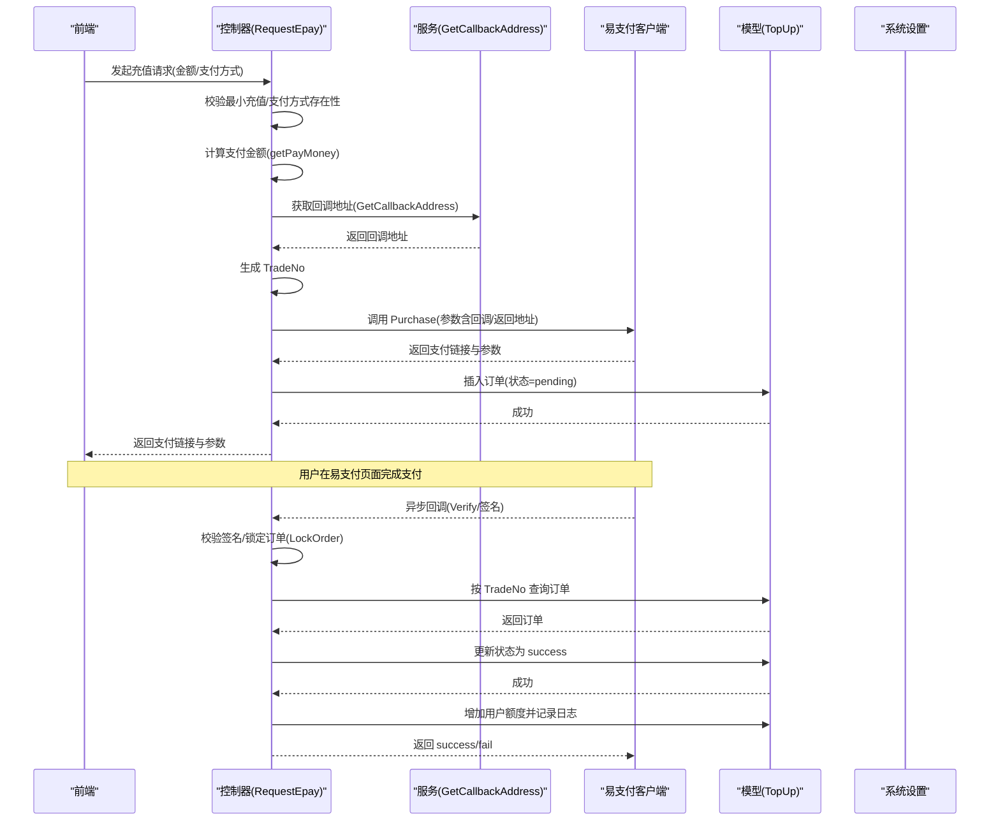
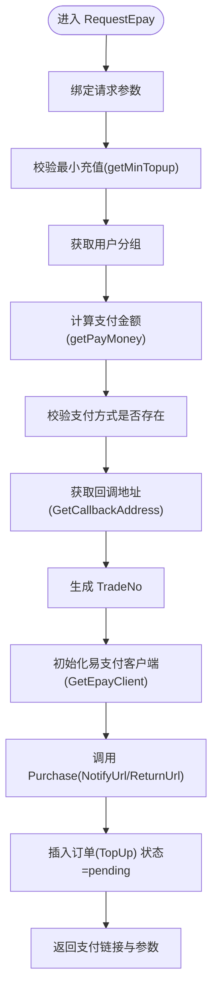
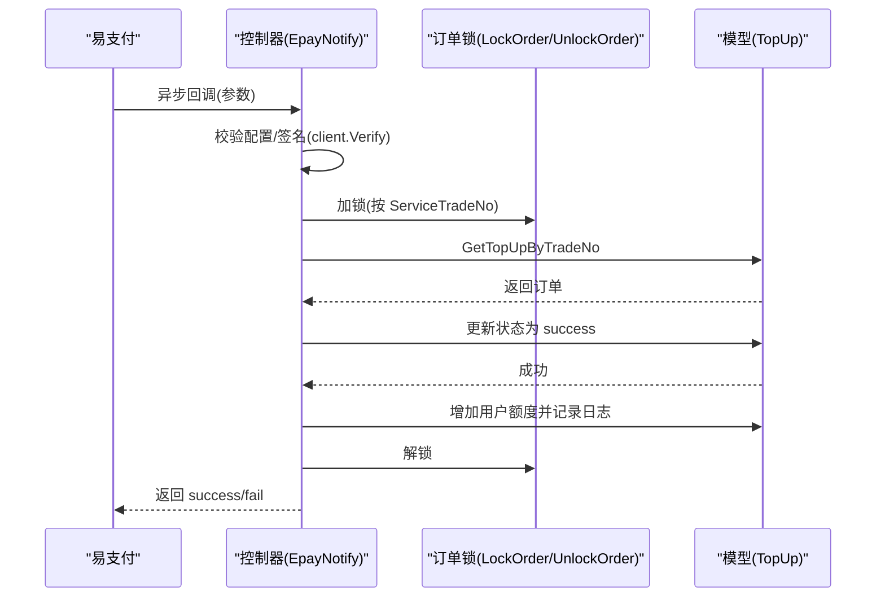
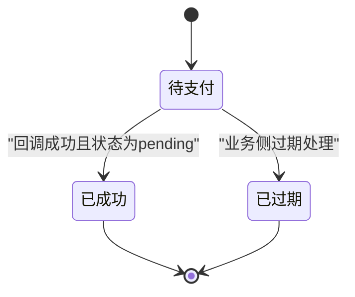
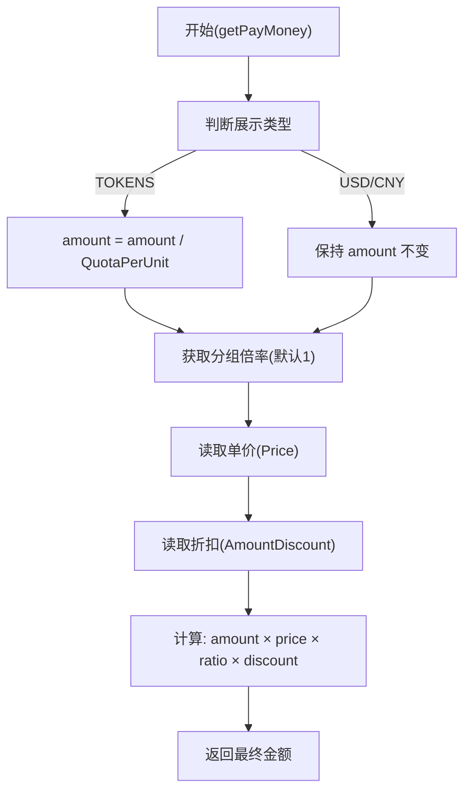
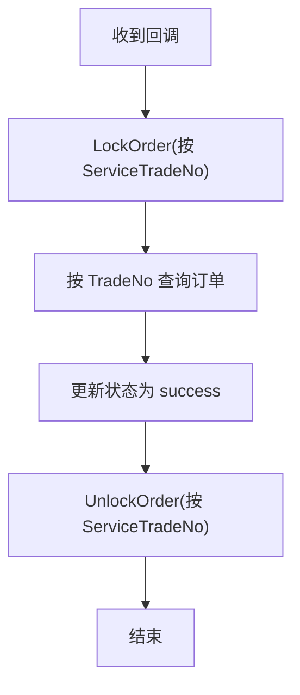
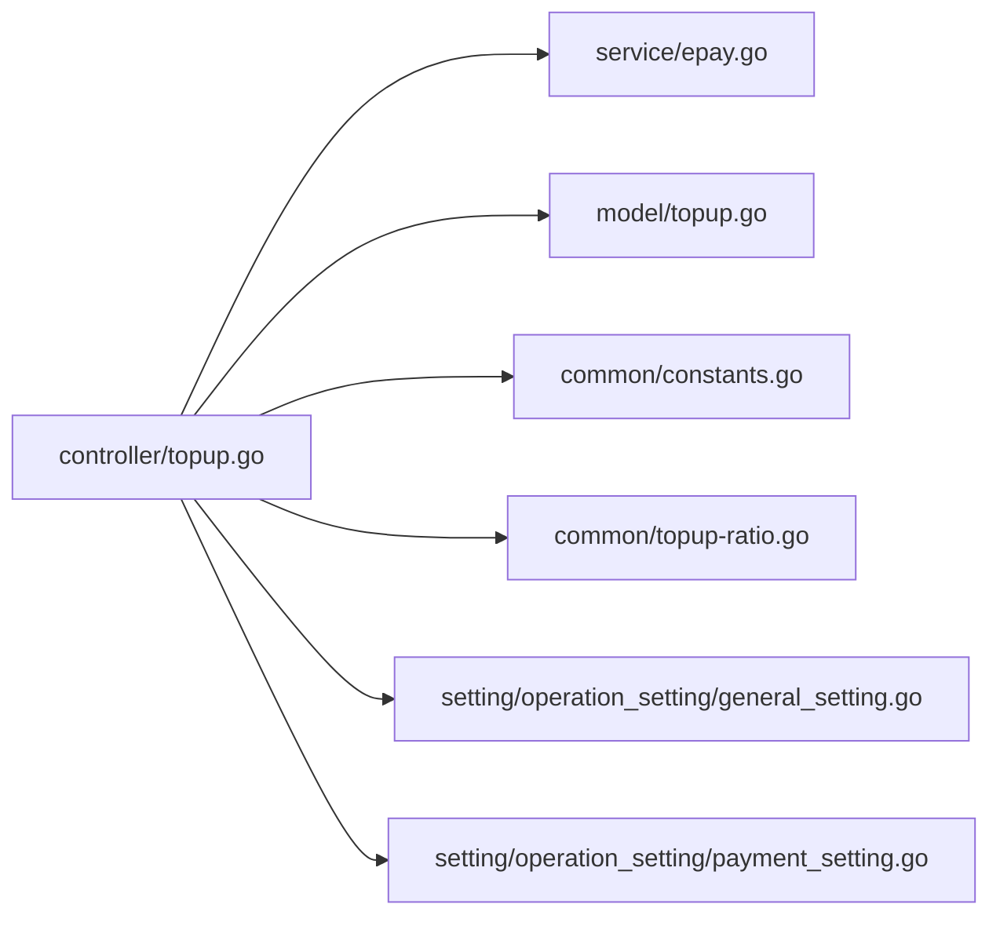

# 易支付集成

<cite>
**本文引用的文件**
- [controller/topup.go](file://controller/topup.go)
- [service/epay.go](file://service/epay.go)
- [model/topup.go](file://model/topup.go)
- [common/constants.go](file://common/constants.go)
- [common/topup-ratio.go](file://common/topup-ratio.go)
- [setting/operation_setting/general_setting.go](file://setting/operation_setting/general_setting.go)
- [setting/operation_setting/payment_setting.go](file://setting/operation_setting/payment_setting.go)
</cite>

## 目录
1. [简介](#简介)
2. [项目结构](#项目结构)
3. [核心组件](#核心组件)
4. [架构总览](#架构总览)
5. [详细组件分析](#详细组件分析)
6. [依赖关系分析](#依赖关系分析)
7. [性能考量](#性能考量)
8. [故障排查指南](#故障排查指南)
9. [结论](#结论)

## 简介
本文件围绕易支付集成进行深入技术文档化，重点覆盖以下内容：
- controller/topup.go 中 RequestEpay 和 EpayNotify 的实现逻辑
- 如何通过 GetEpayClient 初始化易支付客户端
- RequestEpay 中生成支付参数与订单记录的完整流程
- service/epay.go 中 GetCallbackAddress 如何根据系统设置返回正确的回调地址
- model/topup.go 中 TopUp 结构体字段含义，尤其是 TradeNo 的生成规则与 Status 状态机
- 支付金额计算逻辑 getPayMoney 的分组倍率与折扣机制
- 订单锁 LockOrder 如何防止并发安全问题
- 提供从请求到回调的完整序列图，涵盖前端发起、后端生成订单、跳转支付与异步通知处理全过程

## 项目结构
本次文档聚焦于与易支付集成直接相关的控制器、服务与模型层，以及与支付金额计算相关的通用常量与配置模块。

图表来源
- [controller/topup.go](file://controller/topup.go#L76-L203)
- [service/epay.go](file://service/epay.go#L8-L14)
- [model/topup.go](file://model/topup.go#L14-L36)
- [common/constants.go](file://common/constants.go#L20-L208)
- [common/topup-ratio.go](file://common/topup-ratio.go#L1-L33)
- [setting/operation_setting/general_setting.go](file://setting/operation_setting/general_setting.go#L1-L92)
- [setting/operation_setting/payment_setting.go](file://setting/operation_setting/payment_setting.go#L1-L23)

章节来源
- [controller/topup.go](file://controller/topup.go#L76-L203)
- [service/epay.go](file://service/epay.go#L8-L14)
- [model/topup.go](file://model/topup.go#L14-L36)
- [common/constants.go](file://common/constants.go#L20-L208)
- [common/topup-ratio.go](file://common/topup-ratio.go#L1-L33)
- [setting/operation_setting/general_setting.go](file://setting/operation_setting/general_setting.go#L1-L92)
- [setting/operation_setting/payment_setting.go](file://setting/operation_setting/payment_setting.go#L1-L23)

## 核心组件
- 易支付客户端初始化：GetEpayClient 基于运营配置构造 epay.Client，并校验配置完整性
- 请求支付流程：RequestEpay 接收前端请求，计算支付金额，生成 TradeNo，调用易支付发起支付，并持久化订单
- 回调处理流程：EpayNotify 校验签名，幂等更新订单状态，增加用户额度并记录日志
- 回调地址策略：GetCallbackAddress 根据是否自定义回调地址返回 server 地址或自定义地址
- 订单数据模型：TopUp 定义订单字段与基本 CRUD，提供按 TradeNo 查询与更新
- 金额计算：getPayMoney 综合展示类型、分组倍率、单价与折扣，输出最终支付金额
- 并发控制：LockOrder/UnlockOrder 通过内存锁表确保同一订单号的并发安全

章节来源
- [controller/topup.go](file://controller/topup.go#L76-L203)
- [controller/topup.go](file://controller/topup.go#L205-L231)
- [service/epay.go](file://service/epay.go#L8-L14)
- [model/topup.go](file://model/topup.go#L14-L36)
- [controller/topup.go](file://controller/topup.go#L90-L128)

## 架构总览
下图展示了从前端到易支付再到后端回调的整体流程，包括订单生成、支付发起与异步通知处理。

图表来源
- [controller/topup.go](file://controller/topup.go#L130-L203)
- [controller/topup.go](file://controller/topup.go#L232-L293)
- [service/epay.go](file://service/epay.go#L8-L14)
- [model/topup.go](file://model/topup.go#L48-L56)

## 详细组件分析

### 易支付客户端初始化：GetEpayClient
- 功能：基于运营配置构造 epay.Client，若配置缺失则返回空
- 关键点：
  - 读取 PayAddress、EpayId、EpayKey
  - 使用 NewClient 创建带 URL 的客户端实例
  - 返回 nil 时，上层需提示“未配置支付信息”

章节来源
- [controller/topup.go](file://controller/topup.go#L76-L88)

### 请求支付流程：RequestEpay
- 输入参数：EpayRequest（金额、支付方式、可选 top_up_code）
- 校验与准备：
  - 最小充值校验（getMinTopup）
  - 用户分组获取，用于分组倍率
  - 支付方式存在性校验（ContainsPayMethod）
- 金额计算：getPayMoney
- 回调地址：service.GetCallbackAddress
- TradeNo 生成：前缀 USR + 用户ID + 随机字符串 + 时间戳
- 发起支付：client.Purchase，设置 NotifyUrl/ReturnUrl
- 订单持久化：插入 TopUp，状态 pending
- 返回：支付链接与参数

图表来源
- [controller/topup.go](file://controller/topup.go#L130-L203)

章节来源
- [controller/topup.go](file://controller/topup.go#L130-L203)

### 回调处理流程：EpayNotify
- 参数提取：从 URL 查询参数构建 map
- 客户端校验：GetEpayClient
- 签名验证：client.Verify
- 幂等处理：
  - LockOrder(verifyInfo.ServiceTradeNo)
  - 按 TradeNo 查询订单
  - 若状态为 pending，更新为 success
- 额度发放：按 Amount 计算额度并增加用户配额
- 日志记录：记录充值日志
- 返回：success 或 fail

图表来源
- [controller/topup.go](file://controller/topup.go#L232-L293)
- [model/topup.go](file://model/topup.go#L48-L56)

章节来源
- [controller/topup.go](file://controller/topup.go#L232-L293)

### 回调地址策略：GetCallbackAddress
- 规则：若未设置 CustomCallbackAddress，则返回 system_setting.ServerAddress；否则返回自定义地址
- 作用：保证回调能正确回流到本系统

章节来源
- [service/epay.go](file://service/epay.go#L8-L14)

### 订单数据模型：TopUp 字段与状态机
- 字段说明：
  - Id：主键
  - UserId：用户ID
  - Amount：前端传入的充值数量（展示类型为 TOKENS 时会换算为美元）
  - Money：最终支付金额
  - TradeNo：唯一索引，用于幂等与回调识别
  - PaymentMethod：支付方式
  - CreateTime/CompleteTime：时间戳
  - Status：订单状态，支持 pending/success/expired
- TradeNo 生成规则：
  - 前缀 USR + 用户ID + 随机字符串 + 时间戳
- 状态机：
  - pending -> success（回调处理）
  - expired 用于其他场景（如过期），当前回调未处理该分支

图表来源
- [model/topup.go](file://model/topup.go#L14-L36)
- [controller/topup.go](file://controller/topup.go#L160-L164)

章节来源
- [model/topup.go](file://model/topup.go#L14-L36)
- [controller/topup.go](file://controller/topup.go#L160-L164)

### 支付金额计算：getPayMoney
- 输入：amount（前端传入）、group（用户分组）
- 步骤：
  - 展示类型判断：
    - 若为 TOKENS：将 amount 除以 QuotaPerUnit 得到美元等价
  - 分组倍率：从 common.GetTopupGroupRatio(group)，默认 1
  - 单价：operation_setting.Price
  - 折扣：operation_setting.GetPaymentSetting().AmountDiscount，按原始请求金额查找折扣系数
  - 计算：最终金额 = amount(美元等价) × 单价 × 分组倍率 × 折扣
- 输出：浮点型最终支付金额

图表来源
- [controller/topup.go](file://controller/topup.go#L90-L118)
- [common/constants.go](file://common/constants.go#L20-L208)
- [common/topup-ratio.go](file://common/topup-ratio.go#L1-L33)
- [setting/operation_setting/payment_setting.go](file://setting/operation_setting/payment_setting.go#L1-L23)
- [setting/operation_setting/general_setting.go](file://setting/operation_setting/general_setting.go#L1-L92)

章节来源
- [controller/topup.go](file://controller/topup.go#L90-L118)
- [common/constants.go](file://common/constants.go#L20-L208)
- [common/topup-ratio.go](file://common/topup-ratio.go#L1-L33)
- [setting/operation_setting/payment_setting.go](file://setting/operation_setting/payment_setting.go#L1-L23)
- [setting/operation_setting/general_setting.go](file://setting/operation_setting/general_setting.go#L1-L92)

### 并发安全：订单锁 LockOrder/UnlockOrder
- 设计：使用 sync.Map 存储每个 TradeNo 对应的互斥锁，首次访问时惰性创建
- 用途：在 EpayNotify 回调中，按 ServiceTradeNo 加锁，确保同一订单号的并发处理串行化
- 释放：defer UnlockOrder

图表来源
- [controller/topup.go](file://controller/topup.go#L205-L231)

章节来源
- [controller/topup.go](file://controller/topup.go#L205-L231)

## 依赖关系分析
- 控制器依赖：
  - service.GetCallbackAddress：决定回调地址
  - model.TopUp：订单持久化与查询
  - common 常量与比率：QuotaPerUnit、分组倍率
  - operation_setting：展示类型、单价、折扣、支付方式集合
- 回调处理依赖：
  - LockOrder/UnlockOrder：并发控制
  - model.GetTopUpByTradeNo：幂等查询
  - model.IncreaseUserQuota：额度增加
  - model.RecordLog：日志记录

图表来源
- [controller/topup.go](file://controller/topup.go#L76-L203)
- [service/epay.go](file://service/epay.go#L8-L14)
- [model/topup.go](file://model/topup.go#L14-L36)
- [common/constants.go](file://common/constants.go#L20-L208)
- [common/topup-ratio.go](file://common/topup-ratio.go#L1-L33)
- [setting/operation_setting/general_setting.go](file://setting/operation_setting/general_setting.go#L1-L92)
- [setting/operation_setting/payment_setting.go](file://setting/operation_setting/payment_setting.go#L1-L23)

章节来源
- [controller/topup.go](file://controller/topup.go#L76-L203)
- [service/epay.go](file://service/epay.go#L8-L14)
- [model/topup.go](file://model/topup.go#L14-L36)
- [common/constants.go](file://common/constants.go#L20-L208)
- [common/topup-ratio.go](file://common/topup-ratio.go#L1-L33)
- [setting/operation_setting/general_setting.go](file://setting/operation_setting/general_setting.go#L1-L92)
- [setting/operation_setting/payment_setting.go](file://setting/operation_setting/payment_setting.go#L1-L23)

## 性能考量
- 订单锁粒度：按 TradeNo 锁，避免全局锁导致的热点竞争
- 数据库操作：
  - RequestEpay 插入订单后即返回，减少回调前阻塞
  - EpayNotify 使用行级锁与幂等更新，降低重复入账风险
- 数值精度：使用 decimal 进行金额计算，避免浮点误差累积
- 回调签名：先 Verify 再处理业务，减少无效处理开销

## 故障排查指南
- “未配置支付信息”
  - 现象：GetEpayClient 返回 nil，RequestEpay 提示未配置
  - 排查：确认 PayAddress、EpayId、EpayKey 是否填写
  - 参考路径：[controller/topup.go](file://controller/topup.go#L76-L88)
- “拉起支付失败”
  - 现象：Purchase 调用报错
  - 排查：检查支付方式是否存在、回调地址是否可达、网络连通性
  - 参考路径：[controller/topup.go](file://controller/topup.go#L169-L178)
- “回调签名验证失败”
  - 现象：EpayNotify 写入 fail
  - 排查：核对 PartnerID/Key 与易支付后台一致、回调地址与前端一致
  - 参考路径：[controller/topup.go](file://controller/topup.go#L232-L259)
- “未找到订单”
  - 现象：按 TradeNo 查询不到订单
  - 排查：确认 TradeNo 生成规则与回调参数一致、订单是否被提前删除
  - 参考路径：[controller/topup.go](file://controller/topup.go#L265-L269), [model/topup.go](file://model/topup.go#L48-L56)
- “并发重复入账”
  - 现象：同一订单多次回调导致重复加额度
  - 排查：确认 LockOrder/UnlockOrder 是否正确使用、回调幂等判断
  - 参考路径：[controller/topup.go](file://controller/topup.go#L263-L269), [controller/topup.go](file://controller/topup.go#L270-L289)

章节来源
- [controller/topup.go](file://controller/topup.go#L76-L88)
- [controller/topup.go](file://controller/topup.go#L169-L178)
- [controller/topup.go](file://controller/topup.go#L232-L259)
- [controller/topup.go](file://controller/topup.go#L265-L269)
- [model/topup.go](file://model/topup.go#L48-L56)
- [controller/topup.go](file://controller/topup.go#L263-L269)
- [controller/topup.go](file://controller/topup.go#L270-L289)

## 结论
本集成方案通过清晰的职责划分与严谨的并发控制，实现了从订单生成、支付发起到回调处理的完整闭环。关键要点如下：
- 易支付客户端初始化与配置校验必须前置
- 支付金额计算融合展示类型、分组倍率与折扣，具备灵活性
- 回调处理采用签名验证+订单锁+幂等更新，确保一致性与安全性
- TradeNo 生成规则明确，便于追踪与对账