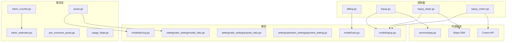
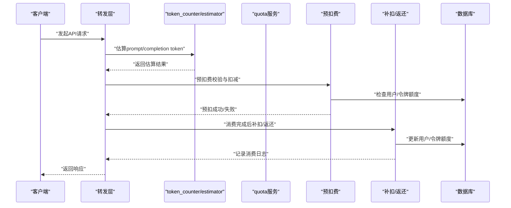
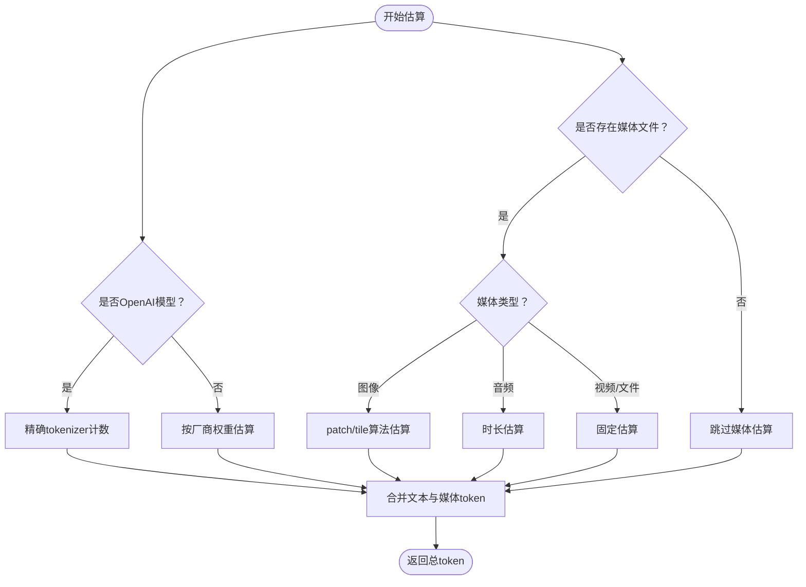
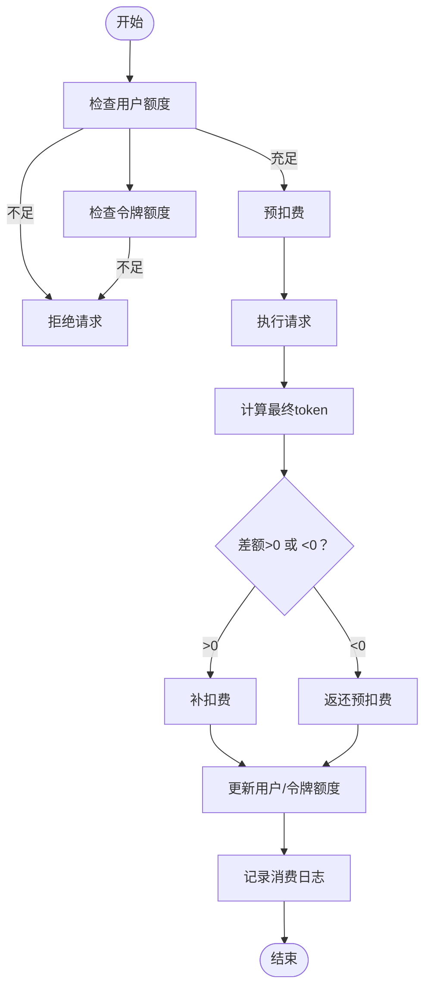
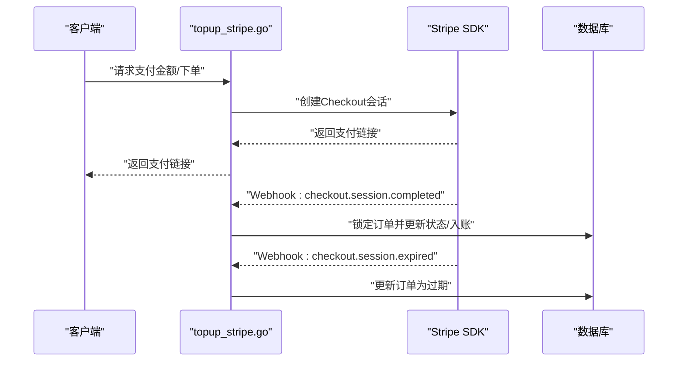
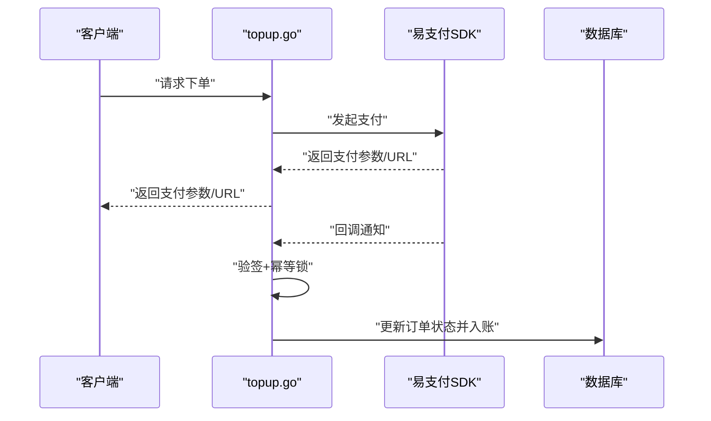
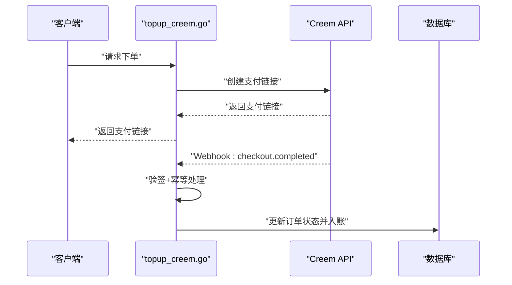
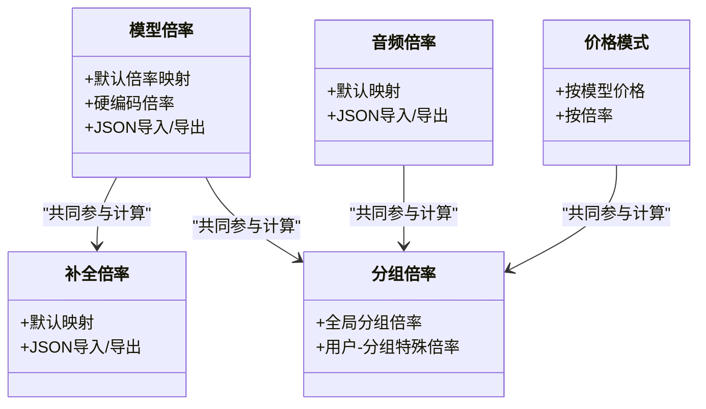
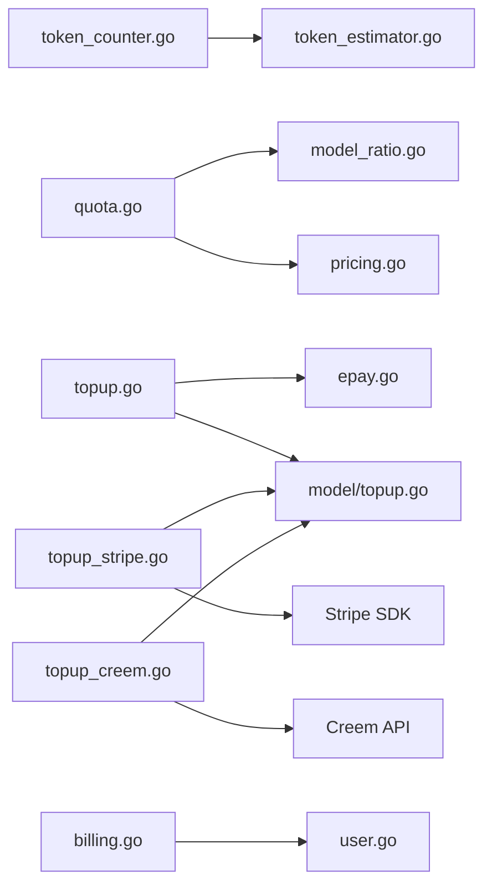

# 计费系统

<cite>
**本文引用的文件**
- [token_counter.go](file://service/token_counter.go)
- [token_estimator.go](file://service/token_estimator.go)
- [quota.go](file://service/quota.go)
- [pre_consume_quota.go](file://service/pre_consume_quota.go)
- [usage_helpr.go](file://service/usage_helpr.go)
- [billing.go](file://controller/billing.go)
- [topup.go](file://controller/topup.go)
- [topup_stripe.go](file://controller/topup_stripe.go)
- [topup_creem.go](file://controller/topup_creem.go)
- [epay.go](file://service/epay.go)
- [pricing.go](file://model/pricing.go)
- [model_ratio.go](file://setting/ratio_setting/model_ratio.go)
- [expose_ratio.go](file://setting/ratio_setting/expose_ratio.go)
- [payment_setting.go](file://setting/operation_setting/payment_setting.go)
- [topup.go](file://model/topup.go)
- [user.go](file://model/user.go)
</cite>

## 目录
1. [简介](#简介)
2. [项目结构](#项目结构)
3. [核心组件](#核心组件)
4. [架构总览](#架构总览)
5. [详细组件分析](#详细组件分析)
6. [依赖关系分析](#依赖关系分析)
7. [性能考量](#性能考量)
8. [故障排查指南](#故障排查指南)
9. [结论](#结论)
10. [附录](#附录)

## 简介
本文件面向计费系统的设计与实现，围绕以下目标展开：
- 配额管理：用户与令牌维度的额度控制、预扣费与补扣费、额度预警与通知
- 使用量统计：文本、音频、图像、视频等多模态输入输出的token估算与用量计算
- 支付集成：Stripe、易支付（epay）、Creem三种支付通道的接入与回调处理
- 定价模型：按模型、按渠道、按分组的差异化定价策略与倍率配置
- 业务逻辑：余额充值、消费记录查询、账单生成、配额预警、超额限制、信用额度管理

## 项目结构
计费系统主要分布在以下模块：
- 服务层（service）：token计数与估算、配额计算与扣减、用量辅助工具
- 控制器（controller）：计费订阅与用量查询、充值入口与回调处理
- 模型（model）：用户、充值订单、定价配置等持久化
- 设置（setting）：比率与定价配置、支付配置、暴露开关
- 前端（web）：充值界面、用量与账单查询等UI交互

图表来源
- [token_counter.go](file://service/token_counter.go#L1-L453)
- [token_estimator.go](file://service/token_estimator.go#L1-L231)
- [quota.go](file://service/quota.go#L1-L582)
- [pre_consume_quota.go](file://service/pre_consume_quota.go#L1-L80)
- [usage_helpr.go](file://service/usage_helpr.go#L1-L34)
- [billing.go](file://controller/billing.go#L1-L109)
- [topup.go](file://controller/topup.go#L1-L393)
- [topup_stripe.go](file://controller/topup_stripe.go#L1-L289)
- [topup_creem.go](file://controller/topup_creem.go#L1-L462)
- [epay.go](file://service/epay.go#L1-L14)
- [pricing.go](file://model/pricing.go#L1-L314)
- [model_ratio.go](file://setting/ratio_setting/model_ratio.go#L1-L800)
- [expose_ratio.go](file://setting/ratio_setting/expose_ratio.go#L1-L18)
- [payment_setting.go](file://setting/operation_setting/payment_setting.go#L1-L24)
- [topup.go](file://model/topup.go#L1-L377)
- [user.go](file://model/user.go#L670-L800)

章节来源
- [token_counter.go](file://service/token_counter.go#L1-L453)
- [token_estimator.go](file://service/token_estimator.go#L1-L231)
- [quota.go](file://service/quota.go#L1-L582)
- [pre_consume_quota.go](file://service/pre_consume_quota.go#L1-L80)
- [usage_helpr.go](file://service/usage_helpr.go#L1-L34)
- [billing.go](file://controller/billing.go#L1-L109)
- [topup.go](file://controller/topup.go#L1-L393)
- [topup_stripe.go](file://controller/topup_stripe.go#L1-L289)
- [topup_creem.go](file://controller/topup_creem.go#L1-L462)
- [epay.go](file://service/epay.go#L1-L14)
- [pricing.go](file://model/pricing.go#L1-L314)
- [model_ratio.go](file://setting/ratio_setting/model_ratio.go#L1-L800)
- [expose_ratio.go](file://setting/ratio_setting/expose_ratio.go#L1-L18)
- [payment_setting.go](file://setting/operation_setting/payment_setting.go#L1-L24)
- [topup.go](file://model/topup.go#L1-L377)
- [user.go](file://model/user.go#L670-L800)

## 核心组件
- token计数与估算
  - 文本token估算：OpenAI模型使用精确tokenizer，其他模型采用按厂商权重估算
  - 媒体token：图像（patch/tile两种算法）、音频（时长估算）、视频（固定估算）
  - 实时会话token：针对OpenAI实时接口的输入/输出音频与文本分别计数
- 配额计算与扣减
  - 按模型倍率、补全倍率、音频倍率、音频补全倍率、分组倍率综合计算
  - 支持预扣费、补扣费与返还，结合用户与令牌额度进行校验
  - 额度预警：阈值触发邮件/Bark/Gotify等通知
- 支付集成
  - Stripe：Checkout会话、Webhook验签、订单完成/过期处理
  - 易支付（epay）：下单、回调验签、幂等锁、补单
  - Creem：签名验证、订单创建与支付完成回调
- 定价与比率
  - 模型倍率、补全倍率、音频/音频补全倍率、图片倍率
  - 分组倍率、用户分组特殊倍率、价格模式（按模型价格 vs 倍率）
  - 支付折扣配置、最小充值金额、展示类型转换

章节来源
- [token_counter.go](file://service/token_counter.go#L1-L453)
- [token_estimator.go](file://service/token_estimator.go#L1-L231)
- [quota.go](file://service/quota.go#L1-L582)
- [pre_consume_quota.go](file://service/pre_consume_quota.go#L1-L80)
- [usage_helpr.go](file://service/usage_helpr.go#L1-L34)
- [model_ratio.go](file://setting/ratio_setting/model_ratio.go#L1-L800)
- [pricing.go](file://model/pricing.go#L1-L314)

## 架构总览
计费系统通过“估算-预扣-消费-补扣/返还-记录”的闭环实现成本控制与账单生成。

图表来源
- [token_counter.go](file://service/token_counter.go#L202-L342)
- [token_estimator.go](file://service/token_estimator.go#L216-L231)
- [quota.go](file://service/quota.go#L480-L533)
- [pre_consume_quota.go](file://service/pre_consume_quota.go#L31-L80)
- [usage_helpr.go](file://service/usage_helpr.go#L22-L34)

## 详细组件分析

### 组件A：token计数与估算
- 文本token
  - OpenAI模型：使用精确tokenizer计数
  - 其他模型：按厂商权重估算，提升性能
- 媒体token
  - 图像：patch-based（上限1536，带倍率）与tile-based两类算法；支持detail/auto/low等策略
  - 音频：基于时长估算，区分输入/输出
  - 视频/文件：固定token估算
- 实时会话token
  - OpenAI实时：分别统计输入/输出音频与文本token

图表来源
- [token_counter.go](file://service/token_counter.go#L202-L342)
- [token_estimator.go](file://service/token_estimator.go#L216-L231)

章节来源
- [token_counter.go](file://service/token_counter.go#L1-L453)
- [token_estimator.go](file://service/token_estimator.go#L1-L231)

### 组件B：配额计算与扣减
- 计算公式
  - 文本：prompt + completion×补全倍率
  - 音频：input×音频倍率 + output×音频倍率×音频补全倍率
  - 图片：按图片倍率（由模型默认提供）
  - 最终：上述合计×分组倍率×模型倍率；若倍率非零但结果<=0，按1计
- 预扣费与补扣费
  - 预扣：在请求开始前检查用户/令牌额度，必要时预扣
  - 补扣/返还：根据最终token与预扣差额进行增减
- 额度预警
  - 基于阈值触发邮件/Bark/Gotify通知，支持用户自定义阈值

图表来源
- [quota.go](file://service/quota.go#L480-L533)
- [quota.go](file://service/quota.go#L535-L582)
- [pre_consume_quota.go](file://service/pre_consume_quota.go#L31-L80)

章节来源
- [quota.go](file://service/quota.go#L1-L582)
- [pre_consume_quota.go](file://service/pre_consume_quota.go#L1-L80)

### 组件C：Stripe支付集成
- 下单与金额计算
  - 金额按“展示类型”转换（tokens需换算为美元）
  - 应用分组倍率与可选折扣
- Checkout会话
  - 生成支付链接，支持促销码
- Webhook处理
  - 验签通过后处理完成/过期事件
  - 完成：锁定订单、更新状态、按money×汇率换算额度入账
  - 过期：将状态置为过期

图表来源
- [topup_stripe.go](file://controller/topup_stripe.go#L108-L289)
- [topup.go](file://model/topup.go#L58-L104)

章节来源
- [topup_stripe.go](file://controller/topup_stripe.go#L1-L289)
- [topup.go](file://model/topup.go#L1-L377)

### 组件D：易支付（epay）集成
- 下单
  - 金额按“展示类型”转换，应用分组倍率与折扣
  - 生成订单，返回支付参数与URL
- 回调处理
  - 验签通过后幂等锁保护，更新订单状态并按Amount×汇率换算额度入账
  - 支持管理员补单接口，保证一致性

图表来源
- [topup.go](file://controller/topup.go#L130-L293)
- [epay.go](file://service/epay.go#L1-L14)
- [topup.go](file://model/topup.go#L237-L307)

章节来源
- [topup.go](file://controller/topup.go#L1-L393)
- [epay.go](file://service/epay.go#L1-L14)
- [topup.go](file://model/topup.go#L1-L377)

### 组件E：Creem支付集成
- 下单
  - 从配置的产品列表中选择产品，创建订单并生成支付链接
- 回调处理
  - 验签通过后，按订单状态完成入账，支持客户邮箱/姓名的补充更新
  - 支持测试模式跳过签名验证

图表来源
- [topup_creem.go](file://controller/topup_creem.go#L144-L362)
- [topup.go](file://model/topup.go#L308-L377)

章节来源
- [topup_creem.go](file://controller/topup_creem.go#L1-L462)
- [topup.go](file://model/topup.go#L1-L377)

### 组件F：定价模型与比率配置
- 模型倍率与补全倍率
  - 默认倍率来自比率设置模块，部分模型内置硬编码倍率
- 音频/音频补全倍率
  - 针对音频模型提供独立倍率
- 分组倍率与用户分组特殊倍率
  - 支持按用户分组与用户-分组组合的倍率
- 价格模式
  - 按模型价格（直接按价格×汇率×分组倍率）或按倍率（prompt/completion×倍率×分组倍率）
- 暴露开关
  - 比例暴露开关用于控制是否对外暴露比率配置

图表来源
- [model_ratio.go](file://setting/ratio_setting/model_ratio.go#L1-L800)
- [expose_ratio.go](file://setting/ratio_setting/expose_ratio.go#L1-L18)
- [pricing.go](file://model/pricing.go#L1-L314)

章节来源
- [model_ratio.go](file://setting/ratio_setting/model_ratio.go#L1-L800)
- [expose_ratio.go](file://setting/ratio_setting/expose_ratio.go#L1-L18)
- [pricing.go](file://model/pricing.go#L1-L314)

### 组件G：余额充值、消费记录与账单
- 余额充值
  - 支持Stripe、易支付、Creem三种渠道
  - 展示类型转换、分组倍率、折扣、最小充值金额
- 消费记录查询
  - 用户维度与全平台维度的充值记录分页查询
  - 支持关键词搜索
- 账单生成
  - 消费日志记录包含prompt/completion token、模型、分组、耗时、附加信息等

章节来源
- [topup.go](file://controller/topup.go#L295-L393)
- [topup_stripe.go](file://controller/topup_stripe.go#L108-L289)
- [topup_creem.go](file://controller/topup_creem.go#L144-L362)
- [topup.go](file://model/topup.go#L106-L201)
- [quota.go](file://service/quota.go#L238-L353)

## 依赖关系分析
- token计数依赖
  - 媒体文件解码、音频时长解析、OpenAI tokenizer封装
- 配额计算依赖
  - 比率设置（模型/补全/音频/图片）、定价模型（价格模式）
- 支付集成依赖
  - Stripe SDK、易支付SDK、Creem API
- 数据持久化依赖
  - 用户额度、充值订单、消费日志

图表来源
- [token_counter.go](file://service/token_counter.go#L1-L453)
- [token_estimator.go](file://service/token_estimator.go#L1-L231)
- [quota.go](file://service/quota.go#L1-L582)
- [model_ratio.go](file://setting/ratio_setting/model_ratio.go#L1-L800)
- [pricing.go](file://model/pricing.go#L1-L314)
- [topup.go](file://controller/topup.go#L1-L393)
- [epay.go](file://service/epay.go#L1-L14)
- [topup_stripe.go](file://controller/topup_stripe.go#L1-L289)
- [topup_creem.go](file://controller/topup_creem.go#L1-L462)
- [billing.go](file://controller/billing.go#L1-L109)
- [user.go](file://model/user.go#L670-L800)
- [topup.go](file://model/topup.go#L1-L377)

章节来源
- [token_counter.go](file://service/token_counter.go#L1-L453)
- [token_estimator.go](file://service/token_estimator.go#L1-L231)
- [quota.go](file://service/quota.go#L1-L582)
- [model_ratio.go](file://setting/ratio_setting/model_ratio.go#L1-L800)
- [pricing.go](file://model/pricing.go#L1-L314)
- [topup.go](file://controller/topup.go#L1-L393)
- [epay.go](file://service/epay.go#L1-L14)
- [topup_stripe.go](file://controller/topup_stripe.go#L1-L289)
- [topup_creem.go](file://controller/topup_creem.go#L1-L462)
- [billing.go](file://controller/billing.go#L1-L109)
- [user.go](file://model/user.go#L670-L800)
- [topup.go](file://model/topup.go#L1-L377)

## 性能考量
- token估算
  - 非OpenAI模型采用权重估算，避免昂贵的tokenizer调用
  - 媒体token计算在必要时才进行网络下载与解码
- 预扣费与补扣费
  - 预扣费减少最终一致性风险；补扣费/返还避免过度占用额度
- 并发与幂等
  - 订单回调使用互斥锁与数据库行级锁，保证幂等与一致性
- 缓存与批量更新
  - 用户额度变更支持异步缓存与批量更新，降低数据库压力

## 故障排查指南
- Stripe Webhook验签失败
  - 检查Webhook密钥配置与版本兼容选项
  - 确认事件类型与状态一致性
- 易支付回调验签失败
  - 检查回调地址与签名参数
  - 确认订单状态与幂等锁逻辑
- Creem回调签名验证失败
  - 检查签名头与密钥配置
  - 测试模式下可跳过验签
- 额度不足
  - 检查用户与令牌额度、预扣费阈值与信任额度策略
  - 关注额度预警通知是否触发
- 订单补单
  - 使用管理员补单接口，注意幂等与状态校验

章节来源
- [topup_stripe.go](file://controller/topup_stripe.go#L128-L212)
- [topup.go](file://controller/topup.go#L232-L293)
- [topup_creem.go](file://controller/topup_creem.go#L240-L310)
- [pre_consume_quota.go](file://service/pre_consume_quota.go#L31-L80)

## 结论
本计费系统通过“估算-预扣-消费-补扣/返还-记录”的闭环，结合多渠道支付与差异化定价策略，实现了对API调用成本的精确计量与可控管理。token计数与估算模块兼顾精度与性能；配额计算模块灵活支持模型、分组与价格模式；支付集成模块覆盖主流渠道并具备完善的回调与幂等保障；定价配置模块提供丰富的倍率与价格模式，满足复杂业务场景。

## 附录
- 配额显示类型
  - 支持USD/CNY/TOKENS三种展示类型，按配置进行汇率与单位换算
- 支付折扣
  - 支持按充值金额设置折扣，提升用户充值意愿
- 最小充值金额
  - 不同渠道最小充值金额配置，展示类型转换后统一校验

章节来源
- [billing.go](file://controller/billing.go#L48-L68)
- [payment_setting.go](file://setting/operation_setting/payment_setting.go#L1-L24)
- [topup.go](file://controller/topup.go#L120-L129)
- [topup_stripe.go](file://controller/topup_stripe.go#L282-L289)