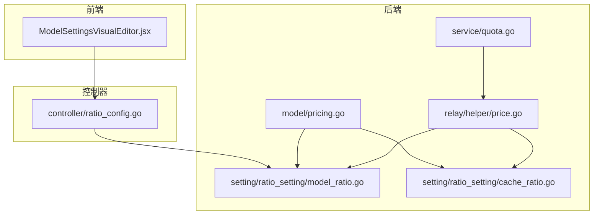
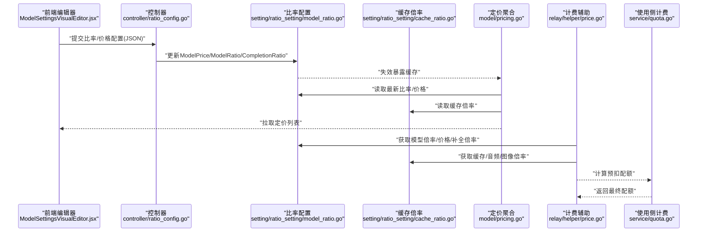
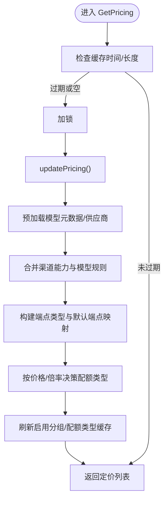
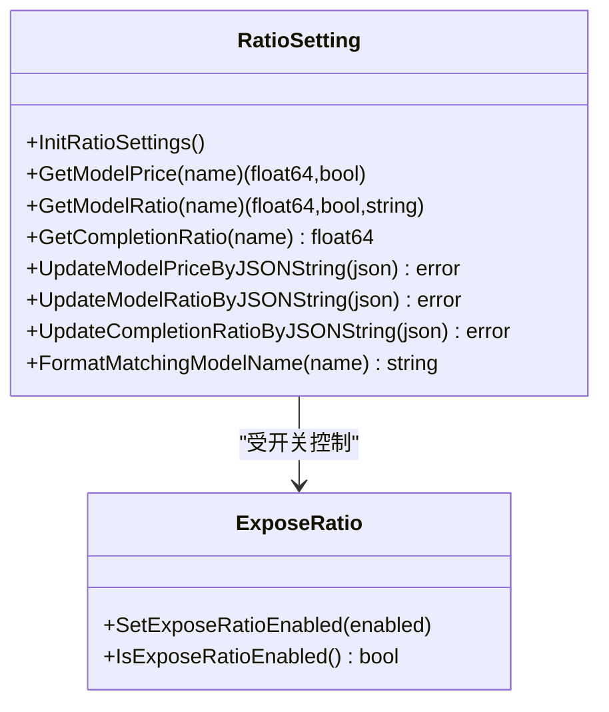
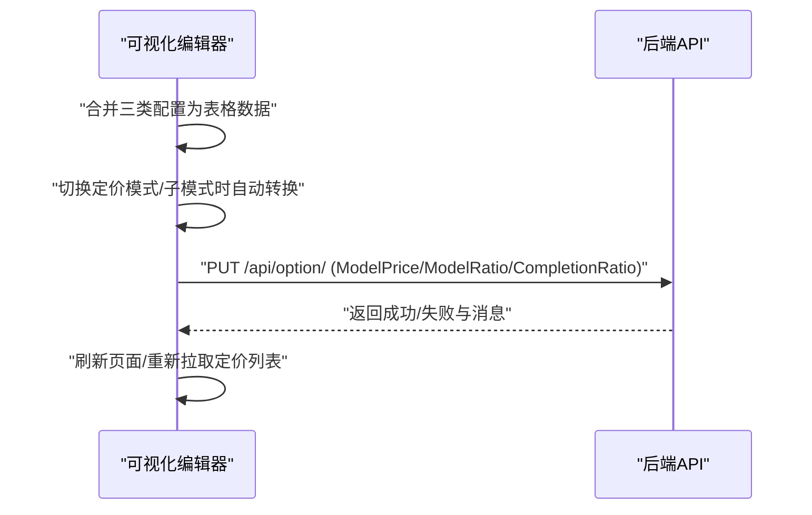
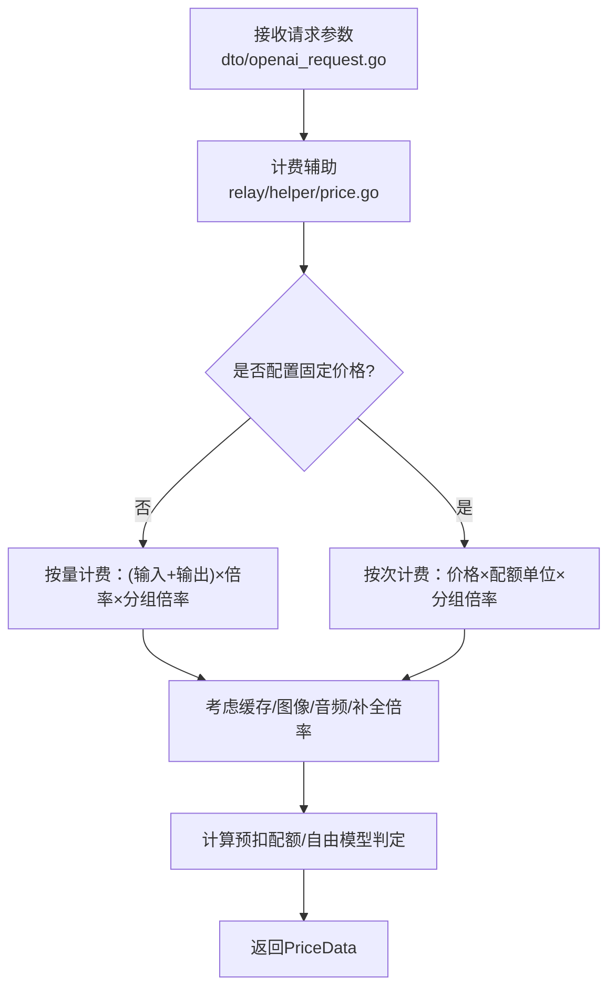
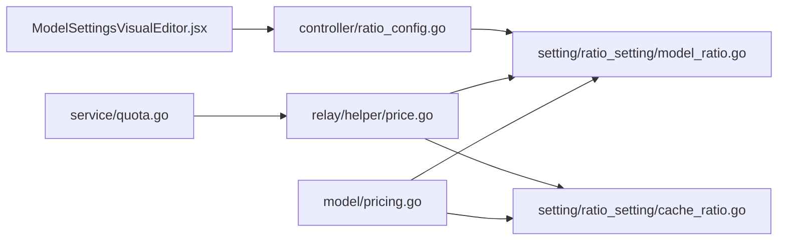

# 计费权重与定价模型

<cite>
**本文引用的文件**
- [model/pricing.go](file://model/pricing.go)
- [setting/ratio_setting/model_ratio.go](file://setting/ratio_setting/model_ratio.go)
- [dto/openai_request.go](file://dto/openai_request.go)
- [web/src/pages/Setting/Ratio/ModelSettingsVisualEditor.jsx](file://web/src/pages/Setting/Ratio/ModelSettingsVisualEditor.jsx)
- [relay/helper/price.go](file://relay/helper/price.go)
- [setting/ratio_setting/cache_ratio.go](file://setting/ratio_setting/cache_ratio.go)
- [setting/ratio_setting/expose_ratio.go](file://setting/ratio_setting/expose_ratio.go)
- [controller/ratio_config.go](file://controller/ratio_config.go)
- [service/quota.go](file://service/quota.go)
</cite>

## 目录
1. [简介](#简介)
2. [项目结构](#项目结构)
3. [核心组件](#核心组件)
4. [架构总览](#架构总览)
5. [详细组件分析](#详细组件分析)
6. [依赖关系分析](#依赖关系分析)
7. [性能考量](#性能考量)
8. [故障排查指南](#故障排查指南)
9. [结论](#结论)
10. [附录](#附录)

## 简介
本文件围绕“计费权重与定价模型”展开，系统性解析以下要点：
- 多维度定价策略：如何依据模型、API类型与使用场景设置差异化计费权重。
- 模型比率配置的加载与缓存：在后端如何初始化、更新与暴露倍率配置。
- 前端可视化配置界面：如何通过可视化编辑器实现倍率与价格的配置与同步。
- 请求参数驱动的计费模型选择：如何从请求参数中动态选择计费模型。
- 实际配置示例：不同渠道的权重设置方法。
- 常见问题：权重继承冲突、浮点数精度损失、动态更新时的缓存一致性。

## 项目结构
本项目采用分层架构，计费相关逻辑主要分布在以下模块：
- 后端定价与比率：model/pricing.go、setting/ratio_setting/model_ratio.go、setting/ratio_setting/cache_ratio.go、relay/helper/price.go
- 前端可视化配置：web/src/pages/Setting/Ratio/ModelSettingsVisualEditor.jsx
- 控制器与接口：controller/ratio_config.go
- 使用侧计费计算：service/quota.go

图表来源
- [model/pricing.go](file://model/pricing.go#L1-L120)
- [setting/ratio_setting/model_ratio.go](file://setting/ratio_setting/model_ratio.go#L1-L120)
- [setting/ratio_setting/cache_ratio.go](file://setting/ratio_setting/cache_ratio.go#L1-L60)
- [relay/helper/price.go](file://relay/helper/price.go#L1-L120)
- [controller/ratio_config.go](file://controller/ratio_config.go#L1-L26)
- [service/quota.go](file://service/quota.go#L56-L87)

章节来源
- [model/pricing.go](file://model/pricing.go#L1-L120)
- [setting/ratio_setting/model_ratio.go](file://setting/ratio_setting/model_ratio.go#L1-L120)
- [relay/helper/price.go](file://relay/helper/price.go#L1-L120)

## 核心组件
- 定价模型与供应商：model/pricing.go 提供模型定价聚合、端点支持与供应商信息。
- 比率配置与缓存：setting/ratio_setting/model_ratio.go 提供默认倍率、价格、补全倍率、图像/音频/缓存倍率的初始化、更新与读取。
- 缓存倍率：setting/ratio_setting/cache_ratio.go 提供缓存创建与命中倍率的管理。
- 计费辅助：relay/helper/price.go 根据请求上下文与配置计算预扣额度与最终计费数据。
- 前端可视化编辑器：web/src/pages/Setting/Ratio/ModelSettingsVisualEditor.jsx 提供按量/按次计费、倍率与价格的可视化配置。
- 控制器接口：controller/ratio_config.go 对外暴露比率配置接口（受开关控制）。
- 使用侧计费：service/quota.go 基于令牌统计与比率计算最终配额。

章节来源
- [model/pricing.go](file://model/pricing.go#L1-L120)
- [setting/ratio_setting/model_ratio.go](file://setting/ratio_setting/model_ratio.go#L1-L120)
- [setting/ratio_setting/cache_ratio.go](file://setting/ratio_setting/cache_ratio.go#L1-L60)
- [relay/helper/price.go](file://relay/helper/price.go#L1-L120)
- [web/src/pages/Setting/Ratio/ModelSettingsVisualEditor.jsx](file://web/src/pages/Setting/Ratio/ModelSettingsVisualEditor.jsx#L1-L120)
- [controller/ratio_config.go](file://controller/ratio_config.go#L1-L26)
- [service/quota.go](file://service/quota.go#L56-L87)

## 架构总览
下图展示了从前端可视化编辑器到后端比率配置与计费计算的整体流程。

图表来源
- [web/src/pages/Setting/Ratio/ModelSettingsVisualEditor.jsx](file://web/src/pages/Setting/Ratio/ModelSettingsVisualEditor.jsx#L100-L177)
- [controller/ratio_config.go](file://controller/ratio_config.go#L1-L26)
- [setting/ratio_setting/model_ratio.go](file://setting/ratio_setting/model_ratio.go#L338-L430)
- [setting/ratio_setting/cache_ratio.go](file://setting/ratio_setting/cache_ratio.go#L97-L147)
- [model/pricing.go](file://model/pricing.go#L265-L308)
- [relay/helper/price.go](file://relay/helper/price.go#L48-L140)
- [service/quota.go](file://service/quota.go#L56-L87)

## 详细组件分析

### 组件A：多维度定价策略（model/pricing.go）
- 功能概述
  - 聚合可用模型的能力与元数据，生成面向前端的定价视图。
  - 根据渠道能力与模型元数据推导支持的端点类型与默认端点映射。
  - 依据比率配置模块决定使用“按量计费”（倍率）还是“按次计费”（固定价格），并缓存模型启用分组与配额类型。
- 关键点
  - 支持端点类型：从渠道能力与模型自定义端点合并，构建全局端点映射。
  - 模型启用分组与配额类型：按模型聚合启用分组，按是否配置固定价格决定配额类型。
  - 缓存映射：模型名到启用分组、配额类型的快速查询映射，提升并发查询性能。
- 并发与缓存
  - 定价列表与端点映射采用互斥锁保护，定时刷新（超过1分钟或空值时触发）。
  - 模型启用分组与配额类型缓存独立维护，刷新时重建。

图表来源
- [model/pricing.go](file://model/pricing.go#L57-L120)
- [model/pricing.go](file://model/pricing.go#L265-L308)

章节来源
- [model/pricing.go](file://model/pricing.go#L57-L120)
- [model/pricing.go](file://model/pricing.go#L265-L308)

### 组件B：比率配置加载与缓存（setting/ratio_setting/model_ratio.go）
- 默认倍率与价格
  - 提供大量模型的默认倍率、价格、补全倍率、图像/音频/缓存倍率字典。
- 初始化与更新
  - InitRatioSettings：将默认字典复制到运行时映射，初始化各倍率映射。
  - UpdateModelPriceByJSONString/UpdateModelRatioByJSONString/UpdateCompletionRatioByJSONString：从JSON更新映射，并在成功时使暴露缓存失效。
- 名称匹配与继承
  - FormatMatchingModelName：统一模型名，处理“思考预算”后缀、gizmo通配、effort后缀等，减少渠道配置复杂度。
  - GetModelRatio/GetModelPrice/GetCompletionRatio：均先调用FormatMatchingModelName，再在映射中查找，找不到时返回默认值。
- 暴露与开关
  - expose_ratio.go 提供开关控制对外暴露比率配置接口。

图表来源
- [setting/ratio_setting/model_ratio.go](file://setting/ratio_setting/model_ratio.go#L338-L430)
- [setting/ratio_setting/model_ratio.go](file://setting/ratio_setting/model_ratio.go#L821-L857)
- [setting/ratio_setting/expose_ratio.go](file://setting/ratio_setting/expose_ratio.go#L1-L18)

章节来源
- [setting/ratio_setting/model_ratio.go](file://setting/ratio_setting/model_ratio.go#L338-L430)
- [setting/ratio_setting/model_ratio.go](file://setting/ratio_setting/model_ratio.go#L821-L857)
- [setting/ratio_setting/expose_ratio.go](file://setting/ratio_setting/expose_ratio.go#L1-L18)

### 组件C：可视化配置界面（web/src/pages/Setting/Ratio/ModelSettingsVisualEditor.jsx）
- 功能概述
  - 合并ModelPrice/ModelRatio/CompletionRatio三类配置，生成表格数据。
  - 支持按量计费（倍率/价格）与按次计费（固定价格）两种模式切换。
  - 提供“仅显示矛盾倍率”筛选，自动检测同一模型同时配置了价格与倍率的情况。
  - 批量提交：将三类配置分别序列化为JSON，批量写入后端选项。
- 交互细节
  - 当切换定价模式时，自动在“按倍率设置”与“按价格设置”之间转换，保持一致性。
  - 输入校验：非数字输入提示错误。
  - 成功/失败提示与刷新回调。

图表来源
- [web/src/pages/Setting/Ratio/ModelSettingsVisualEditor.jsx](file://web/src/pages/Setting/Ratio/ModelSettingsVisualEditor.jsx#L60-L177)
- [web/src/pages/Setting/Ratio/ModelSettingsVisualEditor.jsx](file://web/src/pages/Setting/Ratio/ModelSettingsVisualEditor.jsx#L255-L382)

章节来源
- [web/src/pages/Setting/Ratio/ModelSettingsVisualEditor.jsx](file://web/src/pages/Setting/Ratio/ModelSettingsVisualEditor.jsx#L60-L177)
- [web/src/pages/Setting/Ratio/ModelSettingsVisualEditor.jsx](file://web/src/pages/Setting/Ratio/ModelSettingsVisualEditor.jsx#L255-L382)

### 组件D：请求参数驱动的计费模型选择（dto/openai_request.go 与 relay/helper/price.go）
- 请求参数
  - dto/openai_request.go 定义了通用请求结构，包含模型名、最大令牌数、流式选项、工具调用、多媒体内容等字段。
- 计费辅助
  - relay/helper/price.go 根据请求上下文与配置：
    - 优先判断是否使用“按次计费”（固定价格），否则使用“按量计费”（倍率×令牌）。
    - 结合用户/分组倍率、缓存/图像/音频倍率、补全倍率等综合计算预扣配额。
    - 支持“免费模型”预扣开关，当倍率为0或分组倍率为0时可不预扣。
- 模型名匹配
  - 通过 FormatMatchingModelName 统一模型名，确保不同变体共享同一倍率配置。

图表来源
- [dto/openai_request.go](file://dto/openai_request.go#L26-L120)
- [relay/helper/price.go](file://relay/helper/price.go#L48-L140)
- [setting/ratio_setting/model_ratio.go](file://setting/ratio_setting/model_ratio.go#L821-L857)

章节来源
- [dto/openai_request.go](file://dto/openai_request.go#L26-L120)
- [relay/helper/price.go](file://relay/helper/price.go#L48-L140)
- [setting/ratio_setting/model_ratio.go](file://setting/ratio_setting/model_ratio.go#L821-L857)

### 组件E：缓存倍率与使用侧计费（setting/ratio_setting/cache_ratio.go 与 service/quota.go）
- 缓存倍率
  - 提供缓存命中与创建的倍率映射，支持从JSON更新与拷贝。
- 使用侧计费
  - service/quota.go 基于输入/输出文本与音频令牌、补全倍率、音频倍率与音频补全倍率、分组倍率与模型倍率，计算最终配额，并处理“零倍率时至少扣1”的边界情况。

章节来源
- [setting/ratio_setting/cache_ratio.go](file://setting/ratio_setting/cache_ratio.go#L97-L147)
- [service/quota.go](file://service/quota.go#L56-L87)

## 依赖关系分析
- 组件耦合
  - model/pricing.go 依赖 setting/ratio_setting 的倍率与价格读取，以及端点信息。
  - relay/helper/price.go 依赖 setting/ratio_setting 的倍率/价格/缓存/音频/图像倍率与默认值。
  - web 前端依赖 controller/ratio_config.go 与 setting/ratio_setting 的JSON配置接口。
- 外部依赖
  - 前端使用半成品UI组件库与国际化资源。
  - 后端使用通用日志、常量、配额单位等工具。

图表来源
- [model/pricing.go](file://model/pricing.go#L265-L308)
- [setting/ratio_setting/model_ratio.go](file://setting/ratio_setting/model_ratio.go#L338-L430)
- [setting/ratio_setting/cache_ratio.go](file://setting/ratio_setting/cache_ratio.go#L97-L147)
- [relay/helper/price.go](file://relay/helper/price.go#L48-L140)
- [controller/ratio_config.go](file://controller/ratio_config.go#L1-L26)
- [service/quota.go](file://service/quota.go#L56-L87)

## 性能考量
- 缓存与并发
  - model/pricing.go 对定价列表与端点映射采用互斥锁保护，定时刷新，避免频繁数据库查询。
  - setting/ratio_setting/model_ratio.go 对各类映射采用读写锁，降低读多写少场景下的竞争。
- 浮点数精度
  - relay/helper/price.go 与 service/quota.go 中涉及倍率与令牌相乘，建议在业务层统一使用高精度数值类型（如decimal）以避免累积误差。
- 配置更新一致性
  - 更新JSON配置后需调用“失效暴露缓存”接口，确保外部读取到最新值；前端批量提交时应等待全部请求完成后再刷新。

[本节为通用指导，无需列出具体文件来源]

## 故障排查指南
- 权重继承冲突
  - 现象：同一模型同时配置了“固定价格”和“倍率/补全倍率”，导致前端标红提示。
  - 处理：在可视化编辑器中选择一种计费模式，清空另一模式的对应字段，保存后生效。
  - 参考：前端冲突检测与提示逻辑。
- 浮点数精度损失
  - 现象：多次倍率相乘后出现微小误差。
  - 处理：在计费计算处引入高精度数值类型，避免重复浮点运算。
  - 参考：relay/helper/price.go 与 service/quota.go 的计算流程。
- 动态更新时的缓存一致性
  - 现象：更新倍率后，前端或外部接口读取到旧值。
  - 处理：确认已调用“失效暴露缓存”接口；前端批量提交完成后刷新页面或重新拉取定价列表。
  - 参考：setting/ratio_setting/model_ratio.go 的更新与失效逻辑；controller/ratio_config.go 的开关控制。

章节来源
- [web/src/pages/Setting/Ratio/ModelSettingsVisualEditor.jsx](file://web/src/pages/Setting/Ratio/ModelSettingsVisualEditor.jsx#L100-L177)
- [relay/helper/price.go](file://relay/helper/price.go#L48-L140)
- [service/quota.go](file://service/quota.go#L56-L87)
- [setting/ratio_setting/model_ratio.go](file://setting/ratio_setting/model_ratio.go#L393-L430)
- [controller/ratio_config.go](file://controller/ratio_config.go#L1-L26)

## 结论
本系统通过“模型元数据+渠道能力+比率配置”的组合，实现了灵活而高效的多维度定价模型。后端以缓存与互斥锁保障性能与一致性，前端提供直观的可视化编辑器，配合严格的冲突检测与批量提交机制，确保配置变更的可控与可追溯。在计费计算环节，通过分组倍率、缓存/图像/音频倍率与补全倍率的综合应用，能够精准适配不同AI模型、API类型与使用场景的差异化需求。

[本节为总结性内容，无需列出具体文件来源]

## 附录

### 实际配置示例（不同渠道的权重设置方法）
- 按量计费（倍率）
  - 适用于按令牌计费的模型，如 gpt-4、gpt-4o、claude 系列等。
  - 在可视化编辑器中选择“按量计费”，填写“模型倍率”和“补全倍率”，保存后生效。
- 按次计费（固定价格）
  - 适用于MJ、Suno等任务型服务，按次收取固定费用。
  - 在可视化编辑器中选择“按次计费”，填写“固定价格(每次)”。
- 缓存/图像/音频倍率
  - 针对缓存创建/命中、图像生成、音频输入/输出等场景设置倍率，提升或降低计费敏感度。
  - 通过缓存倍率配置接口更新，注意更新后需使暴露缓存失效。

章节来源
- [web/src/pages/Setting/Ratio/ModelSettingsVisualEditor.jsx](file://web/src/pages/Setting/Ratio/ModelSettingsVisualEditor.jsx#L100-L177)
- [setting/ratio_setting/cache_ratio.go](file://setting/ratio_setting/cache_ratio.go#L97-L147)
- [setting/ratio_setting/model_ratio.go](file://setting/ratio_setting/model_ratio.go#L393-L430)