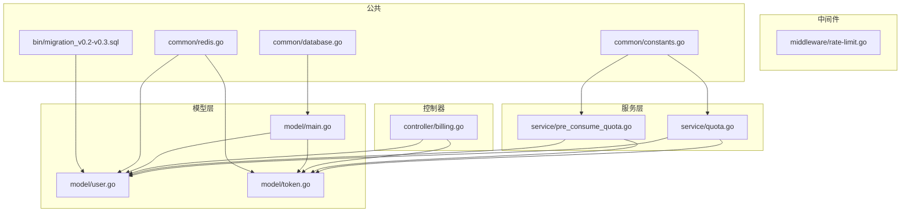
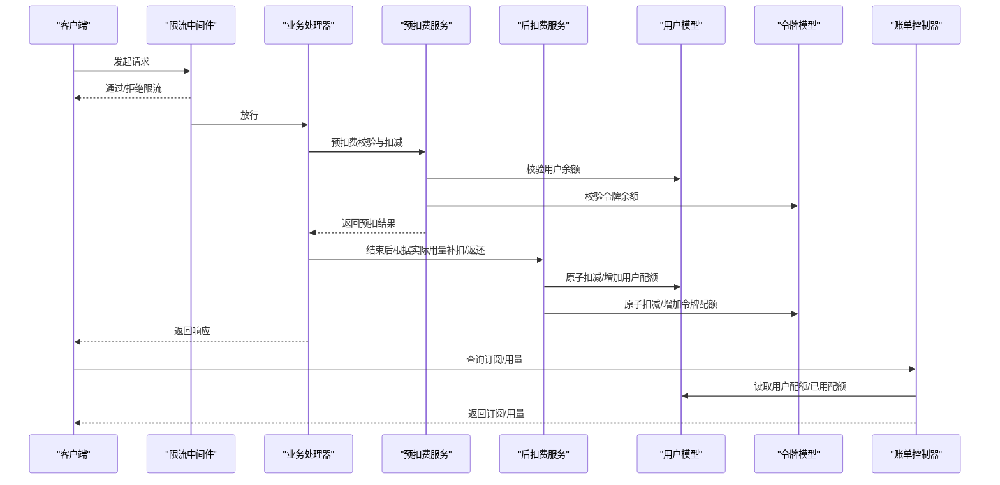
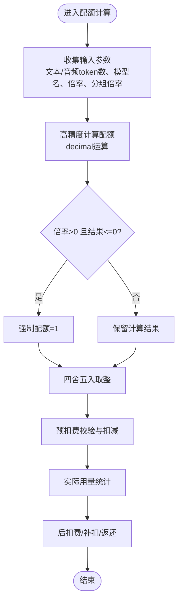
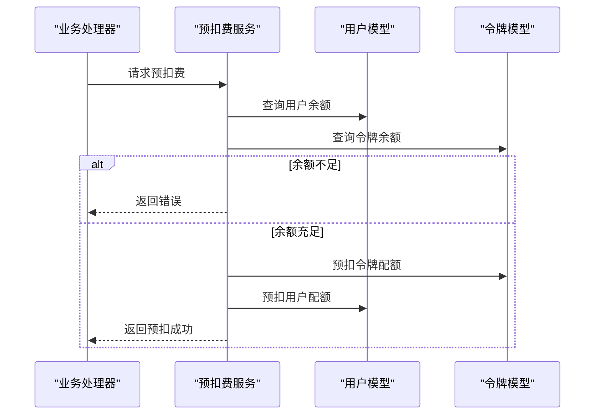
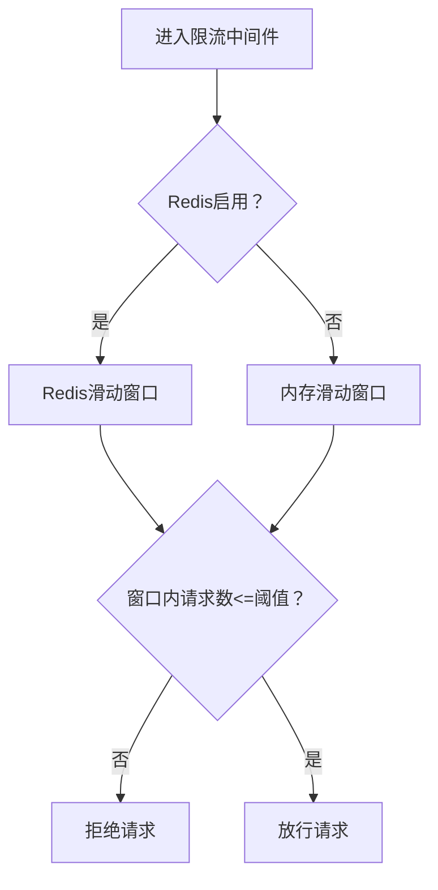
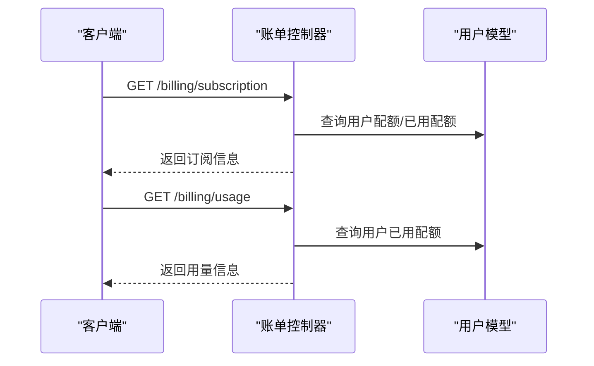
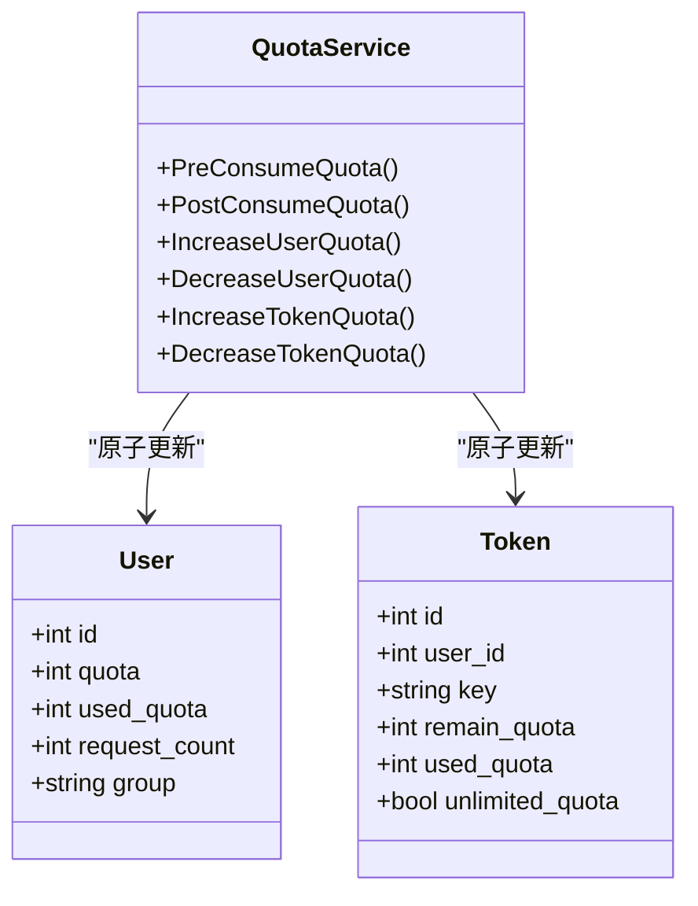
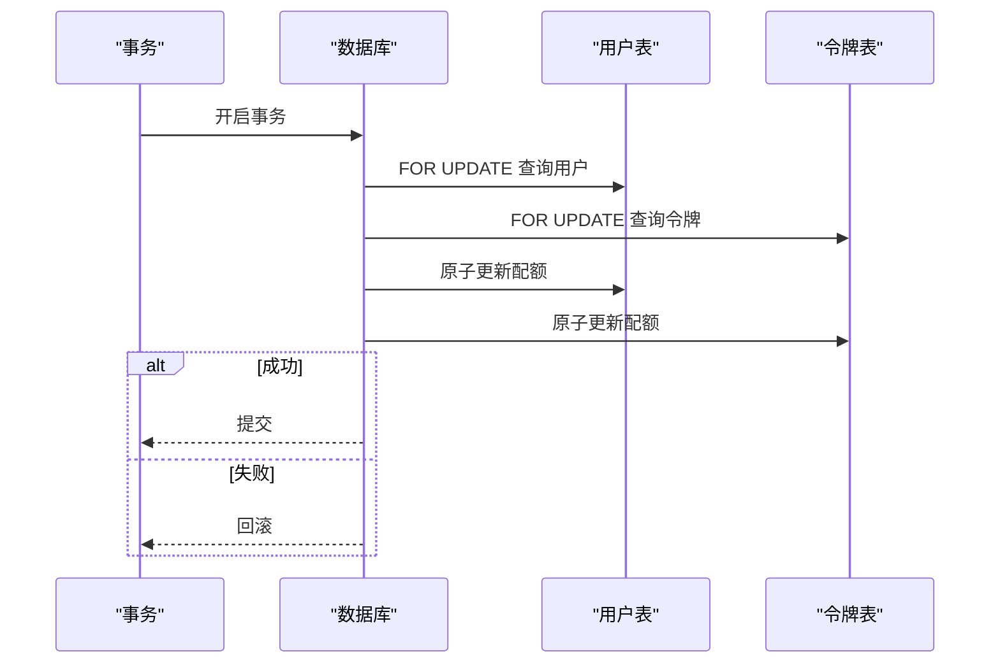
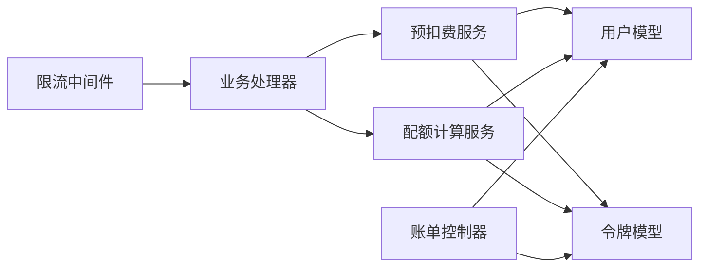

# 配额校验与执行

<cite>
**本文引用的文件列表**
- [service/quota.go](file://service/quota.go)
- [service/pre_consume_quota.go](file://service/pre_consume_quota.go)
- [middleware/rate-limit.go](file://middleware/rate-limit.go)
- [controller/billing.go](file://controller/billing.go)
- [model/user.go](file://model/user.go)
- [model/token.go](file://model/token.go)
- [model/main.go](file://model/main.go)
- [common/constants.go](file://common/constants.go)
- [common/database.go](file://common/database.go)
- [common/redis.go](file://common/redis.go)
- [bin/migration_v0.2-v0.3.sql](file://bin/migration_v0.2-v0.3.sql)
</cite>

## 目录
1. [简介](#简介)
2. [项目结构](#项目结构)
3. [核心组件](#核心组件)
4. [架构总览](#架构总览)
5. [详细组件分析](#详细组件分析)
6. [依赖关系分析](#依赖关系分析)
7. [性能考量](#性能考量)
8. [故障排查指南](#故障排查指南)
9. [结论](#结论)
10. [附录](#附录)

## 简介
本文件围绕“配额校验与执行”的主题，系统梳理以下方面：
- 配额扣减、预扣费与超额控制的实现机制
- 数据库事务如何保证扣减操作的原子性
- 中间件限流触发条件与处理流程
- 用户余额校验逻辑与控制器对接
- 用户配额字段的存储结构与更新策略
- 并发场景下的锁机制应用示例
- 常见问题：精度误差、时区差异导致的统计偏差、异常情况下的配额回滚

## 项目结构
围绕配额系统的关键模块分布如下：
- 服务层：service/quota.go 实现配额计算、预扣费、后扣费与通知；service/pre_consume_quota.go 实现预扣费前置校验与返还
- 中间件：middleware/rate-limit.go 提供全局速率限制
- 控制器：controller/billing.go 对外提供订阅与用量查询接口
- 模型层：model/user.go、model/token.go 定义用户与令牌配额字段及增减方法；model/main.go 管理数据库初始化与迁移
- 公共常量与工具：common/constants.go 定义配额单位、阈值、批量更新开关；common/redis.go 提供Redis原子增减；common/database.go 描述数据库类型

图表来源
- [service/quota.go](file://service/quota.go#L1-L120)
- [service/pre_consume_quota.go](file://service/pre_consume_quota.go#L1-L79)
- [middleware/rate-limit.go](file://middleware/rate-limit.go#L1-L118)
- [controller/billing.go](file://controller/billing.go#L1-L109)
- [model/user.go](file://model/user.go#L1-L120)
- [model/token.go](file://model/token.go#L1-L120)
- [model/main.go](file://model/main.go#L1-L120)
- [common/constants.go](file://common/constants.go#L1-L120)
- [common/redis.go](file://common/redis.go#L1-L120)
- [common/database.go](file://common/database.go#L1-L16)
- [bin/migration_v0.2-v0.3.sql](file://bin/migration_v0.2-v0.3.sql#L1-L6)

章节来源
- [service/quota.go](file://service/quota.go#L1-L120)
- [middleware/rate-limit.go](file://middleware/rate-limit.go#L1-L118)
- [controller/billing.go](file://controller/billing.go#L1-L109)
- [model/user.go](file://model/user.go#L1-L120)
- [model/token.go](file://model/token.go#L1-L120)
- [model/main.go](file://model/main.go#L1-L120)
- [common/constants.go](file://common/constants.go#L1-L120)
- [common/redis.go](file://common/redis.go#L1-L120)
- [common/database.go](file://common/database.go#L1-L16)
- [bin/migration_v0.2-v0.3.sql](file://bin/migration_v0.2-v0.3.sql#L1-L6)

## 核心组件
- 配额计算与扣减
  - 计算逻辑：service/quota.go 中的配额计算函数，综合模型倍率、分组倍率、音频/文本比率等，得出最终配额
  - 预扣费：service/pre_consume_quota.go 在请求开始前进行余额校验与预扣，降低并发风险
  - 后扣费与补扣/返还：service/quota.go 的后处理函数根据实际用量与预扣差额进行补扣或返还，并记录日志
- 余额校验与控制器
  - 用户余额查询：controller/billing.go 提供订阅与用量接口，内部调用 model 层获取用户配额
- 数据库事务与原子性
  - 用户与令牌配额更新采用表达式原子更新，避免竞态；部分场景使用行级锁确保幂等与一致性
- 限流中间件
  - middleware/rate-limit.go 提供全局Web/API/Critical/下载/上传限流，基于Redis或内存实现滑动窗口

章节来源
- [service/quota.go](file://service/quota.go#L1-L120)
- [service/pre_consume_quota.go](file://service/pre_consume_quota.go#L1-L79)
- [controller/billing.go](file://controller/billing.go#L1-L109)
- [middleware/rate-limit.go](file://middleware/rate-limit.go#L1-L118)

## 架构总览
下图展示了从请求到配额执行的关键路径，以及与限流、余额查询的关系。

图表来源
- [middleware/rate-limit.go](file://middleware/rate-limit.go#L1-L118)
- [service/pre_consume_quota.go](file://service/pre_consume_quota.go#L1-L79)
- [service/quota.go](file://service/quota.go#L480-L533)
- [model/user.go](file://model/user.go#L790-L932)
- [model/token.go](file://model/token.go#L296-L331)
- [controller/billing.go](file://controller/billing.go#L1-L109)

## 详细组件分析

### 组件A：配额计算与扣减（service/quota.go）
- 配额计算
  - 输入包含文本/音频输入输出token数、模型名称、是否按价格计价、模型倍率、分组倍率等
  - 使用decimal进行高精度运算，避免浮点误差
  - 若倍率非零而计算结果小于等于0，强制置为1，避免配额为0导致误判
- 预扣费与后扣费
  - 预扣费：在请求开始前，先从令牌与用户余额中预扣一定配额，降低并发风险
  - 后扣费：根据实际用量与预扣差额进行补扣或返还，记录日志并可触发配额提醒
- 原子性保障
  - 用户与令牌配额更新均使用数据库表达式原子更新，避免竞态
  - 日志记录与配额变更分离，确保即使日志失败也不会影响配额一致性

图表来源
- [service/quota.go](file://service/quota.go#L1-L120)
- [service/quota.go](file://service/quota.go#L480-L533)

章节来源
- [service/quota.go](file://service/quota.go#L1-L120)
- [service/quota.go](file://service/quota.go#L480-L533)

### 组件B：预扣费服务（service/pre_consume_quota.go）
- 触发条件
  - 用户余额充足且超过信任阈值时，可能信任令牌额度，不再预扣
  - 否则对令牌与用户余额进行预扣，降低并发风险
- 失败回滚
  - 若预扣失败，通过异步任务返还预扣配额，确保余额一致

图表来源
- [service/pre_consume_quota.go](file://service/pre_consume_quota.go#L1-L79)
- [model/user.go](file://model/user.go#L790-L932)
- [model/token.go](file://model/token.go#L296-L331)

章节来源
- [service/pre_consume_quota.go](file://service/pre_consume_quota.go#L1-L79)

### 组件C：限流中间件（middleware/rate-limit.go）
- 触发条件
  - 全局Web限流、全局API限流、关键资源限流、下载限流、上传限流
  - 通过Redis或内存实现滑动窗口，超过阈值则拒绝请求
- 处理流程
  - 计算当前时间与最旧时间差，若窗口内请求数超过阈值则拒绝
  - 否则将当前时间加入队列并修剪长度，延长过期时间

图表来源
- [middleware/rate-limit.go](file://middleware/rate-limit.go#L1-L118)

章节来源
- [middleware/rate-limit.go](file://middleware/rate-limit.go#L1-L118)

### 组件D：用户余额校验与控制器（controller/billing.go）
- 订阅查询
  - 根据显示类型（USD/CNY/TOKENS）将配额转换为相应单位
  - 支持显示令牌统计或用户统计
- 用量查询
  - 返回用户已用配额，按显示类型转换

图表来源
- [controller/billing.go](file://controller/billing.go#L1-L109)
- [model/user.go](file://model/user.go#L670-L733)

章节来源
- [controller/billing.go](file://controller/billing.go#L1-L109)
- [model/user.go](file://model/user.go#L670-L733)

### 组件E：用户配额字段存储与更新策略（model/user.go、model/token.go）
- 用户配额字段
  - 用户表包含 quota（剩余额度）、used_quota（已用配额）、request_count（请求次数）
  - 令牌表包含 remain_quota（剩余额度）、used_quota（已用配额）、unlimited_quota（无限额度）
- 更新策略
  - 原子更新：使用数据库表达式对字段进行加减，避免竞态
  - 批量更新：开启批量更新时，将增量写入队列，定时批量落盘
  - 缓存同步：异步更新Redis缓存，保证读写一致性

图表来源
- [model/user.go](file://model/user.go#L1-L120)
- [model/user.go](file://model/user.go#L790-L932)
- [model/token.go](file://model/token.go#L1-L120)
- [model/token.go](file://model/token.go#L296-L331)
- [service/quota.go](file://service/quota.go#L480-L533)

章节来源
- [model/user.go](file://model/user.go#L1-L120)
- [model/user.go](file://model/user.go#L790-L932)
- [model/token.go](file://model/token.go#L1-L120)
- [model/token.go](file://model/token.go#L296-L331)

### 组件F：并发锁机制与事务原子性
- 行级锁与事务
  - 在充值与补单等关键流程中使用行级锁（FOR UPDATE），确保幂等与一致性
  - 使用GORM事务封装多步更新，失败自动回滚
- 原子更新
  - 用户与令牌配额更新采用表达式原子更新，避免竞态
- Redis原子增减
  - 提供Redis管道事务，保证在键存在且带TTL时的原子性

图表来源
- [model/token.go](file://model/token.go#L296-L331)
- [model/user.go](file://model/user.go#L790-L932)
- [common/redis.go](file://common/redis.go#L241-L300)

章节来源
- [model/token.go](file://model/token.go#L296-L331)
- [model/user.go](file://model/user.go#L790-L932)
- [common/redis.go](file://common/redis.go#L241-L300)

## 依赖关系分析
- 配额计算依赖倍率配置与用户/令牌状态
- 预扣费依赖用户与令牌余额查询
- 后扣费依赖原子更新与日志记录
- 限流中间件独立于配额逻辑，但影响请求到达率
- 控制器依赖模型层读取余额与用量

图表来源
- [middleware/rate-limit.go](file://middleware/rate-limit.go#L1-L118)
- [service/pre_consume_quota.go](file://service/pre_consume_quota.go#L1-L79)
- [service/quota.go](file://service/quota.go#L1-L120)
- [model/user.go](file://model/user.go#L1-L120)
- [model/token.go](file://model/token.go#L1-L120)
- [controller/billing.go](file://controller/billing.go#L1-L109)

章节来源
- [middleware/rate-limit.go](file://middleware/rate-limit.go#L1-L118)
- [service/pre_consume_quota.go](file://service/pre_consume_quota.go#L1-L79)
- [service/quota.go](file://service/quota.go#L1-L120)
- [model/user.go](file://model/user.go#L1-L120)
- [model/token.go](file://model/token.go#L1-L120)
- [controller/billing.go](file://controller/billing.go#L1-L109)

## 性能考量
- 原子更新与批量更新
  - 使用数据库表达式原子更新，减少锁竞争
  - 批量更新开启时，将多次小更新合并，降低写放大
- 缓存与异步
  - Redis缓存与异步更新，降低读写延迟
- 限流与削峰
  - 全局限流中间件在高并发场景下保护后端

[本节为通用指导，无需列出具体文件来源]

## 故障排查指南
- 精度误差
  - 配额计算使用高精度decimal，避免浮点误差；若出现极小值，系统会强制置为1
- 时区差异导致的统计偏差
  - 日志记录与统计使用服务器时间戳，建议统一时区配置，避免跨时区统计偏差
- 异常情况下的配额回滚
  - 预扣费失败时，通过异步任务返还预扣配额
  - 事务失败自动回滚，确保余额一致
- 限流导致的请求失败
  - 检查限流配置与Redis连接状态，必要时临时提高阈值或关闭限流

章节来源
- [service/quota.go](file://service/quota.go#L1-L120)
- [service/pre_consume_quota.go](file://service/pre_consume_quota.go#L1-L79)
- [middleware/rate-limit.go](file://middleware/rate-limit.go#L1-L118)
- [common/redis.go](file://common/redis.go#L241-L300)

## 结论
本系统通过“预扣费+后扣费+原子更新+限流+事务/锁”的组合，实现了高并发下的配额安全与一致性。配额计算采用高精度decimal，避免精度误差；通过Redis与批量更新优化性能；通过行级锁与事务确保异常情况下余额一致。控制器提供余额与用量查询接口，便于前端与运营侧监控。

[本节为总结性内容，无需列出具体文件来源]

## 附录
- 数据库初始化与迁移
  - model/main.go 负责数据库初始化与迁移，确保表结构正确
  - bin/migration_v0.2-v0.3.sql 将令牌剩余额度汇总到用户表，保证历史余额一致
- 常量与配置
  - common/constants.go 定义配额单位、信任阈值、批量更新开关等

章节来源
- [model/main.go](file://model/main.go#L1-L120)
- [bin/migration_v0.2-v0.3.sql](file://bin/migration_v0.2-v0.3.sql#L1-L6)
- [common/constants.go](file://common/constants.go#L1-L120)