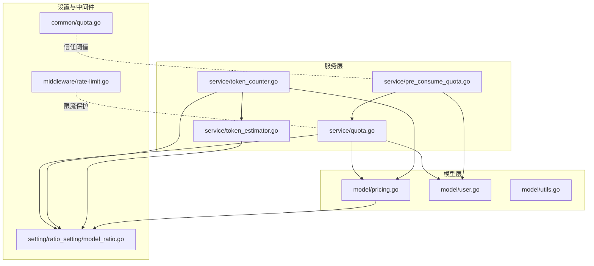
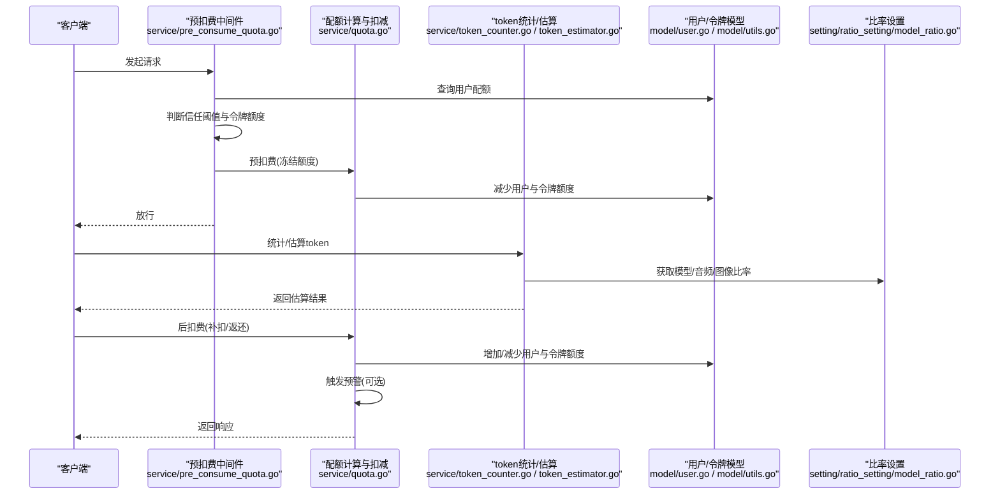
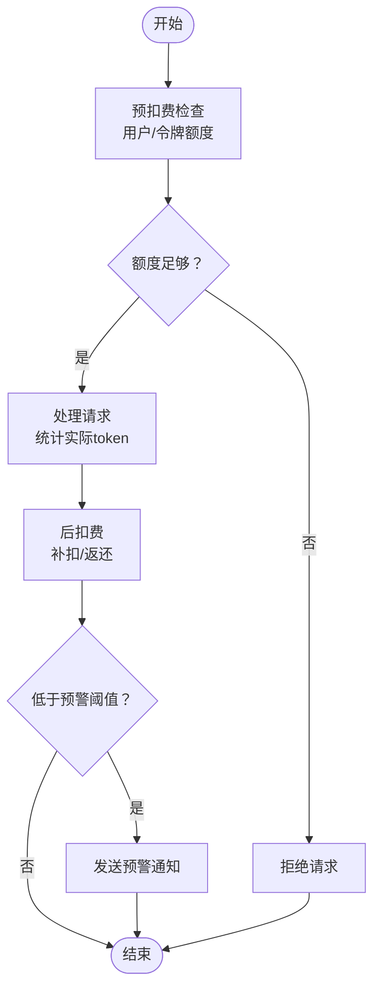
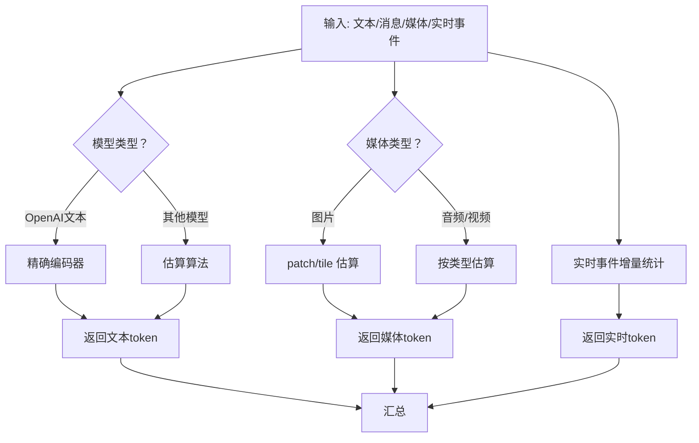
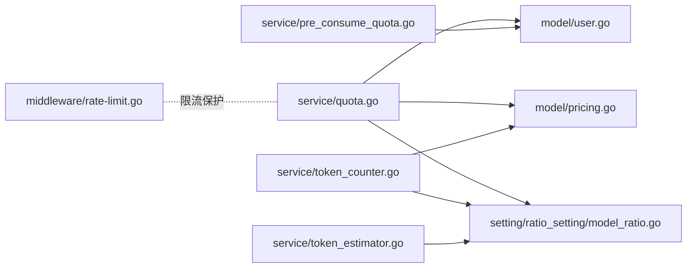

# 配额管理

<cite>
**本文引用的文件**
- [service/quota.go](file://service/quota.go)
- [service/token_counter.go](file://service/token_counter.go)
- [service/token_estimator.go](file://service/token_estimator.go)
- [service/pre_consume_quota.go](file://service/pre_consume_quota.go)
- [model/pricing.go](file://model/pricing.go)
- [setting/ratio_setting/model_ratio.go](file://setting/ratio_setting/model_ratio.go)
- [middleware/rate-limit.go](file://middleware/rate-limit.go)
- [common/quota.go](file://common/quota.go)
- [model/user.go](file://model/user.go)
- [model/utils.go](file://model/utils.go)
- [bin/migration_v0.2-v0.3.sql](file://bin/migration_v0.2-v0.3.sql)
</cite>

## 目录
1. [简介](#简介)
2. [项目结构](#项目结构)
3. [核心组件](#核心组件)
4. [架构总览](#架构总览)
5. [详细组件分析](#详细组件分析)
6. [依赖关系分析](#依赖关系分析)
7. [性能考量](#性能考量)
8. [故障排查指南](#故障排查指南)
9. [结论](#结论)
10. [附录](#附录)

## 简介
本文件围绕配额管理展开，系统性阐述以下内容：
- 配额扣减、预扣费与超额控制的实现机制
- token_counter 如何统计 token 数量以精确计算 API 调用消耗
- token_estimator 在请求前对文本 token 进行估算，防止超额使用
- 配额预警触发逻辑与通知机制
- 用户配额查询、重置与继承策略
- 结合 model/pricing 中的定价模型，说明不同模型与渠道的差异化计费权重配置
- 实际代码示例展示配额校验的中间件流程与异常处理
- 常见问题：精度误差、并发竞争、时区差异导致的统计偏差

## 项目结构
配额管理相关代码主要分布在 service 层与 model 层：
- service 层负责配额计算、预扣费、后扣费、实时消费记录与预警通知
- model 层负责用户与令牌配额的持久化、批量更新与缓存
- setting/ratio_setting 提供模型倍率、价格、音频/图像等比率配置
- middleware 提供速率限制等外围保护
- common 提供通用阈值与信任额度等常量

图表来源
- [service/quota.go](file://service/quota.go#L1-L582)
- [service/pre_consume_quota.go](file://service/pre_consume_quota.go#L1-L80)
- [service/token_counter.go](file://service/token_counter.go#L1-L453)
- [service/token_estimator.go](file://service/token_estimator.go#L1-L231)
- [model/pricing.go](file://model/pricing.go#L1-L314)
- [setting/ratio_setting/model_ratio.go](file://setting/ratio_setting/model_ratio.go#L1-L857)
- [middleware/rate-limit.go](file://middleware/rate-limit.go#L1-L118)
- [common/quota.go](file://common/quota.go#L1-L6)
- [model/user.go](file://model/user.go#L669-L835)
- [model/utils.go](file://model/utils.go#L65-L112)

章节来源
- [service/quota.go](file://service/quota.go#L1-L582)
- [service/token_counter.go](file://service/token_counter.go#L1-L453)
- [service/token_estimator.go](file://service/token_estimator.go#L1-L231)
- [service/pre_consume_quota.go](file://service/pre_consume_quota.go#L1-L80)
- [model/pricing.go](file://model/pricing.go#L1-L314)
- [setting/ratio_setting/model_ratio.go](file://setting/ratio_setting/model_ratio.go#L1-L857)
- [middleware/rate-limit.go](file://middleware/rate-limit.go#L1-L118)
- [common/quota.go](file://common/quota.go#L1-L6)
- [model/user.go](file://model/user.go#L669-L835)
- [model/utils.go](file://model/utils.go#L65-L112)

## 核心组件
- 配额计算与扣减
  - 预扣费：在请求开始前从用户与令牌额度中冻结一定配额，降低并发场景下的超额风险
  - 后扣费：根据实际消耗与预扣费差额进行补扣或返还
  - 预估消耗：在请求前估算 token 数量，结合比率配置计算预扣费额度
- token 统计
  - 文本 token：OpenAI 文本模型使用精确编码器；其他模型采用估算算法
  - 媒体 token：图片、音频、视频按模型与细节策略估算
  - 实时流 token：针对实时事件进行增量统计
- 预警与通知
  - 当用户剩余配额低于阈值时，按用户偏好发送邮件/Bark/Gotify/Webhook 通知
- 定价与比率
  - 模型倍率、完成倍率、音频/音频完成倍率、图像倍率、价格等由比率设置模块提供
  - 不同模型与渠道组合对应不同的计费权重

章节来源
- [service/quota.go](file://service/quota.go#L1-L582)
- [service/token_counter.go](file://service/token_counter.go#L1-L453)
- [service/token_estimator.go](file://service/token_estimator.go#L1-L231)
- [service/pre_consume_quota.go](file://service/pre_consume_quota.go#L1-L80)
- [model/pricing.go](file://model/pricing.go#L1-L314)
- [setting/ratio_setting/model_ratio.go](file://setting/ratio_setting/model_ratio.go#L1-L857)

## 架构总览
配额管理的关键流程包括：
- 预扣费阶段：检查用户与令牌额度，必要时冻结预扣费额度
- 请求处理阶段：统计实际 token 消耗
- 后扣费阶段：根据实际消耗与预扣费差额补扣或返还
- 预警阶段：当剩余配额低于阈值时触发通知

图表来源
- [service/pre_consume_quota.go](file://service/pre_consume_quota.go#L1-L80)
- [service/quota.go](file://service/quota.go#L1-L582)
- [service/token_counter.go](file://service/token_counter.go#L1-L453)
- [service/token_estimator.go](file://service/token_estimator.go#L1-L231)
- [model/user.go](file://model/user.go#L669-L835)
- [model/utils.go](file://model/utils.go#L65-L112)
- [setting/ratio_setting/model_ratio.go](file://setting/ratio_setting/model_ratio.go#L1-L857)

## 详细组件分析

### 配额计算与扣减（service/quota.go）
- 预扣费
  - 在请求开始前冻结预扣费额度，若用户或令牌额度不足则拒绝
  - 支持自动分组与用户自定义分组比率叠加
- 后扣费
  - 根据实际消耗与预扣费差额进行补扣或返还
  - 更新用户与令牌额度，并记录消费日志
- 预估消耗
  - 对实时流与音频转写/翻译场景，基于时长估算 token
  - 对文本与媒体，分别使用精确编码器与估算算法
- 预警通知
  - 当用户剩余配额低于阈值时，异步发送通知（邮件/Bark/Gotify/Webhook）

图表来源
- [service/quota.go](file://service/quota.go#L1-L582)
- [service/pre_consume_quota.go](file://service/pre_consume_quota.go#L1-L80)

章节来源
- [service/quota.go](file://service/quota.go#L1-L582)
- [service/pre_consume_quota.go](file://service/pre_consume_quota.go#L1-L80)

### token 统计（service/token_counter.go）
- 文本 token
  - OpenAI 文本模型使用精确编码器
  - 其他模型使用估算算法，避免昂贵的外部依赖
- 媒体 token
  - 图片：按模型族与细节策略估算，支持 patch/tile 两种计算方式
  - 音频/视频：按文件类型与大小估算
- 实时流 token
  - 针对实时事件（输入/输出音频、文本增量、工具调用）进行增量统计
- 估算接口
  - EstimateRequestToken：综合文本、消息格式、工具、媒体等估算总 token

图表来源
- [service/token_counter.go](file://service/token_counter.go#L1-L453)
- [service/token_estimator.go](file://service/token_estimator.go#L1-L231)

章节来源
- [service/token_counter.go](file://service/token_counter.go#L1-L453)
- [service/token_estimator.go](file://service/token_estimator.go#L1-L231)

### 预估消耗与预扣费（service/pre_consume_quota.go）
- 信任阈值
  - 当用户额度超过信任阈值且令牌额度充足时，信任用户并跳过预扣费
- 预扣费执行
  - 成功冻结预扣费额度后，同步减少用户额度
- 异常处理
  - 额度不足或数据库错误时，返回明确错误码并可选择不记录错误日志

章节来源
- [service/pre_consume_quota.go](file://service/pre_consume_quota.go#L1-L80)
- [common/quota.go](file://common/quota.go#L1-L6)

### 定价与比率（model/pricing.go 与 setting/ratio_setting/model_ratio.go）
- 定价模型
  - 模型倍率、完成倍率、音频/音频完成倍率、图像倍率、价格等
  - 支持按模型名精确匹配与通配规则
- 比率配置
  - 默认倍率与价格映射，支持运行时更新
  - 不同厂商（OpenAI/Gemini/Claude）的估算权重不同

章节来源
- [model/pricing.go](file://model/pricing.go#L1-L314)
- [setting/ratio_setting/model_ratio.go](file://setting/ratio_setting/model_ratio.go#L1-L857)

### 预警与通知（service/quota.go）
- 阈值策略
  - 使用全局阈值或用户自定义阈值
- 通知类型
  - 邮件、Bark、Gotify、Webhook（支持 HTML）
- 异步发送
  - 使用协程池异步发送，避免阻塞主流程

章节来源
- [service/quota.go](file://service/quota.go#L526-L581)

### 用户配额查询、重置与继承（model/user.go 与 model/utils.go）
- 查询
  - 优先从 Redis 缓存读取，失败回退到数据库
- 批量更新
  - 通过批处理队列合并多次更新，降低数据库压力
- 重置与继承
  - 数据库迁移脚本将令牌剩余额度累加到用户配额，体现“令牌额度继承用户”的策略

章节来源
- [model/user.go](file://model/user.go#L669-L835)
- [model/utils.go](file://model/utils.go#L65-L112)
- [bin/migration_v0.2-v0.3.sql](file://bin/migration_v0.2-v0.3.sql#L1-L6)

## 依赖关系分析
- 配额计算依赖比率设置与定价模型
- token 统计依赖比率设置与定价模型
- 预扣费依赖用户与令牌模型
- 预警依赖用户设置与通知通道

图表来源
- [service/quota.go](file://service/quota.go#L1-L582)
- [service/pre_consume_quota.go](file://service/pre_consume_quota.go#L1-L80)
- [service/token_counter.go](file://service/token_counter.go#L1-L453)
- [service/token_estimator.go](file://service/token_estimator.go#L1-L231)
- [model/pricing.go](file://model/pricing.go#L1-L314)
- [setting/ratio_setting/model_ratio.go](file://setting/ratio_setting/model_ratio.go#L1-L857)
- [middleware/rate-limit.go](file://middleware/rate-limit.go#L1-L118)

章节来源
- [service/quota.go](file://service/quota.go#L1-L582)
- [service/pre_consume_quota.go](file://service/pre_consume_quota.go#L1-L80)
- [service/token_counter.go](file://service/token_counter.go#L1-L453)
- [service/token_estimator.go](file://service/token_estimator.go#L1-L231)
- [model/pricing.go](file://model/pricing.go#L1-L314)
- [setting/ratio_setting/model_ratio.go](file://setting/ratio_setting/model_ratio.go#L1-L857)
- [middleware/rate-limit.go](file://middleware/rate-limit.go#L1-L118)

## 性能考量
- 批量更新
  - 通过批处理队列合并用户/令牌/用量/请求次数等更新，显著降低数据库写入压力
- 缓存命中
  - 用户配额优先从 Redis 读取，失败再回源数据库
- 估算策略
  - 非 OpenAI 文本模型使用估算算法，避免昂贵的外部依赖
- 并发安全
  - 预扣费与后扣费均通过原子操作与批处理保障一致性

章节来源
- [model/utils.go](file://model/utils.go#L65-L112)
- [model/user.go](file://model/user.go#L669-L835)
- [service/token_estimator.go](file://service/token_estimator.go#L1-L231)

## 故障排查指南
- 预扣费失败
  - 检查用户剩余额度与令牌剩余额度是否满足预扣费
  - 关注信任阈值与令牌额度是否充足
- 后扣费异常
  - 确认实际消耗是否为 0（可能上游错误），此时不会扣费但会记录日志
  - 检查预扣费与实际消耗差额是否正确
- 预警未触发
  - 检查用户自定义阈值是否覆盖全局阈值
  - 确认通知类型与通道配置正确
- 精度误差
  - 文本 token 估算存在误差，建议在关键场景使用精确编码器
  - 媒体 token 估算受模型族与细节策略影响，注意与实际行为差异
- 并发竞争
  - 使用批处理与原子操作，避免竞态条件
  - 预扣费与后扣费必须成对出现，确保最终一致性
- 时区差异
  - 日志时间戳使用服务器时区，注意跨时区统计偏差
  - 建议统一使用 UTC 进行统计与展示

章节来源
- [service/pre_consume_quota.go](file://service/pre_consume_quota.go#L1-L80)
- [service/quota.go](file://service/quota.go#L1-L582)
- [service/token_counter.go](file://service/token_counter.go#L1-L453)

## 结论
该配额管理体系通过“预扣费 + 后扣费 + 估算 + 预警”的闭环设计，在保证准确性的同时兼顾性能与用户体验。比率设置模块提供了灵活的差异化计费权重，token 统计模块在精确与估算之间取得平衡，model 层的缓存与批处理进一步提升了吞吐能力。配合速率限制中间件，整体系统具备良好的稳定性与可扩展性。

## 附录
- 实际代码示例（路径引用）
  - 预扣费流程：[service/pre_consume_quota.go](file://service/pre_consume_quota.go#L1-L80)
  - 后扣费与预警：[service/quota.go](file://service/quota.go#L504-L581)
  - token 统计与估算：[service/token_counter.go](file://service/token_counter.go#L202-L342)
  - 文本估算权重：[service/token_estimator.go](file://service/token_estimator.go#L1-L231)
  - 定价与比率：[model/pricing.go](file://model/pricing.go#L1-L314)、[setting/ratio_setting/model_ratio.go](file://setting/ratio_setting/model_ratio.go#L1-L857)
  - 用户配额查询与批量更新：[model/user.go](file://model/user.go#L669-L835)、[model/utils.go](file://model/utils.go#L65-L112)
  - 速率限制中间件：[middleware/rate-limit.go](file://middleware/rate-limit.go#L1-L118)
  - 信任阈值：[common/quota.go](file://common/quota.go#L1-L6)
  - 配额继承（迁移脚本）：[bin/migration_v0.2-v0.3.sql](file://bin/migration_v0.2-v0.3.sql#L1-L6)