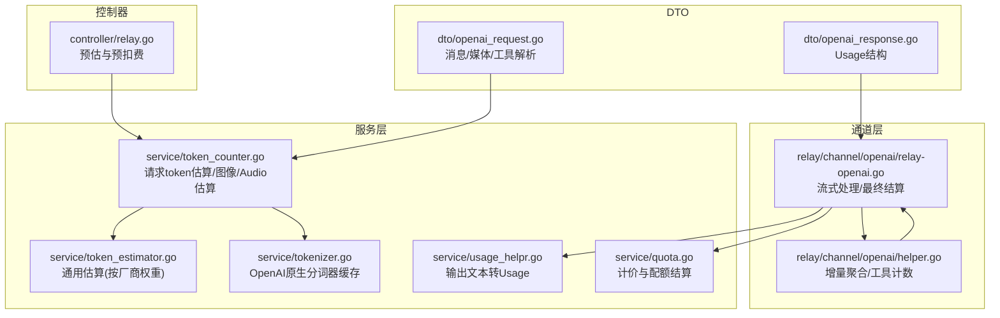
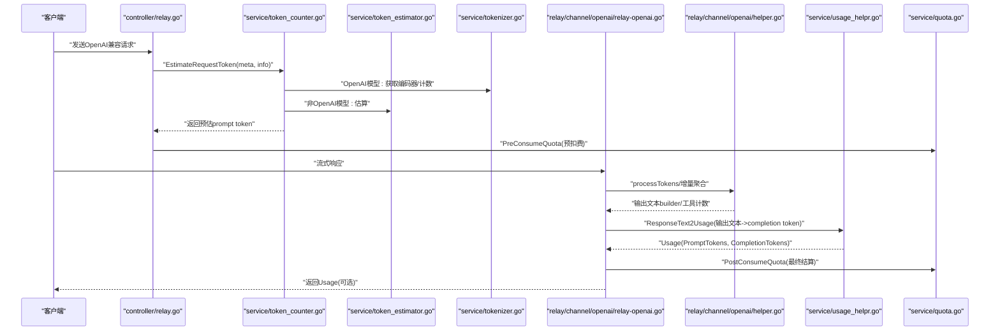
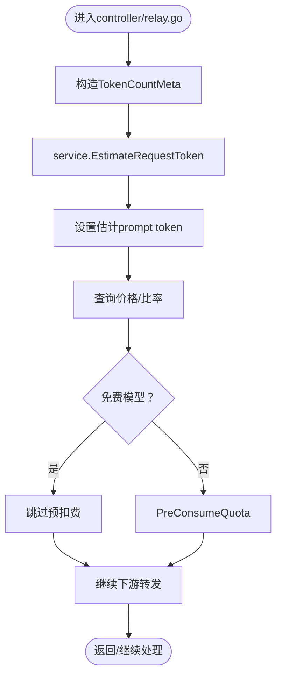
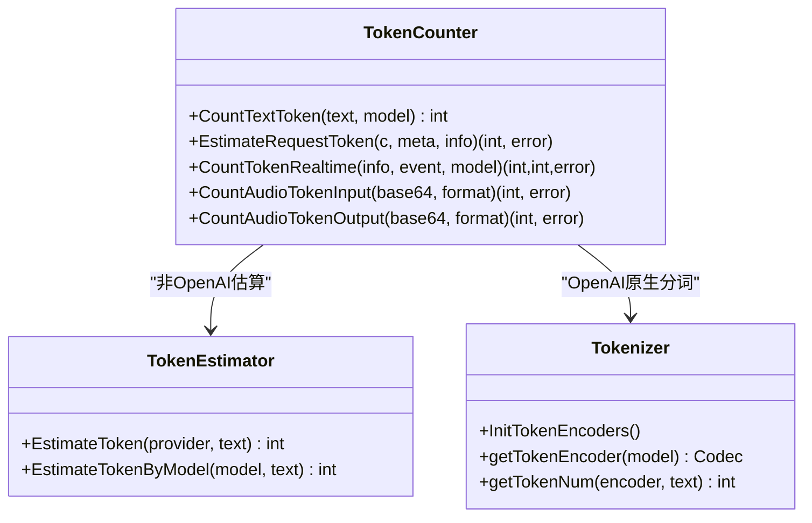
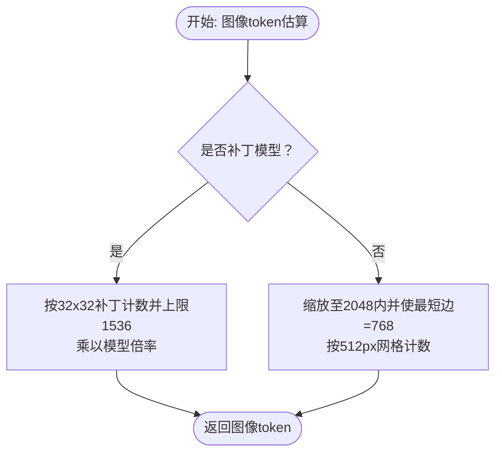
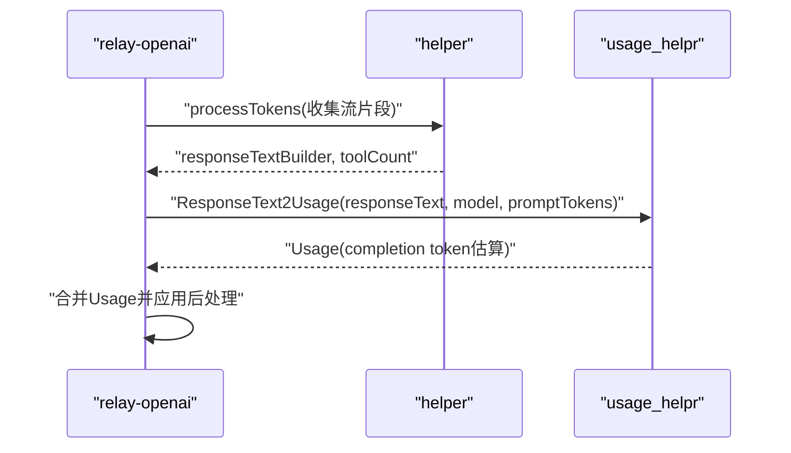
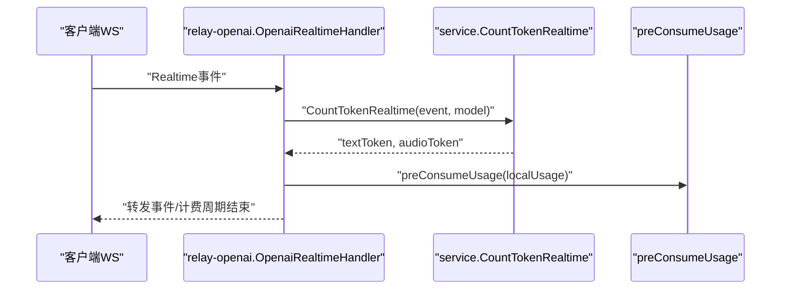
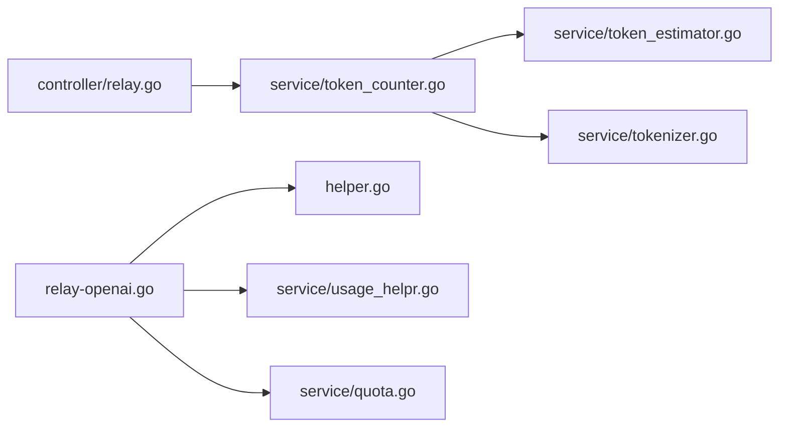

# 配额计算

<cite>
**本文引用的文件列表**
- [token_counter.go](file://service/token_counter.go)
- [token_estimator.go](file://service/token_estimator.go)
- [tokenizer.go](file://service/tokenizer.go)
- [relay-openai.go](file://relay/channel/openai/relay-openai.go)
- [helper.go](file://relay/channel/openai/helper.go)
- [openai_request.go](file://dto/openai_request.go)
- [openai_response.go](file://dto/openai_response.go)
- [usage_helpr.go](file://service/usage_helpr.go)
- [quota.go](file://service/quota.go)
- [relay.go](file://controller/relay.go)
</cite>

## 目录
1. [简介](#简介)
2. [项目结构与角色定位](#项目结构与角色定位)
3. [核心组件](#核心组件)
4. [架构总览](#架构总览)
5. [详细组件分析](#详细组件分析)
6. [依赖关系分析](#依赖关系分析)
7. [性能与准确性考量](#性能与准确性考量)
8. [故障排查指南](#故障排查指南)
9. [结论](#结论)

## 简介
本文件聚焦“配额计算”主题，系统性阐述如下能力：
- 如何基于不同AI模型的分词规则精确统计请求与响应的token数量
- 请求预处理阶段如何通过token_estimator估算消耗，避免超额使用
- tokenizer集成的多种分词器实现及对GPT、Claude、Gemini等模型的支持机制
- 在OpenAI兼容接口中，token计算在请求预估、流式增量计算与最终结算中的全流程
- 针对多语言文本、特殊字符、大文本分块等常见问题的处理策略

## 项目结构与角色定位
围绕配额计算的关键模块分布如下：
- 请求预估与预扣费：controller层负责读取请求体，构造TokenCountMeta并调用service.EstimateRequestToken进行预估；随后根据价格与比率预扣配额
- 分词与估算：service层提供CountTextToken、EstimateTokenByModel、CountTokenRealtime等方法，分别针对OpenAI原生分词与通用估算
- 流式响应处理：relay-openai与helper负责收集流式片段，增量构建输出文本并计算token
- 结算与计价：service.usage_helpr与service.quota负责将估算与实际计算结果汇总为Usage，并按模型/渠道/分组倍率进行计价

图表来源
- [relay.go](file://controller/relay.go#L117-L165)
- [token_counter.go](file://service/token_counter.go#L202-L342)
- [token_estimator.go](file://service/token_estimator.go#L216-L231)
- [tokenizer.go](file://service/tokenizer.go#L26-L64)
- [relay-openai.go](file://relay/channel/openai/relay-openai.go#L106-L194)
- [helper.go](file://relay/channel/openai/helper.go#L95-L167)
- [openai_request.go](file://dto/openai_request.go#L101-L207)
- [openai_response.go](file://dto/openai_response.go#L222-L265)
- [usage_helpr.go](file://service/usage_helpr.go#L22-L34)
- [quota.go](file://service/quota.go#L164-L394)

章节来源
- [relay.go](file://controller/relay.go#L117-L165)
- [token_counter.go](file://service/token_counter.go#L202-L342)
- [token_estimator.go](file://service/token_estimator.go#L216-L231)
- [tokenizer.go](file://service/tokenizer.go#L26-L64)
- [relay-openai.go](file://relay/channel/openai/relay-openai.go#L106-L194)
- [helper.go](file://relay/channel/openai/helper.go#L95-L167)
- [openai_request.go](file://dto/openai_request.go#L101-L207)
- [openai_response.go](file://dto/openai_response.go#L222-L265)
- [usage_helpr.go](file://service/usage_helpr.go#L22-L34)
- [quota.go](file://service/quota.go#L164-L394)

## 核心组件
- 请求预估与预扣费
  - controller/relay.go在收到请求后，调用service.EstimateRequestToken计算预估prompt token，并据此预扣配额
- 文本token统计
  - service/token_counter.go提供CountTextToken，区分OpenAI与非OpenAI模型：前者使用tiktoken-go编码器，后者使用service/token_estimator.go的估算
- 图像/Audio token估算
  - service/token_counter.go对图像采用“瓦片/补丁”模型规则，对音频按时长估算token
- 流式响应增量计算
  - relay/channel/openai/relay-openai.go与helper.go在流式场景中累积输出文本，再统一估算completion token
- 输出文本转Usage
  - service/usage_helpr.go将输出文本按模型估算为completion token，并与预估prompt token合并
- 计价与配额结算
  - service/quota.go依据模型/渠道/分组倍率计算实际扣费与日志明细

章节来源
- [relay.go](file://controller/relay.go#L117-L165)
- [token_counter.go](file://service/token_counter.go#L440-L453)
- [token_estimator.go](file://service/token_estimator.go#L69-L148)
- [tokenizer.go](file://service/tokenizer.go#L26-L64)
- [relay-openai.go](file://relay/channel/openai/relay-openai.go#L106-L194)
- [helper.go](file://relay/channel/openai/helper.go#L95-L167)
- [usage_helpr.go](file://service/usage_helpr.go#L22-L34)
- [quota.go](file://service/quota.go#L164-L394)

## 架构总览
OpenAI兼容接口的token计算流程如下：

图表来源
- [relay.go](file://controller/relay.go#L117-L165)
- [token_counter.go](file://service/token_counter.go#L202-L342)
- [token_estimator.go](file://service/token_estimator.go#L69-L148)
- [tokenizer.go](file://service/tokenizer.go#L26-L64)
- [relay-openai.go](file://relay/channel/openai/relay-openai.go#L106-L194)
- [helper.go](file://relay/channel/openai/helper.go#L95-L167)
- [usage_helpr.go](file://service/usage_helpr.go#L22-L34)
- [quota.go](file://service/quota.go#L164-L394)

## 详细组件分析

### 组件A：请求预估与预扣费（controller/relay.go）
- 关键流程
  - 从请求构造TokenCountMeta（消息、工具、媒体等）
  - 调用service.EstimateRequestToken计算预估prompt token
  - 设置估计值到RelayInfo并查询价格/比率，执行PreConsumeQuota预扣费
- 错误处理
  - 任何环节失败均返回错误并可退回已预扣配额

图表来源
- [relay.go](file://controller/relay.go#L117-L165)

章节来源
- [relay.go](file://controller/relay.go#L117-L165)

### 组件B：文本token统计与估算（service/token_counter.go, service/token_estimator.go, service/tokenizer.go）
- OpenAI原生分词
  - tokenizer.go维护模型到编码器的缓存，支持并发安全；CountTextToken在OpenAI模型上调用getTokenNum
- 非OpenAI模型估算
  - token_estimator.go定义各厂商权重（单词、数字、CJK、符号、数学符号、URL分隔符、@、Emoji、换行/制表、空格、基础pad），EstimateTokenByModel按模型名选择厂商估算
- 统一入口
  - CountTextToken在OpenAI模型走原生分词，在其他模型走估算

图表来源
- [token_counter.go](file://service/token_counter.go#L440-L453)
- [token_estimator.go](file://service/token_estimator.go#L69-L148)
- [tokenizer.go](file://service/tokenizer.go#L26-L64)

章节来源
- [token_counter.go](file://service/token_counter.go#L440-L453)
- [token_estimator.go](file://service/token_estimator.go#L69-L148)
- [tokenizer.go](file://service/tokenizer.go#L26-L64)

### 组件C：图像与音频token估算（service/token_counter.go）
- 图像token
  - 支持“补丁”与“瓦片”两类规则，按模型族设定base/tile token，自动缩放至2048内并按512px网格计数；低细节优先级短路；支持本地解码与远程URL探测
- 音频token
  - 输入/输出分别按音频时长估算，单位换算与保底策略确保无时长信息时仍能估算

图表来源
- [token_counter.go](file://service/token_counter.go#L26-L200)

章节来源
- [token_counter.go](file://service/token_counter.go#L26-L200)

### 组件D：流式响应增量计算（relay/channel/openai/relay-openai.go, relay/channel/openai/helper.go）
- 增量聚合
  - helper.processTokens/ProcessStreamResponse将流式片段拼接为输出文本，并累计工具调用次数
- 最终结算
  - relay-openai.OaiStreamHandler在流结束后，若上游未提供usage，则调用service.ResponseText2Usage将输出文本估算为completion token，并与预估prompt token合并

图表来源
- [relay-openai.go](file://relay/channel/openai/relay-openai.go#L106-L194)
- [helper.go](file://relay/channel/openai/helper.go#L95-L167)
- [usage_helpr.go](file://service/usage_helpr.go#L22-L34)

章节来源
- [relay-openai.go](file://relay/channel/openai/relay-openai.go#L106-L194)
- [helper.go](file://relay/channel/openai/helper.go#L95-L167)
- [usage_helpr.go](file://service/usage_helpr.go#L22-L34)

### 组件E：实时（Realtime）token计算（service/token_counter.go, relay/channel/openai/relay-openai.go）
- 实时事件分类
  - 会话更新、输入音频追加、输出音频转写/Delta、函数参数Delta、对话项创建、响应完成等事件分别统计文本与音频token
- 增量计费
  - relay-openai.OpenaiRealtimeHandler在每次事件到达时累加localUsage，并在响应完成时调用preConsumeUsage进行预扣费

图表来源
- [token_counter.go](file://service/token_counter.go#L344-L396)
- [relay-openai.go](file://relay/channel/openai/relay-openai.go#L330-L534)

章节来源
- [token_counter.go](file://service/token_counter.go#L344-L396)
- [relay-openai.go](file://relay/channel/openai/relay-openai.go#L330-L534)

### 组件F：请求体解析与媒体识别（dto/openai_request.go）
- 将OpenAI兼容请求的消息、工具、媒体（图片/音频/视频/文件）解析为TokenCountMeta，供预估使用
- 支持多模态内容的抽取与归并

章节来源
- [openai_request.go](file://dto/openai_request.go#L101-L207)

### 组件G：Usage结构与计价（dto/openai_response.go, service/quota.go）
- Usage结构包含prompt/completion/total token，以及输入/输出token详情（文本、音频、缓存等）
- service/quota根据模型/渠道/分组倍率计算实际扣费与日志明细

章节来源
- [openai_response.go](file://dto/openai_response.go#L222-L265)
- [quota.go](file://service/quota.go#L164-L394)

## 依赖关系分析
- 低耦合高内聚
  - token_counter依赖token_estimator与tokenizer，但通过接口抽象（CountTextToken）隔离具体实现
  - relay-openai与helper通过统一的流式处理接口协作，便于扩展其他通道
- 关键依赖链
  - controller -> token_counter -> token_estimator/tokenizer
  - relay-openai -> helper -> usage_helpr -> quota

图表来源
- [relay.go](file://controller/relay.go#L117-L165)
- [token_counter.go](file://service/token_counter.go#L202-L342)
- [token_estimator.go](file://service/token_estimator.go#L69-L148)
- [tokenizer.go](file://service/tokenizer.go#L26-L64)
- [relay-openai.go](file://relay/channel/openai/relay-openai.go#L106-L194)
- [helper.go](file://relay/channel/openai/helper.go#L95-L167)
- [usage_helpr.go](file://service/usage_helpr.go#L22-L34)
- [quota.go](file://service/quota.go#L164-L394)

## 性能与准确性考量
- 并发安全与缓存
  - tokenizer对编码器使用RWMutex与双检缓存，避免重复初始化与竞争
- 估算精度
  - OpenAI模型使用tiktoken-go原生分词，更贴近真实计费；非OpenAI模型使用厂商权重估算，兼顾成本与可用性
- 流式处理
  - 通过增量聚合减少内存峰值；对音频模型保留倒数第二条SSE以提取usage，提高准确性
- 多媒体处理
  - 图像支持远程URL探测与本地解码；音频支持PCM与常见容器时长解析；无时长时提供保底估算

[本节为通用指导，无需列出具体文件来源]

## 故障排查指南
- 预估失败
  - 检查controller/relay.go中EstimateRequestToken返回的错误；确认请求体是否包含必要字段（消息、工具、媒体）
- 流式响应未返回Usage
  - 确认relay-openai是否正确调用ResponseText2Usage；检查ShouldIncludeUsage配置
- 实时计费异常
  - 检查relay-openai.OpenaiRealtimeHandler中preConsumeUsage调用是否成功；核对CountTokenRealtime返回的text/audio token
- 计价差异
  - 对比service/quota中使用的倍率与分组比率；核对缓存读取/创建token的处理逻辑

章节来源
- [relay.go](file://controller/relay.go#L117-L165)
- [relay-openai.go](file://relay/channel/openai/relay-openai.go#L106-L194)
- [quota.go](file://service/quota.go#L164-L394)

## 结论
该系统通过“请求预估+流式增量+最终结算”的闭环设计，实现了对多模型、多通道的统一配额计算。OpenAI原生分词保证了高精度，非OpenAI模型的估算在成本与可用性间取得平衡；流式与实时场景均提供增量计费能力，配合Usage结构与计价模块，满足生产环境的稳定性与可观测性需求。