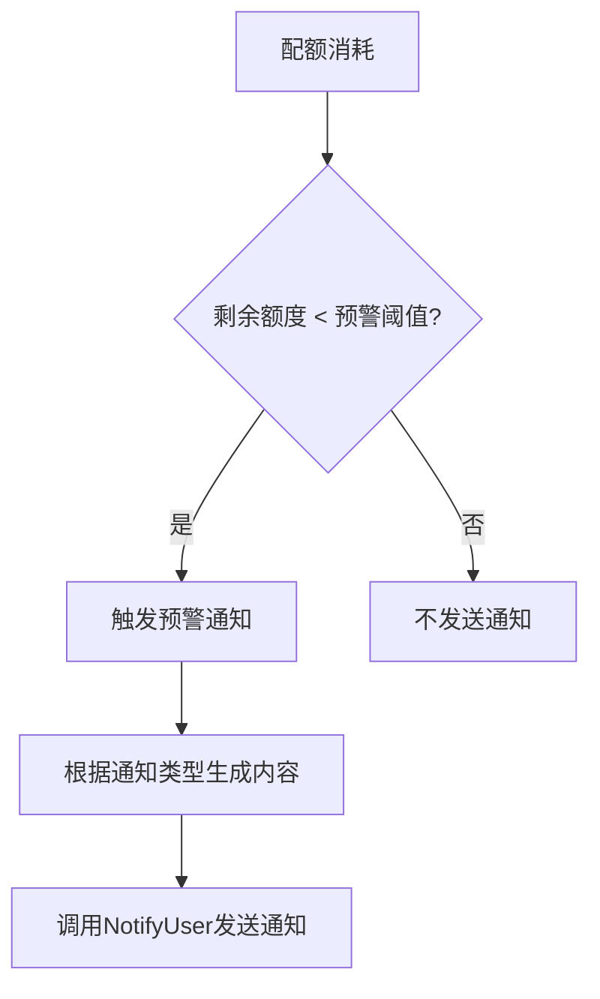
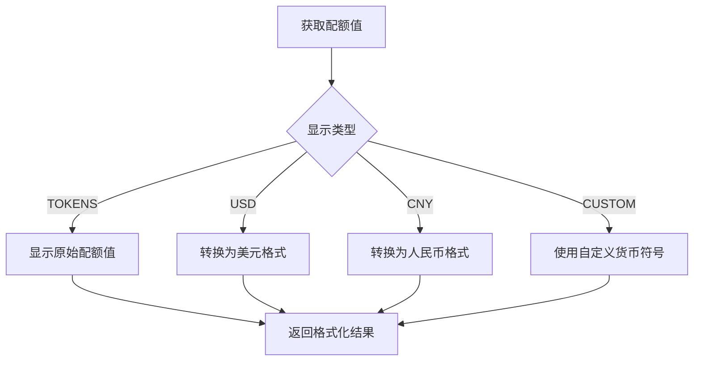

# 配额预警与通知

<cite>
**本文档引用的文件**   
- [quota.go](file://service/quota.go)
- [user.go](file://controller/user.go)
- [option.go](file://model/option.go)
- [render.jsx](file://web/src/helpers/render.jsx)
- [notify.go](file://dto/notify.go)
- [user_settings.go](file://dto/user_settings.go)
- [notify-limit.go](file://service/notify-limit.go)
</cite>

## 目录
1. [配额预警阈值判断逻辑](#配额预警阈值判断逻辑)
2. [用户配额查询接口实现](#用户配额查询接口实现)
3. [全局预警配置存储结构](#全局预警配置存储结构)
4. [通知机制实现](#通知机制实现)
5. [常见问题解决方案](#常见问题解决方案)

## 配额预警阈值判断逻辑

配额预警阈值的判断逻辑主要在 `service/quota.go` 文件中的 `checkAndSendQuotaNotify` 函数中实现。该函数通过比较用户当前剩余额度与预警阈值来决定是否触发预警通知。

预警阈值的判断遵循以下优先级规则：
1. 首先检查用户个人设置中的 `QuotaWarningThreshold` 字段
2. 如果用户未设置个人阈值，则使用系统全局配置的 `QuotaRemindThreshold` 值

当用户剩余额度低于预警阈值时，系统会根据用户设置的通知方式（邮件、Bark、Gotify 或 Webhook）发送预警通知。通知内容会根据不同的通知方式生成相应的格式，其中邮件和 Webhook 支持 HTML 格式，包含充值链接，而 Bark 和 Gotify 则使用简短文本格式。

**Section sources**
- [quota.go](file://service/quota.go#L535-L581)

## 用户配额查询接口实现

用户配额查询接口在 `controller/user.go` 文件中实现，主要通过 `GetSelf` 函数提供用户自身信息的查询功能。该接口返回包含用户配额信息的完整用户数据。

`GetSelf` 函数首先获取用户基本信息，然后构建包含以下配额相关字段的响应数据：
- `quota`: 用户总配额
- `used_quota`: 用户已使用配额
- `request_count`: 用户请求次数

该接口还包含权限控制逻辑，确保用户只能查询自己的信息。对于管理员和超级管理员，还会返回额外的权限信息。

**Section sources**
- [user.go](file://controller/user.go#L430-L482)

## 全局预警配置存储结构

全局预警配置存储在 `model/option.go` 文件中的 `Option` 结构体中，采用键值对的形式存储在数据库中。关键的预警相关配置包括：

- `QuotaRemindThreshold`: 全局配额预警阈值
- `PreConsumedQuota`: 预扣费额度
- `QuotaPerUnit`: 配额单位值，用于货币换算

这些配置通过 `InitOptionMap` 函数初始化，并在系统启动时加载到内存中。配置的更新通过 `UpdateOption` 函数实现，该函数会同时更新数据库和内存中的配置映射。

配置系统还支持分层配置更新，通过 `handleConfigUpdate` 函数处理以点号分隔的配置键，实现了更灵活的配置管理。

**Section sources**
- [option.go](file://model/option.go#L16-L479)

## 通知机制实现

通知机制的实现涉及多个组件的协同工作，主要包括通知触发、通知限制和通知发送三个环节。

### 通知触发流程

**Diagram sources**
- [quota.go](file://service/quota.go#L535-L581)

### 通知类型支持
系统支持多种通知类型，定义在 `dto/user_settings.go` 文件中：
- `email`: 邮件通知
- `webhook`: Webhook 通知
- `bark`: Bark 推送
- `gotify`: Gotify 推送

每种通知类型都有相应的验证逻辑和发送实现。例如，Bark 通知会将标题和内容作为 URL 参数进行 GET 请求，而 Gotify 通知则会发送包含标题、消息和优先级的 JSON POST 请求。

### 通知限制机制
为防止通知风暴，系统实现了通知频率限制机制，定义在 `service/notify-limit.go` 文件中。该机制支持两种模式：
1. **Redis 模式**：当 Redis 启用时，使用 Redis 存储通知计数
2. **内存模式**：当 Redis 未启用时，使用内存同步映射存储计数

限制规则基于用户 ID、通知类型和时间窗口（默认为 60 分钟）进行计数，确保每个用户在指定时间窗口内不会收到过多通知。

**Section sources**
- [notify.go](file://dto/notify.go#L1-L26)
- [user_settings.go](file://dto/user_settings.go#L1-L24)
- [notify-limit.go](file://service/notify-limit.go#L1-L118)

## 常见问题解决方案

### 高频预警抑制
系统通过 `notify-limit.go` 中的 `CheckNotificationLimit` 函数解决高频预警问题。该函数检查用户在指定时间窗口内的通知次数，如果超过限制则拒绝发送新的通知。限制参数可以通过常量配置进行调整。

### 多设备状态同步
多设备状态同步通过以下机制实现：
1. 用户设置存储在数据库中，所有设备访问同一数据源
2. 配额变更实时更新数据库，并通过缓存机制确保一致性
3. 前端通过定期轮询或 WebSocket 获取最新状态

### 国际化显示格式差异
配额显示格式的国际化处理在前端 `render.jsx` 文件中实现。系统根据用户的语言设置和货币偏好，使用不同的格式化函数：

**Diagram sources**
- [render.jsx](file://web/src/helpers/render.jsx#L860-L1043)

**Section sources**
- [render.jsx](file://web/src/helpers/render.jsx#L860-L1043)