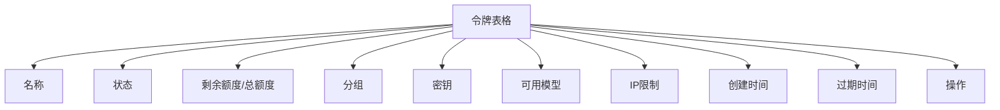
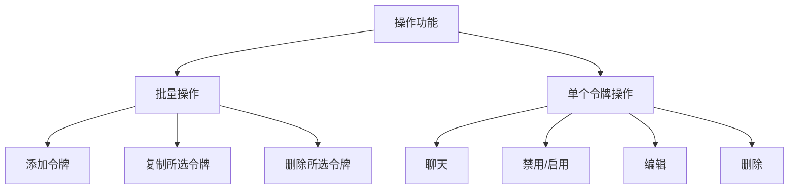
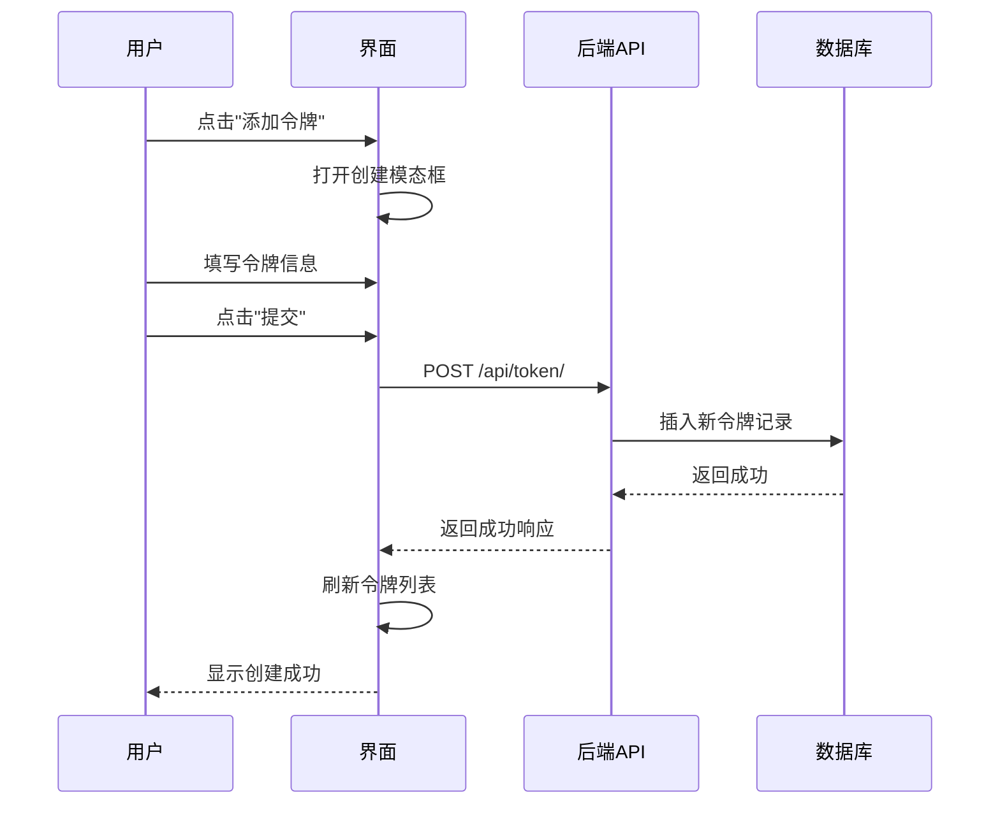
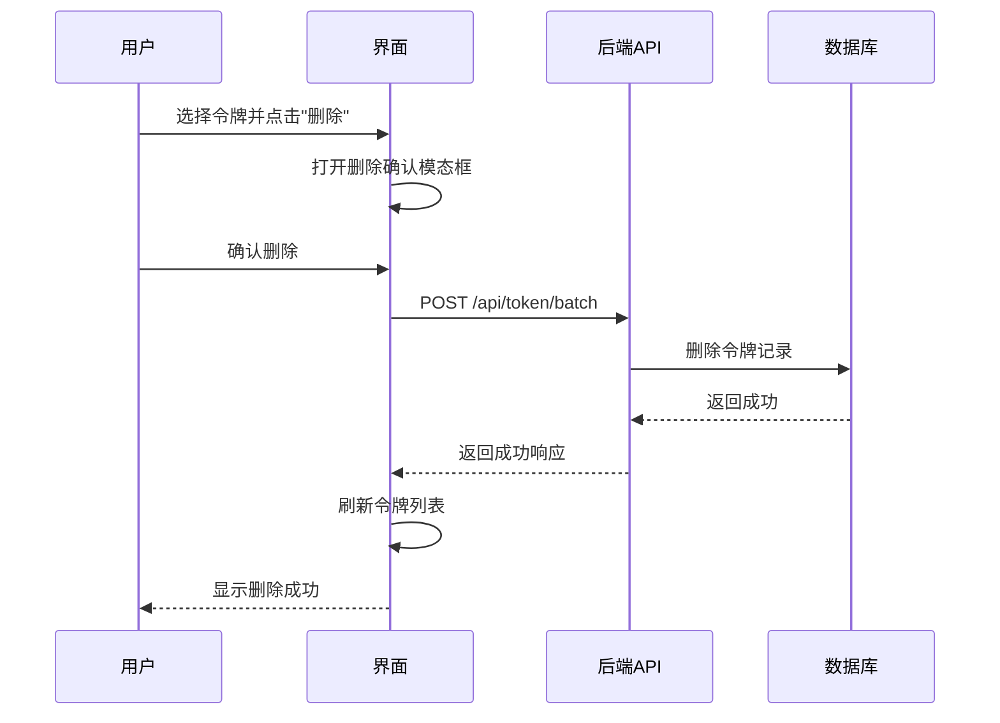
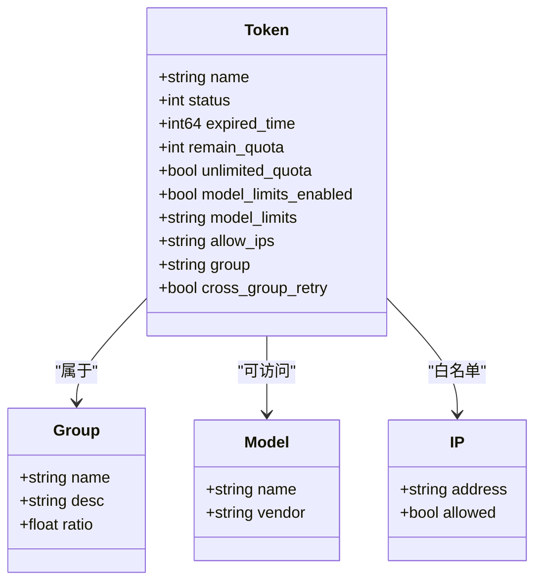
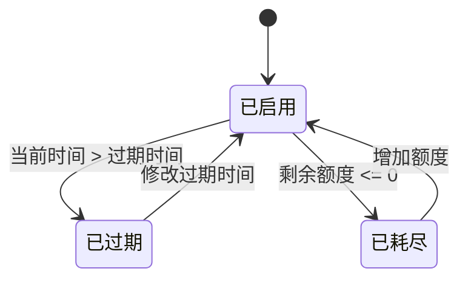
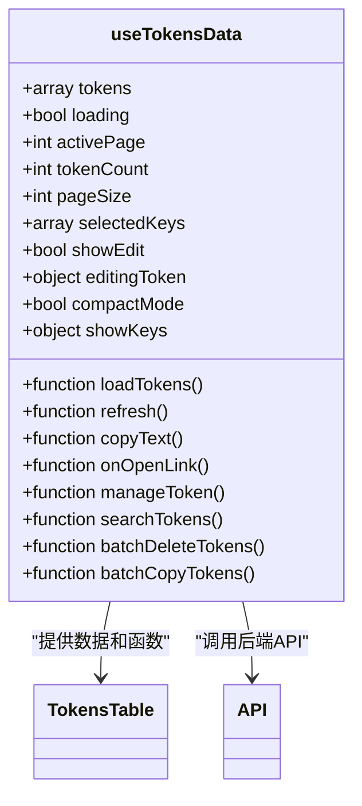
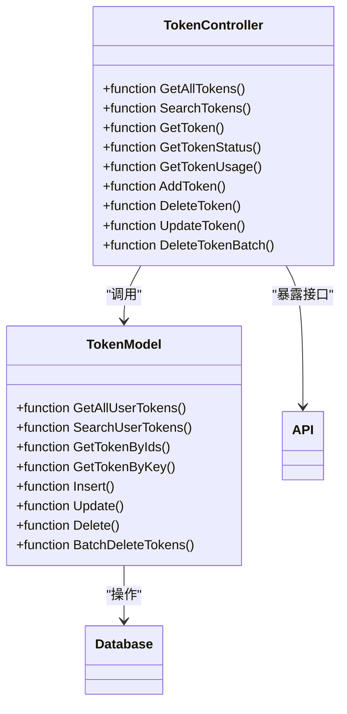
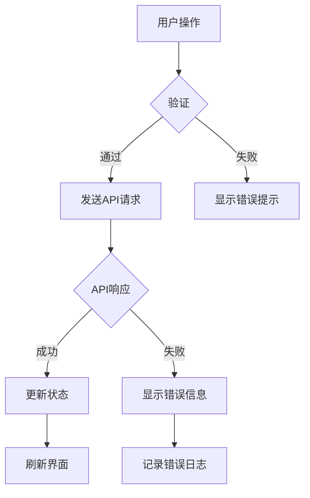

# 令牌管理界面

<cite>
**本文档引用的文件**
- [TokensTable.jsx](file://web/src/components/table/tokens/TokensTable.jsx)
- [TokensColumnDefs.jsx](file://web/src/components/table/tokens/TokensColumnDefs.jsx)
- [useTokensData.jsx](file://web/src/hooks/tokens/useTokensData.jsx)
- [token.go](file://controller/token.go)
- [token.go](file://model/token.go)
- [EditTokenModal.jsx](file://web/src/components/table/tokens/modals/EditTokenModal.jsx)
- [CopyTokensModal.jsx](file://web/src/components/table/tokens/modals/CopyTokensModal.jsx)
- [DeleteTokensModal.jsx](file://web/src/components/table/tokens/modals/DeleteTokensModal.jsx)
- [api.js](file://web/src/helpers/api.js)
- [token.js](file://web/src/helpers/token.js)
</cite>

## 目录
1. [简介](#简介)
2. [令牌表格展示结构](#令牌表格展示结构)
3. [操作功能详解](#操作功能详解)
4. [创建与编辑令牌流程](#创建与编辑令牌流程)
5. [复制与删除令牌流程](#复制与删除令牌流程)
6. [令牌权限配置](#令牌权限配置)
7. [有效期设置](#有效期设置)
8. [用户安全使用指南](#用户安全使用指南)
9. [开发者实现细节](#开发者实现细节)
10. [前端验证与错误处理](#前端验证与错误处理)

## 简介
令牌管理界面是AI API平台的核心功能之一，为用户提供了一个直观、安全的界面来管理API访问令牌。该界面允许用户创建、编辑、复制和删除令牌，并配置令牌的权限、额度和有效期。通过令牌，用户可以安全地访问API服务，同时平台能够对每个令牌的使用情况进行精确的监控和控制。

**Section sources**
- [TokensTable.jsx](file://web/src/components/table/tokens/TokensTable.jsx)
- [useTokensData.jsx](file://web/src/hooks/tokens/useTokensData.jsx)

## 令牌表格展示结构
令牌管理界面的核心是一个功能丰富的表格，用于展示用户的所有令牌。表格采用响应式设计，支持分页、排序和紧凑模式，确保在不同设备上都能提供良好的用户体验。

表格包含以下列：
- **名称**：令牌的自定义名称，便于用户识别和管理。
- **状态**：显示令牌的当前状态，包括已启用、已禁用、已过期和已耗尽。
- **剩余额度/总额度**：以进度条形式直观展示令牌的额度使用情况，并提供详细的额度信息。
- **分组**：显示令牌所属的分组，支持智能熔断和跨分组重试。
- **密钥**：显示令牌的密钥，支持显示/隐藏和一键复制功能。
- **可用模型**：以图标形式展示令牌可访问的模型，便于快速识别。
- **IP限制**：显示令牌的IP白名单设置，支持多IP显示。
- **创建时间**：显示令牌的创建时间。
- **过期时间**：显示令牌的过期时间，支持永不过期设置。
- **操作**：提供聊天、禁用/启用、编辑和删除等操作按钮。

**Diagram sources**
- [TokensColumnDefs.jsx](file://web/src/components/table/tokens/TokensColumnDefs.jsx)
- [TokensTable.jsx](file://web/src/components/table/tokens/TokensTable.jsx)

## 操作功能详解
令牌管理界面提供了丰富的操作功能，包括批量操作和单个令牌操作。

### 批量操作
在表格上方，提供了三个主要的批量操作按钮：
- **添加令牌**：打开创建新令牌的模态框。
- **复制所选令牌**：打开复制模态框，允许用户选择复制方式。
- **删除所选令牌**：打开删除确认模态框，确认后批量删除所选令牌。

### 单个令牌操作
在每行令牌的"操作"列中，提供了以下操作：
- **聊天**：直接使用该令牌在聊天界面进行对话。
- **禁用/启用**：切换令牌的启用状态。
- **编辑**：打开编辑模态框，修改令牌的配置。
- **删除**：删除该令牌，需要二次确认。

**Diagram sources**
- [TokensActions.jsx](file://web/src/components/table/tokens/TokensActions.jsx)
- [TokensColumnDefs.jsx](file://web/src/components/table/tokens/TokensColumnDefs.jsx)

## 创建与编辑令牌流程
创建和编辑令牌通过同一个侧边栏模态框完成，界面设计简洁直观。

### 创建流程
1. 点击"添加令牌"按钮。
2. 在模态框中填写令牌信息：
   - **名称**：输入令牌名称。
   - **令牌分组**：选择令牌所属分组。
   - **过期时间**：选择过期时间或设置为永不过期。
   - **额度**：输入令牌额度，或选择无限额度。
   - **模型限制列表**：选择令牌可访问的模型。
   - **IP白名单**：输入允许访问的IP地址。
3. 设置"新建数量"以批量创建多个令牌。
4. 点击"提交"按钮完成创建。

### 编辑流程
1. 点击令牌操作列中的"编辑"按钮。
2. 在模态框中修改令牌信息。
3. 点击"提交"按钮保存更改。

**Diagram sources**
- [EditTokenModal.jsx](file://web/src/components/table/tokens/modals/EditTokenModal.jsx)
- [token.go](file://controller/token.go#L138-L185)
- [token.go](file://model/token.go#L170-L173)

## 复制与删除令牌流程
### 复制流程
1. 选择一个或多个令牌。
2. 点击"复制所选令牌"按钮。
3. 在弹出的模态框中选择复制方式：
   - **名称+密钥**：复制令牌名称和密钥。
   - **仅密钥**：仅复制令牌密钥。
4. 系统自动复制到剪贴板并显示成功提示。

### 删除流程
1. 选择一个或多个令牌。
2. 点击"删除所选令牌"按钮。
3. 在弹出的确认模态框中确认删除操作。
4. 系统发送删除请求，成功后刷新令牌列表。

**Diagram sources**
- [CopyTokensModal.jsx](file://web/src/components/table/tokens/modals/CopyTokensModal.jsx)
- [DeleteTokensModal.jsx](file://web/src/components/table/tokens/modals/DeleteTokensModal.jsx)
- [token.go](file://controller/token.go#L271-L290)
- [token.go](file://model/token.go#L334-L364)

## 令牌权限配置
令牌权限配置是确保API安全访问的关键。系统提供了多层次的权限控制机制。

### 分组权限
- **分组**：令牌可以分配到特定的分组，继承分组的配额和模型访问权限。
- **智能熔断**：当设置为"auto"分组时，系统会自动选择最优分组，当一个分组不可用时自动降级到下一个分组。
- **跨分组重试**：仅在"auto"分组下有效，开启后当前分组渠道失败时会按顺序尝试下一个分组的渠道。

### 模型限制
- **模型限制列表**：可以指定令牌可访问的特定模型，留空则支持所有模型。
- **模型限制启用**：只有当此选项启用时，模型限制列表才生效。

### IP白名单
- **IP白名单**：可以设置允许访问的IP地址，一行一个，不填写则不限制。
- **安全性提示**：请勿过度信任此功能，IP可能被伪造。

**Diagram sources**
- [EditTokenModal.jsx](file://web/src/components/table/tokens/modals/EditTokenModal.jsx)
- [token.go](file://model/token.go#L14-L32)

## 有效期设置
令牌的有效期设置提供了灵活的时间控制选项。

### 过期时间
- **永不过期**：设置为-1，令牌将永久有效。
- **具体时间**：可以设置具体的过期日期和时间。
- **快捷设置**：提供"一个月"、"一天"、"一小时"等快捷按钮。

### 状态管理
系统根据当前时间和过期时间自动管理令牌状态：
- **已启用**：当前时间在创建时间和过期时间之间，且额度未耗尽。
- **已过期**：当前时间超过过期时间。
- **已耗尽**：额度已用尽。

**Diagram sources**
- [EditTokenModal.jsx](file://web/src/components/table/tokens/modals/EditTokenModal.jsx)
- [token.go](file://model/token.go#L75-L113)

## 用户安全使用指南
为了确保令牌的安全使用，请遵循以下最佳实践：

### 安全创建
- **使用描述性名称**：为令牌使用清晰、描述性的名称，便于识别和管理。
- **设置合理有效期**：避免创建永不过期的令牌，除非有特殊需求。
- **限制模型访问**：根据实际需求限制令牌可访问的模型，遵循最小权限原则。

### 安全存储
- **不要硬编码**：不要将令牌硬编码在代码中，应使用环境变量或安全的配置管理工具。
- **限制访问**：确保只有授权人员可以访问包含令牌的配置文件。

### 安全使用
- **定期轮换**：定期创建新令牌并废弃旧令牌，减少泄露风险。
- **监控使用**：定期检查令牌的使用情况，及时发现异常行为。
- **及时禁用**：当不再需要某个令牌时，及时禁用或删除。

### 应急响应
- **立即禁用**：一旦怀疑令牌泄露，立即禁用该令牌。
- **创建新令牌**：禁用泄露的令牌后，立即创建新的令牌替换。
- **审查日志**：检查该令牌的使用日志，评估潜在影响。

## 开发者实现细节
### 前端实现
前端使用React框架，通过自定义Hook `useTokensData` 管理令牌数据的状态和逻辑。该Hook封装了与后端API的交互，包括加载、搜索、刷新、复制和删除令牌等功能。

**Diagram sources**
- [useTokensData.jsx](file://web/src/hooks/tokens/useTokensData.jsx)
- [TokensTable.jsx](file://web/src/components/table/tokens/TokensTable.jsx)

### 后端实现
后端使用Gin框架，通过 `controller/token.go` 文件处理令牌相关的API请求。核心功能包括：
- **创建令牌**：`AddToken` 函数生成随机密钥并插入数据库。
- **获取令牌**：`GetAllTokens` 函数分页获取用户的所有令牌。
- **更新令牌**：`UpdateToken` 函数更新令牌的配置。
- **删除令牌**：`DeleteToken` 和 `DeleteTokenBatch` 函数处理单个和批量删除。

**Diagram sources**
- [token.go](file://controller/token.go)
- [token.go](file://model/token.go)

## 前端验证与错误处理
系统实现了全面的前端验证和错误处理机制，确保用户体验和数据完整性。

### 表单验证
- **名称长度**：限制令牌名称不超过50个字符。
- **额度输入**：确保额度为有效数字。
- **过期时间**：验证过期时间格式和逻辑（不能早于当前时间）。

### 错误处理
- **API错误**：通过全局拦截器捕获API错误，并显示友好的错误提示。
- **复制失败**：当剪贴板复制失败时，显示包含内容的模态框供用户手动复制。
- **状态同步**：操作成功后自动刷新数据，确保界面状态与后端一致。

**Diagram sources**
- [EditTokenModal.jsx](file://web/src/components/table/tokens/modals/EditTokenModal.jsx)
- [api.js](file://web/src/helpers/api.js#L83-L92)
- [token.go](file://controller/token.go#L145-L150)