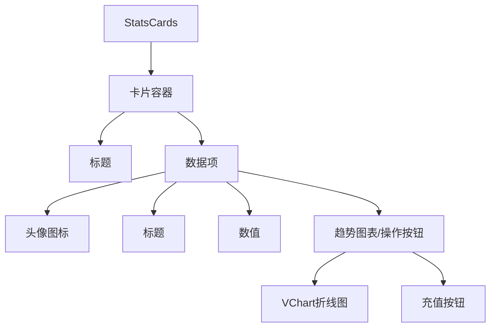
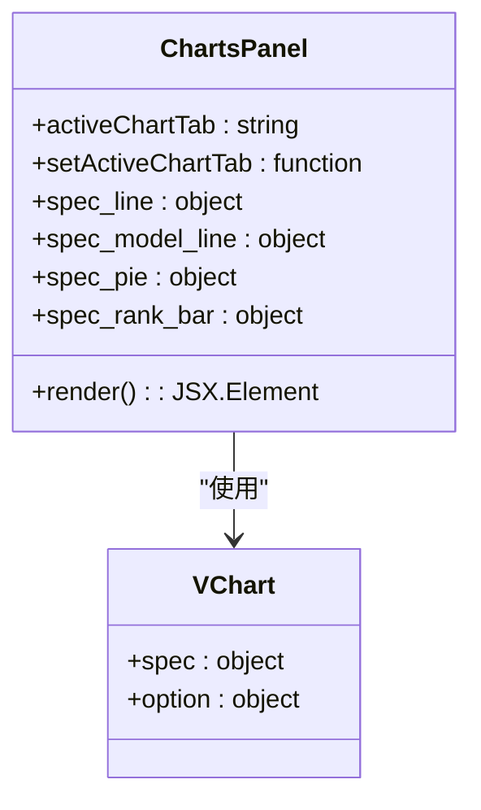
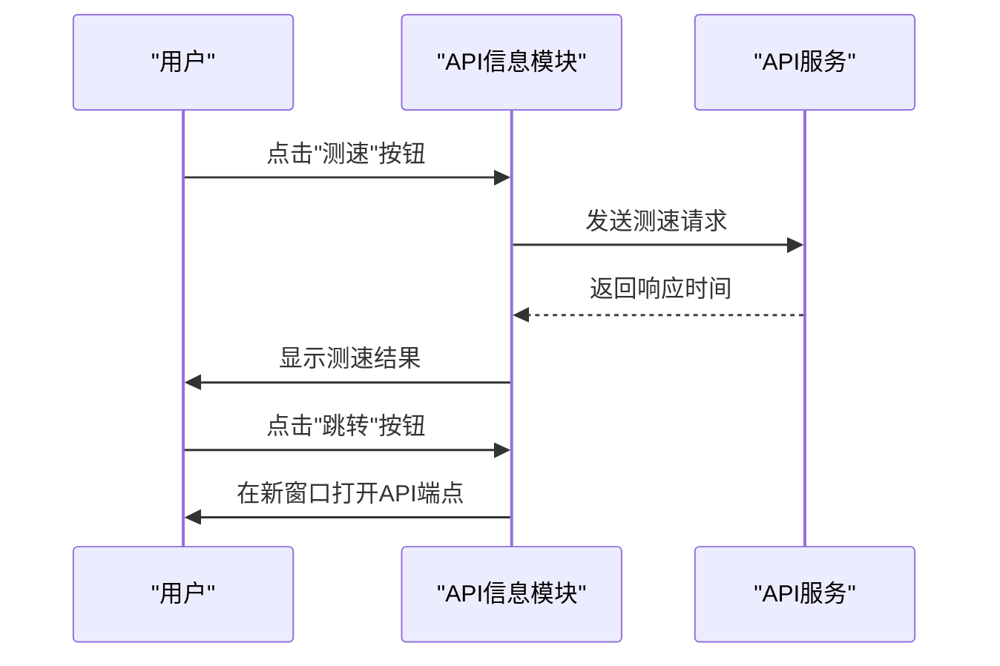
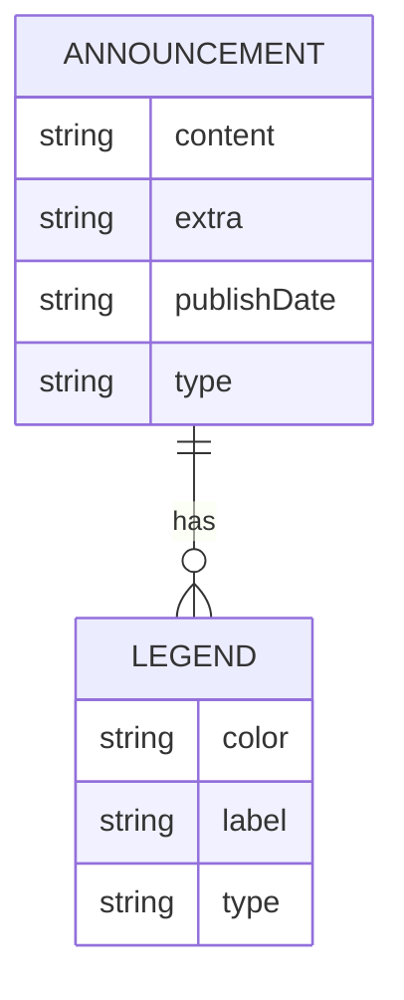
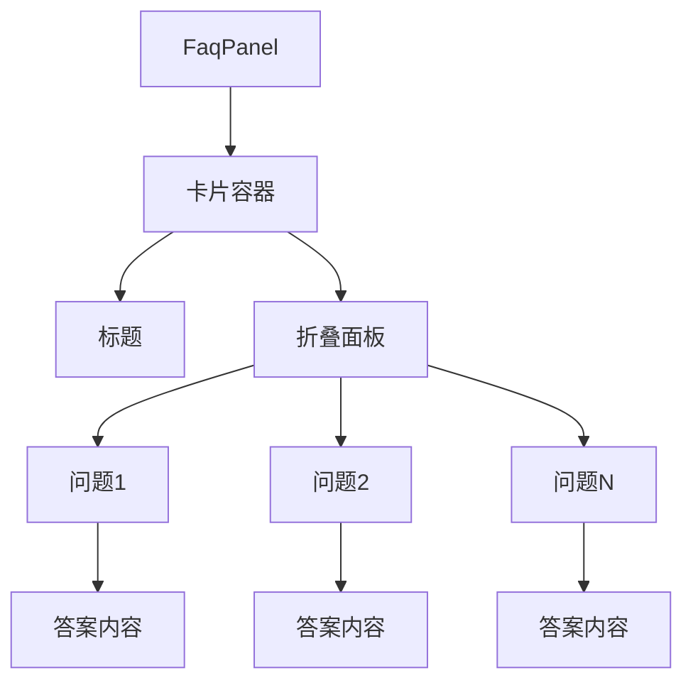
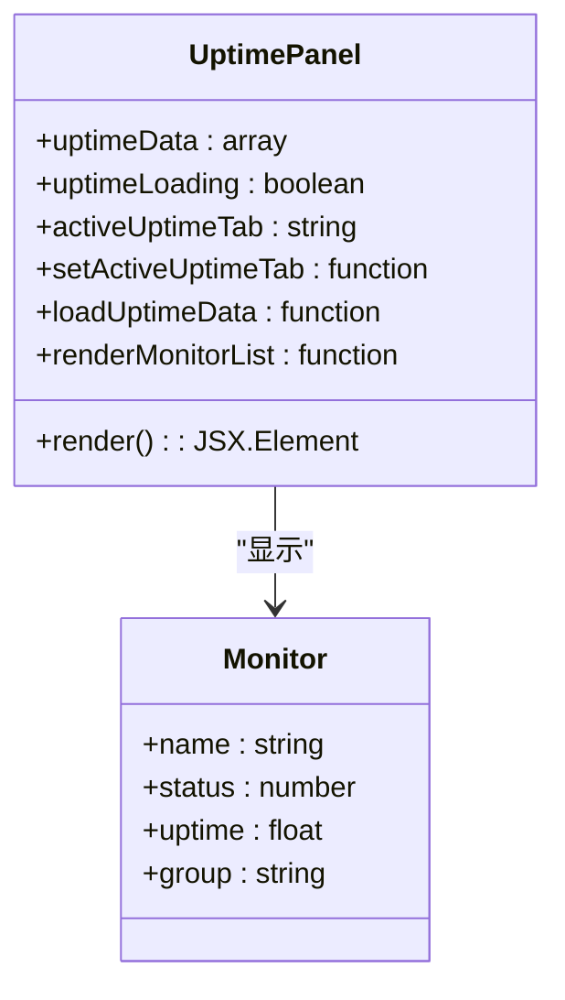
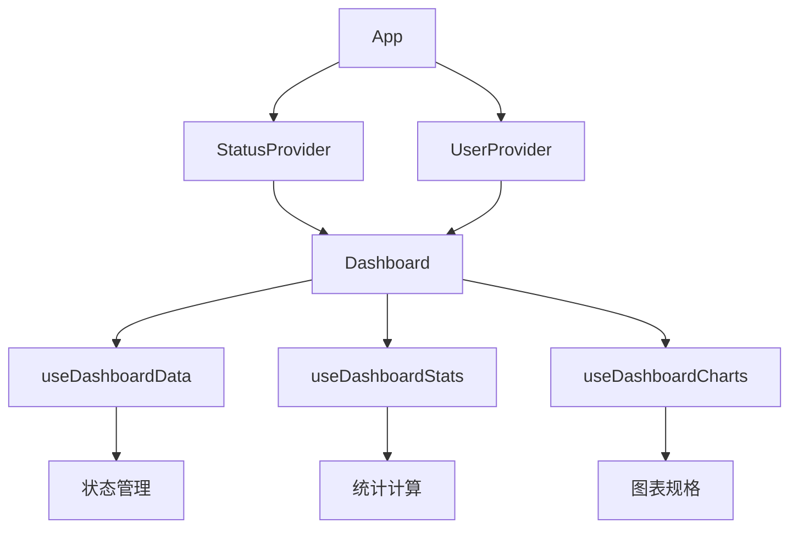
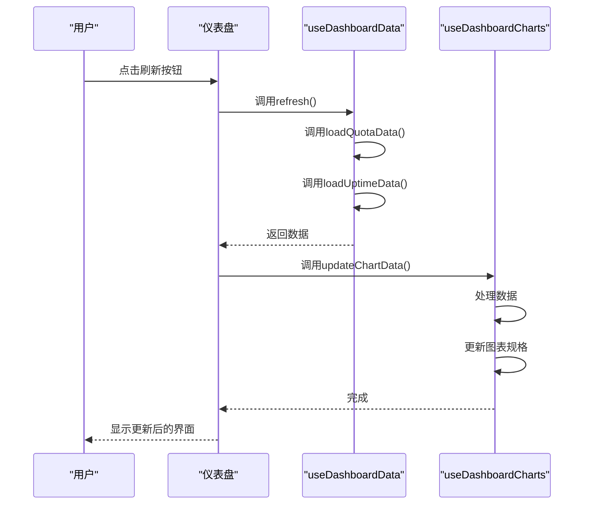

# 仪表盘界面

<cite>
**本文档引用的文件**   
- [index.jsx](file://web/src/components/dashboard/index.jsx)
- [DashboardHeader.jsx](file://web/src/components/dashboard/DashboardHeader.jsx)
- [StatsCards.jsx](file://web/src/components/dashboard/StatsCards.jsx)
- [ChartsPanel.jsx](file://web/src/components/dashboard/ChartsPanel.jsx)
- [ApiInfoPanel.jsx](file://web/src/components/dashboard/ApiInfoPanel.jsx)
- [AnnouncementsPanel.jsx](file://web/src/components/dashboard/AnnouncementsPanel.jsx)
- [FaqPanel.jsx](file://web/src/components/dashboard/FaqPanel.jsx)
- [UptimePanel.jsx](file://web/src/components/dashboard/UptimePanel.jsx)
- [dashboard.constants.js](file://web/src/constants/dashboard.constants.js)
- [dashboard.jsx](file://web/src/helpers/dashboard.jsx)
- [useDashboardData.js](file://web/src/hooks/dashboard/useDashboardData.js)
- [useDashboardStats.jsx](file://web/src/hooks/dashboard/useDashboardStats.jsx)
- [useDashboardCharts.jsx](file://web/src/hooks/dashboard/useDashboardCharts.jsx)
- [index.jsx](file://web/src/context/Status/index.jsx)
- [reducer.js](file://web/src/context/Status/reducer.js)
- [index.jsx](file://web/src/pages/Dashboard/index.jsx)
- [dashboard.go](file://router/dashboard.go)
- [uptime_kuma.go](file://controller/uptime_kuma.go)
</cite>

## 目录
1. [简介](#简介)
2. [整体布局](#整体布局)
3. [核心组件](#核心组件)
4. [数据可视化](#数据可视化)
5. [API信息模块](#api信息模块)
6. [公告与FAQ](#公告与faq)
7. [状态管理与数据更新](#状态管理与数据更新)
8. [用户操作指南](#用户操作指南)
9. [开发者集成](#开发者集成)

## 简介

仪表盘界面是系统的核心数据展示中心，为用户提供全面的使用统计、系统状态和关键信息。该界面采用现代化的React组件架构，结合VChart可视化库，实现了响应式的数据展示和交互体验。仪表盘通过多个功能模块的组合，为用户提供了账户数据、使用统计、资源消耗和性能指标的全面视图。

**Section sources**
- [index.jsx](file://web/src/components/dashboard/index.jsx)
- [index.jsx](file://web/src/pages/Dashboard/index.jsx)

## 整体布局

仪表盘采用响应式网格布局，根据屏幕尺寸自动调整组件排列。整体布局分为四个主要区域：顶部标题栏、统计卡片区、图表面板区和信息面板区。在桌面端，布局充分利用了水平空间，将图表面板与API信息模块并排显示；在移动端，则采用垂直堆叠布局，确保内容的可读性和操作的便捷性。

布局的核心是`index.jsx`文件中的组件结构，它通过CSS Grid系统实现了灵活的布局控制。当API信息模块启用时，图表面板占据3/4的宽度，API信息模块占据1/4的宽度；当API信息模块禁用时，图表面板则占据全部宽度。信息面板区（包括公告、FAQ和服务可用性）同样采用网格布局，在桌面端可以并排显示多个面板，在移动端则垂直堆叠。

**Section sources**
- [index.jsx](file://web/src/components/dashboard/index.jsx)
- [dashboard.constants.js](file://web/src/constants/dashboard.constants.js)

## 核心组件

仪表盘由多个可复用的React组件构成，每个组件负责特定的功能区域。这些组件通过props传递数据和配置，实现了高度的模块化和可配置性。主要核心组件包括：

- **DashboardHeader**: 顶部标题栏组件，显示个性化问候语和操作按钮
- **StatsCards**: 统计卡片组件，展示关键指标和趋势图表
- **ChartsPanel**: 图表面板组件，提供多种数据可视化图表
- **ApiInfoPanel**: API信息模块，展示API端点信息
- **AnnouncementsPanel**: 公告面板，显示系统公告和通知
- **FaqPanel**: 常见问答面板，提供帮助信息
- **UptimePanel**: 服务可用性面板，监控系统状态

这些组件通过组合和嵌套，构建了完整的仪表盘界面，每个组件都遵循单一职责原则，确保了代码的可维护性和可测试性。

**Section sources**
- [index.jsx](file://web/src/components/dashboard/index.jsx)
- [DashboardHeader.jsx](file://web/src/components/dashboard/DashboardHeader.jsx)
- [StatsCards.jsx](file://web/src/components/dashboard/StatsCards.jsx)
- [ChartsPanel.jsx](file://web/src/components/dashboard/ChartsPanel.jsx)
- [ApiInfoPanel.jsx](file://web/src/components/dashboard/ApiInfoPanel.jsx)
- [AnnouncementsPanel.jsx](file://web/src/components/dashboard/AnnouncementsPanel.jsx)
- [FaqPanel.jsx](file://web/src/components/dashboard/FaqPanel.jsx)
- [UptimePanel.jsx](file://web/src/components/dashboard/UptimePanel.jsx)

## 数据可视化

### 统计卡片

统计卡片组件（StatsCards）是仪表盘的核心数据展示区域，采用卡片式布局展示关键指标。每个卡片包含一个标题和多个数据项，每个数据项由图标、标题、数值和趋势图表组成。卡片支持点击交互，部分卡片还包含操作按钮（如"充值"按钮）。

数据项的视觉设计遵循统一的模式：左侧为彩色头像图标，中间为标题和数值，右侧为趋势图表或操作按钮。数值显示采用骨架屏加载效果，在数据加载完成前显示占位符，提升用户体验。趋势图表采用微型折线图，使用VChart库渲染，能够直观地展示数据的变化趋势。



**Diagram sources**
- [StatsCards.jsx](file://web/src/components/dashboard/StatsCards.jsx)
- [dashboard.constants.js](file://web/src/constants/dashboard.constants.js)

### 图表面板

图表面板（ChartsPanel）提供多种数据可视化图表，支持通过标签页切换不同的图表类型。当前支持四种图表：消耗分布（堆叠条形图）、消耗趋势（折线图）、调用次数分布（饼图）和调用次数排行（柱状图）。用户可以通过点击标签页在不同图表之间切换。

图表使用VChart库渲染，支持响应式设计和交互功能。每种图表都有详细的工具提示，当用户将鼠标悬停在图表元素上时，会显示详细的数据信息。图表的标题包含主标题和副标题，副标题显示当前数据的总计值，帮助用户快速理解数据规模。



**Diagram sources**
- [ChartsPanel.jsx](file://web/src/components/dashboard/ChartsPanel.jsx)
- [useDashboardCharts.jsx](file://web/src/hooks/dashboard/useDashboardCharts.jsx)

## API信息模块

API信息模块（ApiInfoPanel）展示系统中可用的API端点信息。每个API条目包含路由、URL、描述和操作按钮。用户可以通过点击"测速"按钮测试API响应速度，或通过"跳转"按钮在新窗口中打开API端点。

模块采用滚动容器设计，当API条目较多时，用户可以垂直滚动查看所有条目。每个条目使用Avatar组件显示路由的前两个字符作为标识，帮助用户快速识别不同的API。操作按钮采用标签（Tag）样式，具有悬停效果，提升交互体验。

当系统中没有配置API信息时，模块会显示空状态提示，引导管理员在系统设置中配置API信息。



**Diagram sources**
- [ApiInfoPanel.jsx](file://web/src/components/dashboard/ApiInfoPanel.jsx)
- [dashboard.jsx](file://web/src/helpers/dashboard.jsx)

## 公告与FAQ

### 公告面板

公告面板（AnnouncementsPanel）显示系统发布的公告信息，采用时间线（Timeline）布局，按发布时间倒序排列。每条公告包含发布日期（相对时间和绝对时间）、内容和额外信息。面板顶部显示图例，说明不同颜色标签的含义，包括默认、进行中、成功、警告和异常状态。

公告数据从系统状态上下文获取，支持Markdown格式的内容渲染。当没有公告时，面板显示空状态提示，引导管理员配置公告信息。面板采用滚动容器设计，限制最大高度，确保不会占用过多屏幕空间。



**Diagram sources**
- [AnnouncementsPanel.jsx](file://web/src/components/dashboard/AnnouncementsPanel.jsx)
- [dashboard.constants.js](file://web/src/constants/dashboard.constants.js)

### 常见问答

常见问答面板（FaqPanel）以手风琴（Accordion）形式展示常见问题和答案。每个问题可以展开或折叠，节省屏幕空间。问答内容支持Markdown格式渲染，允许使用富文本格式。面板同样采用滚动容器设计，当问答条目较多时，用户可以滚动查看。

当系统中没有配置常见问答时，面板显示空状态提示。该设计确保了界面的一致性，无论是否有数据，用户都能获得清晰的反馈。



**Diagram sources**
- [FaqPanel.jsx](file://web/src/components/dashboard/FaqPanel.jsx)

### 服务可用性

服务可用性面板（UptimePanel）监控系统的运行状态，显示各个服务的可用性信息。面板根据监控数据的分组情况，动态显示单个监控列表或标签页式监控列表。每个监控项显示服务名称、状态指示器、可用率百分比和状态文本。

状态指示器使用不同颜色表示不同状态：绿色表示正常，红色表示异常，橙色表示高延迟，蓝色表示维护中。面板底部显示状态图例，帮助用户理解颜色编码。面板包含刷新按钮，用户可以手动刷新监控数据。



**Diagram sources**
- [UptimePanel.jsx](file://web/src/components/dashboard/UptimePanel.jsx)
- [uptime_kuma.go](file://controller/uptime_kuma.go)

## 状态管理与数据更新

### 状态管理架构

仪表盘采用React Context和自定义Hook相结合的状态管理架构。主要状态包括用户状态（UserContext）和系统状态（StatusContext），通过Context Provider在组件树中传递。业务逻辑状态则通过自定义Hook（如useDashboardData、useDashboardStats、useDashboardCharts）进行管理，实现了状态逻辑与UI组件的分离。

状态管理的关键是`useDashboardData` Hook，它负责管理所有与仪表盘相关的状态，包括加载状态、输入值、数据状态和图表状态。该Hook通过useCallback优化函数引用，避免不必要的重新渲染，通过useMemo优化计算值，提升性能。



**Diagram sources**
- [index.jsx](file://web/src/context/Status/index.jsx)
- [reducer.js](file://web/src/context/Status/reducer.js)
- [useDashboardData.js](file://web/src/hooks/dashboard/useDashboardData.js)

### 数据更新机制

数据更新机制通过多个层次的函数调用实现。初始化时，`initChart`函数调用`loadQuotaData`和`loadUptimeData`加载初始数据。用户可以通过点击刷新按钮或搜索按钮触发数据更新。

`refresh`函数是核心的数据更新函数，它并行调用`loadQuotaData`和`loadUptimeData`，确保所有数据同步更新。当搜索条件改变时，`handleSearchConfirm`函数调用`refresh`函数，并将新的数据传递给`updateChartData`函数，实现图表数据的更新。

数据更新流程遵循"获取数据 -> 处理数据 -> 更新状态 -> 重新渲染"的模式，确保了数据的一致性和界面的响应性。



**Diagram sources**
- [index.jsx](file://web/src/components/dashboard/index.jsx)
- [useDashboardData.js](file://web/src/hooks/dashboard/useDashboardData.js)
- [useDashboardCharts.jsx](file://web/src/hooks/dashboard/useDashboardCharts.jsx)

## 用户操作指南

### 解读使用统计数据

仪表盘的统计卡片分为四个类别：账户数据、使用统计、资源消耗和性能指标。用户可以通过这些卡片快速了解自己的账户状况和使用情况。

- **账户数据**: 显示当前余额和历史消耗，帮助用户了解账户资金情况
- **使用统计**: 显示请求次数和统计次数，反映API调用频率
- **资源消耗**: 显示统计额度和统计Tokens，量化资源使用情况
- **性能指标**: 显示平均RPM（每分钟请求数）和平均TPM（每分钟Tokens数），评估系统性能

趋势图表提供了数据变化的直观视图，用户可以通过图表的上升或下降趋势判断使用模式的变化。

### 查看系统状态

系统状态信息分布在多个面板中：
- **API信息**: 查看可用的API端点，测试响应速度
- **公告**: 了解系统更新、维护计划和重要通知
- **FAQ**: 查找常见问题的解决方案
- **服务可用性**: 监控系统各服务的运行状态

用户应定期检查这些面板，特别是公告和服务可用性面板，以及时了解系统状态和潜在问题。

### 响应公告信息

当系统发布重要公告时，用户应：
1. 仔细阅读公告内容，了解变更的性质和影响范围
2. 注意公告的类型（进行中、成功、警告、异常），评估紧急程度
3. 遵循公告中的建议或操作指南
4. 如有疑问，参考FAQ或联系技术支持

对于警告和异常类型的公告，用户应立即采取相应措施，如暂停非关键操作、检查本地配置等。

**Section sources**
- [index.jsx](file://web/src/components/dashboard/index.jsx)
- [AnnouncementsPanel.jsx](file://web/src/components/dashboard/AnnouncementsPanel.jsx)
- [FaqPanel.jsx](file://web/src/components/dashboard/FaqPanel.jsx)

## 开发者集成

### 组件集成方式

开发者可以通过以下方式集成仪表盘组件：
1. **直接导入**: 将组件文件直接导入到项目中
2. **Props配置**: 通过props传递数据和配置选项
3. **状态管理**: 使用提供的Context或自定义Hook管理状态

例如，集成统计卡片组件：
```jsx
import StatsCards from './components/dashboard/StatsCards';

<StatsCards 
  groupedStatsData={statsData}
  loading={isLoading}
  getTrendSpec={getTrendSpec}
  CARD_PROPS={CARD_PROPS}
  CHART_CONFIG={CHART_CONFIG}
/>
```

### 数据更新机制

开发者可以利用现有的数据更新机制，或根据需要扩展。核心更新函数包括：
- `refresh()`: 重新加载所有数据
- `handleSearchConfirm()`: 根据搜索条件更新数据
- `updateChartData()`: 更新图表数据

开发者可以监听数据变化，或在特定事件触发时调用这些函数。

### 自定义配置选项

系统提供了多种自定义配置选项：
- **时间间隔**: 通过`dataExportDefaultTime`配置数据统计的时间间隔
- **图表样式**: 通过`CHART_CONFIG`和`CARD_PROPS`配置图表和卡片的样式
- **功能开关**: 通过系统设置控制各个面板的启用状态

这些配置选项大多存储在本地存储或系统状态中，支持动态调整。

### 状态管理实现

状态管理的实现基于React Hooks和Context API。关键实现要点包括：
- 使用`useReducer`管理复杂状态
- 使用`useMemo`优化计算密集型操作
- 使用`useCallback`避免函数重新创建
- 使用`useEffect`处理副作用

开发者可以参考`useDashboardData` Hook的实现，创建自己的状态管理逻辑。

**Section sources**
- [useDashboardData.js](file://web/src/hooks/dashboard/useDashboardData.js)
- [useDashboardStats.jsx](file://web/src/hooks/dashboard/useDashboardStats.jsx)
- [useDashboardCharts.jsx](file://web/src/hooks/dashboard/useDashboardCharts.jsx)
- [dashboard.constants.js](file://web/src/constants/dashboard.constants.js)