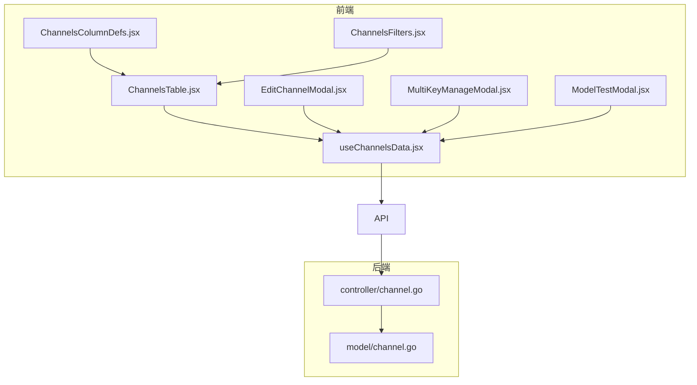
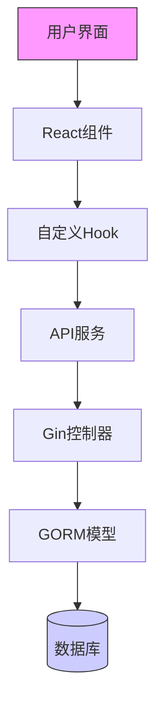
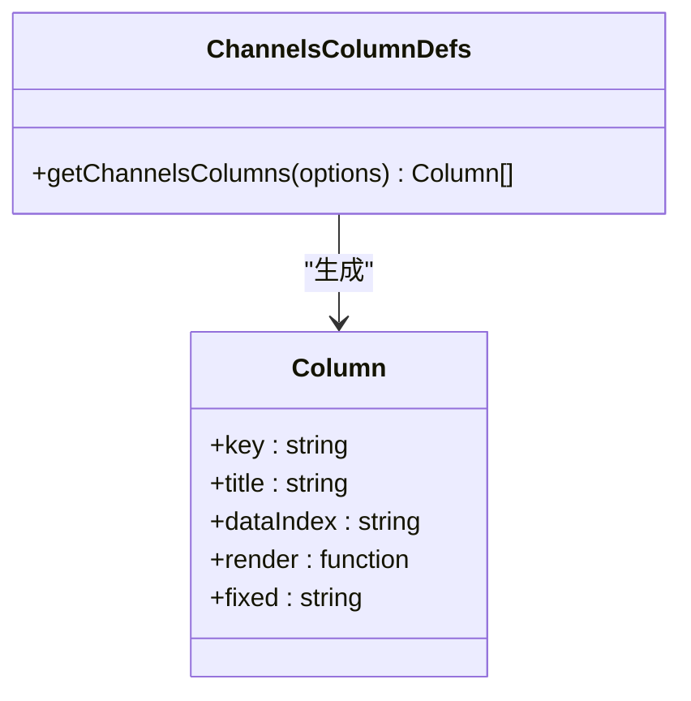
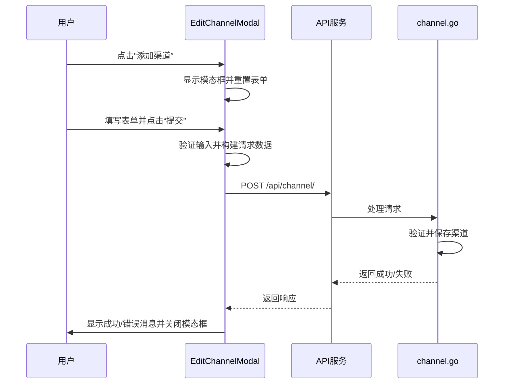
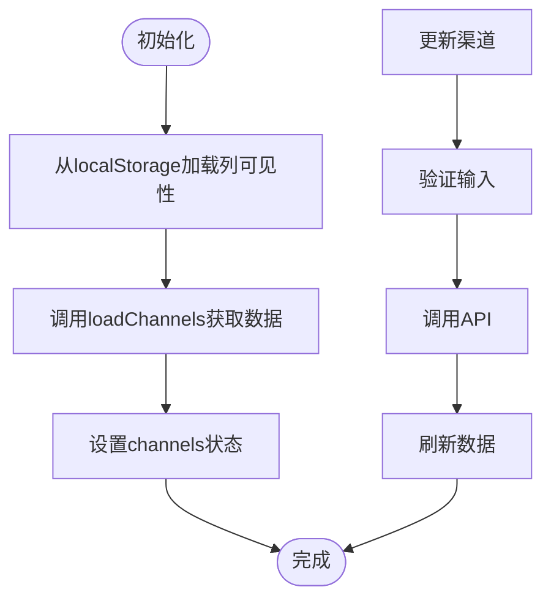
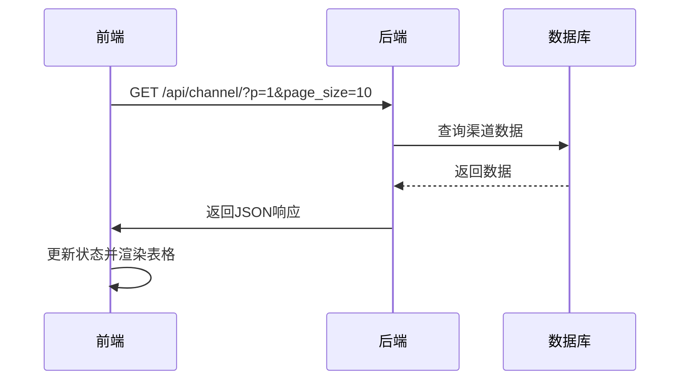
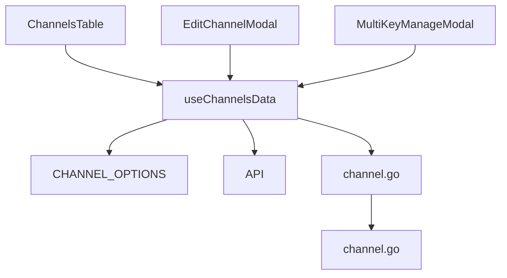

# 渠道管理界面

<cite>
**本文档引用的文件**   
- [index.jsx](file://web/src/pages/Channel/index.jsx)
- [ChannelsTable.jsx](file://web/src/components/table/channels/ChannelsTable.jsx)
- [ChannelsColumnDefs.jsx](file://web/src/components/table/channels/ChannelsColumnDefs.jsx)
- [ChannelsFilters.jsx](file://web/src/components/table/channels/ChannelsFilters.jsx)
- [useChannelsData.jsx](file://web/src/hooks/channels/useChannelsData.jsx)
- [channel.constants.js](file://web/src/constants/channel.constants.js)
- [channel.go](file://controller/channel.go)
- [channel.go](file://model/channel.go)
- [EditChannelModal.jsx](file://web/src/components/table/channels/modals/EditChannelModal.jsx)
- [MultiKeyManageModal.jsx](file://web/src/components/table/channels/modals/MultiKeyManageModal.jsx)
- [ModelTestModal.jsx](file://web/src/components/table/channels/modals/ModelTestModal.jsx)
- [api.js](file://web/src/helpers/api.js)
</cite>

## 目录
1. [简介](#简介)
2. [项目结构](#项目结构)
3. [核心组件](#核心组件)
4. [架构概述](#架构概述)
5. [详细组件分析](#详细组件分析)
6. [依赖分析](#依赖分析)
7. [性能考虑](#性能考虑)
8. [故障排除指南](#故障排除指南)
9. [结论](#结论)

## 简介
渠道管理界面是AI代理系统的核心功能模块，用于集中管理所有AI服务渠道。该界面提供了一个全面的控制面板，允许用户查看、创建、编辑和删除各种AI服务渠道，包括OpenAI、Claude、Gemini、Vertex AI等。系统支持复杂的渠道配置，如多密钥管理、模型测试、批量操作和高级路由策略。用户可以通过直观的表格视图监控渠道状态、响应时间和额度使用情况，并通过丰富的筛选和排序功能高效管理大量渠道。该界面还集成了安全验证机制，确保敏感操作（如查看密钥）的安全性。

## 项目结构
渠道管理界面的前端代码位于`web/src/components/table/channels/`目录下，采用模块化设计。核心组件包括`ChannelsTable.jsx`，它负责渲染渠道数据表格；`ChannelsColumnDefs.jsx`，定义了表格的列结构和渲染逻辑；以及`ChannelsFilters.jsx`，提供了搜索和筛选功能。业务逻辑由`useChannelsData.jsx`自定义Hook管理，它封装了与后端API的通信、状态管理和数据处理。模态框组件（如`EditChannelModal.jsx`）用于创建和编辑渠道，而`MultiKeyManageModal.jsx`则专门处理多密钥渠道的管理。后端控制器`controller/channel.go`和模型`model/channel.go`定义了API端点和数据结构，确保前后端的无缝集成。

**Diagram sources**
- [ChannelsTable.jsx](file://web/src/components/table/channels/ChannelsTable.jsx)
- [ChannelsColumnDefs.jsx](file://web/src/components/table/channels/ChannelsColumnDefs.jsx)
- [ChannelsFilters.jsx](file://web/src/components/table/channels/ChannelsFilters.jsx)
- [useChannelsData.jsx](file://web/src/hooks/channels/useChannelsData.jsx)
- [EditChannelModal.jsx](file://web/src/components/table/channels/modals/EditChannelModal.jsx)
- [MultiKeyManageModal.jsx](file://web/src/components/table/channels/modals/MultiKeyManageModal.jsx)
- [ModelTestModal.jsx](file://web/src/components/table/channels/modals/ModelTestModal.jsx)
- [channel.go](file://controller/channel.go)
- [channel.go](file://model/channel.go)

**Section sources**
- [ChannelsTable.jsx](file://web/src/components/table/channels/ChannelsTable.jsx)
- [ChannelsColumnDefs.jsx](file://web/src/components/table/channels/ChannelsColumnDefs.jsx)
- [ChannelsFilters.jsx](file://web/src/components/table/channels/ChannelsFilters.jsx)
- [useChannelsData.jsx](file://web/src/hooks/channels/useChannelsData.jsx)
- [channel.go](file://controller/channel.go)
- [channel.go](file://model/channel.go)

## 核心组件

渠道管理界面的核心是`ChannelsTable`组件，它使用`CardTable`作为基础表格，通过`getChannelsColumns`函数动态生成列定义。`useChannelsData` Hook是数据管理的中枢，它负责从后端获取渠道数据、处理搜索和分页、管理UI状态（如编辑模式和批量操作），并提供一系列操作函数（如`manageChannel`、`testChannel`）。`EditChannelModal`组件提供了一个功能丰富的表单，用于创建和编辑渠道，支持多密钥模式、模型映射和高级设置。`MultiKeyManageModal`则为多密钥渠道提供了专门的管理界面，允许用户单独启用/禁用每个密钥。

**Section sources**
- [ChannelsTable.jsx](file://web/src/components/table/channels/ChannelsTable.jsx)
- [useChannelsData.jsx](file://web/src/hooks/channels/useChannelsData.jsx)
- [EditChannelModal.jsx](file://web/src/components/table/channels/modals/EditChannelModal.jsx)
- [MultiKeyManageModal.jsx](file://web/src/components/table/channels/modals/MultiKeyManageModal.jsx)

## 架构概述

渠道管理界面采用前后端分离的架构。前端使用React框架，结合Semi Design UI组件库，构建了响应式和用户友好的界面。状态管理通过React Hooks（如`useState`、`useEffect`）和自定义Hook（`useChannelsData`）实现，确保了逻辑的复用和代码的清晰。数据通过Axios库与后端进行通信，API调用被封装在`api.js`中。后端使用Gin框架提供RESTful API，`channel.go`控制器处理HTTP请求，而`channel.go`模型则定义了数据结构和数据库操作。这种分层架构使得系统易于维护和扩展。

**Diagram sources**
- [ChannelsTable.jsx](file://web/src/components/table/channels/ChannelsTable.jsx)
- [useChannelsData.jsx](file://web/src/hooks/channels/useChannelsData.jsx)
- [api.js](file://web/src/helpers/api.js)
- [channel.go](file://controller/channel.go)
- [channel.go](file://model/channel.go)

## 详细组件分析

### 表格组件分析
渠道列表表格是用户与系统交互的主要界面。它通过`ChannelsTable`组件渲染，该组件接收来自`useChannelsData` Hook的数据和函数作为props。表格的列是动态生成的，`getChannelsColumns`函数根据传入的回调函数（如`updateChannelBalance`、`testChannel`）创建包含操作按钮的列。表格支持分页、行选择和列可见性控制，用户可以通过`visibleColumns`状态来定制显示的列。

#### 表格列定义

**Diagram sources**
- [ChannelsColumnDefs.jsx](file://web/src/components/table/channels/ChannelsColumnDefs.jsx)

### 模态框交互逻辑
创建和编辑渠道的操作通过`EditChannelModal`模态框完成。该组件使用`Form`组件来管理表单状态，并通过`formApiRef`引用与表单进行交互。当用户提交表单时，`submit`函数会收集所有输入值，进行验证，然后根据是创建还是编辑操作，向`/api/channel/`发送POST或PUT请求。对于多密钥渠道，表单会根据`multiToSingle`状态显示不同的输入方式（如文件上传或手动输入）。

#### 模态框交互流程

**Diagram sources**
- [EditChannelModal.jsx](file://web/src/components/table/channels/modals/EditChannelModal.jsx)
- [channel.go](file://controller/channel.go)

### 前端状态管理
`useChannelsData` Hook是前端状态管理的核心。它使用`useState`来管理各种状态，如`channels`（渠道数据）、`loading`（加载状态）、`activePage`（当前页码）和`selectedChannels`（选中的渠道）。`useMemo`被用来优化性能，例如`tableColumns`会根据`compactMode`和`visibleColumns`计算一次，避免不必要的重新渲染。`useEffect` Hook在组件挂载时初始化数据，从本地存储加载列可见性设置，并调用`loadChannels`函数获取初始数据。

#### 状态管理流程

**Diagram sources**
- [useChannelsData.jsx](file://web/src/hooks/channels/useChannelsData.jsx)

### 后端API通信
前端通过`API`实例与后端进行通信。`api.js`文件中定义了`axios`实例，并添加了拦截器来处理错误和重复请求。`useChannelsData`中的函数（如`refresh`、`manageChannel`）会调用这个实例。例如，`testChannel`函数会向`/api/channel/test/${record.id}`发送GET请求来测试一个渠道的连通性。后端的`channel.go`控制器会处理这些请求，调用相应的业务逻辑，并返回JSON格式的响应。

#### API通信示例

**Diagram sources**
- [useChannelsData.jsx](file://web/src/hooks/channels/useChannelsData.jsx)
- [channel.go](file://controller/channel.go)

## 依赖分析

渠道管理界面的组件之间存在清晰的依赖关系。`ChannelsTable`直接依赖于`useChannelsData`来获取数据和操作函数。`useChannelsData`依赖于`CHANNEL_OPTIONS`常量来获取渠道类型信息，并依赖于`API`服务进行网络通信。`EditChannelModal`和`MultiKeyManageModal`都依赖于`useChannelsData`中的状态和函数来实现其功能。后端的`channel.go`控制器依赖于`model/channel.go`来执行数据库操作。这种依赖关系确保了代码的模块化和可维护性。

**Diagram sources**
- [ChannelsTable.jsx](file://web/src/components/table/channels/ChannelsTable.jsx)
- [useChannelsData.jsx](file://web/src/hooks/channels/useChannelsData.jsx)
- [channel.constants.js](file://web/src/constants/channel.constants.js)
- [api.js](file://web/src/helpers/api.js)
- [EditChannelModal.jsx](file://web/src/components/table/channels/modals/EditChannelModal.jsx)
- [MultiKeyManageModal.jsx](file://web/src/components/table/channels/modals/MultiKeyManageModal.jsx)
- [channel.go](file://controller/channel.go)
- [channel.go](file://model/channel.go)

## 性能考虑

系统在设计时考虑了性能优化。前端通过`useMemo`和`useCallback`来避免不必要的重新渲染。`API`实例使用了请求去重机制，防止相同的GET请求被重复发送。后端使用GORM的`Omit("key")`来避免在列表查询中返回敏感的密钥信息，减少了数据传输量。分页机制确保了一次只加载有限数量的数据，避免了大数据集导致的性能问题。此外，`useChannelsData`中的`requestCounter`用于取消过时的请求，防止了竞态条件。

## 故障排除指南

如果渠道管理界面出现问题，可以按照以下步骤进行排查：
1.  **检查网络连接**：确保前端能够访问后端API。可以在浏览器开发者工具的“网络”选项卡中检查请求是否成功。
2.  **验证API响应**：检查`/api/channel/`等API端点返回的JSON数据是否符合预期。错误通常会包含一个`success: false`和一个`message`字段。
3.  **查看控制台日志**：前端JavaScript错误和后端日志（通过`common.SysLog`记录）是诊断问题的关键。
4.  **检查状态管理**：确认`useChannelsData`中的状态（如`loading`、`channels`）是否正确更新。
5.  **验证权限**：某些操作（如查看密钥）需要通过安全验证，确保用户具有相应的权限。

**Section sources**
- [useChannelsData.jsx](file://web/src/hooks/channels/useChannelsData.jsx)
- [channel.go](file://controller/channel.go)
- [api.js](file://web/src/helpers/api.js)

## 结论

渠道管理界面是一个功能强大且设计精良的系统，它为管理复杂的AI服务渠道提供了直观和高效的工具。通过清晰的前后端分离架构、模块化的组件设计和优化的状态管理，该界面能够处理大量的渠道数据，并提供流畅的用户体验。其支持的多密钥管理、模型测试和批量操作等功能，极大地提升了运维效率。开发者可以基于现有的代码结构轻松地添加新功能或进行定制化开发。