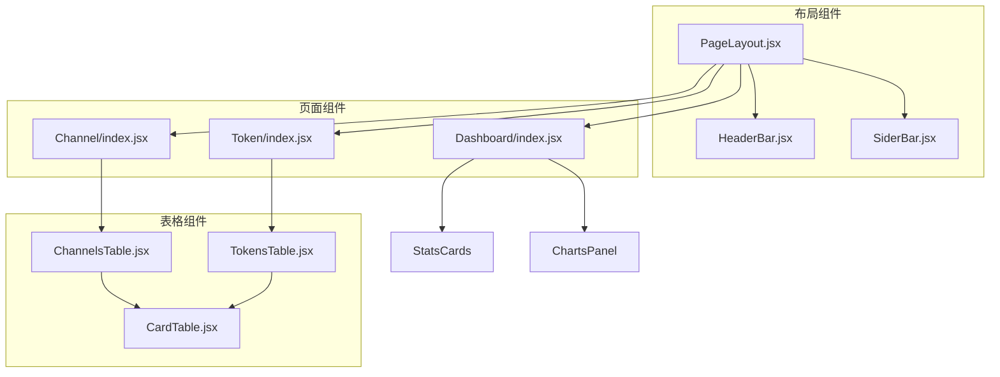
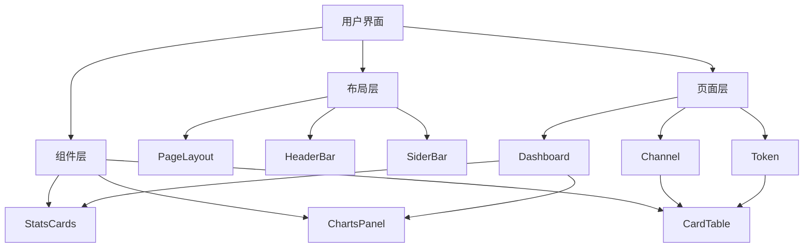
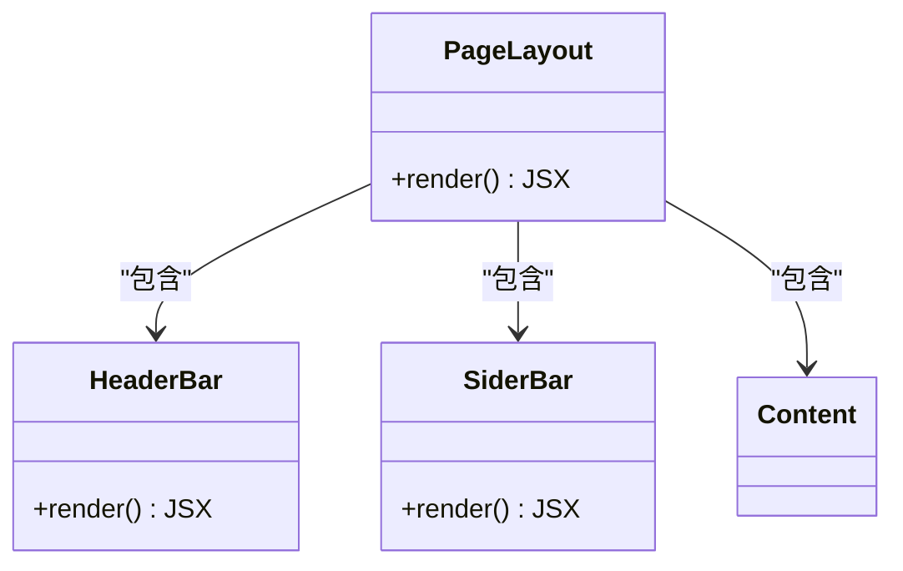
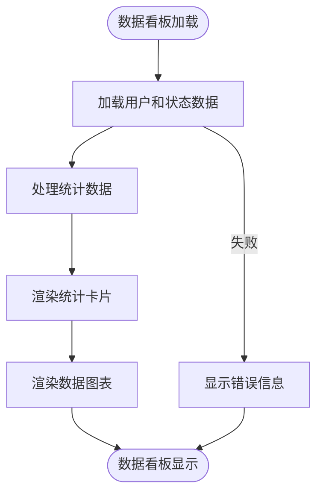
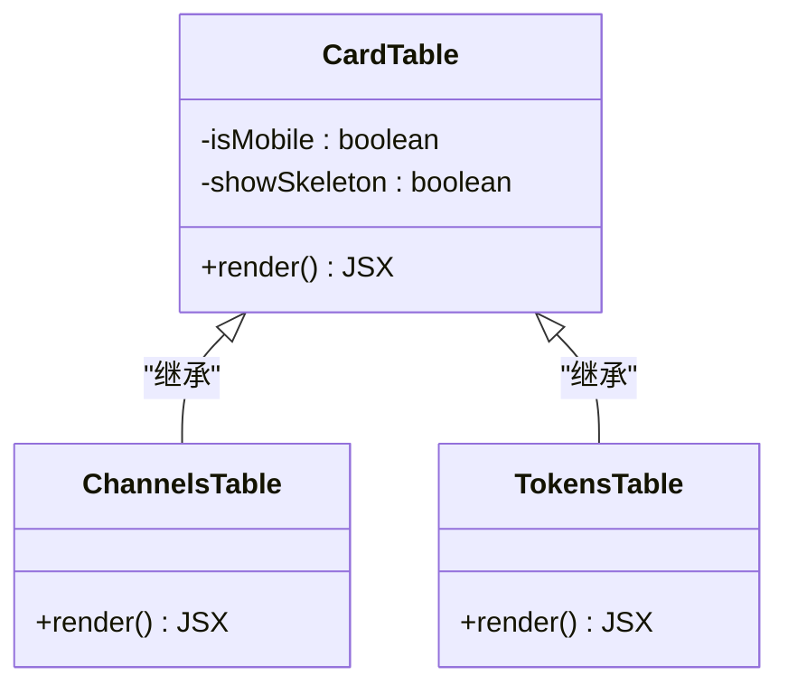
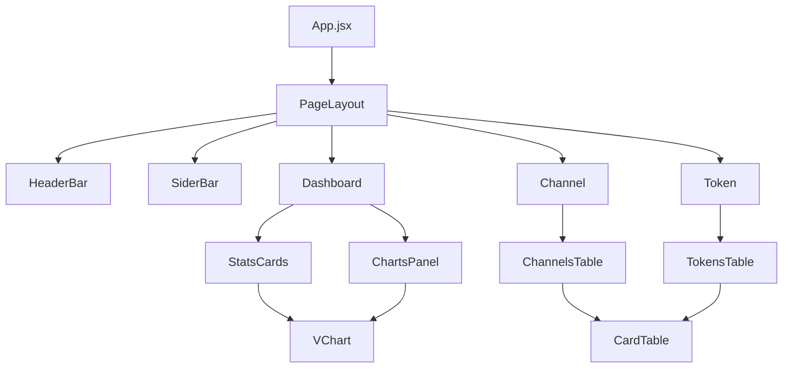

# 用户界面

<cite>
**本文档引用的文件**  
- [App.jsx](file://web/src/App.jsx)
- [PageLayout.jsx](file://web/src/components/layout/PageLayout.jsx)
- [headerbar/index.jsx](file://web/src/components/layout/headerbar/index.jsx)
- [SiderBar.jsx](file://web/src/components/layout/SiderBar.jsx)
- [Dashboard/index.jsx](file://web/src/pages/Dashboard/index.jsx)
- [ChannelsTable.jsx](file://web/src/components/table/channels/ChannelsTable.jsx)
- [TokensTable.jsx](file://web/src/components/table/tokens/TokensTable.jsx)
- [CardTable.jsx](file://web/src/components/common/ui/CardTable.jsx)
- [StatsCards.jsx](file://web/src/components/dashboard/StatsCards.jsx)
- [ChartsPanel.jsx](file://web/src/components/dashboard/ChartsPanel.jsx)
- [dashboard.constants.js](file://web/src/constants/dashboard.constants.js)
</cite>

## 目录
1. [简介](#简介)
2. [项目结构](#项目结构)
3. [核心组件](#核心组件)
4. [架构概览](#架构概览)
5. [详细组件分析](#详细组件分析)
6. [依赖分析](#依赖分析)
7. [性能考虑](#性能考虑)
8. [故障排除指南](#故障排除指南)
9. [结论](#结论)

## 简介
本用户界面文档旨在全面描述前端应用的整体布局、导航结构和主要功能区域。文档详细说明了关键UI组件（如令牌管理表、渠道配置表、数据看板）的视觉外观、行为和用户交互模式。通过提供所有页面的使用流程和操作指南，帮助用户高效使用系统。同时，为前端开发者提供组件库、状态管理和主题定制的说明，确保开发者能够理解前端架构并进行有效开发。

## 项目结构
前端应用的项目结构遵循模块化设计原则，主要组件和页面组织清晰。核心布局组件位于`web/src/components/layout/`目录下，包括页眉、侧边栏和主页面布局。各功能模块的页面位于`web/src/pages/`目录下，通过路由进行导航。UI组件库位于`web/src/components/`目录下，提供可复用的界面元素。

**图示来源**  
- [PageLayout.jsx](file://web/src/components/layout/PageLayout.jsx)
- [Dashboard/index.jsx](file://web/src/pages/Dashboard/index.jsx)
- [ChannelsTable.jsx](file://web/src/components/table/channels/ChannelsTable.jsx)

## 核心组件
前端应用的核心组件包括布局管理、导航系统、数据看板和表格组件。布局组件负责整体页面结构，导航系统提供用户在不同功能模块间的跳转，数据看板展示关键指标和统计信息，表格组件用于展示和管理数据记录。

**章节来源**  
- [App.jsx](file://web/src/App.jsx)
- [PageLayout.jsx](file://web/src/components/layout/PageLayout.jsx)
- [SiderBar.jsx](file://web/src/components/layout/SiderBar.jsx)

## 架构概览
前端应用采用React框架构建，使用React Router进行路由管理。整体架构分为三层：布局层、页面层和组件层。布局层负责整体页面结构和导航，页面层包含各个功能模块的具体实现，组件层提供可复用的UI元素和功能。

**图示来源**  
- [App.jsx](file://web/src/App.jsx)
- [PageLayout.jsx](file://web/src/components/layout/PageLayout.jsx)
- [Dashboard/index.jsx](file://web/src/pages/Dashboard/index.jsx)

## 详细组件分析
### 布局组件分析
布局组件负责管理整个应用的视觉结构和用户导航。包括页眉、侧边栏和主内容区域，提供一致的用户体验。

#### 布局组件类图

**图示来源**  
- [PageLayout.jsx](file://web/src/components/layout/PageLayout.jsx)
- [headerbar/index.jsx](file://web/src/components/layout/headerbar/index.jsx)
- [SiderBar.jsx](file://web/src/components/layout/SiderBar.jsx)

### 数据看板组件分析
数据看板组件展示系统的关键指标和统计信息，包括余额、使用量、调用次数等。通过图表和卡片形式直观呈现数据。

#### 数据看板流程图

**图示来源**  
- [Dashboard/index.jsx](file://web/src/pages/Dashboard/index.jsx)
- [StatsCards.jsx](file://web/src/components/dashboard/StatsCards.jsx)
- [ChartsPanel.jsx](file://web/src/components/dashboard/ChartsPanel.jsx)

### 表格组件分析
表格组件用于展示和管理数据记录，如令牌和渠道信息。在桌面端显示为传统表格，在移动端则转换为卡片式布局，确保响应式体验。

#### 表格组件类图

**图示来源**  
- [CardTable.jsx](file://web/src/components/common/ui/CardTable.jsx)
- [ChannelsTable.jsx](file://web/src/components/table/channels/ChannelsTable.jsx)
- [TokensTable.jsx](file://web/src/components/table/tokens/TokensTable.jsx)

## 依赖分析
前端组件之间存在清晰的依赖关系。布局组件依赖于页眉和侧边栏组件，页面组件依赖于布局组件和具体的数据展示组件。表格组件作为基础UI组件被多个页面组件复用。

**图示来源**  
- [App.jsx](file://web/src/App.jsx)
- [PageLayout.jsx](file://web/src/components/layout/PageLayout.jsx)
- [Dashboard/index.jsx](file://web/src/pages/Dashboard/index.jsx)

## 性能考虑
前端应用在性能方面进行了多项优化。使用React的懒加载功能延迟加载非关键页面，减少初始加载时间。通过useMemo和useCallback等React Hooks优化组件渲染性能。在移动端采用卡片式布局，提高小屏幕设备的用户体验。

## 故障排除指南
当用户界面出现问题时，可以按照以下步骤进行排查：
1. 检查网络连接是否正常
2. 清除浏览器缓存和本地存储
3. 检查控制台是否有JavaScript错误
4. 确认API服务是否正常运行
5. 检查用户权限设置

**章节来源**  
- [App.jsx](file://web/src/App.jsx)
- [PageLayout.jsx](file://web/src/components/layout/PageLayout.jsx)

## 结论
本用户界面文档全面描述了前端应用的架构、组件和交互模式。通过详细的分析和图示，为用户提供了清晰的操作指南，为开发者提供了深入的技术参考。系统采用现代化的前端技术栈，具有良好的可维护性和扩展性，能够满足不同用户的需求。