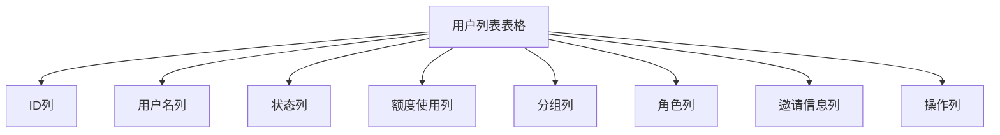
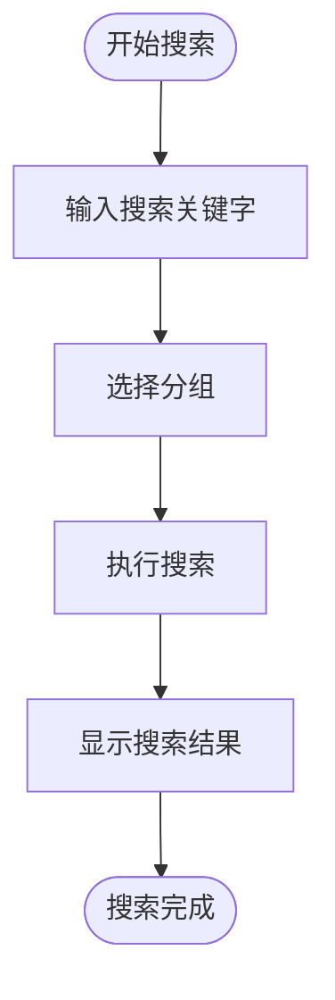
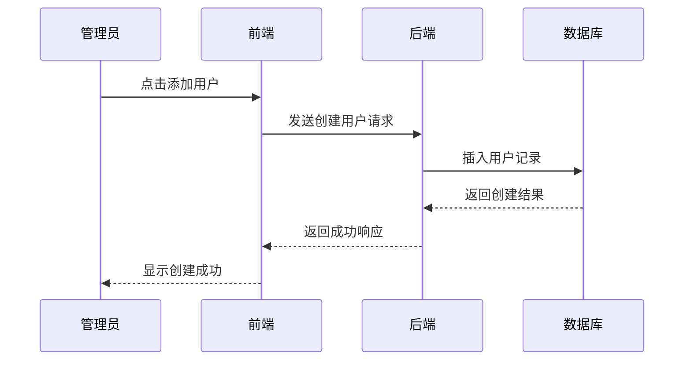
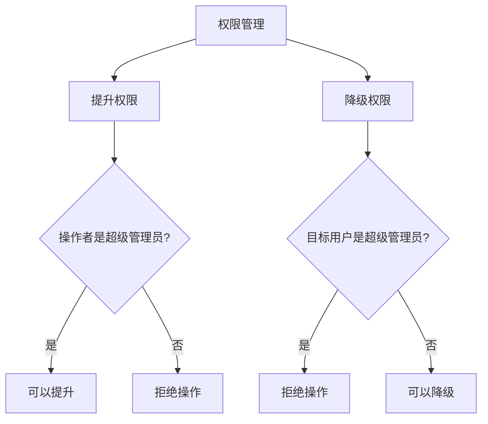
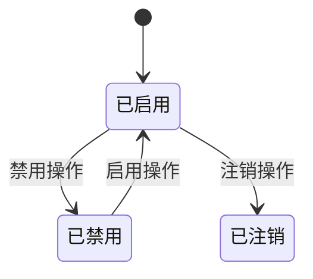
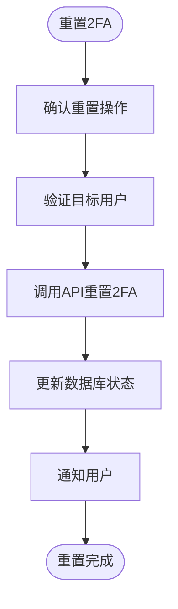
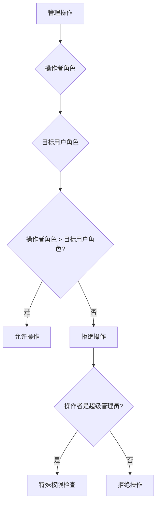
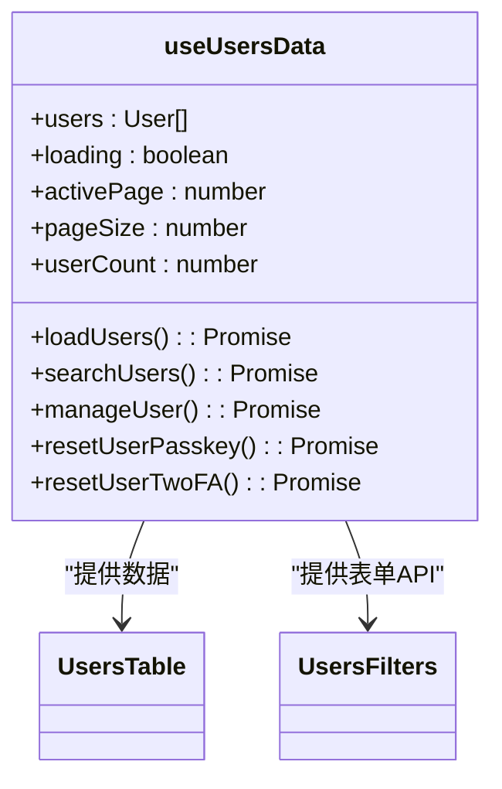
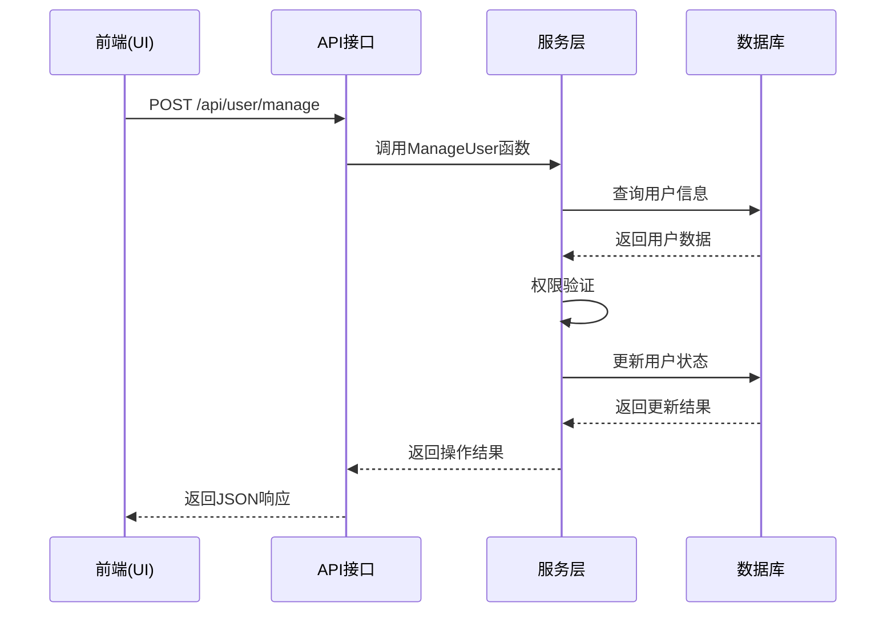
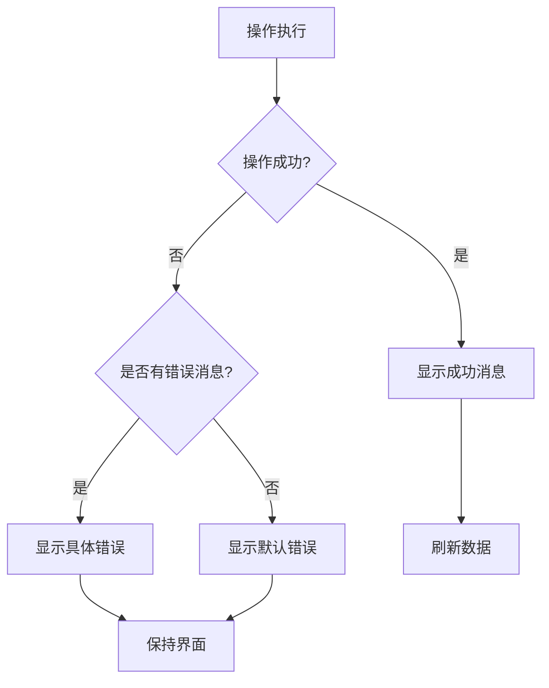

# 用户管理界面

<cite>
**本文档引用的文件**   
- [UsersTable.jsx](file://web/src/components/table/users/UsersTable.jsx)
- [UsersColumnDefs.jsx](file://web/src/components/table/users/UsersColumnDefs.jsx)
- [UsersFilters.jsx](file://web/src/components/table/users/UsersFilters.jsx)
- [useUsersData.jsx](file://web/src/hooks/users/useUsersData.jsx)
- [PromoteUserModal.jsx](file://web/src/components/table/users/modals/PromoteUserModal.jsx)
- [DemoteUserModal.jsx](file://web/src/components/table/users/modals/DemoteUserModal.jsx)
- [EnableDisableUserModal.jsx](file://web/src/components/table/users/modals/EnableDisableUserModal.jsx)
- [DeleteUserModal.jsx](file://web/src/components/table/users/modals/DeleteUserModal.jsx)
- [ResetPasskeyModal.jsx](file://web/src/components/table/users/modals/ResetPasskeyModal.jsx)
- [ResetTwoFAModal.jsx](file://web/src/components/table/users/modals/ResetTwoFAModal.jsx)
- [user.go](file://controller/user.go)
- [user.go](file://model/user.go)
</cite>

## 目录
1. [简介](#简介)
2. [用户列表表格布局](#用户列表表格布局)
3. [用户管理操作](#用户管理操作)
4. [管理员最佳实践与安全建议](#管理员最佳实践与安全建议)
5. [技术实现细节](#技术实现细节)
6. [前后端数据流与错误处理](#前后端数据流与错误处理)
7. [结论](#结论)

## 简介
本文档详细描述了AI API项目中的用户管理界面，涵盖用户列表表格的布局、数据字段和操作选项。文档详细说明了用户增删改查、权限升降、启用禁用和双因素认证重置等管理操作，为管理员提供用户管理的最佳实践和安全建议，并为开发者提供用户管理组件的技术实现细节。

## 用户列表表格布局

用户管理界面的核心是用户列表表格，它提供了全面的用户信息展示和管理功能。表格通过`UsersTable.jsx`组件实现，结合`UsersColumnDefs.jsx`定义的列配置，为管理员提供了直观的用户管理视图。

**图表来源**
- [UsersTable.jsx](file://web/src/components/table/users/UsersTable.jsx)
- [UsersColumnDefs.jsx](file://web/src/components/table/users/UsersColumnDefs.jsx)

### 数据字段说明
用户列表表格包含以下主要数据字段：

| 字段 | 描述 | 数据类型 |
|------|------|---------|
| ID | 用户唯一标识符 | 整数 |
| 用户名 | 用户登录名称，可包含备注信息 | 字符串 |
| 状态 | 用户账户状态（已启用/已禁用/已注销） | 枚举 |
| 剩余额度/总额度 | 用户额度使用情况，以进度条形式展示 | 数值 |
| 分组 | 用户所属分组 | 字符串 |
| 角色 | 用户权限级别（普通用户/管理员/超级管理员） | 枚举 |
| 邀请信息 | 邀请统计信息，包括邀请人数和收益 | 复合对象 |

**表格来源**
- [UsersColumnDefs.jsx](file://web/src/components/table/users/UsersColumnDefs.jsx)

### 表格过滤与搜索
用户管理界面提供了强大的过滤和搜索功能，通过`UsersFilters.jsx`组件实现。管理员可以按关键字和分组进行搜索，支持搜索用户的ID、用户名、显示名称和邮箱地址。

**图表来源**
- [UsersFilters.jsx](file://web/src/components/table/users/UsersFilters.jsx)

## 用户管理操作

用户管理界面提供了全面的用户管理操作，包括用户增删改查、权限升降、启用禁用和双因素认证重置等功能。

### 用户增删改查
用户管理界面支持基本的增删改查操作：

- **添加用户**：通过`UsersActions.jsx`组件中的"添加用户"按钮，管理员可以创建新用户
- **编辑用户**：在操作列中点击"编辑"按钮，可以修改用户信息
- **删除用户**：通过"注销"操作，可以删除用户账户
- **查询用户**：支持分页查询和条件搜索

**图表来源**
- [UsersActions.jsx](file://web/src/components/table/users/UsersActions.jsx)
- [user.go](file://controller/user.go)

### 权限升降
管理员可以提升或降级用户权限，但需遵守权限管理规则：

- 普通管理员只能管理普通用户
- 只有超级管理员可以提升用户为管理员
- 无法降级超级管理员
- 无法删除超级管理员

**图表来源**
- [PromoteUserModal.jsx](file://web/src/components/table/users/modals/PromoteUserModal.jsx)
- [DemoteUserModal.jsx](file://web/src/components/table/users/modals/DemoteUserModal.jsx)
- [user.go](file://controller/user.go)

### 启用禁用
管理员可以启用或禁用用户账户，但需注意：

- 无法禁用超级管理员账户
- 禁用后用户将无法登录系统
- 启用后用户可以正常登录

**图表来源**
- [EnableDisableUserModal.jsx](file://web/src/components/table/users/modals/EnableDisableUserModal.jsx)
- [user.go](file://controller/user.go)

### 双因素认证重置
管理员可以重置用户的双因素认证和Passkey：

- 重置Passkey会解绑用户当前的Passkey
- 重置2FA会禁用用户的两步验证配置
- 重置后用户下次登录需要重新设置

**图表来源**
- [ResetPasskeyModal.jsx](file://web/src/components/table/users/modals/ResetPasskeyModal.jsx)
- [ResetTwoFAModal.jsx](file://web/src/components/table/users/modals/ResetTwoFAModal.jsx)
- [user.go](file://controller/user.go)

## 管理员最佳实践与安全建议

### 权限管理最佳实践
1. **最小权限原则**：为用户分配完成工作所需的最小权限
2. **定期审查**：定期审查用户权限，确保权限分配合理
3. **权限分离**：将管理权限分配给多个管理员，避免单点故障

### 安全建议
1. **超级管理员保护**：确保至少有一个超级管理员账户，避免系统锁定
2. **操作审计**：所有管理操作都会被记录在系统日志中
3. **二次确认**：敏感操作需要二次确认，防止误操作
4. **定期备份**：定期备份用户数据，防止数据丢失

## 技术实现细节

### 权限验证机制
系统实现了严格的权限验证机制，确保管理员只能管理权限低于自己的用户：

**图表来源**
- [user.go](file://controller/user.go)

### 状态同步机制
前端通过`useUsersData.jsx`钩子管理用户数据状态，确保UI与数据同步：

**图表来源**
- [useUsersData.jsx](file://web/src/hooks/users/useUsersData.jsx)

### 模态框交互逻辑
模态框组件采用统一的交互模式，确保用户体验一致：

1. 点击操作按钮打开模态框
2. 显示确认信息和警告
3. 用户确认后执行操作
4. 操作完成后关闭模态框

## 前后端数据流与错误处理

### 数据流分析
用户管理操作的前后端数据流如下：

**图表来源**
- [user.go](file://controller/user.go)

### 错误处理机制
系统实现了完善的错误处理机制：

1. **前端错误处理**：使用`showError`和`showSuccess`函数显示操作结果
2. **后端错误处理**：返回标准化的错误响应格式
3. **异常捕获**：使用try-catch捕获异步操作中的异常

**图表来源**
- [useUsersData.jsx](file://web/src/hooks/users/useUsersData.jsx)
- [user.go](file://controller/user.go)

## 结论
用户管理界面提供了全面的用户管理功能，通过清晰的界面设计和严格的权限控制，确保了系统的安全性和易用性。开发者可以基于本文档了解用户管理组件的技术实现细节，管理员可以遵循最佳实践和安全建议进行用户管理。