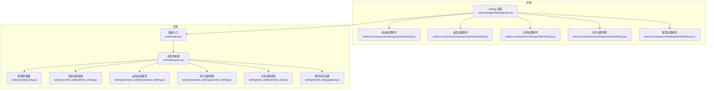
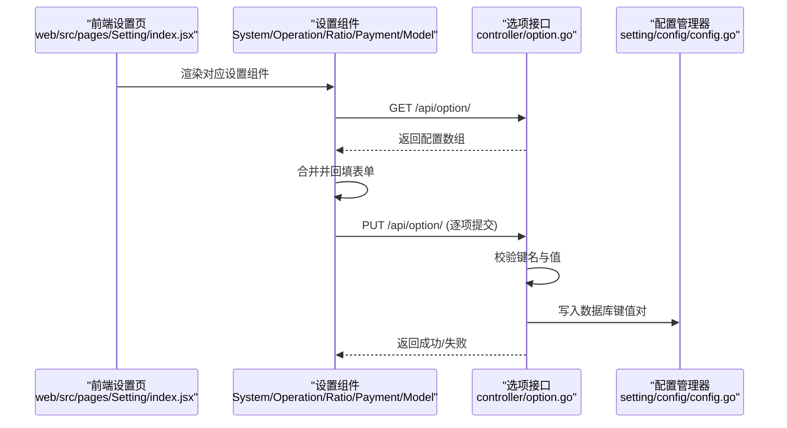
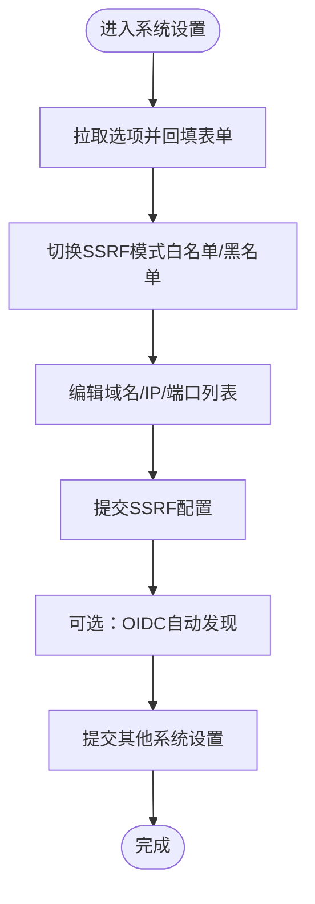
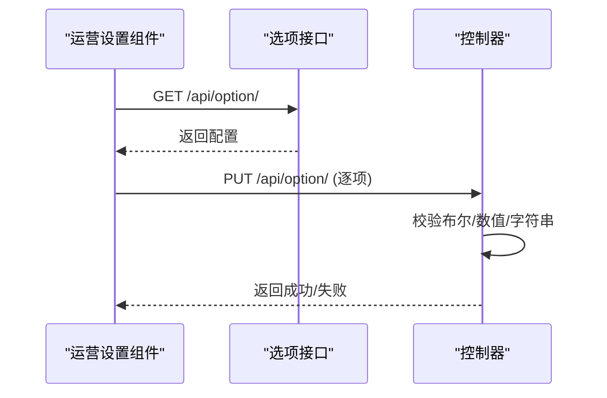
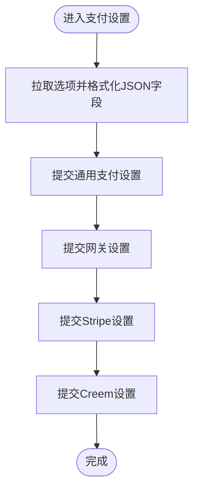
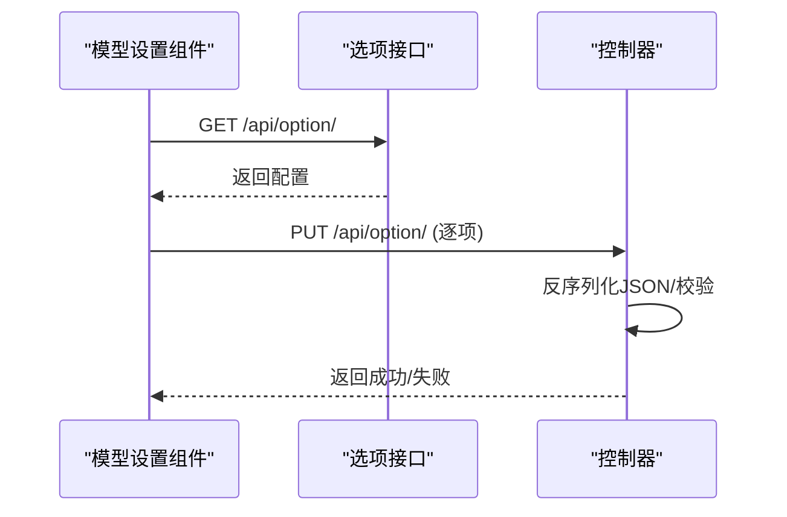
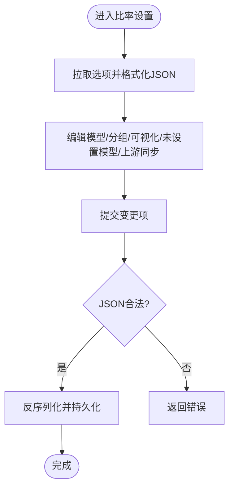
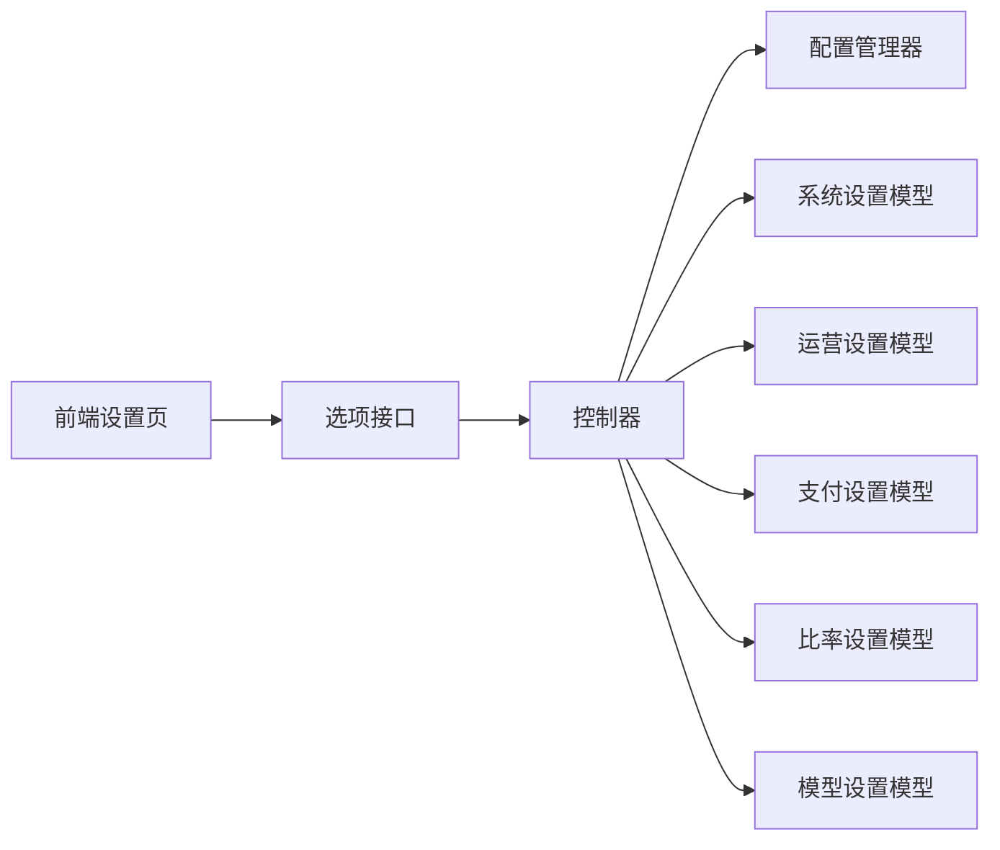

# 系统设置界面

<cite>
**本文引用的文件**
- [main.go](file://main.go)
- [router/main.go](file://router/main.go)
- [controller/option.go](file://controller/option.go)
- [web/src/pages/Setting/index.jsx](file://web/src/pages/Setting/index.jsx)
- [web/src/components/settings/SystemSetting.jsx](file://web/src/components/settings/SystemSetting.jsx)
- [web/src/components/settings/OperationSetting.jsx](file://web/src/components/settings/OperationSetting.jsx)
- [web/src/components/settings/RatioSetting.jsx](file://web/src/components/settings/RatioSetting.jsx)
- [web/src/components/settings/PaymentSetting.jsx](file://web/src/components/settings/PaymentSetting.jsx)
- [web/src/components/settings/ModelSetting.jsx](file://web/src/components/settings/ModelSetting.jsx)
- [web/src/pages/Setting/Operation/SettingsGeneral.jsx](file://web/src/pages/Setting/Operation/SettingsGeneral.jsx)
- [web/src/pages/Setting/Ratio/ModelRatioSettings.jsx](file://web/src/pages/Setting/Ratio/ModelRatioSettings.jsx)
- [web/src/pages/Setting/Payment/SettingsGeneralPayment.jsx](file://web/src/pages/Setting/Payment/SettingsGeneralPayment.jsx)
- [setting/config/config.go](file://setting/config/config.go)
- [setting/system_setting/fetch_setting.go](file://setting/system_setting/fetch_setting.go)
- [setting/operation_setting/operation_setting.go](file://setting/operation_setting/operation_setting.go)
- [setting/operation_setting/payment_setting.go](file://setting/operation_setting/payment_setting.go)
- [setting/ratio_setting/model_ratio.go](file://setting/ratio_setting/model_ratio.go)
- [setting/model_setting/global.go](file://setting/model_setting/global.go)
</cite>

## 目录
1. [简介](#简介)
2. [项目结构](#项目结构)
3. [核心组件](#核心组件)
4. [架构总览](#架构总览)
5. [详细组件分析](#详细组件分析)
6. [依赖关系分析](#依赖关系分析)
7. [性能考量](#性能考量)
8. [故障排查指南](#故障排查指南)
9. [结论](#结论)
10. [附录](#附录)

## 简介
本文件面向使用者与开发者，系统化梳理“系统设置界面”的整体架构与各配置模块，覆盖操作设置、支付设置、模型设置、比率设置等主要功能，并提供配置指南、最佳实践、表单验证与配置保存机制的技术实现说明，以及状态管理与动态更新流程的可视化图示。

## 项目结构
系统设置界面由前端路由与页面组件构成，后端通过统一的选项接口提供配置读取与写入能力；配置数据在后端以“键值对”形式存储，前端通过选项接口批量拉取与提交，后端再根据键名进行校验与持久化。

图表来源
- [web/src/pages/Setting/index.jsx](file://web/src/pages/Setting/index.jsx#L1-L194)
- [web/src/components/settings/SystemSetting.jsx](file://web/src/components/settings/SystemSetting.jsx#L1-L120)
- [web/src/components/settings/OperationSetting.jsx](file://web/src/components/settings/OperationSetting.jsx#L1-L149)
- [web/src/components/settings/RatioSetting.jsx](file://web/src/components/settings/RatioSetting.jsx#L1-L124)
- [web/src/components/settings/PaymentSetting.jsx](file://web/src/components/settings/PaymentSetting.jsx#L1-L155)
- [web/src/components/settings/ModelSetting.jsx](file://web/src/components/settings/ModelSetting.jsx#L1-L117)
- [router/main.go](file://router/main.go#L1-L200)
- [controller/option.go](file://controller/option.go#L1-L224)
- [setting/config/config.go](file://setting/config/config.go#L1-L288)
- [setting/system_setting/fetch_setting.go](file://setting/system_setting/fetch_setting.go#L1-L35)
- [setting/operation_setting/operation_setting.go](file://setting/operation_setting/operation_setting.go#L1-L33)
- [setting/operation_setting/payment_setting.go](file://setting/operation_setting/payment_setting.go#L1-L24)
- [setting/ratio_setting/model_ratio.go](file://setting/ratio_setting/model_ratio.go#L1-L120)
- [setting/model_setting/global.go](file://setting/model_setting/global.go#L1-L49)

章节来源
- [web/src/pages/Setting/index.jsx](file://web/src/pages/Setting/index.jsx#L1-L194)
- [router/main.go](file://router/main.go#L1-L200)
- [controller/option.go](file://controller/option.go#L1-L224)

## 核心组件
- 前端设置页入口：负责渲染各设置标签页并承载子组件。
- 各设置组件：分别处理系统、运营、比率、支付、模型等配置项的表单与提交逻辑。
- 后端选项控制器：提供统一的选项读取与更新接口，并执行必要的业务校验。
- 配置管理器：负责将结构化配置对象与数据库键值对之间相互转换与持久化。

章节来源
- [web/src/pages/Setting/index.jsx](file://web/src/pages/Setting/index.jsx#L1-L194)
- [controller/option.go](file://controller/option.go#L1-L224)
- [setting/config/config.go](file://setting/config/config.go#L1-L288)

## 架构总览
前端通过选项接口一次性拉取全部配置，按需回填到各设置组件；组件内部维护本地状态，提交时仅提交变更项，后端对关键键名进行校验并通过选项控制器持久化。

图表来源
- [web/src/pages/Setting/index.jsx](file://web/src/pages/Setting/index.jsx#L1-L194)
- [web/src/components/settings/SystemSetting.jsx](file://web/src/components/settings/SystemSetting.jsx#L1-L120)
- [controller/option.go](file://controller/option.go#L1-L224)
- [setting/config/config.go](file://setting/config/config.go#L1-L288)

## 详细组件分析

### 系统设置（SSRF防护、代理、认证、Passkey、邮件等）
- 功能要点
  - SSRF防护：域名/IP过滤模式、允许私有IP、端口白名单、域名/IP联动过滤。
  - 代理设置：Worker地址、密钥、HTTP图片请求允许。
  - 认证与第三方登录：GitHub、Discord、OIDC、Telegram、LinuxDO、微信、Turnstile、Passkey等。
  - 邮件与通知：SMTP配置、邮箱域名白名单、Footer、公告、文档链接等。
- 前端实现
  - 初始化加载：调用选项接口，针对布尔值、数组、JSON字符串进行转换与回填。
  - 提交流程：按功能分组提交，支持批量异步请求，统一反馈结果。
  - 特殊校验：OIDC自动发现、域名白名单格式、URL协议校验等。
- 后端实现
  - 选项读取：过滤敏感字段（Token/Secret/Key）后返回。
  - 选项写入：对特定键名执行前置校验（如启用某登录方式需先填写必要凭据）。
  - 配置持久化：通过配置管理器将结构化配置写入数据库键值对。

图表来源
- [web/src/components/settings/SystemSetting.jsx](file://web/src/components/settings/SystemSetting.jsx#L1-L240)
- [controller/option.go](file://controller/option.go#L60-L120)
- [setting/system_setting/fetch_setting.go](file://setting/system_setting/fetch_setting.go#L1-L35)

章节来源
- [web/src/components/settings/SystemSetting.jsx](file://web/src/components/settings/SystemSetting.jsx#L1-L240)
- [controller/option.go](file://controller/option.go#L60-L120)
- [setting/system_setting/fetch_setting.go](file://setting/system_setting/fetch_setting.go#L1-L35)

### 运营设置（通用、模块管理、敏感词、日志、监控、额度）
- 功能要点
  - 通用设置：文档链接、额度展示类型、汇率、重试次数、默认折叠侧边栏、演示模式、自用模式等。
  - 模块管理：顶栏导航模块、左侧边栏管理员模块。
  - 敏感词：启用开关、提示词过滤、关键词列表。
  - 日志：消费日志记录。
  - 监控：通道禁用阈值、提醒阈值、自动启停、关键字自动禁用。
  - 额度：新用户初始额度、预扣额度、邀请人/被邀请人额度。
- 前端实现
  - 通用设置组件：对比本地与原始值，仅提交变更项；支持组合汇率/额度显示类型。
  - 监控与额度组件：独立表单，提交时统一走PUT选项接口。
- 后端实现
  - 选项读取：返回全部配置键值。
  - 选项写入：对布尔/数值/字符串进行类型转换，提交后持久化。

图表来源
- [web/src/components/settings/OperationSetting.jsx](file://web/src/components/settings/OperationSetting.jsx#L1-L149)
- [web/src/pages/Setting/Operation/SettingsGeneral.jsx](file://web/src/pages/Setting/Operation/SettingsGeneral.jsx#L1-L320)
- [controller/option.go](file://controller/option.go#L1-L224)

章节来源
- [web/src/components/settings/OperationSetting.jsx](file://web/src/components/settings/OperationSetting.jsx#L1-L149)
- [web/src/pages/Setting/Operation/SettingsGeneral.jsx](file://web/src/pages/Setting/Operation/SettingsGeneral.jsx#L1-L320)
- [controller/option.go](file://controller/option.go#L1-L224)
- [setting/operation_setting/operation_setting.go](file://setting/operation_setting/operation_setting.go#L1-L33)

### 支付设置（通用、网关、Stripe、Creem）
- 功能要点
  - 通用：服务器地址、充值链接、最小充值、价格汇率、分组倍率、回调地址、支付方式。
  - 网关：Epay ID/Key、金额选项、折扣配置。
  - Stripe：Secret/Webhook/PriceId/单价/最低充值、促销码开关。
  - Creem：第三方支付网关集成。
- 前端实现
  - 通用支付设置：提交服务器地址等基础配置。
  - 网关与Stripe：分别维护独立表单，提交时统一走PUT选项接口。
  - JSON字段：对TopupGroupRatio、AmountOptions、AmountDiscount等进行JSON格式化与校验。
- 后端实现
  - 选项读取：返回全部配置键值。
  - 选项写入：对支付相关键名进行格式与范围校验，必要时触发比率设置更新。

图表来源
- [web/src/components/settings/PaymentSetting.jsx](file://web/src/components/settings/PaymentSetting.jsx#L1-L155)
- [web/src/pages/Setting/Payment/SettingsGeneralPayment.jsx](file://web/src/pages/Setting/Payment/SettingsGeneralPayment.jsx#L1-L95)
- [controller/option.go](file://controller/option.go#L130-L175)
- [setting/operation_setting/payment_setting.go](file://setting/operation_setting/payment_setting.go#L1-L24)

章节来源
- [web/src/components/settings/PaymentSetting.jsx](file://web/src/components/settings/PaymentSetting.jsx#L1-L155)
- [web/src/pages/Setting/Payment/SettingsGeneralPayment.jsx](file://web/src/pages/Setting/Payment/SettingsGeneralPayment.jsx#L1-L95)
- [controller/option.go](file://controller/option.go#L130-L175)
- [setting/operation_setting/payment_setting.go](file://setting/operation_setting/payment_setting.go#L1-L24)

### 模型设置（全局、Gemini、Claude）
- 功能要点
  - 全局：透传请求开关、思维模型黑名单。
  - Gemini：安全设置、版本设置、Imagine模型支持列表、思维适配器开关与预算占比。
  - Claude：模型请求头设置、思维适配器开关与预算占比、默认最大上下文。
- 前端实现
  - 对JSON字段进行格式化与回填；布尔开关与数值字段统一处理。
  - 提交时仅提交变更项，避免冗余请求。
- 后端实现
  - 选项读取：返回全部配置键值。
  - 选项写入：对JSON字段进行反序列化与持久化。

图表来源
- [web/src/components/settings/ModelSetting.jsx](file://web/src/components/settings/ModelSetting.jsx#L1-L117)
- [controller/option.go](file://controller/option.go#L176-L211)
- [setting/model_setting/global.go](file://setting/model_setting/global.go#L1-L49)

章节来源
- [web/src/components/settings/ModelSetting.jsx](file://web/src/components/settings/ModelSetting.jsx#L1-L117)
- [controller/option.go](file://controller/option.go#L176-L211)
- [setting/model_setting/global.go](file://setting/model_setting/global.go#L1-L49)

### 比率设置（模型倍率、分组倍率、可视化编辑、未设置模型、上游同步）
- 功能要点
  - 模型倍率：模型固定价格、模型倍率、缓存倍率、补全倍率、图片/音频倍率、音频补全倍率。
  - 分组倍率：分组倍率配置与特殊可用分组。
  - 可视化编辑：图形化配置模型倍率。
  - 未设置模型：对未显式配置的模型应用默认倍率策略。
  - 上游同步：与上游倍率同步。
- 前端实现
  - 对JSON字段进行校验与格式化；支持“重置模型倍率”等危险操作确认。
  - 提交时仅提交变更项，后端对JSON合法性进行校验。
- 后端实现
  - 选项读取：返回全部配置键值。
  - 选项写入：对JSON字符串进行反序列化，必要时触发缓存失效与暴露接口开关。

图表来源
- [web/src/components/settings/RatioSetting.jsx](file://web/src/components/settings/RatioSetting.jsx#L1-L124)
- [web/src/pages/Setting/Ratio/ModelRatioSettings.jsx](file://web/src/pages/Setting/Ratio/ModelRatioSettings.jsx#L1-L324)
- [controller/option.go](file://controller/option.go#L140-L167)
- [setting/ratio_setting/model_ratio.go](file://setting/ratio_setting/model_ratio.go#L338-L431)

章节来源
- [web/src/components/settings/RatioSetting.jsx](file://web/src/components/settings/RatioSetting.jsx#L1-L124)
- [web/src/pages/Setting/Ratio/ModelRatioSettings.jsx](file://web/src/pages/Setting/Ratio/ModelRatioSettings.jsx#L1-L324)
- [controller/option.go](file://controller/option.go#L140-L167)
- [setting/ratio_setting/model_ratio.go](file://setting/ratio_setting/model_ratio.go#L338-L431)

## 依赖关系分析
- 前端设置页统一调度各设置组件，组件通过选项接口与后端交互。
- 后端控制器对选项键名进行严格校验，防止非法配置生效。
- 配置管理器负责结构化配置与数据库键值对之间的双向转换，保证配置持久化与一致性。

图表来源
- [web/src/pages/Setting/index.jsx](file://web/src/pages/Setting/index.jsx#L1-L194)
- [controller/option.go](file://controller/option.go#L1-L224)
- [setting/config/config.go](file://setting/config/config.go#L1-L288)
- [setting/system_setting/fetch_setting.go](file://setting/system_setting/fetch_setting.go#L1-L35)
- [setting/operation_setting/operation_setting.go](file://setting/operation_setting/operation_setting.go#L1-L33)
- [setting/operation_setting/payment_setting.go](file://setting/operation_setting/payment_setting.go#L1-L24)
- [setting/ratio_setting/model_ratio.go](file://setting/ratio_setting/model_ratio.go#L1-L120)
- [setting/model_setting/global.go](file://setting/model_setting/global.go#L1-L49)

章节来源
- [controller/option.go](file://controller/option.go#L1-L224)
- [setting/config/config.go](file://setting/config/config.go#L1-L288)

## 性能考量
- 批量提交优化：前端对变更项进行对比，仅提交差异项，减少网络往返与后端压力。
- 并发请求：同一页面内的多处提交采用并发请求，提升用户体验。
- JSON字段处理：对大型JSON字符串进行延迟解析与校验，避免阻塞UI线程。
- 缓存与暴露接口：比率设置支持暴露接口开关，便于外部系统按需访问，同时注意缓存失效策略。

## 故障排查指南
- 选项读取失败
  - 现象：设置页加载空白或报错。
  - 排查：确认后端选项接口可用；检查网络与跨域配置。
- 选项写入失败
  - 现象：提交后无响应或返回错误。
  - 排查：查看返回消息中的具体原因（如启用登录方式需先填写必要凭据）；检查键名是否正确。
- JSON字段校验失败
  - 现象：提交JSON字段时报“不是合法的JSON字符串”。
  - 排查：确认JSON格式正确，键值类型符合预期；必要时使用可视化编辑器辅助。
- SSRF配置异常
  - 现象：请求被拦截或访问受限。
  - 排查：核对域名/IP过滤模式、列表格式与端口白名单；确认私有IP放行策略。

章节来源
- [controller/option.go](file://controller/option.go#L60-L120)
- [web/src/pages/Setting/Ratio/ModelRatioSettings.jsx](file://web/src/pages/Setting/Ratio/ModelRatioSettings.jsx#L140-L200)
- [web/src/components/settings/SystemSetting.jsx](file://web/src/components/settings/SystemSetting.jsx#L360-L420)

## 结论
系统设置界面通过统一的选项接口实现了前后端解耦，前端负责表单与交互体验，后端负责配置校验与持久化。各设置模块职责清晰、边界明确，配合严格的键名校验与JSON校验，保障了系统的安全性与稳定性。建议在生产环境中：
- 严格控制敏感字段的可见性与传输。
- 对关键配置（如SSRF、支付网关）进行双人复核。
- 定期备份配置，以便快速回滚。

## 附录
- 配置键名规范
  - 通用：ServerAddress、TopUpLink、RetryTimes、DisplayTokenStatEnabled、DefaultCollapseSidebar、DemoSiteEnabled、SelfUseModeEnabled。
  - 系统：fetch_setting.*、passkey.*、SMTP*、EmailDomainWhitelist、WorkerUrl、WorkerValidKey、Turnstile*、GitHub/OIDC/Telegram/LinuxDO/WeChat等。
  - 比率：ModelPrice、ModelRatio、CacheRatio、CompletionRatio、ImageRatio、AudioRatio、AudioCompletionRatio、ExposeRatioEnabled。
  - 支付：ServerAddress、EpayId、EpayKey、AmountOptions、AmountDiscount、Stripe*、PayMethods、TopupGroupRatio。
  - 模型：global.*、gemini.*、claude.*。