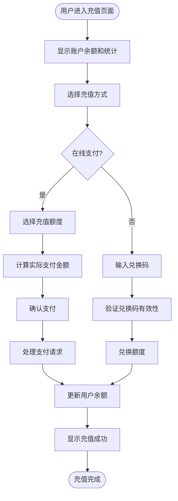
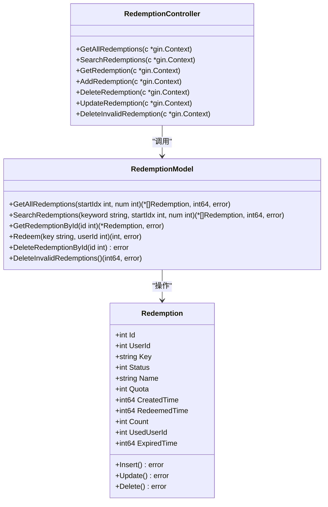
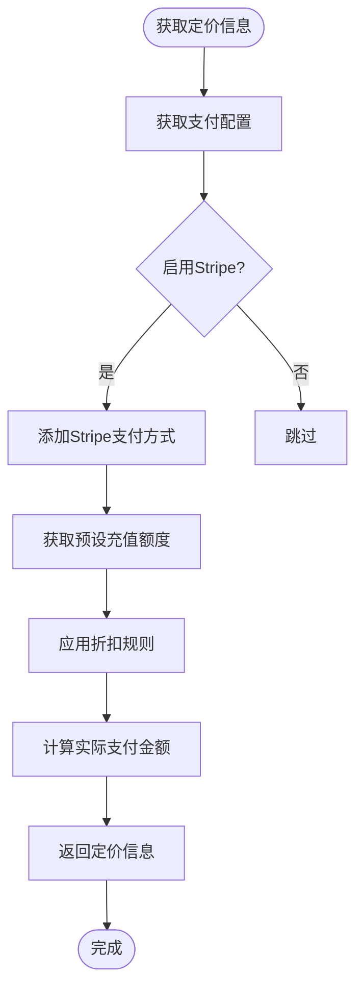
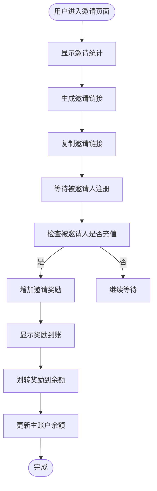
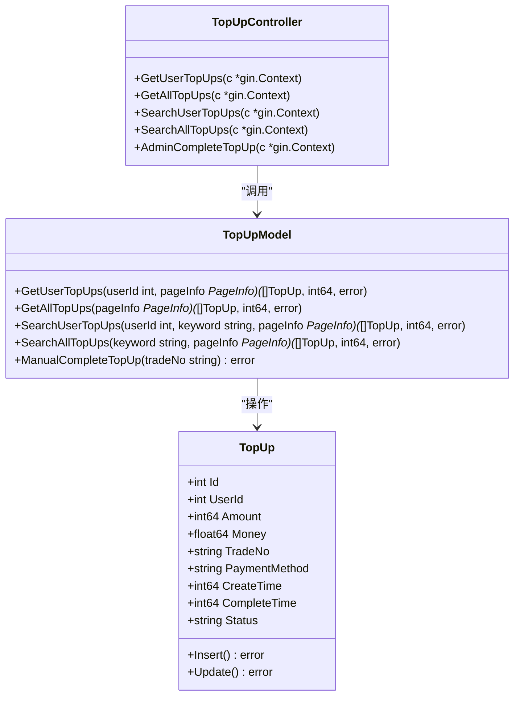
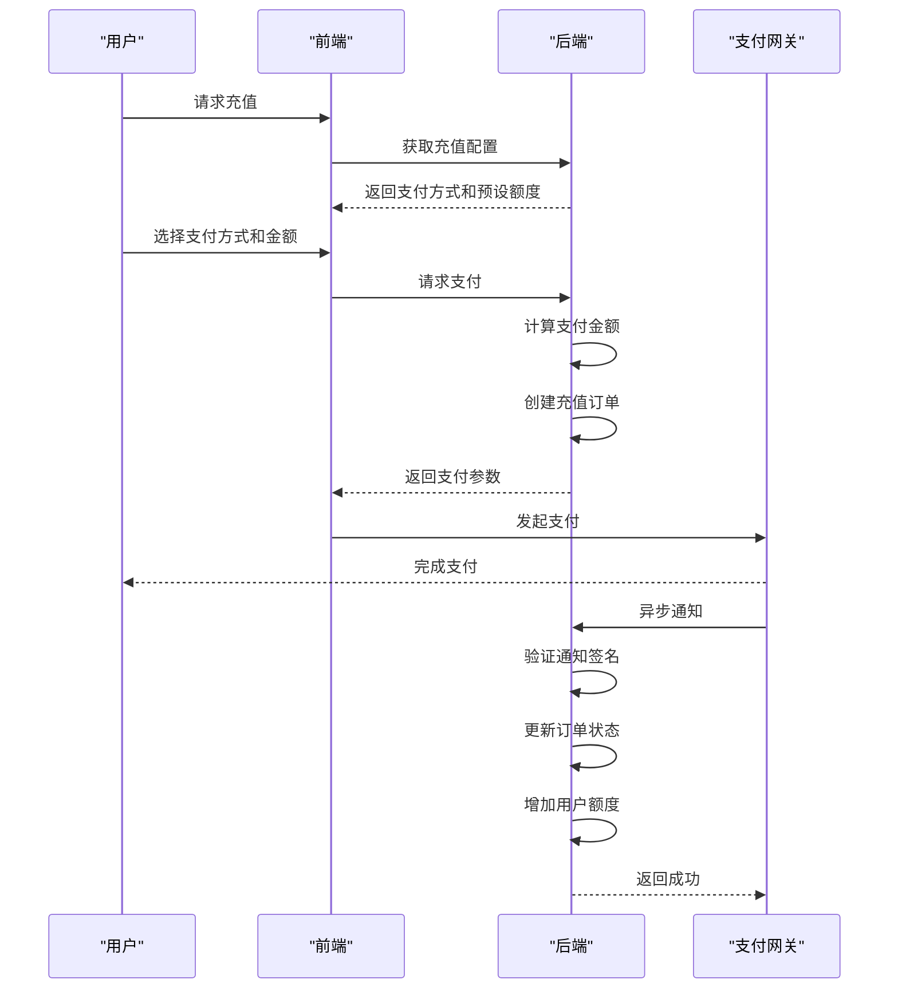
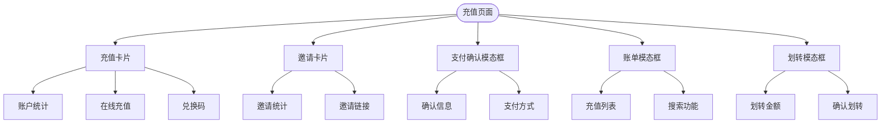
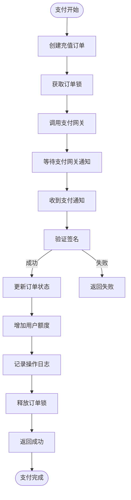

# 计费系统界面

<cite>
**本文档引用文件**   
- [topup.go](file://model/topup.go)
- [redemption.go](file://model/redemption.go)
- [billing.go](file://controller/billing.go)
- [topup.go](file://controller/topup.go)
- [redemption.go](file://controller/redemption.go)
- [index.jsx](file://web/src/components/topup/index.jsx)
- [RechargeCard.jsx](file://web/src/components/topup/RechargeCard.jsx)
- [InvitationCard.jsx](file://web/src/components/topup/InvitationCard.jsx)
- [PaymentConfirmModal.jsx](file://web/src/components/topup/modals/PaymentConfirmModal.jsx)
- [TopupHistoryModal.jsx](file://web/src/components/topup/modals/TopupHistoryModal.jsx)
- [TransferModal.jsx](file://web/src/components/topup/modals/TransferModal.jsx)
- [api.js](file://web/src/helpers/api.js)
</cite>

## 目录
1. [简介](#简介)
2. [充值功能](#充值功能)
3. [兑换功能](#兑换功能)
4. [定价与折扣](#定价与折扣)
5. [邀请奖励](#邀请奖励)
6. [账单管理](#账单管理)
7. [开发者指南](#开发者指南)
8. [前端组件架构](#前端组件架构)
9. [后端API接口](#后端api接口)
10. [支付流程集成](#支付流程集成)

## 简介
计费系统为用户提供完整的充值、兑换和账单管理功能。系统支持多种支付方式，包括支付宝、微信支付和Stripe，并提供兑换码、邀请奖励等增值功能。用户界面设计简洁直观，通过卡片式布局展示账户统计、充值选项和邀请奖励信息。系统实现了完整的支付流程，从前端交互到后端处理，确保交易的安全性和可靠性。

## 充值功能
充值功能允许用户通过多种支付方式为账户充值。系统提供在线支付和兑换码两种充值途径。在线支付支持支付宝、微信支付和Stripe，用户可以选择预设的充值额度或自定义金额。系统根据用户分组和配置的折扣规则计算实际支付金额。



**图示来源**
- [RechargeCard.jsx](file://web/src/components/topup/RechargeCard.jsx#L91-L585)
- [topup.go](file://controller/topup.go#L25-L393)

**本节来源**
- [RechargeCard.jsx](file://web/src/components/topup/RechargeCard.jsx#L91-L585)
- [topup.go](file://controller/topup.go#L25-L393)

## 兑换功能
兑换功能允许用户通过兑换码获取额度。管理员可以批量生成兑换码，设置名称、额度和过期时间。每个兑换码只能使用一次，使用后状态会更新为已使用。系统提供了兑换码的增删改查和批量删除无效兑换码的功能。



**图示来源**
- [redemption.go](file://model/redemption.go#L1-L198)
- [redemption.go](file://controller/redemption.go#L1-L196)

**本节来源**
- [redemption.go](file://model/redemption.go#L1-L198)
- [redemption.go](file://controller/redemption.go#L1-L196)

## 定价与折扣
定价系统支持灵活的定价策略和折扣规则。系统根据配置的单价和用户分组的充值倍率计算支付金额。管理员可以为特定充值金额设置折扣，鼓励用户进行大额充值。系统支持多种货币显示，包括美元、人民币和自定义货币。



**图示来源**
- [topup.go](file://controller/topup.go#L25-L393)
- [RechargeCard.jsx](file://web/src/components/topup/RechargeCard.jsx#L386-L485)

**本节来源**
- [topup.go](file://controller/topup.go#L25-L393)
- [RechargeCard.jsx](file://web/src/components/topup/RechargeCard.jsx#L386-L485)

## 邀请奖励
邀请奖励功能允许用户通过分享邀请链接获得奖励。当被邀请人充值后，邀请人可以获得相应额度的奖励。奖励额度会累积在邀请奖励余额中，用户可以将其划转到主账户余额。系统记录邀请人数和总收益，激励用户进行推广。



**图示来源**
- [InvitationCard.jsx](file://web/src/components/topup/InvitationCard.jsx#L42-L230)
- [topup.go](file://controller/topup.go#L431-L459)

**本节来源**
- [InvitationCard.jsx](file://web/src/components/topup/InvitationCard.jsx#L42-L230)
- [topup.go](file://controller/topup.go#L431-L459)

## 账单管理
账单管理功能允许用户查看和管理充值记录。系统提供分页的账单列表，支持按订单号搜索。用户可以查看订单的支付方式、充值额度、支付金额、状态和创建时间。管理员可以对未完成的订单进行补单操作，确保交易的完整性。



**图示来源**
- [topup.go](file://model/topup.go#L1-L377)
- [topup.go](file://controller/topup.go#L321-L393)

**本节来源**
- [topup.go](file://model/topup.go#L1-L377)
- [topup.go](file://controller/topup.go#L321-L393)

## 开发者指南
开发者可以利用提供的API接口集成计费功能。系统提供了获取订阅信息、使用情况、充值配置、充值记录和兑换码管理的API。支付流程通过异步通知机制确保交易的可靠性，使用订单锁防止并发操作。



**图示来源**
- [topup.go](file://controller/topup.go#L130-L232)
- [topup.go](file://model/topup.go#L58-L104)

**本节来源**
- [topup.go](file://controller/topup.go#L130-L232)
- [topup.go](file://model/topup.go#L58-L104)

## 前端组件架构
计费系统的前端采用组件化架构，主要由充值卡片、邀请卡片和模态框组成。充值卡片展示账户统计和充值选项，邀请卡片显示邀请奖励信息，模态框用于确认支付和查看账单。



**图示来源**
- [index.jsx](file://web/src/components/topup/index.jsx#L42-L726)
- [RechargeCard.jsx](file://web/src/components/topup/RechargeCard.jsx#L91-L585)
- [InvitationCard.jsx](file://web/src/components/topup/InvitationCard.jsx#L42-L230)

**本节来源**
- [index.jsx](file://web/src/components/topup/index.jsx#L42-L726)
- [RechargeCard.jsx](file://web/src/components/topup/RechargeCard.jsx#L91-L585)
- [InvitationCard.jsx](file://web/src/components/topup/InvitationCard.jsx#L42-L230)

## 后端API接口
计费系统提供了完整的RESTful API接口，支持充值、兑换、账单查询等功能。API采用统一的响应格式，包含成功状态、消息和数据。

```mermaid
classDiagram
class APIResponse {
+bool success
+string message
+any data
}
class TopUpAPI {
+GET /api/user/topup/info 获取充值配置
+POST /api/user/pay 发起支付
+POST /api/user/amount 获取支付金额
+GET /api/user/topup/self 获取用户充值记录
+POST /api/user/topup/complete 管理员补单
}
class RedemptionAPI {
+GET /api/user/redemption 获取兑换码列表
+POST /api/user/redemption 添加兑换码
+DELETE /api/user/redemption/{id} 删除兑换码
+PUT /api/user/redemption 更新兑换码
+POST /api/user/topup 兑换额度
}
class BillingAPI {
+GET /api/user/billing/subscription 获取订阅信息
+GET /api/user/billing/usage 获取使用情况
}
APIResponse <|-- TopUpAPI
APIResponse <|-- RedemptionAPI
APIResponse <|-- BillingAPI
```

**图示来源**
- [topup.go](file://controller/topup.go#L25-L393)
- [redemption.go](file://controller/redemption.go#L1-L196)
- [billing.go](file://controller/billing.go#L11-L69)

**本节来源**
- [topup.go](file://controller/topup.go#L25-L393)
- [redemption.go](file://controller/redemption.go#L1-L196)
- [billing.go](file://controller/billing.go#L11-L69)

## 支付流程集成
支付流程集成确保了交易的安全性和可靠性。系统使用订单锁防止并发操作，通过异步通知机制处理支付结果。支付网关的回调经过签名验证，确保数据的完整性。



**图示来源**
- [topup.go](file://controller/topup.go#L209-L230)
- [topup.go](file://controller/topup.go#L232-L292)
- [topup.go](file://model/topup.go#L58-L104)

**本节来源**
- [topup.go](file://controller/topup.go#L209-L230)
- [topup.go](file://controller/topup.go#L232-L292)
- [topup.go](file://model/topup.go#L58-L104)