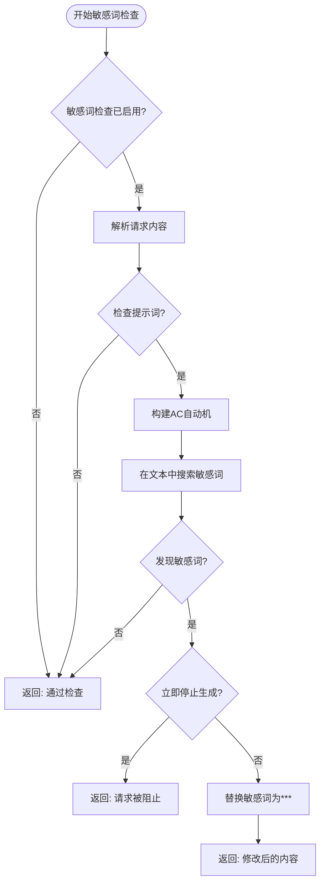
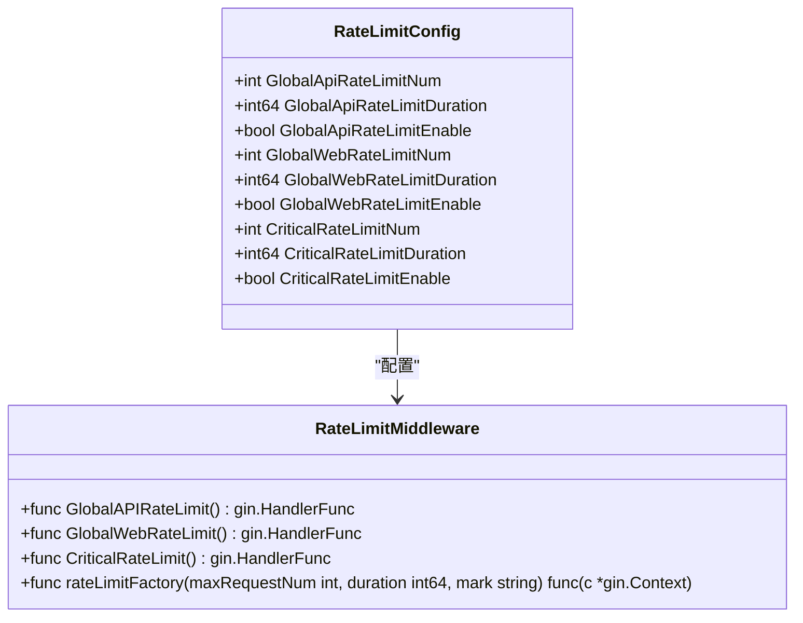
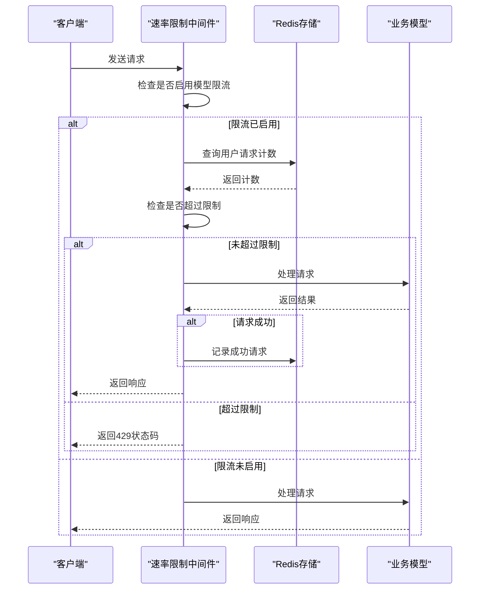
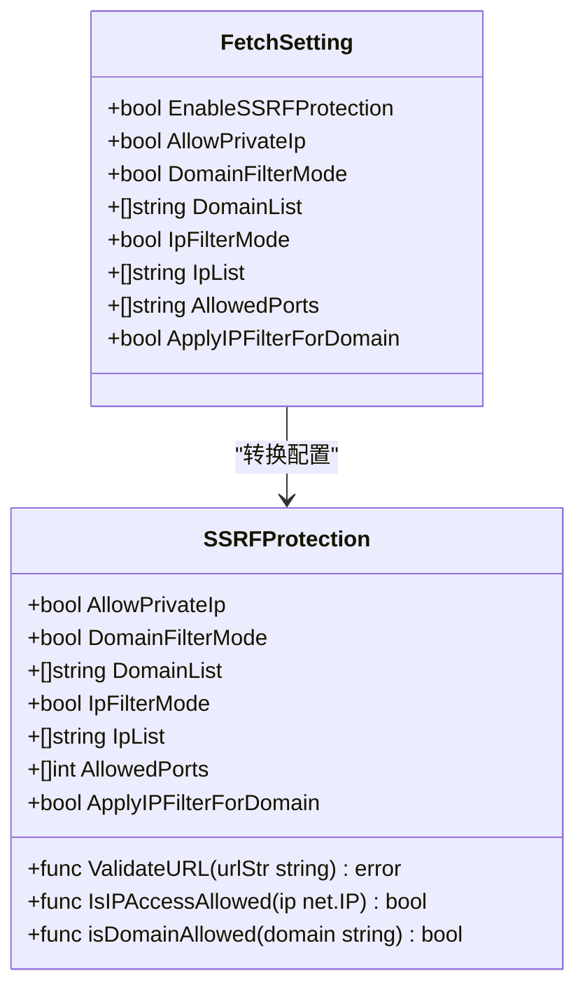
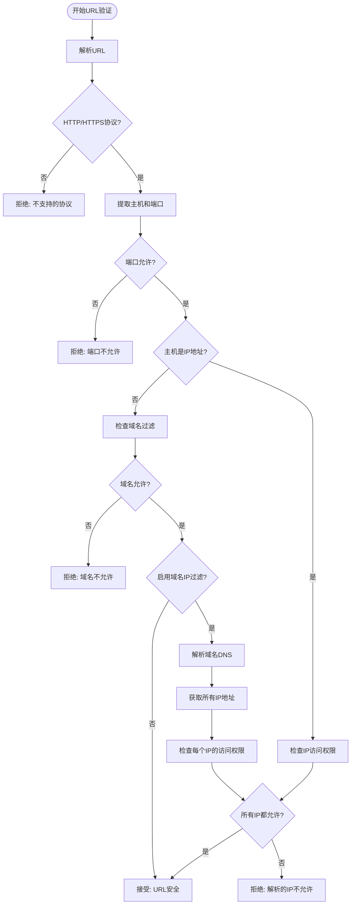
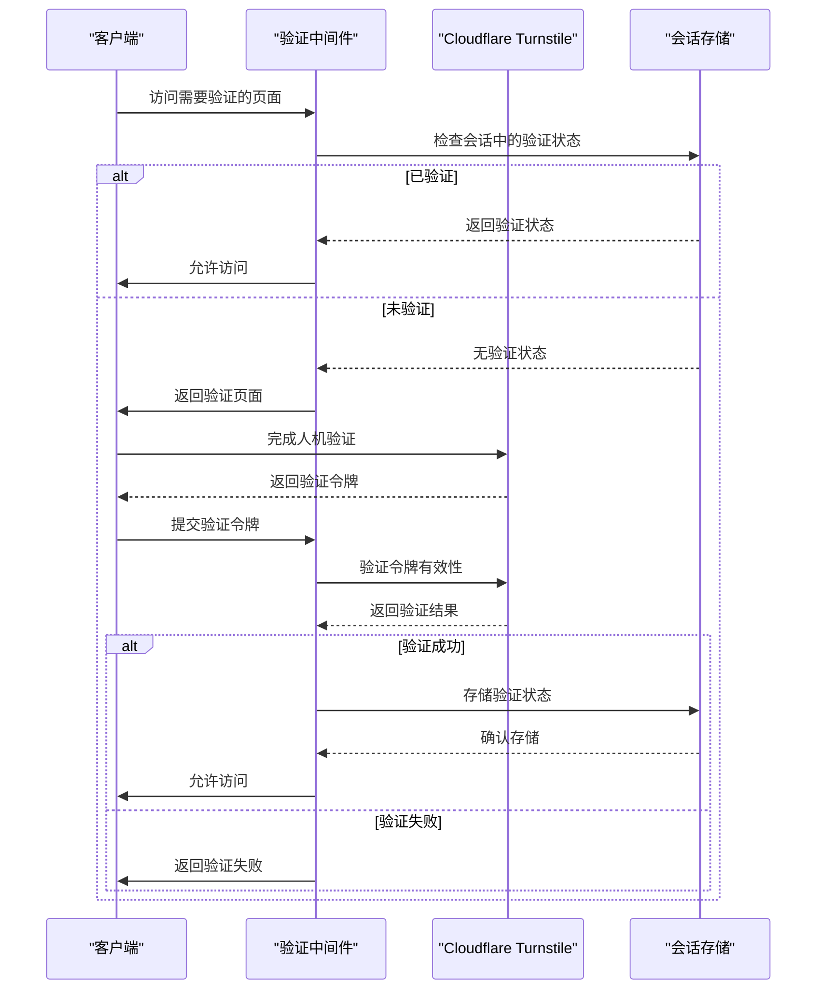
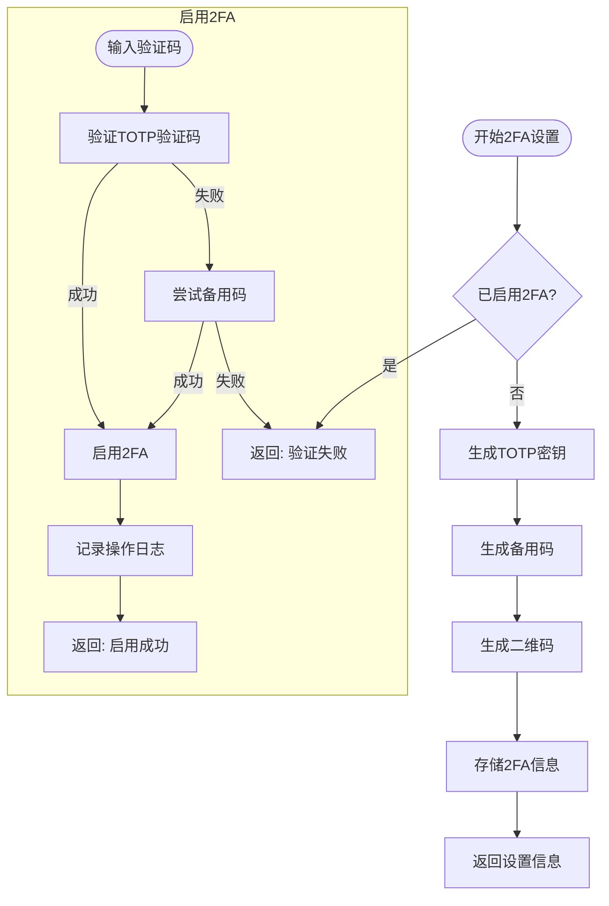
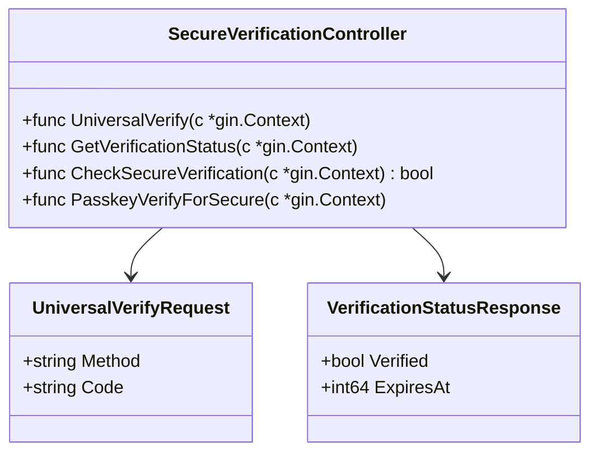
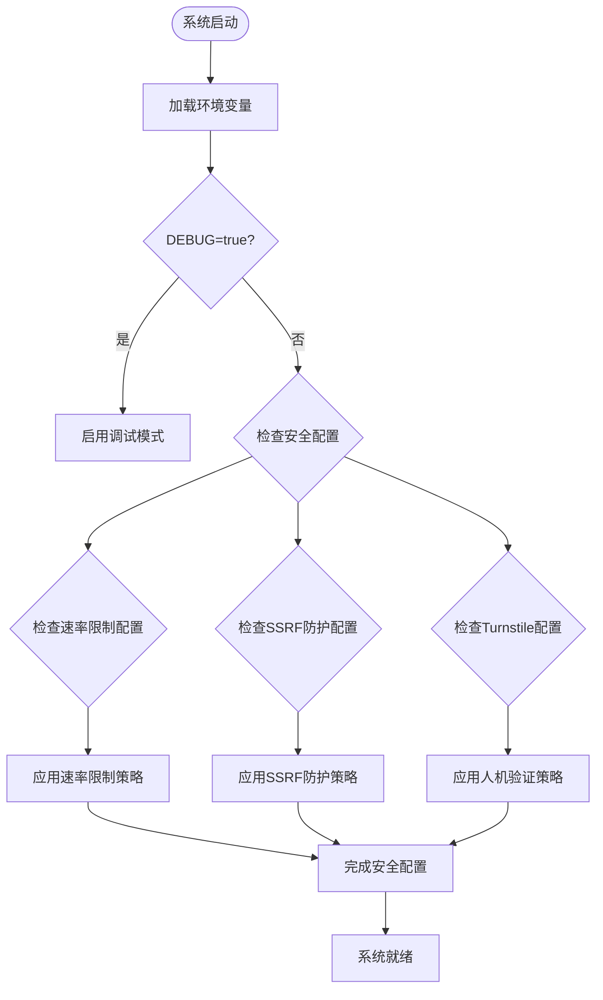

# 安全配置

<cite>
**本文档引用的文件**   
- [common/ssrf_protection.go](file://common/ssrf_protection.go)
- [middleware/rate-limit.go](file://middleware/rate-limit.go)
- [middleware/model-rate-limit.go](file://middleware/model-rate-limit.go)
- [middleware/turnstile-check.go](file://middleware/turnstile-check.go)
- [controller/twofa.go](file://controller/twofa.go)
- [controller/secure_verification.go](file://controller/secure_verification.go)
- [setting/sensitive.go](file://setting/sensitive.go)
- [service/sensitive.go](file://service/sensitive.go)
- [dto/sensitive.go](file://dto/sensitive.go)
- [common/init.go](file://common/init.go)
- [constant/env.go](file://constant/env.go)
- [setting/rate_limit.go](file://setting/rate_limit.go)
- [web/src/components/settings/SystemSetting.jsx](file://web/src/components/settings/SystemSetting.jsx)
- [setting/system_setting/fetch_setting.go](file://setting/system_setting/fetch_setting.go)
</cite>

## 目录
1. [引言](#引言)
2. [敏感词过滤机制](#敏感词过滤机制)
3. [速率限制系统](#速率限制系统)
4. [SSRF防护机制](#ssrf防护机制)
5. [人机验证与安全验证](#人机验证与安全验证)
6. [双因素认证(2FA)](#双因素认证2fa)
7. [安全策略最佳实践](#安全策略最佳实践)
8. [结论](#结论)

## 引言
本安全配置指南详细介绍了系统中的核心安全机制，包括敏感词过滤、速率限制、SSRF防护、Turnstile人机验证、邮箱安全验证和双因素认证(2FA)等。文档将深入解析各安全功能的实现原理、配置方式和控制逻辑，帮助管理员全面理解和配置系统的安全策略，以平衡安全性与用户体验。

## 敏感词过滤机制

### 敏感词匹配算法
系统采用高效的AC自动机（Aho-Corasick）算法实现敏感词匹配，该算法能够在一次扫描中同时匹配多个敏感词，具有优秀的性能表现。当用户提交请求时，系统会自动检查请求内容中是否包含预定义的敏感词。

敏感词匹配流程如下：
1. 将所有敏感词构建成AC自动机状态机
2. 对输入文本进行小写转换以实现不区分大小写的匹配
3. 使用AC自动机在文本中搜索所有匹配的敏感词
4. 根据配置决定是阻止请求还是替换敏感词

**图源**
- [service/sensitive.go](file://service/sensitive.go#L39-L49)
- [setting/sensitive.go](file://setting/sensitive.go#L17-L20)

### 敏感词配置方式
敏感词配置通过以下变量和方法实现：

- `CheckSensitiveEnabled`: 全局敏感词检查开关
- `CheckSensitiveOnPromptEnabled`: 是否检查提示词中的敏感词
- `StopOnSensitiveEnabled`: 检测到敏感词时是否立即停止生成
- `SensitiveWords`: 敏感词列表，支持通过`SensitiveWordsFromString`和`SensitiveWordsToString`方法进行字符串与列表的转换

管理员可以通过系统设置界面或直接修改配置文件来管理敏感词列表。敏感词列表支持换行分隔的文本格式，系统会自动去除空白字符并过滤空项。

**本节源**
- [setting/sensitive.go](file://setting/sensitive.go#L5-L44)
- [service/sensitive.go](file://service/sensitive.go#L11-L78)

## 速率限制系统

### 全局与模型级速率限制
系统实现了多层次的速率限制机制，包括全局速率限制和模型级速率限制，以应对不同场景的安全需求。

#### 全局速率限制
全局速率限制作用于整个API和Web接口，防止大规模的滥用行为。配置参数如下：

- **全局API速率限制**: 控制API接口的请求频率
- **全局Web速率限制**: 控制Web界面的请求频率
- **关键操作速率限制**: 保护登录、注册等关键操作

**图源**
- [common/init.go](file://common/init.go#L101-L112)
- [middleware/rate-limit.go](file://middleware/rate-limit.go#L90-L117)

#### 模型级速率限制
模型级速率限制针对特定用户组和模型提供更精细的控制，支持基于Redis或内存的存储后端。

**图源**
- [middleware/model-rate-limit.go](file://middleware/model-rate-limit.go#L166-L201)
- [setting/rate_limit.go](file://setting/rate_limit.go#L12-L70)

### 速率限制实现差异
全局速率限制和模型级速率限制在实现上存在以下差异：

| 特性 | 全局速率限制 | 模型级速率限制 |
|------|------------|--------------|
| **作用范围** | 整个API/Web接口 | 特定用户组和模型 |
| **存储后端** | Redis或内存 | Redis或内存 |
| **计数维度** | 基于IP地址 | 基于用户ID |
| **配置粒度** | 全局统一配置 | 支持分组个性化配置 |
| **应用场景** | 防止大规模滥用 | 防止特定用户滥用 |

模型级速率限制还支持区分成功请求和总请求的限制，提供了更灵活的控制能力。当使用Redis作为存储后端时，系统采用令牌桶算法结合列表数据结构实现精确的速率控制。

**本节源**
- [middleware/rate-limit.go](file://middleware/rate-limit.go#L15-L118)
- [middleware/model-rate-limit.go](file://middleware/model-rate-limit.go#L24-L130)
- [setting/rate_limit.go](file://setting/rate_limit.go#L12-L70)

## SSRF防护机制

### SSRF防护配置
SSRF（服务器端请求伪造）防护机制用于防止攻击者利用服务器发起恶意的内部网络请求。系统提供了全面的SSRF防护配置选项：

**图源**
- [common/ssrf_protection.go](file://common/ssrf_protection.go#L12-L30)
- [setting/system_setting/fetch_setting.go](file://setting/system_setting/fetch_setting.go#L5-L14)

### 防护规则详解
SSRF防护机制通过多层次的验证规则确保请求的安全性：

1. **协议限制**: 只允许HTTP和HTTPS协议
2. **IP地址过滤**: 支持白名单和黑名单模式，可阻止私有IP地址访问
3. **域名过滤**: 支持通配符匹配的域名白名单/黑名单
4. **端口限制**: 可配置允许访问的端口范围
5. **DNS解析后IP验证**: 对域名解析后的IP地址进行二次验证

防护流程如下：

**图源**
- [common/ssrf_protection.go](file://common/ssrf_protection.go#L223-L304)

### 配置管理
SSRF防护配置可通过环境变量或系统设置界面进行管理。默认配置启用SSRF防护，允许标准HTTP(80)和HTTPS(443)端口访问，但禁止访问私有IP地址。

管理员可以在系统设置中配置以下选项：
- 启用/禁用SSRF防护
- 配置域名白名单/黑名单
- 配置IP地址白名单/黑名单
- 设置允许的端口范围
- 启用对域名的IP过滤（实验性功能）

**本节源**
- [common/ssrf_protection.go](file://common/ssrf_protection.go#L1-L328)
- [setting/system_setting/fetch_setting.go](file://setting/system_setting/fetch_setting.go#L16-L34)
- [web/src/components/settings/SystemSetting.jsx](file://web/src/components/settings/SystemSetting.jsx#L102-L978)

## 人机验证与安全验证

### Turnstile人机验证
Turnstile人机验证用于防止自动化脚本和机器人滥用系统资源。该功能通过Cloudflare Turnstile服务实现无感验证。

**图源**
- [middleware/turnstile-check.go](file://middleware/turnstile-check.go#L17-L82)
- [web/src/components/settings/SystemSetting.jsx](file://web/src/components/settings/SystemSetting.jsx#L1593-L1618)

### 邮箱安全验证
系统实现了邮箱发送的速率限制，防止滥用邮箱验证功能。配置参数如下：

- `EmailVerificationMaxRequests`: 30秒内最多发送次数
- `EmailVerificationDuration`: 时间窗口（秒）

邮箱验证速率限制使用Redis的INCR命令实现原子性计数，确保在高并发场景下的准确性。

**本节源**
- [middleware/turnstile-check.go](file://middleware/turnstile-check.go#L1-L82)
- [middleware/email-verification-rate-limit.go](file://middleware/email-verification-rate-limit.go#L1-L82)
- [web/src/components/auth/PasswordResetForm.jsx](file://web/src/components/auth/PasswordResetForm.jsx#L44-L80)
- [web/src/components/settings/PersonalSetting.jsx](file://web/src/components/settings/PersonalSetting.jsx#L91-L130)

## 双因素认证(2FA)

### 2FA实现流程
双因素认证(2FA)通过TOTP（基于时间的一次性密码）算法实现，提供额外的安全层保护用户账户。

**图源**
- [controller/twofa.go](file://controller/twofa.go#L33-L202)
- [controller/twofa.go](file://controller/twofa.go#L137-L202)

### 通用安全验证
系统提供了通用安全验证接口，支持多种验证方式的统一管理：

通用验证支持2FA和Passkey两种验证方式，验证成功后在会话中记录时间戳，有效期为5分钟。这种设计允许在执行敏感操作时要求用户重新进行身份验证。

**本节源**
- [controller/twofa.go](file://controller/twofa.go#L1-L555)
- [controller/secure_verification.go](file://controller/secure_verification.go#L1-L315)

## 安全策略最佳实践

### 安全开关控制逻辑
系统的安全开关通过环境变量和配置文件进行控制，遵循以下原则：

1. **环境变量优先**: 环境变量的配置优先级高于默认值
2. **默认安全**: 大多数安全功能默认启用，确保新部署的安全性
3. **动态配置**: 部分配置支持运行时修改，无需重启服务

关键安全相关的环境变量包括：
- `TURNSTILE_CHECK_ENABLED`: 控制Turnstile人机验证的启用状态
- `GLOBAL_API_RATE_LIMIT_ENABLE`: 控制全局API速率限制
- `ENABLE_SSRF_PROTECTION`: 控制SSRF防护的启用状态

**图源**
- [common/init.go](file://common/init.go#L80-L150)
- [constant/env.go](file://constant/env.go#L1-L22)

### 安全性与用户体验平衡
在配置安全策略时，需要在安全性和用户体验之间找到平衡点：

1. **渐进式安全**: 对新用户采用较宽松的策略，随着账户价值增加逐步加强安全措施
2. **智能限流**: 基于用户行为模式的智能限流，避免误伤正常用户
3. **多因素验证**: 提供多种验证方式（2FA、Passkey），让用户选择最适合自己的方式
4. **清晰的错误信息**: 提供明确的错误信息和解决方案，减少用户困惑

### 高并发场景防护策略
针对高并发场景，建议采用以下优化策略：

1. **Redis后端**: 使用Redis作为速率限制的存储后端，提高性能和一致性
2. **分层限流**: 实施多层次的限流策略，从IP级到用户级再到操作级
3. **缓存优化**: 合理配置内存缓存，减少数据库查询压力
4. **监控告警**: 建立完善的监控系统，及时发现异常流量模式

**本节源**
- [common/init.go](file://common/init.go#L80-L150)
- [constant/env.go](file://constant/env.go#L1-L22)
- [setting/rate_limit.go](file://setting/rate_limit.go#L12-L70)

## 结论
本安全配置指南全面介绍了系统的各项安全机制，包括敏感词过滤、速率限制、SSRF防护、人机验证和双因素认证等核心功能。通过合理的配置和管理，可以有效提升系统的安全性，防止各种滥用行为。建议管理员根据实际需求和风险评估，制定适合的安全策略，在保障安全的同时提供良好的用户体验。