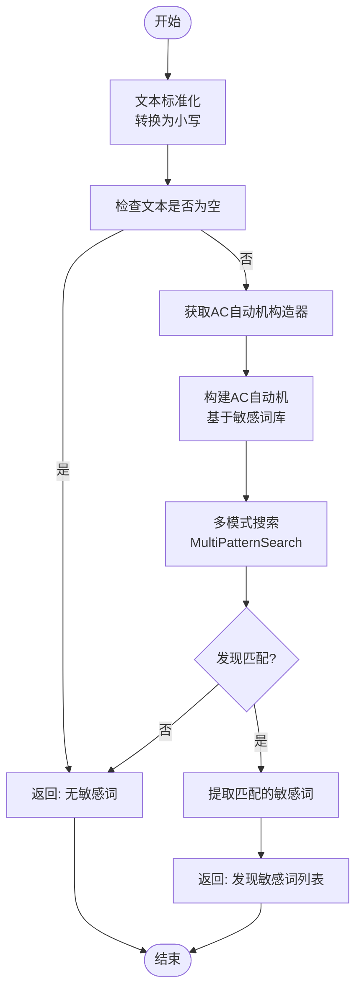
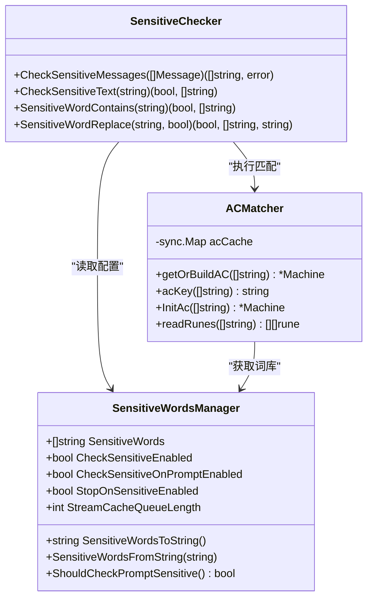
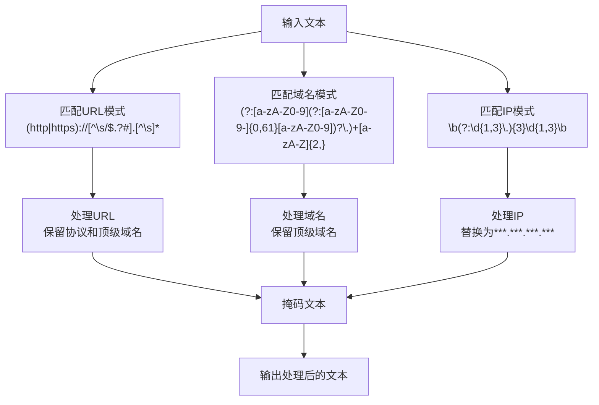
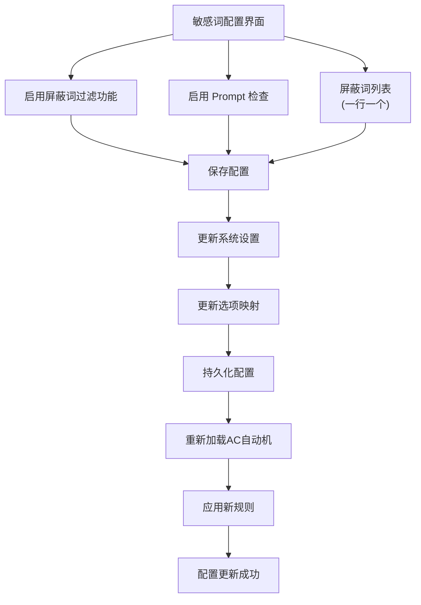
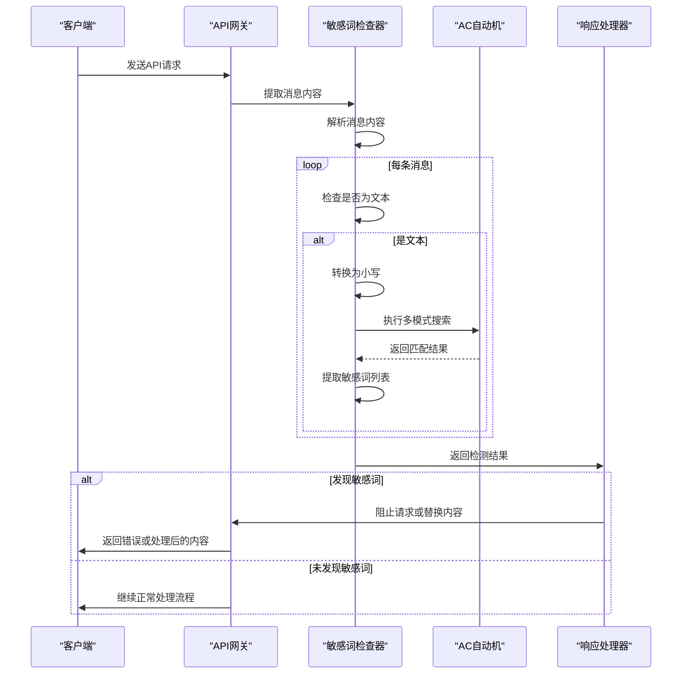

# 敏感词过滤

<cite>
**本文档引用的文件**   
- [sensitive.go](file://service/sensitive.go)
- [str.go](file://service/str.go)
- [sensitive.go](file://setting/sensitive.go)
- [SettingsSensitiveWords.jsx](file://web/src/pages/Setting/Operation/SettingsSensitiveWords.jsx)
- [sensitive.go](file://dto/sensitive.go)
</cite>

## 目录
1. [简介](#简介)
2. [敏感词匹配算法](#敏感词匹配算法)
3. [敏感词库加载与更新策略](#敏感词库加载与更新策略)
4. [正则表达式高级模式匹配](#正则表达式高级模式匹配)
5. [敏感词规则配置](#敏感词规则配置)
6. [敏感词检测流程](#敏感词检测流程)
7. [内容安全与误判率平衡](#内容安全与误判率平衡)
8. [性能优化建议](#性能优化建议)
9. [总结](#总结)

## 简介
本系统实现了完整的敏感词过滤机制，用于检测和处理用户输入中的敏感内容。该机制采用高效的字符串匹配算法，支持精确匹配和模糊匹配，能够有效识别潜在的敏感信息。系统通过配置化的方式管理敏感词库，支持动态更新和实时生效。敏感词检测贯穿于API请求处理的各个阶段，确保内容安全。同时，系统提供了灵活的配置选项，允许管理员根据实际需求调整敏感词过滤策略。

**Section sources**
- [sensitive.go](file://service/sensitive.go#L1-L77)
- [sensitive.go](file://setting/sensitive.go#L1-L43)

## 敏感词匹配算法
系统采用AC自动机（Aho-Corasick算法）作为核心的多模式字符串匹配算法，用于高效地检测文本中的敏感词。AC自动机是一种基于有限状态机的算法，能够在一次扫描中同时匹配多个模式串，时间复杂度接近O(n)，其中n是待检测文本的长度。



**Diagram sources**
- [str.go](file://service/str.go#L132-L152)
- [sensitive.go](file://service/sensitive.go#L40-L48)

**Section sources**
- [str.go](file://service/str.go#L132-L152)
- [sensitive.go](file://service/sensitive.go#L40-L48)

## 敏感词库加载与更新策略
敏感词库通过配置文件或管理界面进行管理，系统在启动时加载默认的敏感词列表，并支持运行时动态更新。敏感词库的更新采用内存缓存机制，确保更新后的词库能够立即生效，同时避免频繁的IO操作影响性能。



**Diagram sources**
- [sensitive.go](file://setting/sensitive.go#L5-L20)
- [str.go](file://service/str.go#L73-L118)
- [sensitive.go](file://service/sensitive.go#L11-L77)

**Section sources**
- [sensitive.go](file://setting/sensitive.go#L5-L20)
- [str.go](file://service/str.go#L73-L118)

## 正则表达式高级模式匹配
除了基于AC自动机的精确匹配外，系统还支持通过正则表达式进行高级模式匹配，用于识别复杂的敏感内容模式，如URL、IP地址、邮箱等。这些正则表达式模式被集成到敏感信息过滤器中，提供更全面的内容安全保护。



**Diagram sources**
- [str.go](file://common/str.go#L15-L20)
- [str.go](file://common/str.go#L167-L239)

**Section sources**
- [str.go](file://common/str.go#L15-L20)
- [str.go](file://common/str.go#L167-L239)

## 敏感词规则配置
敏感词规则可以通过管理界面进行配置，支持启用/禁用敏感词过滤功能、设置检测范围（如仅检测Prompt）以及添加或删除敏感词。配置界面提供友好的用户交互，允许管理员通过文本区域批量管理敏感词列表。



**Diagram sources**
- [SettingsSensitiveWords.jsx](file://web/src/pages/Setting/Operation/SettingsSensitiveWords.jsx#L31-L157)
- [option.go](file://model/option.go#L140-L146)

**Section sources**
- [SettingsSensitiveWords.jsx](file://web/src/pages/Setting/Operation/SettingsSensitiveWords.jsx#L31-L157)
- [option.go](file://model/option.go#L140-L146)

## 敏感词检测流程
敏感词检测流程集成在API请求处理的早期阶段，对用户输入的内容进行实时检查。系统首先解析请求中的消息内容，然后对每条消息的文本部分进行敏感词检测。如果发现敏感词，根据配置决定是阻止请求还是替换敏感词。



**Diagram sources**
- [sensitive.go](file://service/sensitive.go#L11-L32)
- [adaptor.go](file://relay/channel/openai/adaptor.go#L36-L200)

**Section sources**
- [sensitive.go](file://service/sensitive.go#L11-L32)
- [adaptor.go](file://relay/channel/openai/adaptor.go#L36-L200)

## 内容安全与误判率平衡
系统通过多种策略来平衡内容安全与误判率。首先，敏感词匹配不区分大小写，提高了匹配的准确性。其次，系统支持配置是否在检测到敏感词时立即停止生成，或者仅替换敏感词内容。此外，通过AC自动机的缓存机制，确保了高性能的同时减少了误判的可能性。

**Section sources**
- [sensitive.go](file://setting/sensitive.go#L10-L11)
- [sensitive.go](file://service/sensitive.go#L51-L77)

## 性能优化建议
为确保敏感词过滤机制的高性能，系统采用了多项优化措施。首先，使用AC自动机算法实现高效的多模式匹配，时间复杂度接近线性。其次，通过sync.Map实现AC自动机的缓存，避免重复构建状态机。此外，使用strings.Builder优化字符串拼接操作，减少内存分配。最后，对敏感词库进行哈希键值缓存，确保快速查找和比较。

```mermaid
graph TD
A[性能优化] --> B[AC自动机算法]
A --> C[AC自动机缓存]
A --> D[Strings.Builder]
A --> E[哈希键值缓存]
A --> F[内存池优化]
B --> G[O(n)时间复杂度]
C --> H[避免重复构建]
D --> I[减少内存分配]
E --> J[快速查找比较]
F --> K[减少GC压力]
G --> L[高效匹配]
H --> L
I --> L
J --> L
K --> L
L --> M[低延迟敏感词检测]
```

**Diagram sources**
- [str.go](file://service/str.go#L73-L118)
- [sensitive.go](file://service/sensitive.go#L56-L74)

**Section sources**
- [str.go](file://service/str.go#L73-L118)
- [sensitive.go](file://service/sensitive.go#L56-L74)

## 总结
本敏感词过滤机制通过AC自动机算法实现了高效的多模式字符串匹配，结合正则表达式模式匹配，提供了全面的内容安全保护。系统支持灵活的配置管理，允许管理员根据实际需求调整敏感词过滤策略。通过内存缓存和性能优化技术，确保了在高并发场景下的低延迟和高吞吐量。该机制有效地平衡了内容安全与误判率，为系统提供了可靠的安全保障。