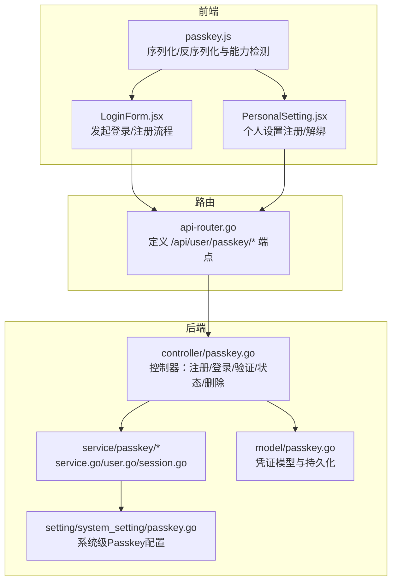
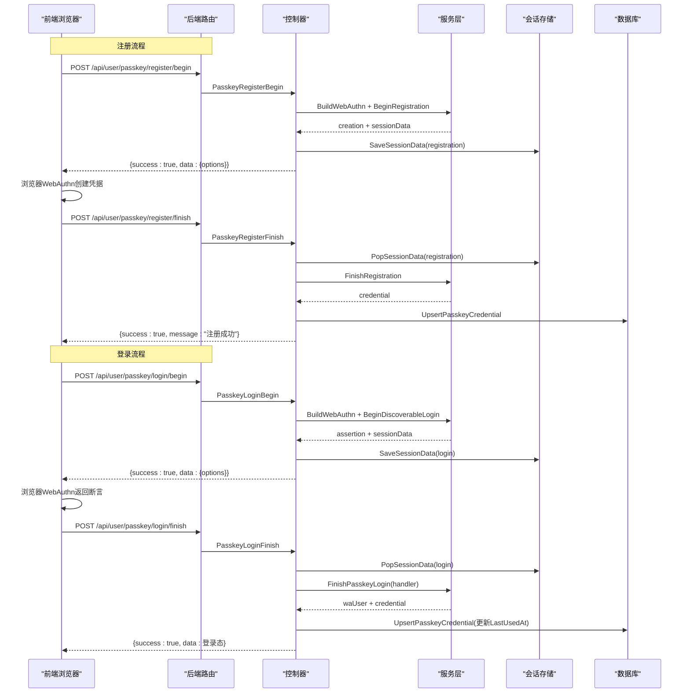
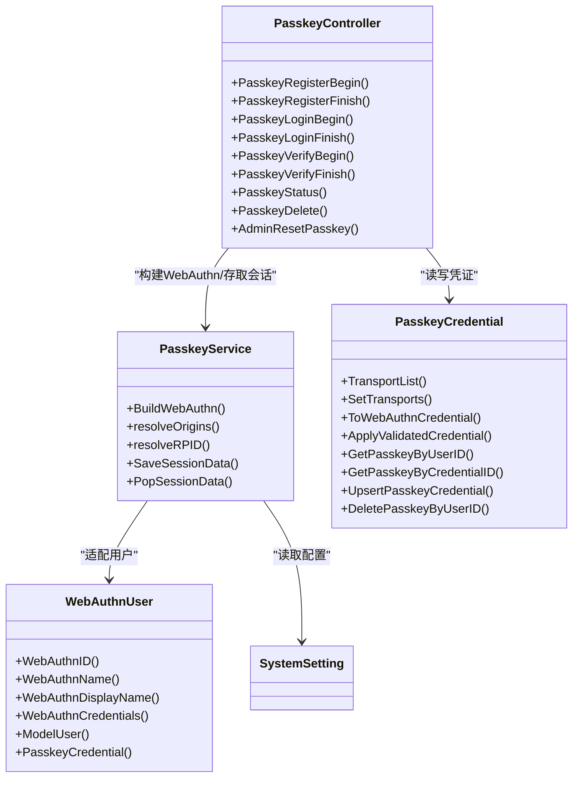

# Passkey认证

<cite>
**本文引用的文件列表**
- [controller/passkey.go](file://controller/passkey.go)
- [service/passkey/service.go](file://service/passkey/service.go)
- [service/passkey/user.go](file://service/passkey/user.go)
- [service/passkey/session.go](file://service/passkey/session.go)
- [model/passkey.go](file://model/passkey.go)
- [setting/system_setting/passkey.go](file://setting/system_setting/passkey.go)
- [router/api-router.go](file://router/api-router.go)
- [web/src/helpers/passkey.js](file://web/src/helpers/passkey.js)
- [web/src/components/auth/LoginForm.jsx](file://web/src/components/auth/LoginForm.jsx)
- [web/src/components/settings/PersonalSetting.jsx](file://web/src/components/settings/PersonalSetting.jsx)
- [web/src/components/settings/SystemSetting.jsx](file://web/src/components/settings/SystemSetting.jsx)
- [common/constants.go](file://common/constants.go)
</cite>

## 目录
1. [简介](#简介)
2. [项目结构](#项目结构)
3. [核心组件](#核心组件)
4. [架构总览](#架构总览)
5. [详细组件分析](#详细组件分析)
6. [依赖关系分析](#依赖关系分析)
7. [性能与安全特性](#性能与安全特性)
8. [故障排查指南](#故障排查指南)
9. [结论](#结论)
10. [附录：配置与使用流程](#附录配置与使用流程)

## 简介
本文件系统性文档化本仓库中的Passkey（FIDO2/WebAuthn）认证实现，覆盖以下方面：
- PasskeyService如何处理注册与登录挑战的生成与验证，包括公钥凭证的创建、存储与使用
- PasskeyController中API端点的处理逻辑及与前端的JSON数据交换
- 系统管理员如何在设置中启用Passkey功能
- 用户如何在个人设置中注册与管理自己的Passkey
- 安全性优势（防钓鱼、无密码体验）
- 浏览器与平台兼容性指南
- 常见问题（注册失败、认证超时等）的定位与解决思路

## 项目结构
Passkey相关代码分布在后端控制器、服务层、模型层、系统设置与前端辅助工具与界面组件中，形成“前端浏览器原生WebAuthn调用—后端构建WebAuthn实例—会话存储—模型持久化”的闭环。

图表来源
- [controller/passkey.go](file://controller/passkey.go#L1-L498)
- [service/passkey/service.go](file://service/passkey/service.go#L1-L178)
- [service/passkey/user.go](file://service/passkey/user.go#L1-L72)
- [service/passkey/session.go](file://service/passkey/session.go#L1-L51)
- [model/passkey.go](file://model/passkey.go#L1-L211)
- [setting/system_setting/passkey.go](file://setting/system_setting/passkey.go#L1-L51)
- [router/api-router.go](file://router/api-router.go#L1-L261)
- [web/src/helpers/passkey.js](file://web/src/helpers/passkey.js#L1-L178)
- [web/src/components/auth/LoginForm.jsx](file://web/src/components/auth/LoginForm.jsx#L360-L559)
- [web/src/components/settings/PersonalSetting.jsx](file://web/src/components/settings/PersonalSetting.jsx#L1-L262)

章节来源
- [router/api-router.go](file://router/api-router.go#L56-L78)

## 核心组件
- 控制器层：负责HTTP端点、鉴权与业务编排，包括注册开始/结束、登录开始/结束、验证开始/结束、状态查询、删除、管理员重置等。
- 服务层：封装WebAuthn实例构建、RPID/Origins解析、会话数据存取、用户适配器等。
- 模型层：定义Passkey凭证结构、序列化/反序列化、数据库读写与更新。
- 前端：通过浏览器WebAuthn接口与后端交互，完成挑战下发、凭据生成/验证、结果回传。

章节来源
- [controller/passkey.go](file://controller/passkey.go#L1-L498)
- [service/passkey/service.go](file://service/passkey/service.go#L1-L178)
- [service/passkey/user.go](file://service/passkey/user.go#L1-L72)
- [service/passkey/session.go](file://service/passkey/session.go#L1-L51)
- [model/passkey.go](file://model/passkey.go#L1-L211)

## 架构总览
后端通过系统设置动态构建WebAuthn实例，控制器根据请求生成挑战并借助会话存储传递SessionData，前端使用浏览器原生WebAuthn完成注册/登录，后端完成Finish阶段校验与凭证持久化。

图表来源
- [controller/passkey.go](file://controller/passkey.go#L21-L142)
- [controller/passkey.go](file://controller/passkey.go#L203-L327)
- [service/passkey/service.go](file://service/passkey/service.go#L25-L80)
- [service/passkey/session.go](file://service/passkey/session.go#L14-L51)
- [model/passkey.go](file://model/passkey.go#L180-L197)

## 详细组件分析

### 控制器：PasskeyController
- 注册开始/结束
  - 注册开始：检查系统开关、获取当前用户、构建WebAuthn实例、可选排除已有凭证、生成注册挑战并保存SessionData。
  - 注册结束：取出SessionData、FinishRegistration、转换为模型、Upsert持久化。
- 登录开始/结束
  - 登录开始：构建WebAuthn实例、BeginDiscoverableLogin生成断言挑战并保存SessionData。
  - 登录结束：取出SessionData、FinishPasskeyLogin并自定义handler解析用户、校验状态、更新凭证LastUsedAt并建立登录态。
- 验证开始/结束
  - 验证开始：用户态下生成普通登录挑战并保存SessionData。
  - 验证结束：取出SessionData、FinishLogin、更新LastUsedAt。
- 其他
  - 状态查询：返回是否已绑定、最近使用时间。
  - 删除：按用户ID删除Passkey记录。
  - 管理员重置：按用户ID删除其Passkey记录。

章节来源
- [controller/passkey.go](file://controller/passkey.go#L21-L142)
- [controller/passkey.go](file://controller/passkey.go#L144-L163)
- [controller/passkey.go](file://controller/passkey.go#L165-L201)
- [controller/passkey.go](file://controller/passkey.go#L203-L327)
- [controller/passkey.go](file://controller/passkey.go#L329-L363)
- [controller/passkey.go](file://controller/passkey.go#L365-L477)

### 服务层：PasskeyService
- WebAuthn实例构建
  - 从系统设置读取显示名、RPID、Origins、用户验证策略、附件偏好等。
  - 自动推导RPID与Origins，支持HTTPS与可选允许不安全Origin。
  - 设置超时策略（登录/注册均强制2分钟）。
- 用户适配器
  - 实现WebAuthnUser接口，提供ID、名称、显示名、现有凭证集合等。
- 会话数据存取
  - 将SessionData序列化后存入Gin会话；取出时反序列化并删除，防止重放。

章节来源
- [service/passkey/service.go](file://service/passkey/service.go#L25-L80)
- [service/passkey/service.go](file://service/passkey/service.go#L82-L178)
- [service/passkey/user.go](file://service/passkey/user.go#L1-L72)
- [service/passkey/session.go](file://service/passkey/session.go#L1-L51)

### 模型层：PasskeyCredential
- 数据结构
  - 字段覆盖CredentialID、PublicKey、AttestationType、AAGUID、SignCount、Flags、Transports、Attachment、LastUsedAt等。
- 序列化/反序列化
  - 将数据库字符串转为WebAuthn传输列表；将传输列表编码为JSON字符串。
  - 将WebAuthn Credential映射到模型字段，含Flags与Authenticator子结构。
- 数据访问
  - 按用户ID或凭证ID查询；Upsert时先硬删除再创建，确保唯一性；删除按用户ID硬删除。

章节来源
- [model/passkey.go](file://model/passkey.go#L23-L122)
- [model/passkey.go](file://model/passkey.go#L142-L211)

### 前端：浏览器与界面交互
- 登录页
  - 发起登录开始请求，准备断言参数，调用navigator.credentials.get，构造断言结果并提交登录结束请求。
- 个人设置
  - 注册：发起注册开始请求，准备创建参数，调用navigator.credentials.create，构造注册结果并提交注册结束请求。
  - 解绑：删除用户绑定的Passkey记录。
- 辅助工具
  - base64Url与ArrayBuffer互转、准备创建/请求参数、构建注册/断言结果、检测浏览器支持能力。

章节来源
- [web/src/components/auth/LoginForm.jsx](file://web/src/components/auth/LoginForm.jsx#L360-L559)
- [web/src/components/settings/PersonalSetting.jsx](file://web/src/components/settings/PersonalSetting.jsx#L1-L262)
- [web/src/helpers/passkey.js](file://web/src/helpers/passkey.js#L1-L178)

### 系统设置：Passkey配置
- 配置项
  - enabled、rp_display_name、rp_id、origins、allow_insecure_origin、user_verification、attachment_preference。
- 默认值与推导
  - 若未显式配置RPID/Origins，则从ServerAddress推导；默认user_verification为preferred。
- 前端系统设置界面
  - 提供开关与表单项，保存为系统选项键值。

章节来源
- [setting/system_setting/passkey.go](file://setting/system_setting/passkey.go#L1-L51)
- [web/src/components/settings/SystemSetting.jsx](file://web/src/components/settings/SystemSetting.jsx#L639-L1219)

## 依赖关系分析

图表来源
- [controller/passkey.go](file://controller/passkey.go#L1-L498)
- [service/passkey/service.go](file://service/passkey/service.go#L1-L178)
- [service/passkey/user.go](file://service/passkey/user.go#L1-L72)
- [model/passkey.go](file://model/passkey.go#L1-L211)
- [setting/system_setting/passkey.go](file://setting/system_setting/passkey.go#L1-L51)

章节来源
- [controller/passkey.go](file://controller/passkey.go#L1-L498)
- [service/passkey/service.go](file://service/passkey/service.go#L1-L178)
- [service/passkey/user.go](file://service/passkey/user.go#L1-L72)
- [model/passkey.go](file://model/passkey.go#L1-L211)

## 性能与安全特性
- 性能
  - 会话数据采用JSON序列化后存入Gin会话，避免跨进程共享，减少外部依赖。
  - 登录/注册超时统一为2分钟，有助于降低资源占用与风险暴露窗口。
- 安全
  - 严格校验用户状态与会话存在性，防止未授权访问。
  - 支持用户验证策略（如preferred），提升交互安全性。
  - 通过RPID/Origins约束，防止跨站伪造挑战。
  - 凭证更新时原子性地替换旧记录，避免唯一索引冲突导致的数据漂移。

章节来源
- [service/passkey/service.go](file://service/passkey/service.go#L25-L80)
- [service/passkey/session.go](file://service/passkey/session.go#L14-L51)
- [model/passkey.go](file://model/passkey.go#L180-L197)
- [controller/passkey.go](file://controller/passkey.go#L21-L79)

## 故障排查指南
- 管理员未启用Passkey
  - 现象：注册/登录/验证接口直接返回未启用提示。
  - 处理：在系统设置中开启Passkey开关并正确配置RPID/Origins。
- 会话不存在或已过期
  - 现象：Finish阶段PopSessionData报错。
  - 处理：确保注册/登录开始后立即在同一次会话内完成Finish；检查浏览器会话Cookie与有效期。
- Origin不合法或HTTPS缺失
  - 现象：构建WebAuthn时报错，提示不允许不安全Origin或需要HTTPS。
  - 处理：在Passkey设置中允许不安全Origin或配置HTTPS；确保Origins与ServerAddress一致且为https。
- 用户被禁用
  - 现象：登录结束时返回用户被禁用。
  - 处理：检查用户状态，恢复后再试。
- 凭证不存在或不匹配
  - 现象：验证/登录开始时提示尚未绑定或找不到凭证。
  - 处理：确认用户已注册Passkey；若凭证异常，管理员可重置。
- 浏览器不支持或能力不足
  - 现象：前端检测到不支持Passkey。
  - 处理：升级浏览器至支持WebAuthn的版本；确保设备具备平台/硬件认证器。
- 超时或中断
  - 现象：注册/登录超时或用户取消。
  - 处理：延长超时或重新发起流程；避免长时间静默；检查网络与设备稳定性。

章节来源
- [controller/passkey.go](file://controller/passkey.go#L21-L79)
- [service/passkey/service.go](file://service/passkey/service.go#L82-L178)
- [service/passkey/session.go](file://service/passkey/session.go#L28-L51)
- [web/src/helpers/passkey.js](file://web/src/helpers/passkey.js#L150-L178)
- [web/src/components/auth/LoginForm.jsx](file://web/src/components/auth/LoginForm.jsx#L360-L559)
- [web/src/components/settings/PersonalSetting.jsx](file://web/src/components/settings/PersonalSetting.jsx#L1-L262)

## 结论
本实现以WebAuthn为核心，结合系统设置与会话存储，提供了完整的Passkey注册与登录闭环。通过严格的Origin/RPID校验、用户状态检查与凭证原子更新，保障了安全性与一致性。前端通过浏览器原生能力与统一的序列化工具，简化了与后端的交互。管理员可通过系统设置灵活控制策略，用户可在个人设置中便捷注册与解绑。

## 附录：配置与使用流程

### 管理员启用Passkey
- 在系统设置界面勾选“允许通过Passkey登录&认证”，并填写：
  - RP Display Name（显示名）
  - RP ID（可留空，将从ServerAddress推导）
  - Allow Insecure Origin（仅开发调试时启用）
  - User Verification（如preferred）
  - Attachment Preference（如platform）
  - Origins（多个Origin用逗号分隔，必须为https）
- 保存后，后端将据此构建WebAuthn实例并生效。

章节来源
- [setting/system_setting/passkey.go](file://setting/system_setting/passkey.go#L1-L51)
- [web/src/components/settings/SystemSetting.jsx](file://web/src/components/settings/SystemSetting.jsx#L639-L1219)

### 用户注册与管理Passkey
- 登录页
  - 点击“Passkey登录”按钮，前端发起登录开始请求，准备断言参数并调用浏览器WebAuthn；完成后提交登录结束请求。
- 个人设置
  - “注册Passkey”：发起注册开始请求，准备创建参数并调用浏览器WebAuthn创建凭据；完成后提交注册结束请求。
  - “解绑Passkey”：删除当前用户的Passkey记录。

章节来源
- [web/src/components/auth/LoginForm.jsx](file://web/src/components/auth/LoginForm.jsx#L360-L559)
- [web/src/components/settings/PersonalSetting.jsx](file://web/src/components/settings/PersonalSetting.jsx#L1-L262)
- [web/src/helpers/passkey.js](file://web/src/helpers/passkey.js#L1-L178)

### API端点一览（后端）
- 用户注册
  - POST /api/user/passkey/register/begin
  - POST /api/user/passkey/register/finish
- 用户登录
  - POST /api/user/passkey/login/begin
  - POST /api/user/passkey/login/finish
- 用户验证
  - POST /api/user/passkey/verify/begin
  - POST /api/user/passkey/verify/finish
- 用户状态与管理
  - GET /api/user/passkey
  - DELETE /api/user/passkey
- 管理员重置
  - DELETE /api/user/:id/reset_passkey

章节来源
- [router/api-router.go](file://router/api-router.go#L56-L78)
- [controller/passkey.go](file://controller/passkey.go#L21-L142)
- [controller/passkey.go](file://controller/passkey.go#L144-L163)
- [controller/passkey.go](file://controller/passkey.go#L165-L201)
- [controller/passkey.go](file://controller/passkey.go#L203-L327)
- [controller/passkey.go](file://controller/passkey.go#L329-L363)
- [controller/passkey.go](file://controller/passkey.go#L365-L477)

### 前端数据交换要点
- 注册开始/结束
  - 开始：后端返回data.options（或data.publicKey/data.response）；前端准备创建参数并调用create。
  - 结束：前端将buildRegistrationResult结果提交给后端。
- 登录开始/结束
  - 开始：后端返回data.options（或data.publicKey/data.response）；前端准备断言参数并调用get。
  - 结束：前端将buildAssertionResult结果提交给后端。
- 错误处理
  - 前端对AbortError（用户取消）与通用错误分别提示；后端统一返回success/message结构。

章节来源
- [web/src/helpers/passkey.js](file://web/src/helpers/passkey.js#L46-L103)
- [web/src/helpers/passkey.js](file://web/src/helpers/passkey.js#L105-L148)
- [web/src/components/auth/LoginForm.jsx](file://web/src/components/auth/LoginForm.jsx#L360-L559)
- [web/src/components/settings/PersonalSetting.jsx](file://web/src/components/settings/PersonalSetting.jsx#L1-L262)

### 浏览器与平台兼容性
- 能力检测
  - 前端通过isPasskeySupported检测浏览器支持情况；若不支持，应引导用户更换浏览器或设备。
- 平台要求
  - 需要支持WebAuthn的平台/设备（如Windows Hello、Touch ID、Face ID、Android生物识别、硬件安全密钥等）。
- 网络与安全
  - 建议使用HTTPS部署，避免Origin校验失败；必要时在Passkey设置中允许不安全Origin（仅限开发调试）。

章节来源
- [web/src/helpers/passkey.js](file://web/src/helpers/passkey.js#L150-L178)
- [service/passkey/service.go](file://service/passkey/service.go#L82-L178)

### 安全性优势
- 防钓鱼
  - 严格校验RPID/Origins，断言仅在正确域名下有效，避免钓鱼站点窃取凭据。
- 无密码体验
  - 无需输入密码，仅需用户验证（指纹/面容/设备PIN等），降低密码泄露风险。
- 抗重放与抗中间人
  - 凭据包含SignCount与Flags，配合后端校验与会话约束，降低重放与中间人攻击风险。
- 最小权限与可撤销
  - 凭据与用户绑定，支持解绑与重置，便于在异常情况下快速处置。

章节来源
- [service/passkey/service.go](file://service/passkey/service.go#L25-L80)
- [model/passkey.go](file://model/passkey.go#L75-L122)
- [controller/passkey.go](file://controller/passkey.go#L203-L327)