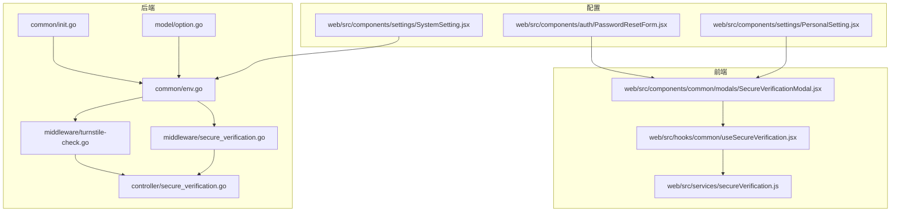
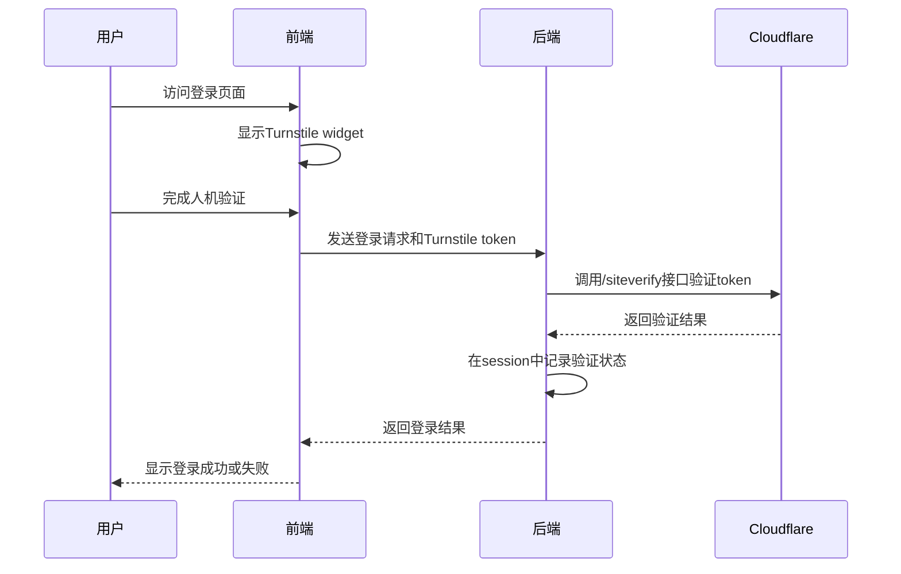
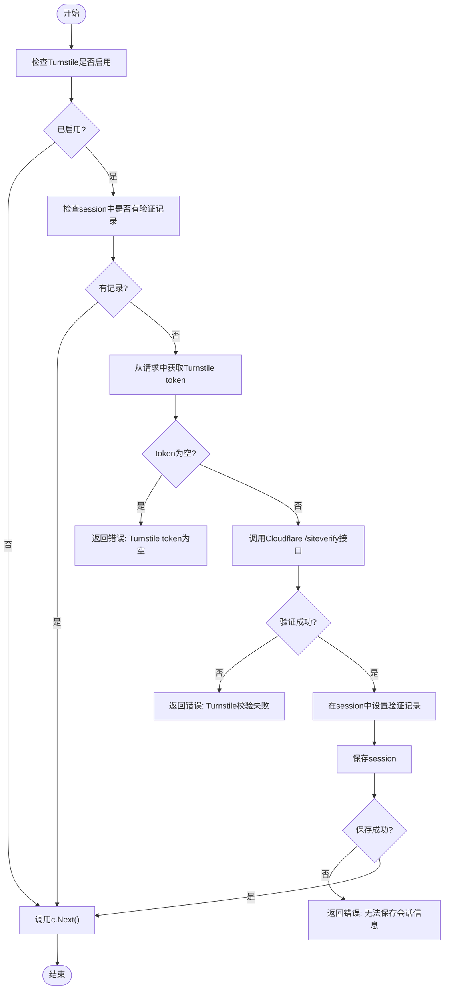
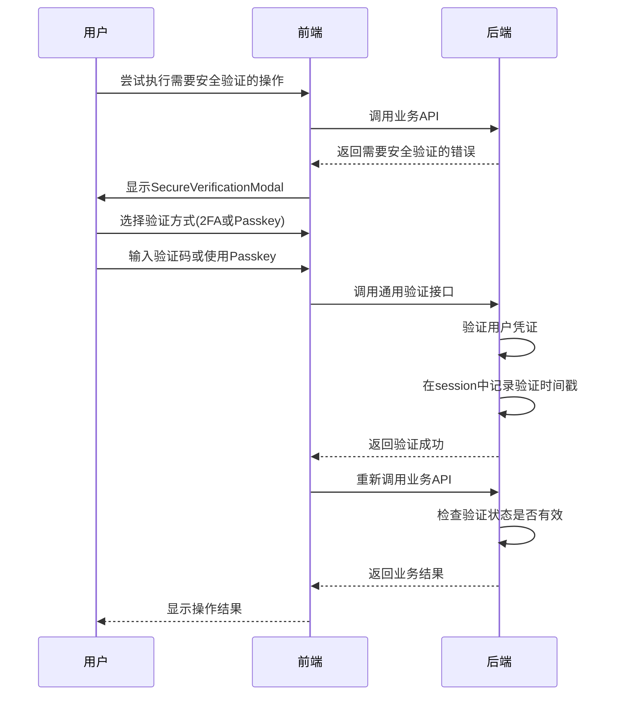
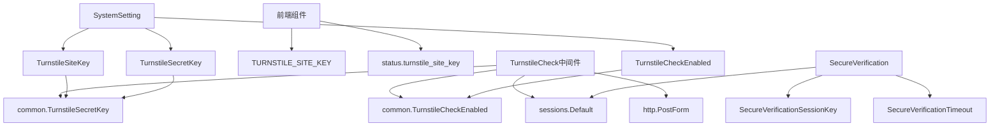

# 人机验证

<cite>
**本文档引用的文件**
- [turnstile-check.go](file://middleware/turnstile-check.go)
- [secure_verification.go](file://middleware/secure_verification.go)
- [secure_verification.go](file://controller/secure_verification.go)
- [SecureVerificationModal.jsx](file://web/src/components/common/modals/SecureVerificationModal.jsx)
- [useSecureVerification.jsx](file://web/src/hooks/common/useSecureVerification.jsx)
- [secureVerification.js](file://web/src/services/secureVerification.js)
- [env.go](file://common/env.go)
- [init.go](file://common/init.go)
- [option.go](file://model/option.go)
- [SystemSetting.jsx](file://web/src/components/settings/SystemSetting.jsx)
- [PasswordResetForm.jsx](file://web/src/components/auth/PasswordResetForm.jsx)
- [PersonalSetting.jsx](file://web/src/components/settings/PersonalSetting.jsx)
</cite>

## 目录
1. [简介](#简介)
2. [项目结构](#项目结构)
3. [核心组件](#核心组件)
4. [架构概述](#架构概述)
5. [详细组件分析](#详细组件分析)
6. [依赖分析](#依赖分析)
7. [性能考虑](#性能考虑)
8. [故障排除指南](#故障排除指南)
9. [结论](#结论)
10. [附录](#附录) (如有必要)

## 简介
本文档全面文档化了Turnstile人机验证机制的实现与配置。详细说明了TurnstileCheck中间件的工作流程，包括如何通过session记录验证状态，调用Cloudflare Turnstile的/siteverify接口进行验证，并处理验证结果。解释了环境变量TURNSTILE_SITE_KEY和TURNSTILE_SECRET_KEY在前后端的使用方式，前端如何在登录表单中集成widget，后端如何校验response token。提供了启用和禁用该功能的配置方法，以及在分布式部署时需注意的session共享问题。结合SecureVerificationModal组件说明用户交互流程，并给出常见错误（如token为空、验证失败）的排查方案。

## 项目结构
项目结构中，人机验证相关的代码分布在多个目录中。后端中间件位于`middleware/`目录下，包括`turnstile-check.go`和`secure_verification.go`。控制器逻辑在`controller/`目录下的`secure_verification.go`文件中。前端组件位于`web/src/components/common/modals/`目录下的`SecureVerificationModal.jsx`，相关的Hook和Service分别在`web/src/hooks/common/`和`web/src/services/`目录下。配置相关的代码在`common/`和`model/`目录中。

**图表来源**
- [turnstile-check.go](file://middleware/turnstile-check.go)
- [secure_verification.go](file://middleware/secure_verification.go)
- [secure_verification.go](file://controller/secure_verification.go)
- [env.go](file://common/env.go)
- [init.go](file://common/init.go)
- [option.go](file://model/option.go)
- [SecureVerificationModal.jsx](file://web/src/components/common/modals/SecureVerificationModal.jsx)
- [useSecureVerification.jsx](file://web/src/hooks/common/useSecureVerification.jsx)
- [secureVerification.js](file://web/src/services/secureVerification.js)
- [SystemSetting.jsx](file://web/src/components/settings/SystemSetting.jsx)
- [PasswordResetForm.jsx](file://web/src/components/auth/PasswordResetForm.jsx)
- [PersonalSetting.jsx](file://web/src/components/settings/PersonalSetting.jsx)

**章节来源**
- [middleware/turnstile-check.go](file://middleware/turnstile-check.go)
- [middleware/secure_verification.go](file://middleware/secure_verification.go)
- [controller/secure_verification.go](file://controller/secure_verification.go)
- [common/env.go](file://common/env.go)
- [common/init.go](file://common/init.go)
- [model/option.go](file://model/option.go)
- [web/src/components/common/modals/SecureVerificationModal.jsx](file://web/src/components/common/modals/SecureVerificationModal.jsx)
- [web/src/hooks/common/useSecureVerification.jsx](file://web/src/hooks/common/useSecureVerification.jsx)
- [web/src/services/secureVerification.js](file://web/src/services/secureVerification.js)
- [web/src/components/settings/SystemSetting.jsx](file://web/src/components/settings/SystemSetting.jsx)
- [web/src/components/auth/PasswordResetForm.jsx](file://web/src/components/auth/PasswordResetForm.jsx)
- [web/src/components/settings/PersonalSetting.jsx](file://web/src/components/settings/PersonalSetting.jsx)

## 核心组件
核心组件包括后端的TurnstileCheck中间件、SecureVerification控制器和前端的SecureVerificationModal组件。TurnstileCheck中间件负责处理Cloudflare Turnstile的验证流程，SecureVerification控制器处理通用安全验证，SecureVerificationModal组件提供用户交互界面。

**章节来源**
- [turnstile-check.go](file://middleware/turnstile-check.go)
- [secure_verification.go](file://controller/secure_verification.go)
- [SecureVerificationModal.jsx](file://web/src/components/common/modals/SecureVerificationModal.jsx)

## 架构概述
系统架构中，人机验证机制通过前后端协作实现。前端在用户登录或注册时显示Turnstile widget，用户完成验证后，前端将response token发送到后端。后端通过TurnstileCheck中间件验证token，并在session中记录验证状态。对于需要更高安全性的操作，系统使用SecureVerification机制，要求用户进行二次验证。

**图表来源**
- [turnstile-check.go](file://middleware/turnstile-check.go)
- [SecureVerificationModal.jsx](file://web/src/components/common/modals/SecureVerificationModal.jsx)

**章节来源**
- [turnstile-check.go](file://middleware/turnstile-check.go)
- [SecureVerificationModal.jsx](file://web/src/components/common/modals/SecureVerificationModal.jsx)

## 详细组件分析
### TurnstileCheck中间件分析
TurnstileCheck中间件是人机验证的核心组件，负责处理Cloudflare Turnstile的验证流程。

#### 工作流程

**图表来源**
- [turnstile-check.go](file://middleware/turnstile-check.go)

**章节来源**
- [turnstile-check.go](file://middleware/turnstile-check.go)

### SecureVerification机制分析
SecureVerification机制用于需要更高安全性的操作，如查看敏感信息或执行关键操作。

#### 用户交互流程

**图表来源**
- [secure_verification.go](file://controller/secure_verification.go)
- [SecureVerificationModal.jsx](file://web/src/components/common/modals/SecureVerificationModal.jsx)

**章节来源**
- [secure_verification.go](file://controller/secure_verification.go)
- [SecureVerificationModal.jsx](file://web/src/components/common/modals/SecureVerificationModal.jsx)

## 依赖分析
人机验证机制依赖于多个组件和配置。

**图表来源**
- [turnstile-check.go](file://middleware/turnstile-check.go)
- [secure_verification.go](file://middleware/secure_verification.go)
- [secure_verification.go](file://controller/secure_verification.go)
- [SystemSetting.jsx](file://web/src/components/settings/SystemSetting.jsx)

**章节来源**
- [turnstile-check.go](file://middleware/turnstile-check.go)
- [secure_verification.go](file://middleware/secure_verification.go)
- [secure_verification.go](file://controller/secure_verification.go)
- [SystemSetting.jsx](file://web/src/components/settings/SystemSetting.jsx)

## 性能考虑
人机验证机制对性能的影响主要体现在以下几个方面：
1. 每次验证需要调用Cloudflare的/siteverify接口，增加了网络延迟。
2. session的读写操作会增加服务器负载。
3. 频繁的验证请求可能导致Rate Limit问题。

建议在高并发场景下使用Redis作为session存储，以提高读写性能。同时，可以考虑对验证结果进行短暂缓存，避免重复验证。

## 故障排除指南
### 常见错误及解决方案
| 错误信息 | 可能原因 | 解决方案 |
|--------|--------|--------|
| Turnstile token 为空 | 前端未正确集成widget或用户未完成验证 | 检查前端代码，确保widget正确加载并获取token |
| Turnstile 校验失败，请刷新重试！ | token无效或已过期 | 检查TURNSTILE_SECRET_KEY是否正确，确保前端和后端的site key匹配 |
| 无法保存会话信息，请重试 | session存储问题 | 检查session配置，确保session存储服务正常运行 |
| 验证已过期，请重新验证 | 验证超时 | 用户重新进行验证，或调整SecureVerificationTimeout值 |
| 用户未启用2FA或Passkey | 用户未配置验证方式 | 引导用户在个人设置中启用2FA或Passkey |

### 配置问题排查
1. **检查环境变量**：确保TURNSTILE_SITE_KEY和TURNSTILE_SECRET_KEY已正确设置。
2. **检查系统设置**：在系统设置中确认Turnstile功能已启用。
3. **检查网络连接**：确保服务器可以访问Cloudflare的/siteverify接口。
4. **检查session配置**：确保session存储服务正常运行，特别是在分布式部署时。

**章节来源**
- [turnstile-check.go](file://middleware/turnstile-check.go)
- [secure_verification.go](file://controller/secure_verification.go)
- [SystemSetting.jsx](file://web/src/components/settings/SystemSetting.jsx)

## 结论
本文档全面介绍了Turnstile人机验证机制的实现与配置。通过TurnstileCheck中间件和SecureVerification机制，系统实现了多层次的安全验证。前端通过SecureVerificationModal组件提供友好的用户交互界面。管理员可以通过系统设置启用或禁用该功能，并配置相关的密钥。在分布式部署时，需要注意session共享问题，建议使用Redis等集中式存储方案。

## 附录
### 环境变量配置
| 环境变量 | 说明 |
|--------|--------|
| TURNSTILE_SITE_KEY | Cloudflare Turnstile的Site Key，用于前端widget集成 |
| TURNSTILE_SECRET_KEY | Cloudflare Turnstile的Secret Key，用于后端验证token |
| TURNSTILE_CHECK_ENABLED | 是否启用Turnstile验证，true为启用，false为禁用 |

### API端点
| 端点 | 方法 | 说明 |
|-----|------|------|
| /user/register | POST | 用户注册，受TurnstileCheck中间件保护 |
| /user/login | POST | 用户登录，受TurnstileCheck中间件保护 |
| /verify | POST | 通用安全验证接口 |
| /verify/status | GET | 获取安全验证状态 |