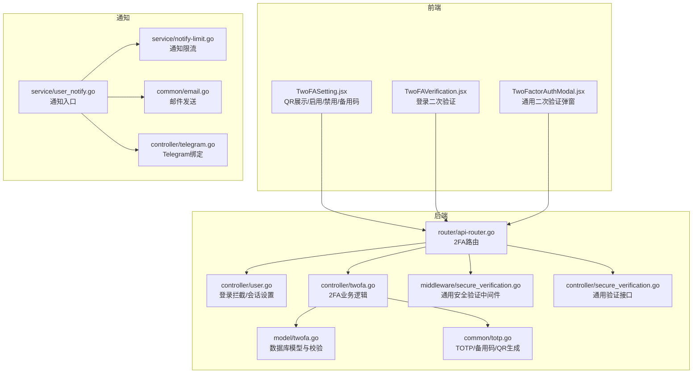
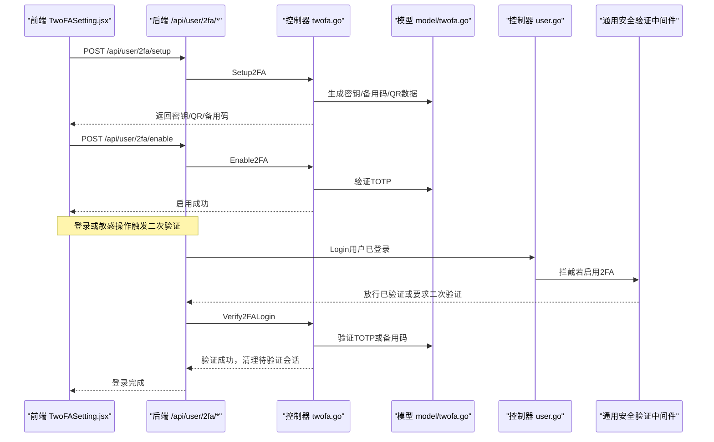
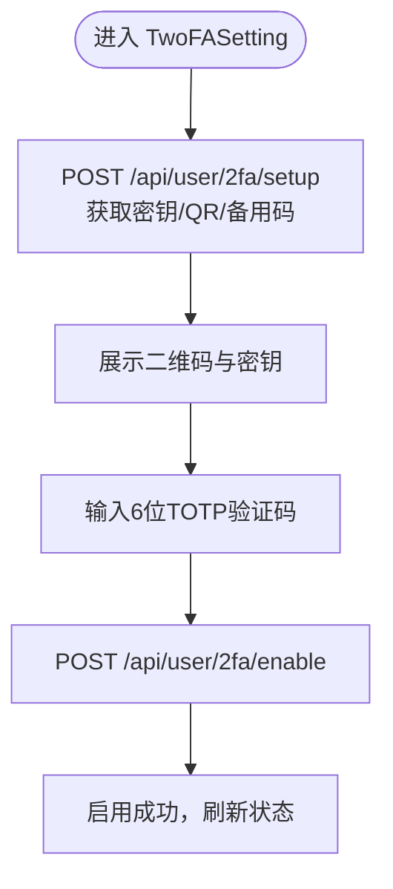
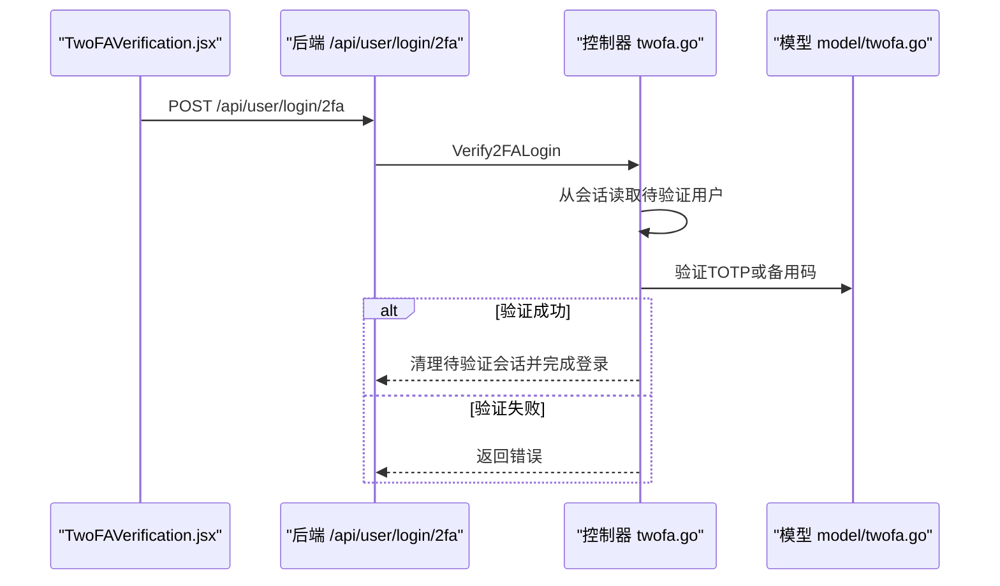
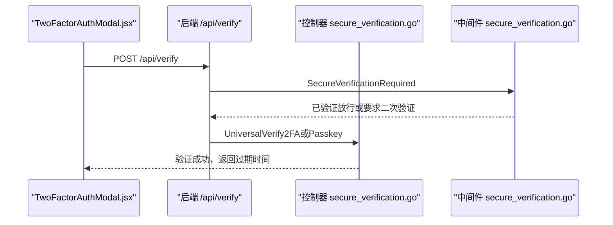
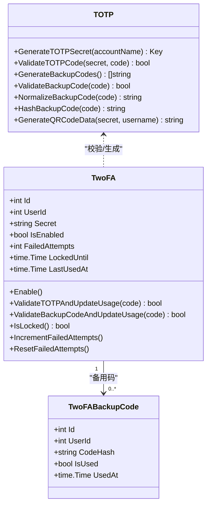
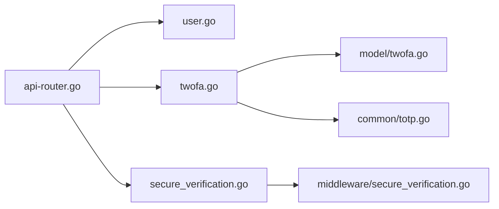

# 双因素认证

<cite>
**本文引用的文件**
- [controller/twofa.go](file://controller/twofa.go)
- [model/twofa.go](file://model/twofa.go)
- [common/totp.go](file://common/totp.go)
- [router/api-router.go](file://router/api-router.go)
- [controller/user.go](file://controller/user.go)
- [middleware/secure_verification.go](file://middleware/secure_verification.go)
- [controller/secure_verification.go](file://controller/secure_verification.go)
- [web/src/components/settings/personal/components/TwoFASetting.jsx](file://web/src/components/settings/personal/components/TwoFASetting.jsx)
- [web/src/components/auth/TwoFAVerification.jsx](file://web/src/components/auth/TwoFAVerification.jsx)
- [web/src/components/common/modals/TwoFactorAuthModal.jsx](file://web/src/components/common/modals/TwoFactorAuthModal.jsx)
- [service/user_notify.go](file://service/user_notify.go)
- [service/notify-limit.go](file://service/notify-limit.go)
- [common/email.go](file://common/email.go)
- [controller/telegram.go](file://controller/telegram.go)
- [web/src/components/settings/personal/cards/AccountManagement.jsx](file://web/src/components/settings/personal/cards/AccountManagement.jsx)
</cite>

## 目录
1. [简介](#简介)
2. [项目结构](#项目结构)
3. [核心组件](#核心组件)
4. [架构总览](#架构总览)
5. [详细组件分析](#详细组件分析)
6. [依赖关系分析](#依赖关系分析)
7. [性能考量](#性能考量)
8. [故障排查指南](#故障排查指南)
9. [结论](#结论)
10. [附录](#附录)

## 简介
本文件系统性地文档化本项目的双因素认证（2FA）实现，覆盖TOTP（基于时间的一次性密码）的生成与验证流程、QR码展示（TwoFASetting组件）、验证码校验逻辑、备用码机制、会话重置与恢复码生成、关键操作（登录、敏感设置修改）中的二次验证交互，以及与通知渠道（邮件、Telegram）的集成与配置建议。同时提供常见问题处理策略（如时钟不同步、设备丢失）与安全加固建议。

## 项目结构
围绕2FA的关键文件分布如下：
- 后端控制器与模型：负责2FA初始化、启用、禁用、状态查询、备用码生成与校验、登录二次验证等。
- 通用工具：TOTP密钥生成、TOTP校验、备用码生成与哈希、QR码数据生成等。
- 前端组件：TwoFASetting（设置与QR展示）、TwoFAVerification（登录二次验证）、TwoFactorAuthModal（通用二次验证弹窗）。
- 路由与中间件：定义2FA相关API路由、登录流程中的2FA拦截、通用安全验证中间件。
- 通知服务：邮件与Telegram绑定与通知能力，配合2FA使用。

图表来源
- [router/api-router.go](file://router/api-router.go#L44-L116)
- [controller/user.go](file://controller/user.go#L69-L126)
- [controller/twofa.go](file://controller/twofa.go#L33-L135)
- [model/twofa.go](file://model/twofa.go#L15-L114)
- [common/totp.go](file://common/totp.go#L24-L151)
- [middleware/secure_verification.go](file://middleware/secure_verification.go#L11-L80)
- [controller/secure_verification.go](file://controller/secure_verification.go#L34-L134)
- [service/user_notify.go](file://service/user_notify.go#L1-L39)
- [service/notify-limit.go](file://service/notify-limit.go#L1-L118)
- [common/email.go](file://common/email.go#L1-L64)
- [controller/telegram.go](file://controller/telegram.go#L1-L70)

章节来源
- [router/api-router.go](file://router/api-router.go#L44-L116)

## 核心组件
- 2FA控制器（controller/twofa.go）：提供初始化设置、启用、禁用、状态查询、备用码重新生成、登录二次验证等接口。
- 2FA模型（model/twofa.go）：定义TwoFA与TwoFABackupCode数据结构，提供数据库访问、失败次数与锁定控制、TOTP/备用码校验与使用记录更新。
- 通用TOTP工具（common/totp.go）：生成TOTP密钥、验证TOTP、生成备用码、标准化与哈希备用码、生成QR码数据。
- 路由与登录拦截（router/api-router.go、controller/user.go）：定义2FA相关路由；登录成功且用户启用2FA时，设置“待验证”会话并要求二次验证。
- 通用安全验证中间件（middleware/secure_verification.go、controller/secure_verification.go）：对敏感操作进行二次验证保护，验证成功后在会话中记录时间戳。
- 前端组件（web/src/components/...）：TwoFASetting（QR展示、启用/禁用/备用码）、TwoFAVerification（登录二次验证）、TwoFactorAuthModal（通用二次验证弹窗）。

章节来源
- [controller/twofa.go](file://controller/twofa.go#L33-L135)
- [model/twofa.go](file://model/twofa.go#L15-L114)
- [common/totp.go](file://common/totp.go#L24-L151)
- [router/api-router.go](file://router/api-router.go#L44-L116)
- [controller/user.go](file://controller/user.go#L69-L126)
- [middleware/secure_verification.go](file://middleware/secure_verification.go#L11-L80)
- [controller/secure_verification.go](file://controller/secure_verification.go#L34-L134)
- [web/src/components/settings/personal/components/TwoFASetting.jsx](file://web/src/components/settings/personal/components/TwoFASetting.jsx#L45-L120)
- [web/src/components/auth/TwoFAVerification.jsx](file://web/src/components/auth/TwoFAVerification.jsx#L31-L148)
- [web/src/components/common/modals/TwoFactorAuthModal.jsx](file://web/src/components/common/modals/TwoFactorAuthModal.jsx#L36-L145)

## 架构总览
2FA整体流程分为三段：
- 设置阶段：生成TOTP密钥与备用码，生成QR码数据，前端展示QR码并引导用户扫码；输入验证码完成启用。
- 使用阶段：登录或敏感操作触发二次验证；用户输入6位TOTP或8位备用码；验证成功后会话进入“已验证”状态，有效期5分钟。
- 维护阶段：禁用2FA会删除设置与所有备用码；重新生成备用码会替换旧码并仅保留新码。

图表来源
- [controller/twofa.go](file://controller/twofa.go#L33-L135)
- [controller/twofa.go](file://controller/twofa.go#L398-L487)
- [controller/user.go](file://controller/user.go#L69-L126)
- [middleware/secure_verification.go](file://middleware/secure_verification.go#L11-L80)

## 详细组件分析

### TOTP生成与QR展示（TwoFASetting.jsx）
- 功能要点
  - 初始化2FA设置：调用后端生成密钥、备用码与QR数据，前端渲染二维码与密钥文本。
  - 启用2FA：输入6位TOTP验证码，提交后端验证并通过后启用。
  - 禁用2FA：输入TOTP或备用码，确认后端删除设置与备用码。
  - 重新生成备用码：输入TOTP验证码，后端生成新备用码并返回。
  - 状态查询：显示是否启用、是否锁定、剩余备用码数量。
- 关键交互
  - QR码通过qrcode.react组件渲染，支持手动输入密钥。
  - 输入验证码格式校验（6位数字）。
  - 备用码复制与展示卡片。

图表来源
- [web/src/components/settings/personal/components/TwoFASetting.jsx](file://web/src/components/settings/personal/components/TwoFASetting.jsx#L83-L128)
- [web/src/components/settings/personal/components/TwoFASetting.jsx](file://web/src/components/settings/personal/components/TwoFASetting.jsx#L130-L161)
- [web/src/components/settings/personal/components/TwoFASetting.jsx](file://web/src/components/settings/personal/components/TwoFASetting.jsx#L163-L188)
- [web/src/components/settings/personal/components/TwoFASetting.jsx](file://web/src/components/settings/personal/components/TwoFASetting.jsx#L366-L451)

章节来源
- [web/src/components/settings/personal/components/TwoFASetting.jsx](file://web/src/components/settings/personal/components/TwoFASetting.jsx#L45-L120)
- [web/src/components/settings/personal/components/TwoFASetting.jsx](file://web/src/components/settings/personal/components/TwoFASetting.jsx#L121-L210)
- [web/src/components/settings/personal/components/TwoFASetting.jsx](file://web/src/components/settings/personal/components/TwoFASetting.jsx#L210-L365)
- [web/src/components/settings/personal/components/TwoFASetting.jsx](file://web/src/components/settings/personal/components/TwoFASetting.jsx#L366-L720)

### 登录二次验证（TwoFAVerification.jsx 与 Verify2FALogin）
- 流程说明
  - 登录成功且用户启用2FA时，后端设置“待验证”会话并返回需要2FA。
  - 前端TwoFAVerification.jsx展示输入框，支持6位TOTP或8位备用码切换。
  - 提交后端Verify2FALogin：从会话取出待验证用户，验证TOTP或备用码，成功则清理会话并完成登录。
- 安全要点
  - 会话中仅保存待验证用户ID，不持久化敏感信息。
  - 验证失败增加失败次数，超过阈值将锁定账户一段时间。

图表来源
- [web/src/components/auth/TwoFAVerification.jsx](file://web/src/components/auth/TwoFAVerification.jsx#L31-L148)
- [controller/twofa.go](file://controller/twofa.go#L398-L487)
- [model/twofa.go](file://model/twofa.go#L236-L297)

章节来源
- [web/src/components/auth/TwoFAVerification.jsx](file://web/src/components/auth/TwoFAVerification.jsx#L31-L148)
- [controller/twofa.go](file://controller/twofa.go#L398-L487)
- [model/twofa.go](file://model/twofa.go#L236-L297)

### 通用二次验证弹窗（TwoFactorAuthModal.jsx）
- 用途
  - 在关键敏感操作（如修改密钥、批量管理）前弹出二次验证，支持6位TOTP或8位备用码输入。
- 交互
  - 输入框限制长度（TOTP为6位，备用码为8位），回车触发验证。
  - 验证成功后在会话中记录时间戳，有效期5分钟。

图表来源
- [web/src/components/common/modals/TwoFactorAuthModal.jsx](file://web/src/components/common/modals/TwoFactorAuthModal.jsx#L36-L145)
- [controller/secure_verification.go](file://controller/secure_verification.go#L34-L134)
- [middleware/secure_verification.go](file://middleware/secure_verification.go#L11-L80)

章节来源
- [web/src/components/common/modals/TwoFactorAuthModal.jsx](file://web/src/components/common/modals/TwoFactorAuthModal.jsx#L36-L145)
- [controller/secure_verification.go](file://controller/secure_verification.go#L34-L134)
- [middleware/secure_verification.go](file://middleware/secure_verification.go#L11-L80)

### 2FA控制器与模型（twofa.go 与 model/twofa.go）
- 控制器职责
  - 初始化设置：生成密钥、备用码、QR数据，保存临时记录。
  - 启用2FA：校验TOTP，启用并清零失败次数。
  - 禁用2FA：支持TOTP或备用码，成功后删除设置与备用码。
  - 状态查询：返回启用状态、锁定状态、剩余备用码数量。
  - 重新生成备用码：校验TOTP后生成新备用码并保存。
  - 登录二次验证：从会话读取待验证用户，验证TOTP或备用码，成功则清理会话并完成登录。
- 模型职责
  - TwoFA：存储用户2FA设置、失败次数、锁定截止时间、最后使用时间。
  - TwoFABackupCode：存储备用码哈希、使用状态与时间。
  - 校验逻辑：验证TOTP与备用码，失败次数递增与锁定，成功后重置失败次数并更新最后使用时间。
  - 统计：管理员统计启用率等。

图表来源
- [model/twofa.go](file://model/twofa.go#L15-L114)
- [model/twofa.go](file://model/twofa.go#L144-L205)
- [model/twofa.go](file://model/twofa.go#L236-L297)
- [common/totp.go](file://common/totp.go#L24-L151)

章节来源
- [controller/twofa.go](file://controller/twofa.go#L33-L135)
- [controller/twofa.go](file://controller/twofa.go#L137-L202)
- [controller/twofa.go](file://controller/twofa.go#L204-L274)
- [controller/twofa.go](file://controller/twofa.go#L276-L310)
- [controller/twofa.go](file://controller/twofa.go#L312-L396)
- [controller/twofa.go](file://controller/twofa.go#L398-L487)
- [model/twofa.go](file://model/twofa.go#L15-L114)
- [model/twofa.go](file://model/twofa.go#L144-L205)
- [model/twofa.go](file://model/twofa.go#L236-L297)
- [common/totp.go](file://common/totp.go#L24-L151)

### 通知与备用验证方式（邮件、Telegram）
- 邮件通知
  - 通知入口：service/user_notify.go根据用户设置选择通知类型（默认邮件），并检查通知限流。
  - 通知限流：service/notify-limit.go支持Redis或内存限流，按小时清理过期条目。
  - 邮件发送：common/email.go封装SMTP发送，支持TLS与认证。
- Telegram绑定
  - 通过Telegram OAuth绑定用户，绑定页面位于AccountManagement.jsx，按钮跳转至Telegram登录回调。
  - 绑定成功后可在个人设置中看到“已绑定”。

章节来源
- [service/user_notify.go](file://service/user_notify.go#L1-L39)
- [service/notify-limit.go](file://service/notify-limit.go#L1-L118)
- [common/email.go](file://common/email.go#L1-L64)
- [controller/telegram.go](file://controller/telegram.go#L1-L70)
- [web/src/components/settings/personal/cards/AccountManagement.jsx](file://web/src/components/settings/personal/cards/AccountManagement.jsx#L362-L408)

## 依赖关系分析
- 路由层
  - /api/user/2fa/*：初始化、启用、禁用、状态、备用码重新生成。
  - /api/user/login/2fa：登录二次验证。
  - /api/verify：通用二次验证（2FA或Passkey）。
- 控制器层
  - twofa.go：实现2FA核心业务。
  - user.go：登录拦截与会话设置。
  - secure_verification.go：通用二次验证接口与状态查询。
- 中间件层
  - secure_verification.go：对敏感操作进行二次验证保护。
- 模型层
  - model/twofa.go：数据库模型与校验逻辑。
- 通用工具
  - common/totp.go：TOTP/备用码/QR生成与校验。

图表来源
- [router/api-router.go](file://router/api-router.go#L44-L116)
- [controller/user.go](file://controller/user.go#L69-L126)
- [controller/twofa.go](file://controller/twofa.go#L33-L135)
- [controller/secure_verification.go](file://controller/secure_verification.go#L34-L134)
- [middleware/secure_verification.go](file://middleware/secure_verification.go#L11-L80)
- [model/twofa.go](file://model/twofa.go#L15-L114)
- [common/totp.go](file://common/totp.go#L24-L151)

章节来源
- [router/api-router.go](file://router/api-router.go#L44-L116)

## 性能考量
- TOTP校验与备用码验证均为O(n)查找未使用备用码，n通常很小（默认4个），开销可忽略。
- 失败次数与锁定采用内存状态，无需额外数据库查询，减少IO压力。
- 通知限流支持Redis或内存模式，避免高频通知导致资源消耗。
- QR码生成与TOTP密钥生成使用标准库，计算量小，对性能影响极低。

## 故障排查指南
- 时钟不同步
  - 现象：TOTP始终不匹配。
  - 处理：确保系统时间准确，允许±1~2个时间步长偏差；若仍失败，使用备用码。
- 设备丢失
  - 现象：无法获取TOTP。
  - 处理：使用备用码登录；若备用码也丢失，联系管理员重置2FA。
- 账户被锁定
  - 现象：提示账户被锁定，需等待解锁。
  - 处理：等待锁定时间结束；期间可通过备用码登录。
- 会话过期
  - 现象：登录二次验证提示会话已过期。
  - 处理：重新登录并完成二次验证流程。
- 通知发送失败
  - 现象：邮件或Telegram通知未送达。
  - 处理：检查SMTP配置或Telegram Bot配置；查看通知限流是否触发。

章节来源
- [model/twofa.go](file://model/twofa.go#L136-L142)
- [model/twofa.go](file://model/twofa.go#L123-L134)
- [controller/twofa.go](file://controller/twofa.go#L398-L487)
- [service/notify-limit.go](file://service/notify-limit.go#L1-L118)
- [common/email.go](file://common/email.go#L1-L64)

## 结论
本系统提供了完整的2FA实现：TOTP密钥生成与QR展示、验证码校验、备用码机制、失败次数与锁定、登录二次验证与会话重置、通用二次验证中间件保护敏感操作。前端TwoFASetting与TwoFAVerification组件直观易用，配合通知服务（邮件、Telegram）完善了用户体验。建议在生产环境中启用通知限流、严格管理会话与安全验证状态，并定期备份备用码。

## 附录
- 2FA配置选项与建议
  - TOTP周期：默认30秒（可调整）。
  - 备用码数量：默认4个，长度8位，格式XXXX-XXXX。
  - 失败次数与锁定：最大失败次数与锁定时长可配置。
  - 通知类型：默认邮件，可扩展Telegram等。
- 常见问题处理清单
  - 时钟不同步：校准系统时间，必要时使用备用码。
  - 设备丢失：使用备用码登录并尽快重新启用2FA。
  - 账户锁定：等待锁定时间结束或联系管理员。
  - 会话过期：重新登录并完成二次验证。
  - 通知失败：检查SMTP/Telegram配置与通知限流。