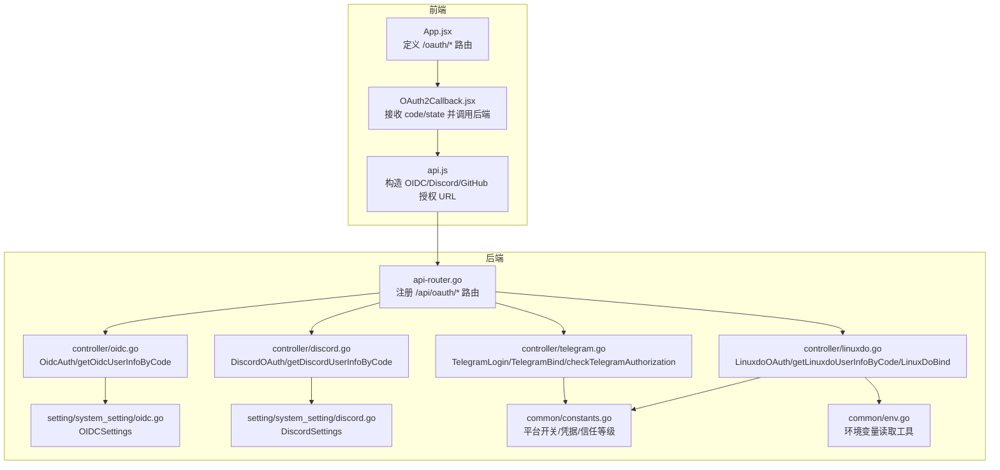
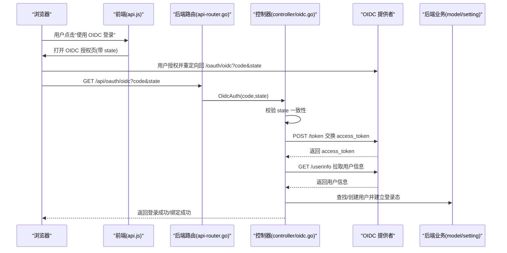
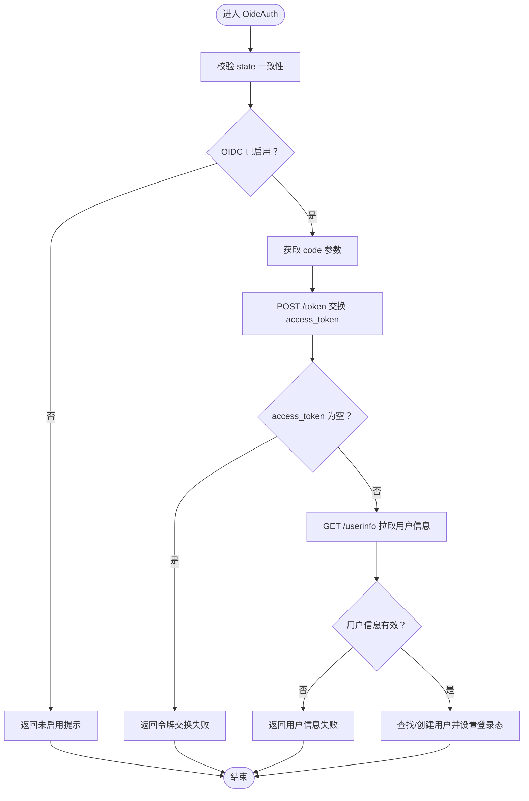
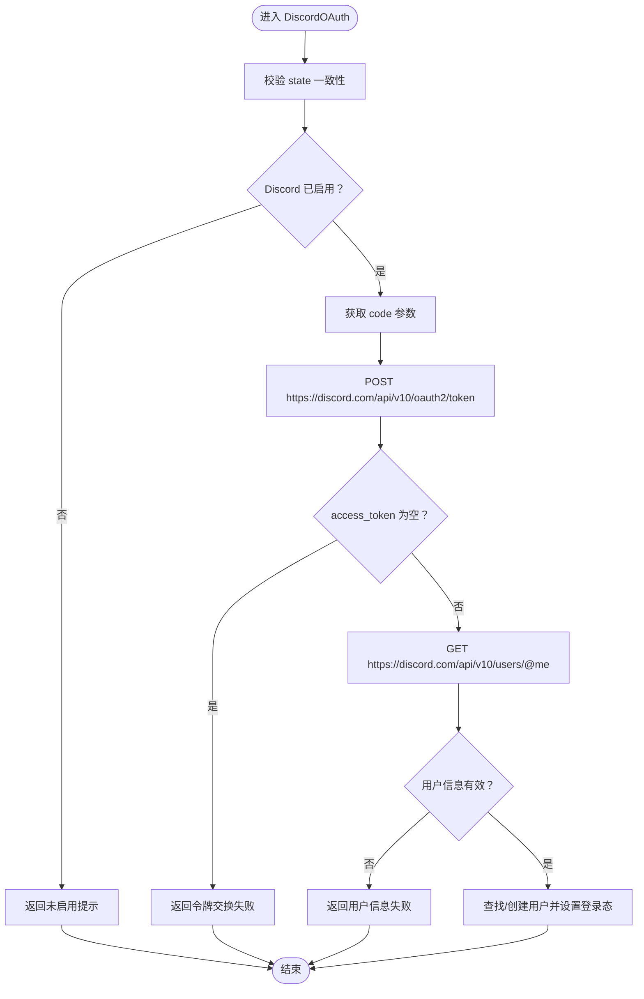
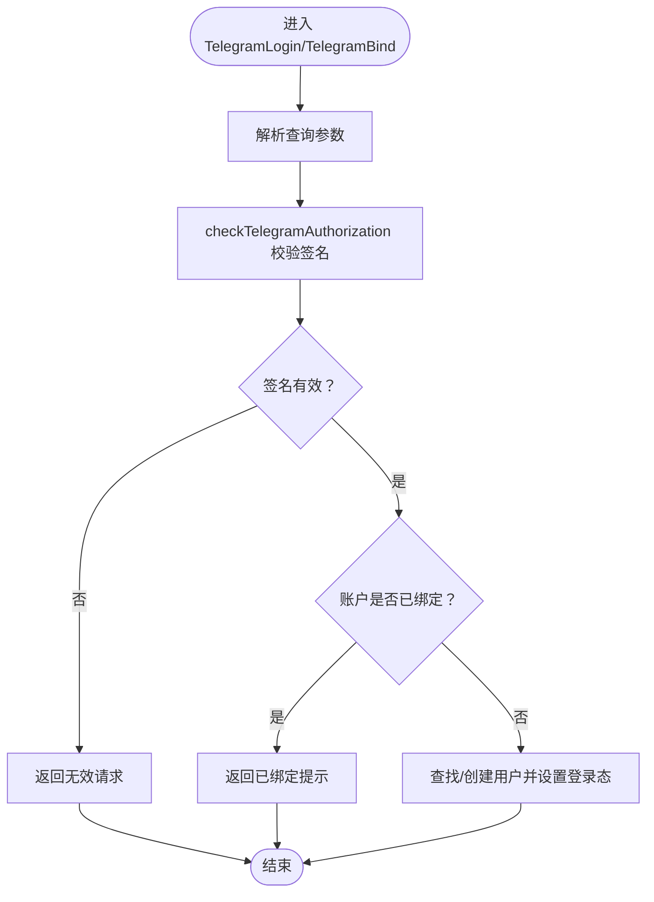
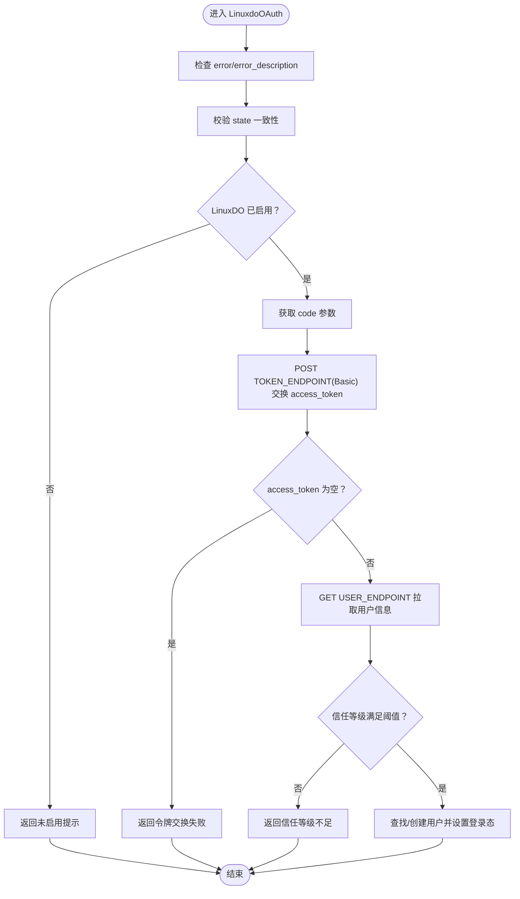
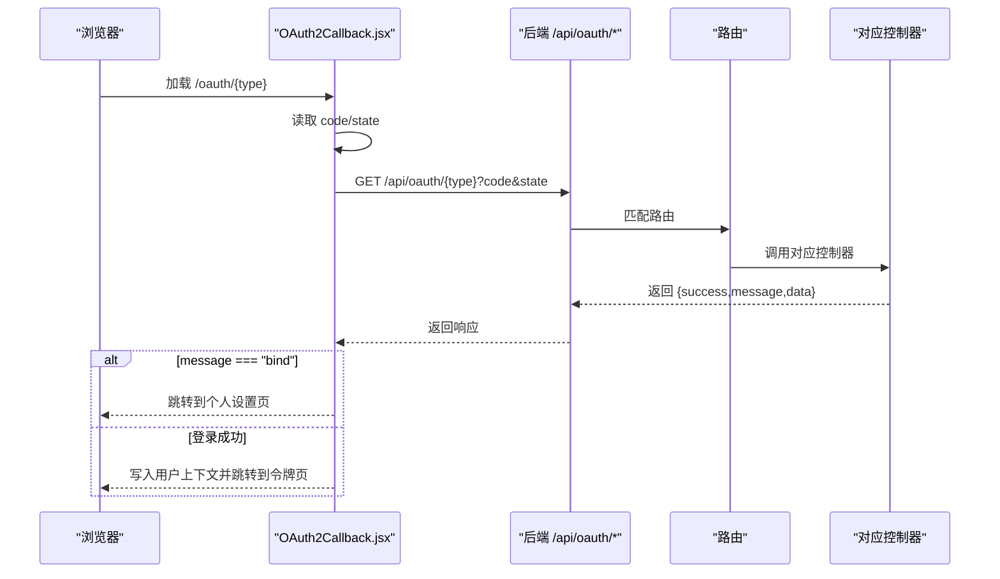
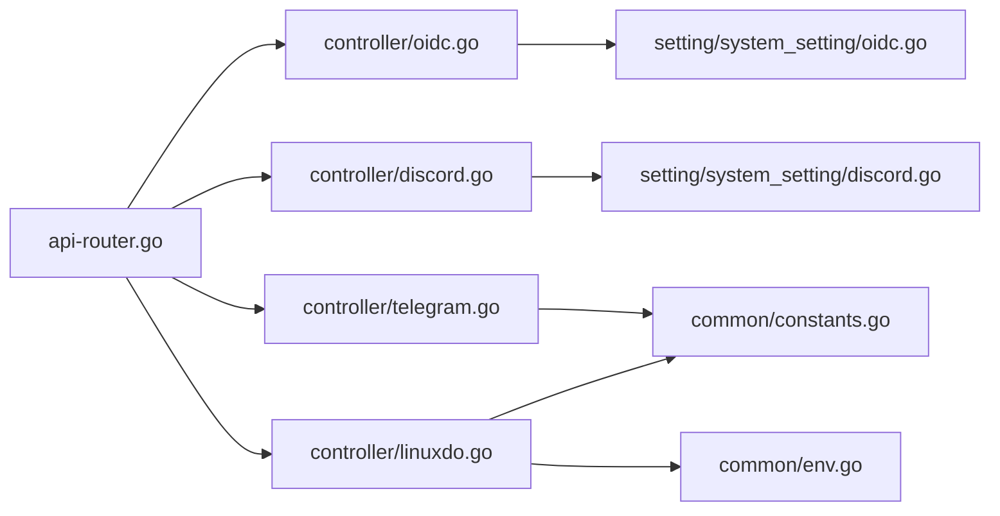

# 第三方登录

<cite>
**本文引用的文件列表**
- [controller/oidc.go](file://controller/oidc.go)
- [controller/discord.go](file://controller/discord.go)
- [controller/telegram.go](file://controller/telegram.go)
- [controller/linuxdo.go](file://controller/linuxdo.go)
- [setting/system_setting/oidc.go](file://setting/system_setting/oidc.go)
- [setting/system_setting/discord.go](file://setting/system_setting/discord.go)
- [common/constants.go](file://common/constants.go)
- [common/env.go](file://common/env.go)
- [router/api-router.go](file://router/api-router.go)
- [web/src/components/auth/OAuth2Callback.jsx](file://web/src/components/auth/OAuth2Callback.jsx)
- [web/src/helpers/api.js](file://web/src/helpers/api.js)
- [web/src/App.jsx](file://web/src/App.jsx)
</cite>

## 目录
1. [简介](#简介)
2. [项目结构](#项目结构)
3. [核心组件](#核心组件)
4. [架构总览](#架构总览)
5. [详细组件分析](#详细组件分析)
6. [依赖关系分析](#依赖关系分析)
7. [性能与安全考虑](#性能与安全考虑)
8. [故障排查指南](#故障排查指南)
9. [结论](#结论)
10. [附录：平台配置与最佳实践](#附录平台配置与最佳实践)

## 简介
本文件系统化梳理本仓库中第三方登录（OIDC、Discord、Telegram、LinuxDO）的配置与实现，覆盖后端控制器处理流程、前端回调组件、路由与中间件、以及各平台应用创建与安全最佳实践。读者可据此完成 OIDC 提供者（如 Okta、Auth0）对接、以及 Discord、Telegram、LinuxDO 的集成与运维。

## 项目结构
第三方登录相关代码主要分布在以下位置：
- 后端控制器：处理 OAuth 回调、换取令牌、拉取用户信息、绑定与登录态建立
- 系统设置：OIDC/Discord 等平台的开关与凭据存储
- 公共常量与环境：平台开关、客户端凭据、最小信任等级等
- 路由：对外暴露的 OAuth 回调端点
- 前端：OAuth2Callback 组件负责接收回调参数并发起后端登录/绑定请求

图表来源
- [router/api-router.go](file://router/api-router.go#L32-L41)
- [controller/oidc.go](file://controller/oidc.go#L104-L172)
- [controller/discord.go](file://controller/discord.go#L102-L179)
- [controller/telegram.go](file://controller/telegram.go#L1-L126)
- [controller/linuxdo.go](file://controller/linuxdo.go#L81-L156)
- [setting/system_setting/oidc.go](file://setting/system_setting/oidc.go#L1-L26)
- [setting/system_setting/discord.go](file://setting/system_setting/discord.go#L1-L22)
- [common/constants.go](file://common/constants.go#L43-L107)
- [common/env.go](file://common/env.go#L1-L39)
- [web/src/App.jsx](file://web/src/App.jsx#L184-L218)
- [web/src/components/auth/OAuth2Callback.jsx](file://web/src/components/auth/OAuth2Callback.jsx#L1-L96)
- [web/src/helpers/api.js](file://web/src/helpers/api.js#L248-L286)

章节来源
- [router/api-router.go](file://router/api-router.go#L32-L41)
- [web/src/App.jsx](file://web/src/App.jsx#L184-L218)

## 核心组件
- OIDC 控制器：处理 OIDC 授权码流程，获取 access_token、拉取用户信息、登录或绑定
- Discord 控制器：处理 Discord 授权码流程，获取 access_token、拉取用户信息、登录或绑定
- Telegram 控制器：校验 Telegram WebApp 参数签名，完成登录或绑定
- LinuxDO 控制器：通过 Basic 认证换取 access_token，拉取用户信息，登录或绑定；支持最小信任等级校验
- 系统设置：集中存放 OIDC/Discord 开关与凭据
- 前端回调组件：接收 code/state，调用后端接口，处理登录/绑定结果

章节来源
- [controller/oidc.go](file://controller/oidc.go#L104-L172)
- [controller/discord.go](file://controller/discord.go#L102-L179)
- [controller/telegram.go](file://controller/telegram.go#L1-L126)
- [controller/linuxdo.go](file://controller/linuxdo.go#L81-L156)
- [setting/system_setting/oidc.go](file://setting/system_setting/oidc.go#L1-L26)
- [setting/system_setting/discord.go](file://setting/system_setting/discord.go#L1-L22)
- [web/src/components/auth/OAuth2Callback.jsx](file://web/src/components/auth/OAuth2Callback.jsx#L1-L96)

## 架构总览
下面的序列图展示了典型的 OAuth2.0 授权码流程（以 OIDC 为例），涵盖前端跳转、后端回调、令牌交换与用户信息获取、登录态建立。

图表来源
- [web/src/helpers/api.js](file://web/src/helpers/api.js#L259-L278)
- [router/api-router.go](file://router/api-router.go#L32-L36)
- [controller/oidc.go](file://controller/oidc.go#L104-L172)

## 详细组件分析

### OIDC 控制器与授权码流程
- 关键职责
  - 校验 state，防止 CSRF
  - 通过授权码换取 access_token
  - 使用 access_token 拉取用户信息
  - 登录或绑定用户账户
- 数据模型
  - OidcResponse：包含 access_token、id_token、refresh_token、token_type、expires_in、scope
  - OidcUser：包含 OpenID、Email、Name、PreferredUsername、Picture
- 流程要点
  - 从系统设置读取 ClientId/ClientSecret、TokenEndpoint、UserInfoEndpoint
  - 使用固定重定向 URI（基于 ServerAddress）
  - 对 access_token 为空、用户信息为空等情况进行错误处理
  - 登录时根据用户是否存在决定更新或创建

图表来源
- [controller/oidc.go](file://controller/oidc.go#L104-L172)
- [setting/system_setting/oidc.go](file://setting/system_setting/oidc.go#L1-L26)

章节来源
- [controller/oidc.go](file://controller/oidc.go#L1-L103)
- [controller/oidc.go](file://controller/oidc.go#L104-L172)
- [controller/oidc.go](file://controller/oidc.go#L184-L229)
- [setting/system_setting/oidc.go](file://setting/system_setting/oidc.go#L1-L26)

### Discord 控制器与授权码流程
- 关键职责
  - 校验 state，防止 CSRF
  - 通过授权码换取 access_token
  - 使用 access_token 拉取用户信息
  - 登录或绑定用户账户
- 数据模型
  - DiscordResponse：包含 access_token、id_token、refresh_token、token_type、expires_in、scope
  - DiscordUser：包含 UID、ID、Name
- 流程要点
  - 使用 Discord 官方 token/userinfo 端点
  - 从系统设置读取 ClientId/ClientSecret
  - 对 access_token 为空、用户信息为空等情况进行错误处理

图表来源
- [controller/discord.go](file://controller/discord.go#L102-L179)
- [setting/system_setting/discord.go](file://setting/system_setting/discord.go#L1-L22)

章节来源
- [controller/discord.go](file://controller/discord.go#L1-L101)
- [controller/discord.go](file://controller/discord.go#L102-L179)
- [controller/discord.go](file://controller/discord.go#L181-L224)
- [setting/system_setting/discord.go](file://setting/system_setting/discord.go#L1-L22)

### Telegram 控制器与 WebApp 参数校验
- 关键职责
  - 校验 Telegram WebApp 参数签名，确保回调来自 Telegram
  - 登录或绑定用户账户
- 数据模型
  - 无专用响应结构体，直接解析查询参数
- 流程要点
  - 从公共常量读取 Telegram Bot Token
  - 对参数排序、拼接、HMAC-SHA256 计算签名并与 hash 比较
  - 支持登录与绑定两条路径

图表来源
- [controller/telegram.go](file://controller/telegram.go#L1-L126)
- [common/constants.go](file://common/constants.go#L96-L98)

章节来源
- [controller/telegram.go](file://controller/telegram.go#L1-L126)
- [common/constants.go](file://common/constants.go#L96-L98)

### LinuxDO 控制器与授权码流程
- 关键职责
  - 校验 state，防止 CSRF
  - 通过授权码换取 access_token（Basic 认证）
  - 使用 access_token 拉取用户信息
  - 登录或绑定用户账户；支持最小信任等级校验
- 数据模型
  - LinuxdoUser：包含 Id、Username、Name、Active、TrustLevel、Silenced
- 流程要点
  - 从环境变量读取 TOKEN_ENDPOINT、USER_ENDPOINT（默认值）
  - 从公共常量读取 ClientId/ClientSecret、最小信任等级
  - 对 access_token 为空、用户信息无效等情况进行错误处理

图表来源
- [controller/linuxdo.go](file://controller/linuxdo.go#L158-L269)
- [controller/linuxdo.go](file://controller/linuxdo.go#L81-L156)
- [common/env.go](file://common/env.go#L21-L26)
- [common/constants.go](file://common/constants.go#L83-L88)

章节来源
- [controller/linuxdo.go](file://controller/linuxdo.go#L1-L80)
- [controller/linuxdo.go](file://controller/linuxdo.go#L81-L156)
- [controller/linuxdo.go](file://controller/linuxdo.go#L158-L269)
- [common/env.go](file://common/env.go#L21-L26)
- [common/constants.go](file://common/constants.go#L83-L88)

### 前端 OAuth2Callback 组件与用户体验
- 关键职责
  - 从 URL 中提取 code、state
  - 调用后端 /api/oauth/{type} 接口
  - 处理登录成功与绑定成功的不同分支
  - 失败时进行有限次重试并引导用户回到个人设置页
- 用户体验
  - 登录成功：写入用户上下文、更新 API 凭据、跳转到令牌页
  - 绑定成功：提示成功并跳转到个人设置页
  - 失败：提示错误并返回设置页

图表来源
- [web/src/components/auth/OAuth2Callback.jsx](file://web/src/components/auth/OAuth2Callback.jsx#L1-L96)
- [router/api-router.go](file://router/api-router.go#L32-L41)
- [web/src/App.jsx](file://web/src/App.jsx#L184-L218)

章节来源
- [web/src/components/auth/OAuth2Callback.jsx](file://web/src/components/auth/OAuth2Callback.jsx#L1-L96)
- [web/src/App.jsx](file://web/src/App.jsx#L184-L218)

## 依赖关系分析
- 路由层
  - 在路由中注册了 /api/oauth/* 的回调端点，并统一加上限流中间件
- 控制器层
  - OIDC/Discord/LinuxDO 控制器均依赖系统设置模块读取平台开关与凭据
  - Telegram 控制器依赖公共常量中的 Bot Token
  - LinuxDO 控制器依赖环境变量与公共常量
- 前端层
  - api.js 负责生成 OIDC/Discord/GitHub 授权 URL（含 state、redirect_uri、scope）
  - App.jsx 将 /oauth/* 映射到 OAuth2Callback 组件

图表来源
- [router/api-router.go](file://router/api-router.go#L32-L41)
- [controller/oidc.go](file://controller/oidc.go#L104-L172)
- [controller/discord.go](file://controller/discord.go#L102-L179)
- [controller/telegram.go](file://controller/telegram.go#L1-L126)
- [controller/linuxdo.go](file://controller/linuxdo.go#L81-L156)
- [setting/system_setting/oidc.go](file://setting/system_setting/oidc.go#L1-L26)
- [setting/system_setting/discord.go](file://setting/system_setting/discord.go#L1-L22)
- [common/constants.go](file://common/constants.go#L83-L98)
- [common/env.go](file://common/env.go#L21-L26)

章节来源
- [router/api-router.go](file://router/api-router.go#L32-L41)
- [web/src/helpers/api.js](file://web/src/helpers/api.js#L248-L286)

## 性能与安全考虑
- 性能
  - 各控制器对第三方服务的 HTTP 请求设置了超时，避免阻塞
  - 路由层对 OAuth 回调接口统一加了限流中间件，降低暴力尝试风险
- 安全
  - 所有平台均校验 state，防止 CSRF
  - Telegram 使用 HMAC-SHA256 校验签名，确保回调来源可信
  - LinuxDO 支持最小信任等级校验，限制低信任用户注册
  - OIDC/Discord 使用固定重定向 URI（基于 ServerAddress），避免开放重定向风险
  - 建议在生产环境启用 HTTPS、严格 CORS、最小权限原则配置 Client Secret

[本节为通用建议，不直接分析具体文件]

## 故障排查指南
- OIDC
  - 症状：无法连接 OIDC 服务器或获取 Token 失败
  - 排查：确认 Well-Known/AuthorizationEndpoint/TokenEndpoint/UserInfoEndpoint 配置正确；检查 ClientId/ClientSecret；核对重定向 URI
- Discord
  - 症状：获取 access_token 或用户信息失败
  - 排查：确认 ClientId/ClientSecret；检查 scope 是否包含 openid；核对重定向 URI
- Telegram
  - 症状：无效请求或签名不匹配
  - 排查：确认 Telegram Bot Token；检查回调参数顺序与签名算法
- LinuxDO
  - 症状：无法获取 access_token 或用户信息无效
  - 排查：确认 TOKEN_ENDPOINT/USER_ENDPOINT 环境变量；核对 ClientId/ClientSecret；检查最小信任等级阈值
- 通用
  - 症状：state 不一致或为空
  - 排查：确认前端生成并保存 state；核对 session 存储；检查跨域与 Cookie 设置

章节来源
- [controller/oidc.go](file://controller/oidc.go#L104-L172)
- [controller/discord.go](file://controller/discord.go#L102-L179)
- [controller/telegram.go](file://controller/telegram.go#L1-L126)
- [controller/linuxdo.go](file://controller/linuxdo.go#L158-L269)

## 结论
本项目提供了完善的第三方登录能力，覆盖 OIDC、Discord、Telegram、LinuxDO 四大平台。后端控制器遵循标准 OAuth2.0 授权码流程，前端回调组件提供一致的用户体验。通过系统设置与公共常量/环境变量集中管理配置，既保证灵活性又便于运维。建议在生产环境中完善安全策略与监控告警，持续优化用户体验与稳定性。

[本节为总结性内容，不直接分析具体文件]

## 附录：平台配置与最佳实践

### OIDC（Okta/Auth0 等）
- 必填参数
  - enabled：启用开关
  - client_id/client_secret：应用凭据
  - well_known/authorization_endpoint/token_endpoint/user_info_endpoint：根据提供商配置
- 重定向 URI
  - 固定为 {ServerAddress}/oauth/oidc
- 安全建议
  - 使用 HTTPS
  - 严格校验 state
  - 仅授予必要 scope（openid profile email）
  - 定期轮换 client_secret

章节来源
- [setting/system_setting/oidc.go](file://setting/system_setting/oidc.go#L1-L26)
- [controller/oidc.go](file://controller/oidc.go#L104-L172)
- [web/src/helpers/api.js](file://web/src/helpers/api.js#L259-L278)

### Discord
- 必填参数
  - enabled：启用开关
  - client_id/client_secret：应用凭据
- 重定向 URI
  - 固定为 {当前站点}/oauth/discord
- 安全建议
  - 使用 HTTPS
  - 严格校验 state
  - 仅授予必要 scope（identify openid）

章节来源
- [setting/system_setting/discord.go](file://setting/system_setting/discord.go#L1-L22)
- [controller/discord.go](file://controller/discord.go#L102-L179)
- [web/src/helpers/api.js](file://web/src/helpers/api.js#L248-L257)

### Telegram
- 必填参数
  - TelegramOAuthEnabled：启用开关
  - TelegramBotToken/TelegramBotName：机器人配置
- 安全建议
  - 严格校验签名（checkTelegramAuthorization）
  - 仅在受信域名内使用回调
  - 限制回调参数访问范围

章节来源
- [common/constants.go](file://common/constants.go#L96-L98)
- [controller/telegram.go](file://controller/telegram.go#L1-L126)

### LinuxDO
- 必填参数
  - LinuxDOClientId/LinuxDOClientSecret：应用凭据
  - LinuxDOMinimumTrustLevel：最低信任等级
- 环境变量
  - LINUX_DO_TOKEN_ENDPOINT：令牌端点（默认值已内置）
  - LINUX_DO_USER_ENDPOINT：用户信息端点（默认值已内置）
- 重定向 URI
  - 固定为 {当前站点}/api/oauth/linuxdo
- 安全建议
  - 严格校验最小信任等级
  - 使用 HTTPS
  - 限制回调域名

章节来源
- [common/constants.go](file://common/constants.go#L83-L88)
- [common/env.go](file://common/env.go#L21-L26)
- [controller/linuxdo.go](file://controller/linuxdo.go#L81-L156)
- [controller/linuxdo.go](file://controller/linuxdo.go#L158-L269)

### 常见配置错误与解决
- 重定向 URI 不匹配
  - 症状：state 校验失败或授权失败
  - 解决：确保回调地址与前端生成的 redirect_uri 一致
- Client Secret 为空或错误
  - 症状：令牌交换失败
  - 解决：重新生成并正确填写
- scope 不完整
  - 症状：用户信息缺失
  - 解决：按平台要求补充 scope
- 最小信任等级不足（LinuxDO）
  - 症状：注册被拒绝
  - 解决：提升用户信任等级或降低阈值

章节来源
- [controller/oidc.go](file://controller/oidc.go#L104-L172)
- [controller/discord.go](file://controller/discord.go#L102-L179)
- [controller/linuxdo.go](file://controller/linuxdo.go#L158-L269)