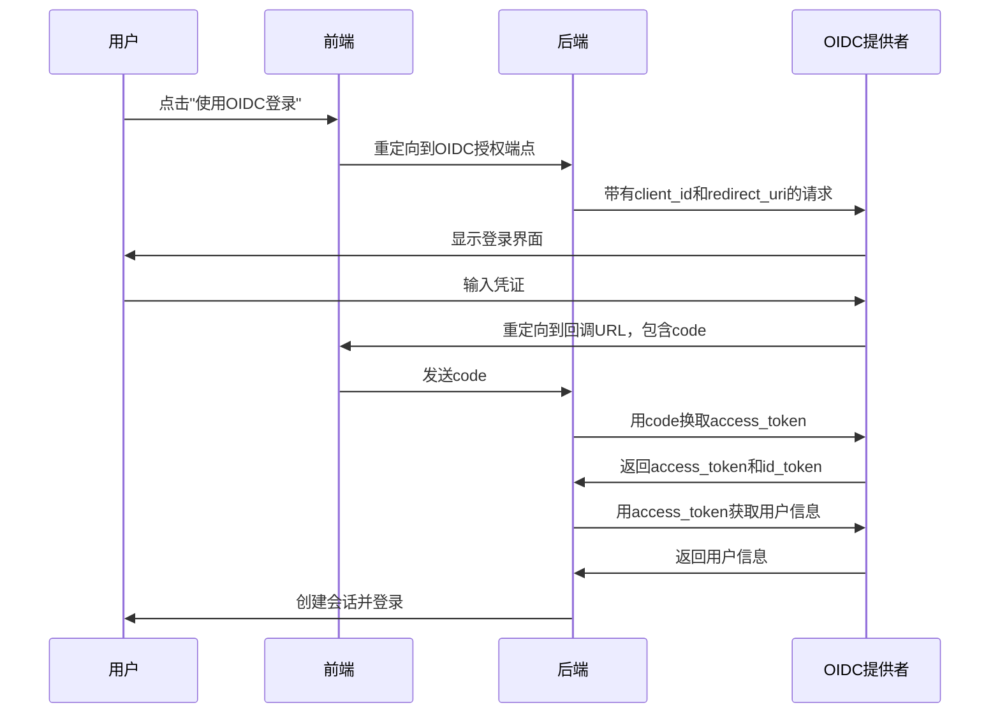
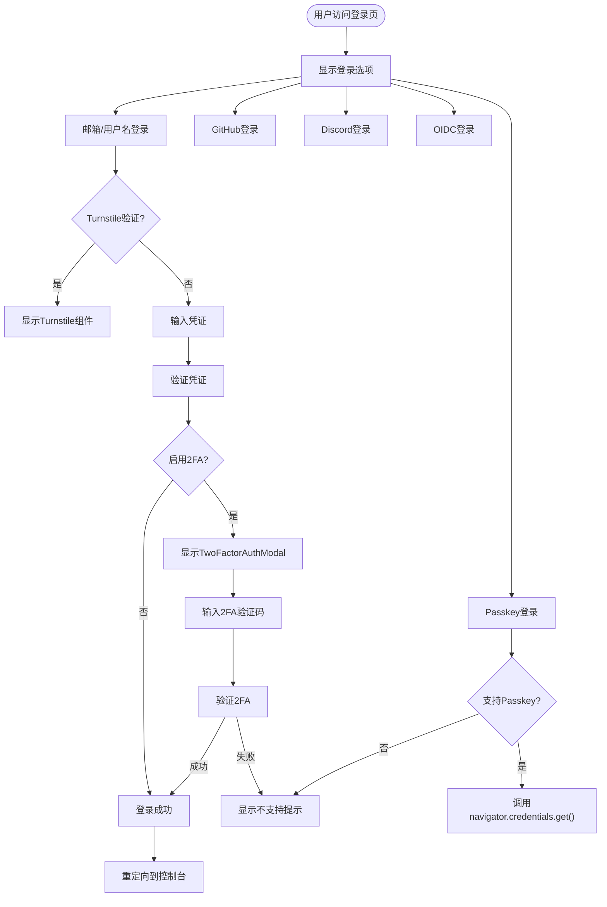

# 认证安全

<cite>
**本文档引用的文件**   
- [oidc.go](file://controller/oidc.go)
- [twofa.go](file://controller/twofa.go)
- [passkey.go](file://controller/passkey.go)
- [turnstile-check.go](file://middleware/turnstile-check.go)
- [env.go](file://common/env.go)
- [oidc.go](file://setting/system_setting/oidc.go)
- [passkey.go](file://setting/system_setting/passkey.go)
- [passkey.go](file://model/passkey.go)
- [twofa.go](file://model/twofa.go)
- [totp.go](file://common/totp.go)
- [LoginForm.jsx](file://web/src/components/auth/LoginForm.jsx)
- [TwoFAVerification.jsx](file://web/src/components/auth/TwoFAVerification.jsx)
- [SystemSetting.jsx](file://web/src/components/settings/SystemSetting.jsx)
</cite>

## 目录
1. [简介](#简介)
2. [Turnstile人机验证](#turnstile人机验证)
3. [邮箱安全验证](#邮箱安全验证)
4. [双因素认证（2FA）](#双因素认证2fa)
5. [Passkey认证](#passkey认证)
6. [OIDC登录](#oidc登录)
7. [前端用户体验流程](#前端用户体验流程)

## 简介
本系统提供多层次的安全认证机制，包括Turnstile人机验证、邮箱安全验证、双因素认证（2FA）、Passkey以及OIDC登录。这些机制共同保障系统的安全性和用户账户的可靠性。系统通过环境变量和配置文件管理各项安全功能的启用状态和相关参数，确保配置的灵活性和安全性。

## Turnstile人机验证

### 前后端集成方式
Turnstile人机验证通过Cloudflare的Turnstile服务实现，用于防止自动化脚本和机器人攻击。系统通过环境变量`TURNSTILE_SITE_KEY`和`TURNSTILE_SECRET_KEY`进行配置，分别对应前端站点密钥和后端密钥。

前端集成通过`react-turnstile`组件实现，在登录和密码重置等关键操作页面展示验证控件。用户完成验证后，前端获取到`turnstileToken`并将其作为查询参数传递给后端。

后端通过`middleware/turnstile-check.go`中的`TurnstileCheck()`中间件处理验证请求。该中间件首先检查会话中是否已通过验证，若未通过则向Cloudflare的验证端点`https://challenges.cloudflare.com/turnstile/v0/siteverify`发送POST请求，验证`response`参数的有效性。验证成功后，将在会话中设置`turnstile`标记，避免重复验证。

**Section sources**
- [env.go](file://common/env.go#L9-L38)
- [turnstile-check.go](file://middleware/turnstile-check.go#L1-L82)
- [LoginForm.jsx](file://web/src/components/auth/LoginForm.jsx#L105-L115)
- [PasswordResetForm.jsx](file://web/src/components/auth/PasswordResetForm.jsx#L54-L63)
- [SystemSetting.jsx](file://web/src/components/settings/SystemSetting.jsx#L1594-L1617)

## 邮箱安全验证

### 配置与启用流程
邮箱安全验证是系统默认的认证方式之一，用户可以通过邮箱或用户名进行登录。该功能无需特殊配置即可使用，但管理员可以通过系统设置控制其可见性和可用性。

在登录流程中，用户输入邮箱和密码后，系统会进行基本的格式验证。如果启用了Turnstile验证，系统会要求用户先完成人机验证。验证通过后，系统将核对用户凭证并创建会话。

密码重置功能也依赖邮箱验证，用户可以通过邮箱接收重置链接。该流程同样受到Turnstile验证的保护，防止滥用。

**Section sources**
- [LoginForm.jsx](file://web/src/components/auth/LoginForm.jsx#L641-L794)
- [PasswordResetForm.jsx](file://web/src/components/auth/PasswordResetForm.jsx#L1-L80)

## 双因素认证（2FA）

### 配置与启用流程
双因素认证（2FA）为用户提供额外的安全层。用户可以在个人设置中启用2FA，系统使用TOTP（基于时间的一次性密码）算法生成验证码。

启用2FA的流程如下：
1. 用户在设置页面点击"设置2FA"
2. 系统生成TOTP密钥和二维码，用户使用认证器应用（如Google Authenticator）扫描
3. 用户输入认证器显示的6位验证码完成验证
4. 系统同时生成10个备用码，供用户在无法访问认证器时使用

管理员可以查看2FA的统计信息，包括启用2FA的用户数量和总用户数量。

### 前后端集成方式
2FA的后端实现主要在`controller/twofa.go`文件中。主要包含以下API端点：
- `Setup2FA`: 初始化2FA设置，生成TOTP密钥和二维码
- `Enable2FA`: 验证用户输入的验证码并启用2FA
- `Disable2FA`: 允许用户禁用2FA
- `Verify2FALogin`: 在登录时验证2FA验证码

前端组件`TwoFAVerification.jsx`负责展示2FA验证界面，允许用户输入验证码或备用码。当用户登录且账户启用了2FA时，系统会跳转到此验证界面。

**Section sources**
- [twofa.go](file://controller/twofa.go#L1-L555)
- [twofa.go](file://model/twofa.go#L1-L324)
- [totp.go](file://common/totp.go#L1-L151)
- [TwoFAVerification.jsx](file://web/src/components/auth/TwoFAVerification.jsx#L1-L245)

## Passkey认证

### WebAuthn实现细节
Passkey认证基于WebAuthn标准实现，提供无密码的生物识别或设备密钥认证。系统使用`go-webauthn/webauthn`库处理WebAuthn协议。

Passkey的实现包含以下组件：
- `PasskeyCredential`模型：存储用户的Passkey凭证，包括凭证ID、公钥、签名计数等
- `WebAuthn`服务：处理注册和登录的WebAuthn流程
- 前端Passkey支持检测：检查浏览器是否支持Passkey功能

### 安全性优势
Passkey相比传统密码和2FA具有多项安全性优势：
1. **防钓鱼**：Passkey与特定域名绑定，无法在伪造网站上使用
2. **防中间人攻击**：基于公钥加密，私钥永不离开用户设备
3. **防暴力破解**：每次认证都使用不同的签名，无法重放
4. **设备绑定**：私钥存储在用户设备的安全区域（如TPM）

### 配置与启用流程
启用Passkey需要管理员在系统设置中开启该功能。Passkey配置包括：
- `RPDisplayName`: 信赖方显示名称
- `RPID`: 信赖方ID，通常为域名
- `Origins`: 允许的来源地址
- `UserVerification`: 用户验证策略

用户启用Passkey的流程：
1. 用户在个人设置中选择"注册Passkey"
2. 系统调用`navigator.credentials.create()`启动注册流程
3. 用户通过生物识别或设备PIN确认
4. 系统保存生成的凭证

**Section sources**
- [passkey.go](file://controller/passkey.go#L1-L498)
- [passkey.go](file://model/passkey.go#L1-L211)
- [passkey.go](file://service/passkey/service.go#L1-L200)
- [passkey.go](file://setting/system_setting/passkey.go#L1-L51)

## OIDC登录

### 配置与启用流程
OIDC（OpenID Connect）登录允许用户使用外部身份提供商（如Okta、Auth0）进行认证。管理员需要在系统设置中配置以下参数才能启用OIDC登录：

- `ClientId`: 从OIDC提供者获取的客户端ID
- `ClientSecret`: 从OIDC提供者获取的客户端密钥
- `WellKnown`: OIDC提供者的发现端点URL
- `AuthorizationEndpoint`: 授权端点
- `TokenEndpoint`: 令牌端点
- `UserInfoEndpoint`: 用户信息端点

配置流程：
1. 在OIDC提供者（如Okta）创建应用，获取Client ID和Secret
2. 在系统设置中填写这些信息
3. 设置重定向URL为`{ServerAddress}/oauth/oidc`
4. 启用OIDC登录功能

系统支持通过Well-Known URL自动发现配置，简化设置过程。

### OAuth2.0流程处理
系统处理OIDC登录的OAuth2.0流程如下：

**Diagram sources**
- [oidc.go](file://controller/oidc.go#L38-L102)
- [oidc.go](file://setting/system_setting/oidc.go#L5-L13)

**Section sources**
- [oidc.go](file://controller/oidc.go#L1-L229)
- [oidc.go](file://setting/system_setting/oidc.go#L1-L26)
- [SystemSetting.jsx](file://web/src/components/settings/SystemSetting.jsx#L1343-L1414)

## 前端用户体验流程

### 登录界面组件
前端登录流程主要由`LoginForm.jsx`组件管理，提供多种登录选项：

**Diagram sources**
- [LoginForm.jsx](file://web/src/components/auth/LoginForm.jsx#L450-L638)
- [TwoFAVerification.jsx](file://web/src/components/auth/TwoFAVerification.jsx#L80-L150)

**Section sources**
- [LoginForm.jsx](file://web/src/components/auth/LoginForm.jsx#L1-L916)
- [TwoFAVerification.jsx](file://web/src/components/auth/TwoFAVerification.jsx#L1-L245)
- [TwoFactorAuthModal.jsx](file://web/src/components/modals/TwoFactorAuthModal.jsx#L1-L200)

### 各认证方式的启用条件
不同认证方式的启用条件和依赖配置如下：

| 认证方式 | 启用条件 | 依赖配置 | 前端组件 |
|---------|--------|---------|---------|
| Turnstile | 管理员在系统设置中启用 | `TurnstileSiteKey`和`TurnstileSecretKey`必须填写 | `Turnstile`组件 |
| 邮箱安全验证 | 默认启用，可由管理员控制 | 无需特殊配置 | `LoginForm` |
| 双因素认证(2FA) | 用户个人选择启用 | 无需特殊配置 | `TwoFactorAuthModal` |
| Passkey | 管理员在系统设置中启用 | `RPID`和`Origins`必须正确配置 | Passkey相关组件 |
| OIDC登录 | 管理员在系统设置中启用 | `ClientId`、`ClientSecret`等必须填写 | OIDC登录按钮 |

**Section sources**
- [SystemSetting.jsx](file://web/src/components/settings/SystemSetting.jsx#L1594-L1617)
- [SystemSetting.jsx](file://web/src/components/settings/SystemSetting.jsx#L1343-L1414)
- [passkey.go](file://setting/system_setting/passkey.go#L21-L29)
- [oidc.go](file://setting/system_setting/oidc.go#L16-L20)