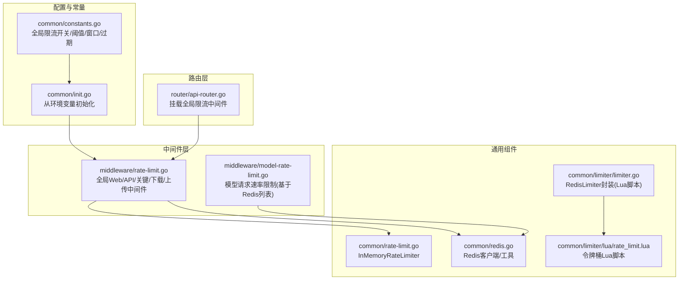
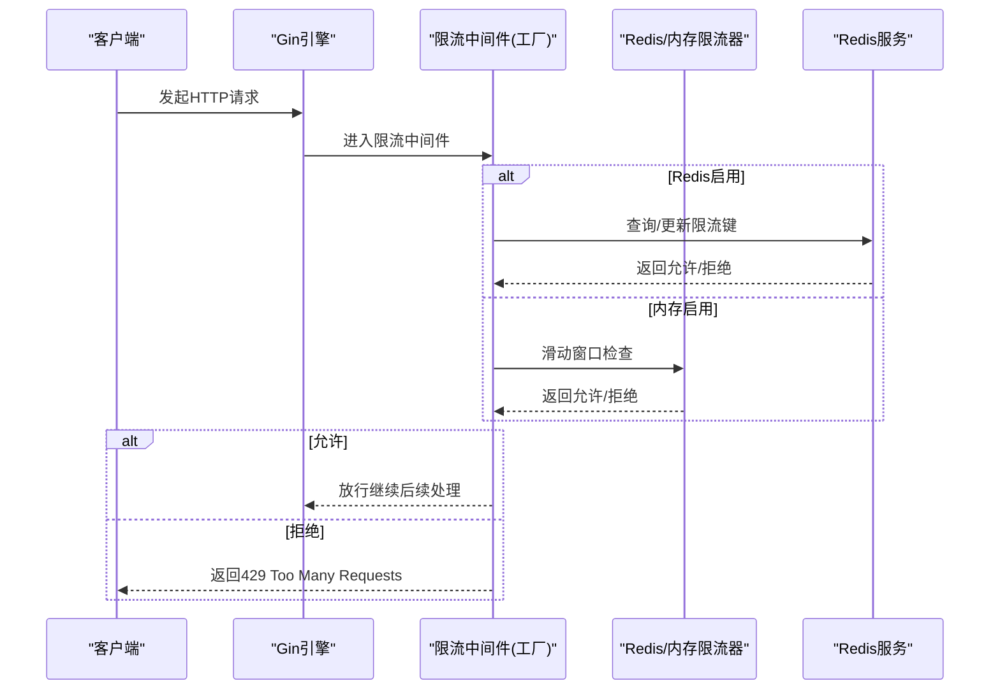
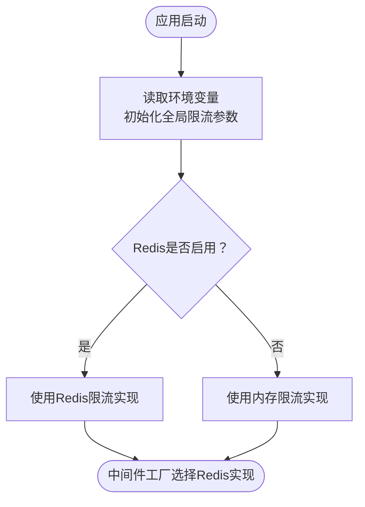
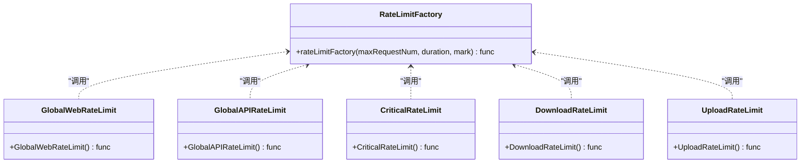
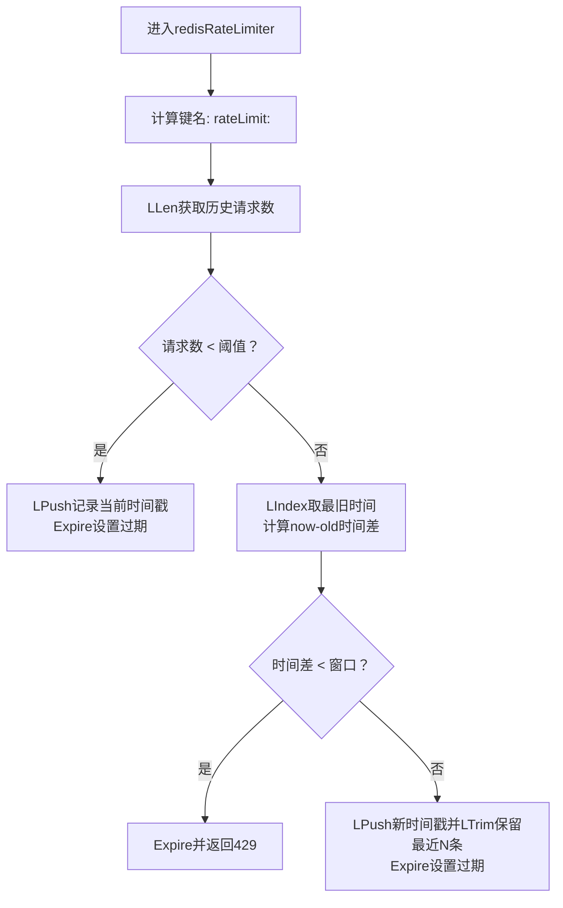
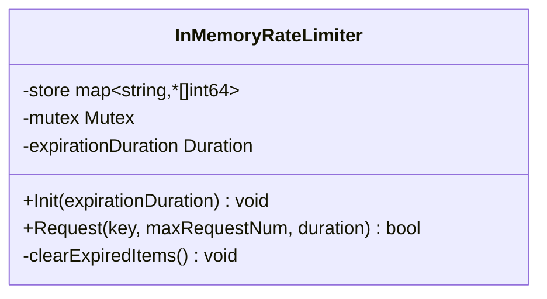
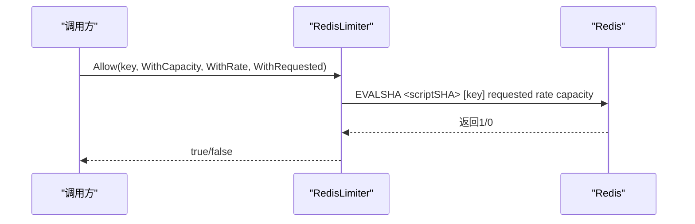
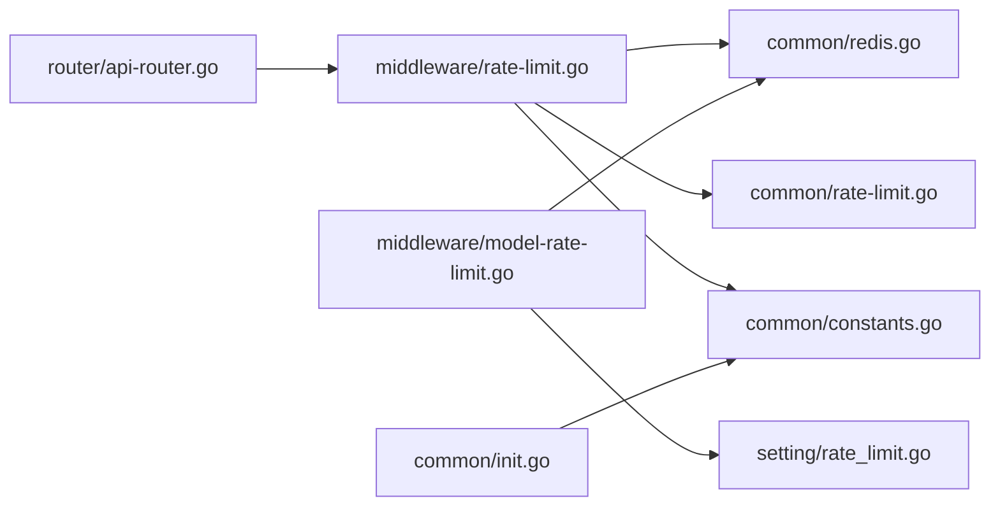

# 全局速率限制

<cite>
**本文引用的文件**
- [setting/rate_limit.go](file://setting/rate_limit.go)
- [middleware/rate-limit.go](file://middleware/rate-limit.go)
- [common/rate-limit.go](file://common/rate-limit.go)
- [common/limiter/limiter.go](file://common/limiter/limiter.go)
- [common/limiter/lua/rate_limit.lua](file://common/limiter/lua/rate_limit.lua)
- [common/redis.go](file://common/redis.go)
- [common/constants.go](file://common/constants.go)
- [common/init.go](file://common/init.go)
- [router/api-router.go](file://router/api-router.go)
- [middleware/model-rate-limit.go](file://middleware/model-rate-limit.go)
</cite>

## 目录
1. [简介](#简介)
2. [项目结构](#项目结构)
3. [核心组件](#核心组件)
4. [架构总览](#架构总览)
5. [详细组件分析](#详细组件分析)
6. [依赖关系分析](#依赖关系分析)
7. [性能考量](#性能考量)
8. [故障排查指南](#故障排查指南)
9. [结论](#结论)

## 简介
本文件系统性阐述本项目的全局速率限制机制，覆盖 Web 访问、API 调用、关键接口、下载与上传等多场景限流策略。重点说明如何通过配置文件与环境变量启用并设置全局限流参数（请求次数与时间窗口），解析 middleware/rate-limit.go 中 GlobalWebRateLimit、GlobalAPIRateLimit 等中间件的实现逻辑及其基于 Redis 或内存的两种实现模式；同时给出限流器工厂模式的创建流程与触发限流时返回 429 的处理流程，并讨论高并发下的稳定性影响与性能优化建议。

## 项目结构
围绕速率限制的关键目录与文件如下：
- setting/rate_limit.go：模型请求速率限制的分组配置与校验（非全局 Web/API 限流，但同属“请求速率限制”范畴）
- middleware/rate-limit.go：全局 Web/API、关键接口、下载、上传限流中间件与工厂函数
- common/rate-limit.go：内存限流器实现（InMemoryRateLimiter）
- common/limiter/limiter.go：Redis 限流器封装（Lua 令牌桶脚本）
- common/limiter/lua/rate_limit.lua：Redis Lua 令牌桶脚本
- common/redis.go：Redis 客户端初始化与工具方法
- common/constants.go：全局限流开关、阈值、窗口、过期时间等常量
- common/init.go：从环境变量初始化上述常量
- router/api-router.go：路由层挂载全局限流中间件
- middleware/model-rate-limit.go：模型请求速率限制（基于 Redis 列表的时间窗口检查）

图表来源
- [common/constants.go](file://common/constants.go#L154-L176)
- [common/init.go](file://common/init.go#L89-L113)
- [middleware/rate-limit.go](file://middleware/rate-limit.go#L1-L118)
- [middleware/model-rate-limit.go](file://middleware/model-rate-limit.go#L1-L62)
- [common/rate-limit.go](file://common/rate-limit.go#L1-L71)
- [common/redis.go](file://common/redis.go#L1-L328)
- [common/limiter/limiter.go](file://common/limiter/limiter.go#L1-L91)
- [common/limiter/lua/rate_limit.lua](file://common/limiter/lua/rate_limit.lua#L1-L44)
- [router/api-router.go](file://router/api-router.go#L1-L261)

章节来源
- [common/constants.go](file://common/constants.go#L154-L176)
- [common/init.go](file://common/init.go#L89-L113)
- [middleware/rate-limit.go](file://middleware/rate-limit.go#L1-L118)
- [router/api-router.go](file://router/api-router.go#L1-L261)

## 核心组件
- 全局 Web 限流：对 Web 页面访问进行限流，由 GlobalWebRateLimit 中间件控制
- 全局 API 限流：对 /api 下的请求进行限流，由 GlobalAPIRateLimit 中间件控制
- 关键接口限流：对注册、登录、重置密码、支付等敏感操作进行更严格限流，由 CriticalRateLimit 中间件控制
- 下载限流：对下载类接口进行限流，由 DownloadRateLimit 中间件控制
- 上传限流：对上传类接口进行限流，由 UploadRateLimit 中间件控制
- 内存限流器：InMemoryRateLimiter，基于内存队列实现滑动窗口
- Redis 限流器：RedisLimiter 封装，使用 Lua 令牌桶脚本实现
- 模型请求速率限制：基于 Redis 列表的时间窗口检查，支持按用户组配置

章节来源
- [middleware/rate-limit.go](file://middleware/rate-limit.go#L1-L118)
- [common/rate-limit.go](file://common/rate-limit.go#L1-L71)
- [common/limiter/limiter.go](file://common/limiter/limiter.go#L1-L91)
- [common/limiter/lua/rate_limit.lua](file://common/limiter/lua/rate_limit.lua#L1-L44)
- [middleware/model-rate-limit.go](file://middleware/model-rate-limit.go#L1-L62)

## 架构总览
全局限流采用“中间件工厂 + 两种后端”的架构设计：
- 工厂函数根据 Redis 是否启用选择不同的实现：Redis 模式或内存模式
- Redis 模式下，Web/API/关键/下载/上传中间件分别使用不同的标记前缀区分键空间
- 内存模式下，InMemoryRateLimiter 以客户端 IP 为键，维护滑动窗口队列
- 令牌桶 Lua 脚本用于 Redis 限流器，具备原子性与可扩展性

图表来源
- [middleware/rate-limit.go](file://middleware/rate-limit.go#L21-L88)
- [common/rate-limit.go](file://common/rate-limit.go#L44-L71)
- [common/redis.go](file://common/redis.go#L1-L328)

## 详细组件分析

### 配置与常量（启用/参数）
- 全局限流开关与默认值均来自环境变量初始化，未设置时使用默认值
- 常量定义了各场景的限流开关、请求数阈值、时间窗口、键过期时间等
- Redis 启用与否决定中间件选择 Redis 或内存实现

图表来源
- [common/init.go](file://common/init.go#L89-L113)
- [common/constants.go](file://common/constants.go#L154-L176)
- [common/redis.go](file://common/redis.go#L23-L54)

章节来源
- [common/init.go](file://common/init.go#L89-L113)
- [common/constants.go](file://common/constants.go#L154-L176)
- [common/redis.go](file://common/redis.go#L23-L54)

### 中间件工厂与全局限流中间件
- 工厂函数 rateLimitFactory 接收最大请求数、时间窗口与标记前缀，返回具体中间件
- GlobalWebRateLimit、GlobalAPIRateLimit、CriticalRateLimit、DownloadRateLimit、UploadRateLimit 分别包装不同场景
- 当对应场景开关关闭时，直接放行（defNext）

图表来源
- [middleware/rate-limit.go](file://middleware/rate-limit.go#L76-L118)

章节来源
- [middleware/rate-limit.go](file://middleware/rate-limit.go#L76-L118)

### Redis 模式实现
- redisRateLimiter 使用 Redis 列表存储每个客户端的请求时间戳，基于 LLen/LIndex/LPush/LTrim 实现滑动窗口
- 键格式为 "rateLimit:<mark><clientIP>"，过期时间由全局常量控制
- 触发限流时返回 429 并终止请求链路

图表来源
- [middleware/rate-limit.go](file://middleware/rate-limit.go#L21-L65)
- [common/redis.go](file://common/redis.go#L1-L328)
- [common/constants.go](file://common/constants.go#L176-L176)

章节来源
- [middleware/rate-limit.go](file://middleware/rate-limit.go#L21-L65)

### 内存模式实现
- memoryRateLimiter 基于 InMemoryRateLimiter，内部以 map 存储每个客户端的请求时间戳切片
- Request 方法实现滑动窗口判断：若队列长度小于阈值则允许；否则检查首元素与当前时间差是否超过窗口
- Init 方法在首次调用时初始化存储与过期清理协程

图表来源
- [common/rate-limit.go](file://common/rate-limit.go#L1-L71)

章节来源
- [common/rate-limit.go](file://common/rate-limit.go#L1-L71)

### 令牌桶 Lua 实现（RedisLimiter）
- RedisLimiter 封装了 Lua 令牌桶脚本，支持容量、速率、请求量等参数
- New 在首次调用时预加载脚本并缓存 SHA，Allow 原子执行脚本判断是否允许
- 适合需要更精细限流策略的场景（例如按秒生成令牌）

图表来源
- [common/limiter/limiter.go](file://common/limiter/limiter.go#L1-L91)
- [common/limiter/lua/rate_limit.lua](file://common/limiter/lua/rate_limit.lua#L1-L44)

章节来源
- [common/limiter/limiter.go](file://common/limiter/limiter.go#L1-L91)
- [common/limiter/lua/rate_limit.lua](file://common/limiter/lua/rate_limit.lua#L1-L44)

### 路由层挂载与使用
- /api 路由组统一挂载 GlobalAPIRateLimit 中间件，保障所有 API 请求受控
- 登录、注册、重置密码、支付等敏感路径额外挂载 CriticalRateLimit
- 路由层不直接包含 Web 页面路由（Web 路由在其他路由器中），Web 限流通过 GlobalWebRateLimit 中间件生效

章节来源
- [router/api-router.go](file://router/api-router.go#L1-L261)

### 模型请求速率限制（setting/rate_limit.go 与 middleware/model-rate-limit.go）
- setting/rate_limit.go 提供模型请求速率限制的分组配置与校验，支持 JSON 序列化/反序列化
- middleware/model-rate-limit.go 提供基于 Redis 列表的时间窗口检查，支持按组配置总请求数与成功请求数

章节来源
- [setting/rate_limit.go](file://setting/rate_limit.go#L1-L70)
- [middleware/model-rate-limit.go](file://middleware/model-rate-limit.go#L1-L62)

## 依赖关系分析
- 中间件依赖：
  - middleware/rate-limit.go 依赖 common/RDB（Redis 客户端）、InMemoryRateLimiter、全局常量
  - middleware/model-rate-limit.go 依赖 Redis 客户端、时间格式常量、分组配置
- 通用组件依赖：
  - common/redis.go 提供 Redis 客户端初始化与工具方法
  - common/limiter/limiter.go 依赖 Redis 客户端与 Lua 脚本
- 路由依赖：
  - router/api-router.go 依赖中间件与鉴权中间件

图表来源
- [router/api-router.go](file://router/api-router.go#L1-L261)
- [middleware/rate-limit.go](file://middleware/rate-limit.go#L1-L118)
- [middleware/model-rate-limit.go](file://middleware/model-rate-limit.go#L1-L62)
- [common/redis.go](file://common/redis.go#L1-L328)
- [common/rate-limit.go](file://common/rate-limit.go#L1-L71)
- [common/constants.go](file://common/constants.go#L154-L176)
- [common/init.go](file://common/init.go#L89-L113)
- [setting/rate_limit.go](file://setting/rate_limit.go#L1-L70)

## 性能考量
- Redis 模式
  - 优点：跨进程/跨实例共享状态，限流一致性强；Lua 脚本原子性高
  - 注意：网络延迟与 Redis 压力可能成为瓶颈；建议合理设置连接池大小与超时
- 内存模式
  - 优点：无外部依赖，延迟低；适合单实例部署
  - 注意：进程重启后状态丢失；需配合过期清理协程维持内存占用可控
- 令牌桶 Lua
  - 适合需要平滑限流与突发处理的场景；脚本预加载避免重复传输
- 高并发建议
  - 优先使用 Redis 模式；为 Redis 设置合适的连接池与超时
  - 对关键接口（注册/登录/支付）单独加严限流，避免被刷
  - 合理设置窗口与阈值，避免误伤正常用户
  - 对下载/上传接口设置独立限流，防止带宽被少数用户占满

[本节为通用指导，无需列出章节来源]

## 故障排查指南
- 触发 429 的常见原因
  - 请求频率超过阈值且未超过时间窗口
  - Redis 不可用导致中间件返回 500 后中止（Redis 模式）
  - 内存模式下滑动窗口判定失败
- 排查步骤
  - 检查环境变量是否正确设置（开关、阈值、窗口、过期时间）
  - 确认 Redis 连接字符串与连接状态
  - 查看日志中是否有 Redis 脚本加载失败或解析时间格式错误
  - 对关键接口增加日志输出，定位限流触发点
- 常见问题
  - 时间格式解析错误：确保系统时间一致，避免跨平台时间格式差异
  - Redis 过期时间与窗口不匹配：调整 RateLimitKeyExpirationDuration 与各场景窗口
  - 内存模式队列未清理：确认 Init 已调用且过期清理协程运行

章节来源
- [middleware/rate-limit.go](file://middleware/rate-limit.go#L21-L65)
- [common/rate-limit.go](file://common/rate-limit.go#L28-L42)
- [common/redis.go](file://common/redis.go#L23-L54)

## 结论
本项目的全局速率限制通过“中间件工厂 + Redis/内存双实现”的方式，覆盖 Web、API、关键接口、下载与上传等多场景。配置参数来源于环境变量并在初始化阶段注入全局常量，路由层统一挂载全局限流中间件，关键路径叠加更严格的限流策略。Redis 模式具备强一致性与原子性优势，内存模式适合单实例部署。结合合理的窗口与阈值设置、Redis 连接优化与日志监控，可在高并发下有效保护系统稳定运行。