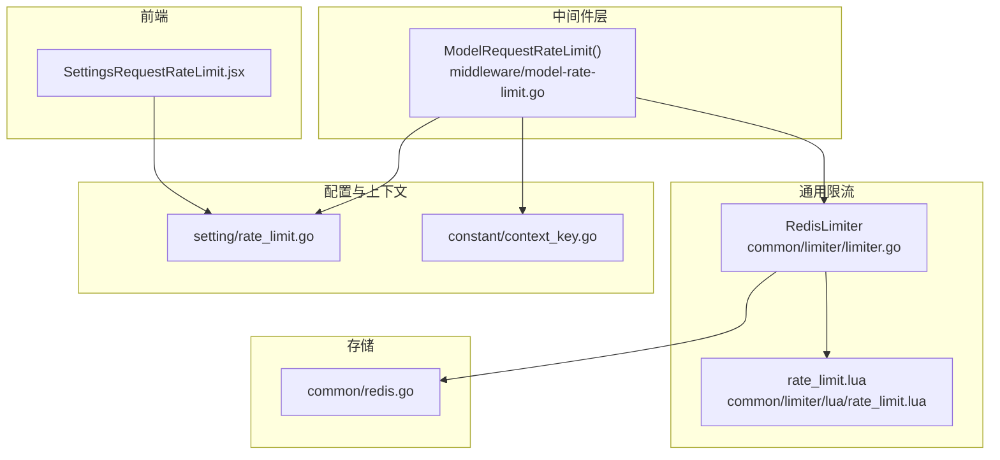
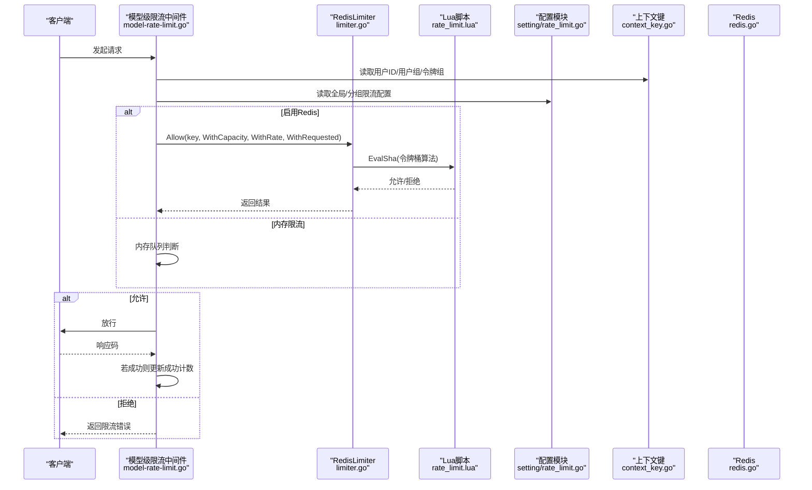
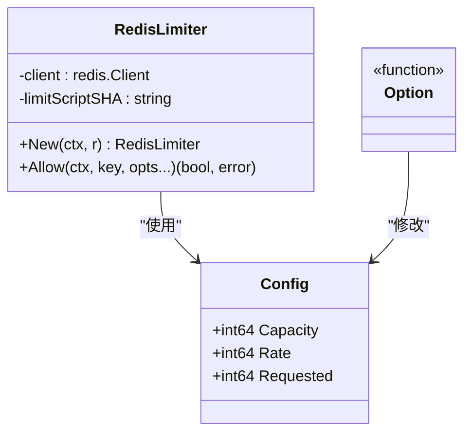
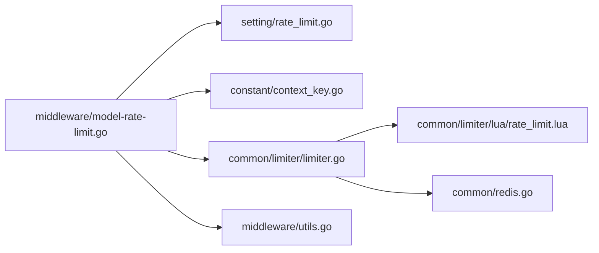
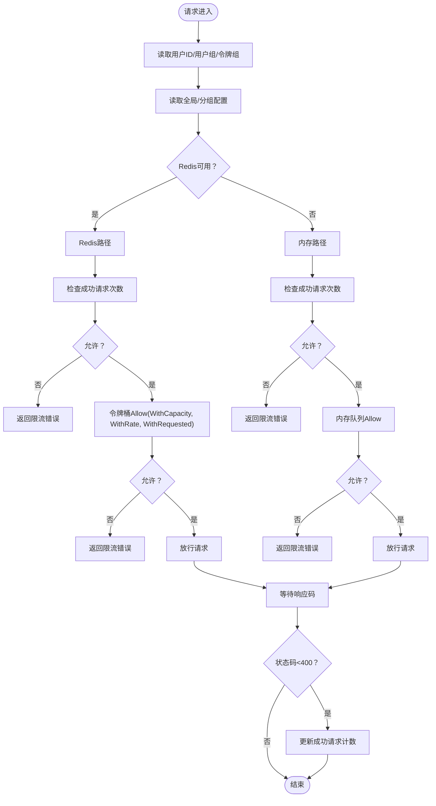

# 模型级速率限制

<cite>
**本文引用的文件列表**
- [middleware/model-rate-limit.go](file://middleware/model-rate-limit.go)
- [common/limiter/limiter.go](file://common/limiter/limiter.go)
- [common/limiter/lua/rate_limit.lua](file://common/limiter/lua/rate_limit.lua)
- [setting/rate_limit.go](file://setting/rate_limit.go)
- [controller/option.go](file://controller/option.go)
- [common/redis.go](file://common/redis.go)
- [constant/context_key.go](file://constant/context_key.go)
- [common/rate-limit.go](file://common/rate-limit.go)
- [middleware/utils.go](file://middleware/utils.go)
- [web/src/pages/Setting/RateLimit/SettingsRequestRateLimit.jsx](file://web/src/pages/Setting/RateLimit/SettingsRequestRateLimit.jsx)
</cite>

## 目录
1. [简介](#简介)
2. [项目结构与入口](#项目结构与入口)
3. [核心组件](#核心组件)
4. [架构总览](#架构总览)
5. [组件详解](#组件详解)
6. [依赖关系分析](#依赖关系分析)
7. [性能与一致性](#性能与一致性)
8. [故障排查](#故障排查)
9. [结论](#结论)
10. [附录：配置与调用流程](#附录配置与调用流程)

## 简介
本文件深入解析系统在“模型级”维度上的速率限制实现，目标是：
- 针对不同AI模型（如GPT-4、Claude等）可设置独立的请求配额与策略
- 结合用户组、令牌信息进行精细化控制
- 基于Redis Lua脚本的原子性令牌桶实现，确保分布式环境下的一致性与高性能
- 展示Option模式在配置限流参数（容量、速率、请求数）中的应用
- 提供完整的请求链路：从进入中间件、限流判断、放行或拒绝，到成功/失败后的计数更新

## 项目结构与入口
- 中间件层负责在请求生命周期早期介入，读取用户上下文、分组与全局配置，决定采用Redis或内存限流路径
- 限流核心位于通用模块，提供Redis Lua脚本封装与Option模式配置
- 设置模块维护全局与分组的速率限制配置，并通过控制器暴露配置接口
- 前端提供可视化配置界面，支持按用户组粒度配置“每周期最大请求次数/成功次数”

图表来源
- [middleware/model-rate-limit.go](file://middleware/model-rate-limit.go#L166-L201)
- [common/limiter/limiter.go](file://common/limiter/limiter.go#L1-L91)
- [common/limiter/lua/rate_limit.lua](file://common/limiter/lua/rate_limit.lua#L1-L44)
- [setting/rate_limit.go](file://setting/rate_limit.go#L1-L70)
- [constant/context_key.go](file://constant/context_key.go#L1-L59)
- [common/redis.go](file://common/redis.go#L1-L328)
- [web/src/pages/Setting/RateLimit/SettingsRequestRateLimit.jsx](file://web/src/pages/Setting/RateLimit/SettingsRequestRateLimit.jsx#L1-L243)

章节来源
- [middleware/model-rate-limit.go](file://middleware/model-rate-limit.go#L166-L201)
- [common/limiter/limiter.go](file://common/limiter/limiter.go#L1-L91)
- [common/limiter/lua/rate_limit.lua](file://common/limiter/lua/rate_limit.lua#L1-L44)
- [setting/rate_limit.go](file://setting/rate_limit.go#L1-L70)
- [constant/context_key.go](file://constant/context_key.go#L1-L59)
- [common/redis.go](file://common/redis.go#L1-L328)
- [web/src/pages/Setting/RateLimit/SettingsRequestRateLimit.jsx](file://web/src/pages/Setting/RateLimit/SettingsRequestRateLimit.jsx#L1-L243)

## 核心组件
- 模型级速率限制中间件：根据用户上下文与分组配置，选择Redis或内存限流路径；分别对“总请求次数”和“成功请求次数”进行限制
- 令牌桶限流器：封装Redis Lua脚本，以原子方式执行令牌桶算法，支持Option模式配置容量、速率、请求数
- 分组与全局配置：提供全局开关、周期、总量/成功量阈值，以及按用户组覆盖的配置
- 上下文键：从请求上下文中提取用户ID、用户组、令牌组等信息，用于区分不同用户与模型的配额
- 前端配置界面：提供开关、周期、总量/成功量阈值与分组配置的编辑与校验

章节来源
- [middleware/model-rate-limit.go](file://middleware/model-rate-limit.go#L1-L201)
- [common/limiter/limiter.go](file://common/limiter/limiter.go#L1-L91)
- [setting/rate_limit.go](file://setting/rate_limit.go#L1-L70)
- [constant/context_key.go](file://constant/context_key.go#L1-L59)
- [web/src/pages/Setting/RateLimit/SettingsRequestRateLimit.jsx](file://web/src/pages/Setting/RateLimit/SettingsRequestRateLimit.jsx#L1-L243)

## 架构总览
模型级速率限制的整体链路如下：
- 请求进入后，中间件读取用户上下文（用户ID、用户组、令牌组），计算当前周期与阈值
- 若启用Redis，使用令牌桶限流器进行原子判断；否则使用内存限流器
- 成功请求完成后，仅对“成功请求次数”进行计数更新；失败请求不影响成功计数
- 分组配置优先于全局配置，便于对不同用户群组（如VIP、默认组）实施差异化策略

图表来源
- [middleware/model-rate-limit.go](file://middleware/model-rate-limit.go#L166-L201)
- [common/limiter/limiter.go](file://common/limiter/limiter.go#L42-L69)
- [common/limiter/lua/rate_limit.lua](file://common/limiter/lua/rate_limit.lua#L1-L44)
- [setting/rate_limit.go](file://setting/rate_limit.go#L1-L70)
- [constant/context_key.go](file://constant/context_key.go#L1-L59)
- [common/redis.go](file://common/redis.go#L1-L328)

## 组件详解

### 中间件：模型级速率限制
- 功能要点
  - 读取用户上下文中的用户ID、用户组、令牌组，作为区分不同用户与模型配额的依据
  - 读取全局配置与分组配置，若存在分组覆盖则优先使用
  - 选择Redis或内存路径：
    - Redis路径：先检查“成功请求次数”，再通过令牌桶限流器检查“总请求次数”
    - 内存路径：同样顺序检查，但使用内存队列
  - 成功请求完成后，仅对“成功请求次数”进行计数更新

- 关键实现位置
  - 分组与全局配置读取与优先级：[middleware/model-rate-limit.go](file://middleware/model-rate-limit.go#L166-L201)
  - Redis路径的“成功请求次数”检查与“总请求次数”检查：[middleware/model-rate-limit.go](file://middleware/model-rate-limit.go#L77-L129)
  - 内存路径的检查与计数更新：[middleware/model-rate-limit.go](file://middleware/model-rate-limit.go#L131-L164)
  - 错误响应封装：[middleware/utils.go](file://middleware/utils.go#L11-L26)

章节来源
- [middleware/model-rate-limit.go](file://middleware/model-rate-limit.go#L1-L201)
- [middleware/utils.go](file://middleware/utils.go#L1-L36)

### 通用限流器：Redis Lua脚本与Option模式
- RedisLimiter
  - 单例初始化时预加载Lua脚本，缓存SHA值，避免重复传输
  - Allow方法通过EvalSha原子执行Lua脚本，传入Requested、Rate、Capacity三个参数
  - 返回值为布尔，true表示允许，false表示拒绝

- Lua脚本（令牌桶）
  - 数据结构：哈希表存储tokens与last_time
  - 核心逻辑：根据当前时间计算新增令牌，比较tokens与Requested，满足则扣减并更新状态
  - 过期策略：脚本中注释了可选的过期时间设置，实际使用中由上层中间件控制键的过期

- Option模式
  - Config包含Capacity、Rate、Requested三项
  - WithCapacity/WithRate/WithRequested为Option函数，用于以链式方式设置配置
  - 调用方通过Allow传入多个Option，实现灵活配置

- 关键实现位置
  - 限流器初始化与单例：[common/limiter/limiter.go](file://common/limiter/limiter.go#L26-L41)
  - Allow与Option模式：[common/limiter/limiter.go](file://common/limiter/limiter.go#L42-L91)
  - Lua脚本实现：[common/limiter/lua/rate_limit.lua](file://common/limiter/lua/rate_limit.lua#L1-L44)

图表来源
- [common/limiter/limiter.go](file://common/limiter/limiter.go#L1-L91)

章节来源
- [common/limiter/limiter.go](file://common/limiter/limiter.go#L1-L91)
- [common/limiter/lua/rate_limit.lua](file://common/limiter/lua/rate_limit.lua#L1-L44)

### 分组与全局配置
- 全局配置项
  - 开关：是否启用模型级速率限制
  - 周期：单位分钟，换算为秒参与限流计算
  - 总请求次数：包括失败请求
  - 成功请求次数：仅成功请求

- 分组配置
  - 以JSON对象形式存储，键为组名，值为[总次数, 成功次数]
  - 支持校验：总次数>=0，成功次数>=1，数值上限校验
  - 优先级高于全局配置

- 关键实现位置
  - 全局配置变量与读写：[setting/rate_limit.go](file://setting/rate_limit.go#L1-L70)
  - 控制器校验与更新：[controller/option.go](file://controller/option.go#L167-L175)
  - 前端配置界面与校验规则：[web/src/pages/Setting/RateLimit/SettingsRequestRateLimit.jsx](file://web/src/pages/Setting/RateLimit/SettingsRequestRateLimit.jsx#L1-L243)

章节来源
- [setting/rate_limit.go](file://setting/rate_limit.go#L1-L70)
- [controller/option.go](file://controller/option.go#L167-L175)
- [web/src/pages/Setting/RateLimit/SettingsRequestRateLimit.jsx](file://web/src/pages/Setting/RateLimit/SettingsRequestRateLimit.jsx#L1-L243)

### 上下文键与用户组
- 从请求上下文中读取用户ID、用户组、令牌组等键，用于区分不同用户与模型的配额
- 中间件优先尝试令牌组，其次用户组，最终回退到用户ID

- 关键实现位置
  - 上下文键定义：[constant/context_key.go](file://constant/context_key.go#L1-L59)
  - 中间件读取与回退逻辑：[middleware/model-rate-limit.go](file://middleware/model-rate-limit.go#L180-L191)

章节来源
- [constant/context_key.go](file://constant/context_key.go#L1-L59)
- [middleware/model-rate-limit.go](file://middleware/model-rate-limit.go#L176-L191)

### 内存限流器（备用路径）
- 当Redis未启用时，中间件使用内存队列实现滑动窗口限流
- 通过内存队列记录时间戳，按周期窗口判断是否允许

- 关键实现位置
  - 内存限流器实现：[common/rate-limit.go](file://common/rate-limit.go#L1-L70)
  - 中间件内存路径调用：[middleware/model-rate-limit.go](file://middleware/model-rate-limit.go#L131-L164)

章节来源
- [common/rate-limit.go](file://common/rate-limit.go#L1-L70)
- [middleware/model-rate-limit.go](file://middleware/model-rate-limit.go#L131-L164)

## 依赖关系分析
- 中间件依赖
  - 配置模块：读取全局与分组配置
  - 上下文键：获取用户ID与用户组
  - 通用限流器：Redis路径使用令牌桶，内存路径使用滑动窗口
  - Redis：提供原子Lua执行能力
  - 错误封装：统一返回OpenAI风格错误

- 限流器依赖
  - Redis客户端：执行Lua脚本与键管理
  - Lua脚本：原子令牌桶算法

图表来源
- [middleware/model-rate-limit.go](file://middleware/model-rate-limit.go#L1-L201)
- [setting/rate_limit.go](file://setting/rate_limit.go#L1-L70)
- [constant/context_key.go](file://constant/context_key.go#L1-L59)
- [common/limiter/limiter.go](file://common/limiter/limiter.go#L1-L91)
- [common/limiter/lua/rate_limit.lua](file://common/limiter/lua/rate_limit.lua#L1-L44)
- [common/redis.go](file://common/redis.go#L1-L328)
- [middleware/utils.go](file://middleware/utils.go#L1-L36)

章节来源
- [middleware/model-rate-limit.go](file://middleware/model-rate-limit.go#L1-L201)
- [common/limiter/limiter.go](file://common/limiter/limiter.go#L1-L91)
- [common/limiter/lua/rate_limit.lua](file://common/limiter/lua/rate_limit.lua#L1-L44)
- [setting/rate_limit.go](file://setting/rate_limit.go#L1-L70)
- [constant/context_key.go](file://constant/context_key.go#L1-L59)
- [common/redis.go](file://common/redis.go#L1-L328)
- [middleware/utils.go](file://middleware/utils.go#L1-L36)

## 性能与一致性
- 原子性与一致性
  - Redis路径通过Lua脚本原子执行令牌桶算法，避免竞态条件
  - 中间件在成功请求后才更新成功计数，确保统计准确
  - 分布式一致性：所有节点共享同一Redis实例，限流状态一致

- 性能优势
  - Lua脚本在Redis服务端执行，减少网络往返与序列化开销
  - 单例限流器预加载脚本，降低脚本传输成本
  - 内存路径适合单机部署或Redis不可用场景，避免外部依赖

- 适用场景
  - 高并发：推荐Redis路径，利用原子Lua与集中式状态
  - 低延迟：内存路径在本地内存中完成判断，适合轻量部署

章节来源
- [common/limiter/limiter.go](file://common/limiter/limiter.go#L26-L41)
- [common/limiter/lua/rate_limit.lua](file://common/limiter/lua/rate_limit.lua#L1-L44)
- [middleware/model-rate-limit.go](file://middleware/model-rate-limit.go#L131-L164)

## 故障排查
- 常见问题
  - Redis连接失败：中间件在检查Redis路径时会返回内部错误，需检查连接字符串与网络
  - 配置非法：分组配置需满足“总次数>=0，成功次数>=1，数值上限校验”，否则更新失败
  - 限流频繁触发：检查周期与阈值设置是否过严，或是否存在大量失败请求导致“总请求次数”快速耗尽

- 排查步骤
  - 查看中间件日志与错误响应：[middleware/utils.go](file://middleware/utils.go#L11-L26)
  - 校验配置合法性：[controller/option.go](file://controller/option.go#L167-L175)
  - 检查Redis可用性与键过期策略：[common/redis.go](file://common/redis.go#L1-L328)

章节来源
- [middleware/utils.go](file://middleware/utils.go#L1-L36)
- [controller/option.go](file://controller/option.go#L167-L175)
- [common/redis.go](file://common/redis.go#L1-L328)

## 结论
该模型级速率限制方案通过“中间件+通用限流器+配置模块”的组合，实现了：
- 面向用户的精细化控制（按用户ID、用户组、令牌组）
- 分组优先的差异化策略（VIP、默认组等）
- 基于Redis Lua脚本的原子性令牌桶，保证分布式一致性与高性能
- Option模式的灵活配置，便于扩展与维护

## 附录：配置与调用流程

### 配置项说明
- 开关：是否启用模型级速率限制
- 周期：单位分钟，决定统计窗口长度
- 总请求次数：包括失败请求
- 成功请求次数：仅成功请求
- 分组配置：JSON对象，键为组名，值为[总次数, 成功次数]

章节来源
- [setting/rate_limit.go](file://setting/rate_limit.go#L1-L70)
- [web/src/pages/Setting/RateLimit/SettingsRequestRateLimit.jsx](file://web/src/pages/Setting/RateLimit/SettingsRequestRateLimit.jsx#L1-L243)

### 代码调用流程（从请求进入至放行/拒绝）

图表来源
- [middleware/model-rate-limit.go](file://middleware/model-rate-limit.go#L77-L129)
- [middleware/model-rate-limit.go](file://middleware/model-rate-limit.go#L131-L164)
- [common/limiter/limiter.go](file://common/limiter/limiter.go#L42-L69)

### 针对不同模型的配额设置建议
- 不同模型（如GPT-4、Claude等）的配额可通过“分组配置”实现差异化：
  - 将不同模型的使用者归属到不同用户组（例如“gpt4_group”、“claude_group”）
  - 在分组配置中分别为各组设置不同的[总请求次数, 成功请求次数]
  - 保持周期一致，确保统计口径统一

章节来源
- [setting/rate_limit.go](file://setting/rate_limit.go#L1-L70)
- [constant/context_key.go](file://constant/context_key.go#L1-L59)