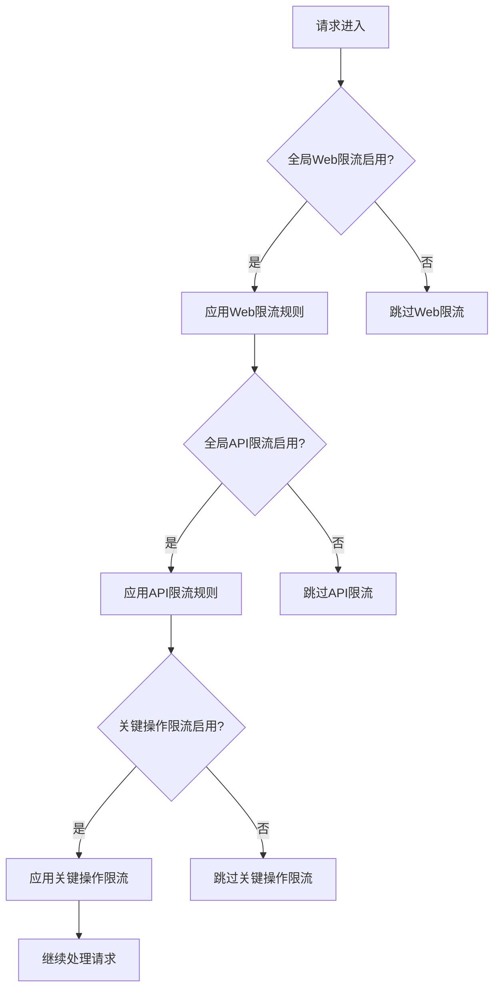
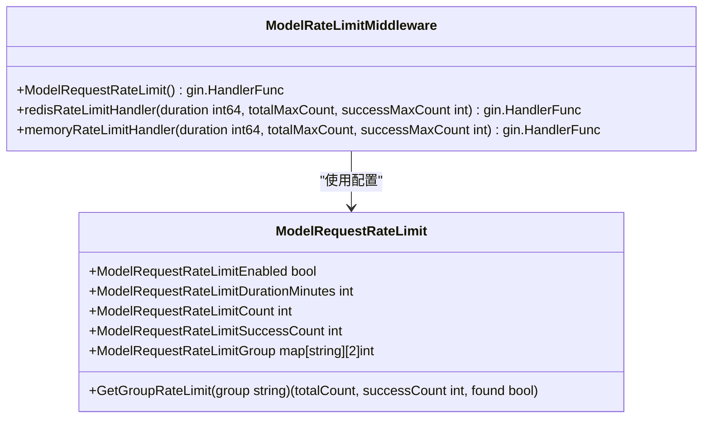
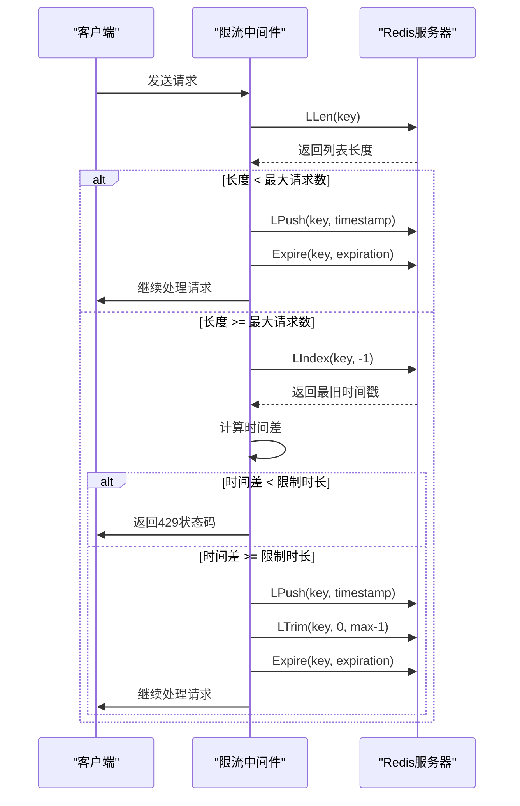
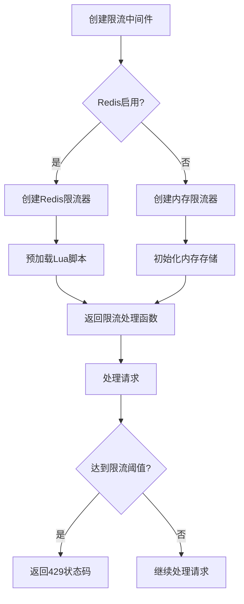
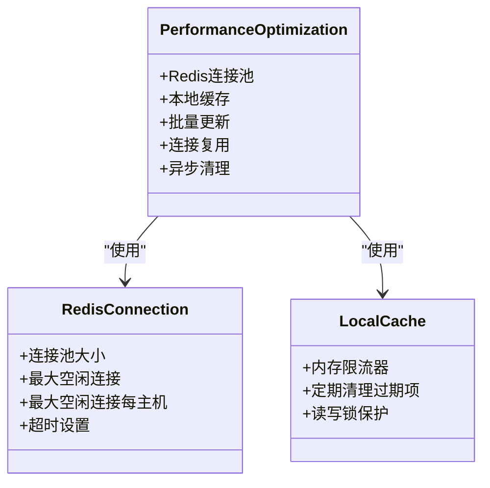
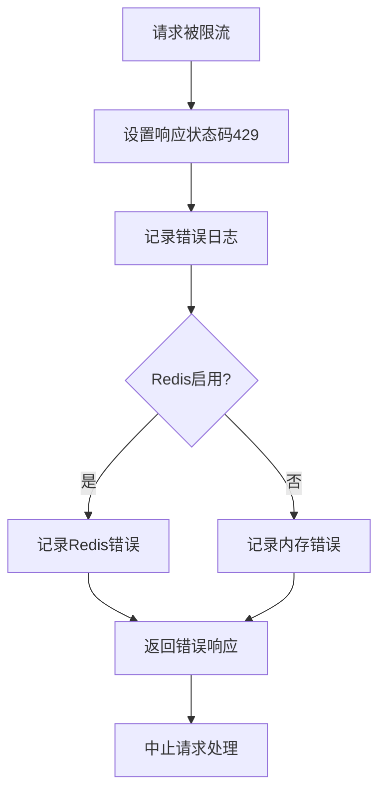

# 速率限制策略

<cite>
**本文档引用的文件**
- [rate_limit.go](file://setting/rate_limit.go)
- [rate-limit.go](file://middleware/rate-limit.go)
- [model-rate-limit.go](file://middleware/model-rate-limit.go)
- [limiter.go](file://common/limiter/limiter.go)
- [rate_limit.lua](file://common/limiter/lua/rate_limit.lua)
- [constants.go](file://common/constants.go)
- [redis.go](file://common/redis.go)
- [config.go](file://setting/config/config.go)
- [relay-router.go](file://router/relay-router.go)
</cite>

## 目录
1. [引言](#引言)
2. [全局速率限制](#全局速率限制)
3. [模型级速率限制](#模型级速率限制)
4. [基于Redis的分布式限流算法](#基于redis的分布式限流算法)
5. [Lua脚本的原子性操作](#lua脚本的原子性操作)
6. [配置管理与用户组配额](#配置管理与用户组配额)
7. [限流中间件调用流程](#限流中间件调用流程)
8. [高并发场景下的性能优化](#高并发场景下的性能优化)
9. [响应行为与错误处理](#响应行为与错误处理)
10. [总结](#总结)

## 引言
本系统实现了多层次的速率限制策略，包括全局速率限制和模型级速率限制。系统支持基于Redis的分布式限流和内存限流两种模式，通过配置文件或管理界面可以灵活设置不同用户组、不同模型的请求配额。当达到速率限制时，系统会返回429状态码。在高并发场景下，系统通过本地缓存等机制优化性能，减少对Redis的压力。

## 全局速率限制
系统实现了多种全局速率限制策略，包括Web访问限制、API访问限制、关键操作限制、上传和下载限制等。这些限制通过中间件实现，可以在配置文件中启用或禁用。



**Diagram sources**
- [rate-limit.go](file://middleware/rate-limit.go#L90-L117)

**Section sources**
- [rate-limit.go](file://middleware/rate-limit.go#L90-L117)
- [constants.go](file://common/constants.go#L157-L176)

## 模型级速率限制
模型级速率限制针对特定模型的请求进行控制，支持按用户组设置不同的配额。系统区分总请求数限制和成功请求数限制，提供更精细的控制。



**Diagram sources**
- [rate_limit.go](file://setting/rate_limit.go#L12-L51)
- [model-rate-limit.go](file://middleware/model-rate-limit.go#L167-L200)

**Section sources**
- [rate_limit.go](file://setting/rate_limit.go#L12-L51)
- [model-rate-limit.go](file://middleware/model-rate-limit.go#L167-L200)

## 基于Redis的分布式限流算法
系统采用基于Redis的分布式限流算法，利用Redis的原子操作特性确保在分布式环境下的限流准确性。算法使用列表数据结构存储请求时间戳，通过LPush、LTrim和Expire等命令实现滑动窗口限流。



**Diagram sources**
- [rate-limit.go](file://middleware/rate-limit.go#L21-L64)
- [redis.go](file://common/redis.go#L64-L97)

**Section sources**
- [rate-limit.go](file://middleware/rate-limit.go#L21-L64)
- [redis.go](file://common/redis.go#L64-L97)

## Lua脚本的原子性操作
系统使用Lua脚本实现令牌桶算法，确保限流操作的原子性。Lua脚本在Redis服务器端执行，避免了网络往返延迟，提高了性能和准确性。

```mermaid
flowchart TD
A[开始执行Lua脚本] --> B[获取当前时间]
B --> C[获取桶状态]
C --> D{桶是否存在?}
D --> |否| E[初始化桶: tokens=capacity, last_time=now]
D --> |是| F[计算新增令牌: add_tokens=elapsed*rate]
F --> G[更新令牌数: tokens=min(capacity, tokens+add_tokens)]
G --> H[判断是否允许请求: tokens>=requested?]
H --> |是| I[减少令牌: tokens=tokens-requested]
H --> |否| J[拒绝请求]
I --> K[更新桶状态]
J --> K
K --> L[设置过期时间]
L --> M[返回结果]
```

**Diagram sources**
- [rate_limit.lua](file://common/limiter/lua/rate_limit.lua#L1-L44)
- [limiter.go](file://common/limiter/limiter.go#L56-L63)

**Section sources**
- [rate_limit.lua](file://common/limiter/lua/rate_limit.lua#L1-L44)
- [limiter.go](file://common/limiter/limiter.go#L56-L63)

## 配置管理与用户组配额
系统通过配置管理器统一管理所有配置，支持从数据库加载和保存配置。用户组配额可以通过JSON格式进行配置和验证。

```mermaid
classDiagram
class ConfigManager {
+configs map[string]interface{}
+Register(name string, config interface{})
+Get(name string) interface{}
+LoadFromDB(options map[string]string) error
+SaveToDB(updateFunc func(key, value string) error) error
+ExportAllConfigs() map[string]string
}
class RateLimitConfig {
+ModelRequestRateLimitEnabled bool
+ModelRequestRateLimitDurationMinutes int
+ModelRequestRateLimitCount int
+ModelRequestRateLimitSuccessCount int
+ModelRequestRateLimitGroup map[string][2]int
+UpdateModelRequestRateLimitGroupByJSONString(jsonStr string) error
+CheckModelRequestRateLimitGroup(jsonStr string) error
}
ConfigManager --> RateLimitConfig : "注册和管理"
```

**Diagram sources**
- [config.go](file://setting/config/config.go#L13-L288)
- [rate_limit.go](file://setting/rate_limit.go#L12-L70)

**Section sources**
- [config.go](file://setting/config/config.go#L13-L288)
- [rate_limit.go](file://setting/rate_limit.go#L12-L70)

## 限流中间件调用流程
限流中间件的调用流程包括创建限流器、应用限流规则和处理请求结果。系统根据配置选择使用Redis或内存限流器。



**Diagram sources**
- [limiter.go](file://common/limiter/limiter.go#L26-L40)
- [rate-limit.go](file://middleware/rate-limit.go#L76-L87)

**Section sources**
- [limiter.go](file://common/limiter/limiter.go#L26-L40)
- [rate-limit.go](file://middleware/rate-limit.go#L76-L87)

## 高并发场景下的性能优化
在高并发场景下，系统通过多种机制优化性能，包括使用本地缓存减少Redis压力、批量更新和连接池等。



**Diagram sources**
- [redis.go](file://common/redis.go#L39-L40)
- [rate-limit.go](file://middleware/rate-limit.go#L14-L42)

**Section sources**
- [redis.go](file://common/redis.go#L39-L40)
- [rate-limit.go](file://middleware/rate-limit.go#L14-L42)

## 响应行为与错误处理
当达到速率限制时，系统会返回HTTP 429状态码（Too Many Requests），并中止请求处理。系统还提供了详细的错误日志记录和监控。



**Diagram sources**
- [rate-limit.go](file://middleware/rate-limit.go#L56-L57)
- [model-rate-limit.go](file://middleware/model-rate-limit.go#L93-L94)

**Section sources**
- [rate-limit.go](file://middleware/rate-limit.go#L56-L57)
- [model-rate-limit.go](file://middleware/model-rate-limit.go#L93-L94)

## 总结
本系统的速率限制策略实现了多层次、精细化的请求控制。通过全局限流和模型级限流相结合，支持基于Redis的分布式限流和内存限流两种模式。系统使用Lua脚本确保原子性操作，通过配置管理器实现灵活的配额设置。在高并发场景下，系统通过连接池、本地缓存等机制优化性能。当达到速率限制时，系统会返回标准的429状态码，确保客户端能够正确处理限流情况。