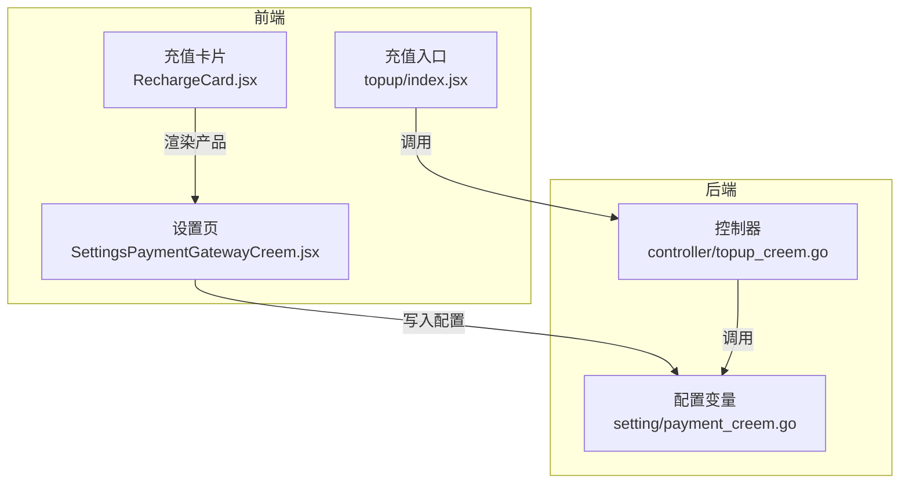
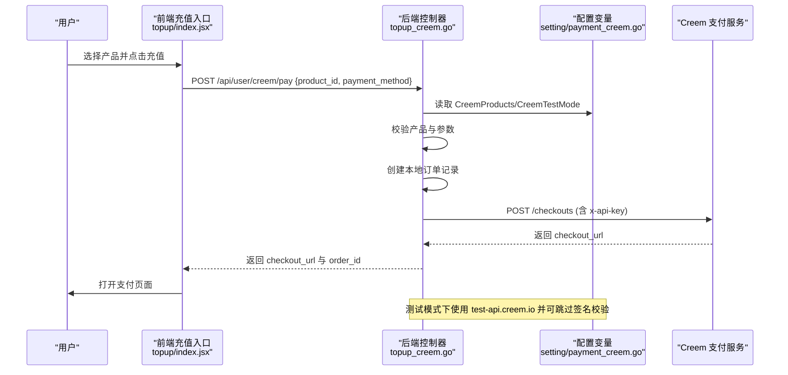
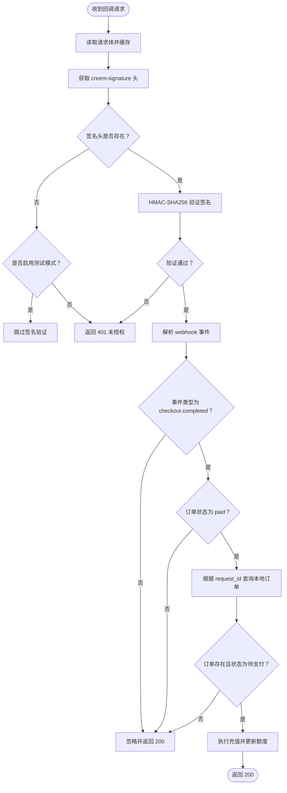
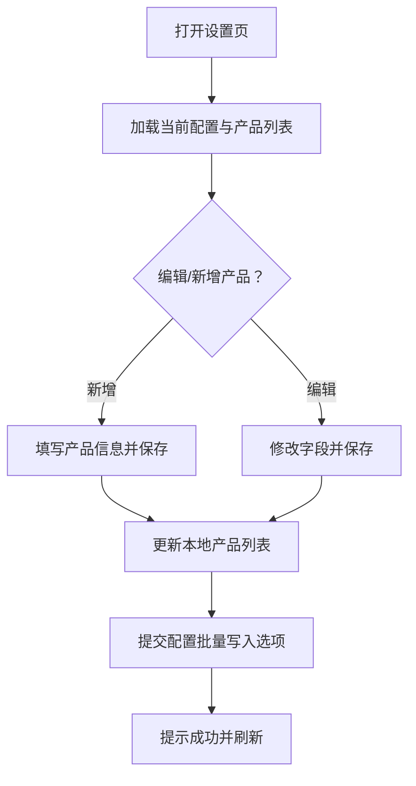
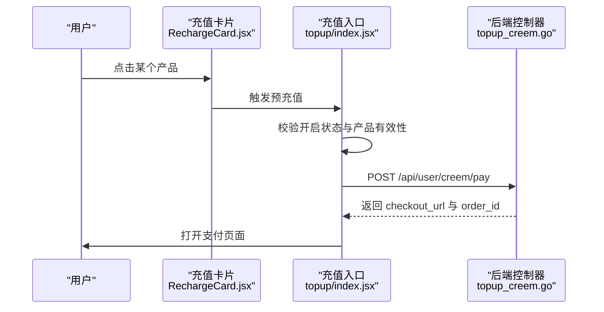
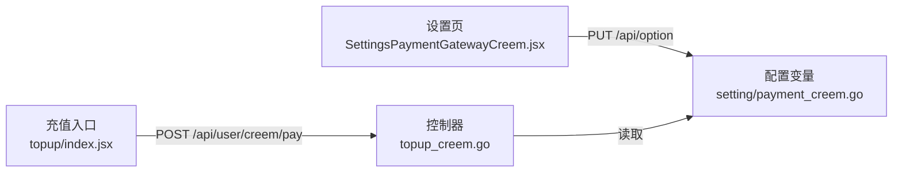

# Creem支付配置

<cite>
**本文引用的文件**
- [controller/topup_creem.go](file://controller/topup_creem.go)
- [setting/payment_creem.go](file://setting/payment_creem.go)
- [web/src/pages/Setting/Payment/SettingsPaymentGatewayCreem.jsx](file://web/src/pages/Setting/Payment/SettingsPaymentGatewayCreem.jsx)
- [web/src/components/topup/index.jsx](file://web/src/components/topup/index.jsx)
- [web/src/components/topup/RechargeCard.jsx](file://web/src/components/topup/RechargeCard.jsx)
</cite>

## 目录
1. [简介](#简介)
2. [项目结构](#项目结构)
3. [核心组件](#核心组件)
4. [架构总览](#架构总览)
5. [详细组件分析](#详细组件分析)
6. [依赖关系分析](#依赖关系分析)
7. [性能考量](#性能考量)
8. [故障排查指南](#故障排查指南)
9. [结论](#结论)
10. [附录](#附录)

## 简介
本指南面向系统管理员与开发者，提供 Creem 支付网关的完整配置与使用说明。重点覆盖以下方面：
- CreemApiKey、CreemWebhookSecret 等认证信息的配置方式与安全建议
- CreemProducts 配置项的 JSON 结构定义及与产品目录的映射关系（名称、价格、配额、货币）
- CreemTestMode 测试模式的启用机制及其对支付流程的影响
- 基于前端组件的动态产品管理（添加、编辑、删除）操作流程
- 支付回调数据验证的最佳实践，确保交易数据的完整性与安全性

## 项目结构
Creem 支付相关能力由后端控制器与前端设置界面共同实现：
- 后端控制器负责支付下单、回调签名校验、订单状态处理与额度充值
- 前端设置页提供 Creem 配置项的可视化编辑与产品目录维护
- 前端充值卡片与充值入口调用后端接口发起支付

图表来源
- [controller/topup_creem.go](file://controller/topup_creem.go#L1-L140)
- [setting/payment_creem.go](file://setting/payment_creem.go#L1-L7)
- [web/src/pages/Setting/Payment/SettingsPaymentGatewayCreem.jsx](file://web/src/pages/Setting/Payment/SettingsPaymentGatewayCreem.jsx#L1-L120)
- [web/src/components/topup/index.jsx](file://web/src/components/topup/index.jsx#L257-L304)
- [web/src/components/topup/RechargeCard.jsx](file://web/src/components/topup/RechargeCard.jsx#L488-L516)

章节来源
- [controller/topup_creem.go](file://controller/topup_creem.go#L1-L140)
- [setting/payment_creem.go](file://setting/payment_creem.go#L1-L7)
- [web/src/pages/Setting/Payment/SettingsPaymentGatewayCreem.jsx](file://web/src/pages/Setting/Payment/SettingsPaymentGatewayCreem.jsx#L1-L120)
- [web/src/components/topup/index.jsx](file://web/src/components/topup/index.jsx#L257-L304)
- [web/src/components/topup/RechargeCard.jsx](file://web/src/components/topup/RechargeCard.jsx#L488-L516)

## 核心组件
- 后端控制器（controller/topup_creem.go）
  - 提供支付下单接口与回调接口
  - 实现 HMAC-SHA256 回调签名校验
  - 读取配置变量进行 API 调用与测试模式切换
- 配置变量（setting/payment_creem.go）
  - 存储 CreemApiKey、CreemWebhookSecret、CreemProducts、CreemTestMode
- 前端设置页（web/src/pages/Setting/Payment/SettingsPaymentGatewayCreem.jsx）
  - 可视化编辑 Creem 配置项
  - 维护产品目录（增删改查）
- 前端充值入口与卡片（web/src/components/topup/index.jsx、RechargeCard.jsx）
  - 展示可选产品并发起支付请求

章节来源
- [controller/topup_creem.go](file://controller/topup_creem.go#L1-L140)
- [setting/payment_creem.go](file://setting/payment_creem.go#L1-L7)
- [web/src/pages/Setting/Payment/SettingsPaymentGatewayCreem.jsx](file://web/src/pages/Setting/Payment/SettingsPaymentGatewayCreem.jsx#L1-L120)
- [web/src/components/topup/index.jsx](file://web/src/components/topup/index.jsx#L257-L304)
- [web/src/components/topup/RechargeCard.jsx](file://web/src/components/topup/RechargeCard.jsx#L488-L516)

## 架构总览
下图展示了从用户点击充值到 Creem 回调处理的关键交互路径，以及签名验证与测试模式的影响。

图表来源
- [controller/topup_creem.go](file://controller/topup_creem.go#L144-L210)
- [controller/topup_creem.go](file://controller/topup_creem.go#L378-L461)
- [setting/payment_creem.go](file://setting/payment_creem.go#L1-L7)
- [web/src/components/topup/index.jsx](file://web/src/components/topup/index.jsx#L257-L304)

## 详细组件分析

### 后端控制器：支付下单与回调处理
- 支付下单
  - 接收 product_id 与 payment_method，校验支付方式为 creem
  - 解析 CreemProducts，按 productId 匹配目标产品
  - 生成唯一订单号并创建本地订单记录（状态为待支付）
  - 调用 Creem API 创建支付链接（携带 x-api-key），返回 checkout_url 与 order_id
- 回调处理
  - 读取 creem-signature 头，若缺失且未启用测试模式则拒绝
  - 使用 HMAC-SHA256 对请求体进行签名验证
  - 解析 webhook 数据，仅处理 checkout.completed 事件
  - 校验订单状态为 paid、订单类型为 onetime，并通过本地订单号查询订单
  - 调用充值逻辑，更新用户额度

图表来源
- [controller/topup_creem.go](file://controller/topup_creem.go#L240-L362)

章节来源
- [controller/topup_creem.go](file://controller/topup_creem.go#L144-L210)
- [controller/topup_creem.go](file://controller/topup_creem.go#L240-L362)

### 配置变量：CreemApiKey、CreemWebhookSecret、CreemProducts、CreemTestMode
- CreemApiKey
  - 用于调用 Creem API 的鉴权头 x-api-key
  - 若未配置，创建支付链接会直接失败
- CreemWebhookSecret
  - 用于 HMAC-SHA256 回调签名校验
  - 若未配置且未启用测试模式，回调将被拒绝
- CreemProducts
  - JSON 数组字符串，定义可用产品清单
  - 控制器在下单时解析该数组以匹配产品
- CreemTestMode
  - 开启后：
    - 使用 test-api.creem.io 发起支付
    - 回调签名验证可被跳过（便于本地联调）

章节来源
- [setting/payment_creem.go](file://setting/payment_creem.go#L1-L7)
- [controller/topup_creem.go](file://controller/topup_creem.go#L378-L461)
- [controller/topup_creem.go](file://controller/topup_creem.go#L240-L270)

### 前端设置页：动态产品管理
- 表单字段
  - CreemApiKey：API 密钥（密码输入）
  - CreemWebhookSecret：Webhook 密钥（密码输入）
  - CreemTestMode：测试模式开关
  - 产品配置表：名称、产品ID、价格、充值额度、货币
- 动作流程
  - 添加/编辑产品：校验必填字段与正数约束；编辑时锁定产品ID不可变
  - 删除产品：按 productId 过滤
  - 提交设置：将配置项与产品数组以选项键值形式批量保存

图表来源
- [web/src/pages/Setting/Payment/SettingsPaymentGatewayCreem.jsx](file://web/src/pages/Setting/Payment/SettingsPaymentGatewayCreem.jsx#L1-L120)
- [web/src/pages/Setting/Payment/SettingsPaymentGatewayCreem.jsx](file://web/src/pages/Setting/Payment/SettingsPaymentGatewayCreem.jsx#L120-L304)

章节来源
- [web/src/pages/Setting/Payment/SettingsPaymentGatewayCreem.jsx](file://web/src/pages/Setting/Payment/SettingsPaymentGatewayCreem.jsx#L1-L304)

### 前端充值入口与卡片：发起支付
- 充值卡片
  - 渲染 Creem 可用产品列表（名称、价格、充值额度、货币）
- 充值入口
  - 校验是否开启 Creem 充值与所选产品有效性
  - 调用后端 /api/user/creem/pay，携带 product_id 与 payment_method
  - 成功后打开 checkout_url

图表来源
- [web/src/components/topup/RechargeCard.jsx](file://web/src/components/topup/RechargeCard.jsx#L488-L516)
- [web/src/components/topup/index.jsx](file://web/src/components/topup/index.jsx#L257-L304)
- [controller/topup_creem.go](file://controller/topup_creem.go#L144-L210)

章节来源
- [web/src/components/topup/RechargeCard.jsx](file://web/src/components/topup/RechargeCard.jsx#L488-L516)
- [web/src/components/topup/index.jsx](file://web/src/components/topup/index.jsx#L257-L304)
- [controller/topup_creem.go](file://controller/topup_creem.go#L144-L210)

## 依赖关系分析
- 后端控制器依赖配置变量模块读取 Creem 配置
- 前端设置页依赖后端选项接口批量写入配置
- 前端充值入口依赖后端支付接口返回支付链接

图表来源
- [web/src/pages/Setting/Payment/SettingsPaymentGatewayCreem.jsx](file://web/src/pages/Setting/Payment/SettingsPaymentGatewayCreem.jsx#L73-L118)
- [controller/topup_creem.go](file://controller/topup_creem.go#L144-L210)
- [setting/payment_creem.go](file://setting/payment_creem.go#L1-L7)

章节来源
- [web/src/pages/Setting/Payment/SettingsPaymentGatewayCreem.jsx](file://web/src/pages/Setting/Payment/SettingsPaymentGatewayCreem.jsx#L73-L118)
- [controller/topup_creem.go](file://controller/topup_creem.go#L144-L210)
- [setting/payment_creem.go](file://setting/payment_creem.go#L1-L7)

## 性能考量
- 支付请求超时控制：后端调用 Creem API 设置了固定超时时间，避免阻塞
- 回调签名校验采用 HMAC-SHA256，计算成本低但能有效防止伪造
- 本地订单状态幂等处理：若订单非待支付或已处理过，直接返回成功，避免重复处理

章节来源
- [controller/topup_creem.go](file://controller/topup_creem.go#L378-L461)
- [controller/topup_creem.go](file://controller/topup_creem.go#L294-L362)

## 故障排查指南
- 回调 401 未授权
  - 检查是否正确配置 CreemWebhookSecret
  - 若处于测试阶段，确认已启用 CreemTestMode
- 回调被忽略
  - 确认事件类型为 checkout.completed
  - 确认订单状态为 paid
  - 确认订单类型为 onetime
- 支付失败
  - 检查 CreemApiKey 是否配置
  - 检查 CreemProducts 中是否存在对应 productId
  - 检查网络连通性与 Creem API 状态
- 本地订单异常
  - 确认订单状态为待支付
  - 确认 request_id 与本地订单号一致

章节来源
- [controller/topup_creem.go](file://controller/topup_creem.go#L240-L362)
- [controller/topup_creem.go](file://controller/topup_creem.go#L378-L461)

## 结论
通过上述配置与流程，系统实现了基于 Creem 的安全支付闭环：前端动态管理产品目录，后端严格校验回调签名并在测试模式下提供便利的调试体验。建议在生产环境中始终启用回调签名验证，并妥善保管 CreemApiKey 与 CreemWebhookSecret。

## 附录

### CreemProducts JSON 结构定义与映射
- 字段说明
  - productId：产品标识（唯一，不可变更）
  - name：产品名称（用于前端展示）
  - price：价格（浮点数，单位与货币一致）
  - quota：充值额度（整数）
  - currency：货币（USD/EUR）
- 映射关系
  - 前端设置页将该 JSON 数组持久化为选项键值
  - 后端下单时解析该数组，按 productId 匹配目标产品，使用其 price 与 quota 填充本地订单

章节来源
- [web/src/pages/Setting/Payment/SettingsPaymentGatewayCreem.jsx](file://web/src/pages/Setting/Payment/SettingsPaymentGatewayCreem.jsx#L120-L304)
- [controller/topup_creem.go](file://controller/topup_creem.go#L64-L100)

### CreemTestMode 启用机制与影响
- 影响范围
  - 支付链接创建：切换至 test-api.creem.io
  - 回调签名校验：在未配置 WebhookSecret 时允许跳过验证
- 使用建议
  - 仅在开发/测试环境启用
  - 生产环境务必关闭并配置 WebhookSecret

章节来源
- [controller/topup_creem.go](file://controller/topup_creem.go#L378-L461)
- [controller/topup_creem.go](file://controller/topup_creem.go#L240-L270)

### 支付回调数据验证最佳实践
- 必须校验 creem-signature 头是否存在
- 使用 HMAC-SHA256 对原始请求体进行签名，与 creem-signature 比较
- 仅处理已知事件类型（如 checkout.completed）
- 严格校验订单状态与类型，避免重复处理
- 记录关键日志以便审计与排障

章节来源
- [controller/topup_creem.go](file://controller/topup_creem.go#L240-L362)