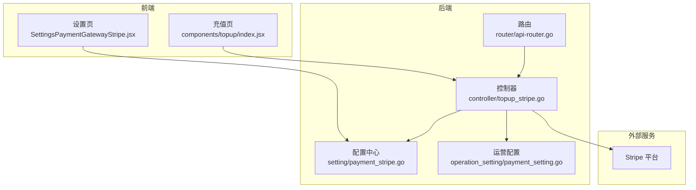
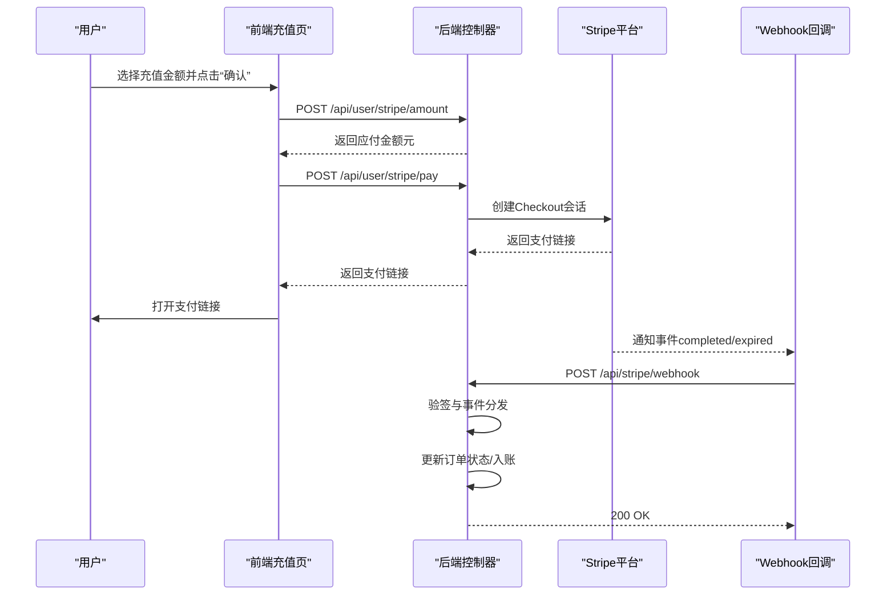
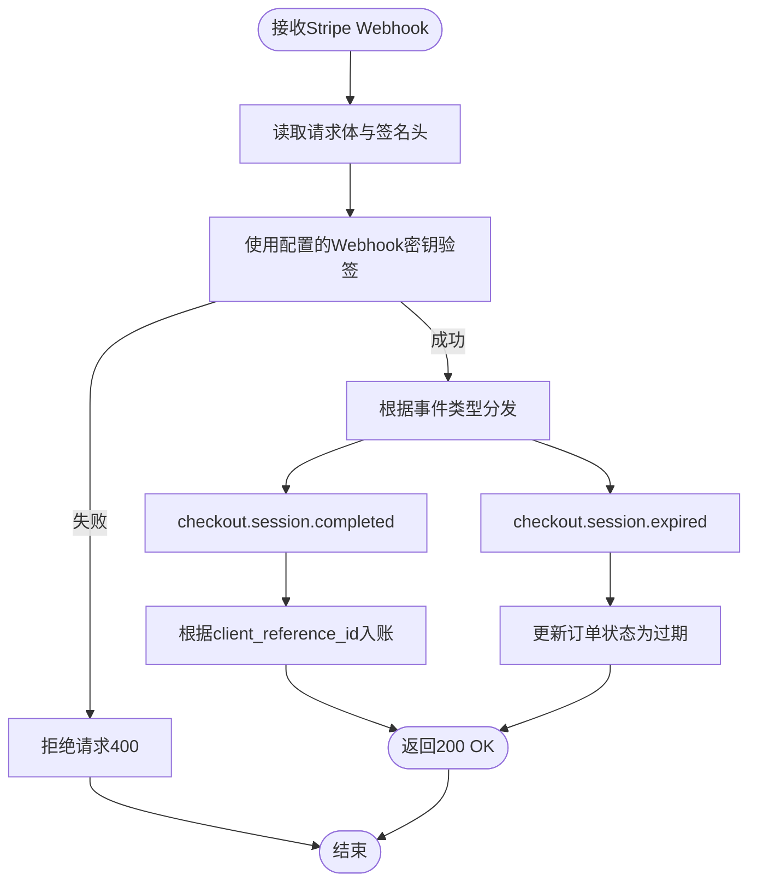
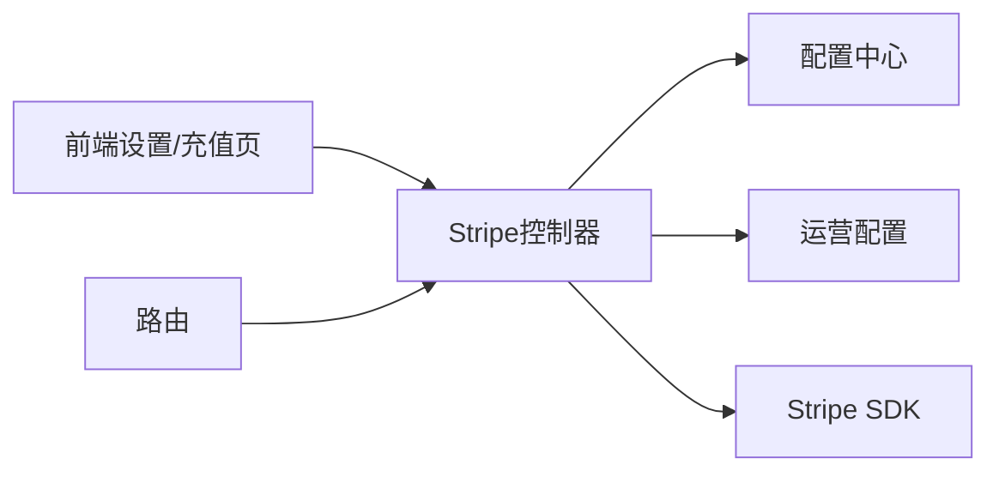

# Stripe支付配置

<cite>
**本文引用的文件**
- [controller/topup_stripe.go](file://controller/topup_stripe.go)
- [setting/payment_stripe.go](file://setting/payment_stripe.go)
- [router/api-router.go](file://router/api-router.go)
- [web/src/pages/Setting/Payment/SettingsPaymentGatewayStripe.jsx](file://web/src/pages/Setting/Payment/SettingsPaymentGatewayStripe.jsx)
- [web/src/components/topup/index.jsx](file://web/src/components/topup/index.jsx)
- [setting/operation_setting/payment_setting.go](file://setting/operation_setting/payment_setting.go)
- [service/webhook.go](file://service/webhook.go)
</cite>

## 目录
1. [简介](#简介)
2. [项目结构](#项目结构)
3. [核心组件](#核心组件)
4. [架构总览](#架构总览)
5. [详细组件分析](#详细组件分析)
6. [依赖关系分析](#依赖关系分析)
7. [性能与可靠性考量](#性能与可靠性考量)
8. [故障排查指南](#故障排查指南)
9. [结论](#结论)
10. [附录](#附录)

## 简介
本文件面向系统管理员与开发者，提供Stripe支付网关的完整配置与实现说明。内容覆盖：
- API密钥、Webhook密钥、价格ID等核心参数的设置入口与作用
- 前端支付表单集成与后端回调验证流程
- 支付状态同步策略与订单生命周期
- StripeUnitPrice、StripeMinTopUp等配置项的含义与取值建议
- Webhook事件处理的安全性建议（签名验证、重放攻击防护）
- 测试模式与生产模式的切换要点
- Stripe促销码功能的启用条件与使用场景

## 项目结构
Stripe支付相关能力分布在以下模块：
- 前端设置页：提供Stripe密钥、Webhook密钥、价格ID、单价、最低充值、促销码开关等配置入口
- 后端控制器：负责生成Stripe Checkout链接、处理Webhook回调、计算应付金额与最小充值
- 配置中心：持久化Stripe相关配置
- 路由：暴露Stripe Webhook回调接口
- 通用服务：提供Webhook发送与安全校验能力（用于其他Webhook场景，可借鉴其签名与SSRF防护思路）

图表来源
- [controller/topup_stripe.go](file://controller/topup_stripe.go#L1-L289)
- [setting/payment_stripe.go](file://setting/payment_stripe.go#L1-L9)
- [router/api-router.go](file://router/api-router.go#L44-L61)
- [web/src/pages/Setting/Payment/SettingsPaymentGatewayStripe.jsx](file://web/src/pages/Setting/Payment/SettingsPaymentGatewayStripe.jsx#L39-L258)
- [web/src/components/topup/index.jsx](file://web/src/components/topup/index.jsx#L144-L255)
- [setting/operation_setting/payment_setting.go](file://setting/operation_setting/payment_setting.go#L1-L24)

章节来源
- [controller/topup_stripe.go](file://controller/topup_stripe.go#L1-L289)
- [setting/payment_stripe.go](file://setting/payment_stripe.go#L1-L9)
- [router/api-router.go](file://router/api-router.go#L44-L61)
- [web/src/pages/Setting/Payment/SettingsPaymentGatewayStripe.jsx](file://web/src/pages/Setting/Payment/SettingsPaymentGatewayStripe.jsx#L39-L258)
- [web/src/components/topup/index.jsx](file://web/src/components/topup/index.jsx#L144-L255)
- [setting/operation_setting/payment_setting.go](file://setting/operation_setting/payment_setting.go#L1-L24)

## 核心组件
- Stripe配置变量：集中于配置中心，包含API密钥、Webhook密钥、价格ID、单价、最低充值、促销码开关
- Stripe控制器：负责金额计算、最小充值校验、生成Checkout链接、处理Webhook回调
- 前端设置页：提供配置表单，自动拼装Webhook地址与事件要求提示
- 前端充值页：调用后端接口获取应付金额与发起支付，打开Stripe Checkout页面
- 路由：注册Stripe Webhook回调路径

章节来源
- [setting/payment_stripe.go](file://setting/payment_stripe.go#L1-L9)
- [controller/topup_stripe.go](file://controller/topup_stripe.go#L1-L289)
- [web/src/pages/Setting/Payment/SettingsPaymentGatewayStripe.jsx](file://web/src/pages/Setting/Payment/SettingsPaymentGatewayStripe.jsx#L39-L258)
- [web/src/components/topup/index.jsx](file://web/src/components/topup/index.jsx#L144-L255)
- [router/api-router.go](file://router/api-router.go#L44-L61)

## 架构总览
下图展示从前端充值到Stripe支付再到回调处理的整体流程。

图表来源
- [web/src/components/topup/index.jsx](file://web/src/components/topup/index.jsx#L144-L255)
- [controller/topup_stripe.go](file://controller/topup_stripe.go#L108-L288)
- [router/api-router.go](file://router/api-router.go#L44-L61)

## 详细组件分析

### Stripe配置参数与设置入口
- API密钥（StripeApiSecret）
  - 作用：用于初始化Stripe SDK，发起Checkout会话与查询支付状态
  - 设置入口：前端设置页的“API密钥”字段；保存为系统选项
- Webhook签名密钥（StripeWebhookSecret）
  - 作用：用于验证Stripe回调的真实性，防止伪造请求
  - 设置入口：前端设置页的“Webhook签名密钥”字段；保存为系统选项
- 商品价格ID（StripePriceId）
  - 作用：指定Stripe产品中的价格条目，决定每单位充值的单价
  - 设置入口：前端设置页的“商品价格ID”字段；保存为系统选项
- 充值单价（StripeUnitPrice）
  - 作用：将Stripe美元计价转换为系统内货币（元）的汇率或单价
  - 设置入口：前端设置页的“充值价格（x元/美金）”字段；保存为系统选项
- 最低充值（StripeMinTopUp）
  - 作用：限制单次充值的最小美元数量；若显示单位为“额度”，则按配额单位换算
  - 设置入口：前端设置页的“最低充值美元数量”字段；保存为系统选项
- 促销码开关（StripePromotionCodesEnabled）
  - 作用：控制是否允许在Stripe Checkout中输入促销码
  - 设置入口：前端设置页的“允许在Stripe支付中输入促销码”开关；保存为系统选项

章节来源
- [web/src/pages/Setting/Payment/SettingsPaymentGatewayStripe.jsx](file://web/src/pages/Setting/Payment/SettingsPaymentGatewayStripe.jsx#L39-L258)
- [setting/payment_stripe.go](file://setting/payment_stripe.go#L1-L9)

### 前端支付表单集成
- 前端充值页通过两个后端接口与后端交互：
  - 获取应付金额：POST /api/user/stripe/amount
  - 发起支付：POST /api/user/stripe/pay
- 成功后返回Stripe Checkout链接，前端直接打开新窗口完成支付
- 前端设置页会提示Webhook地址与需要订阅的事件类型

章节来源
- [web/src/components/topup/index.jsx](file://web/src/components/topup/index.jsx#L144-L255)
- [web/src/pages/Setting/Payment/SettingsPaymentGatewayStripe.jsx](file://web/src/pages/Setting/Payment/SettingsPaymentGatewayStripe.jsx#L161-L258)

### 后端支付流程与回调验证
- 金额计算与最小充值校验
  - 控制器对用户输入进行最小充值校验
  - 若显示单位为“额度”，则按配额单位换算后再计算
  - 使用配置的单价与用户分组折扣系数计算应付金额
- 生成Stripe Checkout链接
  - 使用配置的API密钥与价格ID创建Checkout会话
  - 可选开启促销码支持
  - 自动设置成功/取消跳转地址
- Webhook回调处理
  - 读取请求体与签名头
  - 使用配置的Webhook密钥进行验签
  - 分发事件：completed（完成）、expired（过期）
  - 完成事件：根据client_reference_id入账
  - 过期事件：将对应订单标记为过期

图表来源
- [controller/topup_stripe.go](file://controller/topup_stripe.go#L128-L211)

章节来源
- [controller/topup_stripe.go](file://controller/topup_stripe.go#L108-L288)

### 配置项的作用与取值建议
- StripeUnitPrice（充值价格，元/美元）
  - 含义：每1美元对应的系统内货币金额
  - 建议：根据运营策略设定，如1美元=7元
- StripeMinTopUp（最低充值美元数量）
  - 含义：单次充值最少美元数量
  - 建议：结合Stripe最小支付限额与运营成本设定，如1或更高
- StripePromotionCodesEnabled（促销码开关）
  - 含义：是否允许在Stripe Checkout中输入促销码
  - 建议：促销活动期间开启，日常关闭以简化流程
- StripeApiSecret/StripeWebhookSecret/StripePriceId
  - 建议：仅在测试环境先行验证，再切换至生产密钥；价格ID需指向已创建的产品价格

章节来源
- [web/src/pages/Setting/Payment/SettingsPaymentGatewayStripe.jsx](file://web/src/pages/Setting/Payment/SettingsPaymentGatewayStripe.jsx#L198-L251)
- [controller/topup_stripe.go](file://controller/topup_stripe.go#L213-L249)
- [setting/operation_setting/payment_setting.go](file://setting/operation_setting/payment_setting.go#L1-L24)

### 支付状态同步策略
- 订单状态
  - 创建订单时设置为“待支付”
  - Webhook完成后入账并更新为“已完成”
  - Webhook过期事件将订单更新为“已过期”
- 冲突与幂等
  - 建议：以client_reference_id作为幂等键，重复事件应忽略或幂等处理
  - 建议：记录事件ID与处理结果，便于审计与重试

章节来源
- [controller/topup_stripe.go](file://controller/topup_stripe.go#L86-L105)
- [controller/topup_stripe.go](file://controller/topup_stripe.go#L160-L211)

### Webhook安全性建议
- 签名验证
  - 必须使用配置的Webhook密钥对Stripe-Signature头进行验签
  - 验签失败直接拒绝请求
- 重放攻击防护
  - 建议：记录已处理的事件ID，重复事件直接忽略
  - 建议：对事件时间戳进行检查，拒绝过早或过晚的事件
- SSRF与信任边界
  - 建议：仅接受来自Stripe的回调，不在内部网络开放任意URL的Webhook入口
  - 可参考项目中其他Webhook服务的签名与SSRF防护思路（用于借鉴）

章节来源
- [controller/topup_stripe.go](file://controller/topup_stripe.go#L128-L158)
- [service/webhook.go](file://service/webhook.go#L57-L126)

### 测试模式与生产模式切换
- 建议流程
  - 在Stripe测试环境创建产品与价格，配置测试密钥与Webhook密钥
  - 在前端设置页填入测试环境的ServerAddress与密钥
  - 通过Stripe测试支付流程验证无误后，再切换为生产密钥与价格ID
- 注意事项
  - 确保Webhook地址正确指向 /api/stripe/webhook
  - 确认已订阅 checkout.session.completed 与 checkout.session.expired 事件

章节来源
- [web/src/pages/Setting/Payment/SettingsPaymentGatewayStripe.jsx](file://web/src/pages/Setting/Payment/SettingsPaymentGatewayStripe.jsx#L169-L196)
- [router/api-router.go](file://router/api-router.go#L44-L61)

### Stripe促销码功能
- 启用条件
  - 在前端设置页开启“允许在Stripe支付中输入促销码”
  - 后端在创建Checkout会话时传入AllowPromotionCodes标志
- 使用场景
  - 限时折扣、节日活动、VIP专属优惠等营销活动
- 注意事项
  - 促销码由Stripe侧生效，系统侧无需额外处理

章节来源
- [web/src/pages/Setting/Payment/SettingsPaymentGatewayStripe.jsx](file://web/src/pages/Setting/Payment/SettingsPaymentGatewayStripe.jsx#L244-L251)
- [controller/topup_stripe.go](file://controller/topup_stripe.go#L231-L233)

## 依赖关系分析
- 组件耦合
  - 控制器依赖配置中心（读取密钥、价格ID、单价、最低充值、促销码开关）
  - 控制器依赖运营配置（折扣与预设金额选项）
  - 控制器依赖Stripe SDK创建Checkout会话
  - 路由依赖控制器处理Webhook
- 外部依赖
  - Stripe平台：支付会话、回调事件
  - 前端：充值页与设置页

图表来源
- [controller/topup_stripe.go](file://controller/topup_stripe.go#L1-L289)
- [setting/payment_stripe.go](file://setting/payment_stripe.go#L1-L9)
- [router/api-router.go](file://router/api-router.go#L44-L61)

章节来源
- [controller/topup_stripe.go](file://controller/topup_stripe.go#L1-L289)
- [setting/payment_stripe.go](file://setting/payment_stripe.go#L1-L9)
- [router/api-router.go](file://router/api-router.go#L44-L61)

## 性能与可靠性考量
- 金额计算与最小充值校验在后端完成，避免前端作弊
- Webhook验签失败立即拒绝，降低无效请求对系统的压力
- 建议：对Stripe回调增加限流与重试策略，确保高并发下的稳定性

[本节为通用建议，不直接分析具体文件]

## 故障排查指南
- Webhook验签失败
  - 检查Webhook签名密钥是否正确配置
  - 确认Stripe端的Webhook密钥与系统配置一致
- 支付链接无法生成
  - 检查API密钥格式与权限
  - 检查价格ID是否存在且有效
- 回调未触发或状态未更新
  - 检查Stripe端是否订阅了checkout.session.completed与checkout.session.expired
  - 检查回调地址是否可达且未被防火墙拦截
- 最低充值校验失败
  - 检查StripeMinTopUp配置与显示单位（额度/美元）换算关系

章节来源
- [controller/topup_stripe.go](file://controller/topup_stripe.go#L128-L211)
- [web/src/pages/Setting/Payment/SettingsPaymentGatewayStripe.jsx](file://web/src/pages/Setting/Payment/SettingsPaymentGatewayStripe.jsx#L169-L196)

## 结论
本项目提供了完整的Stripe支付网关配置与实现方案：从前端设置、后端金额计算与Checkout会话创建，到Webhook回调验签与状态同步，形成闭环。通过合理的配置项与安全措施，可在测试与生产环境之间平滑切换，并灵活支持促销码等营销功能。

[本节为总结，不直接分析具体文件]

## 附录
- 关键接口与路径
  - GET /api/user/stripe/amount：获取应付金额
  - POST /api/user/stripe/pay：发起支付并返回支付链接
  - POST /api/stripe/webhook：Stripe回调入口
- 配置项一览
  - StripeApiSecret、StripeWebhookSecret、StripePriceId、StripeUnitPrice、StripeMinTopUp、StripePromotionCodesEnabled

章节来源
- [web/src/components/topup/index.jsx](file://web/src/components/topup/index.jsx#L144-L255)
- [controller/topup_stripe.go](file://controller/topup_stripe.go#L108-L288)
- [router/api-router.go](file://router/api-router.go#L44-L61)