# 支付配置

<cite>
**本文档引用的文件**
- [topup_stripe.go](file://controller/topup_stripe.go)
- [topup_creem.go](file://controller/topup_creem.go)
- [payment_stripe.go](file://setting/payment_stripe.go)
- [payment_creem.go](file://setting/payment_creem.go)
- [payment_setting.go](file://setting/operation_setting/payment_setting.go)
- [topup-ratio.go](file://common/topup-ratio.go)
- [topup.go](file://model/topup.go)
</cite>

## 目录
1. [简介](#简介)
2. [支付网关配置流程](#支付网关配置流程)
3. [支付密钥设置](#支付密钥设置)
4. [回调URL配置](#回调url配置)
5. [支付状态验证机制](#支付状态验证机制)
6. [支付参数配置](#支付参数配置)
7. [支付请求处理流程](#支付请求处理流程)
8. [安全性保障措施](#安全性保障措施)
9. [测试模式与生产环境配置](#测试模式与生产环境配置)
10. [异常处理与对账](#异常处理与对账)

## 简介

本指南详细说明了在系统中配置Stripe和Creem支付网关的完整流程。文档涵盖了从支付密钥设置、回调URL配置到支付状态验证的各个方面，同时解释了充值比例、货币单位、手续费等支付相关参数的配置方式。通过结合代码实现，描述了支付请求的处理流程和安全性保障措施，并提供了支付测试模式的配置方法和生产环境部署建议。

**Section sources**
- [topup_stripe.go](file://controller/topup_stripe.go#L1-L289)
- [topup_creem.go](file://controller/topup_creem.go#L1-L462)

## 支付网关配置流程

配置支付网关需要完成以下步骤：

1. 在系统设置中启用相应的支付方式
2. 配置支付网关的API密钥和密钥
3. 设置回调URL和Webhook密钥
4. 配置支付参数，包括充值比例、货币单位等
5. 测试支付流程并验证配置

系统支持通过管理界面进行支付网关的配置，管理员可以在"支付设置"页面中完成所有配置。

**Section sources**
- [topup_stripe.go](file://controller/topup_stripe.go#L1-L289)
- [topup_creem.go](file://controller/topup_creem.go#L1-L462)

## 支付密钥设置

### Stripe支付密钥

Stripe支付需要配置以下密钥：

- `StripeApiSecret`: Stripe API密钥，用于创建支付会话
- `StripeWebhookSecret`: Webhook签名密钥，用于验证回调请求
- `StripePriceId`: 价格ID，用于标识支付项目

这些密钥需要在系统设置中配置，系统会使用这些密钥与Stripe API进行通信。

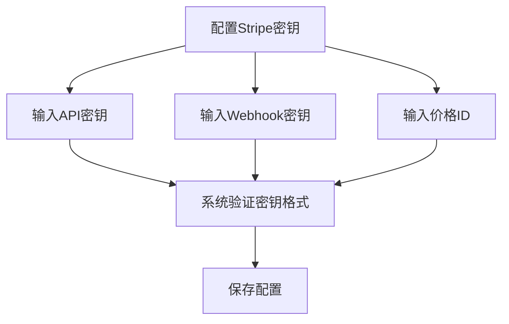

**Diagram sources**
- [payment_stripe.go](file://setting/payment_stripe.go#L3-L8)

### Creem支付密钥

Creem支付需要配置以下密钥：

- `CreemApiKey`: Creem API密钥，用于创建支付链接
- `CreemWebhookSecret`: Webhook签名密钥，用于验证回调请求

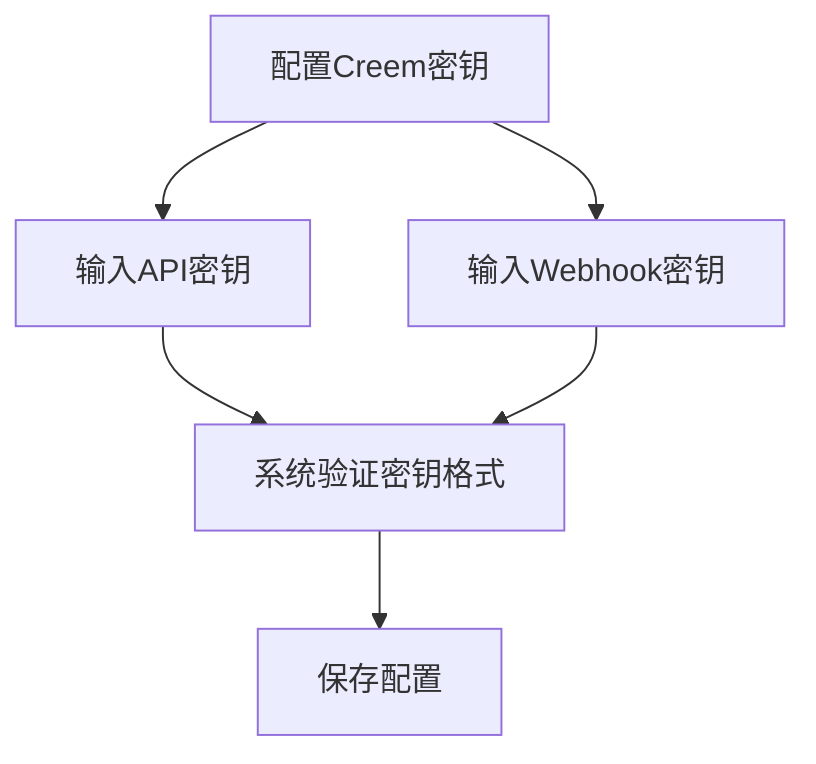

**Diagram sources**
- [payment_creem.go](file://setting/payment_creem.go#L3-L6)

## 回调URL配置

### Stripe回调配置

Stripe使用Webhook机制来通知支付结果。系统需要配置以下内容：

- Webhook端点URL：`/api/stripe/webhook`
- Webhook签名密钥：用于验证回调请求的合法性
- 事件类型：监听`checkout.session.completed`和`checkout.session.expired`事件

当用户完成支付或支付会话过期时，Stripe会向配置的Webhook端点发送POST请求。

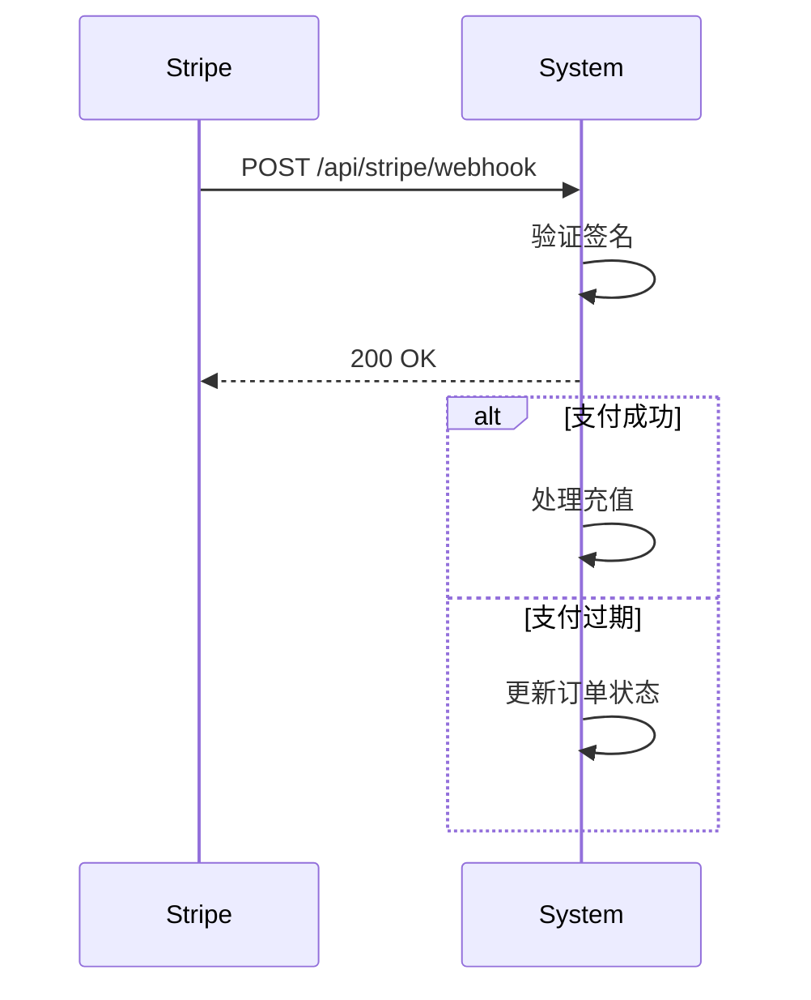

**Diagram sources**
- [topup_stripe.go](file://controller/topup_stripe.go#L128-L211)

### Creem回调配置

Creem同样使用Webhook机制来通知支付结果。系统需要配置以下内容：

- Webhook端点URL：`/api/creem/webhook`
- Webhook签名密钥：用于验证回调请求的合法性
- 事件类型：监听`checkout.completed`事件

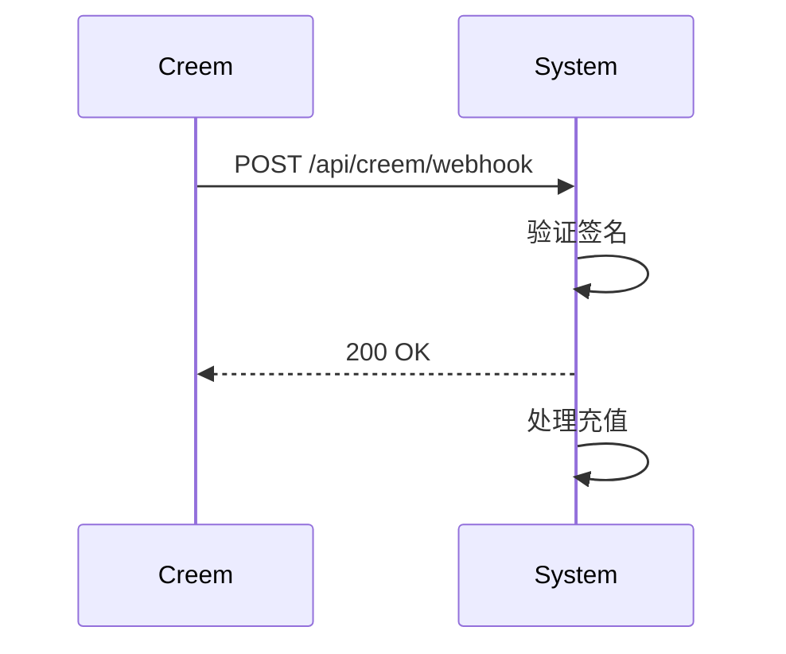

**Diagram sources**
- [topup_creem.go](file://controller/topup_creem.go#L240-L362)

## 支付状态验证机制

### Stripe支付验证

Stripe支付验证流程如下：

1. 接收Webhook请求
2. 验证请求签名
3. 解析事件类型
4. 根据事件类型处理支付结果

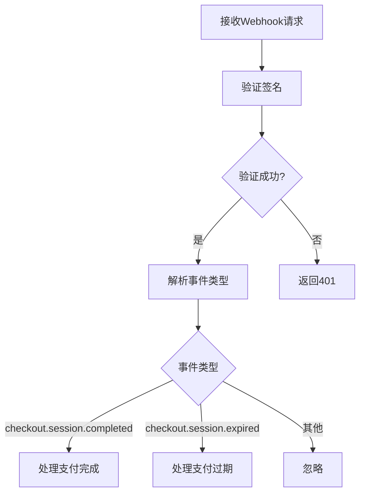

**Diagram sources**
- [topup_stripe.go](file://controller/topup_stripe.go#L136-L158)

### Creem支付验证

Creem支付验证流程如下：

1. 接收Webhook请求
2. 验证请求签名
3. 解析事件类型
4. 处理支付完成事件

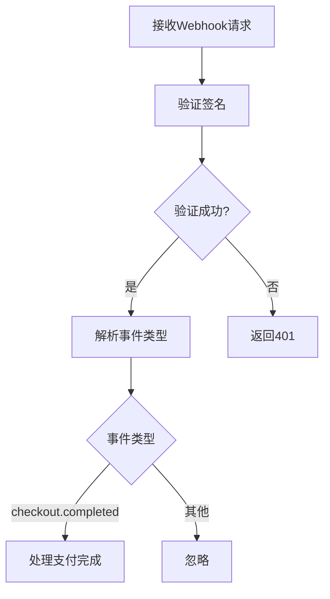

**Diagram sources**
- [topup_creem.go](file://controller/topup_creem.go#L263-L291)

## 支付参数配置

### 充值比例配置

系统支持根据不同用户组设置不同的充值比例。充值比例通过`TopupGroupRatio`映射配置：

```go
var TopupGroupRatio = map[string]float64{
    "default": 1,
    "vip":     1,
    "svip":    1,
}
```

管理员可以通过API更新充值比例配置。

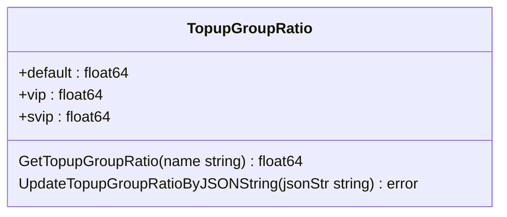

**Diagram sources**
- [topup-ratio.go](file://common/topup-ratio.go#L7-L34)

### 货币单位与手续费

#### Stripe支付参数

- `StripeUnitPrice`: 单位价格，表示每美元的支付金额
- `StripeMinTopUp`: 最低充值美元数量
- `StripePromotionCodesEnabled`: 是否允许使用促销码

#### Creem支付参数

- `CreemProducts`: 产品列表，包含产品ID、价格、货币和额度
- `CreemTestMode`: 是否启用测试模式

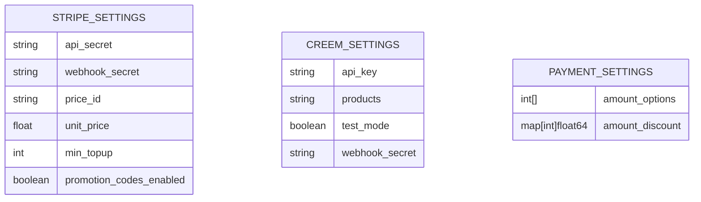

**Diagram sources**
- [payment_stripe.go](file://setting/payment_stripe.go#L3-L8)
- [payment_creem.go](file://setting/payment_creem.go#L3-L7)
- [payment_setting.go](file://setting/operation_setting/payment_setting.go#L5-L8)

## 支付请求处理流程

### Stripe支付流程

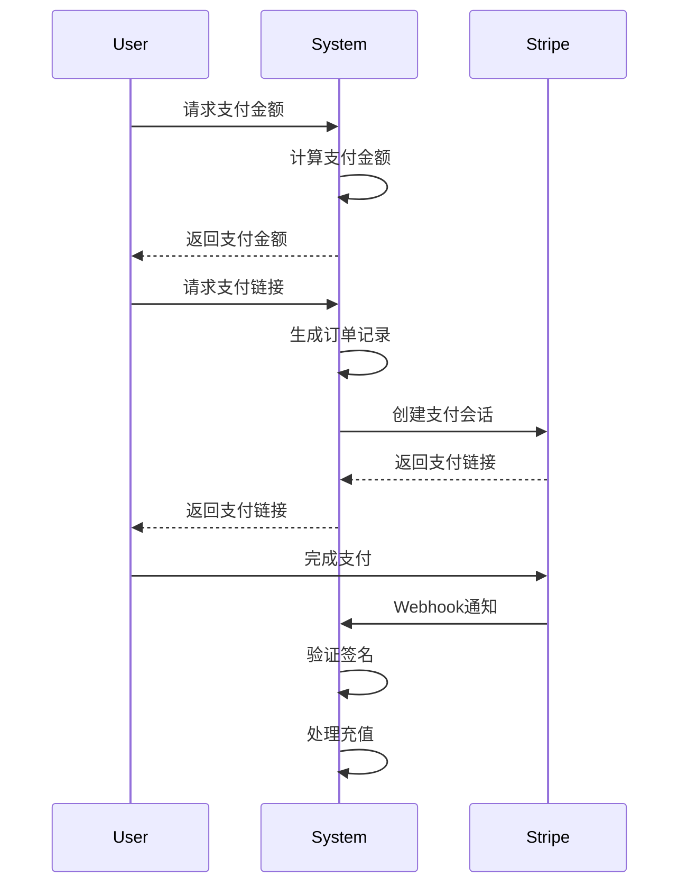

**Diagram sources**
- [topup_stripe.go](file://controller/topup_stripe.go#L39-L105)

### Creem支付流程

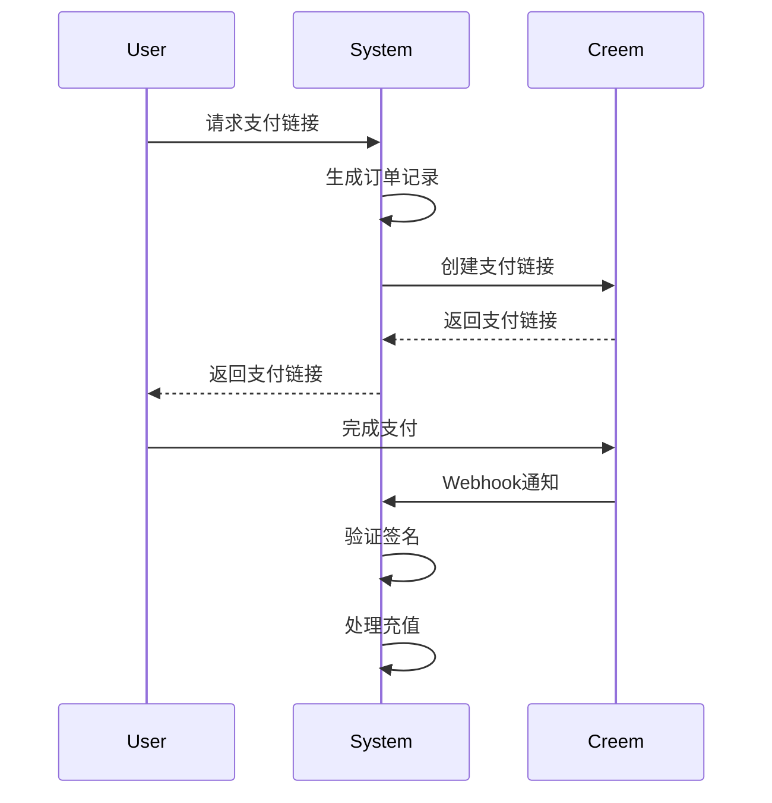

**Diagram sources**
- [topup_creem.go](file://controller/topup_creem.go#L67-L142)

## 安全性保障措施

### 签名验证

系统通过HMAC-SHA256算法验证Webhook请求的签名，确保请求来自可信的支付网关。

```go
func verifyCreemSignature(payload string, signature string, secret string) bool {
    expectedSignature := generateCreemSignature(payload, secret)
    return hmac.Equal([]byte(signature), []byte(expectedSignature))
}
```

### 订单状态管理

系统使用事务处理来确保订单状态的一致性，防止重复充值。

```go
err = DB.Transaction(func(tx *gorm.DB) error {
    // 查询订单并加锁
    err := tx.Set("gorm:query_option", "FOR UPDATE").Where(refCol+" = ?", referenceId).First(topUp).Error
    if err != nil {
        return errors.New("充值订单不存在")
    }
    
    // 检查订单状态
    if topUp.Status != common.TopUpStatusPending {
        return errors.New("充值订单状态错误")
    }
    
    // 更新订单状态
    topUp.CompleteTime = common.GetTimestamp()
    topUp.Status = common.TopUpStatusSuccess
    err = tx.Save(topUp).Error
    if err != nil {
        return err
    }
    
    // 增加用户额度
    err = tx.Model(&User{}).Where("id = ?", topUp.UserId).Updates(map[string]interface{}{"quota": gorm.Expr("quota + ?", quota)}).Error
    if err != nil {
        return err
    }
    
    return nil
})
```

**Section sources**
- [topup.go](file://model/topup.go#L58-L104)
- [topup_creem.go](file://controller/topup_creem.go#L37-L49)

## 测试模式与生产环境配置

### 测试模式配置

系统支持测试模式，可以在测试环境中模拟支付流程。

- Stripe测试模式：使用测试API密钥和测试端点
- Creem测试模式：通过`CreemTestMode`开关启用，使用测试API端点

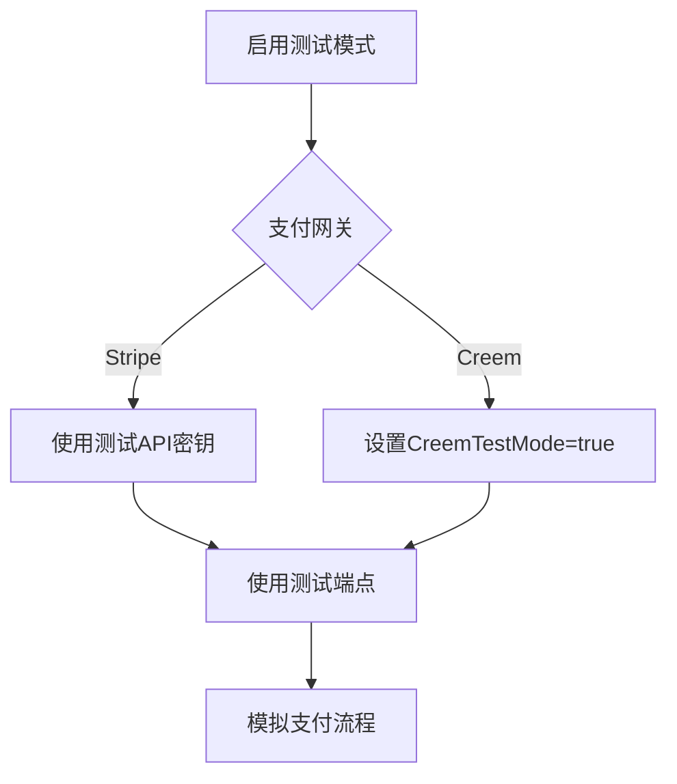

**Section sources**
- [topup_creem.go](file://controller/topup_creem.go#L384-L387)

### 生产环境部署建议

1. **密钥管理**：将支付密钥存储在环境变量或安全的密钥管理系统中
2. **监控告警**：监控Webhook处理失败的情况，及时发现支付问题
3. **日志记录**：详细记录支付流程中的关键步骤，便于排查问题
4. **定期对账**：定期与支付网关对账，确保交易数据一致

## 异常处理与对账

### 支付失败处理

系统定义了以下订单状态：

- `pending`: 待支付
- `success`: 支付成功
- `expired`: 支付过期

当支付失败或超时时，系统会将订单状态更新为`expired`。

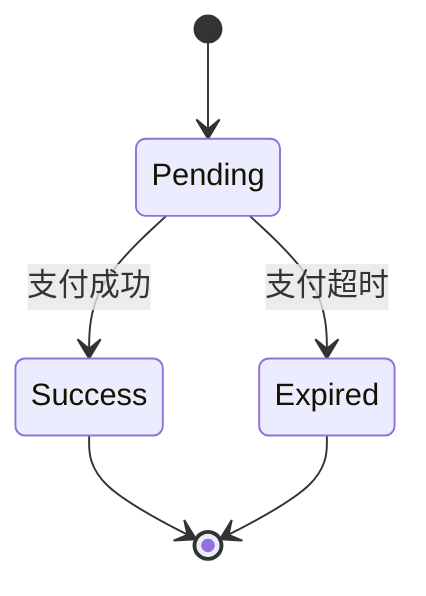

**Diagram sources**
- [topup.go](file://model/topup.go#L204-L207)

### 退款处理

系统目前不直接处理退款，退款需要在支付网关后台操作。系统会通过Webhook接收退款通知并更新用户额度。

### 对账机制

系统提供了以下对账功能：

1. **订单查询**：管理员可以查询所有充值记录
2. **手动补单**：支持手动完成订单并给用户充值
3. **日志记录**：详细记录每次充值的操作日志

```go
func ManualCompleteTopUp(tradeNo string) error {
    // 事务处理，确保数据一致性
    err := DB.Transaction(func(tx *gorm.DB) error {
        // 查询订单并加锁
        topUp := &TopUp{}
        if err := tx.Set("gorm:query_option", "FOR UPDATE").Where(refCol+" = ?", tradeNo).First(topUp).Error; err != nil {
            return errors.New("充值订单不存在")
        }
        
        // 检查订单状态
        if topUp.Status != common.TopUpStatusPending {
            return errors.New("订单状态不是待支付，无法补单")
        }
        
        // 更新订单状态
        topUp.CompleteTime = common.GetTimestamp()
        topUp.Status = common.TopUpStatusSuccess
        if err := tx.Save(topUp).Error; err != nil {
            return err
        }
        
        // 增加用户额度
        if err := tx.Model(&User{}).Where("id = ?", topUp.UserId).Update("quota", gorm.Expr("quota + ?", quotaToAdd)).Error; err != nil {
            return err
        }
        
        return nil
    })
    
    return err
}
```

**Section sources**
- [topup.go](file://model/topup.go#L238-L307)