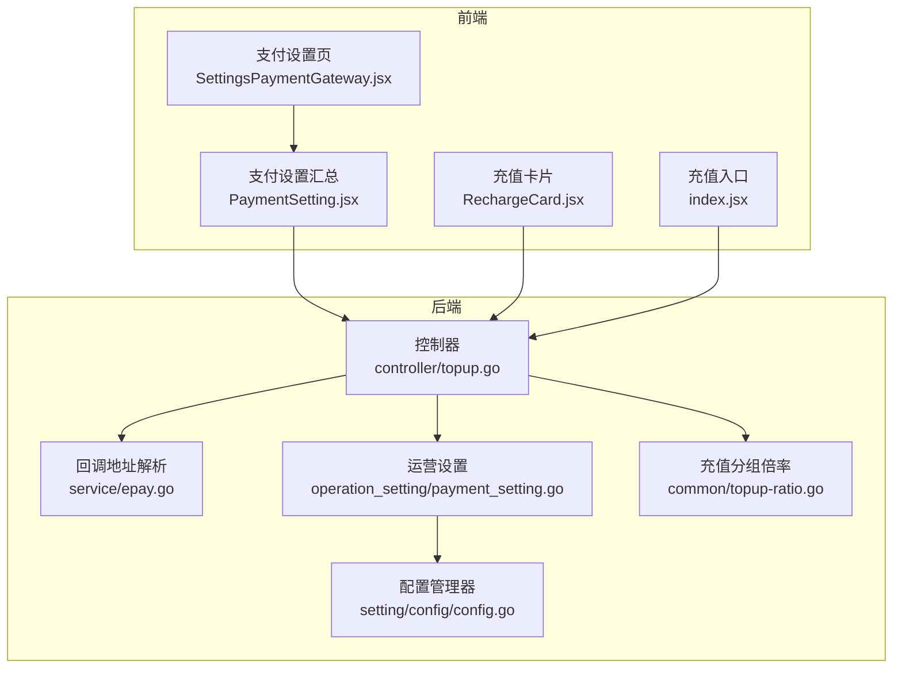
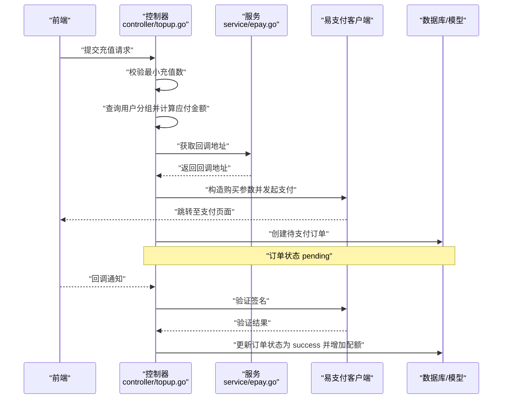
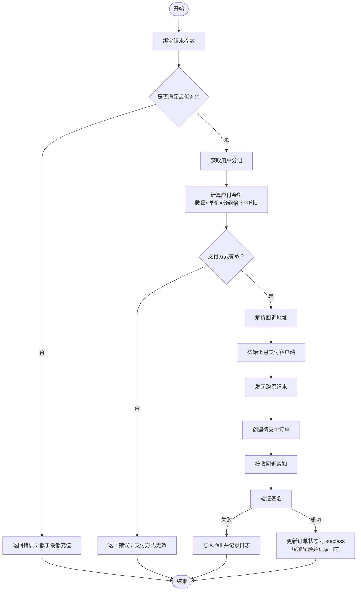
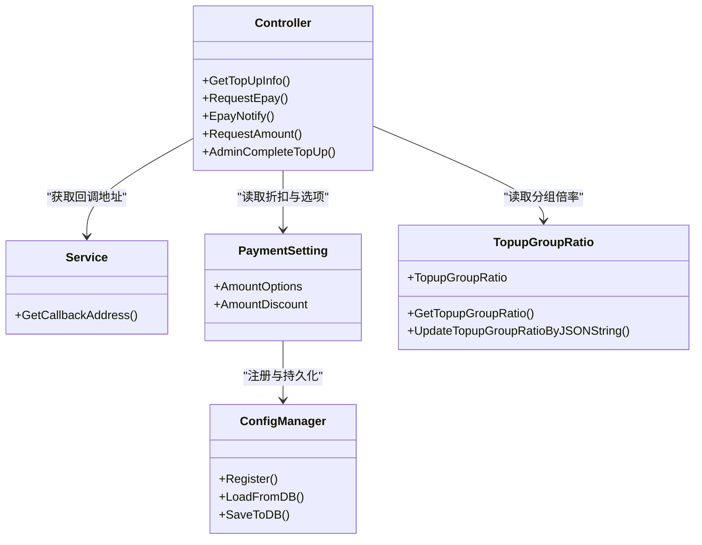

# 通用支付设置

<cite>
**本文引用的文件**
- [service/epay.go](file://service/epay.go)
- [controller/topup.go](file://controller/topup.go)
- [setting/operation_setting/payment_setting.go](file://setting/operation_setting/payment_setting.go)
- [common/topup-ratio.go](file://common/topup-ratio.go)
- [setting/config/config.go](file://setting/config/config.go)
- [web/src/pages/Setting/Payment/SettingsPaymentGateway.jsx](file://web/src/pages/Setting/Payment/SettingsPaymentGateway.jsx)
- [web/src/components/settings/PaymentSetting.jsx](file://web/src/components/settings/PaymentSetting.jsx)
- [web/src/components/topup/RechargeCard.jsx](file://web/src/components/topup/RechargeCard.jsx)
- [web/src/components/topup/index.jsx](file://web/src/components/topup/index.jsx)
- [setting/operation_setting/payment_setting_old.go](file://setting/operation_setting/payment_setting_old.go)
</cite>

## 目录
1. [简介](#简介)
2. [项目结构与入口](#项目结构与入口)
3. [核心组件与职责](#核心组件与职责)
4. [架构总览](#架构总览)
5. [详细配置说明](#详细配置说明)
6. [支付请求处理流程](#支付请求处理流程)
7. [依赖关系分析](#依赖关系分析)
8. [性能与安全考量](#性能与安全考量)
9. [故障排查指南](#故障排查指南)
10. [结论](#结论)

## 简介
本文件面向系统管理员与开发者，提供通用支付配置的完整说明，覆盖服务器地址、支付网关地址、易支付(Epay)ID/密钥等基础参数，以及 Price、MinTopUp、TopupGroupRatio 等核心业务参数的含义与配置策略；解释 CustomCallbackAddress 自定义回调地址的使用场景与安全要求；描述 PayMethods 与 AmountOptions 的配置格式，以及 AmountDiscount 的 JSON 结构定义；最后结合 service/epay.go 的实现，阐明支付请求的通用处理流程与错误处理机制。

## 项目结构与入口
- 后端通过控制器暴露充值能力与回调处理，核心逻辑集中在 controller/topup.go。
- 回调地址解析逻辑位于 service/epay.go，用于决定通知地址来源。
- 支付设置通过 operation_setting 的 PaymentSetting 结构体集中管理，并由 setting/config/config.go 提供统一的配置注册与持久化能力。
- 前端充值页面与支付设置页负责参数收集与提交，路径参考 web/src/components/topup 与 web/src/pages/Setting/Payment。

图表来源
- [controller/topup.go](file://controller/topup.go#L1-L120)
- [service/epay.go](file://service/epay.go#L1-L14)
- [setting/operation_setting/payment_setting.go](file://setting/operation_setting/payment_setting.go#L1-L24)
- [common/topup-ratio.go](file://common/topup-ratio.go#L1-L34)
- [setting/config/config.go](file://setting/config/config.go#L1-L90)
- [web/src/pages/Setting/Payment/SettingsPaymentGateway.jsx](file://web/src/pages/Setting/Payment/SettingsPaymentGateway.jsx#L32-L182)
- [web/src/components/settings/PaymentSetting.jsx](file://web/src/components/settings/PaymentSetting.jsx#L1-L154)
- [web/src/components/topup/RechargeCard.jsx](file://web/src/components/topup/RechargeCard.jsx#L224-L396)
- [web/src/components/topup/index.jsx](file://web/src/components/topup/index.jsx#L357-L390)

章节来源
- [controller/topup.go](file://controller/topup.go#L1-L120)
- [service/epay.go](file://service/epay.go#L1-L14)
- [setting/operation_setting/payment_setting.go](file://setting/operation_setting/payment_setting.go#L1-L24)
- [common/topup-ratio.go](file://common/topup-ratio.go#L1-L34)
- [setting/config/config.go](file://setting/config/config.go#L1-L90)
- [web/src/pages/Setting/Payment/SettingsPaymentGateway.jsx](file://web/src/pages/Setting/Payment/SettingsPaymentGateway.jsx#L32-L182)
- [web/src/components/settings/PaymentSetting.jsx](file://web/src/components/settings/PaymentSetting.jsx#L1-L154)
- [web/src/components/topup/RechargeCard.jsx](file://web/src/components/topup/RechargeCard.jsx#L224-L396)
- [web/src/components/topup/index.jsx](file://web/src/components/topup/index.jsx#L357-L390)

## 核心组件与职责
- 控制器层
  - 提供充值信息查询、发起易支付请求、计算应付金额、最小充值数校验、回调通知处理、订单补单等能力。
- 服务层
  - 回调地址解析：优先使用自定义回调地址，否则回退到系统服务器地址。
- 配置层
  - PaymentSetting：集中管理 AmountOptions 与 AmountDiscount。
  - ConfigManager：统一注册、导出、导入配置，支持复杂类型（数组、对象）的序列化/反序列化。
  - TopupGroupRatio：按用户分组的充值倍率映射，支持 JSON 编辑与动态更新。
- 前端层
  - 支付设置页：收集并校验服务器地址、支付地址、易支付ID/密钥、价格、最低充值、回调地址、支付方式、充值数量选项、折扣配置等。
  - 充值卡片与入口：根据后端返回的启用状态与最小充值数，渲染充值界面与预设金额。

章节来源
- [controller/topup.go](file://controller/topup.go#L1-L203)
- [service/epay.go](file://service/epay.go#L1-L14)
- [setting/operation_setting/payment_setting.go](file://setting/operation_setting/payment_setting.go#L1-L24)
- [setting/config/config.go](file://setting/config/config.go#L1-L90)
- [common/topup-ratio.go](file://common/topup-ratio.go#L1-L34)
- [web/src/pages/Setting/Payment/SettingsPaymentGateway.jsx](file://web/src/pages/Setting/Payment/SettingsPaymentGateway.jsx#L32-L182)
- [web/src/components/topup/RechargeCard.jsx](file://web/src/components/topup/RechargeCard.jsx#L224-L396)
- [web/src/components/topup/index.jsx](file://web/src/components/topup/index.jsx#L357-L390)

## 架构总览
下图展示了从前端到后端的关键交互与数据流，包括支付请求发起、回调地址解析、金额计算、订单创建与状态变更。

图表来源
- [controller/topup.go](file://controller/topup.go#L130-L203)
- [service/epay.go](file://service/epay.go#L1-L14)

章节来源
- [controller/topup.go](file://controller/topup.go#L130-L203)
- [service/epay.go](file://service/epay.go#L1-L14)

## 详细配置说明

### 基础参数
- 服务器地址（ServerAddress）
  - 作用：作为默认回调地址与前端跳转链接的基础。
  - 前端设置位置：通用支付设置页。
- 支付地址（PayAddress）
  - 作用：易支付网关地址，用于构建支付请求。
  - 前端设置位置：支付网关设置页。
- 易支付ID（EpayId）与密钥（EpayKey）
  - 作用：用于初始化易支付客户端，发起支付与回调签名验证。
  - 前端设置位置：支付网关设置页。
- 自定义回调地址（CustomCallbackAddress）
  - 作用：优先于服务器地址作为回调地址；若为空则回退到 ServerAddress。
  - 安全要求：必须为可信域名，建议使用 HTTPS，避免泄露密钥；回调端点应具备严格的签名验证与幂等处理。

章节来源
- [web/src/pages/Setting/Payment/SettingsGeneralPayment.jsx](file://web/src/pages/Setting/Payment/SettingsGeneralPayment.jsx#L1-L36)
- [web/src/pages/Setting/Payment/SettingsPaymentGateway.jsx](file://web/src/pages/Setting/Payment/SettingsPaymentGateway.jsx#L32-L182)
- [service/epay.go](file://service/epay.go#L1-L14)

### 核心业务参数
- 单价（Price）
  - 含义：每单位货币对应的价格系数，用于将充值数量换算为应付金额。
  - 计算：应付金额 = 充值数量 × Price × 分组倍率 × 折扣。
- 最低充值额（MinTopUp）
  - 含义：充值数量的下限；当展示类型为“按令牌”时，会按配额换算为等价美元再比较。
  - 前端与后端均进行校验，确保不小于该阈值。
- 充值组别比例（TopupGroupRatio）
  - 含义：按用户分组设置的充值倍率，支持 JSON 格式编辑。
  - 默认值：包含 default、vip、svip 等键，值为浮点数倍率。
  - 更新：通过配置页提交 TopupGroupRatio，后端将其写入配置并生效。

章节来源
- [controller/topup.go](file://controller/topup.go#L90-L128)
- [common/topup-ratio.go](file://common/topup-ratio.go#L1-L34)
- [web/src/pages/Setting/Payment/SettingsPaymentGateway.jsx](file://web/src/pages/Setting/Payment/SettingsPaymentGateway.jsx#L276-L287)

### 支付方式与金额选项
- 支付方式（PayMethods）
  - 含义：可用的支付渠道列表，包含名称、颜色、类型等字段；可通过 JSON 编辑。
  - 用途：前端展示支付按钮与颜色；后端校验请求中的支付方式是否存在。
- 金额选项（AmountOptions）
  - 含义：用户可选的充值数量列表（JSON 数组），用于前端预设金额。
  - 用途：前端渲染预设金额卡片与输入框。
- 金额折扣（AmountDiscount）
  - 含义：按充值金额设置的折扣率（JSON 对象），键为金额，值为折扣系数。
  - 用途：在计算应付金额时叠加折扣，支持整数金额与小数折扣率。

章节来源
- [controller/topup.go](file://controller/topup.go#L1-L63)
- [setting/operation_setting/payment_setting.go](file://setting/operation_setting/payment_setting.go#L1-L24)
- [web/src/pages/Setting/Payment/SettingsPaymentGateway.jsx](file://web/src/pages/Setting/Payment/SettingsPaymentGateway.jsx#L288-L332)
- [web/src/components/settings/PaymentSetting.jsx](file://web/src/components/settings/PaymentSetting.jsx#L54-L110)
- [web/src/components/topup/RechargeCard.jsx](file://web/src/components/topup/RechargeCard.jsx#L362-L396)

### 配置持久化与加载
- 配置注册
  - PaymentSetting 通过全局配置管理器注册，键为 payment_setting。
- 序列化/反序列化
  - ConfigManager 支持结构体字段的 JSON 序列化与反序列化，自动处理数组、对象等复杂类型。
- 前端解析
  - 前端在获取配置时，对 TopupGroupRatio、AmountOptions、AmountDiscount 进行 JSON 解析与美化展示。

章节来源
- [setting/operation_setting/payment_setting.go](file://setting/operation_setting/payment_setting.go#L1-L24)
- [setting/config/config.go](file://setting/config/config.go#L1-L90)
- [web/src/components/settings/PaymentSetting.jsx](file://web/src/components/settings/PaymentSetting.jsx#L54-L110)

## 支付请求处理流程

### 通用处理流程
- 参数校验
  - 校验请求体字段与最小充值阈值。
- 用户与分组
  - 获取用户分组，用于计算分组倍率。
- 金额计算
  - 若展示类型为“按令牌”，先将令牌数换算为美元；再乘以 Price、分组倍率与折扣。
- 支付方式校验
  - 确认请求的支付方式存在于 PayMethods 列表。
- 回调地址
  - 优先使用 CustomCallbackAddress，否则回退到 ServerAddress。
- 发起支付
  - 初始化易支付客户端，构造购买参数（类型、订单号、名称、金额、回调地址等），返回支付 URL 与参数。
- 订单创建
  - 写入待支付订单，状态为 pending。
- 回调处理
  - 验证签名，成功则更新订单状态为 success，增加用户配额并记录日志。

图表来源
- [controller/topup.go](file://controller/topup.go#L130-L203)
- [controller/topup.go](file://controller/topup.go#L232-L293)
- [service/epay.go](file://service/epay.go#L1-L14)

章节来源
- [controller/topup.go](file://controller/topup.go#L130-L203)
- [controller/topup.go](file://controller/topup.go#L232-L293)
- [service/epay.go](file://service/epay.go#L1-L14)

### 错误处理机制
- 参数错误：直接返回错误响应。
- 最低充值不足：提示具体阈值。
- 用户分组获取失败：返回错误。
- 支付方式不存在：返回错误。
- 客户端未配置：返回错误。
- 拉起支付失败：返回错误。
- 回调签名验证失败：写入 fail 并记录日志。
- 订单不存在或状态异常：记录日志并忽略。
- 并发控制：使用订单级互斥锁，防止重复入账与并发补单。

章节来源
- [controller/topup.go](file://controller/topup.go#L130-L203)
- [controller/topup.go](file://controller/topup.go#L232-L293)

## 依赖关系分析

图表来源
- [controller/topup.go](file://controller/topup.go#L1-L120)
- [service/epay.go](file://service/epay.go#L1-L14)
- [setting/operation_setting/payment_setting.go](file://setting/operation_setting/payment_setting.go#L1-L24)
- [setting/config/config.go](file://setting/config/config.go#L1-L90)
- [common/topup-ratio.go](file://common/topup-ratio.go#L1-L34)

章节来源
- [controller/topup.go](file://controller/topup.go#L1-L120)
- [service/epay.go](file://service/epay.go#L1-L14)
- [setting/operation_setting/payment_setting.go](file://setting/operation_setting/payment_setting.go#L1-L24)
- [setting/config/config.go](file://setting/config/config.go#L1-L90)
- [common/topup-ratio.go](file://common/topup-ratio.go#L1-L34)

## 性能与安全考量
- 性能
  - 金额计算采用高精度十进制运算，避免浮点误差。
  - 订单级互斥锁降低并发风险，但需注意锁粒度与持有时间。
- 安全
  - 回调地址优先使用自定义地址，确保可控性；建议强制 HTTPS。
  - 易支付密钥在前端不展示，仅在后端使用，避免泄露。
  - 回调端点必须严格验证签名与参数完整性，拒绝伪造请求。
  - 最小充值与支付方式白名单双重校验，防止异常输入。

[本节为通用指导，无需列出章节来源]

## 故障排查指南
- 无法发起支付
  - 检查 PayAddress、EpayId、EpayKey 是否完整配置。
  - 确认服务器地址与回调地址可访问且为 HTTPS。
- 充值金额过低
  - 检查 Price、MinTopUp、分组倍率与折扣是否导致最终金额过低。
- 支付方式无效
  - 确认 PayMethods 中包含请求的支付方式类型。
- 回调失败
  - 查看回调签名验证日志，确认密钥一致与参数正确。
  - 检查订单状态是否已更新，避免重复入账。
- 并发补单
  - 使用管理员补单接口时，确保同一订单号串行处理，避免重复加配额。

章节来源
- [controller/topup.go](file://controller/topup.go#L130-L203)
- [controller/topup.go](file://controller/topup.go#L232-L293)

## 结论
通过统一的配置管理与清晰的支付处理流程，系统实现了灵活的充值参数配置与稳定的支付回调处理。管理员只需在支付设置页完成基础参数与业务参数的配置，即可快速启用易支付充值通道；前端根据后端返回的能力与选项渲染充值界面，用户可按预设金额或自定义金额完成充值。建议在生产环境强化回调安全与监控告警，确保资金与数据安全。