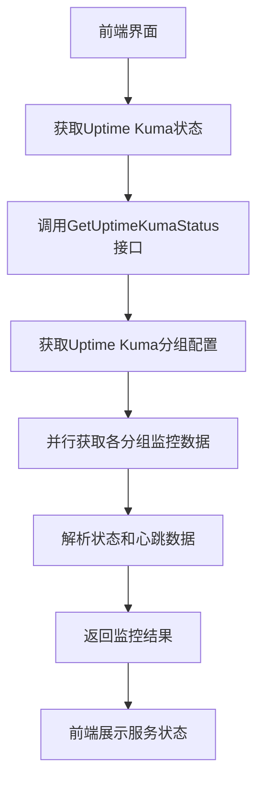
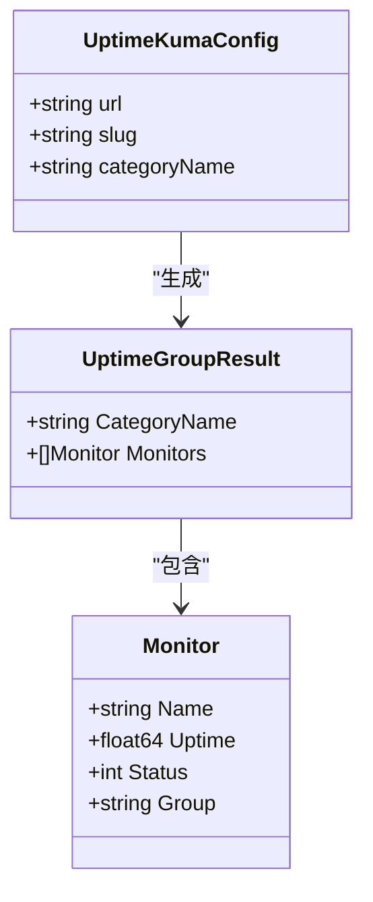
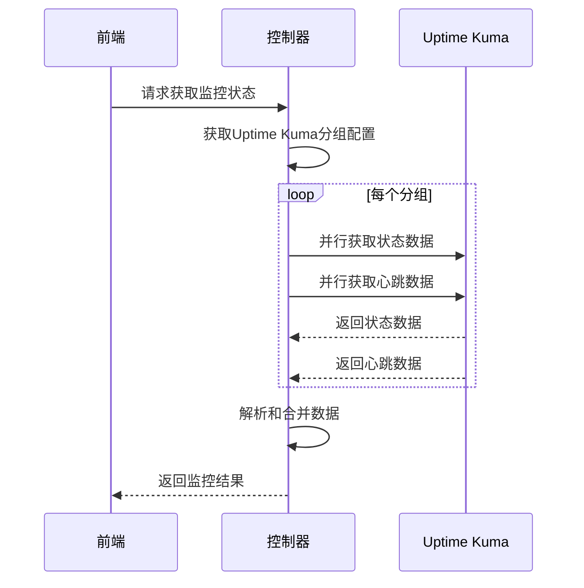
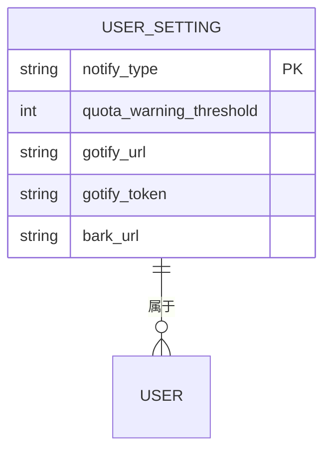
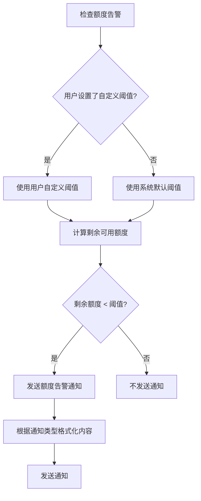
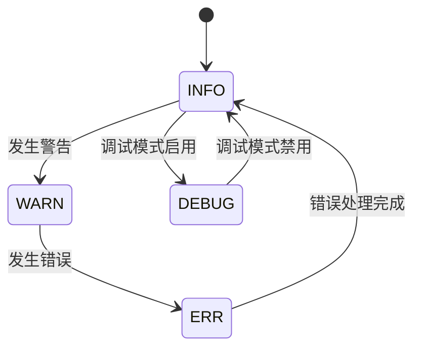
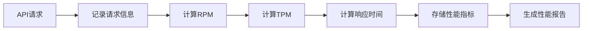
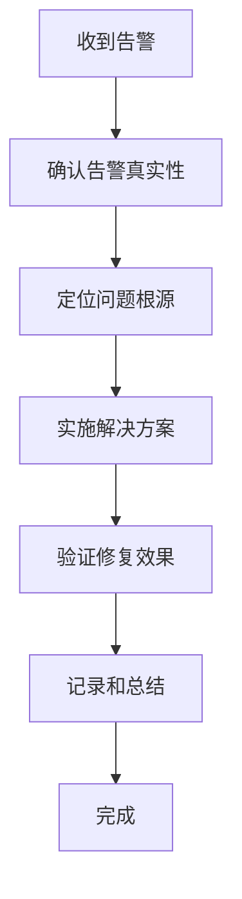

# 监控告警

<cite>
**本文档引用的文件**  
- [uptime_kuma.go](file://controller/uptime_kuma.go)
- [notify-limit.go](file://service/notify-limit.go)
- [quota.go](file://service/quota.go)
- [monitor_setting.go](file://setting/operation_setting/monitor_setting.go)
- [logger.go](file://logger/logger.go)
- [console_setting/config.go](file://setting/console_setting/config.go)
- [NotificationSettings.jsx](file://web/src/components/settings/personal/cards/NotificationSettings.jsx)
- [UptimePanel.jsx](file://web/src/components/dashboard/UptimePanel.jsx)
</cite>

## 目录
1. [引言](#引言)
2. [系统健康状态监控](#系统健康状态监控)
3. [服务可用性检测](#服务可用性检测)
4. [告警通知机制](#告警通知机制)
5. [使用量告警阈值设置](#使用量告警阈值设置)
6. [通知频率限制实现](#通知频率限制实现)
7. [日志级别配置](#日志级别配置)
8. [系统性能监控指标采集](#系统性能监控指标采集)
9. [监控配置最佳实践](#监控配置最佳实践)
10. [故障排查流程](#故障排查流程)

## 引言
本文档详细说明了系统的监控告警配置，涵盖系统健康状态监控、服务可用性检测和告警通知机制。文档重点描述了Uptime Kuma集成的配置方法，包括心跳检测接口的使用和状态上报逻辑。同时，解释了使用量告警阈值的设置方式，以及通知频率限制的实现原理。此外，文档还涵盖了日志级别配置、系统性能监控指标采集等运维监控功能，并提供了监控配置的最佳实践建议。

## 系统健康状态监控
系统健康状态监控通过集成Uptime Kuma实现，用于实时监控API服务的可用性和性能。系统通过API接口从Uptime Kuma获取监控数据，并在管理面板中展示服务状态。



**Diagram sources**  
- [uptime_kuma.go](file://controller/uptime_kuma.go#L131-L155)
- [UptimePanel.jsx](file://web/src/components/dashboard/UptimePanel.jsx#L37-L152)

**Section sources**  
- [uptime_kuma.go](file://controller/uptime_kuma.go#L1-L156)
- [UptimePanel.jsx](file://web/src/components/dashboard/UptimePanel.jsx#L1-L152)

## 服务可用性检测
服务可用性检测通过Uptime Kuma集成实现，系统定期从Uptime Kuma获取服务监控数据，包括服务状态、可用性和心跳信息。

### Uptime Kuma集成配置
Uptime Kuma集成通过配置文件设置，包括Uptime Kuma服务器地址、状态页面slug和分类名称。系统支持多个Uptime Kuma分组配置，可以监控不同类别的服务。



**Diagram sources**  
- [uptime_kuma.go](file://controller/uptime_kuma.go#L33-L36)
- [console_setting/config.go](file://setting/console_setting/config.go)

**Section sources**  
- [uptime_kuma.go](file://controller/uptime_kuma.go#L1-L156)
- [console_setting/config.go](file://setting/console_setting/config.go)

### 心跳检测接口使用
系统通过Uptime Kuma提供的API接口获取心跳检测数据，包括服务状态和可用性信息。接口调用采用并行处理，提高数据获取效率。



**Diagram sources**  
- [uptime_kuma.go](file://controller/uptime_kuma.go#L57-L128)
- [UptimePanel.jsx](file://web/src/components/dashboard/UptimePanel.jsx#L37-L152)

**Section sources**  
- [uptime_kuma.go](file://controller/uptime_kuma.go#L1-L156)

## 告警通知机制
系统实现了完善的告警通知机制，支持多种通知渠道，包括邮件、Bark和Gotify。告警通知用于提醒用户额度即将用尽或其他重要事件。

### 通知渠道配置
用户可以在个人设置中配置通知渠道和相关参数。系统支持以下通知类型：

- **邮件通知**: 通过SMTP服务器发送邮件
- **Bark通知**: 通过Bark推送服务发送移动通知
- **Gotify通知**: 通过Gotify服务器发送通知



**Diagram sources**  
- [user.go](file://controller/user.go#L1201-L1248)
- [NotificationSettings.jsx](file://web/src/components/settings/personal/cards/NotificationSettings.jsx#L406-L441)

**Section sources**  
- [user.go](file://controller/user.go#L1201-L1248)
- [NotificationSettings.jsx](file://web/src/components/settings/personal/cards/NotificationSettings.jsx#L406-L441)

## 使用量告警阈值设置
系统允许用户设置使用量告警阈值，当剩余额度低于设定值时，系统将发送告警通知。

### 阈值设置逻辑
使用量告警阈值的设置和检查逻辑如下：



**Diagram sources**  
- [quota.go](file://service/quota.go#L535-L581)
- [NotificationSettings.jsx](file://web/src/components/settings/personal/cards/NotificationSettings.jsx#L406-L441)

**Section sources**  
- [quota.go](file://service/quota.go#L526-L581)
- [NotificationSettings.jsx](file://web/src/components/settings/personal/cards/NotificationSettings.jsx#L406-L441)

## 通知频率限制实现
为防止通知泛滥，系统实现了通知频率限制机制，控制用户在特定时间内的通知发送次数。

### 通知频率限制原理
通知频率限制基于Redis或内存存储实现，根据用户ID、通知类型和时间窗口进行计数和限制。

```mermaid
classDiagram
class NotifyLimitService {
+CheckNotificationLimit(userId int, notifyType string) (bool, error)
+checkRedisLimit(userId int, notifyType string) (bool, error)
+checkMemoryLimit(userId int, notifyType string) (bool, error)
+startCleanupTask()
}
class limitCount {
+int Count
+time.Time Timestamp
}
class RedisStorage {
+notify_limit : {userId} : {notifyType} : {hour}
}
class MemoryStorage {
+notifyLimitStore sync.Map
}
NotifyLimitService --> limitCount : "使用"
NotifyLimitService --> RedisStorage : "使用"
NotifyLimitService --> MemoryStorage : "使用"
```

**Diagram sources**  
- [notify-limit.go](file://service/notify-limit.go#L1-L118)

**Section sources**  
- [notify-limit.go](file://service/notify-limit.go#L1-L118)

## 日志级别配置
系统支持多种日志级别配置，便于运维人员根据需要调整日志输出的详细程度。

### 日志级别设置
系统支持以下日志级别：

- **INFO**: 一般信息性消息
- **WARN**: 警告消息
- **ERR**: 错误消息
- **DEBUG**: 调试消息（仅在调试模式下启用）



**Diagram sources**  
- [logger.go](file://logger/logger.go#L21-L26)

**Section sources**  
- [logger.go](file://logger/logger.go#L1-L161)

## 系统性能监控指标采集
系统采集多种性能监控指标，用于评估系统运行状态和性能表现。

### 性能指标类型
系统采集的主要性能指标包括：

- **RPM (Requests Per Minute)**: 每分钟请求数
- **TPM (Tokens Per Minute)**: 每分钟处理的令牌数
- **API响应时间**: API请求的平均响应时间
- **系统资源使用率**: CPU、内存等系统资源使用情况



**Diagram sources**  
- [logger.go](file://logger/logger.go#L57-L67)
- [usage-logs/UsageLogsActions.jsx](file://web/src/components/table/usage-logs/UsageLogsActions.jsx#L46-L92)

**Section sources**  
- [logger.go](file://logger/logger.go#L1-L161)
- [usage-logs/UsageLogsActions.jsx](file://web/src/components/table/usage-logs/UsageLogsActions.jsx#L1-L95)

## 监控配置最佳实践
为确保监控系统的有效性和可靠性，建议遵循以下最佳实践。

### 告警阈值设定
- **合理设置阈值**: 根据实际使用情况设置合理的告警阈值，避免过于频繁或过于稀少的告警
- **分级告警**: 设置多个告警级别，如低、中、高，对应不同的响应策略
- **考虑业务周期**: 考虑业务的周期性变化，避免在高峰期产生大量误报

### 通知渠道选择
- **多渠道通知**: 配置多种通知渠道，确保关键告警能够及时送达
- **重要告警优先**: 对于关键告警，使用更可靠的渠道（如短信或电话）
- **测试通知渠道**: 定期测试通知渠道的可用性，确保告警能够正常发送

### 故障排查流程
1. **确认告警真实性**: 验证告警是否真实反映系统问题
2. **定位问题根源**: 分析日志和监控数据，确定问题的根本原因
3. **实施解决方案**: 根据问题类型采取相应的解决措施
4. **验证修复效果**: 确认问题已解决，系统恢复正常
5. **记录和总结**: 记录故障处理过程，总结经验教训



**Diagram sources**  
- [uptime_kuma.go](file://controller/uptime_kuma.go)
- [notify-limit.go](file://service/notify-limit.go)
- [logger.go](file://logger/logger.go)

**Section sources**  
- [uptime_kuma.go](file://controller/uptime_kuma.go#L1-L156)
- [notify-limit.go](file://service/notify-limit.go#L1-L118)
- [logger.go](file://logger/logger.go#L1-L161)

## 故障排查流程
当监控系统发现问题时，应按照标准的故障排查流程进行处理。

### 常见故障类型及解决方案
| 故障类型 | 可能原因 | 解决方案 |
|---------|--------|--------|
| **服务不可用** | 服务进程崩溃、网络问题、配置错误 | 重启服务、检查网络连接、验证配置文件 |
| **性能下降** | 资源不足、代码效率问题、外部依赖延迟 | 优化代码、增加资源、检查外部服务 |
| **告警未发送** | 通知渠道配置错误、网络问题、频率限制 | 检查通知配置、验证网络连接、等待频率限制过期 |
| **监控数据缺失** | 数据采集失败、存储问题、权限不足 | 检查数据采集服务、验证存储状态、检查权限设置 |

**Section sources**  
- [uptime_kuma.go](file://controller/uptime_kuma.go#L1-L156)
- [notify-limit.go](file://service/notify-limit.go#L1-L118)
- [logger.go](file://logger/logger.go#L1-L161)