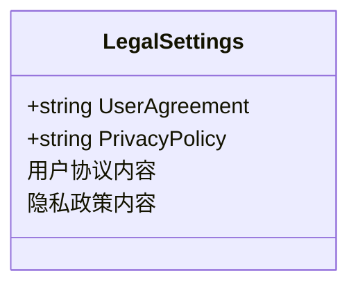
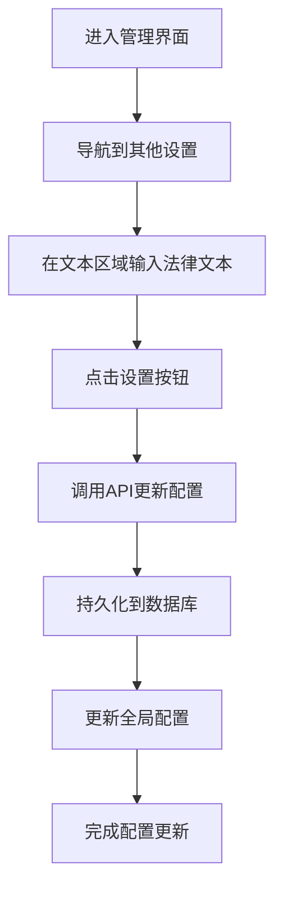
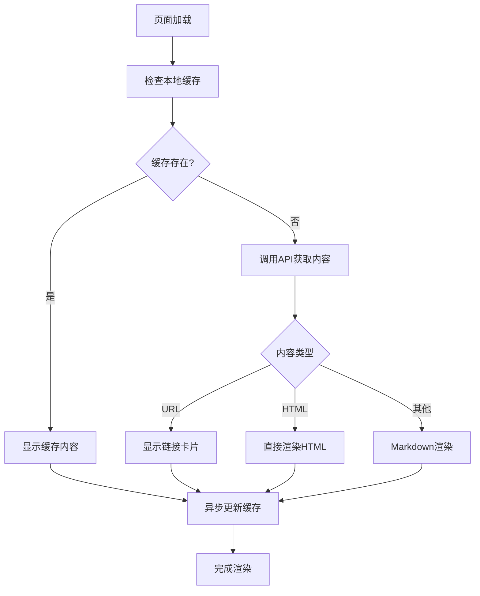
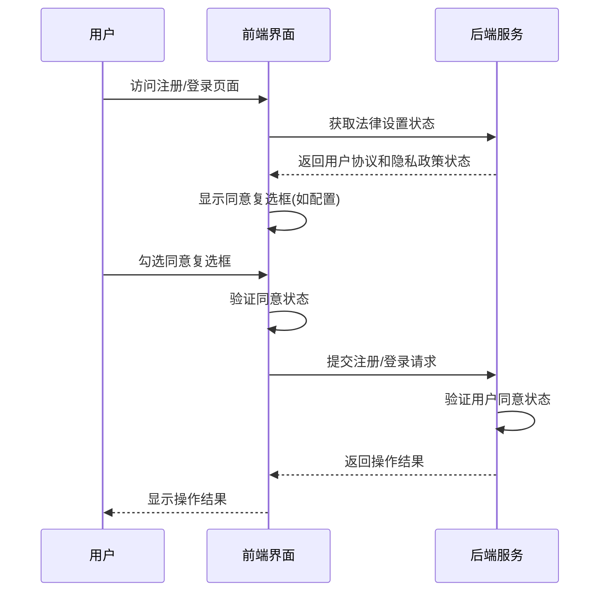
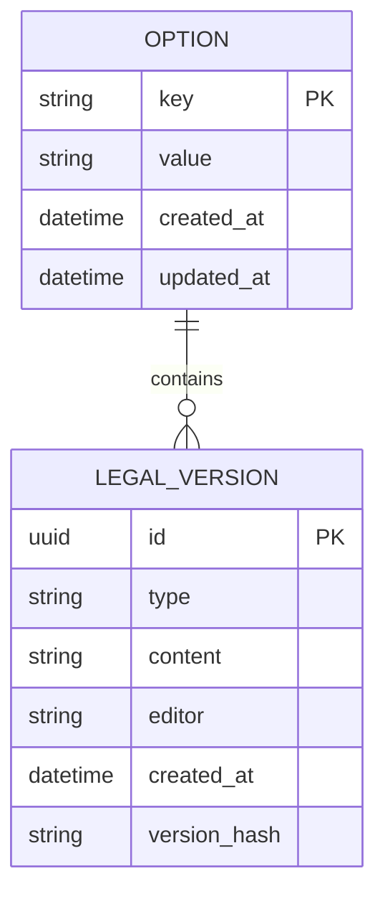
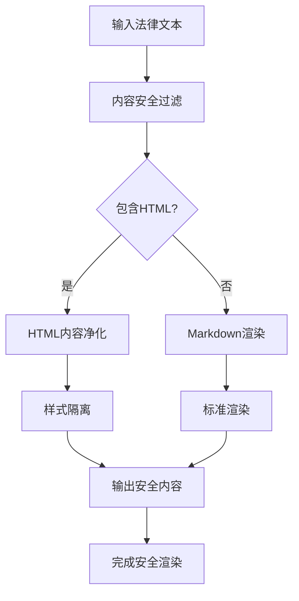

# 法律信息管理

<cite>
**本文档引用文件**   
- [legal.go](file://setting/system_setting/legal.go)
- [OtherSetting.jsx](file://web/src/components/settings/OtherSetting.jsx)
- [UserAgreement/index.jsx](file://web/src/pages/UserAgreement/index.jsx)
- [PrivacyPolicy/index.jsx](file://web/src/pages/PrivacyPolicy/index.jsx)
- [DocumentRenderer/index.jsx](file://web/src/components/common/DocumentRenderer/index.jsx)
- [misc.go](file://controller/misc.go)
- [option.go](file://controller/option.go)
- [option.go](file://model/option.go)
</cite>

## 目录
1. [简介](#简介)
2. [法律信息配置结构](#法律信息配置结构)
3. [管理界面配置流程](#管理界面配置流程)
4. [前端渲染机制](#前端渲染机制)
5. [用户同意逻辑](#用户同意逻辑)
6. [版本管理与历史存档](#版本管理与历史存档)
7. [多语言支持](#多语言支持)
8. [安全与合规性](#安全与合规性)
9. [高级管理功能](#高级管理功能)

## 简介
本系统提供完整的法律信息管理功能，支持用户协议和隐私政策的动态配置、版本管理、多语言支持和合规性检查。通过管理界面，管理员可以轻松更新法律文本，系统会自动处理文本的存储、渲染和用户同意状态管理。法律文本支持Markdown和HTML格式，确保内容展示的灵活性和丰富性。

## 法律信息配置结构
系统通过`LegalSettings`结构体管理法律信息，包含用户协议和隐私政策两个核心字段。该结构体注册为全局配置，确保配置的统一管理和持久化。



**Diagram sources**
- [legal.go](file://setting/system_setting/legal.go#L5-L8)

**Section sources**
- [legal.go](file://setting/system_setting/legal.go#L5-L21)

## 管理界面配置流程
管理员通过"其他设置"页面配置法律信息。系统提供专门的文本区域用于输入用户协议和隐私政策内容，支持Markdown和HTML代码。



**Diagram sources**
- [OtherSetting.jsx](file://web/src/components/settings/OtherSetting.jsx#L37-L411)

**Section sources**
- [OtherSetting.jsx](file://web/src/components/settings/OtherSetting.jsx#L37-L411)

## 前端渲染机制
系统通过`DocumentRenderer`组件实现法律文本的渲染，支持多种内容类型和缓存机制，确保用户体验的流畅性。



**Diagram sources**
- [DocumentRenderer/index.jsx](file://web/src/components/common/DocumentRenderer/index.jsx#L75-L243)
- [UserAgreement/index.jsx](file://web/src/pages/UserAgreement/index.jsx#L28-L33)
- [PrivacyPolicy/index.jsx](file://web/src/pages/PrivacyPolicy/index.jsx#L29-L32)

**Section sources**
- [DocumentRenderer/index.jsx](file://web/src/components/common/DocumentRenderer/index.jsx#L75-L243)

## 用户同意逻辑
系统在用户注册和登录时强制检查法律协议同意状态，确保合规性要求得到满足。



**Diagram sources**
- [LoginForm.jsx](file://web/src/components/auth/LoginForm.jsx#L583-L725)
- [RegisterForm.jsx](file://web/src/components/auth/RegisterForm.jsx#L570-L606)
- [misc.go](file://controller/misc.go#L160-L175)

**Section sources**
- [LoginForm.jsx](file://web/src/components/auth/LoginForm.jsx#L583-L725)
- [RegisterForm.jsx](file://web/src/components/auth/RegisterForm.jsx#L570-L606)

## 版本管理与历史存档
系统通过数据库持久化存储法律文本，支持历史版本的追溯和管理。



**Diagram sources**
- [option.go](file://model/option.go#L16-L19)
- [option.go](file://model/option.go#L176-L190)

**Section sources**
- [option.go](file://model/option.go#L16-L190)

## 多语言支持
系统通过i18n国际化框架支持多语言法律文本，确保全球用户的合规性要求。

```mermaid
flowchart TD
A[用户访问] --> B[检测浏览器语言]
B --> C{支持的语言?}
C --> |是| D[加载对应语言包]
C --> |否| E[使用默认语言(中文)]
D --> F[渲染多语言内容]
E --> F
F --> G[显示法律文本]
```

**Diagram sources**
- [i18n.js](file://web/src/i18n/i18n.js#L20-L50)
- [zh.json](file://web/src/i18n/locales/zh.json)
- [fr.json](file://web/src/i18n/locales/fr.json)

## 安全与合规性
系统实施严格的安全措施，确保法律文本的内容安全和合规性。



**Diagram sources**
- [DocumentRenderer/index.jsx](file://web/src/components/common/DocumentRenderer/index.jsx#L50-L66)
- [DocumentRenderer/index.jsx](file://web/src/components/common/DocumentRenderer/index.jsx#L130-L151)

## 高级管理功能
系统提供一系列高级管理功能，增强法律信息管理的灵活性和安全性。

### 内容安全过滤
系统对HTML内容进行净化处理，提取样式并隔离应用，防止CSS污染和XSS攻击。

### 历史版本存档
通过数据库记录每次法律文本的更新，支持版本对比和回滚操作。

### 合规性检查
系统定期检查法律文本的更新情况，提醒管理员及时更新以符合最新的法律法规要求。

### 缓存策略
实现多层缓存策略，包括本地存储缓存和内存缓存，提高法律文本的加载性能。

**Section sources**
- [DocumentRenderer/index.jsx](file://web/src/components/common/DocumentRenderer/index.jsx#L82-L111)
- [option.go](file://model/option.go#L176-L190)
- [misc.go](file://controller/misc.go#L160-L175)