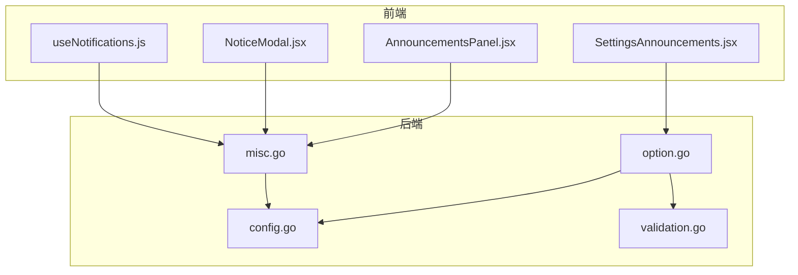
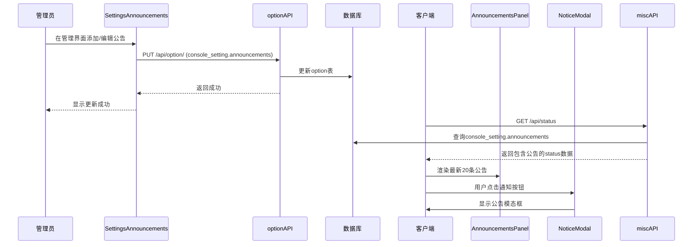
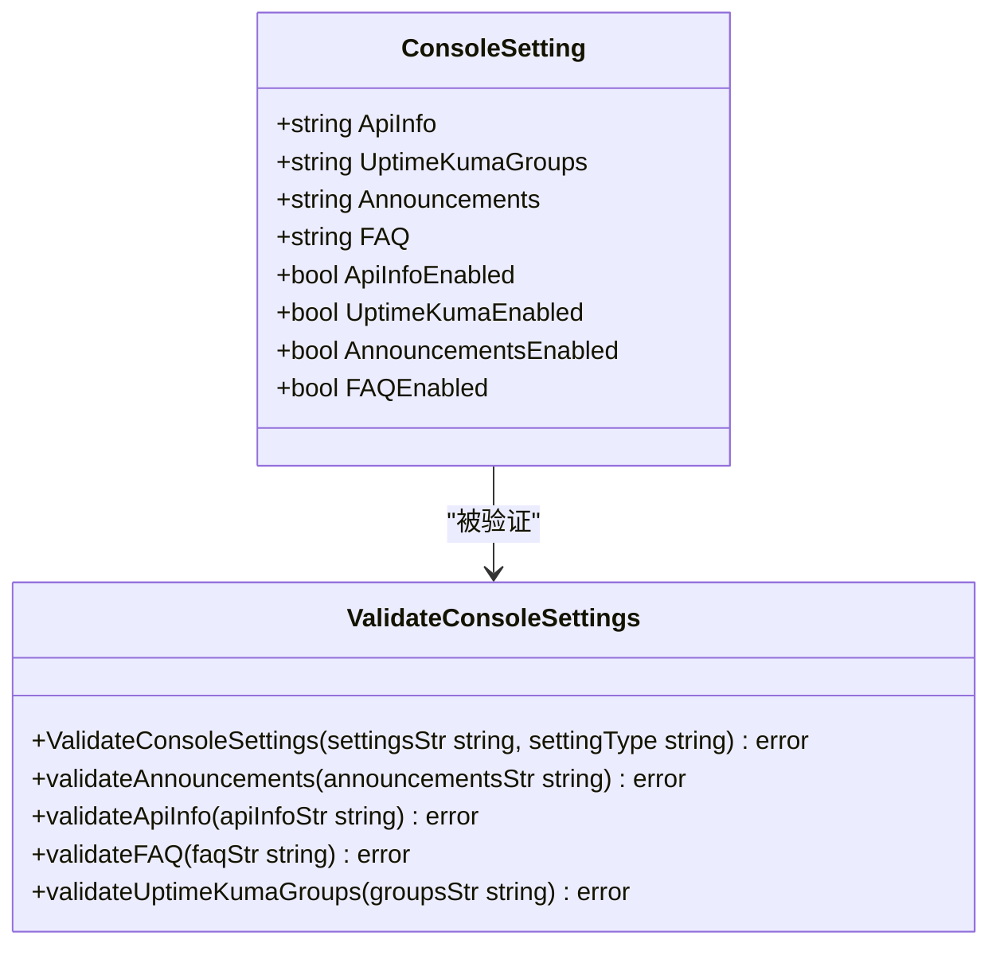
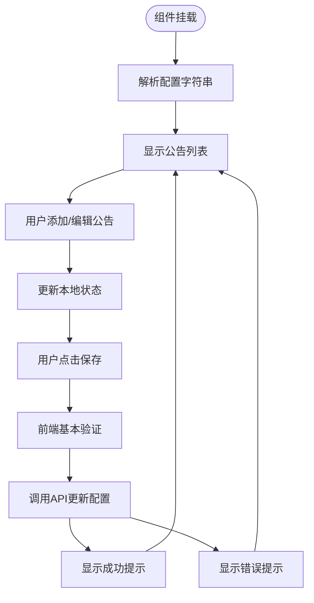
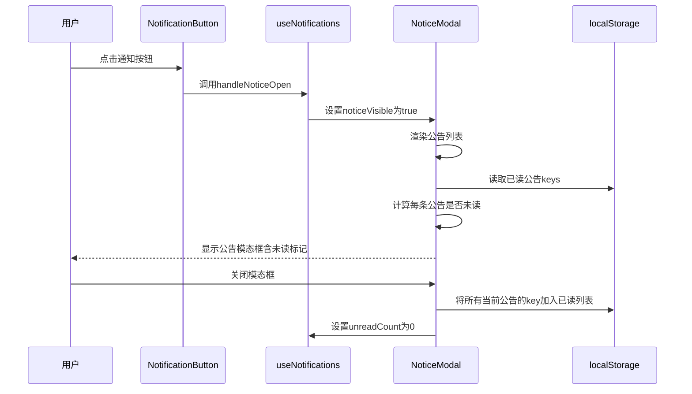
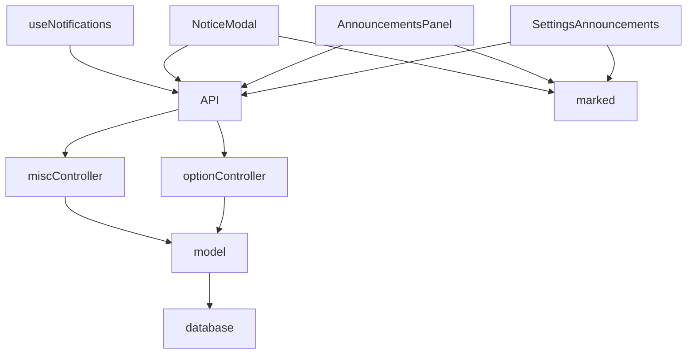

# 系统公告配置

<cite>
**本文档中引用的文件**  
- [config.go](file://setting/console_setting/config.go)
- [validation.go](file://setting/console_setting/validation.go)
- [SettingsAnnouncements.jsx](file://web/src/pages/Setting/Dashboard/SettingsAnnouncements.jsx)
- [NoticeModal.jsx](file://web/src/components/layout/NoticeModal.jsx)
- [AnnouncementsPanel.jsx](file://web/src/components/dashboard/AnnouncementsPanel.jsx)
- [useNotifications.js](file://web/src/hooks/common/useNotifications.js)
- [option.go](file://controller/option.go)
- [misc.go](file://controller/misc.go)
</cite>

## 目录
1. [简介](#简介)
2. [项目结构](#项目结构)
3. [核心组件](#核心组件)
4. [架构概述](#架构概述)
5. [详细组件分析](#详细组件分析)
6. [依赖分析](#依赖分析)
7. [性能考虑](#性能考虑)
8. [故障排除指南](#故障排除指南)
9. [结论](#结论)
10. [附录](#附录)（如有必要）

## 简介
本文档详细说明了如何通过JSON格式配置动态系统公告。文档涵盖了`announcements`配置项的数据结构（包含title、content、type、expireAt等字段），前端`SettingsAnnouncements`组件如何解析和渲染公告列表，公告的优先级排序规则、过期时间处理机制以及不同类型公告（通知、警告、成功）的视觉呈现方式。同时，阐述了配置热更新流程——从管理界面修改到option表持久化再到所有客户端实时同步的完整链路。此外，还提供了批量导入、语法验证、预览模式等操作指导，并包含常见问题如公告不显示、格式错乱的排查方案。

## 项目结构
系统公告功能主要由后端配置管理、前端管理界面和前端展示组件三部分构成。后端配置存储在`setting/console_setting`包中，通过`config.go`定义数据结构，`validation.go`进行验证。前端管理界面位于`web/src/pages/Setting/Dashboard/SettingsAnnouncements.jsx`，负责公告的增删改查操作。前端展示组件包括`web/src/components/dashboard/AnnouncementsPanel.jsx`（仪表板面板）和`web/src/components/layout/NoticeModal.jsx`（公告模态框），负责公告的渲染和用户交互。

**Diagram sources**
- [config.go](file://setting/console_setting/config.go)
- [validation.go](file://setting/console_setting/validation.go)
- [option.go](file://controller/option.go)
- [misc.go](file://controller/misc.go)
- [SettingsAnnouncements.jsx](file://web/src/pages/Setting/Dashboard/SettingsAnnouncements.jsx)
- [AnnouncementsPanel.jsx](file://web/src/components/dashboard/AnnouncementsPanel.jsx)
- [NoticeModal.jsx](file://web/src/components/layout/NoticeModal.jsx)
- [useNotifications.js](file://web/src/hooks/common/useNotifications.js)

**Section sources**
- [config.go](file://setting/console_setting/config.go)
- [validation.go](file://setting/console_setting/validation.go)
- [option.go](file://controller/option.go)
- [misc.go](file://controller/misc.go)
- [SettingsAnnouncements.jsx](file://web/src/pages/Setting/Dashboard/SettingsAnnouncements.jsx)
- [AnnouncementsPanel.jsx](file://web/src/components/dashboard/AnnouncementsPanel.jsx)
- [NoticeModal.jsx](file://web/src/components/layout/NoticeModal.jsx)
- [useNotifications.js](file://web/src/hooks/common/useNotifications.js)

## 核心组件
系统公告的核心组件包括后端的`ConsoleSetting`结构体和`ValidateConsoleSettings`函数，以及前端的`SettingsAnnouncements`、`AnnouncementsPanel`和`NoticeModal`组件。`ConsoleSetting`定义了公告的存储结构，`ValidateConsoleSettings`确保了公告数据的合法性。前端组件则分别负责管理、展示和交互。

**Section sources**
- [config.go](file://setting/console_setting/config.go#L5-L40)
- [validation.go](file://setting/console_setting/validation.go#L62-L305)
- [SettingsAnnouncements.jsx](file://web/src/pages/Setting/Dashboard/SettingsAnnouncements.jsx#L50-L635)
- [AnnouncementsPanel.jsx](file://web/src/components/dashboard/AnnouncementsPanel.jsx#L30-L126)
- [NoticeModal.jsx](file://web/src/components/layout/NoticeModal.jsx#L39-L256)

## 架构概述
系统公告的架构遵循典型的前后端分离模式。后端通过`option`表持久化存储公告配置，前端通过API接口获取和更新配置。公告数据在后端经过验证后存储，并通过`GetStatus`接口实时推送给所有客户端。前端组件通过状态管理机制订阅公告数据的变化，并实时更新UI。

**Diagram sources**
- [option.go](file://controller/option.go#L184-L224)
- [misc.go](file://controller/misc.go#L90-L136)
- [SettingsAnnouncements.jsx](file://web/src/pages/Setting/Dashboard/SettingsAnnouncements.jsx#L214-L226)
- [AnnouncementsPanel.jsx](file://web/src/components/dashboard/AnnouncementsPanel.jsx#L30-L126)
- [NoticeModal.jsx](file://web/src/components/layout/NoticeModal.jsx#L39-L256)

## 详细组件分析

### 后端配置与验证组件分析
后端的`ConsoleSetting`结构体定义了系统公告的配置项，其中`Announcements`字段存储JSON格式的公告数组，`AnnouncementsEnabled`字段控制公告面板的启用状态。`validateAnnouncements`函数对公告数据进行严格的验证，确保每个公告都包含必要的字段（content、publishDate），并且字段值符合要求（如publishDate为RFC3339格式，type为预定义的合法值）。

**Diagram sources**
- [config.go](file://setting/console_setting/config.go#L5-L40)
- [validation.go](file://setting/console_setting/validation.go#L62-L305)

**Section sources**
- [config.go](file://setting/console_setting/config.go#L5-L40)
- [validation.go](file://setting/console_setting/validation.go#L62-L305)

### 前端管理界面组件分析
`SettingsAnnouncements`组件提供了公告的完整管理功能。它通过`options`属性接收后端传来的公告配置，并使用`parseAnnouncements`函数将其解析为React状态。用户可以通过表单添加或编辑公告，所有操作都在前端暂存，直到用户点击“保存设置”才通过`updateOption` API批量提交到后端。该组件还实现了分页、批量删除和预览模式等功能。

**Diagram sources**
- [SettingsAnnouncements.jsx](file://web/src/pages/Setting/Dashboard/SettingsAnnouncements.jsx#L50-L635)

**Section sources**
- [SettingsAnnouncements.jsx](file://web/src/pages/Setting/Dashboard/SettingsAnnouncements.jsx#L50-L635)

### 前端展示与通知组件分析
`AnnouncementsPanel`和`NoticeModal`组件负责公告的展示。`AnnouncementsPanel`在仪表板上显示最新的20条公告，按发布时间倒序排列。`NoticeModal`则通过通知按钮触发，显示更详细的公告列表，并标记未读公告。`useNotifications` Hook管理未读状态，通过`localStorage`记录已读公告的key，实现跨会话的未读状态保持。

**Diagram sources**
- [useNotifications.js](file://web/src/hooks/common/useNotifications.js#L22-L94)
- [NoticeModal.jsx](file://web/src/components/layout/NoticeModal.jsx#L39-L256)
- [NotificationButton.jsx](file://web/src/components/layout/headerbar/NotificationButton.jsx#L24-L47)

**Section sources**
- [useNotifications.js](file://web/src/hooks/common/useNotifications.js#L22-L94)
- [NoticeModal.jsx](file://web/src/components/layout/NoticeModal.jsx#L39-L256)
- [NotificationButton.jsx](file://web/src/components/layout/headerbar/NotificationButton.jsx#L24-L47)

## 依赖分析
系统公告功能依赖于多个模块的协同工作。后端依赖`model`包进行数据库操作，`common`包提供通用工具函数。前端依赖`react`、`@douyinfe/semi-ui`等UI库，以及`marked`库进行Markdown解析。各组件之间通过API接口和状态管理进行通信，形成了一个松耦合但功能完整的系统。

**Diagram sources**
- [SettingsAnnouncements.jsx](file://web/src/pages/Setting/Dashboard/SettingsAnnouncements.jsx#L41-L46)
- [AnnouncementsPanel.jsx](file://web/src/components/dashboard/AnnouncementsPanel.jsx#L30-L126)
- [NoticeModal.jsx](file://web/src/components/layout/NoticeModal.jsx#L30-L31)
- [useNotifications.js](file://web/src/hooks/common/useNotifications.js#L42-L43)
- [option.go](file://controller/option.go)
- [misc.go](file://controller/misc.go)
- [model.go](file://model/model.go)

**Section sources**
- [SettingsAnnouncements.jsx](file://web/src/pages/Setting/Dashboard/SettingsAnnouncements.jsx#L41-L46)
- [AnnouncementsPanel.jsx](file://web/src/components/dashboard/AnnouncementsPanel.jsx#L30-L126)
- [NoticeModal.jsx](file://web/src/components/layout/NoticeModal.jsx#L30-L31)
- [useNotifications.js](file://web/src/hooks/common/useNotifications.js#L42-L43)
- [option.go](file://controller/option.go)
- [misc.go](file://controller/misc.go)
- [model.go](file://model/model.go)

## 性能考虑
系统公告功能在性能方面做了多项优化。后端通过`GetStatus`接口一次性返回所有状态信息，减少了API调用次数。前端对公告列表进行分页处理，避免一次性渲染大量数据。公告内容使用Markdown解析，支持富文本但避免了复杂的HTML注入风险。未读状态通过`localStorage`本地存储，减少了不必要的网络请求。

## 故障排除指南
当遇到公告不显示或格式错乱的问题时，可以按照以下步骤进行排查：
1. 检查`console_setting.announcements_enabled`选项是否为`true`。
2. 检查`console_setting.announcements`的JSON格式是否正确，可通过在线JSON验证工具检查。
3. 确认每条公告都包含`content`和`publishDate`字段，且`publishDate`为有效的RFC3339时间格式。
4. 检查`type`字段是否为`default`、`ongoing`、`success`、`warning`、`error`之一。
5. 查看浏览器控制台是否有JavaScript错误，特别是`parseAnnouncements`函数的执行情况。
6. 清除浏览器缓存和`localStorage`中的`notice_read_keys`，重新加载页面。

**Section sources**
- [validation.go](file://setting/console_setting/validation.go#L140-L185)
- [SettingsAnnouncements.jsx](file://web/src/pages/Setting/Dashboard/SettingsAnnouncements.jsx#L315-L334)
- [NoticeModal.jsx](file://web/src/components/layout/NoticeModal.jsx#L53-L77)

## 结论
本文档全面解析了系统公告的配置、管理、展示和同步机制。通过JSON格式的灵活配置，结合前后端的紧密协作，实现了动态、实时的系统公告功能。该设计既保证了配置的灵活性，又通过严格的验证确保了数据的安全性，为系统管理员提供了一个强大而易用的公告管理工具。