# 系统设置

<cite>
**本文档引用的文件**   
- [config.go](file://setting/config/config.go)
- [console_setting.go](file://setting/console_setting/config.go)
- [discord.go](file://setting/system_setting/discord.go)
- [oidc.go](file://setting/system_setting/oidc.go)
- [passkey.go](file://setting/system_setting/passkey.go)
- [legal.go](file://setting/system_setting/legal.go)
- [fetch_setting.go](file://setting/system_setting/fetch_setting.go)
- [validation.go](file://setting/console_setting/validation.go)
- [option.go](file://controller/option.go)
- [model.go](file://model/option.go)
- [env.go](file://common/env.go)
</cite>

## 目录
1. [系统设置](#系统设置)
2. [配置管理架构](#配置管理架构)
3. 第三方集成配置
   - [Discord集成](#discord集成)
   - [OIDC集成](#oidc集成)
   - [Passkey集成](#passkey集成)
4. 法律文本管理
   - [用户协议与隐私政策](#用户协议与隐私政策)
5. 全局参数配置
   - [系统公告](#系统公告)
   - [服务地址](#服务地址)
6. 配置机制详解
   - [配置注册与加载](#配置注册与加载)
   - [前端与后端映射](#前端与后端映射)
   - [动态更新与热加载](#动态更新与热加载)
7. 高级特性
   - [默认值管理](#默认值管理)
   - [安全敏感字段处理](#安全敏感字段处理)

## 配置管理架构

系统采用分层配置管理架构，通过`ConfigManager`统一管理所有配置模块。该架构实现了配置的模块化、可扩展性和运行时动态更新能力。

```mermaid
classDiagram
class ConfigManager {
+configs map[string]interface{}
+mutex sync.RWMutex
+Register(name string, config interface{})
+Get(name string) interface{}
+LoadFromDB(options map[string]string) error
+SaveToDB(updateFunc func(key, value string) error) error
}
class ConsoleSetting {
+ApiInfo string
+UptimeKumaGroups string
+Announcements string
+FAQ string
+ApiInfoEnabled bool
+UptimeKumaEnabled bool
+AnnouncementsEnabled bool
+FAQEnabled bool
}
class DiscordSettings {
+Enabled bool
+ClientId string
+ClientSecret string
}
class OIDCSettings {
+Enabled bool
+ClientId string
+ClientSecret string
+WellKnown string
+AuthorizationEndpoint string
+TokenEndpoint string
+UserInfoEndpoint string
}
class PasskeySettings {
+Enabled bool
+RPDisplayName string
+RPID string
+Origins string
+AllowInsecureOrigin bool
+UserVerification string
+AttachmentPreference string
}
class LegalSettings {
+UserAgreement string
+PrivacyPolicy string
}
class FetchSetting {
+EnableSSRFProtection bool
+AllowPrivateIp bool
+DomainFilterMode bool
+IpFilterMode bool
+DomainList []string
+IpList []string
+AllowedPorts []string
+ApplyIPFilterForDomain bool
}
ConfigManager --> ConsoleSetting : "注册"
ConfigManager --> DiscordSettings : "注册"
ConfigManager --> OIDCSettings : "注册"
ConfigManager --> PasskeySettings : "注册"
ConfigManager --> LegalSettings : "注册"
ConfigManager --> FetchSetting : "注册"
```

**图源**
- [config.go](file://setting/config/config.go#L13-L288)
- [console_setting.go](file://setting/console_setting/config.go#L5-L14)
- [discord.go](file://setting/system_setting/discord.go#L5-L9)
- [oidc.go](file://setting/system_setting/oidc.go#L5-L13)
- [passkey.go](file://setting/system_setting/passkey.go#L11-L19)
- [legal.go](file://setting/system_setting/legal.go#L5-L8)
- [fetch_setting.go](file://setting/system_setting/fetch_setting.go#L5-L14)

**配置管理架构**
- [config.go](file://setting/config/config.go#L13-L288)
- [console_setting.go](file://setting/console_setting/config.go#L5-L40)
- [discord.go](file://setting/system_setting/discord.go#L5-L22)

## 第三方集成配置

### Discord集成

Discord集成允许用户通过Discord账户进行身份验证和绑定。配置通过`DiscordSettings`结构体管理，包含启用状态、客户端ID和密钥。

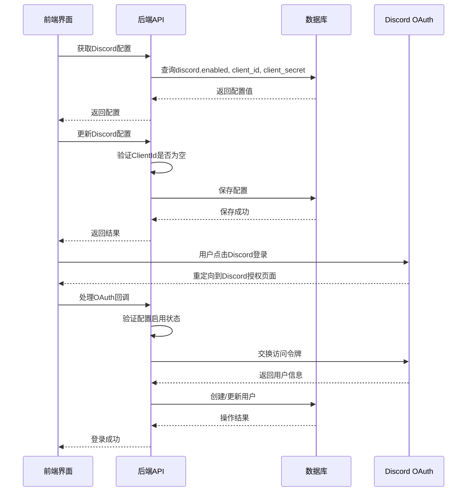

**图源**
- [discord.go](file://setting/system_setting/discord.go#L5-L22)
- [option.go](file://controller/option.go#L74-L81)
- [controller.go](file://controller/discord.go)

**Discord集成配置**
- [discord.go](file://setting/system_setting/discord.go#L5-L22)
- [option.go](file://controller/option.go#L74-L81)

### OIDC集成

OIDC（OpenID Connect）集成提供标准化的单点登录功能。配置通过`OIDCSettings`结构体管理，包含启用状态、客户端凭证和OIDC发现端点信息。

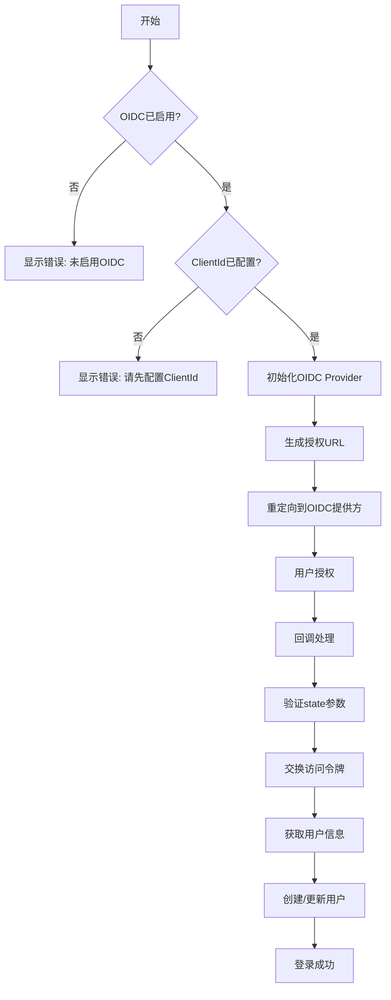

**图源**
- [oidc.go](file://setting/system_setting/oidc.go#L5-L26)
- [option.go](file://controller/option.go#L82-L88)
- [controller.go](file://controller/oidc.go)

**OIDC集成配置**
- [oidc.go](file://setting/system_setting/oidc.go#L5-L26)
- [option.go](file://controller/option.go#L82-L88)

### Passkey集成

Passkey集成提供无密码身份验证功能。配置通过`PasskeySettings`结构体管理，包含启用状态、依赖方信息和安全策略。

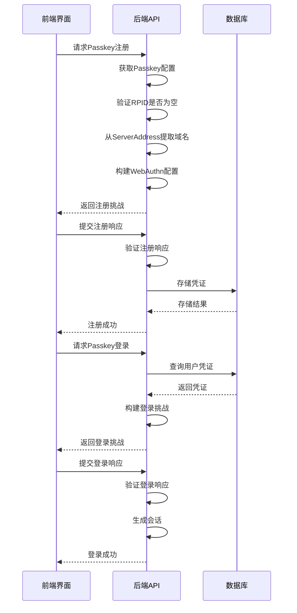

**图源**
- [passkey.go](file://setting/system_setting/passkey.go#L11-L51)
- [service.go](file://service/passkey/service.go)
- [controller.go](file://controller/passkey.go)

**Passkey集成配置**
- [passkey.go](file://setting/system_setting/passkey.go#L11-L51)
- [service.go](file://service/passkey/service.go)
- [controller.go](file://controller/passkey.go)

## 法律文本管理

### 用户协议与隐私政策

系统通过`LegalSettings`结构体管理用户协议和隐私政策内容。这些文本内容存储在数据库中，可通过管理界面进行更新。

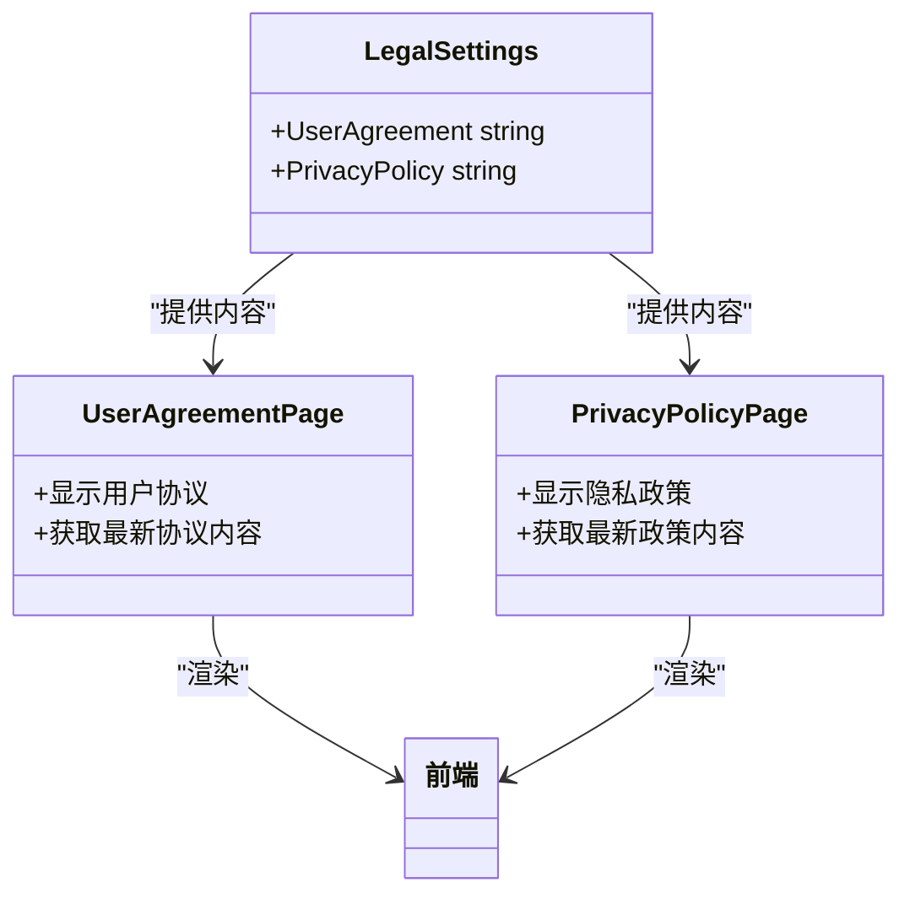

**图源**
- [legal.go](file://setting/system_setting/legal.go#L5-L22)
- [pages.go](file://web/src/pages/UserAgreement/index.jsx)
- [pages.go](file://web/src/pages/PrivacyPolicy/index.jsx)

**法律文本管理**
- [legal.go](file://setting/system_setting/legal.go#L5-L22)
- [pages.go](file://web/src/pages/UserAgreement/index.jsx)
- [pages.go](file://web/src/pages/PrivacyPolicy/index.jsx)

## 全局参数配置

### 系统公告

系统公告配置通过`ConsoleSetting`结构体管理，支持JSON格式的公告数组，包含内容、发布日期、类型和附加信息。

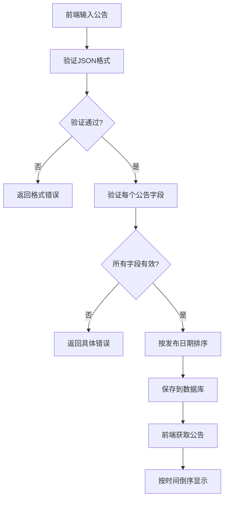

**图源**
- [console_setting.go](file://setting/console_setting/config.go#L5-L14)
- [validation.go](file://setting/console_setting/validation.go#L141-L184)
- [dashboard.jsx](file://web/src/components/dashboard/AnnouncementsPanel.jsx)

**系统公告配置**
- [console_setting.go](file://setting/console_setting/config.go#L5-L14)
- [validation.go](file://setting/console_setting/validation.go#L141-L184)

### 服务地址

服务地址（ServerAddress）是系统的关键全局参数，影响支付回调、Passkey认证等多个功能模块。

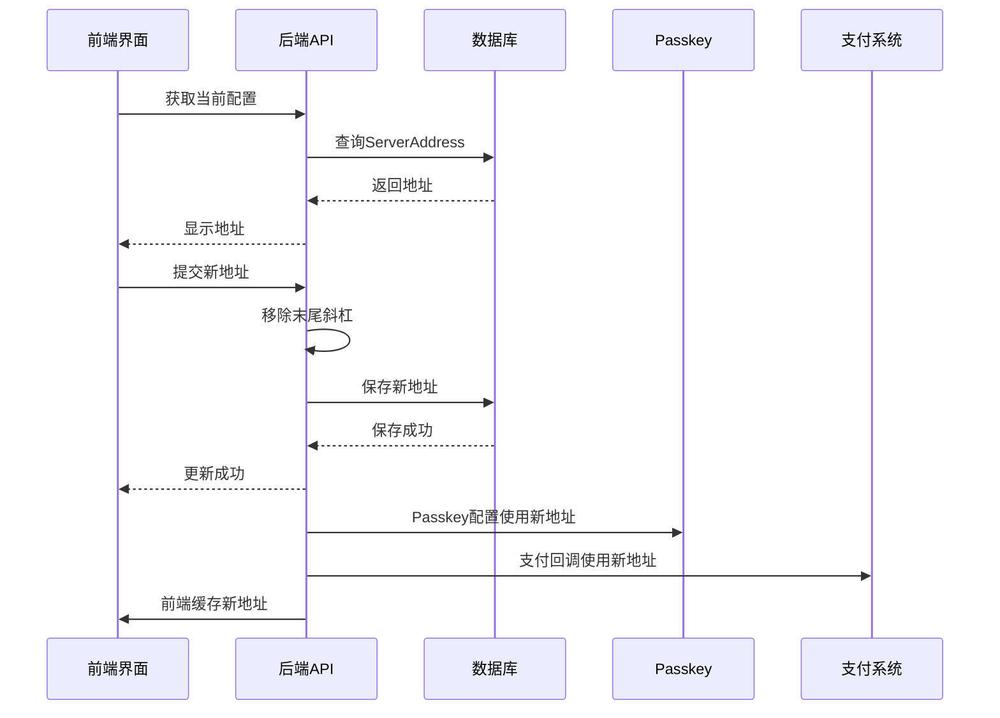

**图源**
- [system_setting.go](file://setting/system_setting/passkey.go#L36-L48)
- [option.go](file://controller/option.go)
- [settings.jsx](file://web/src/pages/Setting/Payment/SettingsGeneralPayment.jsx)

**服务地址配置**
- [passkey.go](file://setting/system_setting/passkey.go#L36-L48)
- [option.go](file://controller/option.go)
- [SettingsGeneralPayment.jsx](file://web/src/pages/Setting/Payment/SettingsGeneralPayment.jsx)

## 配置机制详解

### 配置注册与加载

系统采用`ConfigManager`设计模式实现配置的统一管理。所有配置模块在初始化时注册到全局配置管理器，通过反射机制实现配置的序列化和反序列化。

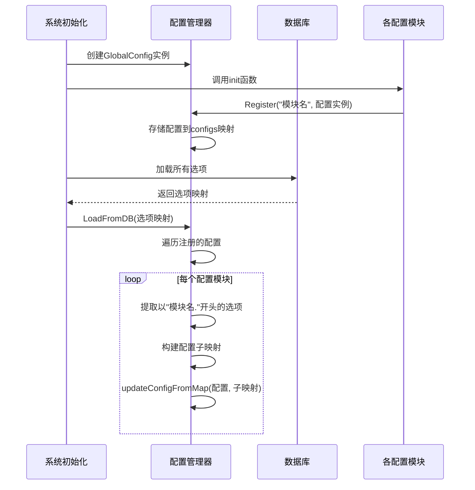

**图源**
- [config.go](file://setting/config/config.go#L27-L68)
- [console_setting.go](file://setting/console_setting/config.go#L31-L34)
- [model.go](file://model/option.go#L149-L152)

**配置注册与加载机制**
- [config.go](file://setting/config/config.go#L27-L68)
- [console_setting.go](file://setting/console_setting/config.go#L31-L34)
- [model.go](file://model/option.go#L149-L152)

### 前端与后端映射

系统通过`console_setting.announcements`等键名实现前端界面与后端配置的映射。前端通过API获取配置，后端将配置存储在数据库中。

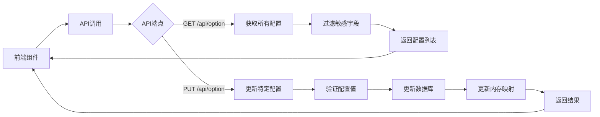

**图源**
- [option.go](file://controller/option.go)
- [model.go](file://model/option.go#L176-L190)
- [settings.jsx](file://web/src/components/settings/SystemSetting.jsx)

**前端与后端映射**
- [option.go](file://controller/option.go)
- [model.go](file://model/option.go#L176-L190)
- [SystemSetting.jsx](file://web/src/components/settings/SystemSetting.jsx)

### 动态更新与热加载

系统实现配置的动态更新和热加载机制，无需重启服务即可应用新配置。通过`SyncOptions`函数定期从数据库同步配置。

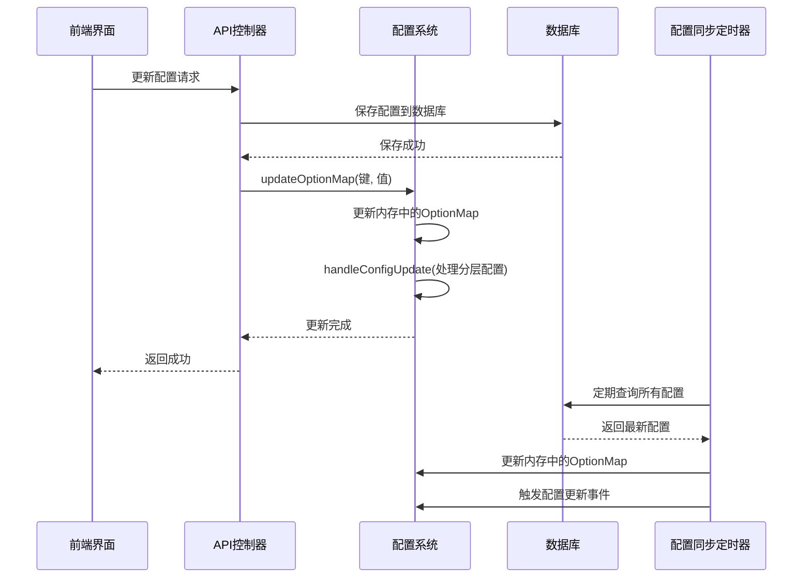

**图源**
- [model.go](file://model/option.go#L168-L174)
- [option.go](file://controller/option.go#L213-L217)
- [model.go](file://model/option.go#L455-L478)

**动态更新与热加载**
- [model.go](file://model/option.go#L168-L174)
- [option.go](file://controller/option.go#L213-L217)
- [model.go](file://model/option.go#L455-L478)

## 高级特性

### 默认值管理

系统为所有配置提供合理的默认值，确保在未配置时系统仍能正常运行。默认值在配置结构体的变量声明中定义。

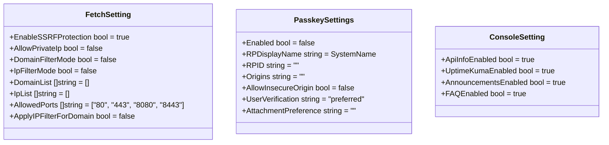

**图源**
- [fetch_setting.go](file://setting/system_setting/fetch_setting.go#L16-L25)
- [passkey.go](file://setting/system_setting/passkey.go#L21-L29)
- [console_setting.go](file://setting/console_setting/config.go#L17-L26)

**默认值管理**
- [fetch_setting.go](file://setting/system_setting/fetch_setting.go#L16-L25)
- [passkey.go](file://setting/system_setting/passkey.go#L21-L29)
- [console_setting.go](file://setting/console_setting/config.go#L17-L26)

### 安全敏感字段处理

系统对安全敏感字段（如令牌、密钥）进行特殊处理，防止在API响应中泄露。通过`GetOptions`函数过滤敏感字段。

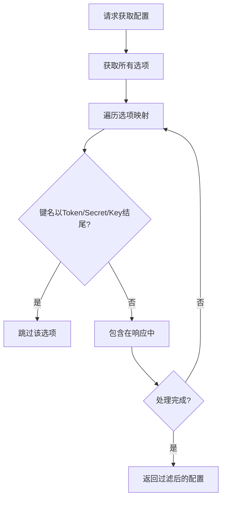

**图源**
- [option.go](file://controller/option.go#L23-L30)
- [env.go](file://common/env.go)
- [constants.go](file://common/constants.go)

**安全敏感字段处理**
- [option.go](file://controller/option.go#L23-L30)
- [env.go](file://common/env.go)
- [constants.go](file://common/constants.go)