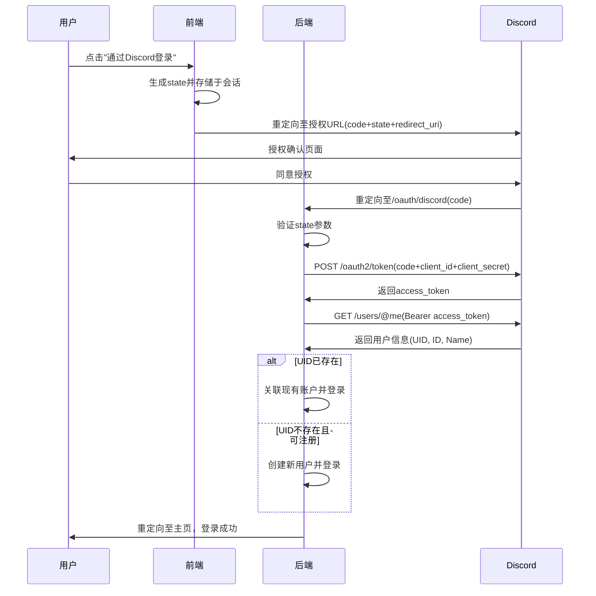

# Discord集成

<cite>
**本文档引用的文件**   
- [discord.go](file://controller/discord.go)
- [discord.go](file://setting/system_setting/discord.go)
- [api.js](file://web/src/helpers/api.js)
- [SystemSetting.jsx](file://web/src/components/settings/SystemSetting.jsx)
- [OAuth2Callback.jsx](file://web/src/components/auth/OAuth2Callback.jsx)
- [config.go](file://setting/config/config.go)
</cite>

## 目录
1. [DiscordSettings结构体配置](#discordsettings结构体配置)
2. [Discord应用创建与重定向URI设置](#discord应用创建与重定向uri设置)
3. [用户登录与账户绑定流程](#用户登录与账户绑定流程)
4. [配置系统集成与安全存储](#配置系统集成与安全存储)
5. [权限范围与常见错误处理](#权限范围与常见错误处理)
6. [前端测试验证](#前端测试验证)

## DiscordSettings结构体配置

`DiscordSettings`结构体定义了Discord OAuth集成的核心配置参数，位于`setting/system_setting/discord.go`文件中。该结构体包含三个关键字段：

- **Enabled**: 布尔类型，用于控制Discord登录和注册功能的启用状态。当设置为`true`时，用户可以通过Discord账户登录或注册；设置为`false`时，该功能被禁用。
- **ClientId**: 字符串类型，存储从Discord开发者门户获取的应用程序客户端ID。此ID用于标识您的应用程序。
- **ClientSecret**: 字符串类型，存储从Discord开发者门户获取的应用程序客户端密钥。此密钥必须严格保密，不应在前端代码或公共仓库中暴露。

该结构体通过`init()`函数在程序启动时自动注册到全局配置管理器，确保配置的集中管理和动态加载。

**Section sources**
- [discord.go](file://setting/system_setting/discord.go#L5-L21)

## Discord应用创建与重定向URI设置

要在Discord开发者门户中创建应用程序并正确配置重定向URI，请遵循以下步骤：

1. 访问[Discord开发者门户](https://discord.com/developers/applications)，登录您的Discord账户。
2. 点击"New Application"创建一个新应用，为其命名并确认。
3. 在应用仪表板中，导航到"OAuth2" -> "General"部分，记下显示的"Client ID"和"Client Secret"。
4. 在"OAuth2" -> "Redirects"部分，添加重定向URI。根据代码分析，正确的重定向URI应为`https://yourdomain.com/oauth/discord`，其中`yourdomain.com`是您服务的域名。此URI必须与前端代码中使用的`window.location.origin`相匹配。
5. 在"OAuth2" -> "Scopes"部分，确保勾选了`identify`和`openid`权限范围，以便获取用户的基本身份信息。

**Section sources**
- [api.js](file://web/src/helpers/api.js#L248-L256)
- [SystemSetting.jsx](file://web/src/components/settings/SystemSetting.jsx#L1476-L1498)

## 用户登录与账户绑定流程

Discord OAuth集成的核心流程由`controller/discord.go`中的`DiscordOAuth`和`DiscordBind`函数实现，涵盖了从用户授权到本地账户创建或关联的完整过程。

### 登录流程 (DiscordOAuth)

1. **State验证**: 函数首先验证请求中的`state`参数是否与会话中存储的`oauth_state`匹配，以防止跨站请求伪造(CSRF)攻击。
2. **登录状态检查**: 如果用户已登录（会话中存在用户名），则直接调用`DiscordBind`进行账户绑定。
3. **功能启用检查**: 检查`DiscordSettings.Enabled`是否为`true`，若未启用则返回错误。
4. **令牌交换**: 使用从Discord回调获取的授权码(`code`)，向`https://discord.com/api/v10/oauth2/token`发起POST请求，交换访问令牌。此请求包含`ClientId`、`ClientSecret`、`code`、`grant_type`和`redirect_uri`。
5. **用户信息获取**: 使用获取的访问令牌，向`https://discord.com/api/v10/users/@me`发起GET请求，获取用户的`UID`（用户ID）、`ID`（用户名）和`Name`（全局名称）。
6. **本地账户处理**:
   - **账户关联**: 如果该Discord `UID`已存在于本地数据库中，则通过`FillUserByDiscordId()`填充用户信息并登录。
   - **新用户注册**: 如果`UID`不存在且注册功能开启，则创建新用户。用户名优先使用Discord的`ID`，否则生成一个以"discord_"开头的唯一用户名；显示名称优先使用`Name`，否则设为"Discord User"。
7. **登录完成**: 调用`setupLogin()`函数完成登录流程，建立用户会话。

### 账户绑定流程 (DiscordBind)

1. **功能启用检查**: 与登录流程相同，检查功能是否启用。
2. **令牌交换与信息获取**: 与登录流程的第4、5步相同，获取用户的Discord信息。
3. **绑定检查**: 检查该Discord账户是否已被其他用户绑定，若已绑定则返回错误。
4. **关联当前用户**: 获取当前登录用户的会话ID，将获取到的Discord `UID`与该用户ID关联，并更新数据库。

**Diagram sources**
- [discord.go](file://controller/discord.go#L102-L179)

**Section sources**
- [discord.go](file://controller/discord.go#L102-L179)

## 配置系统集成与安全存储

### GetDiscordSettings函数

`GetDiscordSettings()`函数是访问Discord配置的唯一入口，它返回对`defaultDiscordSettings`变量的指针。该函数的设计确保了配置的单例模式，所有对Discord设置的读取都通过此函数进行，保证了配置的一致性。

### 全局配置系统集成

Discord配置通过`setting/config/config.go`中的`ConfigManager`进行管理。`DiscordSettings`结构体在`init()`函数中通过`config.GlobalConfig.Register("discord", &defaultDiscordSettings)`注册到全局配置管理器。这使得配置可以：
- 从数据库动态加载和保存。
- 在运行时被其他模块安全地访问。
- 通过统一的接口进行更新。

### ClientId和ClientSecret加密存储

根据代码分析，`ClientId`和`ClientSecret`的存储遵循了安全最佳实践：
- **前端安全**: 在前端设置界面(`SystemSetting.jsx`)中，`ClientSecret`字段被设置为密码类型(`type='password'`)，输入时内容被隐藏，且注释明确指出"敏感信息不会发送到前端显示"，这表明密钥在传输和显示时受到保护。
- **后端存储**: 配置通过`ConfigManager`的`SaveToDB`方法持久化到数据库。虽然代码未直接显示加密逻辑，但最佳实践要求此类敏感信息应在存储前进行加密。`config.go`中的`updateConfigFromMap`和`configToMap`函数支持复杂类型的序列化，为实现加密存储提供了基础。

**Section sources**
- [discord.go](file://setting/system_setting/discord.go#L19-L21)
- [config.go](file://setting/config/config.go#L27-L88)
- [SystemSetting.jsx](file://web/src/components/settings/SystemSetting.jsx#L1466-L1470)

## 权限范围与常见错误处理

### 权限范围（Scope）配置建议

根据前端代码`web/src/helpers/api.js`中的`onDiscordOAuthClicked`函数，推荐的权限范围（scope）为`identify+openid`。这足以获取用户的基本身份信息（ID和用户名），满足登录和绑定需求。不建议请求过多权限，以遵循最小权限原则，提升用户信任度。

### 常见集成错误解决方案

- **401 Unauthorized (未授权)**:
  - **原因**: 最常见的原因是`ClientId`或`ClientSecret`配置错误。
  - **解决方案**: 仔细核对Discord开发者门户中的凭证，并确保它们已正确复制到系统设置中。检查`ClientSecret`是否因包含特殊字符而被截断。

- **"Discord 获取 Token 失败"**:
  - **原因**: 除了凭证错误，还可能是`redirect_uri`不匹配。
  - **解决方案**: 确认在Discord开发者门户中配置的重定向URI与前端代码生成的URI完全一致，包括协议（http/https）和端口。

- **"state is empty or not same"**:
  - **原因**: CSRF保护机制触发，会话中的`oauth_state`丢失或与请求参数不匹配。
  - **解决方案**: 检查服务器会话配置（如`common.SessionSecret`）是否正确，确保会话能够正常存储和检索。

**Section sources**
- [api.js](file://web/src/helpers/api.js#L253)
- [discord.go](file://controller/discord.go#L69-L72)
- [discord.go](file://controller/discord.go#L105-L109)

## 前端测试验证

系统提供了直观的前端界面来测试和验证Discord集成：

1. **管理员配置界面**: 管理员可以在"系统设置" -> "配置 Discord OAuth"卡片中输入`ClientId`和`ClientSecret`，并点击"保存"。保存后，该功能即对所有用户可见。
2. **用户绑定界面**: 已登录用户可以在"个人设置" -> "账户管理"中看到"Discord"卡片。如果管理员已启用该功能且用户尚未绑定，卡片上会显示"绑定"按钮。
3. **测试流程**:
   - 点击"绑定"按钮，前端调用`onDiscordOAuthClicked`函数。
   - 函数生成`state`并打开Discord授权页面。
   - 用户授权后，被重定向回`/oauth/discord`，后端完成OAuth流程。
   - 成功后，前端界面会刷新，按钮状态变为"已绑定"。

此流程确保了从配置到使用的端到端可测试性。

**Section sources**
- [SystemSetting.jsx](file://web/src/components/settings/SystemSetting.jsx#L1473-L1475)
- [AccountManagement.jsx](file://web/src/components/settings/personal/cards/AccountManagement.jsx#L279-L287)
- [api.js](file://web/src/helpers/api.js#L248-L257)
- [OAuth2Callback.jsx](file://web/src/components/auth/OAuth2Callback.jsx#L33-L40)