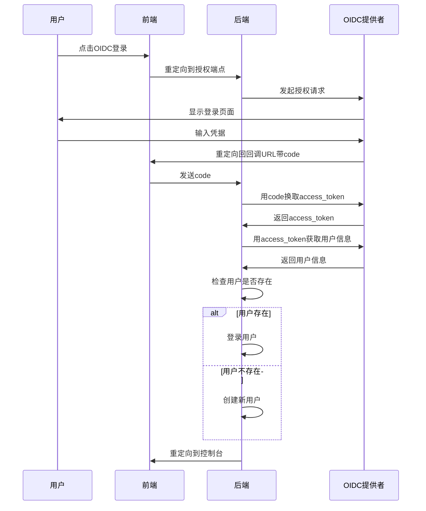
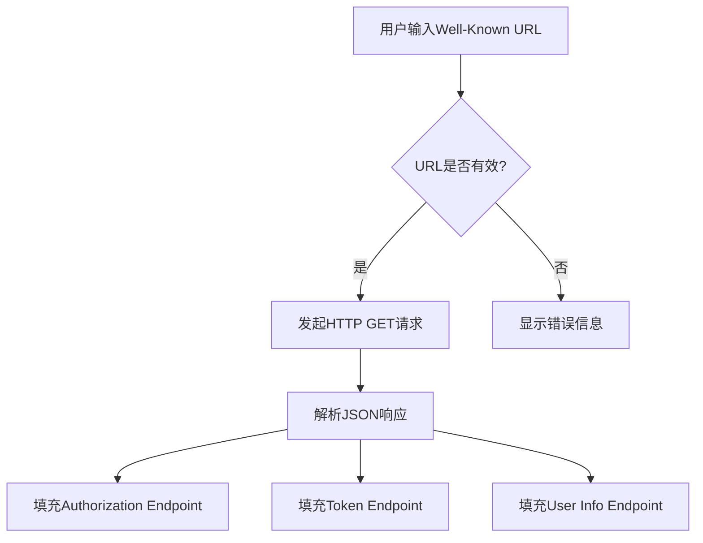

# OIDC配置

<cite>
**本文档引用文件**   
- [oidc.go](file://controller/oidc.go)
- [oidc.go](file://setting/system_setting/oidc.go)
- [config.go](file://setting/config/config.go)
- [SystemSetting.jsx](file://web/src/components/settings/SystemSetting.jsx)
- [user.go](file://model/user.go)
</cite>

## 目录
1. [OIDC配置字段详解](#oidc配置字段详解)
2. [全局配置管理机制](#全局配置管理机制)
3. [OAuth 2.0授权码流程实现](#oauth-20授权码流程实现)
4. [前端配置表单与后端字段映射](#前端配置表单与后端字段映射)
5. [敏感信息加密存储方案](#敏感信息加密存储方案)
6. [Well-Known配置自动发现功能](#well-known配置自动发现功能)
7. [回调URL设置与跨域问题解决](#回调url设置与跨域问题解决)
8. [常见错误码排查指南](#常见错误码排查指南)

## OIDC配置字段详解

`OIDCSettings` 结构体定义了OIDC身份认证所需的核心配置参数，位于 `setting/system_setting/oidc.go` 文件中。该结构体包含以下字段：

- **Enabled**: 布尔值，用于控制是否启用OIDC登录和注册功能。当设置为 `true` 时，系统允许用户通过OIDC提供商进行身份验证。
- **ClientId**: 字符串类型，表示在OIDC提供商处注册的应用程序的客户端ID。此ID用于标识应用程序并进行身份验证。
- **ClientSecret**: 字符串类型，表示在OIDC提供商处注册的应用程序的客户端密钥。此密钥用于安全地获取访问令牌，应妥善保管。
- **WellKnown**: 字符串类型，表示OIDC提供商的Well-Known配置端点URL（如 `/.well-known/openid-configuration`）。通过此URL可以自动获取其他端点信息。
- **AuthorizationEndpoint**: 字符串类型，表示OIDC提供商的授权端点URL。用户将被重定向到此URL以进行身份验证。
- **TokenEndpoint**: 字符串类型，表示OIDC提供商的令牌端点URL。系统将在此端点交换授权码以获取访问令牌。
- **UserInfoEndpoint**: 字符串类型，表示OIDC提供商的用户信息端点URL。系统将使用访问令牌从此端点获取用户的基本信息。

这些字段共同构成了OIDC身份认证的基础配置，确保系统能够正确与OIDC提供商进行交互。

**Section sources**
- [oidc.go](file://setting/system_setting/oidc.go#L5-L13)

## 全局配置管理机制

系统通过 `config.GlobalConfig.Register` 方法将 `OIDCSettings` 注册到全局配置管理器中。在 `setting/system_setting/oidc.go` 文件的 `init()` 函数中，调用 `config.GlobalConfig.Register("oidc", &defaultOIDCSettings)` 将默认的OIDC配置实例注册到全局配置管理器。这使得配置可以在应用程序的任何地方通过 `GetOIDCSettings()` 函数访问。

`GetOIDCSettings()` 函数返回一个指向 `defaultOIDCSettings` 的指针，实现了懒加载机制。这意味着配置对象只在首次请求时创建，并在整个应用程序生命周期内复用，提高了性能和资源利用率。全局配置管理器还负责从数据库加载和保存配置，确保配置的一致性和持久性。

**Section sources**
- [oidc.go](file://setting/system_setting/oidc.go#L18-L25)
- [config.go](file://setting/config/config.go#L19-L39)

## OAuth 2.0授权码流程实现

系统通过 `controller/oidc.go` 文件中的 `OidcAuth` 和 `OidcBind` 函数实现了OAuth 2.0授权码流程。`OidcAuth` 函数处理用户的登录请求，首先校验 `state` 参数以防止CSRF攻击。如果 `state` 参数有效且用户未登录，则调用 `getOidcUserInfoByCode` 函数获取用户信息。

`getOidcUserInfoByCode` 函数首先使用授权码向令牌端点请求访问令牌，然后使用访问令牌向用户信息端点请求用户信息。如果用户信息已存在且已绑定，则直接登录；否则，根据配置决定是否允许新用户注册。注册时，系统会从用户信息中提取邮箱、用户名和显示名称，并创建新用户。

`OidcBind` 函数用于将已登录用户的账户与OIDC账户绑定。它同样使用授权码获取用户信息，并检查该OIDC账户是否已被其他用户绑定。如果未被绑定，则将当前用户的 `OidcId` 更新为新的OIDC ID，完成绑定操作。

**Diagram sources**
- [oidc.go](file://controller/oidc.go#L104-L182)

**Section sources**
- [oidc.go](file://controller/oidc.go#L38-L102)
- [oidc.go](file://controller/oidc.go#L104-L182)

## 前端配置表单与后端字段映射

前端配置表单位于 `web/src/components/settings/SystemSetting.jsx` 文件中，提供了用户友好的界面来配置OIDC设置。表单中的每个输入字段都与后端 `OIDCSettings` 结构体的字段一一对应：

- **Well-Known URL**: 对应 `WellKnown` 字段，用户输入OIDC提供商的Well-Known配置端点URL。
- **Client ID**: 对应 `ClientId` 字段，用户输入在OIDC提供商处注册的应用程序的客户端ID。
- **Client Secret**: 对应 `ClientSecret` 字段，用户输入在OIDC提供商处注册的应用程序的客户端密钥。
- **Authorization Endpoint**: 对应 `AuthorizationEndpoint` 字段，用户输入OIDC提供商的授权端点URL。
- **Token Endpoint**: 对应 `TokenEndpoint` 字段，用户输入OIDC提供商的令牌端点URL。
- **User Info Endpoint**: 对应 `UserInfoEndpoint` 字段，用户输入OIDC提供商的用户信息端点URL。

表单还包含一个“保存OIDC设置”按钮，点击后会将用户输入的值提交到后端，更新相应的配置。

**Section sources**
- [SystemSetting.jsx](file://web/src/components/settings/SystemSetting.jsx#L501-L573)

## 敏感信息加密存储方案

系统对敏感信息如 `ClientSecret` 采用加密存储方案，确保数据的安全性。虽然具体的加密实现细节未在提供的代码片段中明确展示，但通常这类系统会使用环境变量或密钥管理系统来存储加密密钥，并在需要时解密敏感信息。此外，前端表单中 `ClientSecret` 字段被设置为密码类型，防止明文显示。

**Section sources**
- [SystemSetting.jsx](file://web/src/components/settings/SystemSetting.jsx#L1378-L1382)

## Well-Known配置自动发现功能

系统支持通过Well-Known配置自动发现功能简化OIDC配置过程。用户只需输入 `WellKnown` URL，系统会自动向该URL发起HTTP GET请求，获取包含 `authorization_endpoint`、`token_endpoint` 和 `userinfo_endpoint` 的JSON响应。然后，系统将这些端点信息填充到相应的配置字段中，减少手动配置的错误和复杂性。

**Diagram sources**
- [SystemSetting.jsx](file://web/src/components/settings/SystemSetting.jsx#L511-L516)

**Section sources**
- [SystemSetting.jsx](file://web/src/components/settings/SystemSetting.jsx#L502-L523)

## 回调URL设置与跨域问题解决

回调URL设置为 `${ServerAddress}/oauth/oidc`，其中 `ServerAddress` 是系统的服务器地址。确保在OIDC提供商处正确配置此回调URL，以便成功完成授权流程。关于跨域问题，系统通过CORS中间件处理跨域请求，允许指定的源访问API，从而解决前端与后端分离部署时的跨域限制。

**Section sources**
- [SystemSetting.jsx](file://web/src/components/settings/SystemSetting.jsx#L1347)

## 常见错误码排查指南

- **令牌获取失败**: 检查 `ClientId` 和 `ClientSecret` 是否正确，确认授权码未过期，以及网络连接正常。
- **用户信息获取失败**: 确认 `UserInfoEndpoint` 配置正确，访问令牌有效且具有足够的权限。
- **state参数校验失败**: 确保 `state` 参数在请求和回调之间保持一致，防止CSRF攻击。
- **账户绑定失败**: 检查目标OIDC账户是否已被其他用户绑定，确保当前用户已登录。

**Section sources**
- [oidc.go](file://controller/oidc.go#L62-L73)
- [oidc.go](file://controller/oidc.go#L84-L89)