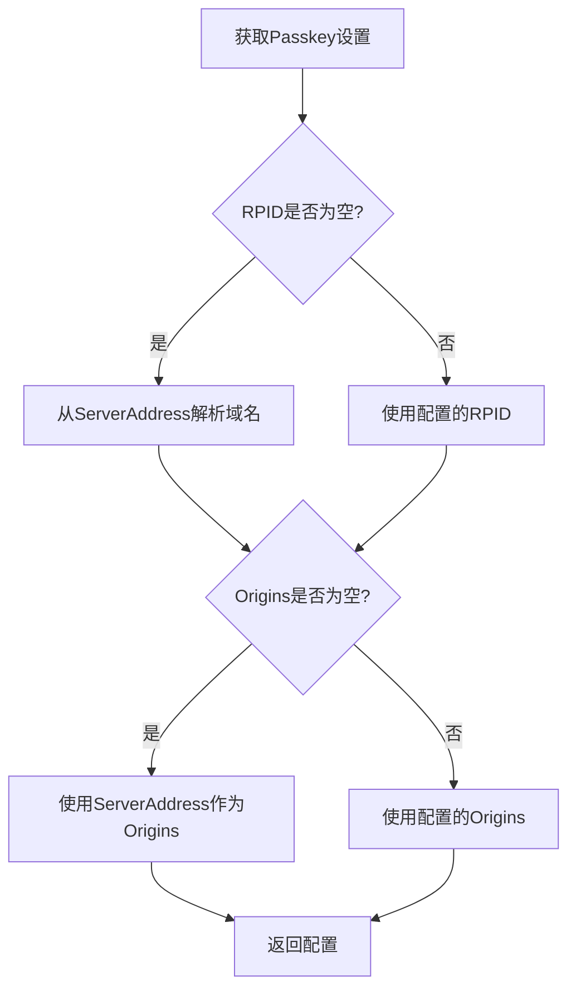
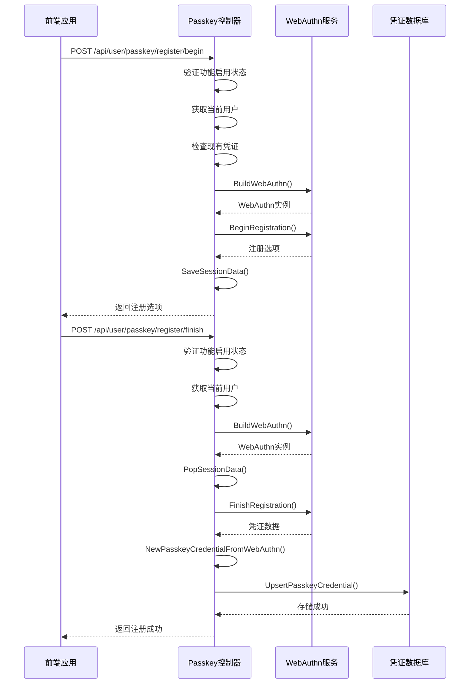
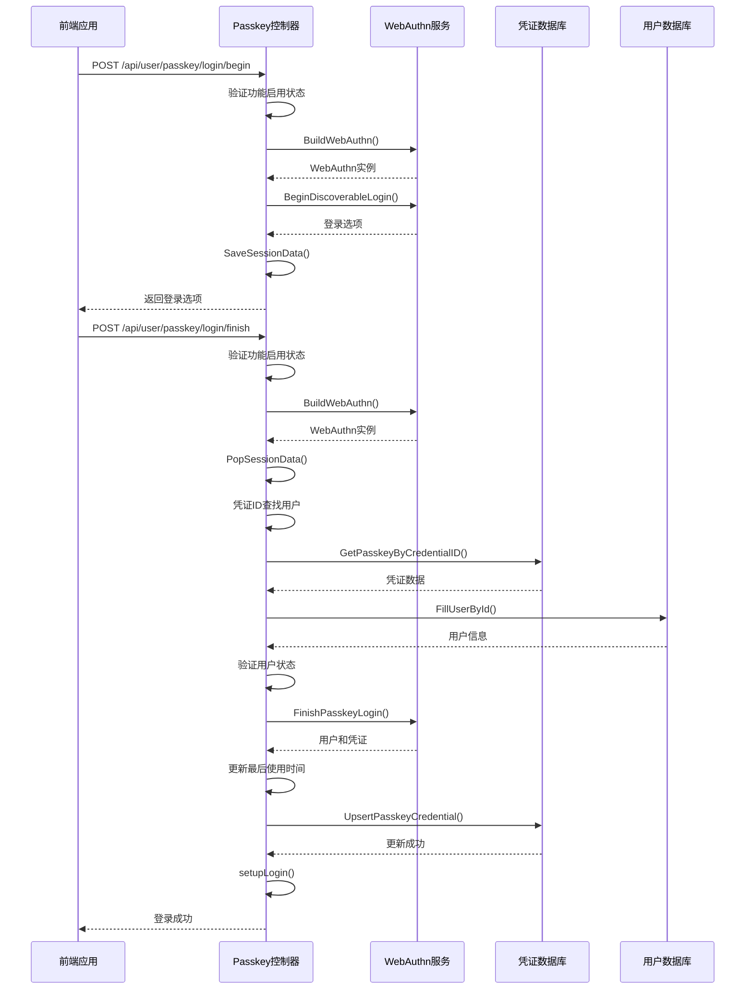
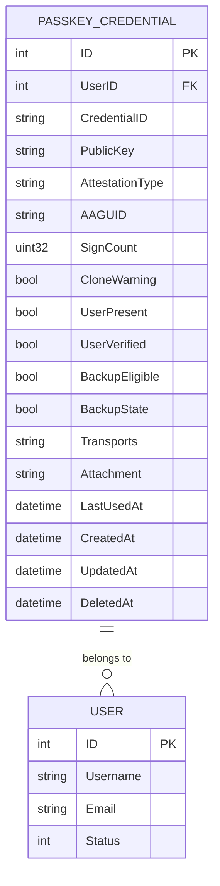
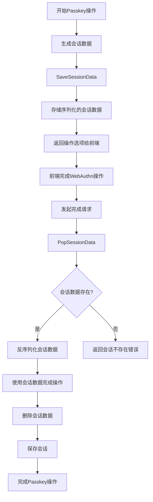

# Passkey管理

<cite>
**本文档引用文件**   
- [passkey.go](file://setting/system_setting/passkey.go)
- [passkey.go](file://controller/passkey.go)
- [passkey.go](file://model/passkey.go)
- [service.go](file://service/passkey/service.go)
- [session.go](file://service/passkey/session.go)
- [user.go](file://service/passkey/user.go)
- [passkey.js](file://web/src/helpers/passkey.js)
- [SystemSetting.jsx](file://web/src/components/settings/SystemSetting.jsx)
- [config.go](file://setting/config/config.go)
- [system_setting_old.go](file://setting/system_setting/system_setting_old.go)
</cite>

## 目录
1. [Passkey配置管理](#passkey配置管理)
2. [Passkey注册与认证流程](#passkey注册与认证流程)
3. [Passkey凭证存储结构](#passkey凭证存储结构)
4. [会话管理机制](#会话管理机制)
5. [前端集成指南](#前端集成指南)
6. [故障排除与安全审计](#故障排除与安全审计)

## Passkey配置管理

Passkey系统的配置通过`PasskeySettings`结构体进行管理，该结构体定义了WebAuthn协议所需的所有关键参数。系统通过`GetPasskeySettings`函数在运行时动态填充RPID和Origins的默认值。

`PasskeySettings`结构体包含以下配置项：

- **Enabled**: 启用开关，控制Passkey功能是否开启
- **RPDisplayName**: 信赖方显示名称，用于在认证过程中向用户显示服务名称
- **RPID**: 信赖方ID，必须是服务器域名，用于标识信赖方
- **Origins**: 信任源列表，指定允许进行Passkey操作的源地址
- **AllowInsecureOrigin**: 是否允许不安全源，控制是否允许HTTP协议的源
- **UserVerification**: 用户验证策略，定义用户验证的严格程度
- **AttachmentPreference**: 附件偏好，指定认证器的附件类型偏好

系统在初始化时通过`init`函数将默认配置注册到全局配置管理器中。`GetPasskeySettings`函数在运行时检查并自动填充RPID和Origins的默认值：当RPID为空时，从`ServerAddress`配置中解析域名作为RPID；当Origins为空时，使用`ServerAddress`作为默认信任源。



**Diagram sources**
- [passkey.go](file://setting/system_setting/passkey.go#L35-L49)

**Section sources**
- [passkey.go](file://setting/system_setting/passkey.go#L11-L50)

## Passkey注册与认证流程

Passkey的注册与认证流程遵循WebAuthn协议标准，通过一系列API端点实现。系统提供了完整的注册、登录和验证流程，确保无密码身份验证的安全性和可靠性。

### 注册流程

Passkey注册流程分为两个阶段：`PasskeyRegisterBegin`和`PasskeyRegisterFinish`。

1. **开始注册** (`PasskeyRegisterBegin`):
   - 验证Passkey功能是否启用
   - 获取当前会话用户
   - 检查用户是否已绑定Passkey
   - 构建WebAuthn实例
   - 创建注册选项并存储会话数据
   - 返回注册选项给前端

2. **完成注册** (`PasskeyRegisterFinish`):
   - 验证Passkey功能是否启用
   - 获取当前会话用户
   - 构建WebAuthn实例
   - 从会话中获取注册数据
   - 完成注册验证
   - 创建并存储Passkey凭证
   - 返回注册成功响应



**Diagram sources**
- [passkey.go](file://controller/passkey.go#L21-L142)

### 认证流程

Passkey认证流程同样分为两个阶段：`PasskeyLoginBegin`和`PasskeyLoginFinish`。

1. **开始登录** (`PasskeyLoginBegin`):
   - 验证Passkey功能是否启用
   - 构建WebAuthn实例
   - 开始可发现登录流程
   - 存储会话数据
   - 返回登录选项给前端

2. **完成登录** (`PasskeyLoginFinish`):
   - 验证Passkey功能是否启用
   - 构建WebAuthn实例
   - 从会话中获取登录数据
   - 使用凭证ID查找用户
   - 验证用户状态
   - 完成登录验证
   - 更新凭证信息
   - 建立用户会话



**Diagram sources**
- [passkey.go](file://controller/passkey.go#L203-L327)

### 验证流程

Passkey验证流程用于在敏感操作前验证用户身份，分为`PasskeyVerifyBegin`和`PasskeyVerifyFinish`两个阶段。

1. **开始验证** (`PasskeyVerifyBegin`):
   - 验证Passkey功能是否启用
   - 获取当前会话用户
   - 检查用户是否已绑定Passkey
   - 构建WebAuthn实例
   - 创建登录选项并存储会话数据
   - 返回验证选项给前端

2. **完成验证** (`PasskeyVerifyFinish`):
   - 验证Passkey功能是否启用
   - 获取当前会话用户
   - 检查用户是否已绑定Passkey
   - 构建WebAuthn实例
   - 从会话中获取验证数据
   - 完成登录验证
   - 更新凭证的最后使用时间
   - 返回验证成功响应

**Section sources**
- [passkey.go](file://controller/passkey.go#L21-L327)

## Passkey凭证存储结构

Passkey凭证在数据库中的存储结构由`PasskeyCredential`结构体定义，该结构体包含了WebAuthn协议所需的所有凭证信息。



`PasskeyCredential`结构体包含以下字段：

- **ID**: 主键，凭证的唯一标识符
- **UserID**: 外键，关联到用户的ID
- **CredentialID**: 凭证ID，Base64编码的凭证标识符
- **PublicKey**: 公钥，Base64编码的公钥数据
- **AttestationType**: 证明类型，描述凭证的证明类型
- **AAGUID**: 认证器全局唯一标识符，Base64编码的AAGUID
- **SignCount**: 签名计数，用于检测重放攻击
- **CloneWarning**: 克隆警告，指示凭证可能被克隆
- **UserPresent**: 用户存在标志，表示认证时用户是否在场
- **UserVerified**: 用户验证标志，表示认证时是否验证了用户身份
- **BackupEligible**: 备份资格，表示凭证是否可以备份
- **BackupState**: 备份状态，表示凭证是否已备份
- **Transports**: 传输方式，JSON编码的传输方式列表
- **Attachment**: 附件类型，表示认证器的附件类型
- **LastUsedAt**: 最后使用时间，记录凭证最后使用的时间
- **CreatedAt**: 创建时间，记录凭证创建的时间
- **UpdatedAt**: 更新时间，记录凭证最后更新的时间
- **DeletedAt**: 删除时间，软删除标记

系统提供了多个辅助方法来处理凭证数据：

- `TransportList()`: 将JSON编码的传输方式字符串解析为传输方式列表
- `SetTransports()`: 将传输方式列表序列化为JSON字符串
- `ToWebAuthnCredential()`: 将数据库凭证转换为WebAuthn库所需的凭证格式
- `NewPasskeyCredentialFromWebAuthn()`: 从WebAuthn凭证创建数据库凭证
- `ApplyValidatedCredential()`: 将验证后的凭证数据应用到现有凭证

凭证的存储采用"upsert"模式，即在创建新凭证时先删除用户现有的凭证，确保每个用户只有一个有效的Passkey凭证。

**Diagram sources**
- [passkey.go](file://model/passkey.go#L23-L42)

**Section sources**
- [passkey.go](file://model/passkey.go#L23-L211)

## 会话管理机制

Passkey系统的会话管理机制通过`service/passkey`包中的`session.go`文件实现，使用Gin框架的会话功能来安全地存储和管理WebAuthn协议所需的临时数据。

系统定义了三个会话键常量，分别用于不同的Passkey操作：

- **RegistrationSessionKey**: 用于存储注册过程中的会话数据
- **LoginSessionKey**: 用于存储登录过程中的会话数据
- **VerifySessionKey**: 用于存储验证过程中的会话数据

会话管理提供了两个核心函数：

1. **SaveSessionData**: 将WebAuthn会话数据保存到用户会话中
   - 接收Gin上下文、会话键和会话数据
   - 将会话数据序列化为JSON字符串
   - 存储到Gin会话中
   - 保存会话到存储后端

2. **PopSessionData**: 从用户会话中获取并删除会话数据
   - 接收Gin上下文和会话键
   - 从Gin会话中获取会话数据
   - 从会话中删除数据（一次性使用）
   - 保存会话更改
   - 将JSON字符串反序列化为会话数据
   - 返回会话数据

会话数据的"一次性使用"特性是WebAuthn协议安全性的关键，确保每个挑战只能使用一次，防止重放攻击。



**Diagram sources**
- [session.go](file://service/passkey/session.go#L14-L51)

**Section sources**
- [session.go](file://service/passkey/session.go#L1-L51)

## 前端集成指南

前端集成Passkey功能需要遵循WebAuthn API标准，并与后端API正确交互。系统提供了JavaScript帮助函数来简化前端集成。

### 安全上下文要求

Passkey功能要求在安全上下文中运行，即必须通过HTTPS协议访问。系统在`resolveOrigins`函数中强制执行此要求，除非明确允许不安全源。

### 用户界面设计建议

1. **注册界面**:
   - 提供清晰的Passkey注册引导
   - 显示支持的认证方式（指纹、面容、硬件密钥等）
   - 提供注册进度反馈

2. **登录界面**:
   - 在传统登录方式旁提供Passkey登录选项
   - 显示"使用您的设备登录"等友好提示
   - 支持条件性中介（Conditional Mediation）以实现无缝登录

3. **管理界面**:
   - 显示当前Passkey状态（已绑定/未绑定）
   - 提供解绑和重新注册选项
   - 显示最后使用时间

### 前端实现

前端通过`web/src/helpers/passkey.js`文件中的辅助函数与后端API交互：

- `base64UrlToBuffer()`: 将Base64URL字符串转换为ArrayBuffer
- `bufferToBase64Url()`: 将ArrayBuffer转换为Base64URL字符串
- `prepareCredentialCreationOptions()`: 准备注册选项
- `prepareCredentialRequestOptions()`: 准备登录选项
- `buildRegistrationResult()`: 构建注册结果
- `buildAssertionResult()`: 构建认证结果
- `isPasskeySupported()`: 检查浏览器是否支持Passkey

前端流程示例：

```mermaid
flowchart TD
A[检查Passkey支持] --> B{支持?}
B --> |是| C[调用注册开始API]
B --> |否| D[显示不支持提示]
C --> E[准备注册选项]
E --> F[调用navigator.credentials.create()]
F --> G{操作成功?}
G --> |是| H[构建注册结果]
G --> |否| I[显示错误信息]
H --> J[调用注册完成API]
J --> K{注册成功?}
K --> |是| L[显示成功提示]
K --> |否| M[显示错误信息]
```

**Section sources**
- [passkey.js](file://web/src/helpers/passkey.js#L1-L178)

## 故障排除与安全审计

### 常见问题及解决方案

1. **注册失败**
   - **可能原因**: 浏览器不支持Passkey、安全上下文问题、网络问题
   - **解决方案**: 检查浏览器兼容性、确保HTTPS、检查网络连接

2. **认证超时**
   - **可能原因**: 用户操作超时、会话数据过期
   - **解决方案**: 重新发起认证请求、检查服务器时间同步

3. **无法登录**
   - **可能原因**: 凭证被删除、用户被禁用、RPID配置错误
   - **解决方案**: 重新注册Passkey、检查用户状态、验证RPID配置

### 安全审计最佳实践

1. **配置审计**
   - 定期检查Passkey配置，确保RPID和Origins正确
   - 确保不安全源选项仅在开发环境中启用
   - 验证用户验证策略符合安全要求

2. **凭证管理**
   - 实施凭证轮换策略
   - 监控异常登录尝试
   - 提供用户凭证管理界面

3. **会话安全**
   - 确保会话数据的一次性使用
   - 监控会话数据的生命周期
   - 定期审查会话存储机制

4. **监控与日志**
   - 记录所有Passkey操作日志
   - 监控失败的认证尝试
   - 设置异常活动警报

**Section sources**
- [passkey.go](file://setting/system_setting/passkey.go#L35-L49)
- [service.go](file://service/passkey/service.go#L82-L129)
- [passkey.go](file://controller/passkey.go#L21-L327)