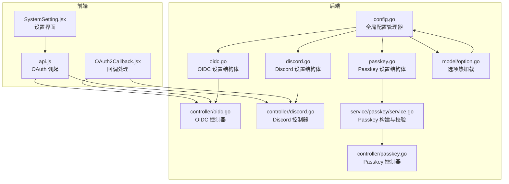
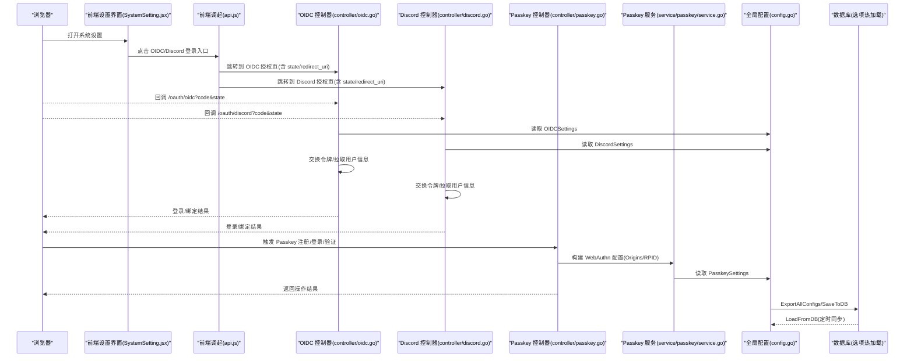
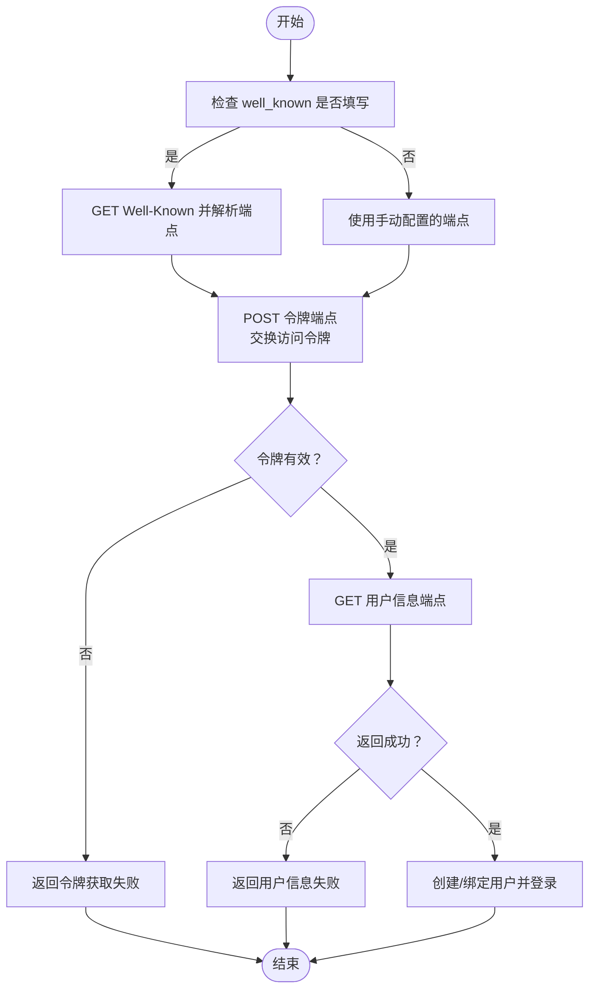
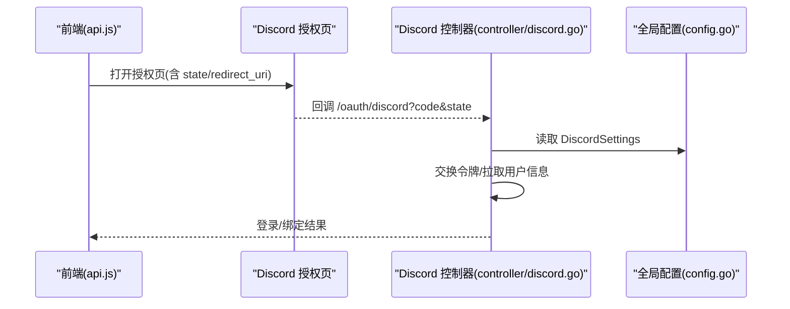
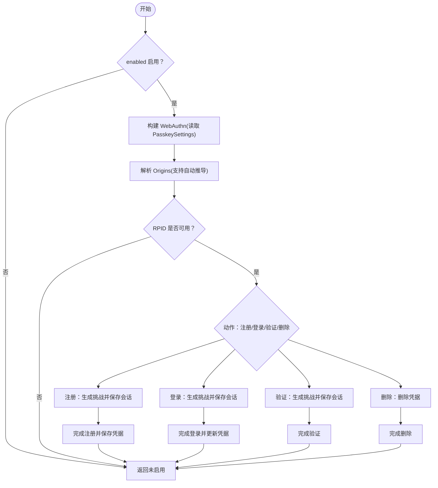
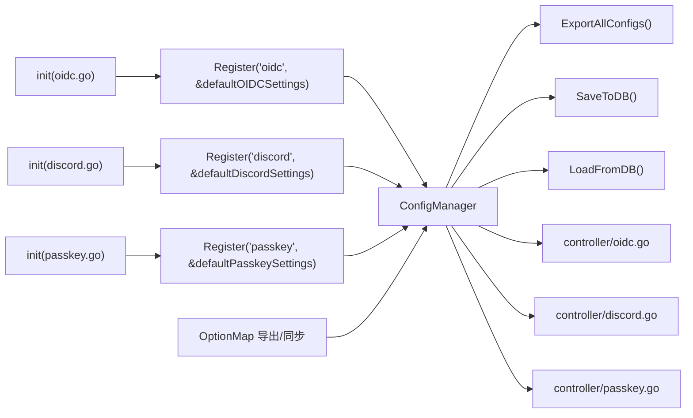

# 身份认证集成

<cite>
**本文引用的文件**
- [setting/system_setting/oidc.go](file://setting/system_setting/oidc.go)
- [controller/oidc.go](file://controller/oidc.go)
- [setting/system_setting/discord.go](file://setting/system_setting/discord.go)
- [controller/discord.go](file://controller/discord.go)
- [setting/system_setting/passkey.go](file://setting/system_setting/passkey.go)
- [service/passkey/service.go](file://service/passkey/service.go)
- [controller/passkey.go](file://controller/passkey.go)
- [setting/config/config.go](file://setting/config/config.go)
- [model/option.go](file://model/option.go)
- [web/src/components/settings/SystemSetting.jsx](file://web/src/components/settings/SystemSetting.jsx)
- [web/src/helpers/api.js](file://web/src/helpers/api.js)
- [web/src/components/auth/OAuth2Callback.jsx](file://web/src/components/auth/OAuth2Callback.jsx)
- [common/crypto.go](file://common/crypto.go)
</cite>

## 目录
1. [简介](#简介)
2. [项目结构](#项目结构)
3. [核心组件](#核心组件)
4. [架构总览](#架构总览)
5. [详细组件分析](#详细组件分析)
6. [依赖关系分析](#依赖关系分析)
7. [性能考量](#性能考量)
8. [故障排查指南](#故障排查指南)
9. [结论](#结论)
10. [附录](#附录)

## 简介
本文件面向系统管理员与开发者，提供“身份认证集成”的完整配置与运维指南，覆盖以下能力：
- OIDC 第三方登录：配置 OIDCSettings 结构体字段、Well-Known 自动发现、回调 URL、令牌获取与用户信息拉取。
- Discord OAuth：配置 Client ID/Secret、回调 URL、授权流程与用户绑定。
- Passkey 无密码登录：启用条件、RP/Origin/RPID 解析规则、HTTPS 要求、安全策略与前端交互。
- 全局配置管理：通过 config.GlobalConfig.Register 机制将各模块注册到统一配置中心，并支持热加载。
- 前后端映射：前端表单字段与后端配置键的对应关系示例（如 oidc.enabled）。
- 安全最佳实践：敏感信息存储与传输、错误处理与运维排障。

## 项目结构
围绕认证相关的关键目录与文件：
- 后端配置定义与注册：setting/system_setting/*、setting/config/config.go
- 控制器与业务逻辑：controller/*、service/passkey/*
- 前端设置界面与 OAuth 调起：web/src/components/settings/SystemSetting.jsx、web/src/helpers/api.js、web/src/components/auth/OAuth2Callback.jsx
- 配置热加载与选项同步：model/option.go

图表来源
- [setting/config/config.go](file://setting/config/config.go#L1-L120)
- [setting/system_setting/oidc.go](file://setting/system_setting/oidc.go#L1-L26)
- [controller/oidc.go](file://controller/oidc.go#L1-L120)
- [setting/system_setting/discord.go](file://setting/system_setting/discord.go#L1-L22)
- [controller/discord.go](file://controller/discord.go#L1-L120)
- [setting/system_setting/passkey.go](file://setting/system_setting/passkey.go#L1-L51)
- [service/passkey/service.go](file://service/passkey/service.go#L1-L120)
- [controller/passkey.go](file://controller/passkey.go#L1-L120)
- [model/option.go](file://model/option.go#L148-L200)
- [web/src/components/settings/SystemSetting.jsx](file://web/src/components/settings/SystemSetting.jsx#L1300-L1499)
- [web/src/helpers/api.js](file://web/src/helpers/api.js#L241-L286)

章节来源
- [setting/config/config.go](file://setting/config/config.go#L1-L120)
- [web/src/components/settings/SystemSetting.jsx](file://web/src/components/settings/SystemSetting.jsx#L1300-L1499)

## 核心组件
- OIDCSettings：定义 OIDC 登录所需的开关、Client ID/Secret、Well-Known 与各端点。
- DiscordSettings：定义 Discord 登录所需的开关、Client ID/Secret。
- PasskeySettings：定义 Passkey 登录所需的开关、RPDisplay、RPID、Origins、UserVerification、AttachmentPreference、AllowInsecureOrigin。
- 全局配置管理器：统一注册、导出、保存与加载配置，支持热更新。
- 控制器：分别实现 OIDC/Discord 回调、用户绑定与登录流程；Passkey 提供注册/登录/验证/删除等接口。
- 前端设置界面：提供 OIDC/Discord/Passkey 的配置表单与提示（回调 URL、Well-Known 自动发现）。

章节来源
- [setting/system_setting/oidc.go](file://setting/system_setting/oidc.go#L1-L26)
- [setting/system_setting/discord.go](file://setting/system_setting/discord.go#L1-L22)
- [setting/system_setting/passkey.go](file://setting/system_setting/passkey.go#L1-L51)
- [setting/config/config.go](file://setting/config/config.go#L1-L120)
- [controller/oidc.go](file://controller/oidc.go#L1-L120)
- [controller/discord.go](file://controller/discord.go#L1-L120)
- [controller/passkey.go](file://controller/passkey.go#L1-L120)
- [web/src/components/settings/SystemSetting.jsx](file://web/src/components/settings/SystemSetting.jsx#L1300-L1499)

## 架构总览
下图展示认证模块在前后端的交互路径与关键节点。

图表来源
- [web/src/components/settings/SystemSetting.jsx](file://web/src/components/settings/SystemSetting.jsx#L1300-L1499)
- [web/src/helpers/api.js](file://web/src/helpers/api.js#L241-L286)
- [controller/oidc.go](file://controller/oidc.go#L1-L120)
- [controller/discord.go](file://controller/discord.go#L1-L120)
- [controller/passkey.go](file://controller/passkey.go#L1-L120)
- [service/passkey/service.go](file://service/passkey/service.go#L1-L120)
- [setting/config/config.go](file://setting/config/config.go#L1-L120)
- [model/option.go](file://model/option.go#L148-L200)

## 详细组件分析

### OIDC 集成配置
- OIDCSettings 字段说明
  - enabled：是否启用 OIDC 登录/注册
  - client_id/client_secret：第三方提供商分配的客户端凭证
  - well_known：Well-Known 发现端点，可自动填充授权、令牌、用户信息端点
  - authorization_endpoint/token_endpoint/user_info_endpoint：手动配置时的端点地址
- 前端表单映射
  - 表单项键名前缀：oidc.*
  - 示例：oidc.enabled、oidc.client_id、oidc.client_secret、oidc.well_known、oidc.authorization_endpoint、oidc.token_endpoint、oidc.user_info_endpoint
- 回调 URL
  - 重定向地址固定为：服务地址 + /oauth/oidc
- 流程要点
  - 通过 well_known 自动发现时，前端会发起 GET 请求并解析返回的端点配置
  - 后端在回调中使用 client_id/client_secret 与 token_endpoint 交换访问令牌，并调用 userInfoEndpoint 拉取用户信息
  - 若用户不存在且允许注册，后端将创建用户并完成登录；否则返回错误或提示
- 故障排查
  - 令牌获取失败：检查 token_endpoint、client_id、client_secret、回调 URL 与网络连通性
  - 用户信息为空：检查 userInfoEndpoint 返回字段与权限范围
  - Well-Known URL 不合法：确认以 http/https 开头且可达

图表来源
- [web/src/components/settings/SystemSetting.jsx](file://web/src/components/settings/SystemSetting.jsx#L1300-L1499)
- [controller/oidc.go](file://controller/oidc.go#L1-L120)

章节来源
- [setting/system_setting/oidc.go](file://setting/system_setting/oidc.go#L1-L26)
- [controller/oidc.go](file://controller/oidc.go#L1-L120)
- [web/src/components/settings/SystemSetting.jsx](file://web/src/components/settings/SystemSetting.jsx#L1300-L1499)

### Discord OAuth 集成配置
- DiscordSettings 字段说明
  - enabled：是否启用 Discord 登录/注册
  - client_id/client_secret：Discord 应用的客户端凭证
- 前端表单映射
  - 表单项键名前缀：discord.*
  - 示例：discord.enabled、discord.client_id、discord.client_secret
- 回调 URL
  - 重定向地址固定为：服务地址 + /oauth/discord
- 流程要点
  - 前端调起授权页，携带 state 与 redirect_uri
  - 后端在回调中交换令牌并调用用户信息接口，随后创建/绑定用户并完成登录
- 故障排查
  - 令牌获取失败：检查 client_id/client_secret、回调 URL 与网络连通性
  - 用户信息为空：检查权限范围与返回字段

图表来源
- [web/src/helpers/api.js](file://web/src/helpers/api.js#L241-L286)
- [controller/discord.go](file://controller/discord.go#L1-L120)
- [setting/system_setting/discord.go](file://setting/system_setting/discord.go#L1-L22)

章节来源
- [setting/system_setting/discord.go](file://setting/system_setting/discord.go#L1-L22)
- [controller/discord.go](file://controller/discord.go#L1-L120)
- [web/src/helpers/api.js](file://web/src/helpers/api.js#L241-L286)
- [web/src/components/settings/SystemSetting.jsx](file://web/src/components/settings/SystemSetting.jsx#L1447-L1476)

### Passkey 无密码登录
- PasskeySettings 字段说明
  - enabled：是否启用 Passkey 登录/注册
  - rp_display_name：RP 显示名称，默认使用系统名称
  - rp_id：RPID，若为空则从 ServerAddress 推导
  - origins：允许的 Origin 列表，为空则默认使用 ServerAddress
  - allow_insecure_origin：是否允许不安全的 Origin（仅开发环境）
  - user_verification：用户验证偏好
  - attachment_preference：认证器附件偏好
- 启用条件与安全策略
  - 必须启用 enabled
  - 生产环境必须使用 HTTPS，否则会拒绝不安全 Origin
  - Origins 为空时，将自动从请求 Host 或 ServerAddress 推导
  - RPID 为空时，将从第一个 Origin 的 Host 推导
- 前端交互
  - 注册：Begin -> Finish（凭据写入数据库）
  - 登录：Begin -> Finish（凭据校验并更新 LastUsedAt）
  - 验证：Begin -> Finish（仅校验，不变更用户状态）
  - 删除：解除绑定
- 后端流程
  - 控制器根据 PasskeySettings 构建 WebAuthn 实例
  - 通过 Session 存储注册/登录/验证阶段的会话数据
  - 完成后更新凭据记录（签名计数、最后使用时间等）

图表来源
- [setting/system_setting/passkey.go](file://setting/system_setting/passkey.go#L1-L51)
- [service/passkey/service.go](file://service/passkey/service.go#L1-L120)
- [controller/passkey.go](file://controller/passkey.go#L1-L120)

章节来源
- [setting/system_setting/passkey.go](file://setting/system_setting/passkey.go#L1-L51)
- [service/passkey/service.go](file://service/passkey/service.go#L1-L120)
- [controller/passkey.go](file://controller/passkey.go#L1-L120)
- [web/src/components/settings/SystemSetting.jsx](file://web/src/components/settings/SystemSetting.jsx#L1092-L1218)

## 依赖关系分析
- 配置注册与热加载
  - 各模块在 init 中通过 config.GlobalConfig.Register 注册自身结构体
  - model/option.go 在应用启动时导出所有配置到 OptionMap，并周期性从数据库同步
  - 当某个配置键被更新时，handleConfigUpdate 会定位到对应模块并调用 UpdateConfigFromMap 更新内存中的结构体
- 控制器对设置的依赖
  - OIDC/Discord/Passkey 控制器均通过 system_setting.GetXxxSettings() 读取当前配置
  - 若配置缺失或不合法，控制器会返回明确错误信息

图表来源
- [setting/system_setting/oidc.go](file://setting/system_setting/oidc.go#L1-L26)
- [setting/system_setting/discord.go](file://setting/system_setting/discord.go#L1-L22)
- [setting/system_setting/passkey.go](file://setting/system_setting/passkey.go#L1-L51)
- [setting/config/config.go](file://setting/config/config.go#L1-L120)
- [model/option.go](file://model/option.go#L148-L200)
- [controller/oidc.go](file://controller/oidc.go#L1-L120)
- [controller/discord.go](file://controller/discord.go#L1-L120)
- [controller/passkey.go](file://controller/passkey.go#L1-L120)

章节来源
- [setting/config/config.go](file://setting/config/config.go#L1-L120)
- [model/option.go](file://model/option.go#L148-L200)

## 性能考量
- OIDC/Discord 回调链路中存在外部 HTTP 请求，建议：
  - 为令牌交换与用户信息接口设置合理的超时与重试策略
  - 对用户信息缓存（短期）以减少重复请求
- Passkey 登录涉及 WebAuthn 协议，建议：
  - 在高并发场景下合理安排会话存储（如 Redis）以避免竞争
  - 控制器中对 Session 的读写应尽量原子化，避免竞态
- 配置热加载：
  - ExportAllConfigs/SaveToDB/LoadFromDB 采用互斥锁保护，避免并发写冲突
  - OptionMap 的更新与 handleConfigUpdate 的触发在高频更新场景下需关注锁粒度

[本节为通用指导，无需列出具体文件来源]

## 故障排查指南
- OIDC
  - 症状：令牌获取失败
  - 排查：确认 well_known 或手动端点配置正确；核对 client_id/client_secret；检查回调 URL 与网络连通性
  - 症状：用户信息为空
  - 排查：确认 userInfoEndpoint 返回字段与 scope 权限
- Discord
  - 症状：令牌获取失败
  - 排查：确认 client_id/client_secret；核对回调 URL
  - 症状：用户信息为空
  - 排查：确认权限范围与返回字段
- Passkey
  - 症状：仅支持 HTTPS
  - 排查：生产环境必须使用 HTTPS；若必须本地调试，可在 Passkey 设置中允许不安全 Origin
  - 症状：Origin/RPID 解析失败
  - 排查：确认 origins/rp_id 配置；若为空，系统将尝试从 ServerAddress 或请求 Host 推导
- 配置热加载
  - 症状：修改设置后未生效
  - 排查：确认 OptionMap 同步频率与 handleConfigUpdate 是否触发；检查数据库中对应键值是否更新

章节来源
- [controller/oidc.go](file://controller/oidc.go#L1-L120)
- [controller/discord.go](file://controller/discord.go#L1-L120)
- [service/passkey/service.go](file://service/passkey/service.go#L1-L120)
- [model/option.go](file://model/option.go#L148-L200)

## 结论
本方案通过统一的配置管理器与清晰的控制器职责划分，实现了 OIDC、Discord、Passkey 三类第三方登录的标准化接入。前端提供了直观的配置界面与回调 URL 提示，后端在严格的安全策略下完成令牌交换与用户绑定。配合热加载机制，系统能够在不重启的情况下动态调整认证策略，满足生产环境的运维需求。

[本节为总结，无需列出具体文件来源]

## 附录

### 前后端配置键映射示例
- OIDC
  - 前端表单键：oidc.enabled、oidc.client_id、oidc.client_secret、oidc.well_known、oidc.authorization_endpoint、oidc.token_endpoint、oidc.user_info_endpoint
  - 后端读取：通过 system_setting.GetOIDCSettings() 获取
- Discord
  - 前端表单键：discord.enabled、discord.client_id、discord.client_secret
  - 后端读取：通过 system_setting.GetDiscordSettings() 获取
- Passkey
  - 前端表单键：passkey.enabled、passkey.rp_display_name、passkey.rp_id、passkey.origins、passkey.user_verification、passkey.attachment_preference、passkey.allow_insecure_origin
  - 后端读取：通过 system_setting.GetPasskeySettings() 获取

章节来源
- [web/src/components/settings/SystemSetting.jsx](file://web/src/components/settings/SystemSetting.jsx#L1300-L1499)
- [setting/system_setting/oidc.go](file://setting/system_setting/oidc.go#L1-L26)
- [setting/system_setting/discord.go](file://setting/system_setting/discord.go#L1-L22)
- [setting/system_setting/passkey.go](file://setting/system_setting/passkey.go#L1-L51)

### 回调 URL 设置
- OIDC：服务地址 + /oauth/oidc
- Discord：服务地址 + /oauth/discord
- GitHub：服务地址 + /oauth/github
- Linux DO：服务地址 + /oauth/linuxdo

章节来源
- [web/src/components/settings/SystemSetting.jsx](file://web/src/components/settings/SystemSetting.jsx#L1300-L1499)
- [web/src/helpers/api.js](file://web/src/helpers/api.js#L241-L286)

### 敏感信息加密存储最佳实践
- 建议
  - 对于需要持久化的敏感配置（如 Client Secret），在数据库侧进行加密存储（参考 CryptoSecret/HMAC 使用模式）
  - 传输过程中强制使用 HTTPS，避免明文泄露
  - 限制敏感信息在前端的可见范围，仅在提交时传输必要字段
- 参考实现思路
  - 使用 HMAC/加密算法对敏感字段进行签名或加密
  - 在读取时进行解密与校验，失败时拒绝服务

章节来源
- [common/crypto.go](file://common/crypto.go#L1-L32)