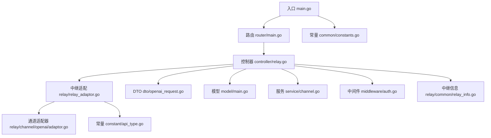
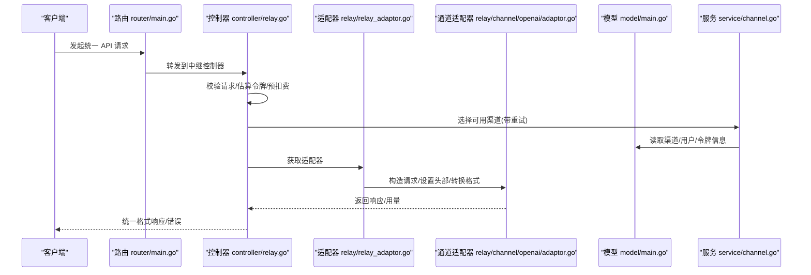
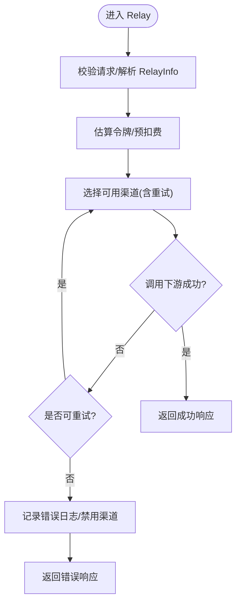
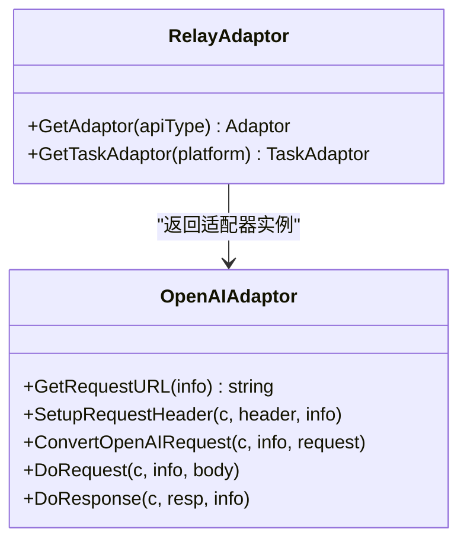
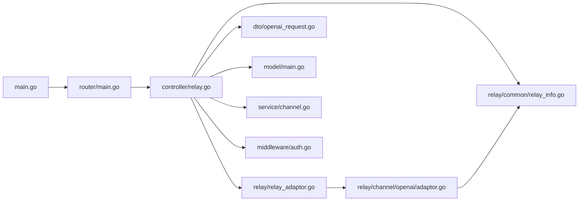

# 项目概述

<cite>
**本文引用的文件**
- [main.go](file://main.go)
- [README.md](file://README.md)
- [go.mod](file://go.mod)
- [router/main.go](file://router/main.go)
- [relay/relay_adaptor.go](file://relay/relay_adaptor.go)
- [controller/relay.go](file://controller/relay.go)
- [model/main.go](file://model/main.go)
- [common/constants.go](file://common/constants.go)
- [constant/api_type.go](file://constant/api_type.go)
- [relay/common/relay_info.go](file://relay/common/relay_info.go)
- [dto/openai_request.go](file://dto/openai_request.go)
- [middleware/auth.go](file://middleware/auth.go)
- [relay/channel/openai/adaptor.go](file://relay/channel/openai/adaptor.go)
- [service/channel.go](file://service/channel.go)
</cite>

## 目录
1. [引言](#引言)
2. [项目结构](#项目结构)
3. [核心组件](#核心组件)
4. [架构总览](#架构总览)
5. [详细组件分析](#详细组件分析)
6. [依赖关系分析](#依赖关系分析)
7. [性能考量](#性能考量)
8. [故障排查指南](#故障排查指南)
9. [结论](#结论)
10. [附录](#附录)

## 引言
New API 是在 One API 基础上进行二次开发的新一代大模型网关与 AI 资产管理系统。它提供统一的 OpenAI 风格 API 接口，兼容多种主流大模型厂商与生态（如 OpenAI、Claude、Gemini、Azure、AWS、阿里、百度、字节、火山、讯飞、Coze、Dify、Perplexity、Replicate、SiliconFlow、Vertex AI、Mistral、DeepSeek、Moonshot、MiniMax、Jina、Cloudflare、XAI、Xinference 等），并通过智能路由、格式转换、计费与配额、任务中继、实时对话、图像/音频/视频/嵌入/Rerank 等能力，实现“一次接入、多源调度”的统一网关体验。项目强调兼容性、可扩展性与可观测性，适合个人学习与团队内部使用。

## 项目结构
项目采用分层清晰的 Go 应用结构：
- 入口与启动：main.go 负责初始化环境、数据库、Redis、资源注入、路由注册与 HTTP 服务器启动。
- 路由层：router/main.go 注册 API、仪表盘、中继与视频路由，并根据 FRONTEND_BASE_URL 决定前端托管策略。
- 控制器层：controller/relay.go 实现统一的中继流程，负责请求校验、令牌估算、预扣费、渠道选择、重试与错误处理。
- 中继适配层：relay/relay_adaptor.go 将不同厂商 API 映射为统一适配器，按 API 类型返回对应适配器实例。
- 通道适配器：relay/channel/openai/adaptor.go 等实现具体厂商请求构造、头部设置、请求/响应转换、推理力度与格式兼容。
- DTO/模型/中间件/服务：dto/* 定义请求/响应结构；model/* 管理数据库迁移与连接；middleware/* 提供鉴权、限流、日志等；service/* 提供渠道选择、计费、敏感词检查、任务处理等。
- 常量与配置：constant/*、common/constants.go 定义 API 类型、上下文键、全局常量与运行参数；setting/* 提供系统/运营/比率等配置。

图表来源
- [main.go](file://main.go#L1-L170)
- [router/main.go](file://router/main.go#L1-L34)
- [controller/relay.go](file://controller/relay.go#L1-L120)
- [relay/relay_adaptor.go](file://relay/relay_adaptor.go#L1-L163)
- [relay/channel/openai/adaptor.go](file://relay/channel/openai/adaptor.go#L1-L120)
- [dto/openai_request.go](file://dto/openai_request.go#L1-L120)
- [model/main.go](file://model/main.go#L1-L120)
- [service/channel.go](file://service/channel.go#L1-L60)
- [middleware/auth.go](file://middleware/auth.go#L1-L120)
- [relay/common/relay_info.go](file://relay/common/relay_info.go#L1-L120)
- [common/constants.go](file://common/constants.go#L1-L120)
- [constant/api_type.go](file://constant/api_type.go#L1-L40)

章节来源
- [main.go](file://main.go#L1-L170)
- [router/main.go](file://router/main.go#L1-L34)

## 核心组件
- 统一中继控制器：负责请求校验、令牌估算、预扣费、渠道选择、重试与错误处理，覆盖文本、图像、音频、视频、嵌入、Rerank、Responses、实时对话等模式。
- 适配器体系：按 API 类型映射到各厂商适配器，完成请求 URL 构造、头部设置、请求体转换、响应处理与格式兼容。
- 令牌与鉴权：基于会话与 Access Token 的双轨鉴权，支持用户组、令牌组、模型限制、IP 白名单、跨组重试等策略。
- 计费与配额：支持按次计费、缓存计费、比率配置、预扣费与回退、错误日志记录与可视化看板。
- 数据与缓存：支持 SQLite/MySQL/PostgreSQL，内置 Redis 缓存与内存缓存，提供迁移、健康检查与批量更新。
- 任务中继：支持 Suno、Sora、Kling、Doubao、Vertex AI、Vidu 等平台的任务提交与轮询，统一错误与重试策略。

章节来源
- [controller/relay.go](file://controller/relay.go#L1-L200)
- [relay/relay_adaptor.go](file://relay/relay_adaptor.go#L1-L163)
- [middleware/auth.go](file://middleware/auth.go#L1-L200)
- [model/main.go](file://model/main.go#L1-L220)
- [service/channel.go](file://service/channel.go#L1-L113)

## 架构总览
New API 的核心是“统一入口 + 多厂商适配器 + 智能路由 + 计费与配额”的网关架构。客户端通过统一的 OpenAI 风格 API 访问，服务端根据令牌与用户组选择合适的渠道，构造目标厂商请求并处理响应，同时进行计费与配额管理。

图表来源
- [router/main.go](file://router/main.go#L1-L34)
- [controller/relay.go](file://controller/relay.go#L1-L200)
- [relay/relay_adaptor.go](file://relay/relay_adaptor.go#L1-L163)
- [relay/channel/openai/adaptor.go](file://relay/channel/openai/adaptor.go#L1-L120)
- [model/main.go](file://model/main.go#L1-L220)
- [service/channel.go](file://service/channel.go#L1-L113)

## 详细组件分析

### 统一中继控制器（controller/relay.go）
- 请求处理流程：根据 RelayFormat 选择对应处理器（文本/图像/音频/视频/嵌入/Rerank/Responses/实时），执行请求校验、令牌估算、预扣费、渠道选择与重试。
- 重试策略：依据错误码与类型决定是否重试，支持跨分组重试、特定渠道重试、超时与 5xx 重试等。
- 错误处理：记录错误日志、自动禁用异常渠道、返回统一错误格式。
- 实时对话：支持 WebSocket 协议升级与双向转发。
- 任务中继：针对视频/音乐等任务平台，提供提交与轮询流程。

图表来源
- [controller/relay.go](file://controller/relay.go#L1-L200)

章节来源
- [controller/relay.go](file://controller/relay.go#L1-L200)

### 适配器映射与通道适配（relay/relay_adaptor.go, relay/channel/openai/adaptor.go）
- 适配器映射：根据 API 类型返回对应适配器（OpenAI、Claude、Gemini、Azure、AWS、阿里、百度、字节、火山、讯飞、Coze、Dify、Perplexity、Replicate、SiliconFlow、Vertex AI、Mistral、DeepSeek、Moonshot、MiniMax、Jina、Cloudflare、XAI、Xinference 等）。
- OpenAI 适配器：负责请求 URL 构造（含 Azure 部署名、Responses API、Realtime）、头部设置（Authorization、Sec-WebSocket-Protocol）、请求体转换（推理力度、Reasoning、Thinking、格式兼容）、响应处理（流式/非流式、TTS/STT/图像/嵌入/Rerank/Responses）。
- 其他适配器：按厂商差异实现请求/响应转换与头部设置。

图表来源
- [relay/relay_adaptor.go](file://relay/relay_adaptor.go#L1-L163)
- [relay/channel/openai/adaptor.go](file://relay/channel/openai/adaptor.go#L1-L120)

章节来源
- [relay/relay_adaptor.go](file://relay/relay_adaptor.go#L1-L163)
- [relay/channel/openai/adaptor.go](file://relay/channel/openai/adaptor.go#L1-L200)

### 鉴权与令牌管理（middleware/auth.go）
- 会话与 Access Token 双轨鉴权：优先会话，否则使用 Authorization Bearer。
- 用户组与令牌组：支持令牌绑定特定用户组，结合比率配置与跨组重试策略。
- IP 限制与封禁：支持令牌 IP 白名单与用户封禁状态检查。
- 上下文注入：将用户、令牌、分组、限额等信息写入上下文，供后续流程使用。

章节来源
- [middleware/auth.go](file://middleware/auth.go#L1-L200)

### 数据模型与数据库（model/main.go）
- 数据库选择：支持 SQLite、MySQL、PostgreSQL，自动迁移核心表（用户、令牌、渠道、日志、任务、模型、供应商、配额等）。
- 日志库分离：支持独立的日志数据库连接，便于审计与分析。
- 连接池与健康检查：设置最大空闲/打开连接数、生命周期与定期 Ping。
- 初始化流程：加载环境变量、初始化数据库、选项、定价、Redis 等。

章节来源
- [model/main.go](file://model/main.go#L1-L220)

### 中继信息与请求建模（relay/common/relay_info.go, dto/openai_request.go）
- RelayInfo：封装请求上下文（用户、令牌、分组、模型、URL、流式、用量、价格、渠道元数据、推理力度等），用于适配器与控制器协作。
- DTO：定义通用 OpenAI 请求结构（消息、工具、音频、图像、视频、文件、Reasoning、Thinking 等），并提供令牌估算元数据提取。

章节来源
- [relay/common/relay_info.go](file://relay/common/relay_info.go#L1-L200)
- [dto/openai_request.go](file://dto/openai_request.go#L1-L220)

### 渠道选择与自动禁用（service/channel.go）
- 渠道选择：按用户组、令牌组、模型限制、可用性与权重随机选择，支持跨组重试。
- 自动禁用：根据错误类型与关键字自动禁用异常渠道，并通知管理员。
- 自动启用：在满足条件时自动恢复渠道。

章节来源
- [service/channel.go](file://service/channel.go#L1-L113)

### 常量与全局配置（common/constants.go, constant/api_type.go）
- 常量：版本、角色、配额、速率限制、重试次数、请求间隔、调试开关、缓存开关等。
- API 类型：统一枚举各类厂商与平台类型，便于适配器映射与路由分发。

章节来源
- [common/constants.go](file://common/constants.go#L1-L208)
- [constant/api_type.go](file://constant/api_type.go#L1-L40)

## 依赖关系分析
- 启动阶段依赖：main.go 依赖 common、model、router、service、setting 等模块完成初始化与资源注入。
- 路由阶段依赖：router/main.go 依赖 Gin 并注册 API、仪表盘、中继与视频路由。
- 控制器依赖：controller/relay.go 依赖 relay helper、service、model、dto、types 等模块。
- 适配器依赖：relay/relay_adaptor.go 依赖 constant 与各通道适配器；openai 适配器依赖 relay/common、dto、service 等。
- 中间件依赖：middleware/auth.go 依赖 model、service、constant 等。
- 数据层依赖：model/main.go 依赖 gorm、sqlite/mysql/postgres 驱动与 common。

图表来源
- [main.go](file://main.go#L1-L170)
- [router/main.go](file://router/main.go#L1-L34)
- [controller/relay.go](file://controller/relay.go#L1-L200)
- [relay/relay_adaptor.go](file://relay/relay_adaptor.go#L1-L163)
- [relay/channel/openai/adaptor.go](file://relay/channel/openai/adaptor.go#L1-L120)
- [dto/openai_request.go](file://dto/openai_request.go#L1-L120)
- [model/main.go](file://model/main.go#L1-L220)
- [service/channel.go](file://service/channel.go#L1-L113)
- [middleware/auth.go](file://middleware/auth.go#L1-L200)
- [relay/common/relay_info.go](file://relay/common/relay_info.go#L1-L120)

章节来源
- [go.mod](file://go.mod#L1-L124)

## 性能考量
- 连接池与并发：合理设置 SQL_MAX_IDLE_CONNS、SQL_MAX_OPEN_CONNS、SQL_MAX_LIFETIME，避免连接争用与泄漏。
- 缓存策略：启用 Redis 或内存缓存，降低数据库压力；注意缓存一致性与失效策略。
- 流式传输：开启流式选项时，注意下游厂商支持情况与缓冲大小（STREAM_SCANNER_MAX_BUFFER_MB）。
- 重试与退避：根据错误类型与状态码设置合理的重试次数与等待时间，避免雪崩效应。
- 监控与诊断：启用 pprof（ENABLE_PPROF）与日志分析，定位慢请求与异常渠道。

[本节为通用指导，不直接分析具体文件]

## 故障排查指南
- 无法启动或连接数据库：检查 SQL_DSN、数据库驱动与字符集（MySQL 需 utf8mb4/utf8/gbk/big5/gb18030），确认迁移完成。
- 令牌无效或权限不足：核对 Authorization、New-Api-User、令牌组与用户组、模型限制与 IP 白名单。
- 渠道频繁失败：查看错误日志与自动禁用机制，确认是否触发自动禁用；检查渠道密钥、API 版本与网络连通性。
- 实时对话异常：确认 WebSocket 协议头（Sec-WebSocket-Protocol）与 Azure/Realtime 特殊路径。
- 计费与配额异常：核对预扣费、回退逻辑与比率配置，检查错误日志中的 admin_info 与 use_channel 列表。

章节来源
- [controller/relay.go](file://controller/relay.go#L200-L501)
- [service/channel.go](file://service/channel.go#L1-L113)
- [middleware/auth.go](file://middleware/auth.go#L1-L200)

## 结论
New API 通过统一的中继控制器与多厂商适配器体系，实现了对多家大模型平台的统一接入与智能调度。其在兼容性、可扩展性、计费与配额、任务中继与实时对话等方面具备显著优势，适合需要统一网关与资产管理的团队与个人使用。建议在生产环境中合理配置数据库、缓存与监控，并结合业务需求调整重试策略与渠道权重。

[本节为总结性内容，不直接分析具体文件]

## 附录
- 项目背景与二次开发：基于 One API 进行增强，保持数据兼容与接口一致。
- 主要特性概览：UI 新、多语言、支付与计费、授权与安全、API 格式支持、智能路由、格式转换、Reasoning Effort 支持、模型与接口支持广泛。
- 部署与环境变量：支持 Docker 与宝塔面板部署，提供常见环境变量说明与多机部署注意事项。

章节来源
- [README.md](file://README.md#L1-L200)
- [README.md](file://README.md#L280-L451)